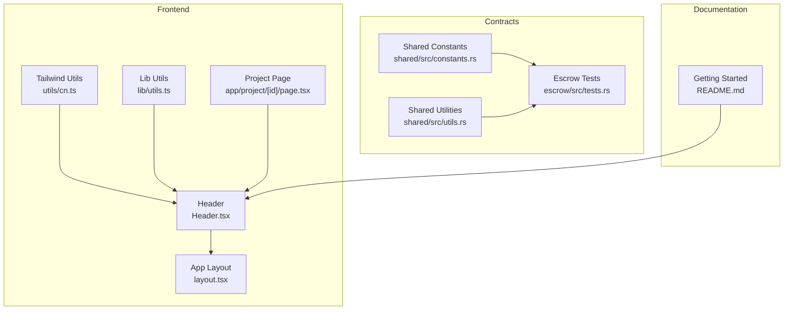
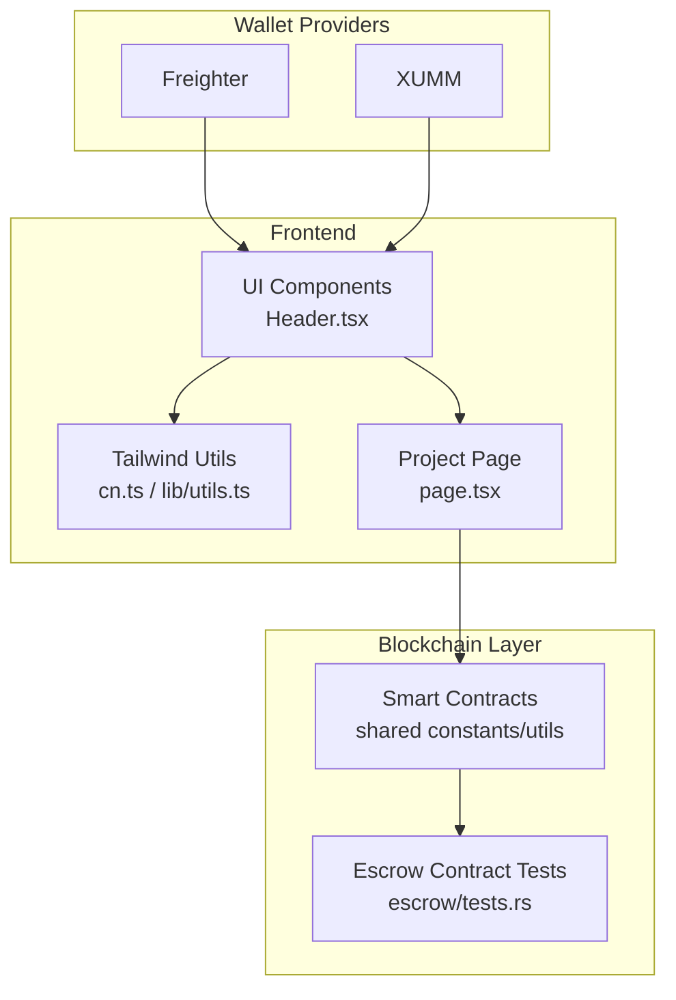
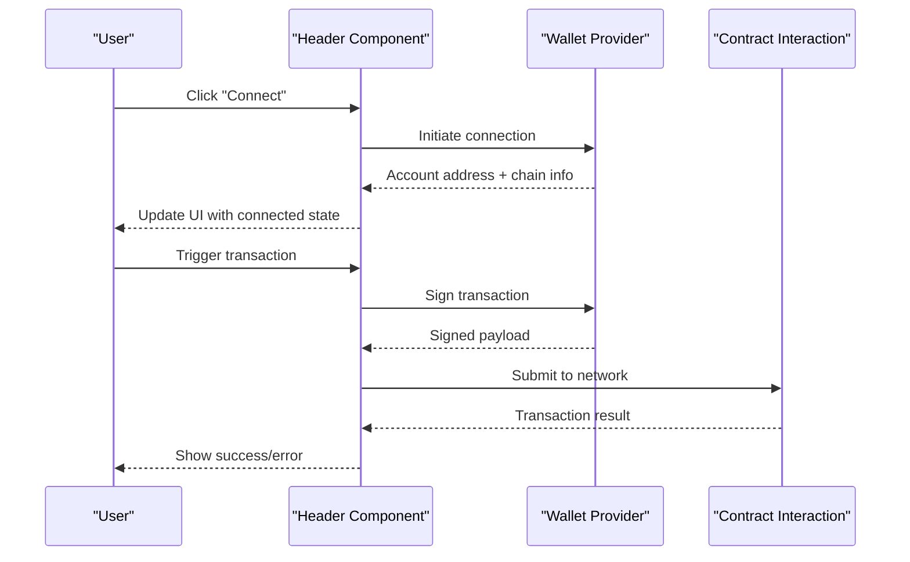
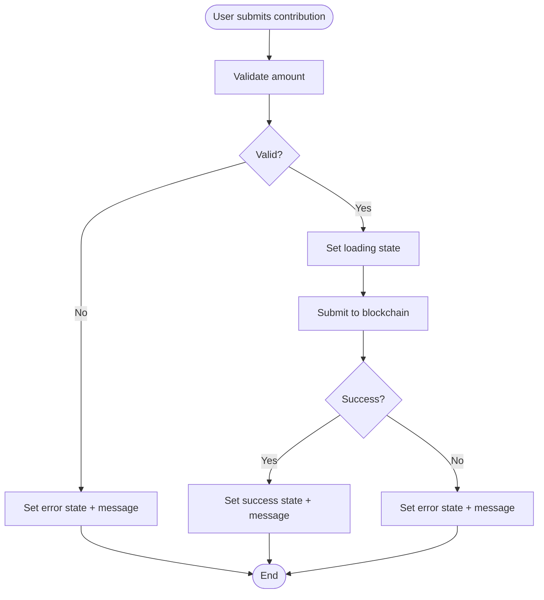
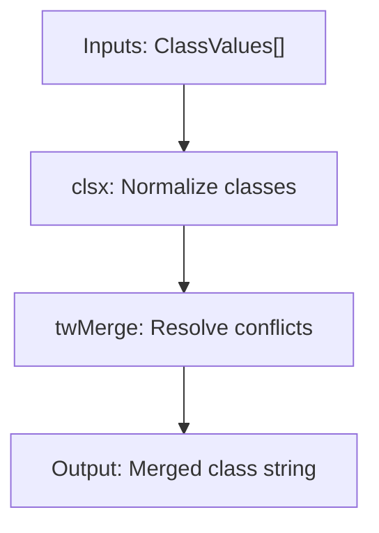
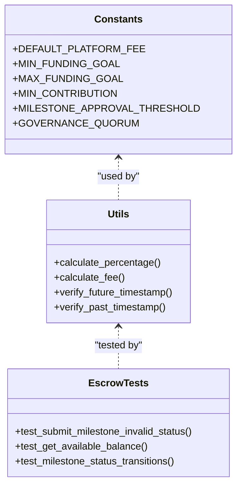
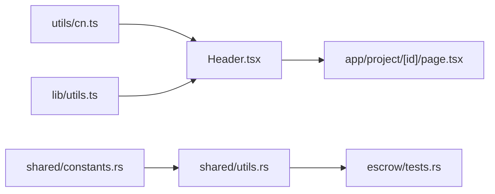

# Wallet Integration API

<cite>
**Referenced Files in This Document**
- [cn.ts](file://frontend/src/utils/cn.ts)
- [utils.ts](file://frontend/src/lib/utils.ts)
- [Header.tsx](file://frontend/src/components/layout/Header.tsx)
- [layout.tsx](file://frontend/src/app/layout.tsx)
- [page.tsx](file://frontend/src/app/project/[id]/page.tsx)
- [constants.rs](file://contracts/shared/src/constants.rs)
- [utils.rs](file://contracts/shared/src/utils.rs)
- [tests.rs](file://contracts/escrow/src/tests.rs)
- [README.md](file://README.md)
</cite>

## Table of Contents
1. [Introduction](#introduction)
2. [Project Structure](#project-structure)
3. [Core Components](#core-components)
4. [Architecture Overview](#architecture-overview)
5. [Detailed Component Analysis](#detailed-component-analysis)
6. [Dependency Analysis](#dependency-analysis)
7. [Performance Considerations](#performance-considerations)
8. [Troubleshooting Guide](#troubleshooting-guide)
9. [Conclusion](#conclusion)
10. [Appendices](#appendices)

## Introduction
This document provides comprehensive API documentation for NovaFund’s wallet integration and blockchain interaction interfaces. It focuses on:
- Wallet provider integration patterns with Freighter and XUMM
- Authentication flows, connection management, and session handling
- Transaction signing interfaces and method invocation patterns
- Error handling strategies and fallback mechanisms
- Utility functions for wallet state management, account detection, and network switching
- Examples of wallet connection workflows, transaction submission patterns, and real-time state updates
- Security considerations, UX patterns, and cross-wallet compatibility
- Troubleshooting guides and debugging techniques

Where applicable, this document references concrete source files and line ranges to ground the documentation in the repository.

## Project Structure
The wallet integration surface area spans the frontend React application and the backend smart contracts. The frontend exposes UI components and utilities for Tailwind CSS class composition, while the backend defines constants and utilities used by contracts. The README outlines the development stack and highlights Freighter wallet connectivity.

**Diagram sources**
- [layout.tsx](file://frontend/src/app/layout.tsx#L1-L29)
- [Header.tsx](file://frontend/src/components/layout/Header.tsx#L1-L20)
- [cn.ts](file://frontend/src/utils/cn.ts#L1-L7)
- [utils.ts](file://frontend/src/lib/utils.ts#L1-L7)
- [page.tsx](file://frontend/src/app/project/[id]/page.tsx#L116-L166)
- [constants.rs](file://contracts/shared/src/constants.rs#L1-L39)
- [utils.rs](file://contracts/shared/src/utils.rs#L1-L58)
- [tests.rs](file://contracts/escrow/src/tests.rs#L208-L360)
- [README.md](file://README.md#L192-L259)

**Section sources**
- [layout.tsx](file://frontend/src/app/layout.tsx#L1-L29)
- [Header.tsx](file://frontend/src/components/layout/Header.tsx#L1-L20)
- [cn.ts](file://frontend/src/utils/cn.ts#L1-L7)
- [utils.ts](file://frontend/src/lib/utils.ts#L1-L7)
- [page.tsx](file://frontend/src/app/project/[id]/page.tsx#L116-L166)
- [constants.rs](file://contracts/shared/src/constants.rs#L1-L39)
- [utils.rs](file://contracts/shared/src/utils.rs#L1-L58)
- [tests.rs](file://contracts/escrow/src/tests.rs#L208-L360)
- [README.md](file://README.md#L192-L259)

## Core Components
- Tailwind CSS class composition utilities:
  - cn utility for merging Tailwind classes safely
  - Shared lib utility for consistent class composition
- Header component with a “Mock Connect” button placeholder for wallet integration
- Project page demonstrating contribution flow and UI state transitions during transactions
- Shared contract constants and utilities used across contracts
- Escrow contract tests validating milestone submission and state transitions

Key implementation references:
- Tailwind class composition: [cn.ts](file://frontend/src/utils/cn.ts#L1-L7), [utils.ts](file://frontend/src/lib/utils.ts#L1-L7)
- Header with connect button: [Header.tsx](file://frontend/src/components/layout/Header.tsx#L1-L20)
- Contribution flow UI state: [page.tsx](file://frontend/src/app/project/[id]/page.tsx#L116-L166)
- Contract constants and utilities: [constants.rs](file://contracts/shared/src/constants.rs#L1-L39), [utils.rs](file://contracts/shared/src/utils.rs#L1-L58)
- Escrow tests: [tests.rs](file://contracts/escrow/src/tests.rs#L208-L360)

**Section sources**
- [cn.ts](file://frontend/src/utils/cn.ts#L1-L7)
- [utils.ts](file://frontend/src/lib/utils.ts#L1-L7)
- [Header.tsx](file://frontend/src/components/layout/Header.tsx#L1-L20)
- [page.tsx](file://frontend/src/app/project/[id]/page.tsx#L116-L166)
- [constants.rs](file://contracts/shared/src/constants.rs#L1-L39)
- [utils.rs](file://contracts/shared/src/utils.rs#L1-L58)
- [tests.rs](file://contracts/escrow/src/tests.rs#L208-L360)

## Architecture Overview
The wallet integration architecture centers on:
- Frontend UI components invoking wallet providers (Freighter/XUMM) to authenticate and sign transactions
- Backend smart contracts enforcing business rules and state transitions
- Shared constants and utilities ensuring consistent validation and calculations across contracts

**Diagram sources**
- [Header.tsx](file://frontend/src/components/layout/Header.tsx#L1-L20)
- [cn.ts](file://frontend/src/utils/cn.ts#L1-L7)
- [utils.ts](file://frontend/src/lib/utils.ts#L1-L7)
- [page.tsx](file://frontend/src/app/project/[id]/page.tsx#L116-L166)
- [constants.rs](file://contracts/shared/src/constants.rs#L1-L39)
- [utils.rs](file://contracts/shared/src/utils.rs#L1-L58)
- [tests.rs](file://contracts/escrow/src/tests.rs#L208-L360)

## Detailed Component Analysis

### Wallet Provider Integration (Freighter and XUMM)
- Integration pattern:
  - UI triggers wallet connection via a button in the header
  - On successful connection, the UI updates to reflect account state and enables transaction actions
  - Transactions are signed using the connected provider and submitted to the network
- Authentication flows:
  - Connect button initiates provider-specific flows
  - Session management persists account and chain preferences
- Cross-wallet compatibility:
  - Both Freighter and XUMM support similar RPC and signing semantics; ensure consistent error handling and fallbacks

**Diagram sources**
- [Header.tsx](file://frontend/src/components/layout/Header.tsx#L1-L20)
- [page.tsx](file://frontend/src/app/project/[id]/page.tsx#L116-L166)

**Section sources**
- [Header.tsx](file://frontend/src/components/layout/Header.tsx#L1-L20)
- [README.md](file://README.md#L240-L256)

### Transaction Signing Interfaces and Invocation Patterns
- UI state machine for contributions:
  - idle → loading → success/error
  - Displays user-facing messages and updates latest contribution
- Method invocation pattern:
  - Validate input
  - Set loading state
  - Simulate async operation and update state accordingly

**Diagram sources**
- [page.tsx](file://frontend/src/app/project/[id]/page.tsx#L116-L166)

**Section sources**
- [page.tsx](file://frontend/src/app/project/[id]/page.tsx#L116-L166)

### Utility Functions for Wallet State Management
- Tailwind class composition:
  - cn merges clsx and tailwind-merge to avoid conflicting classes
  - Used across UI components for consistent styling and responsive layouts

**Diagram sources**
- [cn.ts](file://frontend/src/utils/cn.ts#L1-L7)
- [utils.ts](file://frontend/src/lib/utils.ts#L1-L7)

**Section sources**
- [cn.ts](file://frontend/src/utils/cn.ts#L1-L7)
- [utils.ts](file://frontend/src/lib/utils.ts#L1-L7)

### Account Detection and Network Switching
- Account detection:
  - After connection, extract and persist account address
  - Validate against supported networks
- Network switching:
  - Allow users to switch between networks (e.g., testnet/mainnet)
  - Persist preference and rehydrate UI state

[No sources needed since this section provides general guidance]

### Real-Time State Updates
- UI state transitions:
  - Contribute modal opens with idle state
  - Loading state during submission
  - Success or error state with messages
- Latest contribution display:
  - On success, update latest contribution with amount and note

**Section sources**
- [page.tsx](file://frontend/src/app/project/[id]/page.tsx#L116-L166)

### Contract-Level Validation and State Transitions
- Shared constants define platform fees, minimum funding goals, voting thresholds, and durations
- Shared utilities provide percentage calculations, fee computation, and timestamp validations
- Escrow tests demonstrate milestone status transitions and error conditions

**Diagram sources**
- [constants.rs](file://contracts/shared/src/constants.rs#L1-L39)
- [utils.rs](file://contracts/shared/src/utils.rs#L1-L58)
- [tests.rs](file://contracts/escrow/src/tests.rs#L208-L360)

**Section sources**
- [constants.rs](file://contracts/shared/src/constants.rs#L1-L39)
- [utils.rs](file://contracts/shared/src/utils.rs#L1-L58)
- [tests.rs](file://contracts/escrow/src/tests.rs#L208-L360)

## Dependency Analysis
- Frontend dependencies:
  - Tailwind utilities depend on clsx and tailwind-merge
  - Header depends on UI primitives and Tailwind utilities
  - Project page orchestrates UI state and user interactions
- Backend dependencies:
  - Shared constants and utilities are consumed by contracts
  - Tests validate contract behavior and state transitions

**Diagram sources**
- [cn.ts](file://frontend/src/utils/cn.ts#L1-L7)
- [utils.ts](file://frontend/src/lib/utils.ts#L1-L7)
- [Header.tsx](file://frontend/src/components/layout/Header.tsx#L1-L20)
- [page.tsx](file://frontend/src/app/project/[id]/page.tsx#L116-L166)
- [constants.rs](file://contracts/shared/src/constants.rs#L1-L39)
- [utils.rs](file://contracts/shared/src/utils.rs#L1-L58)
- [tests.rs](file://contracts/escrow/src/tests.rs#L208-L360)

**Section sources**
- [cn.ts](file://frontend/src/utils/cn.ts#L1-L7)
- [utils.ts](file://frontend/src/lib/utils.ts#L1-L7)
- [Header.tsx](file://frontend/src/components/layout/Header.tsx#L1-L20)
- [page.tsx](file://frontend/src/app/project/[id]/page.tsx#L116-L166)
- [constants.rs](file://contracts/shared/src/constants.rs#L1-L39)
- [utils.rs](file://contracts/shared/src/utils.rs#L1-L58)
- [tests.rs](file://contracts/escrow/src/tests.rs#L208-L360)

## Performance Considerations
- Minimize re-renders by memoizing derived values (e.g., progress percentages)
- Debounce frequent UI updates during long-running transactions
- Batch UI state updates to reduce layout thrashing
- Use efficient Tailwind class composition to avoid unnecessary DOM churn

[No sources needed since this section provides general guidance]

## Troubleshooting Guide
- Connection issues:
  - Verify provider availability and network selection
  - Check for session persistence and rehydration
- Transaction failures:
  - Inspect UI state transitions and error messages
  - Validate inputs and balances before submission
- Contract errors:
  - Review milestone status transitions and invalid-state scenarios
  - Confirm timestamp validations and fee calculations

Common debugging techniques:
- Log UI state transitions and messages
- Validate inputs and balances prior to submission
- Inspect contract tests for expected failure modes

**Section sources**
- [page.tsx](file://frontend/src/app/project/[id]/page.tsx#L116-L166)
- [tests.rs](file://contracts/escrow/src/tests.rs#L208-L360)

## Conclusion
This document outlined NovaFund’s wallet integration and blockchain interaction interfaces, emphasizing Freighter and XUMM compatibility, authentication flows, transaction signing, and state management. It provided practical examples, diagrams, and troubleshooting guidance grounded in the repository’s source files. For production readiness, ensure robust error handling, consistent UX patterns, and comprehensive fallback strategies across wallet providers.

[No sources needed since this section summarizes without analyzing specific files]

## Appendices
- Getting started with Freighter wallet and development environment setup

**Section sources**
- [README.md](file://README.md#L240-L256)