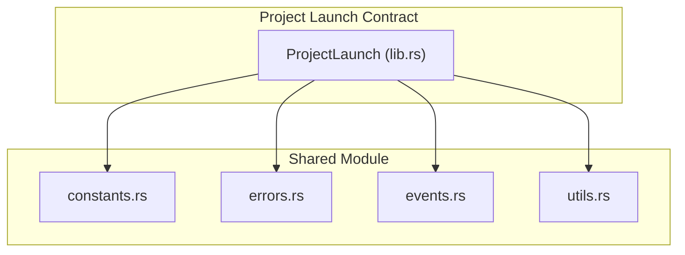
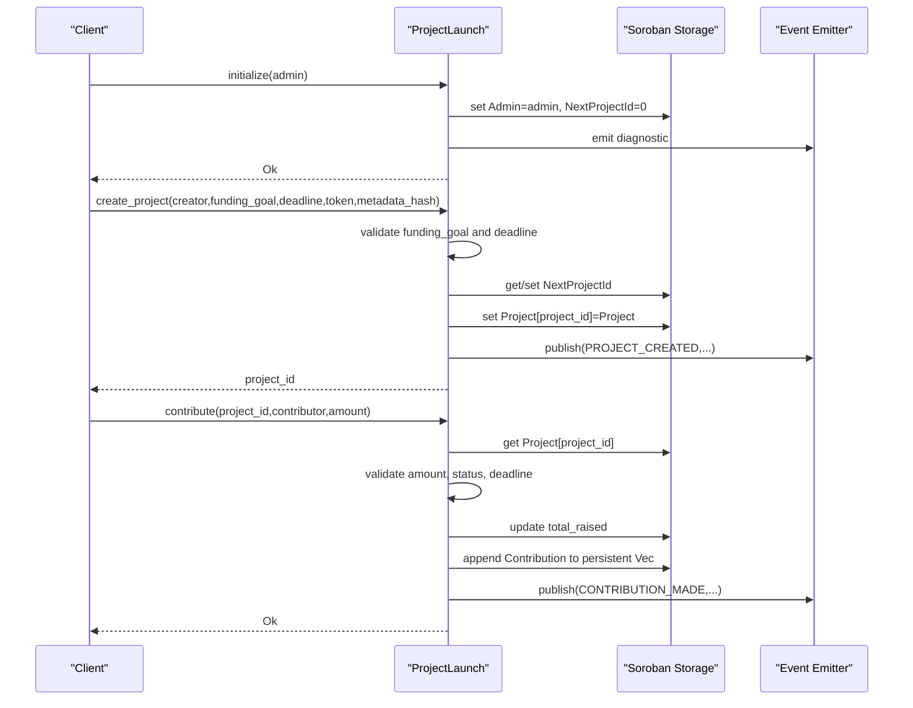
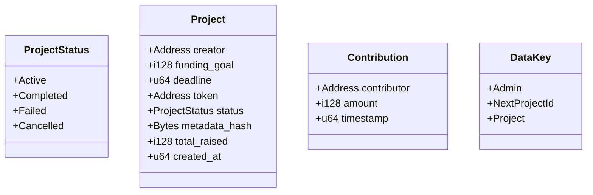
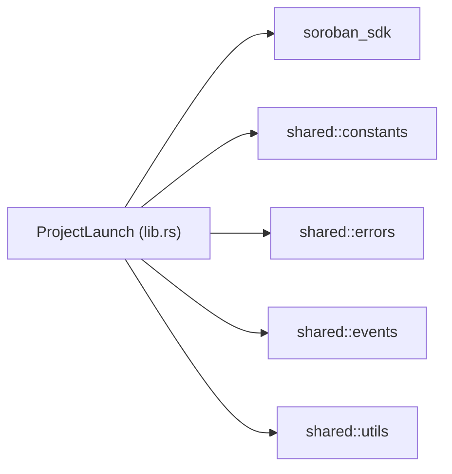

# Project Launch API

<cite>
**Referenced Files in This Document**
- [lib.rs](file://contracts/project-launch/src/lib.rs)
- [constants.rs](file://contracts/shared/src/constants.rs)
- [errors.rs](file://contracts/shared/src/errors.rs)
- [events.rs](file://contracts/shared/src/events.rs)
- [utils.rs](file://contracts/shared/src/utils.rs)
- [Cargo.toml](file://contracts/project-launch/Cargo.toml)
- [README.md](file://README.md)
- [contracts/README.md](file://contracts/README.md)
</cite>

## Table of Contents
1. [Introduction](#introduction)
2. [Project Structure](#project-structure)
3. [Core Components](#core-components)
4. [Architecture Overview](#architecture-overview)
5. [Detailed Component Analysis](#detailed-component-analysis)
6. [Dependency Analysis](#dependency-analysis)
7. [Performance Considerations](#performance-considerations)
8. [Troubleshooting Guide](#troubleshooting-guide)
9. [Conclusion](#conclusion)
10. [Appendices](#appendices)

## Introduction
This document provides comprehensive API documentation for the Project Launch contract, which manages project creation, funding campaigns, and contribution tracking on the Stellar network via Soroban. It covers all public methods, data structures, initialization requirements, admin authentication, state management patterns, validation rules, error handling, and practical interaction examples.

## Project Structure
The Project Launch contract resides in the contracts/project-launch module and depends on shared utilities for constants, errors, events, and helper functions. The contract exposes a set of public functions for initialization, project creation, contributions, and state queries.

**Diagram sources**
- [lib.rs](file://contracts/project-launch/src/lib.rs#L1-L363)
- [constants.rs](file://contracts/shared/src/constants.rs#L1-L40)
- [errors.rs](file://contracts/shared/src/errors.rs#L1-L54)
- [events.rs](file://contracts/shared/src/events.rs#L1-L31)
- [utils.rs](file://contracts/shared/src/utils.rs#L1-L59)

**Section sources**
- [lib.rs](file://contracts/project-launch/src/lib.rs#L1-L363)
- [Cargo.toml](file://contracts/project-launch/Cargo.toml#L1-L26)
- [README.md](file://README.md#L101-L136)
- [contracts/README.md](file://contracts/README.md#L105-L177)

## Core Components
- Project struct: Holds project metadata, funding goal, deadline, token, status, metadata hash, total raised, and creation timestamp.
- ProjectStatus enum: Active, Completed, Failed, Cancelled.
- Contribution struct: Tracks contributor address, amount, and timestamp.
- DataKey enum: Admin, NextProjectId, Project storage keys.
- ProjectLaunchError: Domain-specific errors for invalid funding goal, invalid deadline, project not found, contribution too low, project not active, and deadline passed.

Key public methods:
- initialize(env, admin): Initializes the contract with an admin address.
- create_project(env, creator, funding_goal, deadline, token, metadata_hash): Creates a new project with validation.
- contribute(env, project_id, contributor, amount): Adds a contribution to an active project before deadline.
- get_project(env, project_id): Retrieves project details.
- get_contributions(env, project_id): Retrieves all contributions for a project.
- get_next_project_id(env): Returns the next project ID (for testing).
- is_initialized(env): Checks if the contract is initialized.
- get_admin(env): Returns the admin address.

**Section sources**
- [lib.rs](file://contracts/project-launch/src/lib.rs#L14-L56)
- [lib.rs](file://contracts/project-launch/src/lib.rs#L72-L248)
- [constants.rs](file://contracts/shared/src/constants.rs#L9-L22)

## Architecture Overview
The Project Launch contract orchestrates project lifecycle management and contribution tracking. It validates inputs against shared constants, emits domain-specific events, and maintains state in Soroban storage.

**Diagram sources**
- [lib.rs](file://contracts/project-launch/src/lib.rs#L74-L212)
- [events.rs](file://contracts/shared/src/events.rs#L4-L11)
- [constants.rs](file://contracts/shared/src/constants.rs#L9-L22)

## Detailed Component Analysis

### Data Types and Enums
- ProjectStatus: Active, Completed, Failed, Cancelled.
- Project: Fields include creator, funding_goal, deadline, token, status, metadata_hash, total_raised, created_at.
- Contribution: Fields include contributor, amount, timestamp.
- DataKey: Admin, NextProjectId, Project.

**Diagram sources**
- [lib.rs](file://contracts/project-launch/src/lib.rs#L14-L56)

**Section sources**
- [lib.rs](file://contracts/project-launch/src/lib.rs#L14-L56)

### Public Methods Reference

#### initialize(env, admin)
- Purpose: Initialize the contract with an admin address.
- Parameters:
  - env: Soroban environment.
  - admin: Address of the admin.
- Returns: Result<(), Error>.
- Behavior:
  - Prevents re-initialization if Admin key exists.
  - Requires admin authentication.
  - Sets Admin and initializes NextProjectId to 0.
- Errors:
  - Error::AlreadyInitialized if already initialized.
  - Error::Unauthorized if caller is not admin.
- Notes:
  - Admin-only initialization ensures secure control over administrative functions.

**Section sources**
- [lib.rs](file://contracts/project-launch/src/lib.rs#L74-L85)
- [errors.rs](file://contracts/shared/src/errors.rs#L6-L12)

#### create_project(env, creator, funding_goal, deadline, token, metadata_hash)
- Purpose: Create a new funding project.
- Parameters:
  - env: Soroban environment.
  - creator: Address of the project creator.
  - funding_goal: i128 minimum funding goal.
  - deadline: u64 future timestamp.
  - token: Address of the accepted token.
  - metadata_hash: Bytes representing IPFS/Arweave hash.
- Returns: Result<u64, ProjectLaunchError>.
- Validation rules:
  - funding_goal must be >= MIN_FUNDING_GOAL.
  - deadline must be within MIN_PROJECT_DURATION..=MAX_PROJECT_DURATION from current ledger timestamp.
  - deadline must be in the future (verified via verify_future_timestamp).
- Behavior:
  - Increments NextProjectId and stores the new Project with status Active.
  - Emits PROJECT_CREATED event with project_id, creator, funding_goal, deadline, token.
- Errors:
  - ProjectLaunchError::InvalidFundingGoal if below minimum.
  - ProjectLaunchError::InvalidDeadline if duration out of range or in the past.
- Notes:
  - Project IDs are sequential starting from 0.

**Section sources**
- [lib.rs](file://contracts/project-launch/src/lib.rs#L87-L149)
- [constants.rs](file://contracts/shared/src/constants.rs#L9-L22)
- [utils.rs](file://contracts/shared/src/utils.rs#L15-L23)
- [events.rs](file://contracts/shared/src/events.rs#L4-L7)

#### contribute(env, project_id, contributor, amount)
- Purpose: Add a contribution to an active project before deadline.
- Parameters:
  - env: Soroban environment.
  - project_id: u64 identifier of the project.
  - contributor: Address of the contributor.
  - amount: i128 contribution amount.
- Returns: Result<(), ProjectLaunchError>.
- Validation rules:
  - amount must be >= MIN_CONTRIBUTION.
  - Project must exist and have status Active.
  - Current timestamp must be < deadline.
- Behavior:
  - Updates total_raised for the project.
  - Appends a new Contribution to a persistent Vec keyed by Project.
  - Emits CONTRIBUTION_MADE event with project_id, contributor, amount, total_raised.
- Errors:
  - ProjectLaunchError::ContributionTooLow if below minimum.
  - ProjectLaunchError::ProjectNotFound if project does not exist.
  - ProjectLaunchError::ProjectNotActive if project is not Active.
  - ProjectLaunchError::DeadlinePassed if deadline exceeded.
- Notes:
  - Contributions are stored persistently and can be queried later.

**Section sources**
- [lib.rs](file://contracts/project-launch/src/lib.rs#L151-L212)
- [constants.rs](file://contracts/shared/src/constants.rs#L21-L22)
- [events.rs](file://contracts/shared/src/events.rs#L9-L11)

#### get_project(env, project_id)
- Purpose: Retrieve project details.
- Parameters:
  - env: Soroban environment.
  - project_id: u64 identifier.
- Returns: Result<Project, ProjectLaunchError>.
- Errors:
  - ProjectLaunchError::ProjectNotFound if project does not exist.

**Section sources**
- [lib.rs](file://contracts/project-launch/src/lib.rs#L214-L220)

#### get_contributions(env, project_id)
- Purpose: Retrieve all contributions for a project.
- Parameters:
  - env: Soroban environment.
  - project_id: u64 identifier.
- Returns: Result<Vec<Contribution>, ProjectLaunchError>.
- Errors:
  - ProjectLaunchError::ProjectNotFound if project does not exist.

**Section sources**
- [lib.rs](file://contracts/project-launch/src/lib.rs#L222-L229)

#### get_next_project_id(env)
- Purpose: Get the next project ID (useful for testing).
- Parameters:
  - env: Soroban environment.
- Returns: u64.

**Section sources**
- [lib.rs](file://contracts/project-launch/src/lib.rs#L231-L237)

#### is_initialized(env)
- Purpose: Check if the contract is initialized.
- Parameters:
  - env: Soroban environment.
- Returns: bool.

**Section sources**
- [lib.rs](file://contracts/project-launch/src/lib.rs#L239-L242)

#### get_admin(env)
- Purpose: Get the admin address.
- Parameters:
  - env: Soroban environment.
- Returns: Option<Address>.

**Section sources**
- [lib.rs](file://contracts/project-launch/src/lib.rs#L244-L247)

### Validation Rules and Constants
- Funding Goal: Must be >= MIN_FUNDING_GOAL.
- Duration: Must be between MIN_PROJECT_DURATION and MAX_PROJECT_DURATION.
- Deadline: Must be in the future.
- Contribution Amount: Must be >= MIN_CONTRIBUTION.
- Token Address: Any valid Stellar address representing the accepted token.
- Metadata Hash: Bytes representing IPFS/Arweave hash for project details.

**Section sources**
- [constants.rs](file://contracts/shared/src/constants.rs#L9-L22)
- [utils.rs](file://contracts/shared/src/utils.rs#L15-L23)

### Error Codes
Domain-specific errors for Project Launch:
- InvalidFundingGoal: 1000
- InvalidDeadline: 1001
- ProjectNotFound: 1002
- ContributionTooLow: 1003
- ProjectNotActive: 1004
- DeadlinePassed: 1005

General errors (shared):
- NotInitialized: 1
- AlreadyInitialized: 2
- Unauthorized: 3
- InvalidInput: 4
- NotFound: 5

**Section sources**
- [lib.rs](file://contracts/project-launch/src/lib.rs#L60-L70)
- [errors.rs](file://contracts/shared/src/errors.rs#L6-L12)

### Practical Examples

#### Project Creation Workflow
- Steps:
  - Initialize contract with admin.
  - Set ledger timestamp to current time.
  - Call create_project with valid funding_goal, deadline within allowed range, token address, and metadata_hash.
  - Verify NextProjectId increments and PROJECT_CREATED event is emitted.
- Expected outcomes:
  - New project stored with status Active.
  - Project ID assigned sequentially.

**Section sources**
- [lib.rs](file://contracts/project-launch/src/lib.rs#L74-L149)
- [events.rs](file://contracts/shared/src/events.rs#L4-L7)

#### Contribution Processing
- Steps:
  - Ensure project exists and is Active.
  - Ensure deadline has not passed.
  - Call contribute with amount >= MIN_CONTRIBUTION.
  - Verify total_raised increases and CONTRIBUTION_MADE event is emitted.
- Expected outcomes:
  - Contribution appended to persistent Vec.
  - Project’s total_raised updated.

**Section sources**
- [lib.rs](file://contracts/project-launch/src/lib.rs#L151-L212)
- [events.rs](file://contracts/shared/src/events.rs#L9-L11)

#### State Queries
- Steps:
  - Call get_project(project_id) to retrieve Project struct.
  - Call get_contributions(project_id) to retrieve Vec<Contribution>.
  - Call get_next_project_id() and is_initialized() for operational checks.
  - Call get_admin() to confirm admin address.
- Expected outcomes:
  - Accurate project details and contribution history.
  - Consistent state across queries.

**Section sources**
- [lib.rs](file://contracts/project-launch/src/lib.rs#L214-L247)

## Dependency Analysis
The Project Launch contract imports shared modules for constants, errors, events, and utility functions. It uses Soroban SDK types and enums for addresses, bytes, vectors, and environment access.

**Diagram sources**
- [lib.rs](file://contracts/project-launch/src/lib.rs#L3-L12)
- [Cargo.toml](file://contracts/project-launch/Cargo.toml#L7-L9)

**Section sources**
- [lib.rs](file://contracts/project-launch/src/lib.rs#L3-L12)
- [Cargo.toml](file://contracts/project-launch/Cargo.toml#L7-L9)

## Performance Considerations
- Storage access patterns:
  - Instance storage for Admin and NextProjectId.
  - Persistent storage for Contribution vectors keyed by project_id.
- Recommendations:
  - Minimize repeated storage reads/writes by batching operations where possible.
  - Use efficient Vec operations for appending contributions.
  - Validate inputs early to avoid unnecessary storage writes.

[No sources needed since this section provides general guidance]

## Troubleshooting Guide
Common failure scenarios and resolutions:
- Initialization fails with AlreadyInitialized:
  - Cause: Contract already initialized.
  - Resolution: Ensure initialize is called only once.
- Contribution fails with ContributionTooLow:
  - Cause: Amount below MIN_CONTRIBUTION.
  - Resolution: Increase contribution amount to meet minimum.
- Contribution fails with ProjectNotFound:
  - Cause: Invalid project_id.
  - Resolution: Verify project_id exists and was created successfully.
- Contribution fails with ProjectNotActive:
  - Cause: Project status not Active.
  - Resolution: Confirm project is still Active and not Completed/Failed/Cancelled.
- Contribution fails with DeadlinePassed:
  - Cause: Current timestamp >= deadline.
  - Resolution: Submit contributions before deadline.
- InvalidDeadline errors:
  - Cause: Deadline outside allowed duration or in the past.
  - Resolution: Set deadline within MIN_PROJECT_DURATION..=MAX_PROJECT_DURATION from current time and ensure future timestamp.

**Section sources**
- [lib.rs](file://contracts/project-launch/src/lib.rs#L96-L111)
- [lib.rs](file://contracts/project-launch/src/lib.rs#L158-L178)
- [errors.rs](file://contracts/shared/src/errors.rs#L6-L12)

## Conclusion
The Project Launch contract provides a robust foundation for managing project funding campaigns on Soroban. Its public API supports initialization, project creation with strict validation, contribution processing, and state queries. By adhering to the documented validation rules and error handling patterns, developers can build reliable frontends and integrate seamlessly with the broader NovaFund ecosystem.

[No sources needed since this section summarizes without analyzing specific files]

## Appendices

### API Method Signatures and Types
- initialize(env, admin) -> Result<(), Error>
  - env: Env
  - admin: Address
- create_project(env, creator, funding_goal, deadline, token, metadata_hash) -> Result<u64, ProjectLaunchError>
  - env: Env
  - creator: Address
  - funding_goal: i128
  - deadline: u64
  - token: Address
  - metadata_hash: Bytes
- contribute(env, project_id, contributor, amount) -> Result<(), ProjectLaunchError>
  - env: Env
  - project_id: u64
  - contributor: Address
  - amount: i128
- get_project(env, project_id) -> Result<Project, ProjectLaunchError>
  - env: Env
  - project_id: u64
- get_contributions(env, project_id) -> Result<Vec<Contribution>, ProjectLaunchError>
  - env: Env
  - project_id: u64
- get_next_project_id(env) -> u64
  - env: Env
- is_initialized(env) -> bool
  - env: Env
- get_admin(env) -> Option<Address>
  - env: Env

**Section sources**
- [lib.rs](file://contracts/project-launch/src/lib.rs#L72-L248)

### Data Structures Summary
- ProjectStatus: Active, Completed, Failed, Cancelled
- Project: creator, funding_goal, deadline, token, status, metadata_hash, total_raised, created_at
- Contribution: contributor, amount, timestamp

**Section sources**
- [lib.rs](file://contracts/project-launch/src/lib.rs#L14-L56)