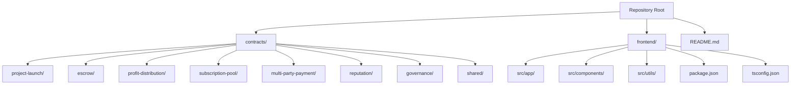
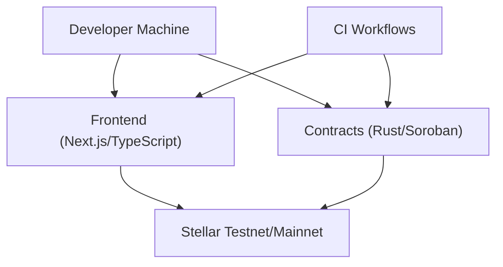
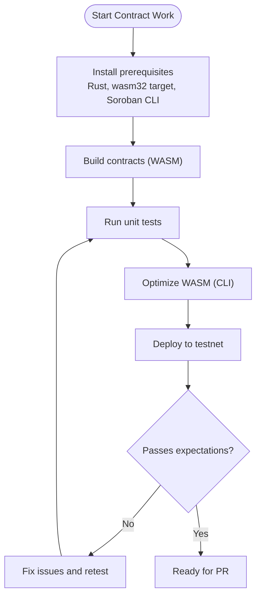
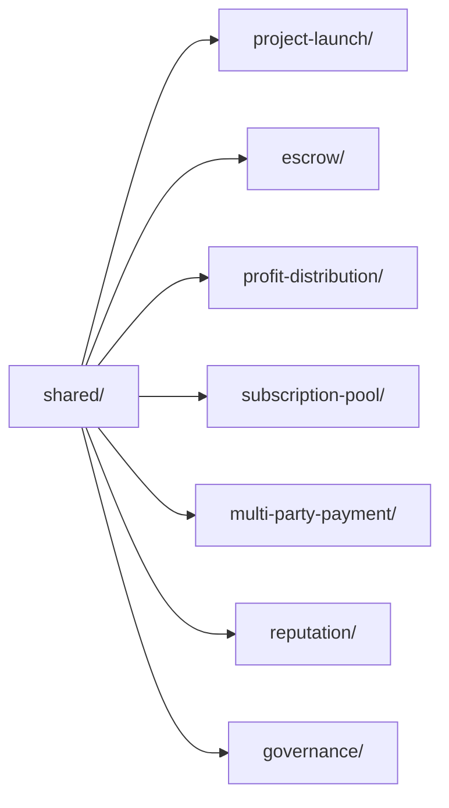

# Contributing Guide

<cite>
**Referenced Files in This Document**
- [README.md](file://README.md)
- [contracts/README.md](file://contracts/README.md)
- [contracts/SETUP.md](file://contracts/SETUP.md)
- [contracts/Cargo.toml](file://contracts/Cargo.toml)
- [contracts/shared/src/constants.rs](file://contracts/shared/src/constants.rs)
- [contracts/shared/src/types.rs](file://contracts/shared/src/types.rs)
- [contracts/project-launch/src/lib.rs](file://contracts/project-launch/src/lib.rs)
- [contracts/escrow/src/lib.rs](file://contracts/escrow/src/lib.rs)
- [contracts/escrow/IMPLEMENTATION.md](file://contracts/escrow/IMPLEMENTATION.md)
- [frontend/package.json](file://frontend/package.json)
- [frontend/tsconfig.json](file://frontend/tsconfig.json)
</cite>

## Table of Contents
1. [Introduction](#introduction)
2. [Project Structure](#project-structure)
3. [Core Components](#core-components)
4. [Architecture Overview](#architecture-overview)
5. [Detailed Component Analysis](#detailed-component-analysis)
6. [Dependency Analysis](#dependency-analysis)
7. [Performance Considerations](#performance-considerations)
8. [Troubleshooting Guide](#troubleshooting-guide)
9. [Conclusion](#conclusion)
10. [Appendices](#appendices)

## Introduction
This guide explains how to contribute effectively to NovaFund. It covers development guidelines, code style expectations, commit message conventions, pull request processes, code review standards, and community participation. It also outlines testing requirements, documentation standards, and recognition strategies to help you succeed whether you are fixing bugs, implementing features, improving docs, or supporting the community.

## Project Structure
NovaFund is a multi-contract, full-stack project built on Stellar and Soroban. The repository is organized into:
- contracts/: Rust-based Soroban smart contracts grouped by feature and a shared library
- frontend/: Next.js/TypeScript frontend application
- Root documentation and setup guides

**Diagram sources**
- [README.md](file://README.md#L260-L313)
- [contracts/README.md](file://contracts/README.md#L1-L334)
- [frontend/package.json](file://frontend/package.json#L1-L32)
- [frontend/tsconfig.json](file://frontend/tsconfig.json#L1-L28)

**Section sources**
- [README.md](file://README.md#L260-L313)
- [contracts/README.md](file://contracts/README.md#L1-L334)

## Core Components
- Smart contracts workspace: A Rust workspace with multiple packages for contracts and a shared library. See [contracts/Cargo.toml](file://contracts/Cargo.toml#L1-L38).
- Shared library: Provides common types, constants, errors, events, and utilities used across contracts. See [contracts/shared/src/types.rs](file://contracts/shared/src/types.rs#L1-L41) and [contracts/shared/src/constants.rs](file://contracts/shared/src/constants.rs#L1-L40).
- Example contracts:
  - ProjectLaunch: Funding lifecycle and contribution tracking. See [contracts/project-launch/src/lib.rs](file://contracts/project-launch/src/lib.rs#L1-L363).
  - Escrow: Milestone-based fund holding and release. See [contracts/escrow/src/lib.rs](file://contracts/escrow/src/lib.rs#L1-L367) and [contracts/escrow/IMPLEMENTATION.md](file://contracts/escrow/IMPLEMENTATION.md#L1-L419).
- Frontend: Next.js application with TypeScript configuration. See [frontend/package.json](file://frontend/package.json#L1-L32) and [frontend/tsconfig.json](file://frontend/tsconfig.json#L1-L28).

**Section sources**
- [contracts/Cargo.toml](file://contracts/Cargo.toml#L1-L38)
- [contracts/shared/src/types.rs](file://contracts/shared/src/types.rs#L1-L41)
- [contracts/shared/src/constants.rs](file://contracts/shared/src/constants.rs#L1-L40)
- [contracts/project-launch/src/lib.rs](file://contracts/project-launch/src/lib.rs#L1-L363)
- [contracts/escrow/src/lib.rs](file://contracts/escrow/src/lib.rs#L1-L367)
- [contracts/escrow/IMPLEMENTATION.md](file://contracts/escrow/IMPLEMENTATION.md#L1-L419)
- [frontend/package.json](file://frontend/package.json#L1-L32)
- [frontend/tsconfig.json](file://frontend/tsconfig.json#L1-L28)

## Architecture Overview
NovaFund’s development stack and contribution touchpoints:
- Smart contracts: Rust/Soroban, compiled to WASM, tested with the Soroban SDK test harness, and deployed via the Soroban CLI.
- Frontend: Next.js with TypeScript, styled with Tailwind CSS, linted with ESLint, and built with Vite-like tooling.
- Documentation: Inline Rust docs, per-contract implementation guides, and top-level guides.

**Diagram sources**
- [README.md](file://README.md#L169-L198)
- [contracts/README.md](file://contracts/README.md#L21-L56)
- [frontend/package.json](file://frontend/package.json#L1-L32)

## Detailed Component Analysis

### Smart Contract Development Guidelines
- Workspace and tooling:
  - Workspace configuration and release profiles are defined in [contracts/Cargo.toml](file://contracts/Cargo.toml#L1-L38).
  - Contract setup and commands are documented in [contracts/SETUP.md](file://contracts/SETUP.md#L1-L153).
- Code style and safety:
  - Contracts use no_std and Soroban SDK types. See [contracts/project-launch/src/lib.rs](file://contracts/project-launch/src/lib.rs#L1-L12) and [contracts/escrow/src/lib.rs](file://contracts/escrow/src/lib.rs#L1-L9).
  - Safe arithmetic patterns and checked math are used across contracts. See [contracts/escrow/src/lib.rs](file://contracts/escrow/src/lib.rs#L349-L366).
- Shared types and constants:
  - Common types and constants are centralized in [contracts/shared/src/types.rs](file://contracts/shared/src/types.rs#L1-L41) and [contracts/shared/src/constants.rs](file://contracts/shared/src/constants.rs#L1-L40).
- Testing expectations:
  - Contracts include unit tests in each package. See [contracts/project-launch/src/lib.rs](file://contracts/project-launch/src/lib.rs#L250-L363) and [contracts/escrow/src/lib.rs](file://contracts/escrow/src/lib.rs#L14-L15).
  - Contract testing and optimization commands are documented in [contracts/README.md](file://contracts/README.md#L47-L66) and [contracts/SETUP.md](file://contracts/SETUP.md#L89-L98).

**Diagram sources**
- [contracts/SETUP.md](file://contracts/SETUP.md#L37-L107)
- [contracts/README.md](file://contracts/README.md#L47-L66)

**Section sources**
- [contracts/Cargo.toml](file://contracts/Cargo.toml#L1-L38)
- [contracts/SETUP.md](file://contracts/SETUP.md#L1-L153)
- [contracts/README.md](file://contracts/README.md#L47-L66)
- [contracts/shared/src/types.rs](file://contracts/shared/src/types.rs#L1-L41)
- [contracts/shared/src/constants.rs](file://contracts/shared/src/constants.rs#L1-L40)
- [contracts/project-launch/src/lib.rs](file://contracts/project-launch/src/lib.rs#L1-L363)
- [contracts/escrow/src/lib.rs](file://contracts/escrow/src/lib.rs#L1-L367)

### Frontend Development Guidelines
- Tooling and scripts are defined in [frontend/package.json](file://frontend/package.json#L5-L9).
- TypeScript strictness and path aliases are configured in [frontend/tsconfig.json](file://frontend/tsconfig.json#L21-L23).
- Expectations:
  - Run linting and type checks before submitting changes.
  - Keep UI components modular and reusable.

**Section sources**
- [frontend/package.json](file://frontend/package.json#L5-L9)
- [frontend/tsconfig.json](file://frontend/tsconfig.json#L21-L23)

### Documentation Standards
- Inline documentation: Use Rust doc comments for contracts and shared modules. See [contracts/shared/src/lib.rs](file://contracts/shared/src/lib.rs#L1-L13).
- Per-contract guides: Consult [contracts/escrow/IMPLEMENTATION.md](file://contracts/escrow/IMPLEMENTATION.md#L1-L419) for example documentation depth.
- Top-level guides: Refer to [contracts/README.md](file://contracts/README.md#L327-L334) and [README.md](file://README.md#L491-L535) for contribution-related documentation.

**Section sources**
- [contracts/shared/src/lib.rs](file://contracts/shared/src/lib.rs#L1-L13)
- [contracts/escrow/IMPLEMENTATION.md](file://contracts/escrow/IMPLEMENTATION.md#L1-L419)
- [contracts/README.md](file://contracts/README.md#L327-L334)
- [README.md](file://README.md#L491-L535)

### Testing Requirements
- Contract tests:
  - Unit tests per contract package. See [contracts/project-launch/src/lib.rs](file://contracts/project-launch/src/lib.rs#L250-L363) and [contracts/escrow/src/lib.rs](file://contracts/escrow/src/lib.rs#L14-L15).
  - Run all tests with workspace commands. See [contracts/README.md](file://contracts/README.md#L49-L56).
- Frontend tests:
  - Use the scripts defined in [frontend/package.json](file://frontend/package.json#L5-L9).
- Coverage and optimization:
  - Coverage generation and WASM optimization commands are documented in [contracts/README.md](file://contracts/README.md#L299-L302) and [contracts/SETUP.md](file://contracts/SETUP.md#L124-L125).

**Section sources**
- [contracts/project-launch/src/lib.rs](file://contracts/project-launch/src/lib.rs#L250-L363)
- [contracts/escrow/src/lib.rs](file://contracts/escrow/src/lib.rs#L14-L15)
- [contracts/README.md](file://contracts/README.md#L49-L56)
- [frontend/package.json](file://frontend/package.json#L5-L9)
- [contracts/README.md](file://contracts/README.md#L299-L302)
- [contracts/SETUP.md](file://contracts/SETUP.md#L124-L125)

### Code Review Guidelines
- Ensure all tests pass locally before opening a pull request.
- Keep changes scoped and focused.
- Update documentation when changing behavior or adding new features.
- Use the pull request template to describe the change, rationale, and testing performed.

[No sources needed since this section provides general guidance]

### Commit Message Conventions
- Use imperative mood and concise subject lines.
- Reference related issues or contracts in the body when appropriate.
- Keep commits small and atomic.

[No sources needed since this section provides general guidance]

## Dependency Analysis
- Workspace cohesion:
  - Contracts share a common workspace configuration and release profile. See [contracts/Cargo.toml](file://contracts/Cargo.toml#L1-L38).
- Contract interdependencies:
  - Contracts import shared modules for types, constants, errors, events, and utilities. See [contracts/project-launch/src/lib.rs](file://contracts/project-launch/src/lib.rs#L7-L12) and [contracts/escrow/src/lib.rs](file://contracts/escrow/src/lib.rs#L4-L9).
- Frontend toolchain:
  - Next.js and TypeScript configuration define strictness and module resolution. See [frontend/tsconfig.json](file://frontend/tsconfig.json#L21-L23).

**Diagram sources**
- [contracts/project-launch/src/lib.rs](file://contracts/project-launch/src/lib.rs#L7-L12)
- [contracts/escrow/src/lib.rs](file://contracts/escrow/src/lib.rs#L4-L9)
- [contracts/Cargo.toml](file://contracts/Cargo.toml#L4-L13)

**Section sources**
- [contracts/Cargo.toml](file://contracts/Cargo.toml#L1-L38)
- [contracts/project-launch/src/lib.rs](file://contracts/project-launch/src/lib.rs#L7-L12)
- [contracts/escrow/src/lib.rs](file://contracts/escrow/src/lib.rs#L4-L9)

## Performance Considerations
- WASM optimization:
  - Build with release profile and optimize WASM using the Soroban CLI. See [contracts/Cargo.toml](file://contracts/Cargo.toml#L25-L34) and [contracts/SETUP.md](file://contracts/SETUP.md#L124-L125).
- Gas-conscious design:
  - Prefer efficient data structures and minimize storage operations. See [contracts/README.md](file://contracts/README.md#L304-L311).

**Section sources**
- [contracts/Cargo.toml](file://contracts/Cargo.toml#L25-L34)
- [contracts/SETUP.md](file://contracts/SETUP.md#L124-L125)
- [contracts/README.md](file://contracts/README.md#L304-L311)

## Troubleshooting Guide
- Local setup:
  - Verify prerequisites and targets as described in [contracts/SETUP.md](file://contracts/SETUP.md#L37-L56).
- Contract deployment:
  - Follow testnet configuration and deployment steps in [contracts/README.md](file://contracts/README.md#L70-L103).
- Frontend development:
  - Use scripts defined in [frontend/package.json](file://frontend/package.json#L5-L9) for dev/build/lint/type-check.

**Section sources**
- [contracts/SETUP.md](file://contracts/SETUP.md#L37-L56)
- [contracts/README.md](file://contracts/README.md#L70-L103)
- [frontend/package.json](file://frontend/package.json#L5-L9)

## Conclusion
By following this guide, you can confidently contribute to NovaFund. Focus on clean, well-tested code, clear documentation, and respectful collaboration. Whether you choose bug fixes, feature work, documentation, or community support, your contributions help build a robust, transparent, and inclusive platform.

## Appendices

### Practical Contribution Workflow (End-to-End)
- Fork the repository on GitHub.
- Create a feature branch.
- Implement changes with tests and documentation updates.
- Build and test locally:
  - Contracts: build and test per [contracts/README.md](file://contracts/README.md#L397-L402) and [contracts/SETUP.md](file://contracts/SETUP.md#L78-L98).
  - Frontend: use scripts in [frontend/package.json](file://frontend/package.json#L5-L9).
- Push to your fork and open a pull request.
- Respond to feedback and update tests as needed.

**Section sources**
- [README.md](file://README.md#L504-L522)
- [contracts/README.md](file://contracts/README.md#L397-L402)
- [contracts/SETUP.md](file://contracts/SETUP.md#L78-L98)
- [frontend/package.json](file://frontend/package.json#L5-L9)

### Types of Contributions
- Bug fixes: reproduce issues, fix logic, add regression tests.
- Feature implementations: design changes in shared types/constants if needed, implement in contracts, update docs.
- Documentation improvements: clarify APIs, add examples, improve guides.
- Community support: triage issues, review PRs, assist new contributors.

[No sources needed since this section provides general guidance]

### Recognition and Benefits
- Contributors are acknowledged in release notes and onboarding materials.
- Long-term contributors may be invited to reviewer or maintainer roles.
- Participation in governance and roadmap discussions is encouraged.

[No sources needed since this section provides general guidance]