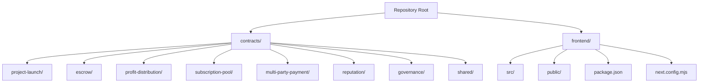
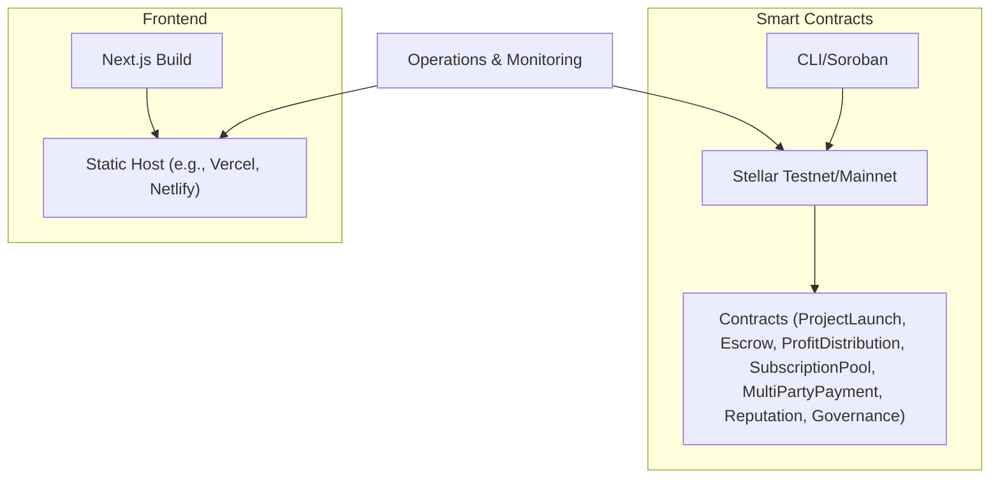
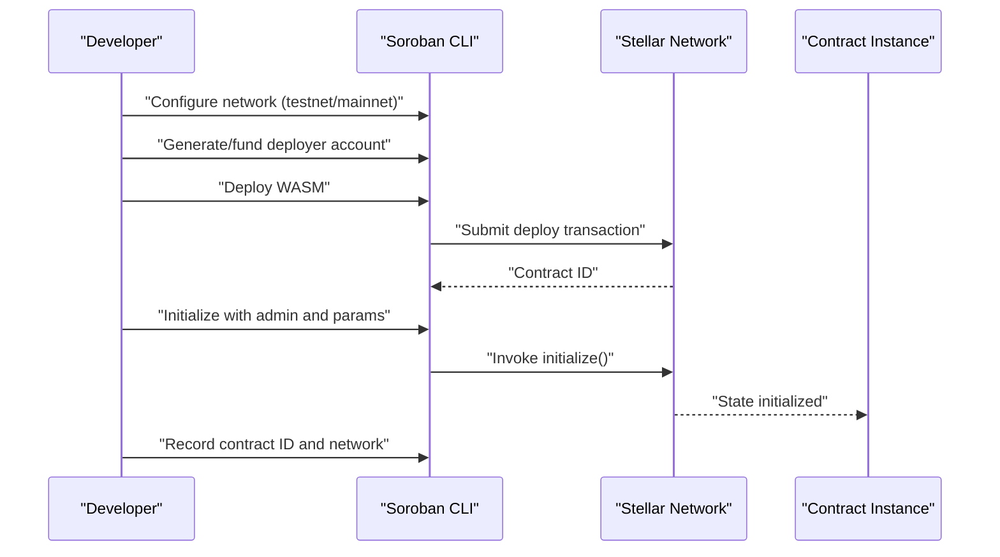
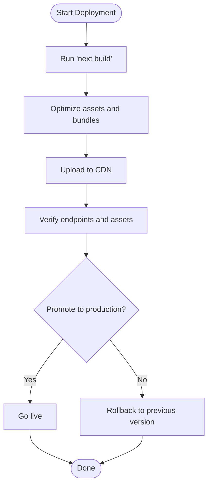
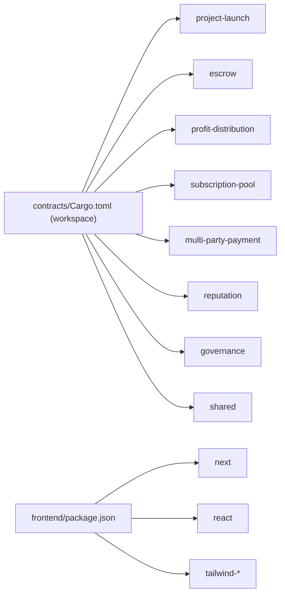

# Deployment and Operations

<cite>
**Referenced Files in This Document**
- [README.md](file://README.md)
- [contracts/README.md](file://contracts/README.md)
- [contracts/Cargo.toml](file://contracts/Cargo.toml)
- [contracts/SETUP.md](file://contracts/SETUP.md)
- [contracts/shared/src/lib.rs](file://contracts/shared/src/lib.rs)
- [contracts/project-launch/src/lib.rs](file://contracts/project-launch/src/lib.rs)
- [frontend/package.json](file://frontend/package.json)
- [frontend/next.config.mjs](file://frontend/next.config.mjs)
- [.gitignore](file://.gitignore)
</cite>

## Table of Contents
1. [Introduction](#introduction)
2. [Project Structure](#project-structure)
3. [Core Components](#core-components)
4. [Architecture Overview](#architecture-overview)
5. [Detailed Component Analysis](#detailed-component-analysis)
6. [Dependency Analysis](#dependency-analysis)
7. [Performance Considerations](#performance-considerations)
8. [Troubleshooting Guide](#troubleshooting-guide)
9. [Conclusion](#conclusion)
10. [Appendices](#appendices)

## Introduction
This document provides a complete deployment and operations guide for NovaFund, covering smart contract deployment across testnet and mainnet, upgrade strategies, monitoring, frontend deployment and optimization, environment management, rollback procedures, security considerations, performance optimization, maintenance, troubleshooting, backup and disaster recovery, and scaling considerations.

## Project Structure
NovaFund is organized into two primary areas:
- Smart contracts (Soroban on Stellar): a Rust workspace with multiple contracts and a shared library.
- Frontend (Next.js): a React application built with TypeScript.

**Diagram sources**
- [README.md](file://README.md#L260-L313)
- [contracts/Cargo.toml](file://contracts/Cargo.toml#L1-L38)

**Section sources**
- [README.md](file://README.md#L260-L313)
- [contracts/Cargo.toml](file://contracts/Cargo.toml#L1-L38)

## Core Components
- Smart contracts workspace and profiles configured for optimized WASM builds.
- Shared library providing types, errors, events, utilities, and constants used across contracts.
- ProjectLaunch contract implementing project lifecycle, contribution tracking, and event emission.
- Frontend Next.js application with build and runtime configuration.

**Section sources**
- [contracts/Cargo.toml](file://contracts/Cargo.toml#L1-L38)
- [contracts/shared/src/lib.rs](file://contracts/shared/src/lib.rs#L1-L20)
- [contracts/project-launch/src/lib.rs](file://contracts/project-launch/src/lib.rs#L1-L363)
- [frontend/package.json](file://frontend/package.json#L1-L32)
- [frontend/next.config.mjs](file://frontend/next.config.mjs#L1-L7)

## Architecture Overview
The deployment pipeline spans three layers:
- Smart contracts (Soroban) deployed to Stellar networks.
- Frontend application built and served via static hosting.
- Optional backend services and infrastructure managed externally.

**Diagram sources**
- [README.md](file://README.md#L425-L455)
- [contracts/README.md](file://contracts/README.md#L68-L104)

## Detailed Component Analysis

### Smart Contract Deployment Lifecycle
This section outlines the complete lifecycle for deploying and operating NovaFund smart contracts on testnet and mainnet, including preparation, deployment, initialization, monitoring, and upgrade strategies.

- Preparation and environment setup
  - Install prerequisites: Rust, wasm32 target, Soroban CLI.
  - Build contracts in release mode for optimized WASM.
  - Configure network identities and accounts for testnet and mainnet.

- Testnet deployment procedure
  - Add and configure the testnet network in the Soroban CLI.
  - Generate and fund a deployer account.
  - Deploy each contract’s WASM artifact.
  - Initialize contracts with required parameters (e.g., admin address).
  - Record contract IDs and network identifiers for frontend integration.

- Mainnet deployment procedure
  - Repeat testnet steps on mainnet with caution and extensive testing.
  - Use separate, hardened accounts for admin and treasury roles.
  - Prefer deterministic deployment and initialization scripts.
  - Announce contract addresses and network details to stakeholders.

- Upgrade strategies
  - Use proxy-like patterns where feasible to preserve contract addresses.
  - Implement versioned interfaces and controlled upgrades with multisig or governance.
  - Maintain backward compatibility for client-side integration.
  - Document upgrade paths and rollback procedures.

- Monitoring requirements
  - Subscribe to on-chain events emitted by contracts.
  - Track critical metrics: transaction fees, gas usage, error rates, and user activity.
  - Alert on unusual spikes or failures during critical operations (e.g., contributions, milestone approvals).

**Diagram sources**
- [contracts/README.md](file://contracts/README.md#L70-L104)
- [README.md](file://README.md#L425-L455)

**Section sources**
- [contracts/README.md](file://contracts/README.md#L21-L66)
- [contracts/README.md](file://contracts/README.md#L70-L104)
- [README.md](file://README.md#L425-L455)

### Contract Upgrade Strategies
- Proxy pattern: maintain a stable fronting contract while upgrading the implementation.
- Controlled upgrades: require governance approval or multisig signatures.
- Backward compatibility: keep function signatures stable; introduce optional parameters carefully.
- Versioning: track contract versions and migration paths.
- Rollback: retain previous implementations and enable quick revert if needed.

[No sources needed since this section provides general guidance]

### Monitoring Requirements
- On-chain monitoring:
  - Subscribe to contract events (e.g., project created, contribution made).
  - Track ledger timestamps and transaction costs.
- Operational monitoring:
  - Frontend availability and performance metrics.
  - CDN health and cache hit ratios.
  - Error logs and alert thresholds.

[No sources needed since this section provides general guidance]

### Frontend Deployment Strategies
- Build optimization
  - Use Next.js production build to generate static assets.
  - Enable strict mode and modern bundling defaults.
- CDN configuration
  - Serve static assets via a global CDN for low latency.
  - Configure caching policies for immutable assets and dynamic routes.
- Environment management
  - Maintain separate environment variables for staging and production.
  - Avoid committing secrets; use secure secret management.
- Rollback procedures
  - Tag releases and keep previous builds available.
  - Use blue/green deployments or canary rollouts.

**Diagram sources**
- [frontend/package.json](file://frontend/package.json#L5-L10)
- [frontend/next.config.mjs](file://frontend/next.config.mjs#L1-L7)

**Section sources**
- [frontend/package.json](file://frontend/package.json#L1-L32)
- [frontend/next.config.mjs](file://frontend/next.config.mjs#L1-L7)

### Practical Examples and Operational Procedures
- Smart contract deployment commands and initialization examples are documented in the repository.
- Use the provided scripts and commands to deploy to testnet and mainnet.
- Keep a changelog of contract addresses and network identifiers for each environment.

**Section sources**
- [contracts/README.md](file://contracts/README.md#L70-L104)
- [README.md](file://README.md#L425-L455)

### Security Considerations for Production Deployments
- Principle of least privilege: restrict admin functions and limit who can call sensitive methods.
- Input validation: ensure all parameters are validated before processing.
- Access control: enforce authorization checks for privileged operations.
- Audit readiness: maintain logs and traces for compliance and forensic analysis.
- Network security: use HTTPS, rotate keys, and monitor for suspicious activity.

**Section sources**
- [contracts/README.md](file://contracts/README.md#L312-L319)

### Performance Optimization Techniques
- Smart contracts:
  - Use optimized WASM builds and minimize storage reads/writes.
  - Favor efficient data structures and avoid unnecessary computations.
- Frontend:
  - Enable static generation and code splitting.
  - Optimize images and leverage CDN caching.
  - Minimize third-party dependencies and bundle sizes.

**Section sources**
- [contracts/Cargo.toml](file://contracts/Cargo.toml#L25-L38)
- [frontend/package.json](file://frontend/package.json#L1-L32)

### Maintenance Procedures
- Regular audits of contract logic and state.
- Health checks for frontend and backend systems.
- Rotation of operational keys and credentials.
- Documentation updates reflecting current deployment state.

[No sources needed since this section provides general guidance]

### Troubleshooting Guidance
- Deployment failures:
  - Verify network configuration and account balances.
  - Check contract initialization parameters and event logs.
- Frontend issues:
  - Inspect build logs and asset paths.
  - Confirm environment variable correctness and CDN availability.
- Monitoring:
  - Investigate anomalies in transaction volumes and error rates.
  - Review alert logs and on-chain event streams.

**Section sources**
- [README.md](file://README.md#L425-L455)
- [.gitignore](file://.gitignore#L20-L35)

### Backup Procedures and Disaster Recovery Planning
- Smart contracts:
  - Maintain backups of contract WASMs and initialization parameters.
  - Preserve historical on-chain state snapshots for reconstruction.
- Frontend:
  - Keep archived builds and deployment manifests.
  - Automate restoration of static assets from CDN.
- Recovery:
  - Establish RTO/RPO targets and test recovery procedures regularly.

[No sources needed since this section provides general guidance]

### Scaling Considerations
- Smart contracts:
  - Design for high-throughput operations and batch processing where appropriate.
  - Consider sharding or modular contracts for complex workloads.
- Frontend:
  - Scale horizontally with CDN and load balancers.
  - Use serverless or containerized backend services as needed.

[No sources needed since this section provides general guidance]

## Dependency Analysis
The smart contracts workspace aggregates multiple modules and a shared library. The frontend depends on Next.js and related tooling.

**Diagram sources**
- [contracts/Cargo.toml](file://contracts/Cargo.toml#L1-L13)
- [frontend/package.json](file://frontend/package.json#L11-L30)

**Section sources**
- [contracts/Cargo.toml](file://contracts/Cargo.toml#L1-L13)
- [frontend/package.json](file://frontend/package.json#L1-L32)

## Performance Considerations
- Build optimization:
  - Use release profiles with LTO and optimized codegen for contracts.
  - Employ static site generation for the frontend to reduce runtime overhead.
- Runtime optimization:
  - Minimize on-chain computation and storage operations.
  - Cache frequently accessed data and leverage CDN for static assets.

**Section sources**
- [contracts/Cargo.toml](file://contracts/Cargo.toml#L25-L38)
- [frontend/package.json](file://frontend/package.json#L5-L10)

## Troubleshooting Guide
Common issues and resolutions:
- Contract deployment fails due to insufficient funds or incorrect network passphrase.
- Frontend build errors caused by missing environment variables or incompatible dependencies.
- Monitoring gaps due to disabled event subscriptions or misconfigured alerts.

Recommended actions:
- Validate network configuration and account funding before deploying.
- Review build logs and environment variable injection.
- Ensure monitoring pipelines subscribe to relevant contract events and set appropriate alert thresholds.

**Section sources**
- [README.md](file://README.md#L425-L455)
- [.gitignore](file://.gitignore#L20-L35)

## Conclusion
This guide consolidates NovaFund’s deployment and operations practices across smart contracts and the frontend. By following structured deployment procedures, maintaining robust monitoring, enforcing security controls, optimizing performance, and preparing for incidents, teams can reliably operate NovaFund in testnet and mainnet environments.

## Appendices
- Reference to contract initialization and deployment examples in the repository documentation.
- Frontend build and configuration references for production readiness.

**Section sources**
- [contracts/README.md](file://contracts/README.md#L70-L104)
- [README.md](file://README.md#L425-L455)
- [frontend/package.json](file://frontend/package.json#L5-L10)
- [frontend/next.config.mjs](file://frontend/next.config.mjs#L1-L7)