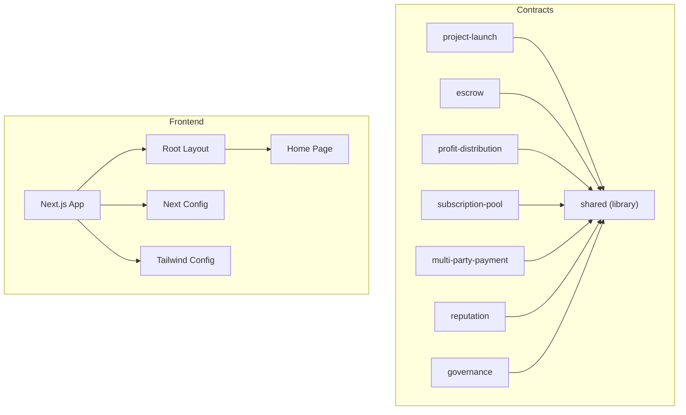
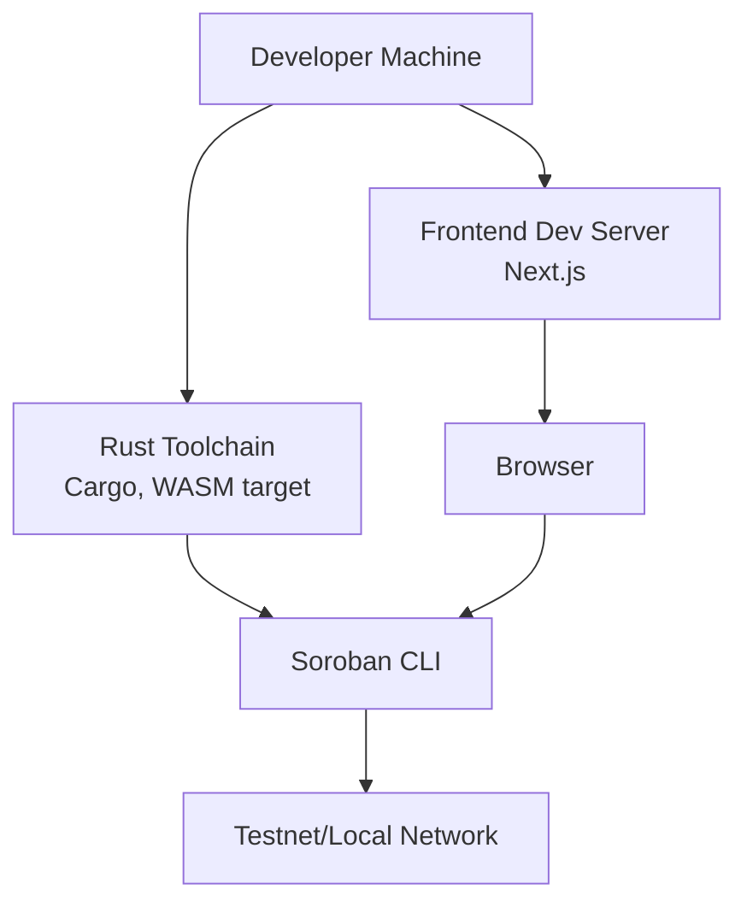
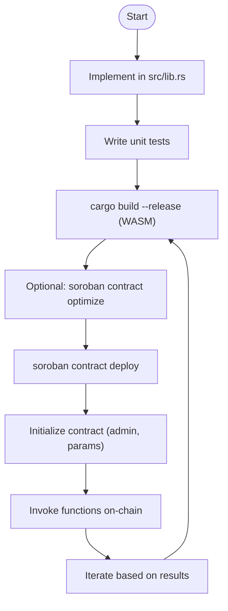
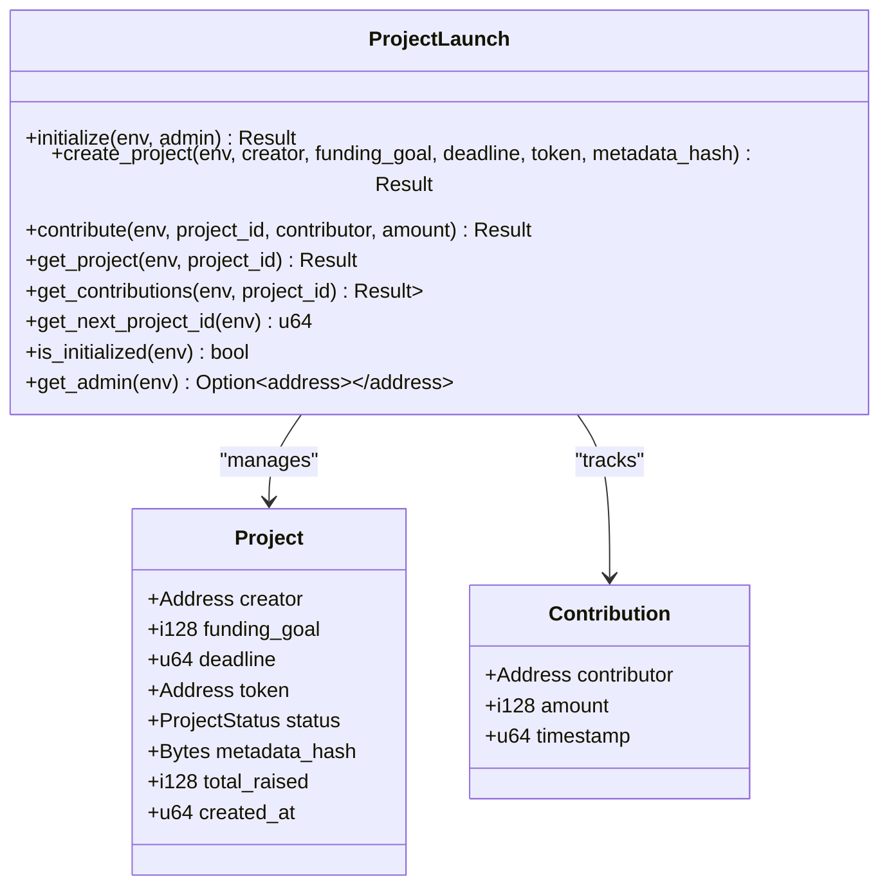
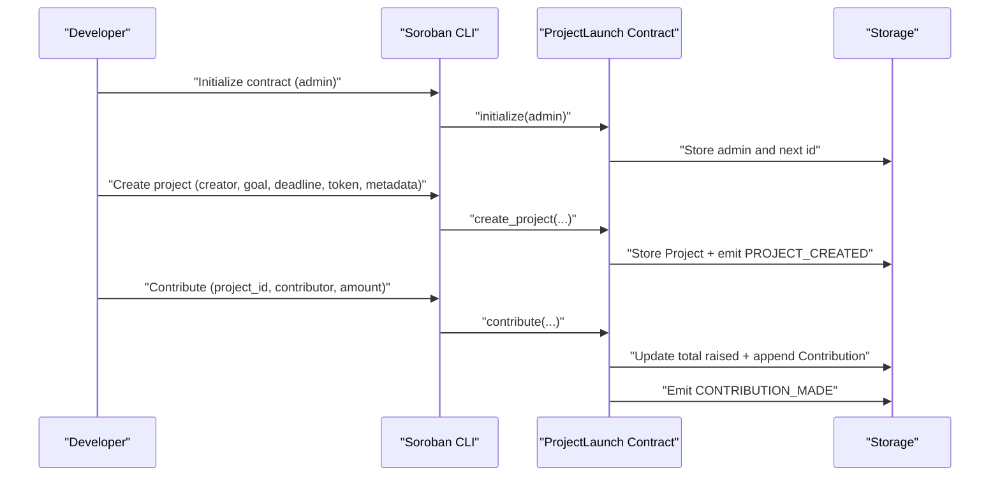
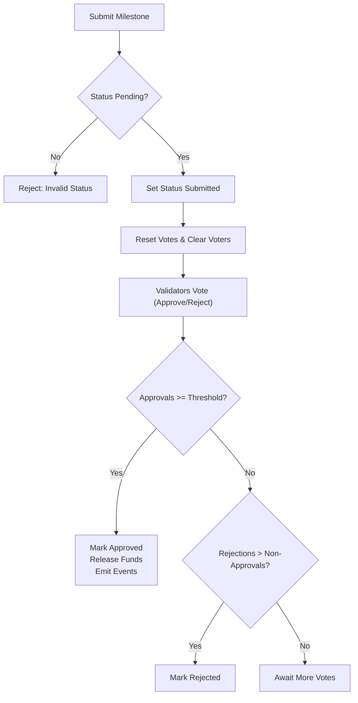
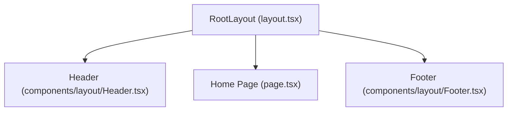
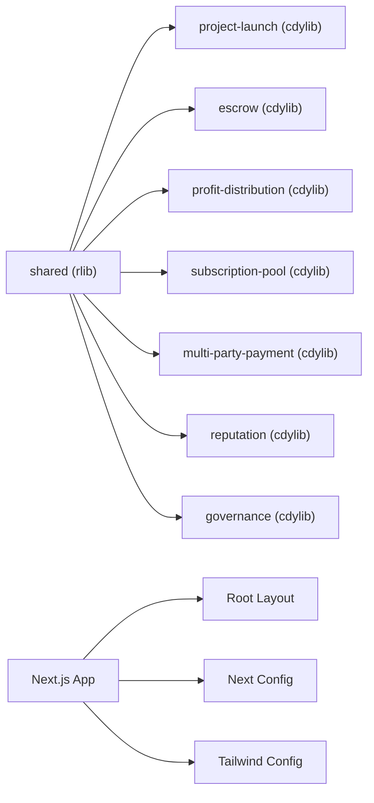

# Development Workflow

<cite>
**Referenced Files in This Document**
- [README.md](file://README.md)
- [contracts/README.md](file://contracts/README.md)
- [contracts/SETUP.md](file://contracts/SETUP.md)
- [contracts/shared/src/lib.rs](file://contracts/shared/src/lib.rs)
- [contracts/shared/Cargo.toml](file://contracts/shared/Cargo.toml)
- [contracts/project-launch/Cargo.toml](file://contracts/project-launch/Cargo.toml)
- [contracts/project-launch/src/lib.rs](file://contracts/project-launch/src/lib.rs)
- [contracts/escrow/Cargo.toml](file://contracts/escrow/Cargo.toml)
- [contracts/escrow/src/lib.rs](file://contracts/escrow/src/lib.rs)
- [frontend/package.json](file://frontend/package.json)
- [frontend/next.config.mjs](file://frontend/next.config.mjs)
- [frontend/tailwind.config.js](file://frontend/tailwind.config.js)
- [frontend/src/app/layout.tsx](file://frontend/src/app/layout.tsx)
- [frontend/src/app/page.tsx](file://frontend/src/app/page.tsx)
- [frontend/tsconfig.json](file://frontend/tsconfig.json)
</cite>

## Table of Contents
1. [Introduction](#introduction)
2. [Project Structure](#project-structure)
3. [Core Components](#core-components)
4. [Architecture Overview](#architecture-overview)
5. [Detailed Component Analysis](#detailed-component-analysis)
6. [Dependency Analysis](#dependency-analysis)
7. [Performance Considerations](#performance-considerations)
8. [Troubleshooting Guide](#troubleshooting-guide)
9. [Conclusion](#conclusion)
10. [Appendices](#appendices)

## Introduction
This document describes the complete development lifecycle for NovaFund, covering both smart contracts (Rust and Soroban SDK) and the Next.js frontend (TypeScript and Tailwind CSS). It explains environment setup, build and testing procedures, deployment strategies, CI/CD patterns, and troubleshooting. Practical examples demonstrate the end-to-end cycle from local development to production deployment.

## Project Structure
NovaFund is organized into two primary areas:
- contracts/: Soroban smart contracts grouped by domain (project-launch, escrow, profit-distribution, subscription-pool, multi-party-payment, reputation, governance) plus a shared library for common types, errors, events, and utilities.
- frontend/: Next.js application with TypeScript, Tailwind CSS, and a modular component structure.

**Diagram sources**
- [contracts/shared/src/lib.rs](file://contracts/shared/src/lib.rs#L1-L20)
- [contracts/project-launch/Cargo.toml](file://contracts/project-launch/Cargo.toml#L1-L26)
- [contracts/escrow/Cargo.toml](file://contracts/escrow/Cargo.toml#L1-L16)
- [frontend/src/app/layout.tsx](file://frontend/src/app/layout.tsx#L1-L29)
- [frontend/src/app/page.tsx](file://frontend/src/app/page.tsx#L1-L16)
- [frontend/next.config.mjs](file://frontend/next.config.mjs#L1-L7)
- [frontend/tailwind.config.js](file://frontend/tailwind.config.js#L1-L48)

**Section sources**
- [README.md](file://README.md#L260-L313)
- [contracts/README.md](file://contracts/README.md#L1-L334)
- [frontend/package.json](file://frontend/package.json#L1-L32)

## Core Components
- Smart Contracts (Rust/Soroban): Each contract exposes functions for initialization, state management, and domain-specific operations. Contracts use a shared library for types, errors, events, and utilities.
- Frontend (Next.js): A modern React application configured with TypeScript, Tailwind CSS, and Next’s app router. It includes global styles, layout components, and skeleton loaders.

Key capabilities:
- Contracts compile to WebAssembly with release profiles and optional WASM optimization.
- Frontend supports development server, production builds, and code quality checks.

**Section sources**
- [contracts/README.md](file://contracts/README.md#L36-L66)
- [frontend/package.json](file://frontend/package.json#L5-L10)
- [frontend/tailwind.config.js](file://frontend/tailwind.config.js#L1-L48)

## Architecture Overview
The development workflow spans three layers:
- Smart Contracts: Implemented in Rust, compiled to WASM, tested locally, and deployed to Soroban networks.
- Frontend: Next.js app built with TypeScript and Tailwind CSS, connecting to wallets and interacting with contracts.
- Tooling: Cargo for Rust, npm/yarn/pnpm for Node, and Soroban CLI for contract deployment.

**Diagram sources**
- [contracts/README.md](file://contracts/README.md#L23-L34)
- [README.md](file://README.md#L201-L257)
- [frontend/package.json](file://frontend/package.json#L6-L9)

## Detailed Component Analysis

### Smart Contract Development (Rust + Soroban SDK)
Contract lifecycle:
- Implement logic in src/lib.rs.
- Write unit tests in #[cfg(test)] blocks.
- Build to WASM with cargo build --target wasm32-unknown-unknown --release.
- Deploy to testnet/mainnet using Soroban CLI.
- Initialize contracts with required parameters.

**Diagram sources**
- [contracts/SETUP.md](file://contracts/SETUP.md#L100-L108)
- [contracts/README.md](file://contracts/README.md#L68-L104)

Implementation patterns observed:
- Strong typing with contracttype enums and structs.
- Explicit error enums for predictable failure modes.
- Storage keys organized via DataKey enums.
- Events published for on-chain observability.
- Shared library usage for cross-contract utilities.

Example contracts:
- ProjectLaunch: Initializes admin, creates projects with deadlines and funding goals, tracks contributions, and emits events.
- Escrow: Manages milestone-based fund releases with validator approvals and threshold logic.

**Section sources**
- [contracts/project-launch/src/lib.rs](file://contracts/project-launch/src/lib.rs#L72-L248)
- [contracts/project-launch/src/lib.rs](file://contracts/project-launch/src/lib.rs#L250-L362)
- [contracts/escrow/src/lib.rs](file://contracts/escrow/src/lib.rs#L22-L346)
- [contracts/shared/src/lib.rs](file://contracts/shared/src/lib.rs#L1-L20)

#### Class Diagram: ProjectLaunch Contract

**Diagram sources**
- [contracts/project-launch/src/lib.rs](file://contracts/project-launch/src/lib.rs#L14-L56)
- [contracts/project-launch/src/lib.rs](file://contracts/project-launch/src/lib.rs#L72-L248)

#### Sequence Diagram: Project Creation and Contribution

**Diagram sources**
- [contracts/project-launch/src/lib.rs](file://contracts/project-launch/src/lib.rs#L74-L212)

#### Flowchart: Escrow Milestone Approval Logic

**Diagram sources**
- [contracts/escrow/src/lib.rs](file://contracts/escrow/src/lib.rs#L175-L307)

### Frontend Development (Next.js + TypeScript + Tailwind CSS)
Frontend setup and commands:
- Development server: next dev
- Production build: next build
- Linting: next lint
- Strict mode enabled in Next config

Project structure highlights:
- App router with pages under src/app.
- Global styles and Tailwind configuration.
- Root layout composes header/footer and wraps children.
- Path aliases configured for @/*

**Section sources**
- [frontend/package.json](file://frontend/package.json#L5-L10)
- [frontend/next.config.mjs](file://frontend/next.config.mjs#L1-L7)
- [frontend/tailwind.config.js](file://frontend/tailwind.config.js#L1-L48)
- [frontend/src/app/layout.tsx](file://frontend/src/app/layout.tsx#L1-L29)
- [frontend/src/app/page.tsx](file://frontend/src/app/page.tsx#L1-L16)
- [frontend/tsconfig.json](file://frontend/tsconfig.json#L21-L23)

#### Component Composition Diagram

**Diagram sources**
- [frontend/src/app/layout.tsx](file://frontend/src/app/layout.tsx#L1-L29)
- [frontend/src/app/page.tsx](file://frontend/src/app/page.tsx#L1-L16)

## Dependency Analysis
- Contracts depend on the shared library for common types, errors, events, and utilities.
- Each contract crate defines a cdylib target for WASM export and a release profile optimized for size and safety.
- Frontend depends on Next.js, React, Tailwind CSS, and TypeScript with strict compiler options.

**Diagram sources**
- [contracts/shared/Cargo.toml](file://contracts/shared/Cargo.toml#L1-L12)
- [contracts/project-launch/Cargo.toml](file://contracts/project-launch/Cargo.toml#L7-L15)
- [contracts/escrow/Cargo.toml](file://contracts/escrow/Cargo.toml#L7-L15)
- [frontend/package.json](file://frontend/package.json#L11-L30)

**Section sources**
- [contracts/shared/src/lib.rs](file://contracts/shared/src/lib.rs#L1-L20)
- [contracts/project-launch/Cargo.toml](file://contracts/project-launch/Cargo.toml#L7-L26)
- [contracts/escrow/Cargo.toml](file://contracts/escrow/Cargo.toml#L7-L16)
- [frontend/package.json](file://frontend/package.json#L11-L30)

## Performance Considerations
Smart contracts:
- Release profile with size optimization, overflow checks, and LTO enabled.
- WASM optimization via Soroban CLI to reduce transaction costs.
- Efficient storage operations and minimal persistent reads/writes.

Frontend:
- Next.js build pipeline with tree-shaking and code splitting.
- Tailwind CSS purging via content globs to minimize bundle size.
- Strict TypeScript compiler options for early bug detection.

**Section sources**
- [contracts/project-launch/Cargo.toml](file://contracts/project-launch/Cargo.toml#L17-L26)
- [contracts/README.md](file://contracts/README.md#L58-L66)
- [frontend/tailwind.config.js](file://frontend/tailwind.config.js#L3-L6)
- [frontend/tsconfig.json](file://frontend/tsconfig.json#L7-L15)

## Troubleshooting Guide
Common issues and resolutions:
- Rust/WASM build failures:
  - Ensure wasm32-unknown-unknown target is installed and up to date.
  - Use cargo check to validate without building.
  - Verify release profile settings and LTO configuration.
- Soroban CLI deployment problems:
  - Confirm network passphrase and RPC URL for testnet/mainnet.
  - Generate and fund a deployer account before deploying.
  - Initialize contracts with required parameters after deployment.
- Frontend development issues:
  - next dev port conflicts: change port or kill conflicting processes.
  - Tailwind purge removing styles: expand content globs to include component directories.
  - TypeScript strict mode errors: fix missing types or add explicit type annotations.

**Section sources**
- [contracts/SETUP.md](file://contracts/SETUP.md#L37-L56)
- [contracts/README.md](file://contracts/README.md#L70-L104)
- [frontend/next.config.mjs](file://frontend/next.config.mjs#L2-L4)
- [frontend/tailwind.config.js](file://frontend/tailwind.config.js#L3-L6)
- [frontend/tsconfig.json](file://frontend/tsconfig.json#L7-L15)

## Conclusion
NovaFund’s development workflow integrates Rust-based smart contracts with a modern Next.js frontend. By following the outlined setup, build, test, and deployment procedures—combined with the provided troubleshooting guidance—you can efficiently iterate on both the contract logic and the user interface, ensuring robust, secure, and maintainable features across the platform.

## Appendices

### End-to-End Development Cycle (Local to Production)
- Local environment:
  - Install prerequisites: Node.js, Rust, Soroban CLI, Git.
  - Install dependencies for frontend and contracts.
  - Start a local or connect to testnet.
- Smart contracts:
  - Implement and test contracts locally using cargo test.
  - Build WASM and optionally optimize.
  - Deploy to testnet and initialize.
- Frontend:
  - Run next dev for interactive development.
  - Build and preview production artifacts.
  - Lint and type-check before committing.
- Production:
  - Build frontend and deploy to hosting provider.
  - On testnet, verify flows end-to-end; then repeat on mainnet with caution.

**Section sources**
- [README.md](file://README.md#L201-L257)
- [README.md](file://README.md#L395-L454)