# Architecture

<cite>
**Referenced Files in This Document**
- [README.md](file://README.md)
- [contracts/README.md](file://contracts/README.md)
- [contracts/Cargo.toml](file://contracts/Cargo.toml)
- [contracts/SETUP.md](file://contracts/SETUP.md)
- [contracts/shared/src/lib.rs](file://contracts/shared/src/lib.rs)
- [contracts/shared/src/types.rs](file://contracts/shared/src/types.rs)
- [contracts/shared/src/events.rs](file://contracts/shared/src/events.rs)
- [contracts/project-launch/src/lib.rs](file://contracts/project-launch/src/lib.rs)
- [contracts/escrow/src/lib.rs](file://contracts/escrow/src/lib.rs)
- [frontend/package.json](file://frontend/package.json)
- [frontend/src/app/layout.tsx](file://frontend/src/app/layout.tsx)
- [frontend/src/app/page.tsx](file://frontend/src/app/page.tsx)
- [frontend/src/components/layout/Header.tsx](file://frontend/src/components/layout/Header.tsx)
- [frontend/src/components/layout/Footer.tsx](file://frontend/src/components/layout/Footer.tsx)
</cite>

## Table of Contents
1. [Introduction](#introduction)
2. [Project Structure](#project-structure)
3. [Core Components](#core-components)
4. [Architecture Overview](#architecture-overview)
5. [Detailed Component Analysis](#detailed-component-analysis)
6. [Dependency Analysis](#dependency-analysis)
7. [Performance Considerations](#performance-considerations)
8. [Troubleshooting Guide](#troubleshooting-guide)
9. [Conclusion](#conclusion)
10. [Appendices](#appendices)

## Introduction
NovaFund is a decentralized micro-investment platform built on the Stellar blockchain using Soroban smart contracts. It enables creators to launch funding projects, investors to contribute, and smart contracts to manage escrow, milestone-based releases, profit distributions, recurring subscriptions, multi-stakeholder payments, reputation, and governance. The frontend is a React/TypeScript application that integrates with Stellar wallets and interacts with the smart contracts to provide a seamless user experience.

## Project Structure
The repository is organized into three primary areas:
- contracts/: Seven modular Soroban smart contracts plus a shared library for common types, errors, events, utilities, and constants.
- frontend/: A Next.js (React) application written in TypeScript, styled with Tailwind CSS.
- Root documentation and setup guides for contracts and deployment.

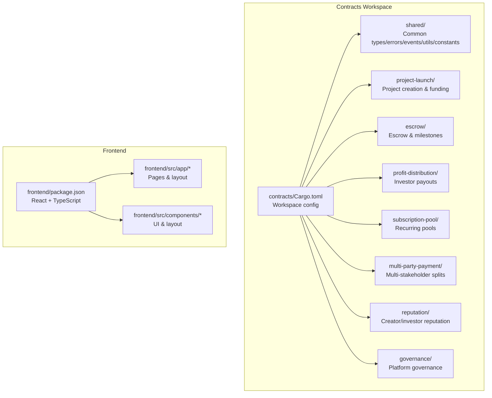

**Diagram sources**
- [contracts/Cargo.toml](file://contracts/Cargo.toml#L1-L38)
- [frontend/package.json](file://frontend/package.json#L1-L32)

**Section sources**
- [README.md](file://README.md#L260-L313)
- [contracts/README.md](file://contracts/README.md#L1-L334)
- [contracts/Cargo.toml](file://contracts/Cargo.toml#L1-L38)
- [frontend/package.json](file://frontend/package.json#L1-L32)

## Core Components
- Shared Library (shared/): Provides common data types, error enums, event symbols, utilities, and constants used across contracts. This ensures consistency and reduces duplication.
- ProjectLaunch: Manages project lifecycle, funding goals, deadlines, and contribution tracking. Emits events for project creation and contributions.
- Escrow: Holds funds in escrow and releases them based on milestone approvals by validators.
- ProfitDistribution: Distributes returns to investors proportionally and tracks claimable dividends.
- SubscriptionPool: Manages recurring investment contributions and dynamic portfolio updates.
- MultiPartyPayment: Splits payments among multiple stakeholders with optional vesting and dispute resolution support.
- Reputation: Tracks on-chain reputation scores and badges for creators and investors.
- Governance: Enables platform-wide proposals, voting, and execution of decisions.

**Section sources**
- [contracts/README.md](file://contracts/README.md#L105-L280)
- [contracts/shared/src/lib.rs](file://contracts/shared/src/lib.rs#L1-L20)
- [contracts/shared/src/types.rs](file://contracts/shared/src/types.rs#L1-L41)
- [contracts/shared/src/events.rs](file://contracts/shared/src/events.rs#L1-L31)
- [contracts/project-launch/src/lib.rs](file://contracts/project-launch/src/lib.rs#L57-L248)
- [contracts/escrow/src/lib.rs](file://contracts/escrow/src/lib.rs#L19-L346)

## Architecture Overview
The system follows a layered architecture:
- Frontend (React/TypeScript): Renders UI, orchestrates user actions, and communicates with the blockchain via wallet providers.
- Stellar Network Layer (Soroban): Executes smart contracts that enforce business logic and maintain immutable state.
- Data & Storage Layer: Off-chain metadata stored on IPFS/Arweave; on-chain transaction records on Stellar ledger; optional backend indexing and PostgreSQL for enhanced UX.

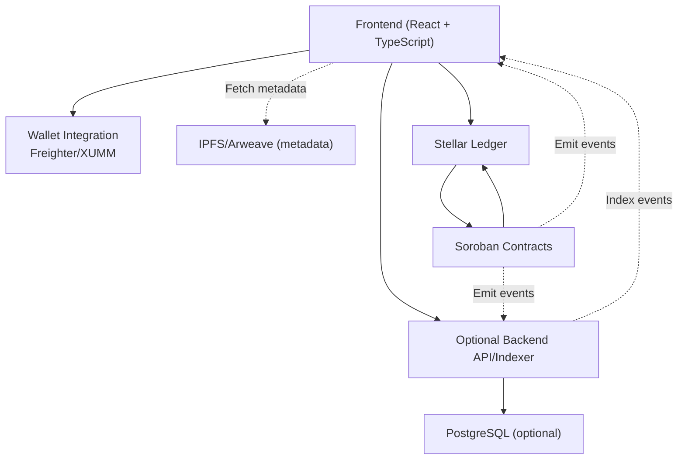

**Diagram sources**
- [README.md](file://README.md#L101-L136)
- [README.md](file://README.md#L169-L191)
- [contracts/shared/src/events.rs](file://contracts/shared/src/events.rs#L1-L31)

## Detailed Component Analysis

### Modular Contract Architecture
The contracts are organized as a Rust workspace with a shared library and seven specialized contracts. This promotes reuse, testability, and maintainability.

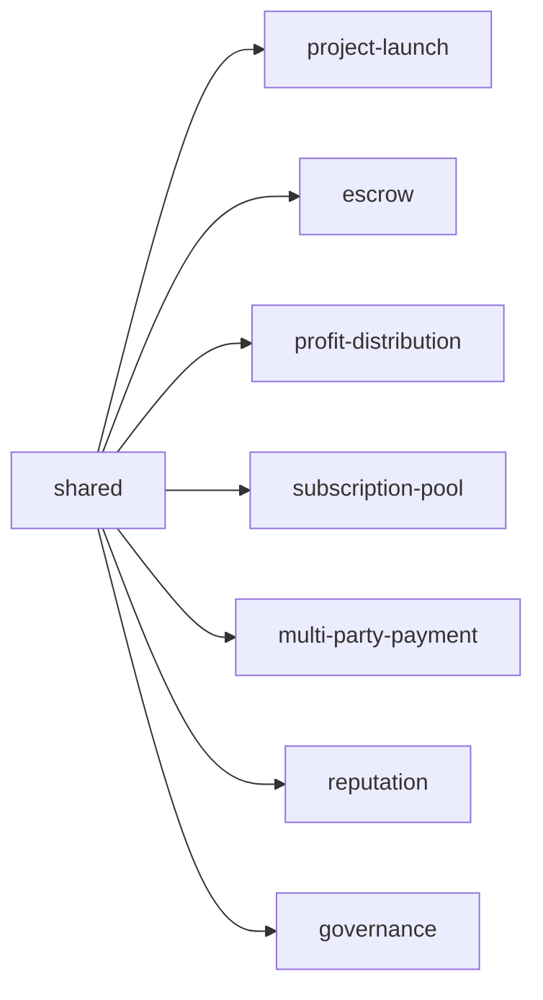

**Diagram sources**
- [contracts/Cargo.toml](file://contracts/Cargo.toml#L4-L13)
- [contracts/shared/src/lib.rs](file://contracts/shared/src/lib.rs#L1-L20)

**Section sources**
- [contracts/Cargo.toml](file://contracts/Cargo.toml#L1-L38)
- [contracts/SETUP.md](file://contracts/SETUP.md#L1-L153)

### Frontend Application Layout and Navigation
The frontend uses Next.js with a root layout that includes a header and footer. The header contains a wallet connect button, and the home page displays a welcome message.

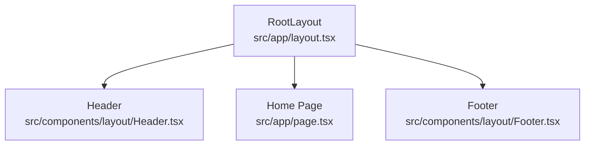

**Diagram sources**
- [frontend/src/app/layout.tsx](file://frontend/src/app/layout.tsx#L1-L29)
- [frontend/src/components/layout/Header.tsx](file://frontend/src/components/layout/Header.tsx#L1-L20)
- [frontend/src/components/layout/Footer.tsx](file://frontend/src/components/layout/Footer.tsx#L1-L15)
- [frontend/src/app/page.tsx](file://frontend/src/app/page.tsx#L1-L16)

**Section sources**
- [frontend/src/app/layout.tsx](file://frontend/src/app/layout.tsx#L1-L29)
- [frontend/src/components/layout/Header.tsx](file://frontend/src/components/layout/Header.tsx#L1-L20)
- [frontend/src/components/layout/Footer.tsx](file://frontend/src/components/layout/Footer.tsx#L1-L15)
- [frontend/src/app/page.tsx](file://frontend/src/app/page.tsx#L1-L16)

### Project Launch Contract Flow
The ProjectLaunch contract manages project creation, funding goals, deadlines, and contributions. It emits events for project creation and contributions, enabling the frontend and optional backend to react.

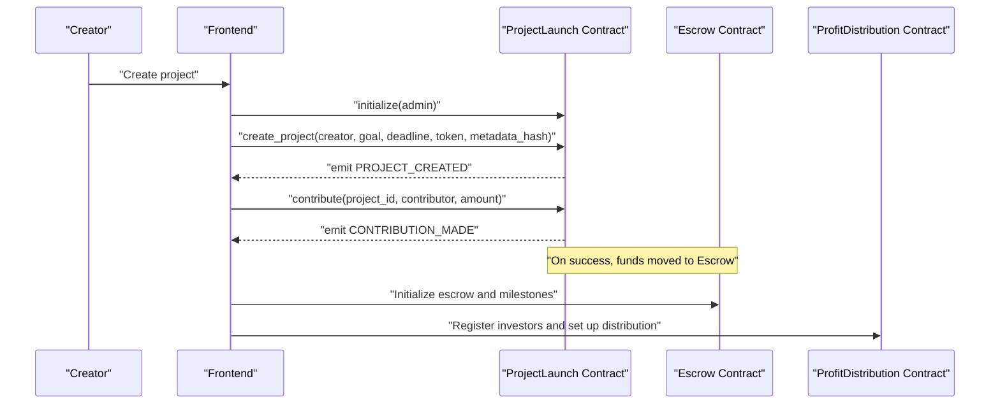

**Diagram sources**
- [contracts/project-launch/src/lib.rs](file://contracts/project-launch/src/lib.rs#L74-L248)
- [contracts/shared/src/events.rs](file://contracts/shared/src/events.rs#L3-L11)

**Section sources**
- [contracts/project-launch/src/lib.rs](file://contracts/project-launch/src/lib.rs#L57-L248)
- [contracts/README.md](file://contracts/README.md#L107-L177)

### Escrow and Milestone Approval Flow
The Escrow contract holds funds and releases them based on milestone approvals by validators. It enforces thresholds and tracks approvals/rejections.

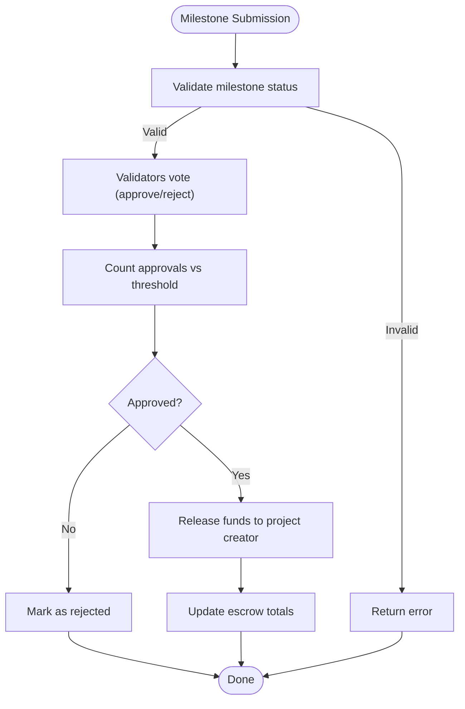

**Diagram sources**
- [contracts/escrow/src/lib.rs](file://contracts/escrow/src/lib.rs#L220-L307)
- [contracts/shared/src/events.rs](file://contracts/shared/src/events.rs#L13-L16)

**Section sources**
- [contracts/escrow/src/lib.rs](file://contracts/escrow/src/lib.rs#L19-L346)
- [contracts/README.md](file://contracts/README.md#L178-L194)

### Profit Distribution Contract Flow
The ProfitDistribution contract registers investors, accepts profits, and distributes returns proportionally. It supports manual claims and tracks claimable amounts.

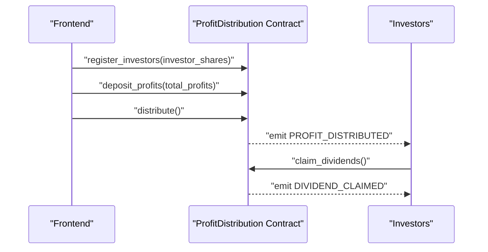

**Diagram sources**
- [contracts/README.md](file://contracts/README.md#L195-L211)
- [contracts/shared/src/events.rs](file://contracts/shared/src/events.rs#L18-L20)

**Section sources**
- [contracts/README.md](file://contracts/README.md#L195-L211)

### Subscription Pool Contract Flow
The SubscriptionPool contract manages recurring contributions, scheduled deposits, and dynamic rebalancing. It tracks subscribers and calculates withdrawals.

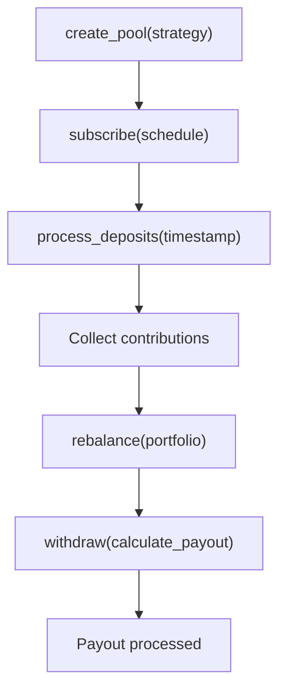

**Diagram sources**
- [contracts/README.md](file://contracts/README.md#L212-L228)

**Section sources**
- [contracts/README.md](file://contracts/README.md#L212-L228)

### Multi-Party Payment Contract Flow
The MultiPartyPayment contract splits incoming payments among stakeholders according to predefined shares, with optional vesting and withdrawal mechanisms.

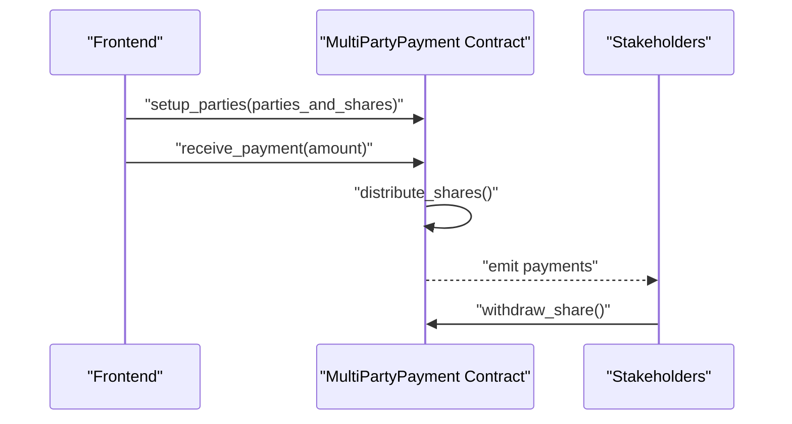

**Diagram sources**
- [contracts/README.md](file://contracts/README.md#L229-L245)

**Section sources**
- [contracts/README.md](file://contracts/README.md#L229-L245)

### Reputation and Governance Contracts
- Reputation: Registers entities, updates scores, issues badges, and tracks historical actions.
- Governance: Creates proposals, accepts votes, delegates voting power, and executes approved changes.

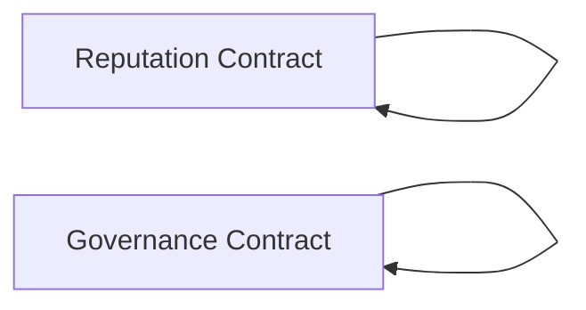

**Diagram sources**
- [contracts/README.md](file://contracts/README.md#L246-L280)

**Section sources**
- [contracts/README.md](file://contracts/README.md#L246-L280)

## Dependency Analysis
- Internal Dependencies: All contracts depend on the shared library for types, errors, events, and utilities. This centralization reduces duplication and ensures consistent behavior.
- Frontend Dependencies: The frontend depends on Next.js, React, TypeScript, Tailwind CSS, and UI libraries. Wallet integration is facilitated by Freighter/XUMM.
- External Dependencies: Contracts rely on the Soroban SDK and Soroban Token SDK; frontend relies on React ecosystem packages.

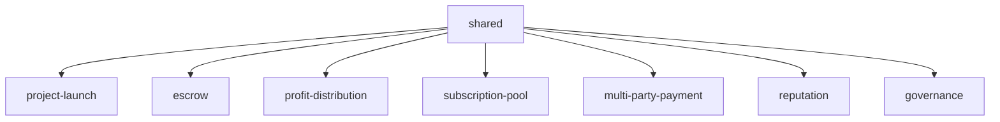

**Diagram sources**
- [contracts/Cargo.toml](file://contracts/Cargo.toml#L4-L13)
- [contracts/shared/src/lib.rs](file://contracts/shared/src/lib.rs#L1-L20)

**Section sources**
- [contracts/Cargo.toml](file://contracts/Cargo.toml#L1-L38)
- [frontend/package.json](file://frontend/package.json#L11-L30)

## Performance Considerations
- WASM Optimization: Contracts are compiled with release profiles optimized for size and performance, leveraging LTO and strip optimizations.
- Gas Efficiency: Contracts minimize storage operations and use efficient data structures to reduce transaction costs.
- Frontend Optimization: Next.js build pipeline optimizes assets and bundles; wallet interactions should batch calls to reduce on-chain transactions.

[No sources needed since this section provides general guidance]

## Troubleshooting Guide
- Contract Initialization: Ensure contracts are initialized with proper admin addresses and parameters before use.
- Event Handling: Subscribe to emitted events to keep the UI and backend synchronized with on-chain state changes.
- Wallet Integration: Verify wallet provider compatibility (Freighter/XUMM) and handle connection failures gracefully.
- State Synchronization: Use backend indexing to monitor contract events and update local caches for improved responsiveness.

**Section sources**
- [contracts/project-launch/src/lib.rs](file://contracts/project-launch/src/lib.rs#L74-L85)
- [contracts/shared/src/events.rs](file://contracts/shared/src/events.rs#L1-L31)
- [README.md](file://README.md#L169-L191)

## Conclusion
NovaFund’s architecture leverages Rust and Soroban for secure, efficient smart contracts, and a modern React/TypeScript frontend for an intuitive user experience. The modular contract design, shared utilities, and event-driven communication enable scalable and maintainable functionality across project funding, escrow management, profit distribution, recurring investments, multi-stakeholder payments, reputation, and governance.

[No sources needed since this section summarizes without analyzing specific files]

## Appendices

### System Context Diagrams
These diagrams illustrate how stakeholders interact with the platform.

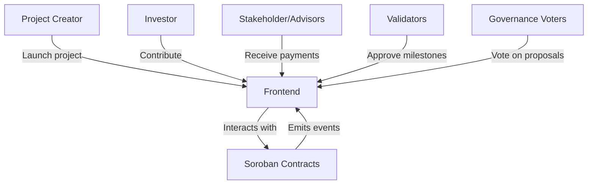

**Diagram sources**
- [README.md](file://README.md#L101-L136)
- [contracts/shared/src/events.rs](file://contracts/shared/src/events.rs#L1-L31)

### Infrastructure and Deployment Topology
- Blockchain: Deploy contracts to Stellar Testnet or Mainnet using the Soroban CLI.
- Frontend: Build and deploy static assets to a CDN or hosting provider.
- Optional Backend: Run an indexer to subscribe to contract events and maintain a relational database for enhanced queries and dashboards.

**Section sources**
- [README.md](file://README.md#L425-L454)
- [README.md](file://README.md#L185-L191)