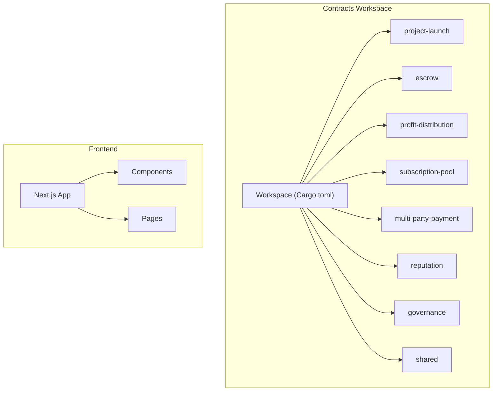
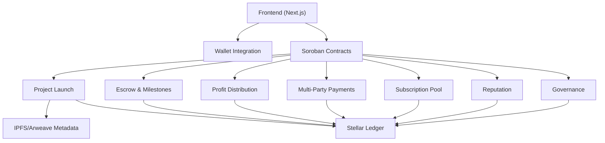
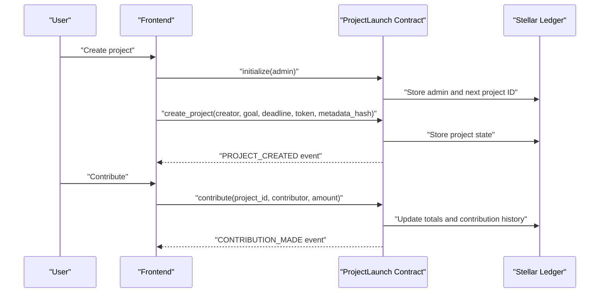
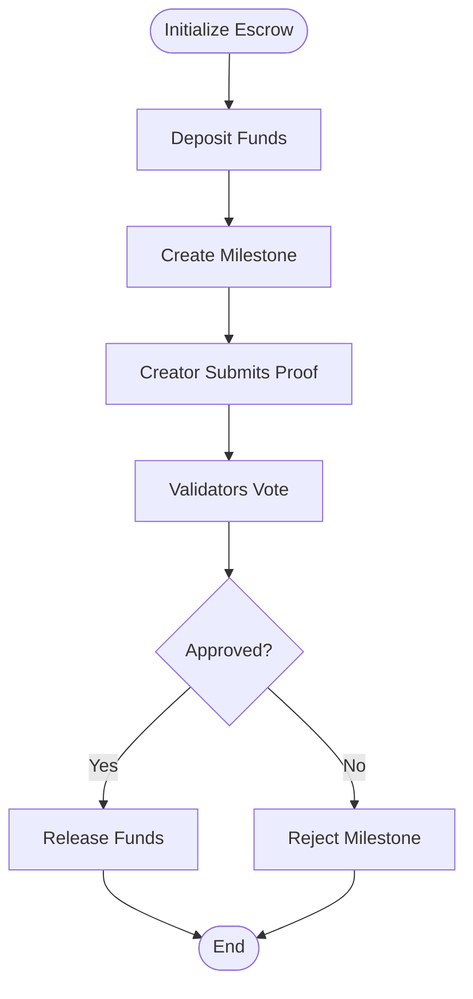
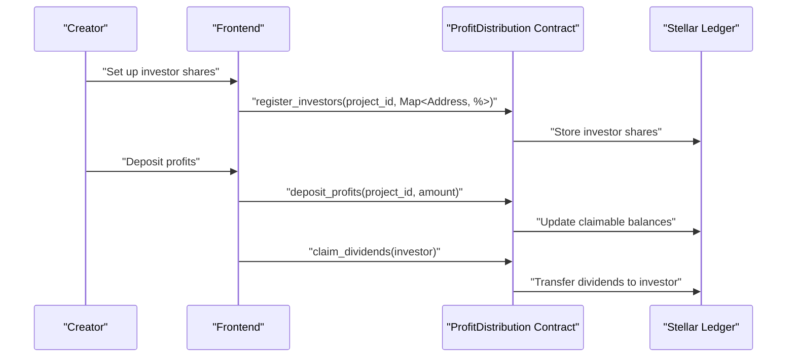
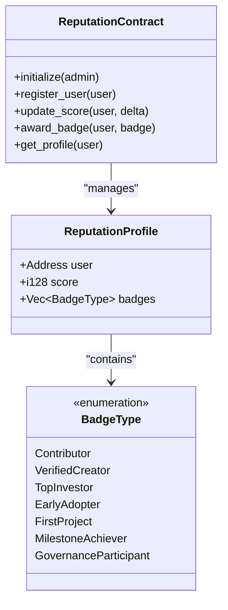
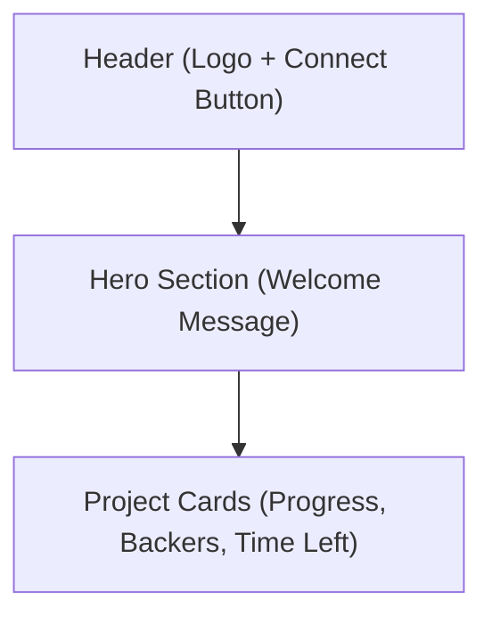
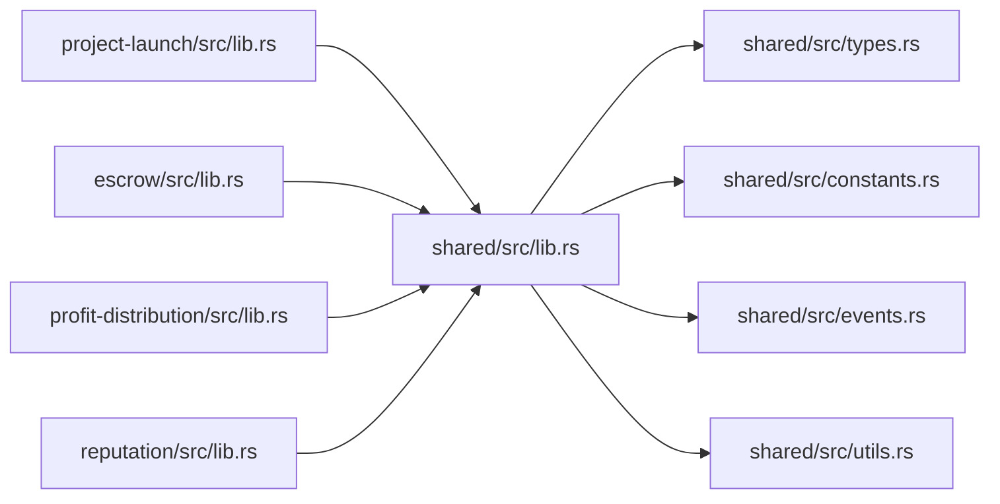

# Introduction

<cite>
**Referenced Files in This Document**
- [README.md](file://README.md)
- [contracts/README.md](file://contracts/README.md)
- [contracts/SETUP.md](file://contracts/SETUP.md)
- [contracts/Cargo.toml](file://contracts/Cargo.toml)
- [contracts/project-launch/src/lib.rs](file://contracts/project-launch/src/lib.rs)
- [contracts/escrow/src/lib.rs](file://contracts/escrow/src/lib.rs)
- [contracts/profit-distribution/src/lib.rs](file://contracts/profit-distribution/src/lib.rs)
- [contracts/reputation/src/lib.rs](file://contracts/reputation/src/lib.rs)
- [contracts/shared/src/lib.rs](file://contracts/shared/src/lib.rs)
- [contracts/shared/src/types.rs](file://contracts/shared/src/types.rs)
- [contracts/shared/src/constants.rs](file://contracts/shared/src/constants.rs)
- [contracts/shared/src/events.rs](file://contracts/shared/src/events.rs)
- [frontend/src/app/page.tsx](file://frontend/src/app/page.tsx)
- [frontend/src/components/ProjectCard.tsx](file://frontend/src/components/ProjectCard.tsx)
- [frontend/src/components/layout/Header.tsx](file://frontend/src/components/layout/Header.tsx)
</cite>

## Table of Contents
1. [Introduction](#introduction)
2. [Project Structure](#project-structure)
3. [Core Components](#core-components)
4. [Architecture Overview](#architecture-overview)
5. [Detailed Component Analysis](#detailed-component-analysis)
6. [Dependency Analysis](#dependency-analysis)
7. [Performance Considerations](#performance-considerations)
8. [Troubleshooting Guide](#troubleshooting-guide)
9. [Conclusion](#conclusion)

## Introduction
NovaFund is a decentralized micro-investment and crowdfunding platform built on the Stellar blockchain using Soroban smart contracts. Its mission is to democratize investment opportunities through community-driven funding, enabling anyone to become either a project creator or an investor in a trustless, transparent ecosystem.

At its core, NovaFund leverages smart contracts to automate trustless escrow, milestone-based fund releases, automated distribution of returns, and a reputation system that builds trust over time. On Stellar, transactions settle quickly and cheaply, making micro-investments feasible for global participation. The platform’s architecture separates concerns across specialized contracts—project launch, escrow/milestones, profit distribution, multi-party payments, subscription pools, reputation, and governance—each designed to be composable and auditable.

Beginner-friendly overview
- Blockchain crowdfunding basics: Instead of relying on intermediaries, users propose projects, raise funds in a trustless escrow, and contributors receive returns automatically when milestones are met. All actions are recorded immutably on-chain, ensuring transparency and accountability.
- Trustless escrow: Funds are held in smart contracts until predefined milestones are validated, reducing risk for investors and incentivizing creators to deliver.
- Automated distribution: Profits or returns are split proportionally to contributors’ stakes, minimizing manual administration and human error.
- Reputation system: On-chain reputation tokens reward trustworthy behavior, improve discoverability, and unlock benefits like reduced fees and governance rights.

Developer-focused overview
- Trustless and transparent: All rules are encoded in Rust-based Soroban contracts deployed on Stellar, with explicit events and state checks for verifiability.
- Composable contracts: The project-launch contract coordinates contributions; the escrow contract manages milestone approvals; the profit-distribution contract automates payouts; the reputation contract tracks trust signals; governance enables community decision-making.
- Practical examples:
  - Becoming a project creator: Deploy a project-launch contract, define funding goals and deadlines, and publish project metadata on IPFS/Arweave. Contributors fund the project, which then moves to escrow.
  - Becoming an investor: Browse projects, review metadata hashes, and contribute within the deadline. Upon successful milestone completion, returns are automatically distributed according to shares.
  - Escrow and milestones: Validators approve milestone submissions; once thresholds are met, funds are released; otherwise, contributors can request refunds.
  - Automated distribution: After profits are deposited, investors claim dividends or rely on automatic distribution based on their share percentages.
  - Reputation system: Creators and investors gain reputation scores and badges for positive actions, influencing future funding terms and governance participation.

**Section sources**
- [README.md](file://README.md#L39-L51)
- [README.md](file://README.md#L139-L166)
- [contracts/README.md](file://contracts/README.md#L107-L171)
- [contracts/README.md](file://contracts/README.md#L178-L194)
- [contracts/README.md](file://contracts/README.md#L195-L211)
- [contracts/README.md](file://contracts/README.md#L212-L228)
- [contracts/README.md](file://contracts/README.md#L229-L245)
- [contracts/README.md](file://contracts/README.md#L246-L262)
- [contracts/README.md](file://contracts/README.md#L263-L279)

## Project Structure
NovaFund is organized into two primary layers:
- Smart contracts: A multi-contract workspace implementing project lifecycle, escrow/milestones, profit distribution, multi-party payments, subscription pools, reputation, and governance.
- Frontend: A React/Next.js application providing user-facing views for browsing projects, viewing details, and interacting with the platform.

**Diagram sources**
- [contracts/Cargo.toml](file://contracts/Cargo.toml#L1-L13)
- [README.md](file://README.md#L260-L313)

**Section sources**
- [README.md](file://README.md#L260-L313)
- [contracts/Cargo.toml](file://contracts/Cargo.toml#L1-L13)

## Core Components
NovaFund’s core value proposition hinges on seven specialized contracts working together:

- ProjectLaunch: Manages project creation, funding goals, deadlines, and contribution tracking. It emits events for project creation and contributions, and maintains immutable contribution histories.
- Escrow: Holds funds in trust until milestones are approved by validators, enabling conditional releases and refund protection.
- ProfitDistribution: Automates proportional distribution of returns to investors and supports dividend claiming.
- MultiPartyPayment: Splits payments among stakeholders (creators, developers, advisors) with support for vesting and dispute resolution.
- SubscriptionPool: Enables recurring investment contributions, dynamic rebalancing, and flexible withdrawals.
- Reputation: Tracks on-chain reputation scores and badges for creators and investors, unlocking benefits and governance rights.
- Governance: Provides proposal creation, voting, delegation, and execution mechanisms for platform decisions.

These contracts share common types, constants, errors, events, and utilities via the shared library, promoting consistency and maintainability.

**Section sources**
- [contracts/README.md](file://contracts/README.md#L107-L171)
- [contracts/README.md](file://contracts/README.md#L178-L194)
- [contracts/README.md](file://contracts/README.md#L195-L211)
- [contracts/README.md](file://contracts/README.md#L212-L228)
- [contracts/README.md](file://contracts/README.md#L229-L245)
- [contracts/README.md](file://contracts/README.md#L246-L262)
- [contracts/README.md](file://contracts/README.md#L263-L279)
- [contracts/shared/src/lib.rs](file://contracts/shared/src/lib.rs#L1-L20)

## Architecture Overview
NovaFund’s architecture is layered and modular:
- Frontend (React + TypeScript): Provides user interfaces for project discovery, funding, portfolio management, and wallet integration.
- Stellar Network Layer: Executes Soroban smart contracts that govern the entire funding lifecycle.
- Data & Storage Layer: Off-chain metadata stored on IPFS/Arweave; on-chain transactions recorded on the Stellar ledger.

**Diagram sources**
- [README.md](file://README.md#L101-L136)
- [contracts/README.md](file://contracts/README.md#L107-L171)
- [contracts/README.md](file://contracts/README.md#L178-L194)
- [contracts/README.md](file://contracts/README.md#L195-L211)
- [contracts/README.md](file://contracts/README.md#L212-L228)
- [contracts/README.md](file://contracts/README.md#L229-L245)
- [contracts/README.md](file://contracts/README.md#L246-L262)
- [contracts/README.md](file://contracts/README.md#L263-L279)

## Detailed Component Analysis

### ProjectLaunch Contract
ProjectLaunch is the foundation of the funding process. It validates funding goals, deadlines, and contribution amounts, stores immutable project metadata (via IPFS/Arweave hashes), and tracks contributions over time. It emits events for project creation and contributions, enabling real-time dashboards and analytics.

Practical example (conceptual):
- A creator deploys the project-launch contract, sets a funding goal and deadline, and publishes project metadata on IPFS/Arweave. Investors browse the project, review metadata, and contribute within the deadline. The contract records each contribution and emits events for transparency.

**Diagram sources**
- [contracts/project-launch/src/lib.rs](file://contracts/project-launch/src/lib.rs#L74-L248)
- [contracts/shared/src/events.rs](file://contracts/shared/src/events.rs#L3-L11)

**Section sources**
- [contracts/project-launch/src/lib.rs](file://contracts/project-launch/src/lib.rs#L14-L37)
- [contracts/project-launch/src/lib.rs](file://contracts/project-launch/src/lib.rs#L87-L149)
- [contracts/project-launch/src/lib.rs](file://contracts/project-launch/src/lib.rs#L151-L212)
- [contracts/shared/src/constants.rs](file://contracts/shared/src/constants.rs#L9-L22)
- [contracts/shared/src/events.rs](file://contracts/shared/src/events.rs#L3-L11)

### Escrow Contract (Trustless Escrow and Milestones)
Escrow holds funds in trust and releases them conditionally upon milestone approval. Validators approve or reject milestone submissions, and upon reaching the approval threshold, funds are released automatically. If milestones are not met, contributors can request refunds.

Practical example (conceptual):
- A project uses the escrow contract to lock raised funds. The creator submits milestone proofs; validators review and vote. Once the approval threshold is met, the escrow contract releases the funds to the creator, and the system emits a release event.

**Diagram sources**
- [contracts/escrow/src/lib.rs](file://contracts/escrow/src/lib.rs#L24-L70)
- [contracts/escrow/src/lib.rs](file://contracts/escrow/src/lib.rs#L105-L167)
- [contracts/escrow/src/lib.rs](file://contracts/escrow/src/lib.rs#L169-L307)
- [contracts/shared/src/constants.rs](file://contracts/shared/src/constants.rs#L24-L28)
- [contracts/shared/src/events.rs](file://contracts/shared/src/events.rs#L13-L16)

**Section sources**
- [contracts/escrow/src/lib.rs](file://contracts/escrow/src/lib.rs#L19-L346)
- [contracts/shared/src/constants.rs](file://contracts/shared/src/constants.rs#L24-L28)
- [contracts/shared/src/events.rs](file://contracts/shared/src/events.rs#L13-L16)

### ProfitDistribution Contract (Automated Distribution)
ProfitDistribution registers investor shares, accepts profit deposits, and triggers automated distributions. Investors can also claim dividends manually. The contract maintains investor share records and distribution history.

Practical example (conceptual):
- After a project generates revenue, the creator deposits profits into the profit-distribution contract. Based on investor share percentages, the contract distributes returns automatically or allows investors to claim dividends.

**Diagram sources**
- [contracts/profit-distribution/src/lib.rs](file://contracts/profit-distribution/src/lib.rs#L31-L78)
- [contracts/shared/src/events.rs](file://contracts/shared/src/events.rs#L18-L20)

**Section sources**
- [contracts/profit-distribution/src/lib.rs](file://contracts/profit-distribution/src/lib.rs#L31-L78)
- [contracts/shared/src/events.rs](file://contracts/shared/src/events.rs#L18-L20)

### Reputation Contract (On-Chain Reputation System)
Reputation tracks user profiles, scores, and badges. Administrators can update scores and award badges, while users can query their profiles. This creates a trust layer that influences funding terms and governance participation.

Practical example (conceptual):
- New users register to receive a default reputation score. Creators and investors gain reputation through successful actions. Administrators can adjust scores and award badges, which are reflected in the user’s profile.

**Diagram sources**
- [contracts/reputation/src/lib.rs](file://contracts/reputation/src/lib.rs#L56-L252)
- [contracts/reputation/src/lib.rs](file://contracts/reputation/src/lib.rs#L41-L51)

**Section sources**
- [contracts/reputation/src/lib.rs](file://contracts/reputation/src/lib.rs#L56-L252)
- [contracts/shared/src/constants.rs](file://contracts/shared/src/constants.rs#L30-L33)
- [contracts/shared/src/events.rs](file://contracts/shared/src/events.rs#L27-L30)

### Frontend Overview (Beginner-Friendly)
The frontend offers a clean, modern interface for discovering projects, reviewing details, and interacting with the platform. It integrates with wallets and displays project cards with progress bars, stats, and categories.

Practical example (conceptual):
- Users connect their wallets, browse curated project cards, and navigate to project pages to learn more. The interface highlights funding progress, backers count, and time remaining to encourage participation.

**Diagram sources**
- [frontend/src/components/layout/Header.tsx](file://frontend/src/components/layout/Header.tsx#L4-L15)
- [frontend/src/app/page.tsx](file://frontend/src/app/page.tsx#L1-L16)
- [frontend/src/components/ProjectCard.tsx](file://frontend/src/components/ProjectCard.tsx#L25-L115)

**Section sources**
- [frontend/src/components/layout/Header.tsx](file://frontend/src/components/layout/Header.tsx#L4-L15)
- [frontend/src/app/page.tsx](file://frontend/src/app/page.tsx#L1-L16)
- [frontend/src/components/ProjectCard.tsx](file://frontend/src/components/ProjectCard.tsx#L25-L115)

## Dependency Analysis
The contracts workspace uses a shared library to centralize common types, constants, errors, events, and utilities. This reduces duplication and ensures consistent behavior across contracts.

**Diagram sources**
- [contracts/shared/src/lib.rs](file://contracts/shared/src/lib.rs#L1-L20)
- [contracts/project-launch/src/lib.rs](file://contracts/project-launch/src/lib.rs#L3-L12)
- [contracts/escrow/src/lib.rs](file://contracts/escrow/src/lib.rs#L3-L9)
- [contracts/profit-distribution/src/lib.rs](file://contracts/profit-distribution/src/lib.rs#L12-L24)
- [contracts/reputation/src/lib.rs](file://contracts/reputation/src/lib.rs#L3-L6)

**Section sources**
- [contracts/shared/src/lib.rs](file://contracts/shared/src/lib.rs#L1-L20)
- [contracts/shared/src/types.rs](file://contracts/shared/src/types.rs#L1-L41)
- [contracts/shared/src/constants.rs](file://contracts/shared/src/constants.rs#L1-L40)
- [contracts/shared/src/events.rs](file://contracts/shared/src/events.rs#L1-L31)

## Performance Considerations
- Gas optimization: Contracts are compiled with release profiles and optimized WASM to minimize transaction costs. The workspace enforces strict profiles and LTO for smaller binaries.
- Efficient storage: Contracts use compact data structures and minimize persistent writes. Shared utilities provide helpers for calculations and validations.
- Fast settlement: Built on Stellar, transactions settle quickly and cheaply, enabling micro-investments and frequent distribution cycles.

**Section sources**
- [contracts/Cargo.toml](file://contracts/Cargo.toml#L25-L38)
- [contracts/README.md](file://contracts/README.md#L304-L311)

## Troubleshooting Guide
Common issues and resolutions:
- Contract not initialized: Ensure admin initialization is performed before invoking privileged functions. Check initialization flags and admin addresses.
- Invalid inputs: Funding goals, deadlines, and contribution amounts must meet minimum thresholds. Validate timestamps and durations.
- Milestone approval failures: Ensure validators meet the minimum threshold and that milestones do not exceed escrow balances.
- Reputation profile errors: Users must be registered before updating scores or awarding badges. Verify initialization and access controls.

**Section sources**
- [contracts/project-launch/src/lib.rs](file://contracts/project-launch/src/lib.rs#L74-L85)
- [contracts/project-launch/src/lib.rs](file://contracts/project-launch/src/lib.rs#L96-L111)
- [contracts/escrow/src/lib.rs](file://contracts/escrow/src/lib.rs#L37-L48)
- [contracts/escrow/src/lib.rs](file://contracts/escrow/src/lib.rs#L266-L270)
- [contracts/reputation/src/lib.rs](file://contracts/reputation/src/lib.rs#L66-L82)
- [contracts/reputation/src/lib.rs](file://contracts/reputation/src/lib.rs#L131-L157)

## Conclusion
NovaFund delivers a trustless, transparent, and composable crowdfunding stack on Stellar powered by Soroban. By combining trustless escrow, milestone-based releases, automated distribution, and a reputation system, it lowers barriers to entry and empowers both creators and investors. Beginners can quickly understand the platform’s mechanics, while developers can leverage the modular contracts and shared utilities to build advanced financial products and experiences.