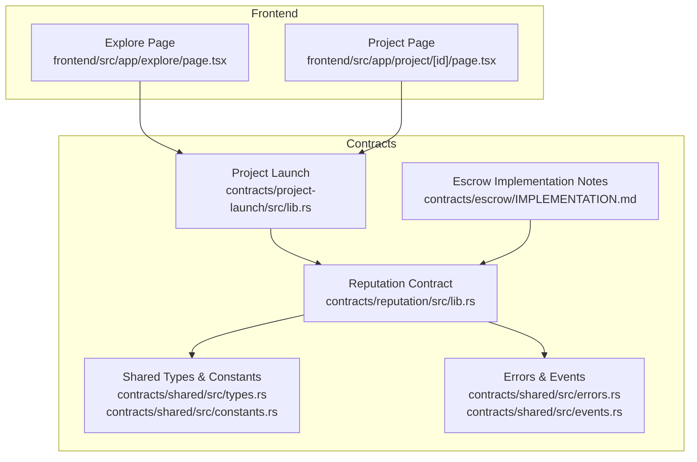
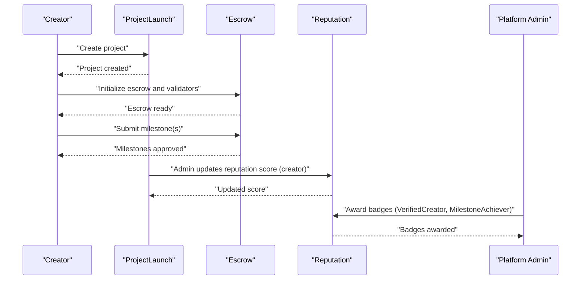
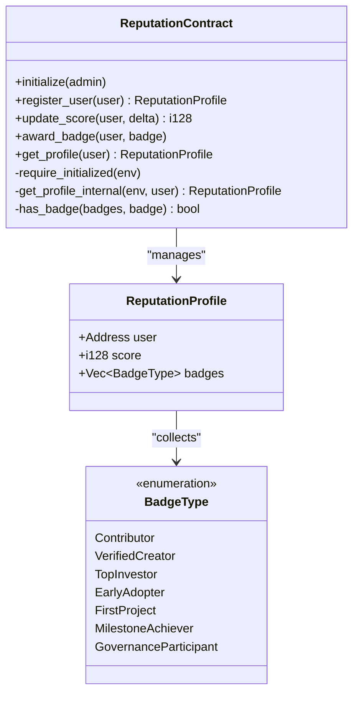
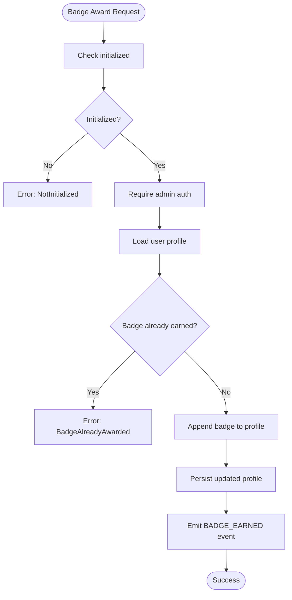
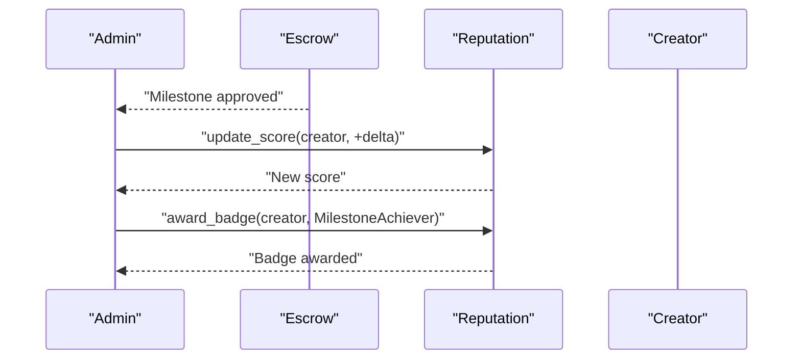
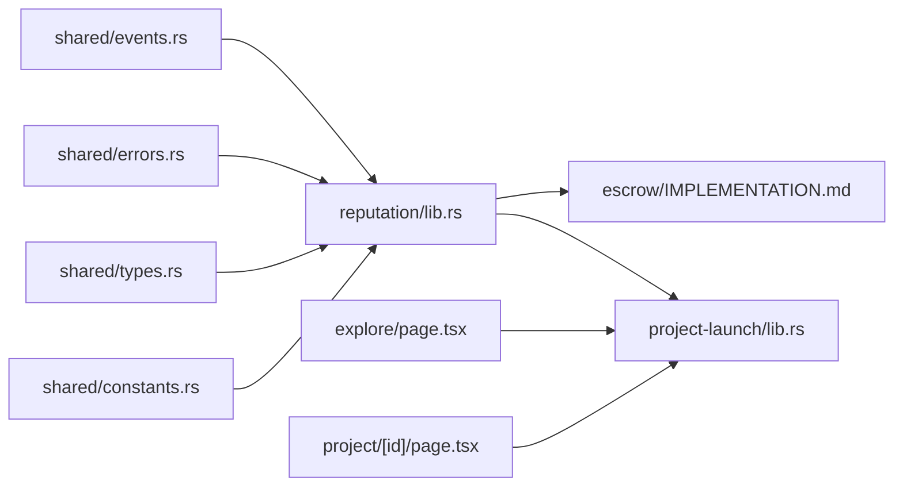

# Reputation & Reward System

<cite>
**Referenced Files in This Document**
- [README.md](file://README.md)
- [contracts/README.md](file://contracts/README.md)
- [contracts/reputation/src/lib.rs](file://contracts/reputation/src/lib.rs)
- [contracts/shared/src/constants.rs](file://contracts/shared/src/constants.rs)
- [contracts/shared/src/errors.rs](file://contracts/shared/src/errors.rs)
- [contracts/shared/src/events.rs](file://contracts/shared/src/events.rs)
- [contracts/project-launch/src/lib.rs](file://contracts/project-launch/src/lib.rs)
- [contracts/escrow/IMPLEMENTATION.md](file://contracts/escrow/IMPLEMENTATION.md)
- [frontend/src/app/explore/page.tsx](file://frontend/src/app/explore/page.tsx)
- [frontend/src/app/project/[id]/page.tsx](file://frontend/src/app/project/[id]/page.tsx)
</cite>

## Table of Contents
1. [Introduction](#introduction)
2. [Project Structure](#project-structure)
3. [Core Components](#core-components)
4. [Architecture Overview](#architecture-overview)
5. [Detailed Component Analysis](#detailed-component-analysis)
6. [Dependency Analysis](#dependency-analysis)
7. [Performance Considerations](#performance-considerations)
8. [Troubleshooting Guide](#troubleshooting-guide)
9. [Conclusion](#conclusion)
10. [Appendices](#appendices)

## Introduction
This document explains the Reputation & Reward System that underpins trust and community recognition on the NovaFund platform. It focuses on how the reputation contract tracks and manages creator trust scores, how badges signal achievements, and how reputation influences premium access, reduced fees, and governance participation. It also outlines how reputation integrates with project success metrics, contributor feedback, and platform participation requirements to create a self-regulating, trustworthy funding ecosystem.

## Project Structure
The reputation system is implemented as a standalone smart contract with shared types, constants, errors, and events. It interacts with the broader NovaFund ecosystem through cross-contract calls during project lifecycle events.

**Diagram sources**
- [contracts/reputation/src/lib.rs](file://contracts/reputation/src/lib.rs#L1-L510)
- [contracts/shared/src/types.rs](file://contracts/shared/src/types.rs#L1-L41)
- [contracts/shared/src/constants.rs](file://contracts/shared/src/constants.rs#L1-L40)
- [contracts/shared/src/errors.rs](file://contracts/shared/src/errors.rs#L1-L54)
- [contracts/shared/src/events.rs](file://contracts/shared/src/events.rs#L1-L31)
- [contracts/project-launch/src/lib.rs](file://contracts/project-launch/src/lib.rs#L1-L363)
- [contracts/escrow/IMPLEMENTATION.md](file://contracts/escrow/IMPLEMENTATION.md#L39-L358)
- [frontend/src/app/explore/page.tsx](file://frontend/src/app/explore/page.tsx#L1-L239)
- [frontend/src/app/project/[id]/page.tsx](file://frontend/src/app/project/[id]/page.tsx#L1-L384)

**Section sources**
- [README.md](file://README.md#L92-L98)
- [contracts/README.md](file://contracts/README.md#L246-L262)

## Core Components
- Reputation Contract: Manages user profiles, reputation scores, and badge awards. Admin-only functions update scores and award badges; all other functions are public.
- Shared Types and Constants: Provide common data structures and numeric constants (including reputation ranges).
- Errors and Events: Define domain-specific errors (e.g., reputation-related) and standardized event symbols for reputation updates and badge awards.
- Project Launch and Escrow: Provide the project lifecycle context where reputation can be influenced by successful outcomes and milestone approvals.

Key capabilities:
- Initialize the contract with an admin.
- Register users with a default reputation score.
- Update reputation scores (admin-only).
- Award badges (admin-only).
- Query user profiles.

**Section sources**
- [contracts/reputation/src/lib.rs](file://contracts/reputation/src/lib.rs#L56-L252)
- [contracts/shared/src/constants.rs](file://contracts/shared/src/constants.rs#L30-L36)
- [contracts/shared/src/errors.rs](file://contracts/shared/src/errors.rs#L40-L46)
- [contracts/shared/src/events.rs](file://contracts/shared/src/events.rs#L27-L31)

## Architecture Overview
The reputation system is designed to be a neutral, on-chain scoring mechanism that external contracts and frontends can consult to determine trust signals. The following sequence illustrates how reputation can be updated during project lifecycle events.

**Diagram sources**
- [contracts/project-launch/src/lib.rs](file://contracts/project-launch/src/lib.rs#L87-L149)
- [contracts/escrow/IMPLEMENTATION.md](file://contracts/escrow/IMPLEMENTATION.md#L80-L358)
- [contracts/reputation/src/lib.rs](file://contracts/reputation/src/lib.rs#L131-L196)

## Detailed Component Analysis

### Reputation Contract
The reputation contract maintains a persistent profile per address, including a clamped reputation score and a vector of badges. It exposes:
- Initialization with admin-only access.
- User registration with default score.
- Score updates with clamping to configured min/max bounds.
- Badge awards with duplicate prevention.
- Public profile queries.

**Diagram sources**
- [contracts/reputation/src/lib.rs](file://contracts/reputation/src/lib.rs#L56-L252)

**Section sources**
- [contracts/reputation/src/lib.rs](file://contracts/reputation/src/lib.rs#L56-L252)

### Reputation Calculation and Scoring
- Default start score and bounded range are defined centrally.
- Score updates clamp to the configured min/max thresholds.
- There is no explicit algorithmic formula in the reputation contract; scoring is admin-driven.

Practical implications:
- Administrators can increase or decrease scores to reflect trustworthiness.
- Scores are clamped to prevent overflow or underflow.

**Section sources**
- [contracts/shared/src/constants.rs](file://contracts/shared/src/constants.rs#L30-L36)
- [contracts/reputation/src/lib.rs](file://contracts/reputation/src/lib.rs#L142-L144)

### Badge System and Achievement Recognition
Badge types include:
- Contributor
- VerifiedCreator
- TopInvestor
- EarlyAdopter
- FirstProject
- MilestoneAchiever
- GovernanceParticipant

Badge awarding:
- Admin-only operation.
- Duplicate badges are prevented.
- Badges persist with the user profile.

**Diagram sources**
- [contracts/reputation/src/lib.rs](file://contracts/reputation/src/lib.rs#L168-L196)
- [contracts/shared/src/errors.rs](file://contracts/shared/src/errors.rs#L44-L46)
- [contracts/shared/src/events.rs](file://contracts/shared/src/events.rs#L27-L31)

**Section sources**
- [contracts/reputation/src/lib.rs](file://contracts/reputation/src/lib.rs#L20-L39)
- [contracts/reputation/src/lib.rs](file://contracts/reputation/src/lib.rs#L168-L196)
- [contracts/shared/src/errors.rs](file://contracts/shared/src/errors.rs#L44-L46)
- [contracts/shared/src/events.rs](file://contracts/shared/src/events.rs#L27-L31)

### Integration with Project Success Metrics
While the reputation contract does not compute scores algorithmically, it can be integrated with project outcomes:
- Successful milestone approvals and project completions can trigger admin score increases.
- Verified creators and first-project completions can be rewarded with badges.
- Milestone achievement badges recognize contributor and creator efforts.

**Diagram sources**
- [contracts/escrow/IMPLEMENTATION.md](file://contracts/escrow/IMPLEMENTATION.md#L67-L78)
- [contracts/reputation/src/lib.rs](file://contracts/reputation/src/lib.rs#L131-L157)
- [contracts/reputation/src/lib.rs](file://contracts/reputation/src/lib.rs#L168-L196)

**Section sources**
- [contracts/escrow/IMPLEMENTATION.md](file://contracts/escrow/IMPLEMENTATION.md#L67-L78)
- [contracts/reputation/src/lib.rs](file://contracts/reputation/src/lib.rs#L131-L196)

### Integration with Contributor Feedback Systems
Although a formal feedback contract is not present in the current codebase, the reputation system can be extended to incorporate:
- Feedback-weighted score adjustments.
- Community voting on contributor reliability.
- Threshold-based badge eligibility derived from feedback.

This extension would maintain the existing admin-only update pattern while adding data inputs from feedback sources.

[No sources needed since this section proposes conceptual extensions]

### Platform Participation Requirements
Reputation can gate access to premium features:
- Minimum reputation thresholds for launching verified projects.
- Reduced platform fees for high-reputation creators.
- Governance participation rights proportional to reputation.

These policies are enforced off-chain by frontends and on-chain by contracts that consult the reputation contract.

**Section sources**
- [README.md](file://README.md#L92-L98)
- [frontend/src/app/explore/page.tsx](file://frontend/src/app/explore/page.tsx#L1-L239)
- [frontend/src/app/project/[id]/page.tsx](file://frontend/src/app/project/[id]/page.tsx#L1-L384)

### Practical Examples

- Building reputation through successful project completions:
  - Admin increases creator’s score after successful milestone approvals and project completion.
  - Creator earns “VerifiedCreator” and “FirstProject” badges upon first verified project completion.

- High reputation unlocking better funding terms:
  - Frontend enforces a minimum reputation threshold for advanced project features.
  - Contracts can reduce platform fees for creators meeting reputation targets.

- Reputation tokens granting governance rights:
  - Governance participation requires a minimum reputation level.
  - Voting power can be proportional to reputation score.

**Section sources**
- [contracts/reputation/src/lib.rs](file://contracts/reputation/src/lib.rs#L131-L196)
- [README.md](file://README.md#L92-L98)
- [frontend/src/app/explore/page.tsx](file://frontend/src/app/explore/page.tsx#L1-L239)
- [frontend/src/app/project/[id]/page.tsx](file://frontend/src/app/project/[id]/page.tsx#L1-L384)

## Dependency Analysis
The reputation contract depends on shared types and constants for consistent scoring and on errors/events for robust operation. It is consumed by higher-level contracts and frontends to enforce policy and display trust signals.

**Diagram sources**
- [contracts/shared/src/constants.rs](file://contracts/shared/src/constants.rs#L30-L36)
- [contracts/shared/src/types.rs](file://contracts/shared/src/types.rs#L30-L41)
- [contracts/shared/src/errors.rs](file://contracts/shared/src/errors.rs#L40-L46)
- [contracts/shared/src/events.rs](file://contracts/shared/src/events.rs#L27-L31)
- [contracts/reputation/src/lib.rs](file://contracts/reputation/src/lib.rs#L1-L510)
- [contracts/project-launch/src/lib.rs](file://contracts/project-launch/src/lib.rs#L1-L363)
- [contracts/escrow/IMPLEMENTATION.md](file://contracts/escrow/IMPLEMENTATION.md#L39-L358)
- [frontend/src/app/explore/page.tsx](file://frontend/src/app/explore/page.tsx#L1-L239)
- [frontend/src/app/project/[id]/page.tsx](file://frontend/src/app/project/[id]/page.tsx#L1-L384)

**Section sources**
- [contracts/shared/src/constants.rs](file://contracts/shared/src/constants.rs#L30-L36)
- [contracts/shared/src/errors.rs](file://contracts/shared/src/errors.rs#L40-L46)
- [contracts/shared/src/events.rs](file://contracts/shared/src/events.rs#L27-L31)
- [contracts/reputation/src/lib.rs](file://contracts/reputation/src/lib.rs#L1-L510)

## Performance Considerations
- Storage footprint: Each profile stores a small vector of badges; badge counts are expected to be modest.
- Access control: Admin-only functions ensure controlled updates and prevent spamming.
- Event emission: Updates and badge awards emit events for efficient off-chain indexing.

[No sources needed since this section provides general guidance]

## Troubleshooting Guide
Common issues and resolutions:
- NotInitialized: Ensure the reputation contract is initialized before use.
- UserAlreadyRegistered: Register only once per address.
- UserNotRegistered: Register the user before attempting updates or queries.
- BadgeAlreadyAwarded: Prevents duplicate badges; check profile before re-awarding.
- Unauthorized: Admin-only functions require proper authorization.

**Section sources**
- [contracts/shared/src/errors.rs](file://contracts/shared/src/errors.rs#L8-L46)
- [contracts/reputation/src/lib.rs](file://contracts/reputation/src/lib.rs#L66-L82)
- [contracts/reputation/src/lib.rs](file://contracts/reputation/src/lib.rs#L92-L120)
- [contracts/reputation/src/lib.rs](file://contracts/reputation/src/lib.rs#L168-L196)

## Conclusion
The Reputation & Reward System establishes a transparent, on-chain foundation for trust and recognition on NovaFund. Through admin-managed score updates and badge awards, it incentivizes reliable creators, facilitates premium access, and supports governance participation. Integration with project success metrics and platform participation requirements creates a self-regulating ecosystem where reputation drives better funding terms and community influence.

[No sources needed since this section summarizes without analyzing specific files]

## Appendices

### Appendix A: Badge Definitions
- Contributor: Recognizes contributions to projects.
- VerifiedCreator: For creators who meet verification criteria.
- TopInvestor: For top investors by trading volume.
- EarlyAdopter: For early platform participants.
- FirstProject: For creators completing their first project.
- MilestoneAchiever: For successful milestone completions.
- GovernanceParticipant: For active governance participants.

**Section sources**
- [contracts/reputation/src/lib.rs](file://contracts/reputation/src/lib.rs#L24-L39)

### Appendix B: Reputation Ranges and Defaults
- REPUTATION_MIN: Lower bound for scores.
- REPUTATION_MAX: Upper bound for scores.
- REPUTATION_START: Default score for new users.

**Section sources**
- [contracts/shared/src/constants.rs](file://contracts/shared/src/constants.rs#L30-L36)