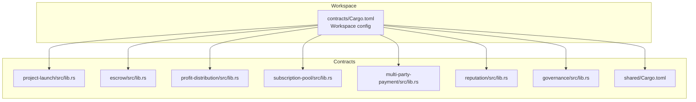
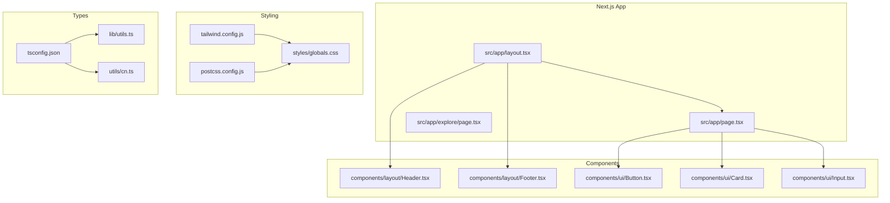
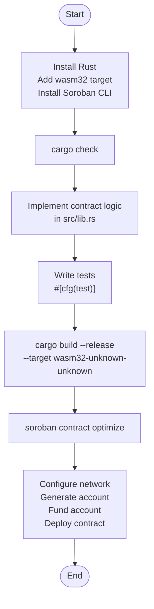
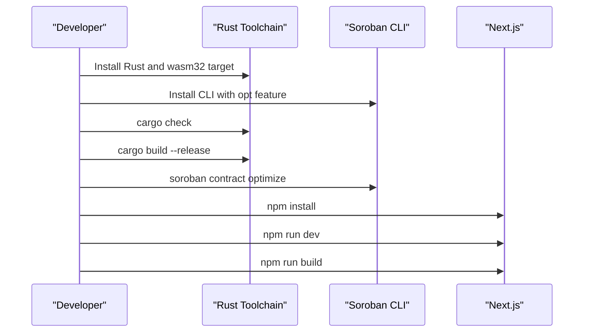
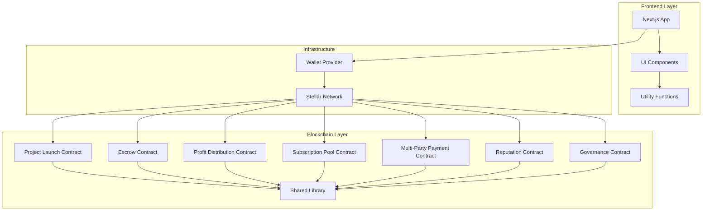

# Technology Stack

<cite>
**Referenced Files in This Document**
- [contracts/Cargo.toml](file://contracts/Cargo.toml)
- [contracts/README.md](file://contracts/README.md)
- [contracts/SETUP.md](file://contracts/SETUP.md)
- [contracts/shared/Cargo.toml](file://contracts/shared/Cargo.toml)
- [contracts/escrow/src/lib.rs](file://contracts/escrow/src/lib.rs)
- [contracts/project-launch/src/lib.rs](file://contracts/project-launch/src/lib.rs)
- [frontend/package.json](file://frontend/package.json)
- [frontend/tailwind.config.js](file://frontend/tailwind.config.js)
- [frontend/tsconfig.json](file://frontend/tsconfig.json)
- [frontend/postcss.config.js](file://frontend/postcss.config.js)
- [frontend/next.config.mjs](file://frontend/next.config.mjs)
- [frontend/src/app/layout.tsx](file://frontend/src/app/layout.tsx)
- [frontend/src/components/ui/Button.tsx](file://frontend/src/components/ui/Button.tsx)
- [frontend/src/lib/utils.ts](file://frontend/src/lib/utils.ts)
</cite>

## Table of Contents
1. [Introduction](#introduction)
2. [Smart Contract Development Stack](#smart-contract-development-stack)
3. [Frontend Technology Stack](#frontend-technology-stack)
4. [Shared Infrastructure and Utilities](#shared-infrastructure-and-utilities)
5. [Development Tools and Workflows](#development-tools-and-workflows)
6. [Version Requirements and Compatibility](#version-requirements-and-compatibility)
7. [Installation and Setup Requirements](#installation-and-setup-requirements)
8. [Architecture Overview](#architecture-overview)
9. [Troubleshooting Guide](#troubleshooting-guide)
10. [Conclusion](#conclusion)

## Introduction
This document provides a comprehensive overview of the NovaFund technology stack, detailing the smart contract development environment built on Rust and Soroban, the frontend framework powered by Next.js and React, and the supporting infrastructure that enables decentralized crowdfunding on the Stellar blockchain. It explains the rationale behind each technology choice, their roles within the system, and the version requirements and setup procedures necessary for development and deployment.

## Smart Contract Development Stack
The smart contracts are implemented in Rust using the Soroban SDK and compiled to WebAssembly for execution on the Stellar blockchain. The workspace configuration centralizes dependencies and ensures consistent builds across all contracts.

### Why These Technologies
- **Rust**: Provides memory safety, performance, and determinism required for blockchain smart contracts. The language's zero-cost abstractions and strong type system reduce runtime errors and improve maintainability.
- **Soroban SDK**: Offers a high-level interface for developing on-chain logic, managing storage, emitting events, and interacting with Stellar ledger features. It simplifies cross-contract communication and state management.
- **Stellar Blockchain**: Provides a robust, permissionless network with low transaction fees and fast settlement suitable for micro-investments and decentralized governance.

### Core Components
- **Workspace Configuration**: Centralizes Rust edition, minimum version, and shared dependencies across contracts.
- **Contract Packages**: Individual crates for each contract module with shared dependencies via workspace inheritance.
- **Shared Library**: Reusable types, errors, events, utilities, and constants to avoid duplication and ensure consistency.

**Diagram sources**
- [contracts/Cargo.toml](file://contracts/Cargo.toml#L1-L38)
- [contracts/shared/Cargo.toml](file://contracts/shared/Cargo.toml#L1-L12)
- [contracts/project-launch/src/lib.rs](file://contracts/project-launch/src/lib.rs#L1-L363)
- [contracts/escrow/src/lib.rs](file://contracts/escrow/src/lib.rs#L1-L367)

**Section sources**
- [contracts/Cargo.toml](file://contracts/Cargo.toml#L1-L38)
- [contracts/shared/Cargo.toml](file://contracts/shared/Cargo.toml#L1-L12)

### Smart Contract Modules
- **Project Launch**: Manages project creation, funding goals, deadlines, and contribution tracking with strict validation and event emission.
- **Escrow**: Handles milestone-based fund management with validator approval thresholds and automated fund releases.
- **Profit Distribution**: Enables proportional distribution of returns to investors with registration and claim mechanisms.
- **Subscription Pool**: Supports recurring investment pools with scheduling, rebalancing, and withdrawal calculations.
- **Multi-Party Payment**: Splits payments among multiple stakeholders according to predefined allocations.
- **Reputation**: Tracks on-chain reputation scores and badges for creators and investors.
- **Governance**: Implements proposal creation, voting, delegation, and execution workflows.
- **Shared Library**: Provides common data structures, error enums, event definitions, utility functions, and constants.

**Section sources**
- [contracts/README.md](file://contracts/README.md#L1-L334)
- [contracts/SETUP.md](file://contracts/SETUP.md#L1-L153)
- [contracts/project-launch/src/lib.rs](file://contracts/project-launch/src/lib.rs#L1-L363)
- [contracts/escrow/src/lib.rs](file://contracts/escrow/src/lib.rs#L1-L367)

## Frontend Technology Stack
The frontend is built with Next.js 14.1.0, React 18.x, TypeScript 5.x, and Tailwind CSS 3.3.x. It leverages modern tooling for type safety, styling, and developer experience while integrating seamlessly with wallet providers for blockchain interactions.

### Why These Technologies
- **Next.js**: Provides a production-ready React framework with server-side rendering, static generation, and optimized performance, ideal for content-rich pages and dashboards.
- **React 18+**: Offers concurrent rendering, automatic batching, and improved performance for interactive UIs.
- **TypeScript 5.0+**: Ensures type safety across components, hooks, and API integrations, reducing runtime errors and improving maintainability.
- **Tailwind CSS**: Delivers utility-first styling with customizable design systems, enabling rapid UI iteration and consistent theming.

### Core Components
- **Application Layout**: Root layout defines metadata, font loading, and global structure with header and footer components.
- **UI Components**: Reusable components like Button with variant and size options, integrated with Tailwind utility classes.
- **Styling Pipeline**: Tailwind CSS configured with PostCSS and autoprefixer for modern CSS processing and browser compatibility.
- **TypeScript Configuration**: Strict compiler options, bundler resolution, and path aliases for clean imports and efficient builds.

**Diagram sources**
- [frontend/src/app/layout.tsx](file://frontend/src/app/layout.tsx#L1-L29)
- [frontend/tailwind.config.js](file://frontend/tailwind.config.js#L1-L48)
- [frontend/postcss.config.js](file://frontend/postcss.config.js#L1-L7)
- [frontend/tsconfig.json](file://frontend/tsconfig.json#L1-L28)
- [frontend/src/lib/utils.ts](file://frontend/src/lib/utils.ts#L1-L7)

**Section sources**
- [frontend/package.json](file://frontend/package.json#L1-L32)
- [frontend/tailwind.config.js](file://frontend/tailwind.config.js#L1-L48)
- [frontend/tsconfig.json](file://frontend/tsconfig.json#L1-L28)
- [frontend/postcss.config.js](file://frontend/postcss.config.js#L1-L7)
- [frontend/src/app/layout.tsx](file://frontend/src/app/layout.tsx#L1-L29)
- [frontend/src/components/ui/Button.tsx](file://frontend/src/components/ui/Button.tsx#L1-L39)
- [frontend/src/lib/utils.ts](file://frontend/src/lib/utils.ts#L1-L7)

## Shared Infrastructure and Utilities
The shared library consolidates common types, errors, events, and utilities used across contracts, ensuring consistency and reducing duplication. It also defines constants and helper functions for validation and storage operations.

### Shared Library Modules
- **types.rs**: Defines shared data structures used by multiple contracts.
- **errors.rs**: Centralizes error enumerations for consistent error handling.
- **events.rs**: Standardizes event definitions for on-chain activity tracking.
- **utils.rs**: Provides helper functions for validation and common operations.
- **constants.rs**: Holds platform-wide constants such as thresholds and limits.

**Section sources**
- [contracts/README.md](file://contracts/README.md#L281-L289)
- [contracts/shared/Cargo.toml](file://contracts/shared/Cargo.toml#L1-L12)

## Development Tools and Workflows
The development workflow integrates Rust tooling, Soroban CLI, and Next.js tooling to streamline contract development, testing, and deployment.

### Development Workflow
- **Prerequisites**: Install Rust, add wasm32 target, and install Soroban CLI.
- **Verification**: Use cargo check to validate without building.
- **Implementation**: Implement contract logic in src/lib.rs, write tests in #[cfg(test)] modules.
- **Building**: Compile to WASM using cargo build with release profile.
- **Testing**: Run unit and integration tests across contracts.
- **Optimization**: Optimize WASM binaries using soroban contract optimize.
- **Deployment**: Configure networks, generate accounts, fund accounts, and deploy contracts.

**Diagram sources**
- [contracts/SETUP.md](file://contracts/SETUP.md#L37-L126)
- [contracts/README.md](file://contracts/README.md#L21-L103)

**Section sources**
- [contracts/SETUP.md](file://contracts/SETUP.md#L1-L153)
- [contracts/README.md](file://contracts/README.md#L21-L103)

## Version Requirements and Compatibility
The project enforces specific version requirements to ensure compatibility and reproducible builds across environments.

### Smart Contract Versions
- **Rust Edition**: 2021
- **Minimum Rust Version**: 1.75
- **Soroban SDK**: 21.0.0
- **Soroban Token SDK**: 21.0.0
- **Release Profile**: Optimized for size and performance with LTO enabled

### Frontend Versions
- **Next.js**: 14.1.0
- **React**: ^18
- **TypeScript**: ^5
- **Tailwind CSS**: ^3.3.0
- **PostCSS**: ^8
- **Autoprefixer**: ^10.0.1

**Section sources**
- [contracts/Cargo.toml](file://contracts/Cargo.toml#L15-L38)
- [frontend/package.json](file://frontend/package.json#L11-L30)

## Installation and Setup Requirements
Follow these steps to prepare your development environment for both smart contract and frontend development.

### Smart Contract Setup
1. Install Rust using the official installer.
2. Add the wasm32-unknown-unknown target for WebAssembly compilation.
3. Install the Soroban CLI with the opt feature for optimized builds.
4. Verify the setup using cargo check.
5. Build contracts using cargo build with the release profile.
6. Optimize WASM artifacts using the Soroban CLI.

### Frontend Setup
1. Install Node.js and npm (compatible with the package.json scripts).
2. Install dependencies using npm install.
3. Run the development server using npm run dev.
4. Build for production using npm run build.
5. Start the production server using npm run start.

**Diagram sources**
- [contracts/SETUP.md](file://contracts/SETUP.md#L37-L126)
- [frontend/package.json](file://frontend/package.json#L5-L10)

**Section sources**
- [contracts/SETUP.md](file://contracts/SETUP.md#L37-L126)
- [frontend/package.json](file://frontend/package.json#L1-L32)

## Architecture Overview
The NovaFund architecture separates concerns across smart contracts, shared utilities, and a modern web frontend. Contracts communicate via on-chain state and events, while the frontend renders UI components and interacts with wallet providers for blockchain transactions.

**Diagram sources**
- [contracts/project-launch/src/lib.rs](file://contracts/project-launch/src/lib.rs#L1-L363)
- [contracts/escrow/src/lib.rs](file://contracts/escrow/src/lib.rs#L1-L367)
- [contracts/shared/Cargo.toml](file://contracts/shared/Cargo.toml#L1-L12)
- [frontend/src/app/layout.tsx](file://frontend/src/app/layout.tsx#L1-L29)
- [frontend/src/components/ui/Button.tsx](file://frontend/src/components/ui/Button.tsx#L1-L39)
- [frontend/src/lib/utils.ts](file://frontend/src/lib/utils.ts#L1-L7)

## Troubleshooting Guide
Common issues and resolutions during development and deployment.

### Smart Contract Issues
- **Build Failures**: Ensure Rust 1.75+ and wasm32 target are installed. Use cargo check to identify issues early.
- **WASM Size**: Apply release profile and LTO settings from the workspace configuration.
- **CLI Commands**: Verify Soroban CLI installation and network configuration before deployment.

### Frontend Issues
- **Type Errors**: Confirm TypeScript 5.x compatibility and strict mode settings in tsconfig.json.
- **Styling Problems**: Validate Tailwind CSS configuration and PostCSS pipeline.
- **Development Server**: Use npm run dev for local development and check for port conflicts.

**Section sources**
- [contracts/SETUP.md](file://contracts/SETUP.md#L110-L126)
- [frontend/tsconfig.json](file://frontend/tsconfig.json#L1-L28)
- [frontend/tailwind.config.js](file://frontend/tailwind.config.js#L1-L48)
- [frontend/package.json](file://frontend/package.json#L5-L10)

## Conclusion
NovaFund leverages a cohesive technology stack designed for reliability, scalability, and developer productivity. The Rust and Soroban ecosystem provides a secure foundation for smart contracts, while Next.js and React deliver a modern, responsive user interface. Together with Tailwind CSS and TypeScript, the frontend achieves consistency and maintainability. Adhering to the documented version requirements and setup procedures ensures smooth development and deployment across environments.