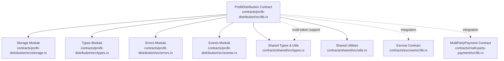
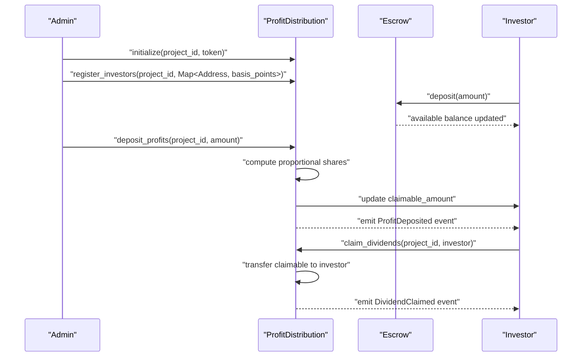
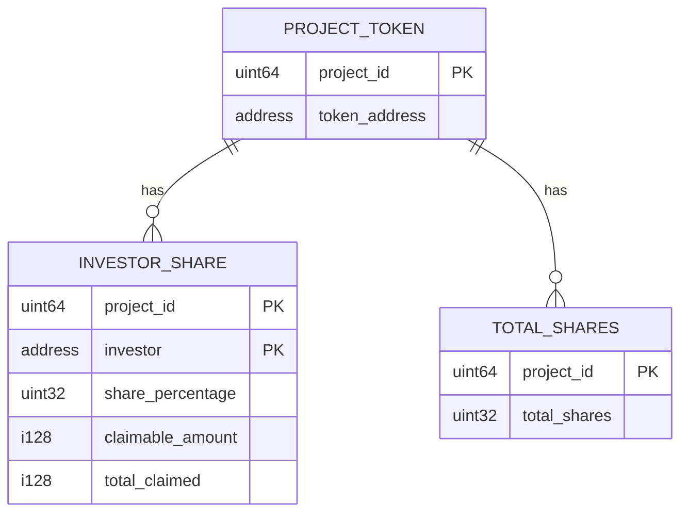
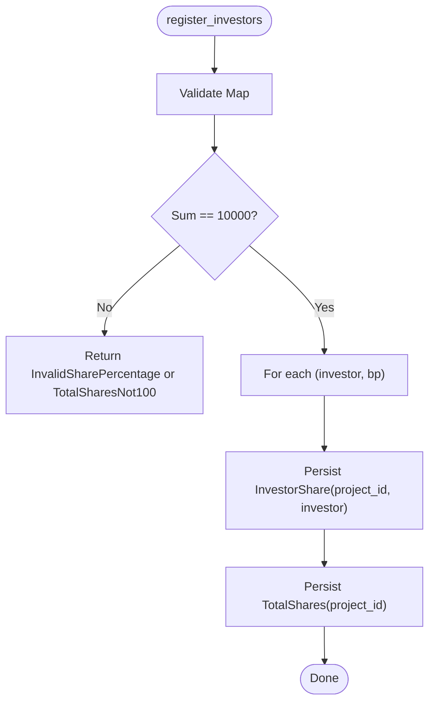
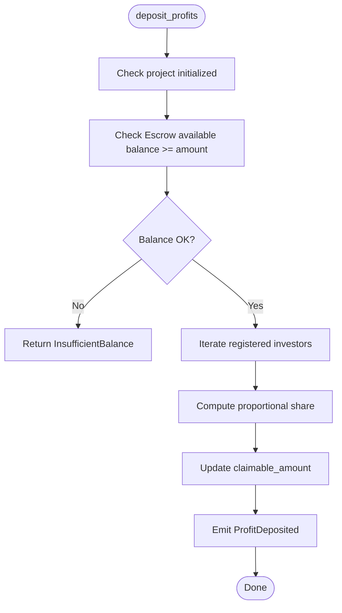
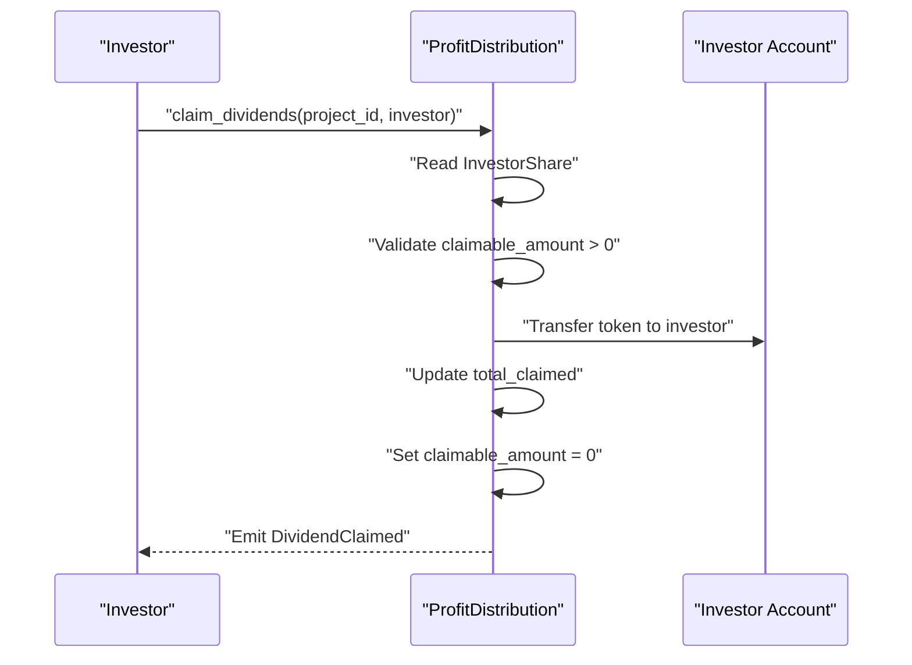
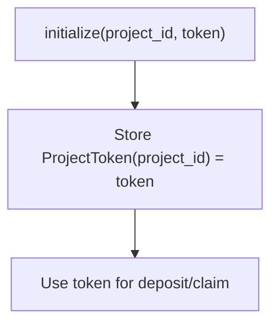
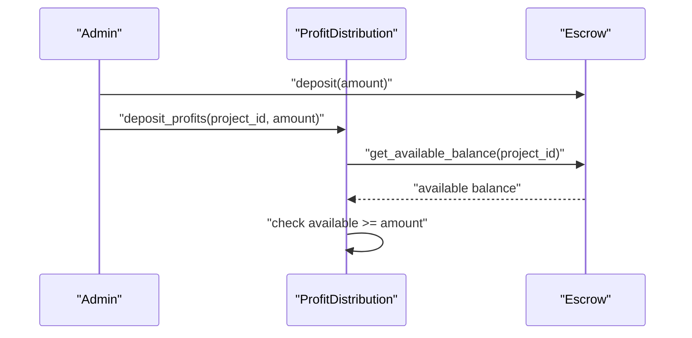
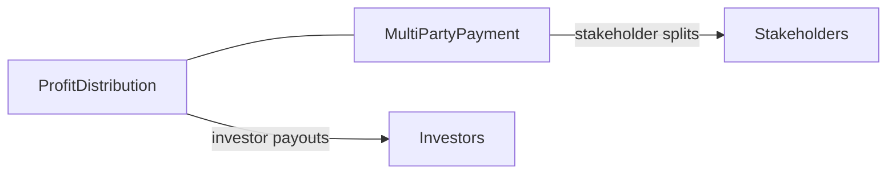
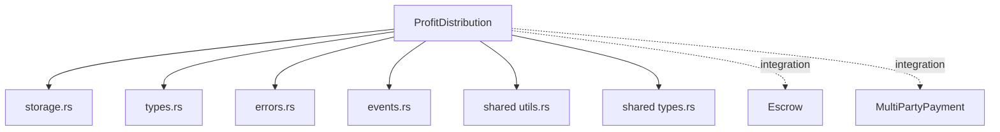

# Profit Distribution Contract

<cite>
**Referenced Files in This Document**
- [lib.rs](file://contracts/profit-distribution/src/lib.rs)
- [storage.rs](file://contracts/profit-distribution/src/storage.rs)
- [types.rs](file://contracts/profit-distribution/src/types.rs)
- [errors.rs](file://contracts/profit-distribution/src/errors.rs)
- [events.rs](file://contracts/profit-distribution/src/events.rs)
- [Cargo.toml](file://contracts/profit-distribution/Cargo.toml)
- [lib.rs](file://contracts/escrow/src/lib.rs)
- [lib.rs](file://contracts/multi-party-payment/src/lib.rs)
- [types.rs](file://contracts/shared/src/types.rs)
- [utils.rs](file://contracts/shared/src/utils.rs)
- [README.md](file://README.md)
- [README.md](file://contracts/README.md)
</cite>

## Table of Contents
1. [Introduction](#introduction)
2. [Project Structure](#project-structure)
3. [Core Components](#core-components)
4. [Architecture Overview](#architecture-overview)
5. [Detailed Component Analysis](#detailed-component-analysis)
6. [Dependency Analysis](#dependency-analysis)
7. [Performance Considerations](#performance-considerations)
8. [Troubleshooting Guide](#troubleshooting-guide)
9. [Conclusion](#conclusion)
10. [Appendices](#appendices)

## Introduction
The Profit Distribution contract automates investor payouts and dividend claiming for funded projects. It registers investors with share percentages, accepts profits for distribution, computes proportional payouts, and supports manual dividend claims. The contract emits events for transparency and integrates with the shared utilities for consistent percentage calculations and basis-point semantics. While the current implementation is marked as a placeholder, the data model, storage keys, and error/event definitions are ready for production-grade logic.

This document explains:
- How investor shares are stored and queried
- How profit deposits trigger proportional distributions
- How investors claim dividends and track claimable amounts
- Multi-token support via configurable token per project
- Error handling and validation rules
- Integration points with the Escrow contract for fund availability and the Multi-Party Payment contract for stakeholder splits
- Practical examples from the codebase and recommended workflows

## Project Structure
The Profit Distribution contract resides under contracts/profit-distribution and exposes a library crate compiled to WASM. It depends on the shared crate for common types and utilities.

**Diagram sources**
- [lib.rs](file://contracts/profit-distribution/src/lib.rs#L1-L78)
- [storage.rs](file://contracts/profit-distribution/src/storage.rs#L1-L33)
- [types.rs](file://contracts/profit-distribution/src/types.rs#L1-L18)
- [errors.rs](file://contracts/profit-distribution/src/errors.rs#L1-L16)
- [events.rs](file://contracts/profit-distribution/src/events.rs#L1-L21)
- [Cargo.toml](file://contracts/profit-distribution/Cargo.toml#L1-L16)
- [types.rs](file://contracts/shared/src/types.rs#L1-L41)
- [utils.rs](file://contracts/shared/src/utils.rs#L1-L59)
- [lib.rs](file://contracts/escrow/src/lib.rs#L1-L367)
- [lib.rs](file://contracts/multi-party-payment/src/lib.rs#L1-L9)

**Section sources**
- [Cargo.toml](file://contracts/profit-distribution/Cargo.toml#L1-L16)
- [README.md](file://README.md#L71-L77)
- [README.md](file://contracts/README.md#L195-L211)

## Core Components
- Contract interface: initialize, register investors, deposit profits, claim dividends, and query investor share.
- Data model: InvestorShare with investor address, share percentage (basis points), claimable amount, and total claimed.
- Storage keys: per-project token, per-investor share, and total registered shares.
- Events: profit deposited and dividend claimed.
- Errors: comprehensive error codes for initialization, share validation, balance, claiming, and authorization.
- Shared utilities: basis-point percentage calculations and validation helpers.

Implementation placeholders are present in the contract interface; however, the data model and supporting modules are fully defined and ready for implementation.

**Section sources**
- [lib.rs](file://contracts/profit-distribution/src/lib.rs#L31-L78)
- [types.rs](file://contracts/profit-distribution/src/types.rs#L3-L18)
- [storage.rs](file://contracts/profit-distribution/src/storage.rs#L8-L33)
- [events.rs](file://contracts/profit-distribution/src/events.rs#L3-L21)
- [errors.rs](file://contracts/profit-distribution/src/errors.rs#L3-L16)
- [utils.rs](file://contracts/shared/src/utils.rs#L5-L33)

## Architecture Overview
The Profit Distribution contract coordinates with:
- Escrow: ensures funds are available before distributing profits (via the project’s configured token and balance).
- MultiPartyPayment: can be used alongside for splitting payments among stakeholders (creators, advisors, etc.) when applicable.

**Diagram sources**
- [lib.rs](file://contracts/profit-distribution/src/lib.rs#L37-L62)
- [events.rs](file://contracts/profit-distribution/src/events.rs#L9-L21)
- [lib.rs](file://contracts/escrow/src/lib.rs#L77-L103)
- [types.rs](file://contracts/shared/src/types.rs#L24-L28)

## Detailed Component Analysis

### Data Model and Storage Keys
The contract stores:
- Project token address per project (multi-token support)
- Investor share per investor per project
- Total registered shares per project

- InvestorShare fields:
  - investor: Address
  - share_percentage: basis points (e.g., 10000 = 100%)
  - claimable_amount: i128
  - total_claimed: i128

- DataKey variants:
  - ProjectToken(project_id)
  - InvestorShare(project_id, investor)
  - TotalShares(project_id)

**Diagram sources**
- [types.rs](file://contracts/profit-distribution/src/types.rs#L12-L18)
- [storage.rs](file://contracts/profit-distribution/src/storage.rs#L8-L33)

**Section sources**
- [types.rs](file://contracts/profit-distribution/src/types.rs#L3-L18)
- [storage.rs](file://contracts/profit-distribution/src/storage.rs#L8-L33)

### Investor Registration Workflow
- Input: project_id, Map<Address, u32> representing basis points per investor.
- Validation:
  - Total share percentage equals 10000 (basis points).
  - Individual share percentages are valid (≤ 10000).
- Persistence:
  - Store per-investor share entries.
  - Store total registered shares for the project.

**Diagram sources**
- [errors.rs](file://contracts/profit-distribution/src/errors.rs#L9-L10)
- [storage.rs](file://contracts/profit-distribution/src/storage.rs#L16-L33)
- [utils.rs](file://contracts/shared/src/utils.rs#L30-L33)

**Section sources**
- [lib.rs](file://contracts/profit-distribution/src/lib.rs#L42-L50)
- [errors.rs](file://contracts/profit-distribution/src/errors.rs#L9-L10)
- [storage.rs](file://contracts/profit-distribution/src/storage.rs#L16-L33)
- [utils.rs](file://contracts/shared/src/utils.rs#L30-L33)

### Profit Deposit and Proportional Distribution
- Input: project_id, amount (i128).
- Precondition: sufficient funds available in the associated Escrow for the project’s token.
- Calculation:
  - For each registered investor, compute share using shared utilities: (amount × share_percentage) / 10000.
  - Increment claimable_amount for each investor.
- Events:
  - Emit ProfitDeposited(project_id, amount).

**Diagram sources**
- [lib.rs](file://contracts/profit-distribution/src/lib.rs#L52-L56)
- [events.rs](file://contracts/profit-distribution/src/events.rs#L9-L14)
- [lib.rs](file://contracts/escrow/src/lib.rs#L342-L345)
- [utils.rs](file://contracts/shared/src/utils.rs#L25-L28)

**Section sources**
- [lib.rs](file://contracts/profit-distribution/src/lib.rs#L52-L56)
- [events.rs](file://contracts/profit-distribution/src/events.rs#L9-L14)
- [lib.rs](file://contracts/escrow/src/lib.rs#L342-L345)
- [utils.rs](file://contracts/shared/src/utils.rs#L25-L28)

### Dividend Claiming Workflow
- Input: project_id, investor Address.
- Preconditions:
  - Investor has a non-zero claimable_amount.
  - Investor has not already claimed the same amount in the current epoch/window (if enforced).
- Postconditions:
  - Transfer claimable_amount to investor.
  - Update total_claimed.
  - Zero out claimable_amount.
  - Emit DividendClaimed.

**Diagram sources**
- [lib.rs](file://contracts/profit-distribution/src/lib.rs#L58-L62)
- [events.rs](file://contracts/profit-distribution/src/events.rs#L16-L21)
- [storage.rs](file://contracts/profit-distribution/src/storage.rs#L16-L25)

**Section sources**
- [lib.rs](file://contracts/profit-distribution/src/lib.rs#L58-L62)
- [events.rs](file://contracts/profit-distribution/src/events.rs#L16-L21)
- [storage.rs](file://contracts/profit-distribution/src/storage.rs#L16-L25)

### Multi-Token Support
- Each project maintains a token Address in persistent storage keyed by project_id.
- Profit deposits and dividend claims operate against this token.
- This enables distributing returns in XLM or any Stellar asset.

**Diagram sources**
- [storage.rs](file://contracts/profit-distribution/src/storage.rs#L8-L14)
- [lib.rs](file://contracts/profit-distribution/src/lib.rs#L37-L40)

**Section sources**
- [storage.rs](file://contracts/profit-distribution/src/storage.rs#L8-L14)
- [lib.rs](file://contracts/profit-distribution/src/lib.rs#L37-L40)

### Integration with Escrow Contract
- ProfitDistribution relies on Escrow to hold and release funds for a project.
- Before distributing profits, ensure the Escrow has sufficient available balance for the project’s token.
- Use Escrow’s available balance query to gate deposit_profits.

**Diagram sources**
- [lib.rs](file://contracts/escrow/src/lib.rs#L342-L345)
- [lib.rs](file://contracts/profit-distribution/src/lib.rs#L52-L56)

**Section sources**
- [lib.rs](file://contracts/escrow/src/lib.rs#L342-L345)
- [lib.rs](file://contracts/profit-distribution/src/lib.rs#L52-L56)

### Integration with Multi-Party Payment
- MultiPartyPayment handles multi-stakeholder splits for creators, advisors, and others.
- ProfitDistribution focuses on investor payouts; MultiPartyPayment can be used for internal stakeholder allocations.
- Both contracts can operate independently and be orchestrated by a higher-level controller.

**Diagram sources**
- [lib.rs](file://contracts/multi-party-payment/src/lib.rs#L1-L9)
- [README.md](file://README.md#L85-L91)

**Section sources**
- [lib.rs](file://contracts/multi-party-payment/src/lib.rs#L1-L9)
- [README.md](file://README.md#L85-L91)

## Dependency Analysis
- Internal dependencies:
  - ProfitDistribution depends on its own storage, types, errors, and events modules.
  - Uses shared types (Address, Amount) and shared utilities for percentage calculations.
- External integration:
  - Escrow for fund availability checks.
  - MultiPartyPayment for stakeholder splits (complementary role).

**Diagram sources**
- [Cargo.toml](file://contracts/profit-distribution/Cargo.toml#L7-L9)
- [lib.rs](file://contracts/profit-distribution/src/lib.rs#L11-L24)
- [utils.rs](file://contracts/shared/src/utils.rs#L1-L59)
- [types.rs](file://contracts/shared/src/types.rs#L1-L41)
- [lib.rs](file://contracts/escrow/src/lib.rs#L1-L367)
- [lib.rs](file://contracts/multi-party-payment/src/lib.rs#L1-L9)

**Section sources**
- [Cargo.toml](file://contracts/profit-distribution/Cargo.toml#L7-L9)
- [lib.rs](file://contracts/profit-distribution/src/lib.rs#L11-L24)

## Performance Considerations
- Storage operations:
  - Each investor update writes a single persistent entry; batch operations can reduce overhead if registering many investors.
  - Total shares are cached per project to avoid recomputing sums.
- Arithmetic:
  - Percentages use checked arithmetic via shared utilities to prevent overflow.
  - i128 amounts accommodate large token values on Stellar.
- Events:
  - Emitting events is inexpensive and useful for off-chain indexing.

[No sources needed since this section provides general guidance]

## Troubleshooting Guide
Common issues and resolutions:
- Initialization errors:
  - AlreadyInitialized or NotInitialized: Ensure initialize is called once with correct parameters.
- Share validation:
  - InvalidSharePercentage or TotalSharesNot100: Verify that each share is ≤ 10000 and sum equals 10000.
- Balance problems:
  - InsufficientBalance: Confirm Escrow has sufficient available balance for the project’s token before deposit_profits.
- Claiming issues:
  - NothingToClaim: Ensure investor has a positive claimable_amount.
  - AlreadyClaimed: If enforcing claim windows, ensure the investor is not re-claming the same unclaimed amount.
- Authorization:
  - Unauthorized: Ensure the caller has proper permissions for administrative functions.

**Section sources**
- [errors.rs](file://contracts/profit-distribution/src/errors.rs#L7-L16)
- [lib.rs](file://contracts/profit-distribution/src/lib.rs#L37-L40)
- [lib.rs](file://contracts/profit-distribution/src/lib.rs#L42-L50)
- [lib.rs](file://contracts/profit-distribution/src/lib.rs#L52-L56)
- [lib.rs](file://contracts/profit-distribution/src/lib.rs#L58-L62)

## Conclusion
The Profit Distribution contract establishes a robust foundation for automated investor payouts with multi-token support, clear data modeling, and comprehensive error handling. While the core functions are placeholders, the storage, types, events, and errors are production-ready. Integrating with Escrow ensures fund availability and with MultiPartyPayment enables complementary stakeholder splits. By following the workflows and validations outlined here, teams can implement secure, transparent, and efficient profit distribution systems on Soroban.

[No sources needed since this section summarizes without analyzing specific files]

## Appendices

### Configuration Options
- Profit sharing ratios:
  - Basis points per investor (u32) stored in InvestorShare.share_percentage.
  - Total shares must equal 10000 basis points.
- Claimable amount tracking:
  - claimable_amount (i128) incremented on profit deposits.
  - total_claimed (i128) updated on successful claims.
- Historical claim records:
  - Not modeled in the current data model; consider adding a claim history map keyed by investor and timestamp if needed.

**Section sources**
- [types.rs](file://contracts/profit-distribution/src/types.rs#L5-L10)
- [errors.rs](file://contracts/profit-distribution/src/errors.rs#L9-L10)

### Example Workflows (from codebase)
- Investor registration:
  - Function signature: register_investors(env, project_id, Map<Address, u32>)
  - Validates total shares and persists InvestorShare entries.
- Profit deposit:
  - Function signature: deposit_profits(env, project_id, amount)
  - Computes proportional shares and updates claimable amounts.
- Dividend claiming:
  - Function signature: claim_dividends(env, project_id, investor)
  - Transfers claimable amount to investor and resets claimable_amount.

**Section sources**
- [lib.rs](file://contracts/profit-distribution/src/lib.rs#L42-L62)