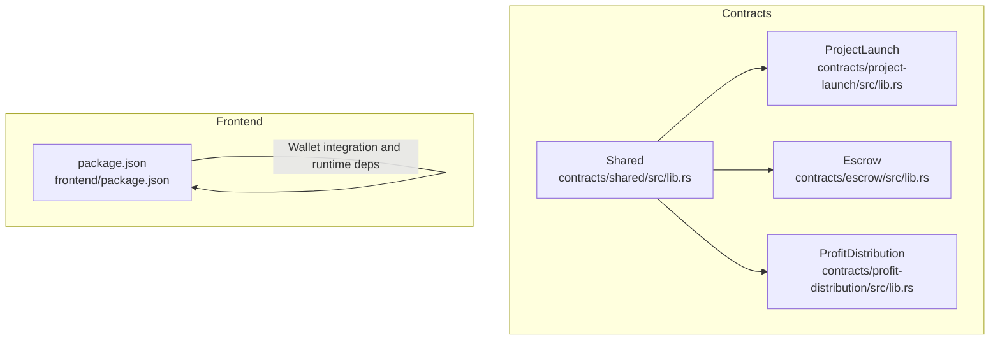
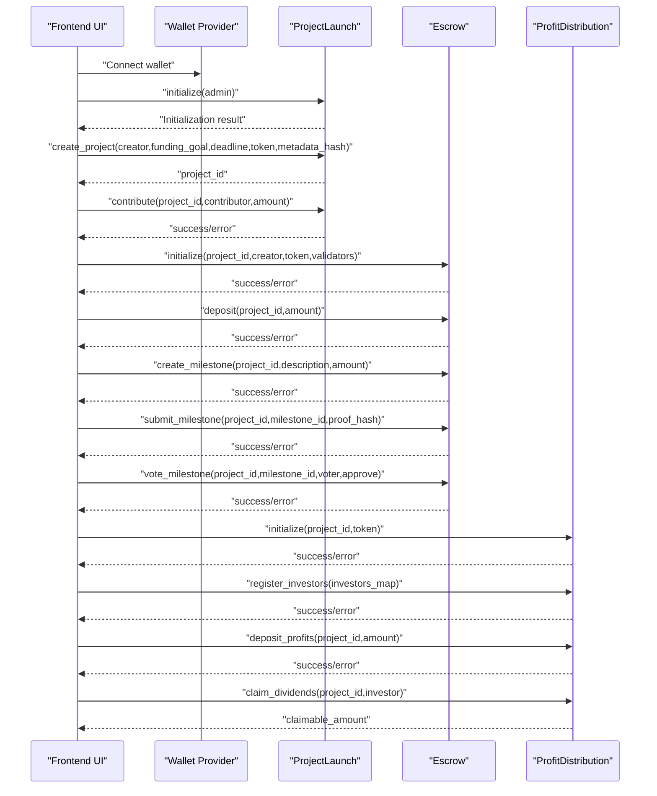
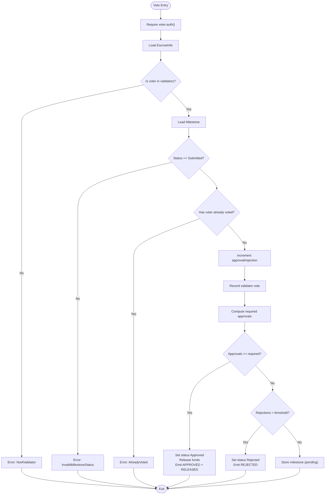
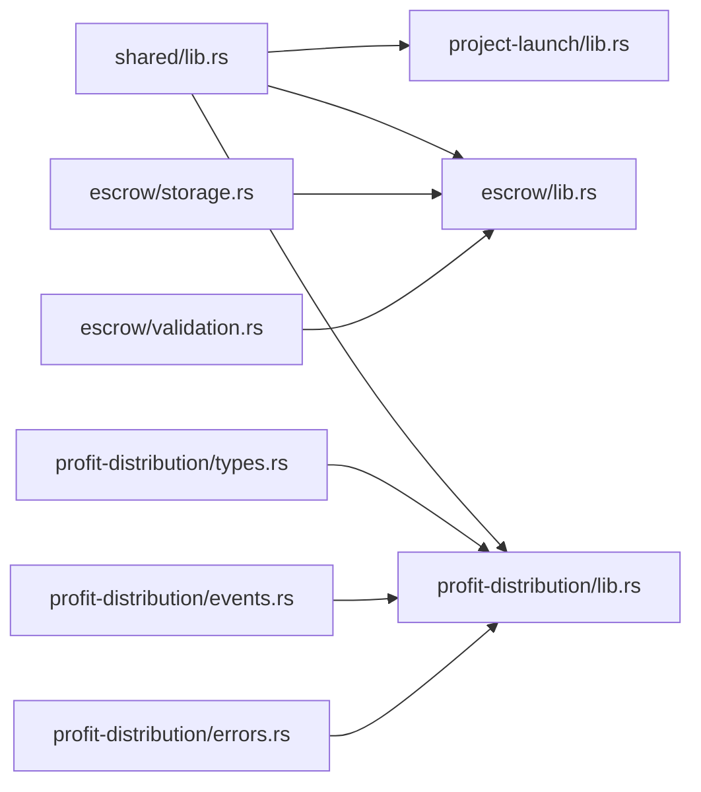

# API Reference

<cite>
**Referenced Files in This Document**
- [README.md](file://README.md)
- [package.json](file://frontend/package.json)
- [lib.rs (ProjectLaunch)](file://contracts/project-launch/src/lib.rs)
- [lib.rs (Escrow)](file://contracts/escrow/src/lib.rs)
- [storage.rs (Escrow)](file://contracts/escrow/src/storage.rs)
- [validation.rs (Escrow)](file://contracts/escrow/src/validation.rs)
- [lib.rs (ProfitDistribution)](file://contracts/profit-distribution/src/lib.rs)
- [types.rs (ProfitDistribution)](file://contracts/profit-distribution/src/types.rs)
- [events.rs (ProfitDistribution)](file://contracts/profit-distribution/src/events.rs)
- [errors.rs (ProfitDistribution)](file://contracts/profit-distribution/src/errors.rs)
- [lib.rs (Shared)](file://contracts/shared/src/lib.rs)
- [types.rs (Shared)](file://contracts/shared/src/types.rs)
- [errors.rs (Shared)](file://contracts/shared/src/errors.rs)
</cite>

## Table of Contents
1. [Introduction](#introduction)
2. [Project Structure](#project-structure)
3. [Core Components](#core-components)
4. [Architecture Overview](#architecture-overview)
5. [Detailed Component Analysis](#detailed-component-analysis)
6. [Dependency Analysis](#dependency-analysis)
7. [Performance Considerations](#performance-considerations)
8. [Troubleshooting Guide](#troubleshooting-guide)
9. [Conclusion](#conclusion)
10. [Appendices](#appendices)

## Introduction
This document provides a comprehensive API reference for NovaFund’s public interfaces across smart contracts and the frontend. It covers function signatures, parameter specifications, return values, error codes, and practical interaction patterns for:
- ProjectLaunch contract
- Escrow contract
- ProfitDistribution contract
- Shared utilities and types

It also outlines wallet integration and blockchain interaction patterns for the frontend, along with performance and debugging guidance.

## Project Structure
NovaFund is organized into:
- contracts/: Rust-based Soroban smart contracts
- frontend/: React + TypeScript frontend application
- shared/: shared types, errors, events, and utilities used across contracts

**Diagram sources**
- [lib.rs (ProjectLaunch)](file://contracts/project-launch/src/lib.rs#L1-L363)
- [lib.rs (Escrow)](file://contracts/escrow/src/lib.rs#L1-L367)
- [lib.rs (ProfitDistribution)](file://contracts/profit-distribution/src/lib.rs#L1-L78)
- [lib.rs (Shared)](file://contracts/shared/src/lib.rs#L1-L20)
- [package.json](file://frontend/package.json#L1-L32)

**Section sources**
- [README.md](file://README.md#L260-L313)
- [package.json](file://frontend/package.json#L1-L32)

## Core Components
- ProjectLaunch: Project lifecycle management, funding goals, deadlines, contributions, and events.
- Escrow: Escrow initialization, milestone creation and voting, fund release, and queries.
- ProfitDistribution: Placeholder for investor share registration, profit deposits, and dividend claims.
- Shared: Common types, errors, events, constants, and utilities.

**Section sources**
- [lib.rs (ProjectLaunch)](file://contracts/project-launch/src/lib.rs#L14-L248)
- [lib.rs (Escrow)](file://contracts/escrow/src/lib.rs#L19-L346)
- [lib.rs (ProfitDistribution)](file://contracts/profit-distribution/src/lib.rs#L31-L78)
- [lib.rs (Shared)](file://contracts/shared/src/lib.rs#L1-L20)

## Architecture Overview
High-level interaction flow from frontend to contracts and back:

**Diagram sources**
- [lib.rs (ProjectLaunch)](file://contracts/project-launch/src/lib.rs#L72-L248)
- [lib.rs (Escrow)](file://contracts/escrow/src/lib.rs#L22-L346)
- [lib.rs (ProfitDistribution)](file://contracts/profit-distribution/src/lib.rs#L34-L78)

## Detailed Component Analysis

### ProjectLaunch API
Public functions and their specifications:
- initialize(env, admin) -> Result<(), shared::errors::Error>
  - Purpose: Set the admin address and initialize instance storage.
  - Auth: admin.require_auth().
  - Storage: sets Admin and NextProjectId.
  - Events: none.
  - Errors: AlreadyInitialized via shared::errors::Error.

- create_project(env, creator, funding_goal, deadline, token, metadata_hash) -> Result<u64, ProjectLaunchError>
  - Purpose: Create a new project with funding goal, deadline, token, and metadata hash.
  - Validation: funding_goal >= MIN_FUNDING_GOAL; deadline duration within [MIN_PROJECT_DURATION, MAX_PROJECT_DURATION]; future timestamp check.
  - Storage: NextProjectId increment; Project storage keyed by NextProjectId.
  - Events: emits PROJECT_CREATED with project_id, creator, funding_goal, deadline, token.
  - Errors: InvalidFundingGoal, InvalidDeadline, shared::errors::Error variants.

- contribute(env, project_id, contributor, amount) -> Result<(), ProjectLaunchError>
  - Purpose: Add a contribution to an active project before deadline.
  - Validation: amount >= MIN_CONTRIBUTION; project.status == Active; deadline not passed.
  - Storage: update Project.total_raised; append Contribution to persistent Vec keyed by project_id.
  - Events: emits CONTRIBUTION_MADE with project_id, contributor, amount, new total_raised.
  - Errors: ContributionTooLow, ProjectNotFound, ProjectNotActive, DeadlinePassed.

- get_project(env, project_id) -> Result<Project, ProjectLaunchError>
  - Purpose: Retrieve project details.
  - Returns: Project struct.

- get_contributions(env, project_id) -> Result<Vec<Contribution>, ProjectLaunchError>
  - Purpose: Retrieve all contributions for a project.
  - Returns: Vec<Contribution>.

- get_next_project_id(env) -> u64
  - Purpose: Utility for testing; returns NextProjectId.

- is_initialized(env) -> bool
  - Purpose: Check if admin is set.

- get_admin(env) -> Option<Address>
  - Purpose: Retrieve admin address.

Data structures:
- ProjectStatus: Active, Completed, Failed, Cancelled.
- Project: creator, funding_goal, deadline, token, status, metadata_hash, total_raised, created_at.
- Contribution: contributor, amount, timestamp.
- DataKey: Admin, NextProjectId, Project.

Error codes (ProjectLaunchError):
- InvalidFundingGoal = 1000
- InvalidDeadline = 1001
- ProjectNotFound = 1002
- ContributionTooLow = 1003
- ProjectNotActive = 1004
- DeadlinePassed = 1005

Practical examples:
- Creating a project:
  - Inputs: creator Address, funding_goal i128, deadline u64, token Address, metadata_hash Bytes.
  - Expected outcome: returns project_id u64 and emits PROJECT_CREATED.
- Contributing to a project:
  - Inputs: project_id u64, contributor Address, amount i128.
  - Expected outcome: updates total_raised and emits CONTRIBUTION_MADE.

**Section sources**
- [lib.rs (ProjectLaunch)](file://contracts/project-launch/src/lib.rs#L57-L248)
- [lib.rs (ProjectLaunch)](file://contracts/project-launch/src/lib.rs#L14-L56)

### Escrow API
Public functions and their specifications:
- initialize(env, project_id, creator, token, validators) -> Result<(), shared::errors::Error>
  - Purpose: Create an escrow for a project with validators.
  - Validation: validators length >= MIN_VALIDATORS.
  - Storage: store EscrowInfo; initialize milestone counter.
  - Events: ESCROW_INITIALIZED.
  - Errors: InvalidInput, AlreadyInitialized, shared::errors::Error.

- deposit(env, project_id, amount) -> Result<(), shared::errors::Error>
  - Purpose: Increase total_deposited in escrow.
  - Validation: amount > 0.
  - Storage: update EscrowInfo.total_deposited.
  - Events: FUNDS_LOCKED.
  - Errors: InvalidInput.

- create_milestone(env, project_id, description, amount) -> Result<(), shared::errors::Error>
  - Purpose: Create a new milestone with amount.
  - Validation: amount > 0; total_milestone_amount + amount <= total_deposited.
  - Storage: store Milestone; increment milestone counter.
  - Events: MILESTONE_CREATED.
  - Errors: InvalidInput, InsufficientEscrowBalance.

- submit_milestone(env, project_id, milestone_id, proof_hash) -> Result<(), shared::errors::Error>
  - Purpose: Mark milestone as Submitted with proof hash.
  - Auth: creator.require_auth().
  - Storage: update Milestone.status and proof_hash; reset votes; clear voters.
  - Events: MILESTONE_SUBMITTED.
  - Errors: InvalidMilestoneStatus.

- vote_milestone(env, project_id, milestone_id, voter, approve) -> Result<(), shared::errors::Error>
  - Purpose: Validator approves or rejects a submitted milestone.
  - Auth: voter.require_auth().
  - Validation: voter in validators; milestone status Submitted; not already voted.
  - Logic: tally approvals/rejections; majority approval triggers release and emits MILESTONE_APPROVED and FUNDS_RELEASED.
  - Errors: NotAValidator, AlreadyVoted, InvalidMilestoneStatus.

- get_escrow(env, project_id) -> Result<EscrowInfo, shared::errors::Error>
- get_milestone(env, project_id, milestone_id) -> Result<Milestone, shared::errors::Error>
- get_total_milestone_amount(env, project_id) -> Result<Amount, shared::errors::Error>
- get_available_balance(env, project_id) -> Result<Amount, shared::errors::Error>

Data structures:
- EscrowInfo: project_id, creator, token, total_deposited, released_amount, validators.
- Milestone: id, project_id, description, amount, status, proof_hash, approval_count, rejection_count, created_at.
- MilestoneStatus: Pending, Submitted, Approved, Rejected.
- Amount: i128.

Error codes (shared::errors::Error range 200–299):
- InsufficientEscrowBalance = 200
- MilestoneNotApproved = 201
- InvalidMilestoneStatus = 202
- NotAValidator = 203
- AlreadyVoted = 204

Practical examples:
- Initialize escrow:
  - Inputs: project_id u64, creator Address, token Address, validators Vec<Address>.
  - Expected outcome: EscrowInfo stored and MILESTONE_CREATED counter initialized.
- Submit milestone:
  - Inputs: project_id u64, milestone_id u64, proof_hash String.
  - Expected outcome: Milestone status becomes Submitted and votes reset.
- Validator vote:
  - Inputs: project_id u64, milestone_id u64, voter Address, approve bool.
  - Expected outcome: Approval count increments; majority leads to fund release and events.

**Diagram sources**
- [lib.rs (Escrow)](file://contracts/escrow/src/lib.rs#L220-L307)
- [storage.rs (Escrow)](file://contracts/escrow/src/storage.rs#L73-L107)
- [validation.rs (Escrow)](file://contracts/escrow/src/validation.rs#L5-L12)

**Section sources**
- [lib.rs (Escrow)](file://contracts/escrow/src/lib.rs#L19-L346)
- [storage.rs (Escrow)](file://contracts/escrow/src/storage.rs#L1-L144)
- [validation.rs (Escrow)](file://contracts/escrow/src/validation.rs#L1-L13)

### ProfitDistribution API
Current state: placeholder implementation with TODO comments. The following functions are declared but not implemented:
- initialize(env, project_id, token) -> Result<(), ContractError>
- register_investors(env, project_id, investors) -> Result<(), ContractError>
- deposit_profits(env, project_id, amount) -> Result<(), ContractError>
- claim_dividends(env, project_id, investor) -> Result<i128, ContractError>
- get_investor_share(env, project_id, investor) -> Result<InvestorShare, ContractError>

Data structures:
- InvestorShare: investor Address, share_percentage u32 (basis points), claimable_amount i128, total_claimed i128.
- DataKey: ProjectToken, InvestorShare, TotalShares.

Events:
- EventType: ProfitDeposited(project_id, amount), DividendClaimed(project_id, investor, amount).
- Helpers: emit_deposit_event, emit_claim_event.

Error codes (ContractError):
- AlreadyInitialized = 1
- NotInitialized = 2
- InvalidSharePercentage = 3
- TotalSharesNot100 = 4
- InsufficientBalance = 5
- NothingToClaim = 6
- AlreadyClaimed = 7
- Unauthorized = 8
- InvalidAmount = 9

Practical examples:
- Register investors:
  - Inputs: project_id u64, investors Map<Address, u32>.
  - Expected outcome: store investor shares and total shares.
- Deposit profits:
  - Inputs: project_id u64, amount i128.
  - Expected outcome: compute claimable amounts per investor and emit ProfitDeposited.
- Claim dividends:
  - Inputs: project_id u64, investor Address.
  - Expected outcome: return claimable_amount i128 and emit DividendClaimed.

**Section sources**
- [lib.rs (ProfitDistribution)](file://contracts/profit-distribution/src/lib.rs#L31-L78)
- [types.rs (ProfitDistribution)](file://contracts/profit-distribution/src/types.rs#L3-L18)
- [events.rs (ProfitDistribution)](file://contracts/profit-distribution/src/events.rs#L3-L21)
- [errors.rs (ProfitDistribution)](file://contracts/profit-distribution/src/errors.rs#L3-L16)

### Shared Types, Errors, and Utilities
Common types:
- Timestamp = u64
- Amount = i128
- BasisPoints = u32
- FeeConfig: platform_fee, creator_fee, fee_recipient
- TokenInfo: address, symbol, decimals
- UserProfile: address, reputation_score, projects_created, projects_funded, total_contributed, verified

Common errors (range 1–699):
- General: NotInitialized, AlreadyInitialized, Unauthorized, InvalidInput, NotFound
- Project: ProjectNotActive, ProjectAlreadyExists, FundingGoalNotReached, DeadlinePassed, InvalidProjectStatus
- Escrow: InsufficientEscrowBalance, MilestoneNotApproved, InvalidMilestoneStatus, NotAValidator, AlreadyVoted
- Distribution: InsufficientFunds, InvalidDistribution, NoClaimableAmount, DistributionFailed
- Subscription: SubscriptionNotActive, InvalidSubscriptionPeriod, SubscriptionExists, WithdrawalLocked
- Reputation: ReputationTooLow, InvalidReputationScore, BadgeNotEarned, UserAlreadyRegistered, BadgeAlreadyAwarded, UserNotRegistered
- Governance: ProposalNotActive, InsufficientVotingPower, ProposalAlreadyExecuted, QuorumNotReached

Utility:
- calculate_percentage(amount, percentage, total_percentage) -> i128

**Section sources**
- [types.rs (Shared)](file://contracts/shared/src/types.rs#L3-L41)
- [errors.rs (Shared)](file://contracts/shared/src/errors.rs#L3-L54)
- [lib.rs (Shared)](file://contracts/shared/src/lib.rs#L16-L20)

## Dependency Analysis
- ProjectLaunch depends on shared::constants, shared::errors, shared::events, shared::utils for validation and events.
- Escrow depends on shared::types, shared::errors, shared::events, shared::constants for storage and validation.
- ProfitDistribution depends on its own storage, types, errors, and events modules.

**Diagram sources**
- [lib.rs (Shared)](file://contracts/shared/src/lib.rs#L1-L20)
- [lib.rs (ProjectLaunch)](file://contracts/project-launch/src/lib.rs#L6-L12)
- [lib.rs (Escrow)](file://contracts/escrow/src/lib.rs#L3-L9)
- [storage.rs (Escrow)](file://contracts/escrow/src/storage.rs#L1-L10)
- [validation.rs (Escrow)](file://contracts/escrow/src/validation.rs#L1-L12)
- [lib.rs (ProfitDistribution)](file://contracts/profit-distribution/src/lib.rs#L18-L24)
- [types.rs (ProfitDistribution)](file://contracts/profit-distribution/src/types.rs#L1-L18)
- [events.rs (ProfitDistribution)](file://contracts/profit-distribution/src/events.rs#L1-L21)
- [errors.rs (ProfitDistribution)](file://contracts/profit-distribution/src/errors.rs#L1-L16)

**Section sources**
- [lib.rs (ProjectLaunch)](file://contracts/project-launch/src/lib.rs#L6-L12)
- [lib.rs (Escrow)](file://contracts/escrow/src/lib.rs#L3-L9)
- [lib.rs (ProfitDistribution)](file://contracts/profit-distribution/src/lib.rs#L18-L24)

## Performance Considerations
- Prefer batched reads/writes where possible to minimize ledger interactions.
- Use persistent storage judiciously; frequent writes increase rent costs.
- Validate inputs early to fail fast and reduce unnecessary computations.
- Cache frequently accessed data in memory during a single transaction where applicable.
- Use appropriate data structures (e.g., compact Vec for small lists) to reduce storage footprint.
- Emit events sparingly; they are useful for off-chain indexing but add to transaction cost.

[No sources needed since this section provides general guidance]

## Troubleshooting Guide
Common error categories and resolutions:
- Initialization conflicts:
  - Error: AlreadyInitialized (shared::errors::Error).
  - Resolution: Ensure initialize is called once and only by admin.
- Input validation failures:
  - Error: InvalidInput (shared::errors::Error).
  - Resolution: Verify amounts > 0, timestamps in future, validator count meets minimum.
- Project lifecycle errors:
  - Errors: ProjectNotActive, DeadlinePassed, ProjectNotFound (ProjectLaunchError).
  - Resolution: Confirm project status and deadlines; ensure contributions occur before deadline.
- Escrow milestone errors:
  - Errors: InvalidMilestoneStatus, NotAValidator, AlreadyVoted (shared::errors::Error).
  - Resolution: Ensure milestone is Submitted; confirm voter is a validator; prevent double voting.
- Profit distribution errors:
  - Errors: TotalSharesNot100, InsufficientBalance, NothingToClaim (ContractError).
  - Resolution: Ensure investor shares sum to 100%; verify sufficient profits; check claimable balances.

**Section sources**
- [errors.rs (Shared)](file://contracts/shared/src/errors.rs#L6-L53)
- [errors.rs (ProfitDistribution)](file://contracts/profit-distribution/src/errors.rs#L6-L16)
- [lib.rs (ProjectLaunch)](file://contracts/project-launch/src/lib.rs#L96-L111)
- [lib.rs (Escrow)](file://contracts/escrow/src/lib.rs#L188-L191)

## Conclusion
NovaFund’s API provides a modular, composable set of smart contracts for project funding, milestone-based escrow, and profit distribution, backed by shared types and error enums. The frontend integrates with wallet providers and interacts with these contracts to enable end-to-end workflows. As ProfitDistribution remains a placeholder, implementers should treat its methods as placeholders and align client-side logic with the documented signatures and error codes.

[No sources needed since this section summarizes without analyzing specific files]

## Appendices

### Wallet Integration and Frontend Interaction Patterns
- Wallet providers: Freighter, XUMM (as noted in the project overview).
- Typical flow:
  - Connect wallet and resolve account address.
  - Prepare contract invocations with argument encoding (addresses, integers, bytes, strings).
  - Sign and submit transactions via the wallet provider.
  - Poll or subscribe to events emitted by contracts for state updates.
- Frontend dependencies include React, Next.js, TypeScript, Tailwind CSS, and UI libraries (as per package.json).

**Section sources**
- [README.md](file://README.md#L177-L183)
- [package.json](file://frontend/package.json#L11-L19)

### API Versioning and Backward Compatibility
- Versioning strategy: Not specified in the repository. Recommended approach:
  - Use semantic versioning for contract upgrades.
  - Maintain backward-compatible interfaces where possible; deprecate methods with clear migration timelines.
  - Employ proxy contracts or upgradeable patterns to preserve addresses while evolving logic.
  - Document breaking changes and provide migration guides for clients.

[No sources needed since this section provides general guidance]

### Migration Guide for Deprecated Features
- If methods are deprecated:
  - Replace deprecated calls with new equivalents.
  - Update client-side logic to handle new parameter formats or return types.
  - Maintain fallbacks temporarily for older clients during transition windows.
  - Announce deprecation dates and support lifecycles.

[No sources needed since this section provides general guidance]