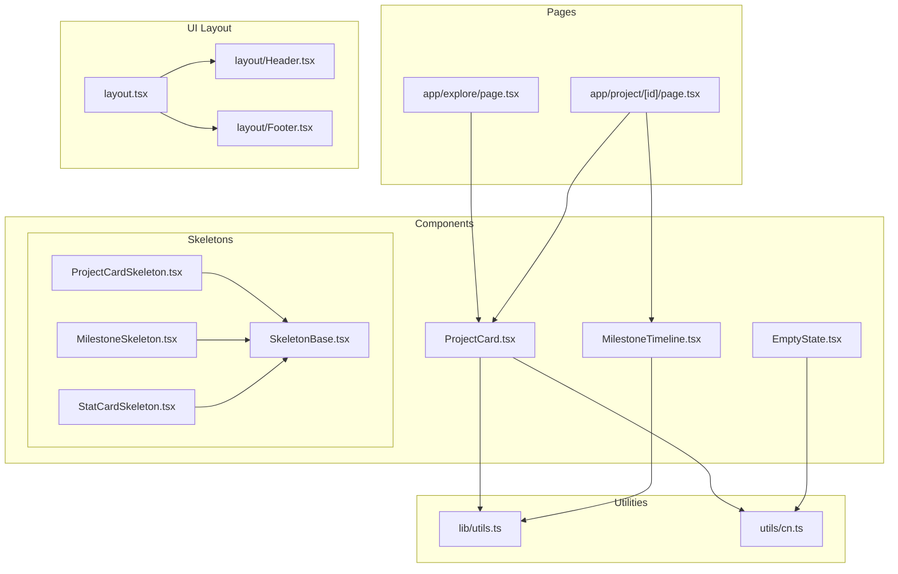
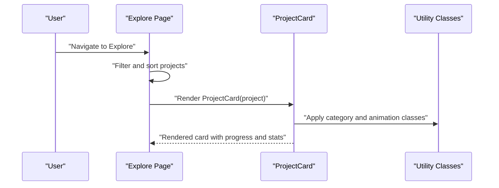
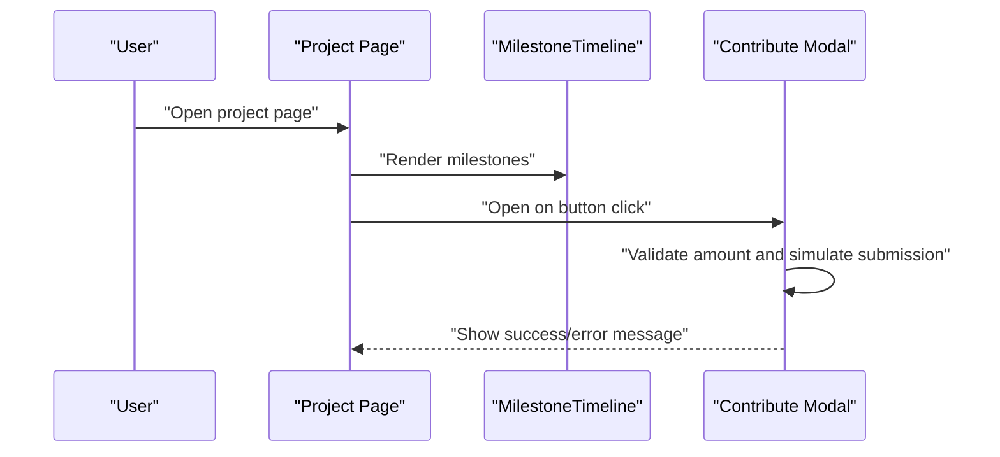
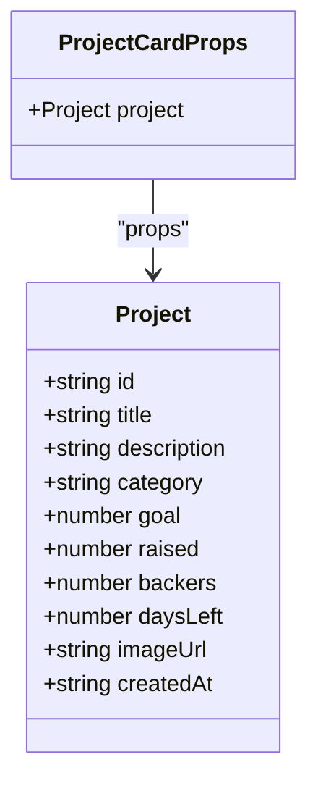
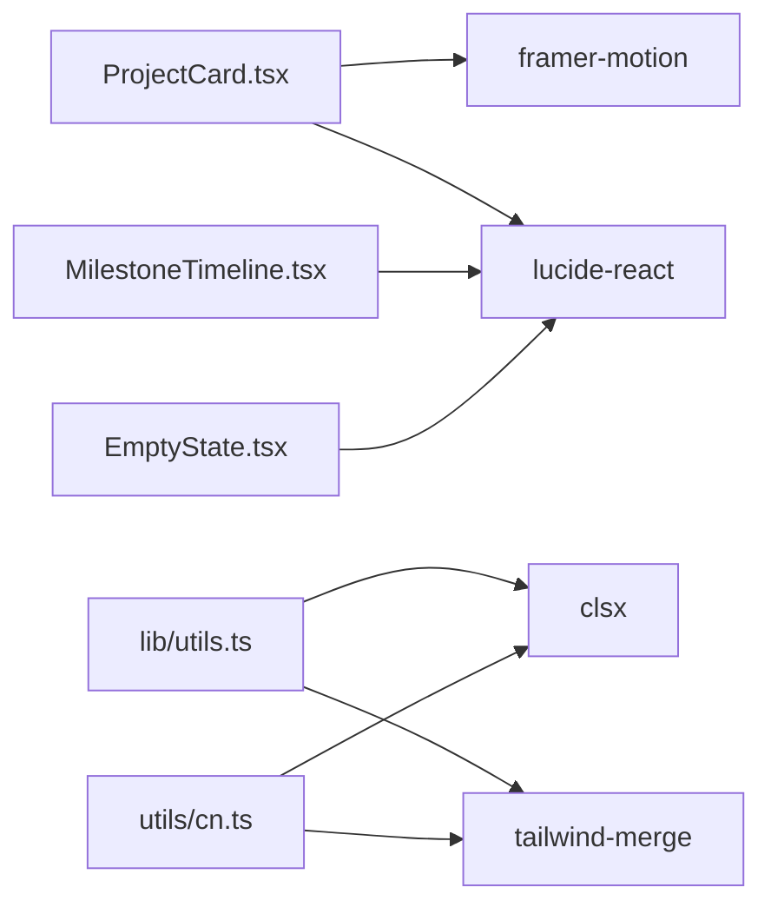

# Business Logic Components API

<cite>
**Referenced Files in This Document**
- [ProjectCard.tsx](file://frontend/src/components/ProjectCard.tsx)
- [MilestoneTimeline.tsx](file://frontend/src/components/MilestoneTimeline.tsx)
- [EmptyState.tsx](file://frontend/src/components/EmptyState.tsx)
- [ProjectCardSkeleton.tsx](file://frontend/src/components/skeletons/ProjectCardSkeleton.tsx)
- [MilestoneSkeleton.tsx](file://frontend/src/components/skeletons/MilestoneSkeleton.tsx)
- [StatCardSkeleton.tsx](file://frontend/src/components/skeletons/StatCardSkeleton.tsx)
- [SkeletonBase.tsx](file://frontend/src/components/skeletons/SkeletonBase.tsx)
- [utils.ts](file://frontend/src/lib/utils.ts)
- [cn.ts](file://frontend/src/utils/cn.ts)
- [page.tsx (Explore)](file://frontend/src/app/explore/page.tsx)
- [page.tsx (Project)](file://frontend/src/app/project/[id]/page.tsx)
- [layout.tsx](file://frontend/src/app/layout.tsx)
- [Header.tsx](file://frontend/src/components/layout/Header.tsx)
- [Footer.tsx](file://frontend/src/components/layout/Footer.tsx)
- [package.json](file://frontend/package.json)
</cite>

## Table of Contents
1. [Introduction](#introduction)
2. [Project Structure](#project-structure)
3. [Core Components](#core-components)
4. [Architecture Overview](#architecture-overview)
5. [Detailed Component Analysis](#detailed-component-analysis)
6. [Dependency Analysis](#dependency-analysis)
7. [Performance Considerations](#performance-considerations)
8. [Troubleshooting Guide](#troubleshooting-guide)
9. [Conclusion](#conclusion)
10. [Appendices](#appendices)

## Introduction
This document provides comprehensive API documentation for NovaFund’s business logic and data presentation components. It focuses on:
- ProjectCard: project metadata display, funding progress visualization, and interactive elements
- MilestoneTimeline: milestone tracking, progress indicators, and status visualization
- EmptyState: messaging patterns, call-to-action buttons, and user guidance
- Skeleton loaders: ProjectCardSkeleton, MilestoneSkeleton, StatCardSkeleton, and SkeletonBase
It also documents props, data binding, state management, error handling, loading states, responsive design, accessibility, and performance optimization.

## Project Structure
The components are organized under frontend/src/components with dedicated skeleton implementations and usage examples in Next.js app pages.



**Diagram sources**
- [ProjectCard.tsx](file://frontend/src/components/ProjectCard.tsx#L1-L117)
- [MilestoneTimeline.tsx](file://frontend/src/components/MilestoneTimeline.tsx#L1-L115)
- [EmptyState.tsx](file://frontend/src/components/EmptyState.tsx#L1-L37)
- [ProjectCardSkeleton.tsx](file://frontend/src/components/skeletons/ProjectCardSkeleton.tsx#L1-L28)
- [MilestoneSkeleton.tsx](file://frontend/src/components/skeletons/MilestoneSkeleton.tsx#L1-L23)
- [StatCardSkeleton.tsx](file://frontend/src/components/skeletons/StatCardSkeleton.tsx#L1-L11)
- [SkeletonBase.tsx](file://frontend/src/components/skeletons/SkeletonBase.tsx#L1-L12)
- [utils.ts](file://frontend/src/lib/utils.ts#L1-L7)
- [cn.ts](file://frontend/src/utils/cn.ts#L1-L7)
- [page.tsx (Explore)](file://frontend/src/app/explore/page.tsx#L1-L239)
- [page.tsx (Project)](file://frontend/src/app/project/[id]/page.tsx#L1-L384)
- [layout.tsx](file://frontend/src/app/layout.tsx#L1-L29)
- [Header.tsx](file://frontend/src/components/layout/Header.tsx#L1-L20)
- [Footer.tsx](file://frontend/src/components/layout/Footer.tsx#L1-L15)

**Section sources**
- [ProjectCard.tsx](file://frontend/src/components/ProjectCard.tsx#L1-L117)
- [MilestoneTimeline.tsx](file://frontend/src/components/MilestoneTimeline.tsx#L1-L115)
- [EmptyState.tsx](file://frontend/src/components/EmptyState.tsx#L1-L37)
- [ProjectCardSkeleton.tsx](file://frontend/src/components/skeletons/ProjectCardSkeleton.tsx#L1-L28)
- [MilestoneSkeleton.tsx](file://frontend/src/components/skeletons/MilestoneSkeleton.tsx#L1-L23)
- [StatCardSkeleton.tsx](file://frontend/src/components/skeletons/StatCardSkeleton.tsx#L1-L11)
- [SkeletonBase.tsx](file://frontend/src/components/skeletons/SkeletonBase.tsx#L1-L12)
- [utils.ts](file://frontend/src/lib/utils.ts#L1-L7)
- [cn.ts](file://frontend/src/utils/cn.ts#L1-L7)
- [page.tsx (Explore)](file://frontend/src/app/explore/page.tsx#L1-L239)
- [page.tsx (Project)](file://frontend/src/app/project/[id]/page.tsx#L1-L384)
- [layout.tsx](file://frontend/src/app/layout.tsx#L1-L29)
- [Header.tsx](file://frontend/src/components/layout/Header.tsx#L1-L20)
- [Footer.tsx](file://frontend/src/components/layout/Footer.tsx#L1-L15)

## Core Components
This section documents the public APIs of the primary components, including props, rendering behavior, and integration patterns.

### ProjectCard
Purpose: Render a single project card with image, category badge, title, description, funding progress bar, and stats.

Props
- project: Project
  - id: string
  - title: string
  - description: string
  - category: "Tech" | "Art" | "Green Energy" | "UX"
  - goal: number
  - raised: number
  - backers: number
  - daysLeft: number
  - imageUrl: string
  - createdAt: string

Behavior
- Computes progress percentage capped at 100%.
- Applies category-specific color classes via a mapping.
- Uses motion animations for entrance and hover effects.
- Displays raised amount, percentage, goal, backers count, and days remaining.
- Renders fallback visuals when no image is provided.

Usage Example
- See Explore page rendering a grid of ProjectCard instances with mock data.

Accessibility and Responsiveness
- Uses semantic text sizes and contrast classes; responsive padding and spacing.
- Hover and focus states rely on Tailwind utilities; ensure keyboard navigation compatibility in consuming pages.

**Section sources**
- [ProjectCard.tsx](file://frontend/src/components/ProjectCard.tsx#L8-L23)
- [ProjectCard.tsx](file://frontend/src/components/ProjectCard.tsx#L25-L117)
- [page.tsx (Explore)](file://frontend/src/app/explore/page.tsx#L9-L106)
- [page.tsx (Explore)](file://frontend/src/app/explore/page.tsx#L211-L218)

### MilestoneTimeline
Purpose: Visualize a sequence of milestones with status indicators, progress bars, and contextual details.

Types
- MilestoneStatus: "completed" | "active" | "locked"
- Milestone
  - id: string
  - title: string
  - description: string
  - amount: string
  - due: string
  - status: MilestoneStatus
  - progress: number
  - releaseDetails: string

Props
- milestones: Milestone[]

Behavior
- Renders a vertical timeline with a central line.
- For each milestone, displays status icon, label, title, amount, description, due date, release details, and a progress bar.
- Uses status-specific styling and icons mapped by status.

Accessibility and Responsiveness
- Uses semantic headings and labels; ensure screen reader-friendly reading order.
- Responsive layout adapts to smaller screens with adjusted paddings and spacing.

**Section sources**
- [MilestoneTimeline.tsx](file://frontend/src/components/MilestoneTimeline.tsx#L5-L16)
- [MilestoneTimeline.tsx](file://frontend/src/components/MilestoneTimeline.tsx#L57-L114)

### EmptyState
Purpose: Present a friendly empty state with optional icon, title, description, and action element.

Props
- icon?: LucideIcon
- title: string
- description: string
- action?: React.ReactNode
- className?: string

Behavior
- Centers content with rounded borders and subtle background.
- Conditionally renders an icon container with the provided icon.
- Supports custom className for layout overrides.

**Section sources**
- [EmptyState.tsx](file://frontend/src/components/EmptyState.tsx#L4-L10)
- [EmptyState.tsx](file://frontend/src/components/EmptyState.tsx#L12-L36)

### Skeleton Loaders
Purpose: Provide lightweight, animated placeholders during data fetches.

SkeletonBase
- Props: className?: string
- Behavior: Renders a pulse-animated muted background block.

ProjectCardSkeleton
- Structure: Image placeholder, title line, description lines, footer elements.
- Behavior: Composes SkeletonBase for all animated parts.

MilestoneSkeleton
- Structure: Timeline dot, header with title and amount, description lines, and a call-to-action block.
- Behavior: Composes SkeletonBase for content blocks.

StatCardSkeleton
- Structure: Single stat label and value block.
- Behavior: Composes SkeletonBase for label and value.

**Section sources**
- [SkeletonBase.tsx](file://frontend/src/components/skeletons/SkeletonBase.tsx#L3-L11)
- [ProjectCardSkeleton.tsx](file://frontend/src/components/skeletons/ProjectCardSkeleton.tsx#L3-L27)
- [MilestoneSkeleton.tsx](file://frontend/src/components/skeletons/MilestoneSkeleton.tsx#L3-L22)
- [StatCardSkeleton.tsx](file://frontend/src/components/skeletons/StatCardSkeleton.tsx#L3-L9)

## Architecture Overview
The components integrate with Next.js app routing and local state to present dynamic content. The Explore page demonstrates filtering and sorting of ProjectCard instances, while the Project page showcases MilestoneTimeline alongside funding progress and contribution flows.



**Diagram sources**
- [page.tsx (Explore)](file://frontend/src/app/explore/page.tsx#L110-L134)
- [page.tsx (Explore)](file://frontend/src/app/explore/page.tsx#L211-L218)
- [ProjectCard.tsx](file://frontend/src/components/ProjectCard.tsx#L25-L117)
- [utils.ts](file://frontend/src/lib/utils.ts#L4-L6)



**Diagram sources**
- [page.tsx (Project)](file://frontend/src/app/project/[id]/page.tsx#L102-L166)
- [MilestoneTimeline.tsx](file://frontend/src/components/MilestoneTimeline.tsx#L57-L114)

## Detailed Component Analysis

### ProjectCard Analysis
Implementation highlights
- Data binding: Receives a Project object and computes derived metrics (progress).
- Rendering: Uses motion for entrance and hover, category color mapping, and conditional image rendering.
- Accessibility: Text sizes and contrast classes; ensure alt text is managed externally if images are used.



**Diagram sources**
- [ProjectCard.tsx](file://frontend/src/components/ProjectCard.tsx#L8-L23)

**Section sources**
- [ProjectCard.tsx](file://frontend/src/components/ProjectCard.tsx#L25-L117)

### MilestoneTimeline Analysis
Implementation highlights
- Types: Strongly typed status and milestone structures.
- Rendering: Central timeline line, per-milestone cards with status-specific styling and icons.
- Progress visualization: Gradient progress bar per milestone.

```mermaid
classDiagram
class MilestoneStatus {
<<enumeration>>
"completed"
"active"
"locked"
}
class Milestone {
+string id
+string title
+string description
+string amount
+string due
+MilestoneStatus status
+number progress
+string releaseDetails
}
class MilestoneTimelineProps {
+Milestone[] milestones
}
MilestoneTimelineProps --> Milestone : "props"
```

**Diagram sources**
- [MilestoneTimeline.tsx](file://frontend/src/components/MilestoneTimeline.tsx#L5-L16)

**Section sources**
- [MilestoneTimeline.tsx](file://frontend/src/components/MilestoneTimeline.tsx#L57-L114)

### EmptyState Analysis
Implementation highlights
- Composition: Accepts an optional icon and an action node.
- Animation: Uses a built-in entrance animation class.

**Section sources**
- [EmptyState.tsx](file://frontend/src/components/EmptyState.tsx#L12-L36)

### Skeleton Loaders Analysis
Implementation highlights
- SkeletonBase: Provides a reusable animated skeleton block.
- ProjectCardSkeleton: Mimics the layout of a full ProjectCard with animated placeholders.
- MilestoneSkeleton: Mimics a single milestone item with animated text and CTA block.
- StatCardSkeleton: Minimal animated stat card.

**Section sources**
- [SkeletonBase.tsx](file://frontend/src/components/skeletons/SkeletonBase.tsx#L7-L11)
- [ProjectCardSkeleton.tsx](file://frontend/src/components/skeletons/ProjectCardSkeleton.tsx#L3-L27)
- [MilestoneSkeleton.tsx](file://frontend/src/components/skeletons/MilestoneSkeleton.tsx#L3-L22)
- [StatCardSkeleton.tsx](file://frontend/src/components/skeletons/StatCardSkeleton.tsx#L3-L9)

### Data Binding, Event Handlers, and State Management
Explore page
- State: searchQuery, sortBy, isSortOpen
- Handlers: setSearchQuery, setSortBy, setIsSortOpen
- Computed: filteredAndSortedProjects using useMemo
- Rendering: Grid of ProjectCard instances; EmptyState fallback when no results

Project page
- State: isModalOpen, contributionAmount, contributionNote, contributionStatus, statusMessage, latestContribution
- Handlers: openModal, closeModal, handleContribute
- Rendering: MilestoneTimeline, funding progress bars, highlight stats, contribute modal with validation and feedback

**Section sources**
- [page.tsx (Explore)](file://frontend/src/app/explore/page.tsx#L110-L134)
- [page.tsx (Explore)](file://frontend/src/app/explore/page.tsx#L211-L227)
- [page.tsx (Project)](file://frontend/src/app/project/[id]/page.tsx#L102-L166)
- [page.tsx (Project)](file://frontend/src/app/project/[id]/page.tsx#L311-L380)

### Integration with Blockchain Data, Wallet State, and Real-Time Updates
- Current state: Simulated contribution flow with timeouts and randomized success/failure.
- Integration points:
  - Wallet connection: Header includes a mock connect button.
  - Escrow and governance contracts: Located under contracts/escrow, contracts/governance, etc.
  - Multi-party payment and profit distribution: Available under contracts/multi-party-payment and contracts/profit-distribution.
  - Shared types and utilities: Under contracts/shared.

Recommendations
- Replace simulated contribution flow with wallet hooks and on-chain transaction submission.
- Poll or subscribe to blockchain events to update funding progress and milestone statuses.
- Use shared types from contracts/shared for consistent data modeling across frontend and backend.

**Section sources**
- [Header.tsx](file://frontend/src/components/layout/Header.tsx#L10-L12)
- [page.tsx (Project)](file://frontend/src/app/project/[id]/page.tsx#L140-L166)
- [contracts/README.md](file://contracts/README.md)
- [contracts/SETUP.md](file://contracts/SETUP.md)

### Examples of Component Usage with Real Data Structures
Explore page
- Mock projects array with Project type fields.
- Filtering by title/description and sorting by creation date, days left, or funding ratio.

Project page
- Milestones array with Milestone type fields.
- Funding progress computed from target and committed amounts.
- Highlight stats with icons and labels.

**Section sources**
- [page.tsx (Explore)](file://frontend/src/app/explore/page.tsx#L9-L106)
- [page.tsx (Project)](file://frontend/src/app/project/[id]/page.tsx#L9-L65)
- [page.tsx (Project)](file://frontend/src/app/project/[id]/page.tsx#L116-L120)

### Error Handling Patterns
- Project page contribution form validates amount > 0, sets error state, and displays messages.
- Simulated network failure scenario with randomized outcomes.

**Section sources**
- [page.tsx (Project)](file://frontend/src/app/project/[id]/page.tsx#L140-L166)

### Loading States
- Skeleton loaders provide animated placeholders for cards, milestones, and stats.
- Explore page shows EmptyState when no projects match filters.

**Section sources**
- [ProjectCardSkeleton.tsx](file://frontend/src/components/skeletons/ProjectCardSkeleton.tsx#L3-L27)
- [MilestoneSkeleton.tsx](file://frontend/src/components/skeletons/MilestoneSkeleton.tsx#L3-L22)
- [StatCardSkeleton.tsx](file://frontend/src/components/skeletons/StatCardSkeleton.tsx#L3-L9)
- [page.tsx (Explore)](file://frontend/src/app/explore/page.tsx#L219-L227)

## Dependency Analysis
External dependencies relevant to component behavior:
- lucide-react: Icons used across components.
- framer-motion: Animations for ProjectCard and dropdowns.
- clsx and tailwind-merge: Utility class merging for responsive and theme-aware styling.



**Diagram sources**
- [ProjectCard.tsx](file://frontend/src/components/ProjectCard.tsx#L3-L6)
- [MilestoneTimeline.tsx](file://frontend/src/components/MilestoneTimeline.tsx#L3)
- [EmptyState.tsx](file://frontend/src/components/EmptyState.tsx#L1)
- [utils.ts](file://frontend/src/lib/utils.ts#L1-L7)
- [cn.ts](file://frontend/src/utils/cn.ts#L1-L7)
- [package.json](file://frontend/package.json#L11-L19)

**Section sources**
- [package.json](file://frontend/package.json#L11-L19)
- [utils.ts](file://frontend/src/lib/utils.ts#L4-L6)
- [cn.ts](file://frontend/src/utils/cn.ts#L4-L6)

## Performance Considerations
- Memoization: Use useMemo for derived lists (e.g., filteredAndSortedProjects) to avoid re-computation on every render.
- Animations: Keep motion configurations minimal; prefer transform-based animations for GPU acceleration.
- Skeletons: Use SkeletonBase to reduce layout shifts and maintain perceived performance.
- Images: Lazy-load images in ProjectCard when integrating external URLs; ensure aspect ratios are preserved.
- Sorting and filtering: Prefer client-side operations only for moderate datasets; consider pagination or server-side filtering for larger data.

## Troubleshooting Guide
Common issues and resolutions
- Missing category colors: Ensure category values match keys in the categoryColors mapping.
- Progress overflow: The progress calculation caps at 100%; verify inputs are numeric.
- Empty state alignment: Adjust className to override default centering and padding.
- Skeleton pulse: Verify SkeletonBase is included and that animation classes are applied.

**Section sources**
- [ProjectCard.tsx](file://frontend/src/components/ProjectCard.tsx#L25-L33)
- [ProjectCard.tsx](file://frontend/src/components/ProjectCard.tsx#L26)
- [EmptyState.tsx](file://frontend/src/components/EmptyState.tsx#L19-L24)
- [SkeletonBase.tsx](file://frontend/src/components/skeletons/SkeletonBase.tsx#L7-L11)

## Conclusion
The documented components provide a robust foundation for displaying project metadata, funding progress, and milestone timelines. By leveraging skeleton loaders, memoization, and strong typing, the UI remains responsive and accessible. Integrating with blockchain data and wallet state requires replacing simulated flows with real on-chain interactions and subscriptions.

## Appendices
- Utility functions
  - cn: Merges Tailwind classes safely.
  - Utility library: Exports cn for consistent class composition.

**Section sources**
- [utils.ts](file://frontend/src/lib/utils.ts#L4-L6)
- [cn.ts](file://frontend/src/utils/cn.ts#L4-L6)