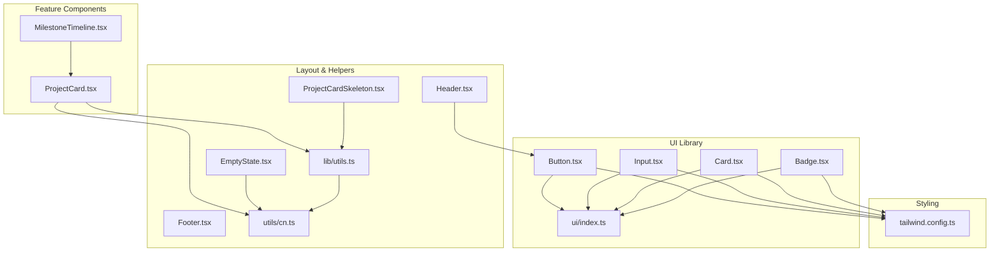
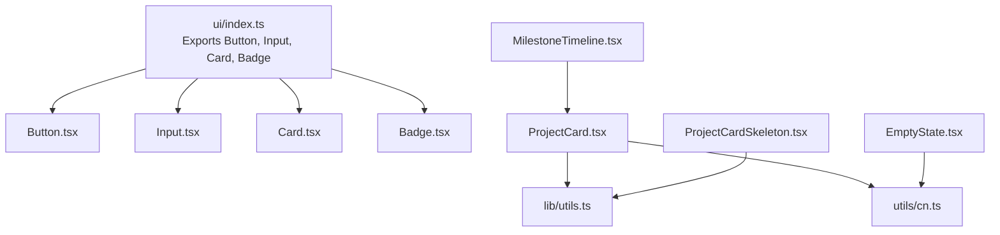
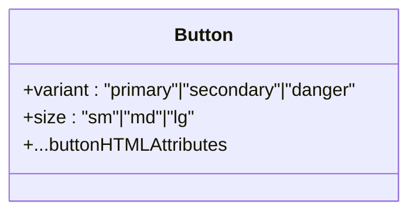
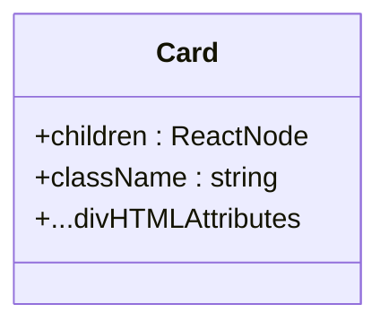
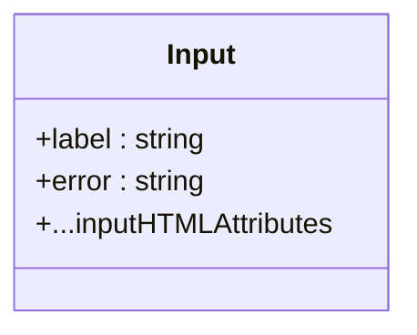
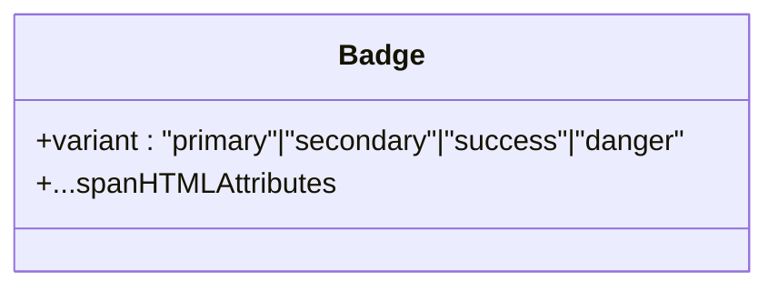
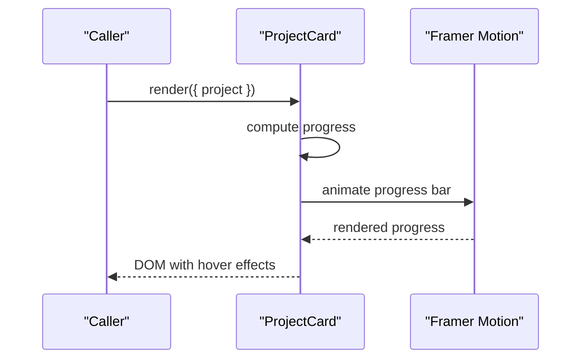
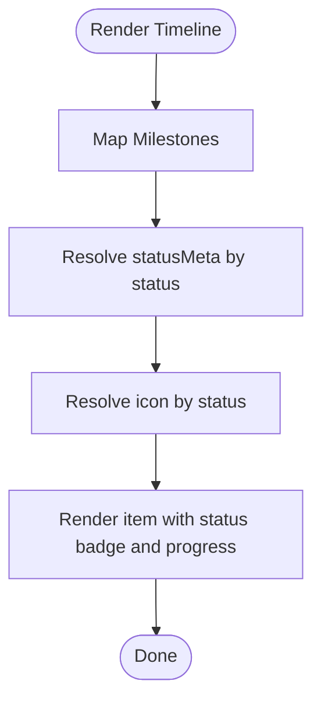
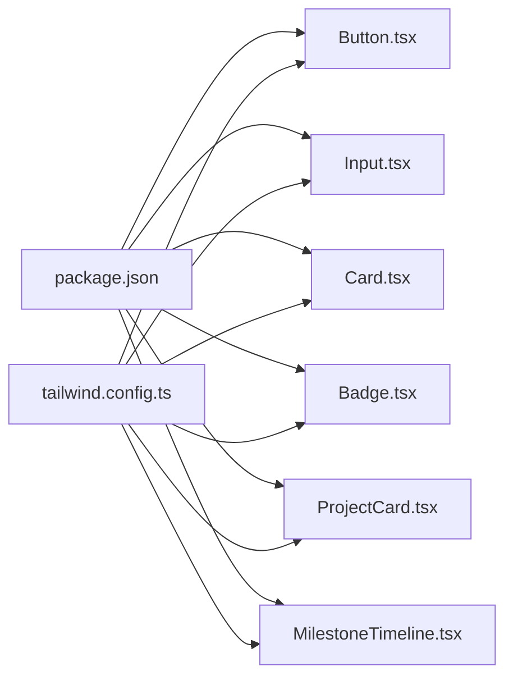

# Frontend API Reference

<cite>
**Referenced Files in This Document**
- [Button.tsx](file://frontend/src/components/ui/Button.tsx)
- [Card.tsx](file://frontend/src/components/ui/Card.tsx)
- [Input.tsx](file://frontend/src/components/ui/Input.tsx)
- [Badge.tsx](file://frontend/src/components/ui/Badge.tsx)
- [index.ts](file://frontend/src/components/ui/index.ts)
- [ProjectCard.tsx](file://frontend/src/components/ProjectCard.tsx)
- [MilestoneTimeline.tsx](file://frontend/src/components/MilestoneTimeline.tsx)
- [Header.tsx](file://frontend/src/components/layout/Header.tsx)
- [Footer.tsx](file://frontend/src/components/layout/Footer.tsx)
- [EmptyState.tsx](file://frontend/src/components/EmptyState.tsx)
- [ProjectCardSkeleton.tsx](file://frontend/src/components/skeletons/ProjectCardSkeleton.tsx)
- [utils.ts](file://frontend/src/lib/utils.ts)
- [cn.ts](file://frontend/src/utils/cn.ts)
- [package.json](file://frontend/package.json)
- [tailwind.config.ts](file://frontend/tailwind.config.ts)
</cite>

## Table of Contents
1. [Introduction](#introduction)
2. [Project Structure](#project-structure)
3. [Core Components](#core-components)
4. [Architecture Overview](#architecture-overview)
5. [Detailed Component Analysis](#detailed-component-analysis)
6. [Dependency Analysis](#dependency-analysis)
7. [Performance Considerations](#performance-considerations)
8. [Troubleshooting Guide](#troubleshooting-guide)
9. [Conclusion](#conclusion)
10. [Appendices](#appendices)

## Introduction
This document provides a comprehensive API reference for NovaFund’s React component library and integration interfaces. It covers component props, attributes, events, customization options, composition patterns, styling and theming, and wallet integration patterns. It also documents skeleton loaders, layout components, and utility helpers used across the UI system.

## Project Structure
The frontend is a Next.js application with a modular UI component library under components/ui and feature-specific components such as ProjectCard and MilestoneTimeline. Utility functions and Tailwind configuration enable consistent styling and animations.

**Diagram sources**
- [Button.tsx](file://frontend/src/components/ui/Button.tsx#L1-L39)
- [Input.tsx](file://frontend/src/components/ui/Input.tsx#L1-L31)
- [Card.tsx](file://frontend/src/components/ui/Card.tsx#L1-L19)
- [Badge.tsx](file://frontend/src/components/ui/Badge.tsx#L1-L31)
- [index.ts](file://frontend/src/components/ui/index.ts#L1-L5)
- [ProjectCard.tsx](file://frontend/src/components/ProjectCard.tsx#L1-L117)
- [MilestoneTimeline.tsx](file://frontend/src/components/MilestoneTimeline.tsx#L1-L115)
- [Header.tsx](file://frontend/src/components/layout/Header.tsx#L1-L20)
- [Footer.tsx](file://frontend/src/components/layout/Footer.tsx#L1-L15)
- [EmptyState.tsx](file://frontend/src/components/EmptyState.tsx#L1-L37)
- [ProjectCardSkeleton.tsx](file://frontend/src/components/skeletons/ProjectCardSkeleton.tsx#L1-L28)
- [utils.ts](file://frontend/src/lib/utils.ts#L1-L7)
- [cn.ts](file://frontend/src/utils/cn.ts#L1-L7)
- [tailwind.config.ts](file://frontend/tailwind.config.ts#L1-L43)

**Section sources**
- [Button.tsx](file://frontend/src/components/ui/Button.tsx#L1-L39)
- [Input.tsx](file://frontend/src/components/ui/Input.tsx#L1-L31)
- [Card.tsx](file://frontend/src/components/ui/Card.tsx#L1-L19)
- [Badge.tsx](file://frontend/src/components/ui/Badge.tsx#L1-L31)
- [index.ts](file://frontend/src/components/ui/index.ts#L1-L5)
- [ProjectCard.tsx](file://frontend/src/components/ProjectCard.tsx#L1-L117)
- [MilestoneTimeline.tsx](file://frontend/src/components/MilestoneTimeline.tsx#L1-L115)
- [Header.tsx](file://frontend/src/components/layout/Header.tsx#L1-L20)
- [Footer.tsx](file://frontend/src/components/layout/Footer.tsx#L1-L15)
- [EmptyState.tsx](file://frontend/src/components/EmptyState.tsx#L1-L37)
- [ProjectCardSkeleton.tsx](file://frontend/src/components/skeletons/ProjectCardSkeleton.tsx#L1-L28)
- [utils.ts](file://frontend/src/lib/utils.ts#L1-L7)
- [cn.ts](file://frontend/src/utils/cn.ts#L1-L7)
- [tailwind.config.ts](file://frontend/tailwind.config.ts#L1-L43)

## Core Components
This section documents the primary UI components and their props, attributes, and customization options.

- Button
  - Purpose: Renders interactive buttons with variants and sizes.
  - Props:
    - variant: "primary" | "secondary" | "danger"
    - size: "sm" | "md" | "lg"
    - Inherits all button HTML attributes (e.g., onClick, disabled, aria-*).
  - Events: Standard button events (onClick, onMouseEnter, etc.) via inherited props.
  - Styling: Base classes include focus ring and transitions; variant and size classes are applied conditionally.
  - Accessibility: Inherits focus-visible ring classes; ensure meaningful aria-labels for icon-only buttons.
  - Composition: Used in Header for a connect mock action.

- Card
  - Purpose: Generic container with dark theme styling.
  - Props:
    - children: React node.
    - className: Optional additional class names.
    - Inherits all div HTML attributes.
  - Styling: Dark background, white text, padding, rounded corners, and shadow.
  - Composition: Useful as a wrapper for forms, stats, and content blocks.

- Input
  - Purpose: Styled input with label and optional error messaging.
  - Props:
    - label: string (required).
    - error: string (optional).
    - Inherits all input HTML attributes (e.g., type, value, onChange, id, name, required).
  - Attributes:
    - aria-invalid: set to true when error is present.
  - Styling: Base border and focus ring classes; error state switches to red accents.
  - Accessibility: Associates label with input via htmlFor and aria-invalid.

- Badge
  - Purpose: Small status or tag indicator.
  - Props:
    - variant: "primary" | "secondary" | "success" | "danger".
    - Inherits all span HTML attributes.
  - Styling: Rounded pill shape with variant-specific colors.

**Section sources**
- [Button.tsx](file://frontend/src/components/ui/Button.tsx#L3-L6)
- [Button.tsx](file://frontend/src/components/ui/Button.tsx#L8-L36)
- [Card.tsx](file://frontend/src/components/ui/Card.tsx#L3-L5)
- [Card.tsx](file://frontend/src/components/ui/Card.tsx#L7-L16)
- [Input.tsx](file://frontend/src/components/ui/Input.tsx#L3-L6)
- [Input.tsx](file://frontend/src/components/ui/Input.tsx#L8-L27)
- [Badge.tsx](file://frontend/src/components/ui/Badge.tsx#L3-L5)
- [Badge.tsx](file://frontend/src/components/ui/Badge.tsx#L7-L27)
- [Header.tsx](file://frontend/src/components/layout/Header.tsx#L10-L12)

## Architecture Overview
The UI library exposes a clean index for barrel exports. Feature components integrate utility classes and animations. Tailwind CSS with a custom theme powers styling and theming.

**Diagram sources**
- [index.ts](file://frontend/src/components/ui/index.ts#L1-L5)
- [Button.tsx](file://frontend/src/components/ui/Button.tsx#L1-L39)
- [Input.tsx](file://frontend/src/components/ui/Input.tsx#L1-L31)
- [Card.tsx](file://frontend/src/components/ui/Card.tsx#L1-L19)
- [Badge.tsx](file://frontend/src/components/ui/Badge.tsx#L1-L31)
- [ProjectCard.tsx](file://frontend/src/components/ProjectCard.tsx#L1-L117)
- [MilestoneTimeline.tsx](file://frontend/src/components/MilestoneTimeline.tsx#L1-L115)
- [EmptyState.tsx](file://frontend/src/components/EmptyState.tsx#L1-L37)
- [ProjectCardSkeleton.tsx](file://frontend/src/components/skeletons/ProjectCardSkeleton.tsx#L1-L28)
- [utils.ts](file://frontend/src/lib/utils.ts#L1-L7)
- [cn.ts](file://frontend/src/utils/cn.ts#L1-L7)

## Detailed Component Analysis

### Button
- Props and behavior:
  - variant controls background, text color, hover, and focus ring.
  - size controls padding and text scale.
  - Inherits native button attributes; supports all event handlers.
- Styling and theming:
  - Uses Tailwind classes; variant and size maps define appearance.
  - Focus ring and transitions are standardized.
- Accessibility:
  - Focus ring classes improve keyboard navigation visibility.
- Composition:
  - Used in Header for a connect action.

**Diagram sources**
- [Button.tsx](file://frontend/src/components/ui/Button.tsx#L3-L6)

**Section sources**
- [Button.tsx](file://frontend/src/components/ui/Button.tsx#L3-L6)
- [Button.tsx](file://frontend/src/components/ui/Button.tsx#L8-L36)
- [Header.tsx](file://frontend/src/components/layout/Header.tsx#L10-L12)

### Card
- Props and behavior:
  - Accepts children and optional className; forwards all div attributes.
- Styling and theming:
  - Dark theme defaults with rounded corners and shadow.
- Composition:
  - Ideal for wrapping content sections and forms.

**Diagram sources**
- [Card.tsx](file://frontend/src/components/ui/Card.tsx#L3-L5)

**Section sources**
- [Card.tsx](file://frontend/src/components/ui/Card.tsx#L3-L5)
- [Card.tsx](file://frontend/src/components/ui/Card.tsx#L7-L16)

### Input
- Props and behavior:
  - Requires label; optional error message.
  - Applies aria-invalid when error is present.
- Styling and theming:
  - Base border and focus ring classes; error variant switches to red accents.
- Accessibility:
  - Associates label with input via htmlFor; sets aria-invalid.

**Diagram sources**
- [Input.tsx](file://frontend/src/components/ui/Input.tsx#L3-L6)

**Section sources**
- [Input.tsx](file://frontend/src/components/ui/Input.tsx#L3-L6)
- [Input.tsx](file://frontend/src/components/ui/Input.tsx#L8-L27)

### Badge
- Props and behavior:
  - variant selects background and text color.
- Styling and theming:
  - Rounded pill shape; variant-specific colors.

**Diagram sources**
- [Badge.tsx](file://frontend/src/components/ui/Badge.tsx#L3-L5)

**Section sources**
- [Badge.tsx](file://frontend/src/components/ui/Badge.tsx#L3-L5)
- [Badge.tsx](file://frontend/src/components/ui/Badge.tsx#L7-L27)

### ProjectCard
- Purpose: Displays project metadata with animated progress and hover effects.
- Props:
  - project: Project interface with id, title, description, category, goal, raised, backers, daysLeft, imageUrl, createdAt.
- Behavior:
  - Calculates progress percentage and clamps to 100%.
  - Category-dependent color classes via cn.
  - Framer Motion animations for image scaling and progress bar fill.
- Styling and theming:
  - Gradient overlays, backdrop blur, and category badges.
  - Tailwind classes for responsive spacing and typography.
- Accessibility:
  - Hover/focus states improve interactivity; ensure sufficient color contrast.
- Composition:
  - Integrates with cn utility for class merging.

**Diagram sources**
- [ProjectCard.tsx](file://frontend/src/components/ProjectCard.tsx#L25-L116)

**Section sources**
- [ProjectCard.tsx](file://frontend/src/components/ProjectCard.tsx#L8-L19)
- [ProjectCard.tsx](file://frontend/src/components/ProjectCard.tsx#L21-L23)
- [ProjectCard.tsx](file://frontend/src/components/ProjectCard.tsx#L25-L116)
- [utils.ts](file://frontend/src/lib/utils.ts#L4-L6)
- [cn.ts](file://frontend/src/utils/cn.ts#L4-L6)

### MilestoneTimeline
- Purpose: Visualizes milestone statuses along a timeline with icons and progress bars.
- Types:
  - MilestoneStatus: "completed" | "active" | "locked"
  - Milestone: id, title, description, amount, due, status, progress, releaseDetails.
- Props:
  - milestones: Milestone[].
- Behavior:
  - statusMeta maps status to label, icon background, text, and icon color.
  - iconMap maps status to an icon component.
  - Renders a vertical timeline with status indicators and progress.
- Styling and theming:
  - Uses Tailwind classes for backgrounds, borders, shadows, and gradients.
  - Animated pulse for active status.

**Diagram sources**
- [MilestoneTimeline.tsx](file://frontend/src/components/MilestoneTimeline.tsx#L57-L114)

**Section sources**
- [MilestoneTimeline.tsx](file://frontend/src/components/MilestoneTimeline.tsx#L5-L16)
- [MilestoneTimeline.tsx](file://frontend/src/components/MilestoneTimeline.tsx#L53-L55)
- [MilestoneTimeline.tsx](file://frontend/src/components/MilestoneTimeline.tsx#L57-L114)

### Layout Components
- Header
  - Uses Button from the UI library for a connect action.
  - Responsive navigation bar with branding and actions.
- Footer
  - Minimal footer with copyright and design credit.

**Section sources**
- [Header.tsx](file://frontend/src/components/layout/Header.tsx#L4-L16)
- [Footer.tsx](file://frontend/src/components/layout/Footer.tsx#L3-L11)

### Skeleton Loaders and Empty States
- ProjectCardSkeleton
  - Provides a skeleton layout for ProjectCard with image placeholder and content lines.
- EmptyState
  - Reusable empty state with optional icon, title, description, and action.
  - Uses cn for class merging and animation utilities.

**Section sources**
- [ProjectCardSkeleton.tsx](file://frontend/src/components/skeletons/ProjectCardSkeleton.tsx#L3-L27)
- [EmptyState.tsx](file://frontend/src/components/EmptyState.tsx#L4-L10)
- [EmptyState.tsx](file://frontend/src/components/EmptyState.tsx#L12-L36)

## Dependency Analysis
External dependencies and integrations:
- UI library depends on React and Tailwind utilities.
- ProjectCard integrates Framer Motion for animations and cn for class merging.
- Tailwind configuration defines a custom theme with semantic color variables.

**Diagram sources**
- [package.json](file://frontend/package.json#L11-L18)
- [Button.tsx](file://frontend/src/components/ui/Button.tsx#L1-L39)
- [Input.tsx](file://frontend/src/components/ui/Input.tsx#L1-L31)
- [Card.tsx](file://frontend/src/components/ui/Card.tsx#L1-L19)
- [Badge.tsx](file://frontend/src/components/ui/Badge.tsx#L1-L31)
- [ProjectCard.tsx](file://frontend/src/components/ProjectCard.tsx#L1-L117)
- [MilestoneTimeline.tsx](file://frontend/src/components/MilestoneTimeline.tsx#L1-L115)
- [tailwind.config.ts](file://frontend/tailwind.config.ts#L1-L43)

**Section sources**
- [package.json](file://frontend/package.json#L11-L18)
- [tailwind.config.ts](file://frontend/tailwind.config.ts#L9-L37)

## Performance Considerations
- Prefer server components where appropriate; feature components are client-rendered.
- Use skeleton loaders (ProjectCardSkeleton) to improve perceived performance during data fetches.
- Keep animations minimal and scoped; leverage Framer Motion only where beneficial.
- Merge Tailwind classes efficiently using cn to avoid redundant styles.
- Defer heavy computations off the main thread when rendering large lists of components.

## Troubleshooting Guide
- Button focus rings not visible:
  - Ensure focus-visible ring utilities are enabled in Tailwind; verify variant colors meet contrast requirements.
- Input error state not applying:
  - Confirm error prop is passed; verify aria-invalid is set when error exists.
- ProjectCard progress not animating:
  - Verify motion dependencies are installed and Framer Motion is configured.
- MilestoneTimeline status icons missing:
  - Confirm status values match supported statuses and icon mapping is correct.
- EmptyState not rendering action:
  - Ensure action is provided and is a valid React node.

**Section sources**
- [Button.tsx](file://frontend/src/components/ui/Button.tsx#L14-L26)
- [Input.tsx](file://frontend/src/components/ui/Input.tsx#L20-L26)
- [ProjectCard.tsx](file://frontend/src/components/ProjectCard.tsx#L36-L40)
- [MilestoneTimeline.tsx](file://frontend/src/components/MilestoneTimeline.tsx#L47-L51)
- [EmptyState.tsx](file://frontend/src/components/EmptyState.tsx#L33-L34)

## Conclusion
NovaFund’s React component library offers a cohesive set of UI primitives and feature components designed for a dark-themed, animated experience. The UI leverages Tailwind CSS with a custom theme, utility functions for class merging, and Framer Motion for subtle animations. The documented components, props, and composition patterns provide a solid foundation for building consistent, accessible, and performant interfaces.

## Appendices

### Theming and Styling Reference
- Semantic color tokens:
  - border, input, ring, background, foreground, primary, secondary, muted, accent, card.
- Color usage:
  - Variants apply consistent color scales; ensure sufficient contrast for accessibility.
- Class merging:
  - Use cn for safe class concatenation and deduplication.

**Section sources**
- [tailwind.config.ts](file://frontend/tailwind.config.ts#L11-L37)
- [utils.ts](file://frontend/src/lib/utils.ts#L4-L6)
- [cn.ts](file://frontend/src/utils/cn.ts#L4-L6)

### Component Composition Patterns
- Barrel export pattern:
  - ui/index.ts re-exports Button, Input, Card, Badge for ergonomic imports.
- Utility-driven styling:
  - Components rely on Tailwind classes and cn for robust styling.
- Animation integration:
  - ProjectCard uses Framer Motion for progress and hover effects.

**Section sources**
- [index.ts](file://frontend/src/components/ui/index.ts#L1-L5)
- [utils.ts](file://frontend/src/lib/utils.ts#L4-L6)
- [ProjectCard.tsx](file://frontend/src/components/ProjectCard.tsx#L3-L4)

### Accessibility and Responsive Design Guidelines
- Accessibility:
  - Use aria-invalid for Input error states; ensure focus rings are visible.
  - Provide meaningful labels and roles for interactive elements.
- Responsive design:
  - Components use responsive spacing and typography; ensure layouts adapt to mobile breakpoints.
- Cross-browser compatibility:
  - Tailwind and modern React features are used; test on target browsers and polyfill if needed.