# Layout Components API

<cite>
**Referenced Files in This Document**
- [Header.tsx](file://frontend/src/components/layout/Header.tsx)
- [Footer.tsx](file://frontend/src/components/layout/Footer.tsx)
- [layout.tsx](file://frontend/src/app/layout.tsx)
- [page.tsx](file://frontend/src/app/page.tsx)
- [Button.tsx](file://frontend/src/components/ui/Button.tsx)
- [globals.css](file://frontend/src/styles/globals.css)
- [tailwind.config.ts](file://frontend/tailwind.config.ts)
- [package.json](file://frontend/package.json)
- [next.config.mjs](file://frontend/next.config.mjs)
- [cn.ts](file://frontend/src/utils/cn.ts)
- [lib/utils.ts](file://frontend/src/lib/utils.ts)
</cite>

## Table of Contents
1. [Introduction](#introduction)
2. [Project Structure](#project-structure)
3. [Core Components](#core-components)
4. [Architecture Overview](#architecture-overview)
5. [Detailed Component Analysis](#detailed-component-analysis)
6. [Dependency Analysis](#dependency-analysis)
7. [Performance Considerations](#performance-considerations)
8. [Accessibility and SEO Compliance](#accessibility-and-seo-compliance)
9. [Troubleshooting Guide](#troubleshooting-guide)
10. [Conclusion](#conclusion)

## Introduction
This document provides comprehensive API documentation for NovaFund's layout and navigation components. It covers the Header component with wallet integration, navigation links, branding elements, and responsive behavior; the Footer component with links, social media integration, and legal information display; and the main App Layout component with routing integration, global state management, and page structure. The guide includes props for authentication state, navigation items, and branding configuration, along with usage examples, responsive design patterns, mobile-first approaches, Next.js routing integration, global styles, and theme providers. Accessibility compliance, SEO considerations, and performance optimization recommendations are also addressed.

## Project Structure
The layout system is built with Next.js App Router and Tailwind CSS. The root layout wraps all pages and renders the Header and Footer consistently. UI primitives are centralized under a dedicated components library, while global styles and theme configuration define the design system.

**Diagram sources**
- [layout.tsx](file://frontend/src/app/layout.tsx#L14-L28)
- [Header.tsx](file://frontend/src/components/layout/Header.tsx#L1-L20)
- [Footer.tsx](file://frontend/src/components/layout/Footer.tsx#L1-L15)
- [Button.tsx](file://frontend/src/components/ui/Button.tsx#L1-L39)
- [globals.css](file://frontend/src/styles/globals.css#L1-L24)
- [tailwind.config.ts](file://frontend/tailwind.config.ts#L1-L43)

**Section sources**
- [layout.tsx](file://frontend/src/app/layout.tsx#L1-L29)
- [Header.tsx](file://frontend/src/components/layout/Header.tsx#L1-L20)
- [Footer.tsx](file://frontend/src/components/layout/Footer.tsx#L1-L15)
- [Button.tsx](file://frontend/src/components/ui/Button.tsx#L1-L39)
- [globals.css](file://frontend/src/styles/globals.css#L1-L24)
- [tailwind.config.ts](file://frontend/tailwind.config.ts#L1-L43)

## Core Components
This section documents the public APIs and usage patterns for the layout components.

- Header
  - Purpose: Renders branding and wallet connection controls at the top of every page.
  - Props: None (current implementation is static).
  - Integration: Consumes Button from the UI library for wallet actions.
  - Responsive behavior: Uses flex utilities to center branding and align action buttons; adapts to container width via max-width constraints.
  - Accessibility: Add role and aria-label attributes to interactive elements (see recommendations).
  - SEO: Branding text is present in the header; ensure canonical and meta tags are configured at the page level.

- Footer
  - Purpose: Displays legal information and brand attribution at the bottom of every page.
  - Props: None (current implementation is static).
  - Responsive behavior: Stacks content on small screens and uses flex row on medium screens and above.
  - Accessibility: Include skip links and landmark roles at the page level.
  - Legal: Placeholders for links and social media can be integrated later.

- Root Layout
  - Purpose: Wraps all pages with consistent structure, global styles, and theme provider.
  - Routing integration: Next.js App Router layout that renders children between Header and Footer.
  - Global state: No explicit state management in the layout; integrate providers at this level if needed.
  - Page structure: Ensures a consistent max-width container and spacing around the main content area.

**Section sources**
- [Header.tsx](file://frontend/src/components/layout/Header.tsx#L4-L17)
- [Footer.tsx](file://frontend/src/components/layout/Footer.tsx#L3-L12)
- [layout.tsx](file://frontend/src/app/layout.tsx#L14-L28)

## Architecture Overview
The layout architecture follows Next.js conventions with a root layout that composes reusable components. The UI library centralizes primitive components, while Tailwind CSS and theme variables provide consistent styling.

**Diagram sources**
- [layout.tsx](file://frontend/src/app/layout.tsx#L14-L28)
- [Header.tsx](file://frontend/src/components/layout/Header.tsx#L4-L17)
- [Footer.tsx](file://frontend/src/components/layout/Footer.tsx#L3-L12)

## Detailed Component Analysis

### Header Component API
- Component: Header
- Path: [Header.tsx](file://frontend/src/components/layout/Header.tsx#L4-L17)
- Current behavior:
  - Renders branding text with a branded color.
  - Includes a primary Button labeled "Mock Connect".
  - Uses a max-width container and flex alignment for responsive layout.
- Props (current implementation):
  - None (static).
- Integration points:
  - Imports Button from the UI library.
  - Consumes Tailwind classes for layout and theming.
- Recommended enhancements:
  - Accept navigation items as props for dynamic menus.
  - Accept authentication state to conditionally render connect/disconnect actions.
  - Accept branding configuration (logo, alt text) as props.
  - Add aria-labels and roles for accessibility.
  - Support mobile menu toggling with a hamburger menu pattern.

**Diagram sources**
- [Header.tsx](file://frontend/src/components/layout/Header.tsx#L1-L20)
- [Button.tsx](file://frontend/src/components/ui/Button.tsx#L3-L6)

**Section sources**
- [Header.tsx](file://frontend/src/components/layout/Header.tsx#L4-L17)
- [Button.tsx](file://frontend/src/components/ui/Button.tsx#L1-L39)

### Footer Component API
- Component: Footer
- Path: [Footer.tsx](file://frontend/src/components/layout/Footer.tsx#L3-L12)
- Current behavior:
  - Displays copyright and design credit.
  - Responsive layout stacks on small screens and aligns items on larger screens.
- Props (current implementation):
  - None (static).
- Recommended enhancements:
  - Accept links array for quick links and legal sections.
  - Accept social media handles and icons for social integration.
  - Add skip navigation and landmark roles for accessibility.
  - Include privacy policy and terms links.

```mermaid
flowchart TD
Start(["Render Footer"]) --> Legal["Display © 2026 NovaFund"]
Legal --> Branding["Display 'Designed with a Cosmic touch'"]
Branding --> End(["Footer Complete"])
```

**Diagram sources**
- [Footer.tsx](file://frontend/src/components/layout/Footer.tsx#L3-L12)

**Section sources**
- [Footer.tsx](file://frontend/src/components/layout/Footer.tsx#L3-L12)

### Root Layout Component API
- Component: RootLayout
- Path: [layout.tsx](file://frontend/src/app/layout.tsx#L14-L28)
- Responsibilities:
  - Provides global metadata and font configuration.
  - Wraps children with a consistent layout structure.
  - Applies global styles and theme variables.
- Props:
  - children: ReactNode (Next.js App Router contract).
- Integration points:
  - Imports Header and Footer.
  - Imports global CSS.
  - Uses Inter font from Next/font.
- Recommendations:
  - Add a theme provider here if using a design system that requires context.
  - Integrate global state providers (e.g., wallet, notifications) at this level.
  - Ensure metadata is overridden per page when needed.

**Diagram sources**
- [layout.tsx](file://frontend/src/app/layout.tsx#L14-L28)
- [Header.tsx](file://frontend/src/components/layout/Header.tsx#L4-L17)
- [Footer.tsx](file://frontend/src/components/layout/Footer.tsx#L3-L12)

**Section sources**
- [layout.tsx](file://frontend/src/app/layout.tsx#L1-L29)

### UI Button Component (Integration Reference)
- Component: Button
- Path: [Button.tsx](file://frontend/src/components/ui/Button.tsx#L3-L6)
- Props:
  - variant: "primary" | "secondary" | "danger"
  - size: "sm" | "md" | "lg"
  - Additional button attributes inherited from HTMLButtonElement.
- Styling:
  - Base classes with size and variant maps.
  - Focus rings and transitions for accessibility and UX.
- Usage in Header:
  - Used for the "Mock Connect" action.

**Section sources**
- [Button.tsx](file://frontend/src/components/ui/Button.tsx#L1-L39)

## Dependency Analysis
The layout components depend on UI primitives, global styles, and Next.js routing. The UI library consolidates component interfaces, while Tailwind and theme variables provide consistent styling.

**Diagram sources**
- [Header.tsx](file://frontend/src/components/layout/Header.tsx#L1-L20)
- [Button.tsx](file://frontend/src/components/ui/Button.tsx#L1-L39)
- [layout.tsx](file://frontend/src/app/layout.tsx#L1-L29)
- [globals.css](file://frontend/src/styles/globals.css#L1-L24)
- [tailwind.config.ts](file://frontend/tailwind.config.ts#L1-L43)
- [lib/utils.ts](file://frontend/src/lib/utils.ts#L1-L7)
- [cn.ts](file://frontend/src/utils/cn.ts#L1-L7)

**Section sources**
- [Header.tsx](file://frontend/src/components/layout/Header.tsx#L1-L20)
- [Button.tsx](file://frontend/src/components/ui/Button.tsx#L1-L39)
- [layout.tsx](file://frontend/src/app/layout.tsx#L1-L29)
- [globals.css](file://frontend/src/styles/globals.css#L1-L24)
- [tailwind.config.ts](file://frontend/tailwind.config.ts#L1-L43)
- [lib/utils.ts](file://frontend/src/lib/utils.ts#L1-L7)
- [cn.ts](file://frontend/src/utils/cn.ts#L1-L7)

## Performance Considerations
- Bundle size:
  - Keep Header and Footer lightweight; avoid heavy dependencies.
  - Consolidate UI components in a single export to reduce imports.
- Rendering:
  - Memoize props passed to Header/Footer to prevent unnecessary re-renders.
  - Use lazy loading for images and third-party widgets.
- Styling:
  - Leverage Tailwind utilities to minimize custom CSS.
  - Use theme variables to avoid repeated color definitions.
- Routing:
  - Utilize Next.js dynamic imports for heavy page components.
  - Implement client-side navigation for smoother transitions.

## Accessibility and SEO Compliance
- Accessibility:
  - Add landmarks (header, main, footer) and skip links.
  - Ensure interactive elements have proper roles and labels.
  - Provide keyboard navigation support.
  - Use semantic HTML and ARIA attributes where appropriate.
- SEO:
  - Configure metadata at the page level; ensure unique titles and descriptions.
  - Use structured data for key pages.
  - Optimize images and assets for fast loading.

## Troubleshooting Guide
- Header/Footer not rendering:
  - Verify RootLayout is wrapping pages and exporting children correctly.
- Styling inconsistencies:
  - Confirm globals.css is imported and Tailwind content paths include layout components.
  - Check theme variable definitions and Tailwind config extensions.
- Button styles not applied:
  - Ensure Button props match supported variants and sizes.
  - Verify utility functions (cn) are used consistently.

**Section sources**
- [layout.tsx](file://frontend/src/app/layout.tsx#L14-L28)
- [globals.css](file://frontend/src/styles/globals.css#L1-L24)
- [tailwind.config.ts](file://frontend/tailwind.config.ts#L1-L43)
- [Button.tsx](file://frontend/src/components/ui/Button.tsx#L1-L39)

## Conclusion
NovaFund's layout components provide a solid foundation for consistent navigation and branding across the application. By extending the Header and Footer with props for authentication state, navigation items, and branding configuration, and by integrating them with Next.js routing and global styles, the system can scale effectively. Following the recommended enhancements for responsiveness, accessibility, SEO, and performance ensures a robust and user-friendly experience.