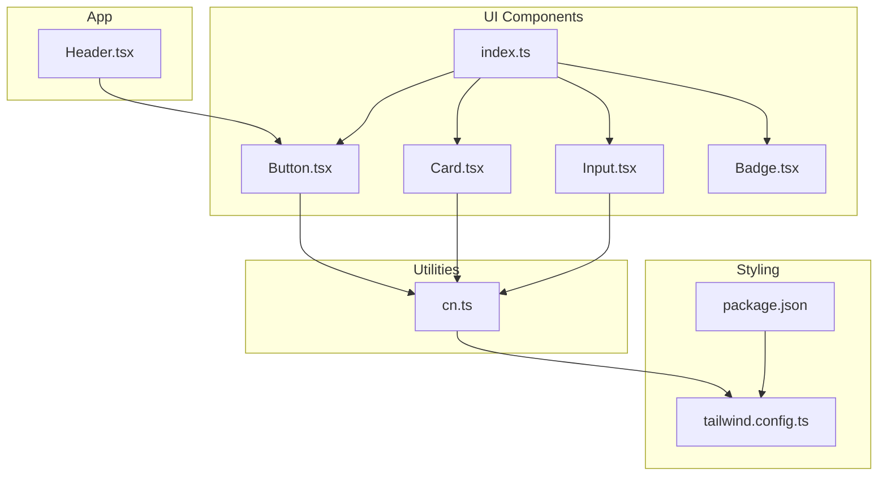
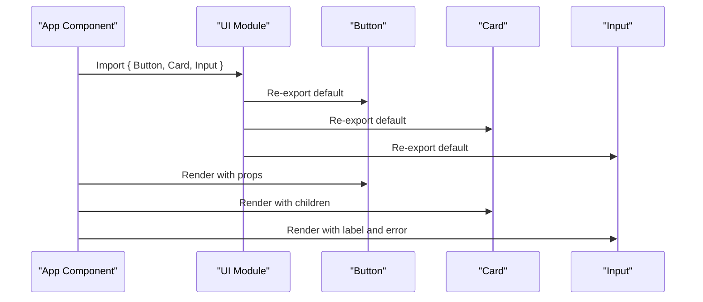
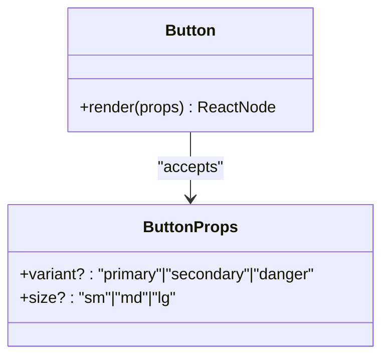
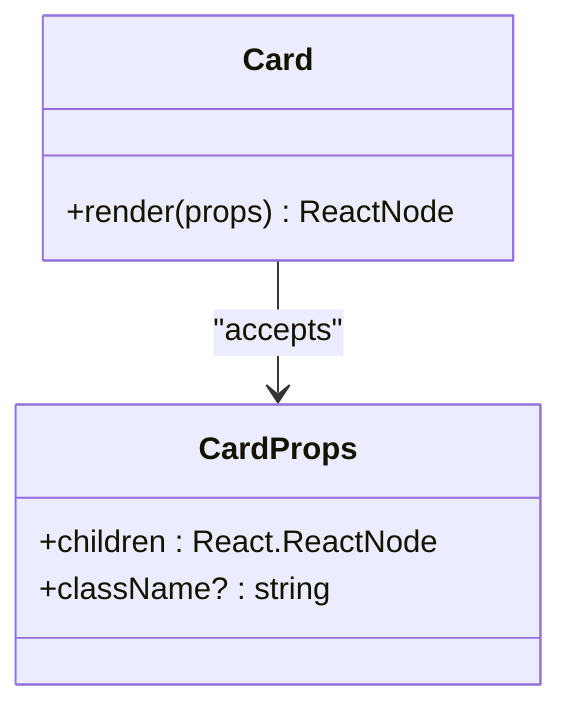
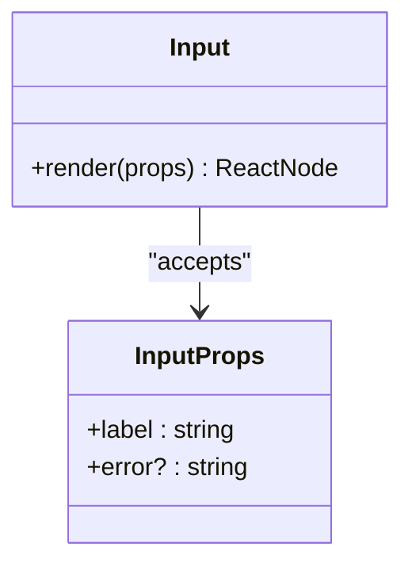
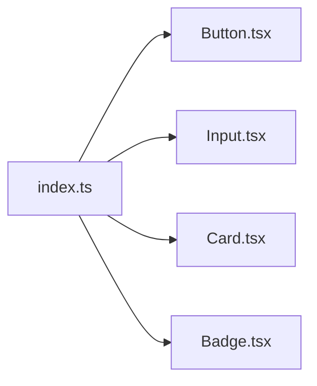
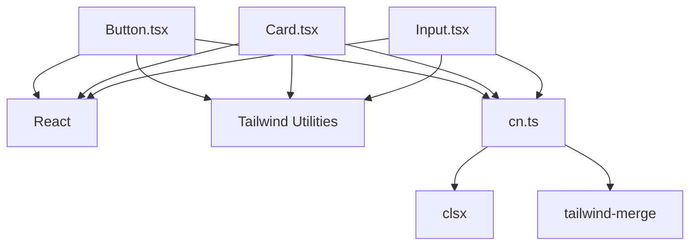

# UI Components API

<cite>
**Referenced Files in This Document**
- [Button.tsx](file://frontend/src/components/ui/Button.tsx)
- [Card.tsx](file://frontend/src/components/ui/Card.tsx)
- [Input.tsx](file://frontend/src/components/ui/Input.tsx)
- [index.ts](file://frontend/src/components/ui/index.ts)
- [Header.tsx](file://frontend/src/components/layout/Header.tsx)
- [Badge.tsx](file://frontend/src/components/ui/Badge.tsx)
- [cn.ts](file://frontend/src/utils/cn.ts)
- [package.json](file://frontend/package.json)
- [tailwind.config.ts](file://frontend/tailwind.config.ts)
</cite>

## Table of Contents
1. [Introduction](#introduction)
2. [Project Structure](#project-structure)
3. [Core Components](#core-components)
4. [Architecture Overview](#architecture-overview)
5. [Detailed Component Analysis](#detailed-component-analysis)
6. [Dependency Analysis](#dependency-analysis)
7. [Performance Considerations](#performance-considerations)
8. [Troubleshooting Guide](#troubleshooting-guide)
9. [Conclusion](#conclusion)
10. [Appendices](#appendices)

## Introduction
This document provides comprehensive API documentation for NovaFund’s React UI component library. It focuses on the Button, Card, and Input components, detailing their props, defaults, styling, composition patterns, accessibility, and usage within the Next.js application. It also documents the component index export structure and re-export patterns, along with practical guidance for state management, animations, and performance optimization.

## Project Structure
The UI components live under the frontend/src/components/ui directory and are exported via a centralized index file. They integrate with Tailwind CSS for styling and use a utility function for merging class names.

**Diagram sources**
- [Button.tsx](file://frontend/src/components/ui/Button.tsx#L1-L39)
- [Card.tsx](file://frontend/src/components/ui/Card.tsx#L1-L19)
- [Input.tsx](file://frontend/src/components/ui/Input.tsx#L1-L31)
- [index.ts](file://frontend/src/components/ui/index.ts#L1-L5)
- [Header.tsx](file://frontend/src/components/layout/Header.tsx#L1-L20)
- [cn.ts](file://frontend/src/utils/cn.ts#L1-L7)
- [tailwind.config.ts](file://frontend/tailwind.config.ts#L1-L43)
- [package.json](file://frontend/package.json#L1-L32)

**Section sources**
- [index.ts](file://frontend/src/components/ui/index.ts#L1-L5)
- [Header.tsx](file://frontend/src/components/layout/Header.tsx#L1-L20)
- [cn.ts](file://frontend/src/utils/cn.ts#L1-L7)
- [tailwind.config.ts](file://frontend/tailwind.config.ts#L1-L43)
- [package.json](file://frontend/package.json#L1-L32)

## Core Components
This section summarizes the public API surface for each component, including props, defaults, and behavior.

- Button
  - Purpose: Renders a styled button with variant and size options.
  - Props:
    - variant: "primary" | "secondary" | "danger" (default: "primary")
    - size: "sm" | "md" | "lg" (default: "md")
    - Inherits all native HTML button attributes.
  - Defaults:
    - variant: "primary"
    - size: "md"
  - Accessibility: Inherits focus-visible ring behavior from base styles.
  - Composition: Intended to wrap child content and forward rest props to the underlying button element.

- Card
  - Purpose: Provides a dark-themed container with padding, rounded corners, and shadow.
  - Props:
    - children: React.ReactNode (required)
    - className: string (optional)
    - Inherits all native HTML div attributes.
  - Defaults:
    - className: "" (empty)
  - Composition: Designed to wrap content and accept additional class names for customization.

- Input
  - Purpose: Renders a labeled input field with integrated error display and accessibility attributes.
  - Props:
    - label: string (required)
    - error?: string (optional)
    - Inherits all native HTML input attributes (e.g., id, type, placeholder).
  - Defaults:
    - error: undefined
  - Accessibility: Sets aria-invalid when an error is present.
  - Composition: Wraps label, input, and optional error message in a vertical stack.

**Section sources**
- [Button.tsx](file://frontend/src/components/ui/Button.tsx#L3-L6)
- [Button.tsx](file://frontend/src/components/ui/Button.tsx#L8-L36)
- [Card.tsx](file://frontend/src/components/ui/Card.tsx#L3-L5)
- [Card.tsx](file://frontend/src/components/ui/Card.tsx#L7-L16)
- [Input.tsx](file://frontend/src/components/ui/Input.tsx#L3-L6)
- [Input.tsx](file://frontend/src/components/ui/Input.tsx#L8-L28)

## Architecture Overview
The UI components are organized under a single module with a central index that re-exports them. Components rely on Tailwind utility classes for styling and a shared class merging utility to compose styles safely.

**Diagram sources**
- [index.ts](file://frontend/src/components/ui/index.ts#L1-L5)
- [Button.tsx](file://frontend/src/components/ui/Button.tsx#L1-L39)
- [Card.tsx](file://frontend/src/components/ui/Card.tsx#L1-L19)
- [Input.tsx](file://frontend/src/components/ui/Input.tsx#L1-L31)

## Detailed Component Analysis

### Button Component
- Purpose: A versatile button with predefined variants and sizes.
- Props:
  - variant: "primary" | "secondary" | "danger" (default: "primary")
  - size: "sm" | "md" | "lg" (default: "md")
  - Inherits all native HTML button attributes (e.g., onClick, disabled, aria-*).
- Defaults:
  - variant: "primary"
  - size: "md"
- Styling:
  - Base: shared typography, rounded corners, transitions, focus ring utilities.
  - Sizes: padding and text sizing mapped to "sm" | "md" | "lg".
  - Variants: color tokens for primary, secondary, and danger.
- Accessibility:
  - Focus ring utilities enable keyboard navigation visibility.
- Composition patterns:
  - Pass children for button text or icons.
  - Forward additional props to the underlying button element.
- Usage example path:
  - [Header.tsx](file://frontend/src/components/layout/Header.tsx#L10-L12)

**Diagram sources**
- [Button.tsx](file://frontend/src/components/ui/Button.tsx#L3-L6)
- [Button.tsx](file://frontend/src/components/ui/Button.tsx#L8-L36)

**Section sources**
- [Button.tsx](file://frontend/src/components/ui/Button.tsx#L3-L6)
- [Button.tsx](file://frontend/src/components/ui/Button.tsx#L8-L36)
- [Header.tsx](file://frontend/src/components/layout/Header.tsx#L10-L12)

### Card Component
- Purpose: A dark-themed container for grouping content.
- Props:
  - children: React.ReactNode (required)
  - className?: string (optional)
  - Inherits all native HTML div attributes.
- Defaults:
  - className: "" (empty)
- Styling:
  - Background, text color, padding, rounded corners, and shadow are applied by default.
  - Additional classes can be appended via className.
- Composition patterns:
  - Wrap content blocks, lists, or forms.
  - Extend with className for contextual variations.
- Usage example path:
  - [Header.tsx](file://frontend/src/components/layout/Header.tsx#L6-L15)

**Diagram sources**
- [Card.tsx](file://frontend/src/components/ui/Card.tsx#L3-L5)
- [Card.tsx](file://frontend/src/components/ui/Card.tsx#L7-L16)

**Section sources**
- [Card.tsx](file://frontend/src/components/ui/Card.tsx#L3-L5)
- [Card.tsx](file://frontend/src/components/ui/Card.tsx#L7-L16)
- [Header.tsx](file://frontend/src/components/layout/Header.tsx#L6-L15)

### Input Component
- Purpose: A labeled input with integrated error messaging and accessibility support.
- Props:
  - label: string (required)
  - error?: string (optional)
  - Inherits all native HTML input attributes (e.g., id, type, placeholder, onChange).
- Defaults:
  - error: undefined
- Styling:
  - Base: width, padding, border, rounded corners, focus outline, and focus ring.
  - Conditional error styling: red border and ring when error is present; otherwise purple focus ring.
- Accessibility:
  - Associates label with input via htmlFor derived from id.
  - Sets aria-invalid when error is present.
- Composition patterns:
  - Use label for screen readers and user guidance.
  - Display inline error messages below the input.
- Usage example path:
  - [Input.tsx](file://frontend/src/components/ui/Input.tsx#L8-L28)

**Diagram sources**
- [Input.tsx](file://frontend/src/components/ui/Input.tsx#L3-L6)
- [Input.tsx](file://frontend/src/components/ui/Input.tsx#L8-L28)

**Section sources**
- [Input.tsx](file://frontend/src/components/ui/Input.tsx#L3-L6)
- [Input.tsx](file://frontend/src/components/ui/Input.tsx#L8-L28)

### Component Index Export Structure
The UI module exports components via a centralized index file, enabling clean imports across the application.

- Exports:
  - Button
  - Input
  - Card
  - Badge
- Re-export pattern:
  - Each component is re-exported as a named default export from its file.

**Diagram sources**
- [index.ts](file://frontend/src/components/ui/index.ts#L1-L5)

**Section sources**
- [index.ts](file://frontend/src/components/ui/index.ts#L1-L5)

### Composition Patterns and Accessibility
- Composition:
  - Button: Pass children and forward props to the underlying button element.
  - Card: Wrap content and append className for additional styling.
  - Input: Combine label, input, and optional error message; forward native input props.
- Accessibility:
  - Input sets aria-invalid when error is present.
  - Button inherits focus-visible ring utilities for keyboard navigation.
  - Label associates with input via htmlFor=id.

**Section sources**
- [Button.tsx](file://frontend/src/components/ui/Button.tsx#L14-L35)
- [Input.tsx](file://frontend/src/components/ui/Input.tsx#L17-L24)

### Responsive Design Considerations
- The components rely on Tailwind utility classes for responsive behavior. The Tailwind configuration extends design tokens and enables content scanning across components and app directories, allowing responsive utilities to be applied via className props on components.

**Section sources**
- [tailwind.config.ts](file://frontend/tailwind.config.ts#L1-L43)

## Dependency Analysis
- Internal dependencies:
  - Components depend on React and Tailwind utility classes.
  - A shared cn utility merges and deduplicates class names.
- External dependencies:
  - clsx and tailwind-merge are used for robust class composition.
  - Framer Motion is included in the project for animations (not used in these components).
- Import patterns:
  - Components are re-exported from the UI index for convenient imports.

**Diagram sources**
- [Button.tsx](file://frontend/src/components/ui/Button.tsx#L1-L39)
- [Card.tsx](file://frontend/src/components/ui/Card.tsx#L1-L19)
- [Input.tsx](file://frontend/src/components/ui/Input.tsx#L1-L31)
- [cn.ts](file://frontend/src/utils/cn.ts#L1-L7)
- [package.json](file://frontend/package.json#L11-L18)

**Section sources**
- [cn.ts](file://frontend/src/utils/cn.ts#L1-L7)
- [package.json](file://frontend/package.json#L11-L18)

## Performance Considerations
- Prefer minimal re-renders by passing stable callbacks and avoiding unnecessary prop churn.
- Use className to apply Tailwind utilities rather than dynamic inline styles for better caching and bundle size.
- Keep component props flat and avoid deep object merges; leverage the cn utility for safe class composition.
- Defer heavy computations off the render path and memoize expensive values when integrating with forms.

[No sources needed since this section provides general guidance]

## Troubleshooting Guide
- Button appears unstyled:
  - Ensure Tailwind is configured and scanning the UI directory.
  - Verify className composition does not override base styles unintentionally.
- Input label not associated with input:
  - Confirm the id prop is set so the label’s htmlFor matches the input id.
- Input error not announced by assistive technologies:
  - Ensure aria-invalid is set when error is present.
- Card background or text color unexpected:
  - Append className to override defaults or adjust Tailwind theme tokens.

**Section sources**
- [Input.tsx](file://frontend/src/components/ui/Input.tsx#L17-L24)
- [Card.tsx](file://frontend/src/components/ui/Card.tsx#L10-L10)

## Conclusion
NovaFund’s UI component library offers a focused set of primitives—Button, Card, and Input—designed for consistency, accessibility, and composability. The centralized index export simplifies imports, while Tailwind utilities and the cn utility enable flexible styling. By following the documented patterns and defaults, teams can build accessible, responsive interfaces efficiently.

[No sources needed since this section summarizes without analyzing specific files]

## Appendices

### Prop Reference Tables

- Button
  - variant: "primary" | "secondary" | "danger" (default: "primary")
  - size: "sm" | "md" | "lg" (default: "md")
  - Inherits: all native HTML button attributes

- Card
  - children: React.ReactNode (required)
  - className: string (default: "")
  - Inherits: all native HTML div attributes

- Input
  - label: string (required)
  - error: string (optional)
  - Inherits: all native HTML input attributes (e.g., id, type, placeholder, onChange)

**Section sources**
- [Button.tsx](file://frontend/src/components/ui/Button.tsx#L3-L6)
- [Card.tsx](file://frontend/src/components/ui/Card.tsx#L3-L5)
- [Input.tsx](file://frontend/src/components/ui/Input.tsx#L3-L6)

### Usage Examples (paths only)
- Button in Header:
  - [Header.tsx](file://frontend/src/components/layout/Header.tsx#L10-L12)
- Card wrapping content:
  - [Header.tsx](file://frontend/src/components/layout/Header.tsx#L6-L15)
- Input with label and error:
  - [Input.tsx](file://frontend/src/components/ui/Input.tsx#L8-L28)

### Animation and Motion
- The project includes Framer Motion; consider adding motion variants to Button or Card for interactive feedback where appropriate.

**Section sources**
- [package.json](file://frontend/package.json#L18-L18)