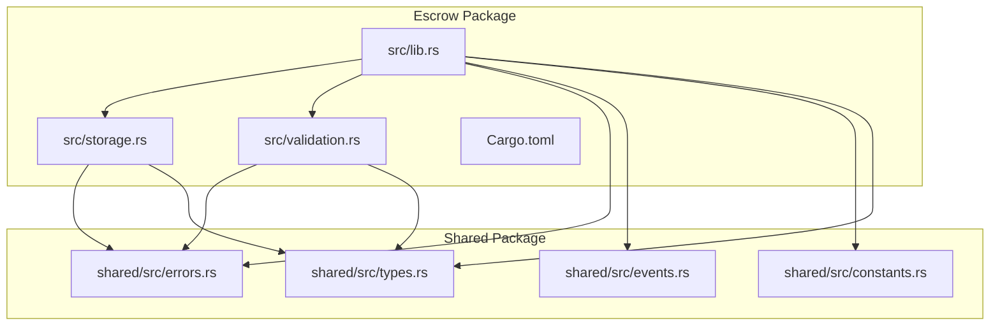
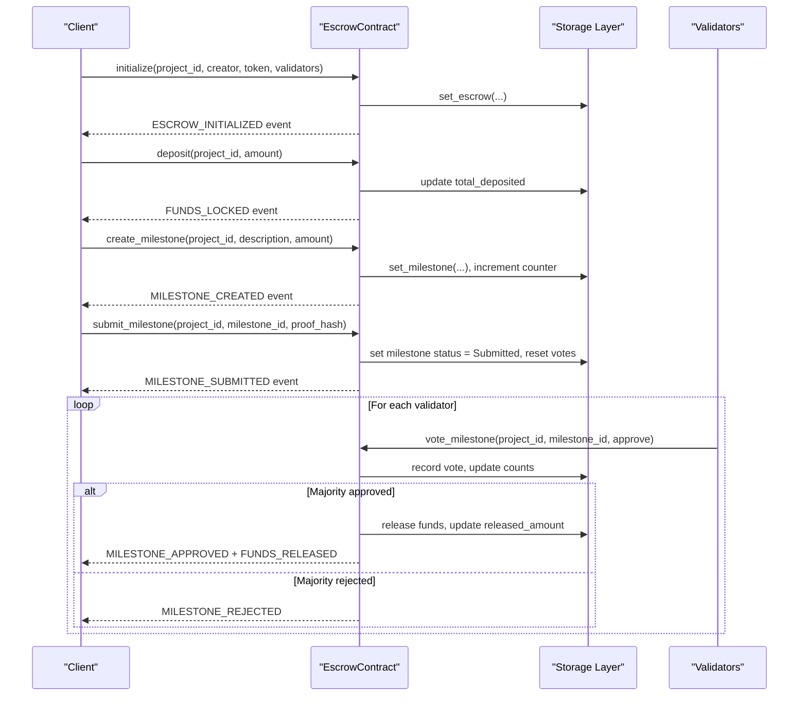
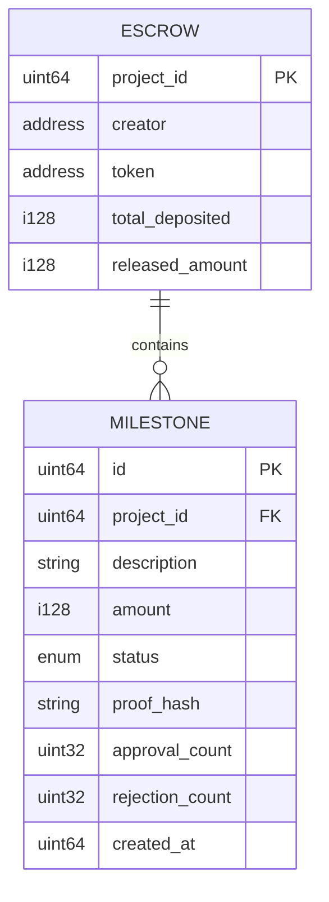
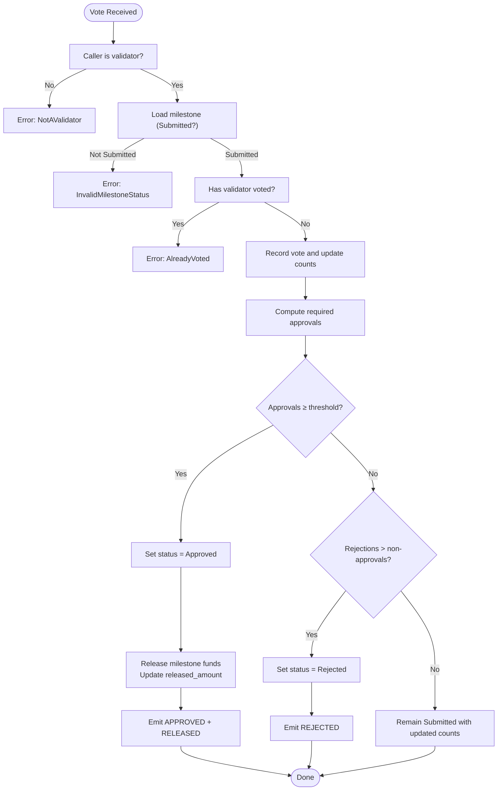
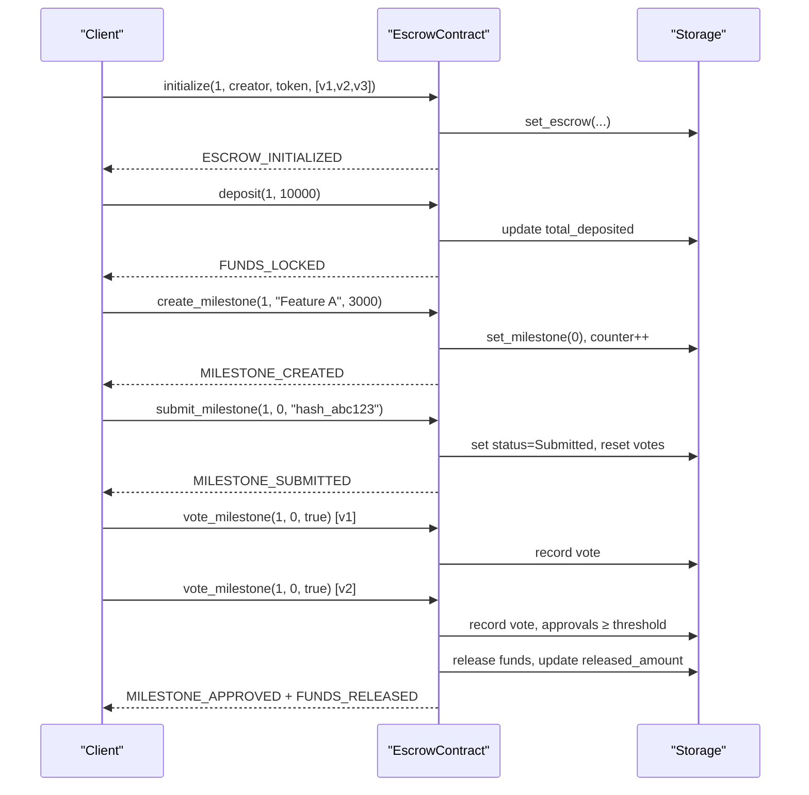
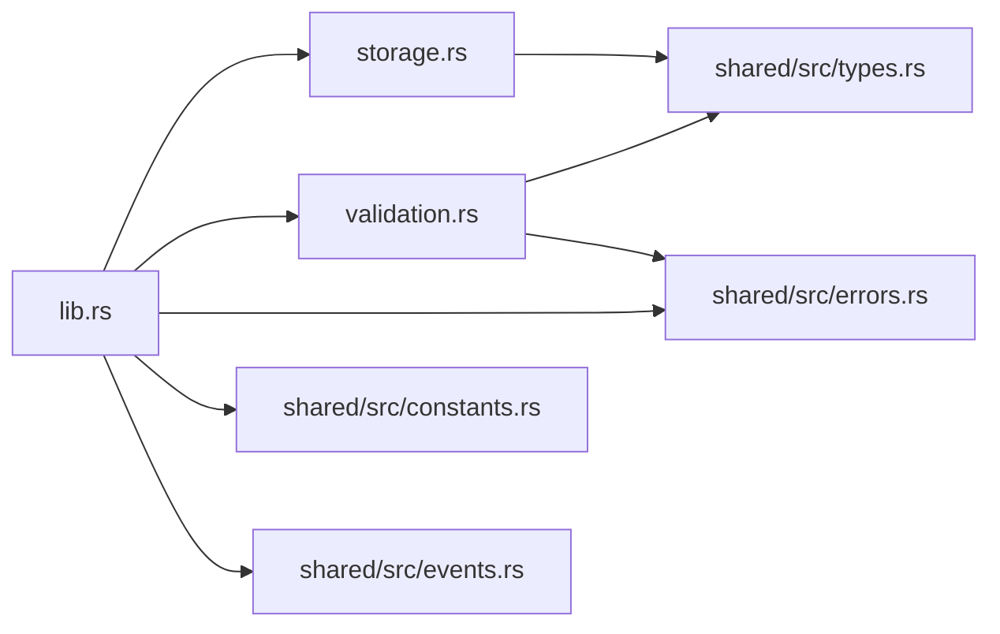

# Escrow API

<cite>
**Referenced Files in This Document**
- [lib.rs](file://contracts/escrow/src/lib.rs)
- [storage.rs](file://contracts/escrow/src/storage.rs)
- [validation.rs](file://contracts/escrow/src/validation.rs)
- [IMPLEMENTATION.md](file://contracts/escrow/IMPLEMENTATION.md)
- [Cargo.toml](file://contracts/escrow/Cargo.toml)
- [errors.rs](file://contracts/shared/src/errors.rs)
- [events.rs](file://contracts/shared/src/events.rs)
- [constants.rs](file://contracts/shared/src/constants.rs)
- [types.rs](file://contracts/shared/src/types.rs)
</cite>

## Table of Contents
1. [Introduction](#introduction)
2. [Project Structure](#project-structure)
3. [Core Components](#core-components)
4. [Architecture Overview](#architecture-overview)
5. [Detailed Component Analysis](#detailed-component-analysis)
6. [Dependency Analysis](#dependency-analysis)
7. [Performance Considerations](#performance-considerations)
8. [Troubleshooting Guide](#troubleshooting-guide)
9. [Conclusion](#conclusion)
10. [Appendices](#appendices)

## Introduction
This document provides comprehensive API documentation for the Escrow contract, focusing on fund management and milestone verification. It explains how the contract locks funds, tracks milestones, approves or rejects deliverables, and releases funds accordingly. It also documents storage patterns, validation logic, multi-signature approval thresholds, and error handling.

The Escrow contract operates on-chain and uses a majority voting model among whitelisted validators to decide whether to release milestone funds. It prevents double spending by ensuring released amounts never exceed total deposits and enforces strict state transitions for milestones.

## Project Structure
The Escrow contract is implemented as a standalone package with clear separation of concerns:
- Contract entry point and public API
- Storage helpers for persistent data
- Validation utilities
- Shared types, constants, errors, and events used across the platform

**Diagram sources**
- [lib.rs](file://contracts/escrow/src/lib.rs#L1-L20)
- [storage.rs](file://contracts/escrow/src/storage.rs#L1-L10)
- [validation.rs](file://contracts/escrow/src/validation.rs#L1-L12)
- [Cargo.toml](file://contracts/escrow/Cargo.toml#L1-L16)
- [errors.rs](file://contracts/shared/src/errors.rs#L1-L54)
- [events.rs](file://contracts/shared/src/events.rs#L1-L31)
- [constants.rs](file://contracts/shared/src/constants.rs#L1-L40)
- [types.rs](file://contracts/shared/src/types.rs#L1-L41)

**Section sources**
- [Cargo.toml](file://contracts/escrow/Cargo.toml#L1-L16)

## Core Components
- Public contract interface: initialization, deposits, milestone lifecycle, queries, and balance calculations.
- Storage layer: composite keys for escrows, milestones, counters, and validator votes.
- Validation utilities: validator checks and threshold computations.
- Shared domain: types, constants, errors, and events.

Key capabilities:
- Lock funds into an escrow for a project.
- Create milestones with associated amounts.
- Submit milestones with proof hashes.
- Validator voting with majority thresholds.
- Automated fund release upon approval.
- Query APIs for escrow and milestone details.
- Safe arithmetic and robust error handling.

**Section sources**
- [lib.rs](file://contracts/escrow/src/lib.rs#L22-L346)
- [storage.rs](file://contracts/escrow/src/storage.rs#L11-L142)
- [validation.rs](file://contracts/escrow/src/validation.rs#L5-L12)
- [IMPLEMENTATION.md](file://contracts/escrow/IMPLEMENTATION.md#L80-L303)

## Architecture Overview
The contract follows a state-machine approach for milestones and a validator-driven approval workflow. Persistent storage uses composite keys to avoid collisions and enable efficient retrieval.

**Diagram sources**
- [lib.rs](file://contracts/escrow/src/lib.rs#L31-L346)
- [storage.rs](file://contracts/escrow/src/storage.rs#L11-L107)

## Detailed Component Analysis

### Public API Surface
The contract exposes the following public functions. Each function includes parameter descriptions, validation rules, and emitted events.

- initialize
  - Purpose: Create an escrow for a project with a creator, token, and validators.
  - Parameters:
    - project_id: Unique project identifier.
    - creator: Address requiring authentication.
    - token: Token address for accounting.
    - validators: List of validator addresses (minimum 3).
  - Validation:
    - Creator authorization required.
    - Validators length must meet minimum threshold.
    - Escrow must not already exist.
  - Events: ESCROW_INITIALIZED.

- deposit
  - Purpose: Add funds to the escrow (accounting only; token transfer handled externally).
  - Parameters:
    - project_id: Project identifier.
    - amount: Positive amount to lock.
  - Validation:
    - Escrow must exist.
    - Amount must be greater than zero.
  - Events: FUNDS_LOCKED.

- create_milestone
  - Purpose: Create a milestone with a description and requested amount.
  - Parameters:
    - project_id: Project identifier.
    - description: Human-readable milestone description.
    - amount: Amount requested for release if approved.
  - Validation:
    - Creator authorization required.
    - Amount must be greater than zero.
    - Sum of all milestone amounts must not exceed total_deposited.
  - Side effects:
    - Increments milestone counter.
    - Stores milestone with Pending status.
  - Events: MILESTONE_CREATED.

- submit_milestone
  - Purpose: Submit a milestone with a proof hash for validator review.
  - Parameters:
    - project_id: Project identifier.
    - milestone_id: Milestone identifier.
    - proof_hash: Hash of the milestone proof.
  - Validation:
    - Creator authorization required.
    - Milestone must exist and be in Pending status.
  - Side effects:
    - Sets status to Submitted.
    - Resets approval/rejection counts.
    - Clears prior validator votes.
  - Events: MILESTONE_SUBMITTED.

- vote_milestone
  - Purpose: Cast a validator’s vote (approve or reject) on a submitted milestone.
  - Parameters:
    - project_id: Project identifier.
    - milestone_id: Milestone identifier.
    - approve: Boolean indicating approval.
  - Validation:
    - Caller must be a validator and authorize the transaction.
    - Milestone must be in Submitted status.
    - One validator may vote only once per milestone.
  - Decision logic:
    - Required approvals = ceil(validators.length × threshold / 10000).
    - If approvals reach threshold: status Approved, release funds, emit MILESTONE_APPROVED and FUNDS_RELEASED.
    - If rejections exceed non-approvals: status Rejected.
    - Otherwise: remain Submitted with updated counts.
  - Events: MILESTONE_APPROVED, FUNDS_RELEASED, or MILESTONE_REJECTED.

- get_escrow
  - Purpose: Retrieve escrow details.
  - Parameters:
    - project_id: Project identifier.
  - Returns: EscrowInfo or NotFound.

- get_milestone
  - Purpose: Retrieve milestone details.
  - Parameters:
    - project_id: Project identifier.
    - milestone_id: Milestone identifier.
  - Returns: Milestone or NotFound.

- get_total_milestone_amount
  - Purpose: Compute total amount allocated to milestones.
  - Parameters:
    - project_id: Project identifier.
  - Returns: Sum of milestone amounts.

- get_available_balance
  - Purpose: Compute remaining available balance in the escrow.
  - Parameters:
    - project_id: Project identifier.
  - Returns: total_deposited - released_amount.

**Section sources**
- [lib.rs](file://contracts/escrow/src/lib.rs#L31-L346)
- [IMPLEMENTATION.md](file://contracts/escrow/IMPLEMENTATION.md#L80-L303)

### Storage Patterns
The contract uses composite storage keys to prevent collisions and enable efficient lookups:

- Escrow storage
  - Key: ("escrow", project_id)
  - Value: EscrowInfo
  - Operations: set_escrow, get_escrow, escrow_exists

- Milestone storage
  - Key: ("milestone", project_id, milestone_id)
  - Value: Milestone
  - Operations: set_milestone, get_milestone

- Milestone counter
  - Key: ("m_counter", project_id)
  - Value: u64 (next milestone ID)
  - Operations: set_milestone_counter, get_milestone_counter

- Validator vote tracking
  - Key: ("v_vote", project_id, milestone_id, validator)
  - Value: boolean marker
  - Operations: set_validator_vote, has_validator_voted, clear_milestone_voters

- Total milestone amount calculation
  - Iterates milestones up to counter and sums amounts.

**Diagram sources**
- [storage.rs](file://contracts/escrow/src/storage.rs#L5-L142)
- [IMPLEMENTATION.md](file://contracts/escrow/IMPLEMENTATION.md#L17-L78)

**Section sources**
- [storage.rs](file://contracts/escrow/src/storage.rs#L5-L142)

### Validation Logic and Multi-Signature Requirements
- Validator whitelist: Only addresses present in the validators list can vote.
- Threshold: Approval requires at least ceil(validators.length × threshold / 10000), where threshold is 6000 basis points (60%).
- Double-vote protection: Each validator may vote only once per milestone; prior votes are cleared on resubmission.
- State transitions: Milestones progress through Pending → Submitted → Approved/Rejected.
- Safety invariants:
  - Sum of milestone amounts ≤ total_deposited.
  - released_amount is monotonic and never exceeds total_deposited.
  - One vote per validator per milestone.

**Diagram sources**
- [lib.rs](file://contracts/escrow/src/lib.rs#L220-L307)
- [validation.rs](file://contracts/escrow/src/validation.rs#L5-L12)
- [constants.rs](file://contracts/shared/src/constants.rs#L24-L28)

**Section sources**
- [lib.rs](file://contracts/escrow/src/lib.rs#L220-L307)
- [validation.rs](file://contracts/escrow/src/validation.rs#L5-L12)
- [constants.rs](file://contracts/shared/src/constants.rs#L24-L28)

### Dispute Resolution Mechanisms
- Current implementation does not define explicit dispute resolution hooks.
- Future enhancements (as noted in the implementation guide) include appeal/dispute resolution mechanisms, which could be integrated by extending the milestone status model and adding governance-backed override paths.

**Section sources**
- [IMPLEMENTATION.md](file://contracts/escrow/IMPLEMENTATION.md#L412-L419)

### Complete Funding Cycle Example
Below is an end-to-end example of a funding cycle from initialization to final payout:

1. initialize(project_1, creator, xlm_token, [validator1, validator2, validator3])
   - Escrow created with 3 validators.

2. deposit(project_1, 10000)
   - total_deposited = 10000.

3. create_milestone(project_1, "Feature A", 3000)
   - Milestone 0 created with 3000 XLM, status = Pending.

4. submit_milestone(project_1, 0, "hash_abc123")
   - Milestone 0 status = Submitted.

5. vote_milestone(project_1, 0, true) [validator1]
   - approval_count = 1.

6. vote_milestone(project_1, 0, true) [validator2]
   - approval_count = 2, status = Approved, released_amount = 3000.
   - Emits MILESTONE_APPROVED and FUNDS_RELEASED.

7. get_available_balance(project_1)
   - Returns 7000 (10000 - 3000).

**Diagram sources**
- [lib.rs](file://contracts/escrow/src/lib.rs#L31-L346)
- [storage.rs](file://contracts/escrow/src/storage.rs#L11-L107)

**Section sources**
- [IMPLEMENTATION.md](file://contracts/escrow/IMPLEMENTATION.md#L360-L384)

## Dependency Analysis
The contract depends on shared modules for types, constants, errors, and events. The storage layer encapsulates persistence operations and composite key management.

**Diagram sources**
- [lib.rs](file://contracts/escrow/src/lib.rs#L1-L20)
- [storage.rs](file://contracts/escrow/src/storage.rs#L1-L10)
- [validation.rs](file://contracts/escrow/src/validation.rs#L1-L12)
- [errors.rs](file://contracts/shared/src/errors.rs#L1-L54)
- [constants.rs](file://contracts/shared/src/constants.rs#L1-L40)
- [events.rs](file://contracts/shared/src/events.rs#L1-L31)
- [types.rs](file://contracts/shared/src/types.rs#L1-L41)

**Section sources**
- [Cargo.toml](file://contracts/escrow/Cargo.toml#L7-L16)

## Performance Considerations
- Storage reads/writes are O(1) for escrow and milestone lookups via composite keys.
- get_total_milestone_amount iterates up to the current milestone counter; keep the number of milestones reasonable to maintain efficiency.
- Vote recording uses a simple presence flag per validator, minimizing storage overhead.
- Safe arithmetic with checked operations prevents overflow and ensures deterministic behavior.

[No sources needed since this section provides general guidance]

## Troubleshooting Guide
Common errors and their causes:
- NotInitialized: Attempting operations on a non-existent escrow.
- AlreadyInitialized: Duplicate initialization for the same project.
- Unauthorized: Missing or incorrect authorization by the creator.
- InvalidInput: Non-positive amounts, invalid parameters, or arithmetic overflow.
- NotFound: Requesting a milestone that does not exist.
- InvalidMilestoneStatus: Transitioning a milestone outside the allowed state machine.
- NotAValidator: Non-whitelisted address attempting to vote.
- AlreadyVoted: Validator attempting to vote twice on the same milestone.
- InsufficientEscrowBalance: Over-allocation of milestones or double-release attempts.

Operational tips:
- Ensure validators list meets the minimum requirement before initialization.
- Verify that milestone amounts sum to no more than total_deposited.
- Confirm that released_amount never decreases and does not exceed total_deposited.
- Use get_available_balance to track remaining funds after releases.

**Section sources**
- [errors.rs](file://contracts/shared/src/errors.rs#L21-L26)
- [lib.rs](file://contracts/escrow/src/lib.rs#L40-L48)
- [lib.rs](file://contracts/escrow/src/lib.rs#L121-L134)
- [lib.rs](file://contracts/escrow/src/lib.rs#L348-L366)

## Conclusion
The Escrow contract provides a secure, on-chain mechanism for milestone-based fund management. Its validator-driven approval process, strict state transitions, and safe accounting ensure predictable fund releases while preventing over-allocation and double-spending. The documented API, storage patterns, and validation logic offer a clear blueprint for integrating the contract into broader project financing workflows.

[No sources needed since this section summarizes without analyzing specific files]

## Appendices

### API Reference Summary
- initialize(project_id, creator, token, validators)
- deposit(project_id, amount)
- create_milestone(project_id, description, amount)
- submit_milestone(project_id, milestone_id, proof_hash)
- vote_milestone(project_id, milestone_id, approve)
- get_escrow(project_id)
- get_milestone(project_id, milestone_id)
- get_total_milestone_amount(project_id)
- get_available_balance(project_id)

**Section sources**
- [lib.rs](file://contracts/escrow/src/lib.rs#L31-L346)
- [IMPLEMENTATION.md](file://contracts/escrow/IMPLEMENTATION.md#L80-L303)