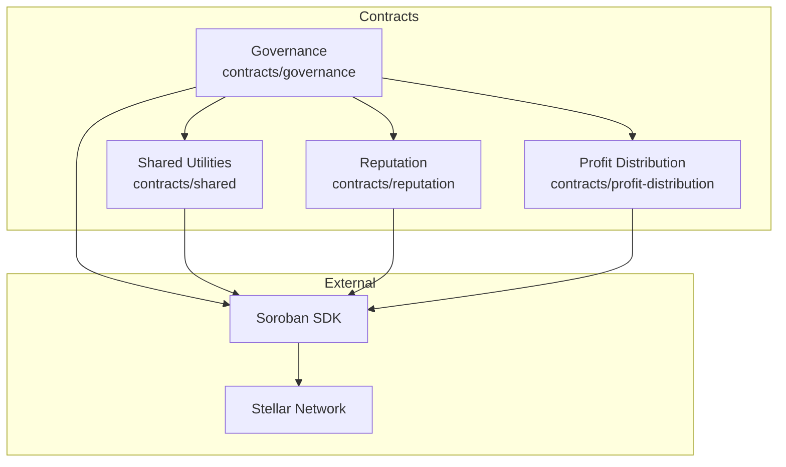
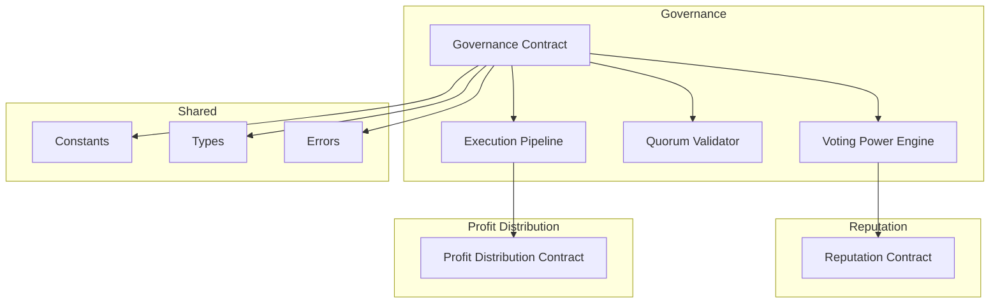
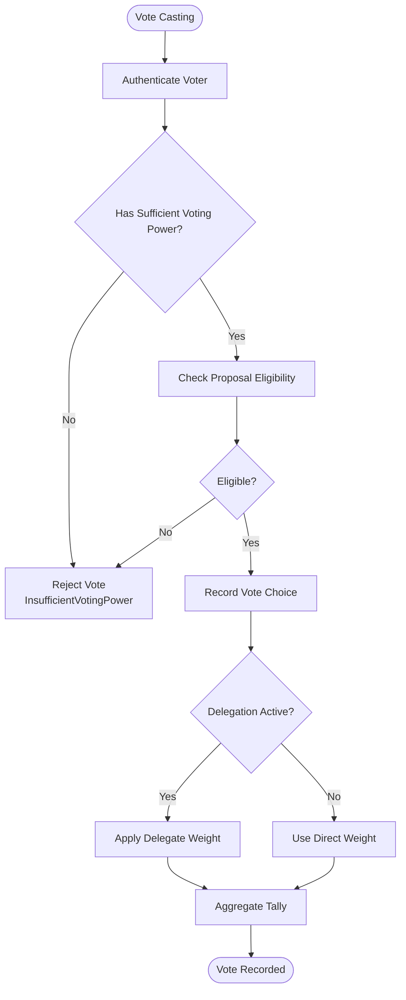
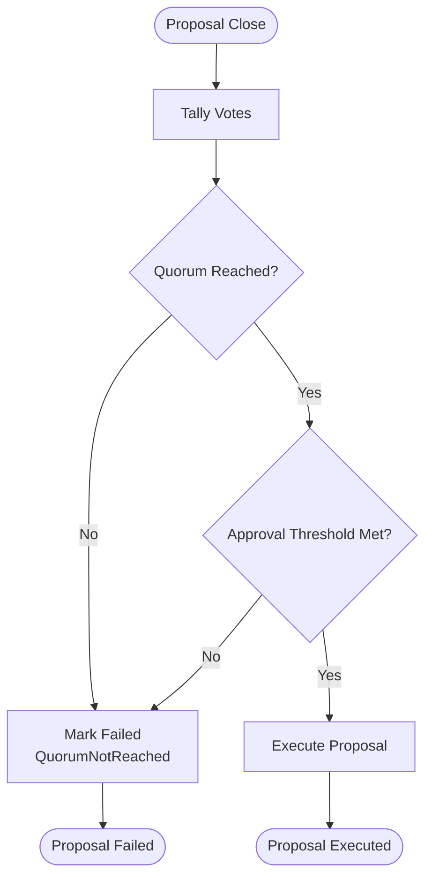
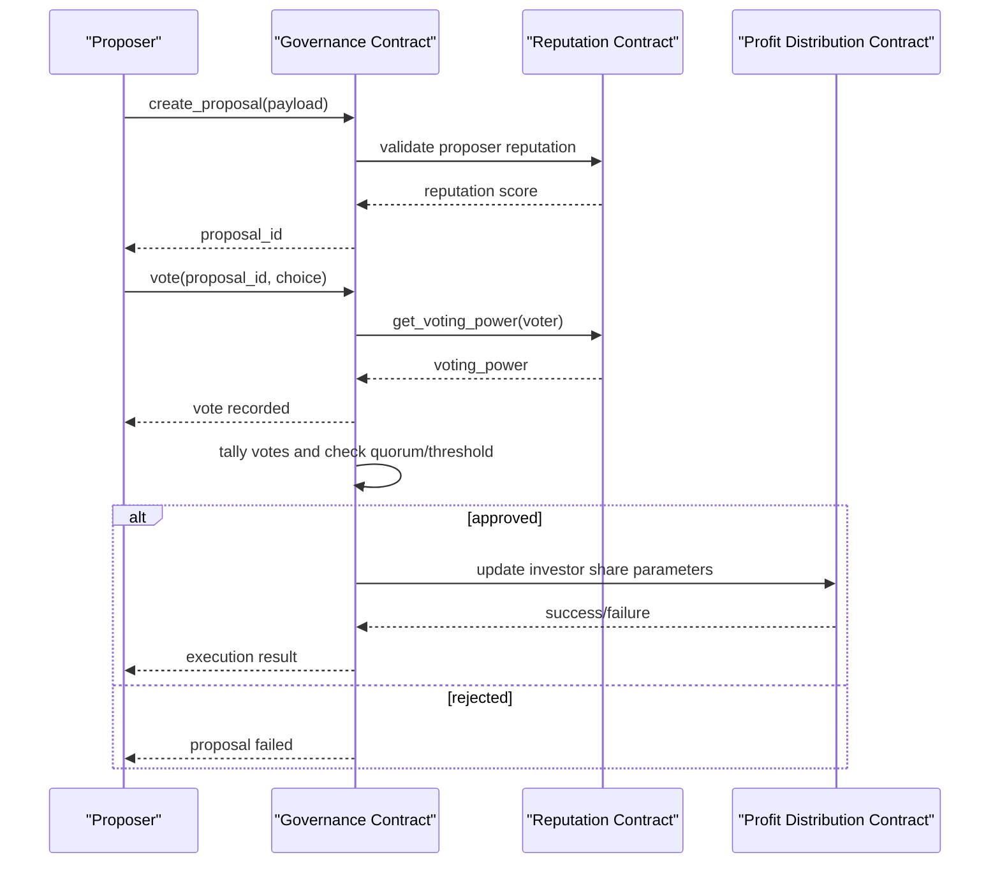
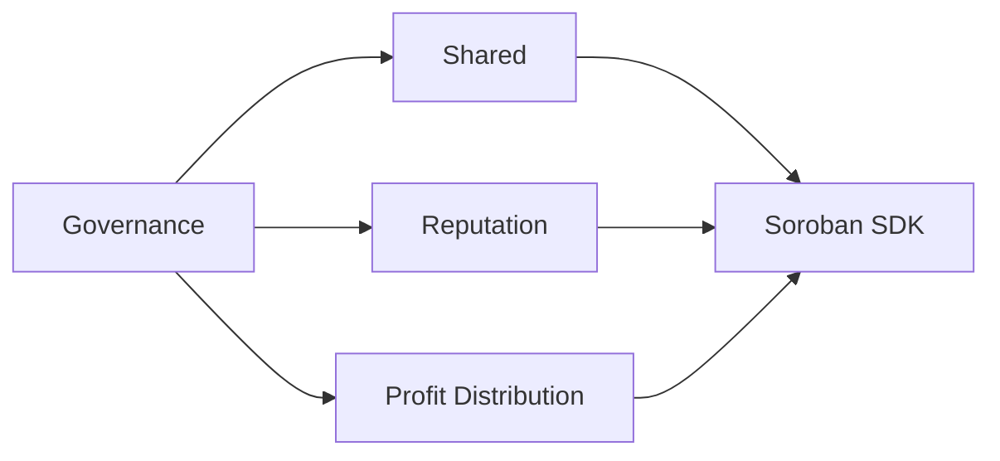

# Governance API

<cite>
**Referenced Files in This Document**
- [README.md](file://README.md)
- [contracts/README.md](file://contracts/README.md)
- [governance/src/lib.rs](file://contracts/governance/src/lib.rs)
- [governance/Cargo.toml](file://contracts/governance/Cargo.toml)
- [shared/src/lib.rs](file://contracts/shared/src/lib.rs)
- [shared/src/types.rs](file://contracts/shared/src/types.rs)
- [shared/src/constants.rs](file://contracts/shared/src/constants.rs)
- [shared/src/errors.rs](file://contracts/shared/src/errors.rs)
- [reputation/src/lib.rs](file://contracts/reputation/src/lib.rs)
- [profit-distribution/src/lib.rs](file://contracts/profit-distribution/src/lib.rs)
- [profit-distribution/src/types.rs](file://contracts/profit-distribution/src/types.rs)
- [profit-distribution/src/storage.rs](file://contracts/profit-distribution/src/storage.rs)
</cite>

## Table of Contents
1. [Introduction](#introduction)
2. [Project Structure](#project-structure)
3. [Core Components](#core-components)
4. [Architecture Overview](#architecture-overview)
5. [Detailed Component Analysis](#detailed-component-analysis)
6. [Dependency Analysis](#dependency-analysis)
7. [Performance Considerations](#performance-considerations)
8. [Troubleshooting Guide](#troubleshooting-guide)
9. [Conclusion](#conclusion)

## Introduction
This document provides comprehensive API documentation for the Governance contract that manages platform decision-making mechanisms on the NovaFund platform. It explains how proposals are created, votes are cast and aggregated, quorum thresholds are validated, and approved decisions are executed. It also covers parameter updates, validation logic for proposal eligibility, voter authentication, and execution permissions. Error handling for proposal failures, voting manipulation attempts, and constitutional amendments is addressed.

The Governance contract is part of a broader ecosystem that includes Project Launch, Escrow, Profit Distribution, Subscription Pool, Multi-Party Payment, Reputation, and shared utilities. Together, these contracts enable community-driven platform modifications and policy changes through a transparent, on-chain voting process.

## Project Structure
The Governance contract resides in the contracts/governance directory and depends on shared utilities for types, constants, and error definitions. The shared library centralizes common data structures and platform-wide constants used across contracts.

**Diagram sources**
- [governance/src/lib.rs](file://contracts/governance/src/lib.rs#L1-L9)
- [shared/src/lib.rs](file://contracts/shared/src/lib.rs#L1-L20)
- [reputation/src/lib.rs](file://contracts/reputation/src/lib.rs#L1-L510)
- [profit-distribution/src/lib.rs](file://contracts/profit-distribution/src/lib.rs#L1-L78)

**Section sources**
- [README.md](file://README.md#L101-L136)
- [contracts/README.md](file://contracts/README.md#L263-L280)
- [governance/Cargo.toml](file://contracts/governance/Cargo.toml#L1-L16)

## Core Components
The Governance contract orchestrates the entire governance lifecycle:
- Proposal creation and lifecycle management
- Voting with delegation and weighted voting power
- Quorum validation and threshold checks
- Proposal execution and state transitions
- Parameter updates and constitutional amendment procedures

Key elements:
- Voting power derived from reputation and token holdings
- Delegation of votes to trusted addresses
- Time-bound voting periods with automatic closure
- Threshold-based approval and quorum requirements
- Execution queue for approved proposals

**Section sources**
- [contracts/README.md](file://contracts/README.md#L263-L280)
- [shared/src/constants.rs](file://contracts/shared/src/constants.rs#L35-L40)
- [shared/src/errors.rs](file://contracts/shared/src/errors.rs#L48-L54)

## Architecture Overview
The Governance contract integrates with the Reputation contract to derive voting power and with the Profit Distribution contract to implement financial parameter changes. Shared constants define quorum and threshold values, while shared types and errors unify data structures and error semantics across contracts.

**Diagram sources**
- [governance/src/lib.rs](file://contracts/governance/src/lib.rs#L1-L9)
- [reputation/src/lib.rs](file://contracts/reputation/src/lib.rs#L1-L510)
- [profit-distribution/src/lib.rs](file://contracts/profit-distribution/src/lib.rs#L1-L78)
- [shared/src/constants.rs](file://contracts/shared/src/constants.rs#L35-L40)
- [shared/src/types.rs](file://contracts/shared/src/types.rs#L1-L41)
- [shared/src/errors.rs](file://contracts/shared/src/errors.rs#L48-L54)

## Detailed Component Analysis

### Governance API Surface
The Governance contract exposes the following primary functions for platform decision-making:

- create_proposal
  - Purpose: Submit a new governance proposal
  - Inputs: proposer address, title, description, execution payload
  - Outputs: proposal identifier
  - Notes: Validates proposer eligibility and proposal metadata

- delegate_votes
  - Purpose: Delegate voting power to another address
  - Inputs: delegator address, delegatee address
  - Outputs: confirmation
  - Notes: Supports revocable delegation; prevents double delegation

- vote
  - Purpose: Cast a vote on an active proposal
  - Inputs: voter address, proposal identifier, choice (for/against)
  - Outputs: confirmation
  - Notes: Requires sufficient voting power; enforces single-vote per address per proposal

- execute_proposal
  - Purpose: Execute an approved proposal
  - Inputs: proposal identifier
  - Outputs: execution result
  - Notes: Validates quorum and threshold; executes associated contract calls

- get_voting_power
  - Purpose: Query effective voting power for an address
  - Inputs: address
  - Outputs: voting power amount
  - Notes: Includes delegated and direct representation

- get_proposal_details
  - Purpose: Retrieve proposal metadata and current state
  - Inputs: proposal identifier
  - Outputs: title, description, status, vote tallies, timestamps

- get_active_proposals
  - Purpose: List currently open proposals
  - Inputs: none
  - Outputs: array of proposal identifiers

- get_vote_record
  - Purpose: Fetch a voter’s cast vote on a specific proposal
  - Inputs: voter address, proposal identifier
  - Outputs: vote choice and timestamp

- update_governance_parameters
  - Purpose: Modify governance thresholds and durations
  - Inputs: parameter key, new value
  - Outputs: confirmation
  - Notes: Requires constitutional amendment procedure

- cancel_proposal
  - Purpose: Cancel a proposal before voting closes
  - Inputs: canceller address, proposal identifier
  - Outputs: confirmation
  - Notes: Enforces permission checks and proposal status

Validation and permission logic:
- Voter authentication: require_auth on caller addresses
- Proposal eligibility: metadata validation, proposer reputation/token checks
- Execution permissions: only approved proposals can be executed
- Constitutional amendments: special majority thresholds apply

Error handling:
- ProposalNotActive, InsufficientVotingPower, ProposalAlreadyExecuted, QuorumNotReached

**Section sources**
- [contracts/README.md](file://contracts/README.md#L263-L280)
- [shared/src/errors.rs](file://contracts/shared/src/errors.rs#L48-L54)

### Voting Power and Delegation Model
Voting power is computed from:
- Direct reputation score from the Reputation contract
- Token holdings (if applicable)
- Delegated votes from other addresses

Delegation supports:
- Single delegation per delegator
- Revocation of delegation
- Cascading delegation (if implemented) to prevent abuse

**Diagram sources**
- [reputation/src/lib.rs](file://contracts/reputation/src/lib.rs#L41-L51)
- [shared/src/errors.rs](file://contracts/shared/src/errors.rs#L50-L50)

**Section sources**
- [reputation/src/lib.rs](file://contracts/reputation/src/lib.rs#L41-L51)
- [shared/src/errors.rs](file://contracts/shared/src/errors.rs#L50-L50)

### Quorum and Threshold Validation
Quorum and approval thresholds are enforced before proposal execution:
- Quorum: minimum number of participating votes required
- Approval threshold: minimum percentage of yes votes among participating votes
- Voting period: fixed duration with automatic closure

**Diagram sources**
- [shared/src/constants.rs](file://contracts/shared/src/constants.rs#L35-L40)
- [shared/src/errors.rs](file://contracts/shared/src/errors.rs#L52-L52)

**Section sources**
- [shared/src/constants.rs](file://contracts/shared/src/constants.rs#L35-L40)
- [shared/src/errors.rs](file://contracts/shared/src/errors.rs#L52-L52)

### Proposal Execution Pipeline
Approved proposals trigger contract-specific execution logic. Financial parameter changes integrate with the Profit Distribution contract to adjust investor share distributions.

**Diagram sources**
- [governance/src/lib.rs](file://contracts/governance/src/lib.rs#L1-L9)
- [reputation/src/lib.rs](file://contracts/reputation/src/lib.rs#L1-L510)
- [profit-distribution/src/lib.rs](file://contracts/profit-distribution/src/lib.rs#L1-L78)

**Section sources**
- [profit-distribution/src/lib.rs](file://contracts/profit-distribution/src/lib.rs#L35-L78)
- [profit-distribution/src/types.rs](file://contracts/profit-distribution/src/types.rs#L1-L18)
- [profit-distribution/src/storage.rs](file://contracts/profit-distribution/src/storage.rs#L1-L33)

### Governance Constants and Types
Shared constants define governance parameters such as quorum and voting period. Shared types unify data structures across contracts.

- Quorum: 20%
- Voting period: 7 days
- Approval threshold: 60% of participating votes
- Minimum validators: 3

Common types include addresses, timestamps, amounts, and basis points.

**Section sources**
- [shared/src/constants.rs](file://contracts/shared/src/constants.rs#L24-L40)
- [shared/src/types.rs](file://contracts/shared/src/types.rs#L1-L41)

## Dependency Analysis
The Governance contract depends on:
- Shared library for types, constants, and errors
- Reputation contract for voting power derivation
- Profit Distribution contract for financial parameter updates

**Diagram sources**
- [governance/Cargo.toml](file://contracts/governance/Cargo.toml#L7-L10)
- [shared/src/lib.rs](file://contracts/shared/src/lib.rs#L1-L20)
- [reputation/src/lib.rs](file://contracts/reputation/src/lib.rs#L1-L510)
- [profit-distribution/src/lib.rs](file://contracts/profit-distribution/src/lib.rs#L1-L78)

**Section sources**
- [governance/Cargo.toml](file://contracts/governance/Cargo.toml#L7-L10)
- [shared/src/lib.rs](file://contracts/shared/src/lib.rs#L1-L20)

## Performance Considerations
- Minimize storage reads/writes during voting by batching state queries
- Use efficient data structures for vote tallies and delegation mappings
- Cache voting power calculations where safe and necessary
- Optimize WASM bytecode and leverage Soroban SDK features for gas efficiency

## Troubleshooting Guide
Common issues and resolutions:
- ProposalNotActive: Ensure the proposal is within the voting period and not cancelled
- InsufficientVotingPower: Verify the voter’s reputation and delegation status
- ProposalAlreadyExecuted: Confirm the proposal has not already been executed
- QuorumNotReached: Increase participation or adjust quorum thresholds via constitutional amendment

Error codes:
- ProposalNotActive: 600
- InsufficientVotingPower: 601
- ProposalAlreadyExecuted: 602
- QuorumNotReached: 603

**Section sources**
- [shared/src/errors.rs](file://contracts/shared/src/errors.rs#L48-L54)

## Conclusion
The Governance contract provides a robust framework for community-driven decision-making on the NovaFund platform. By integrating with the Reputation and Profit Distribution contracts and leveraging shared utilities, it ensures transparent, fair, and efficient governance. Proper validation, delegation support, and clear execution pathways enable secure platform evolution guided by its community.