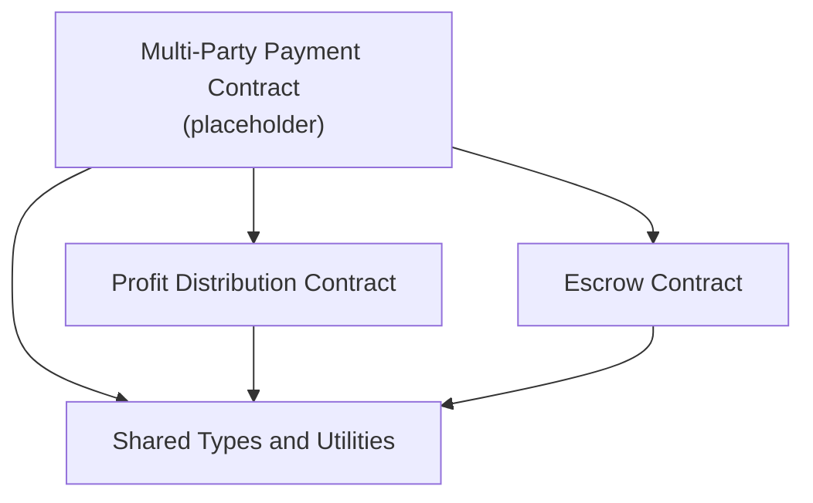
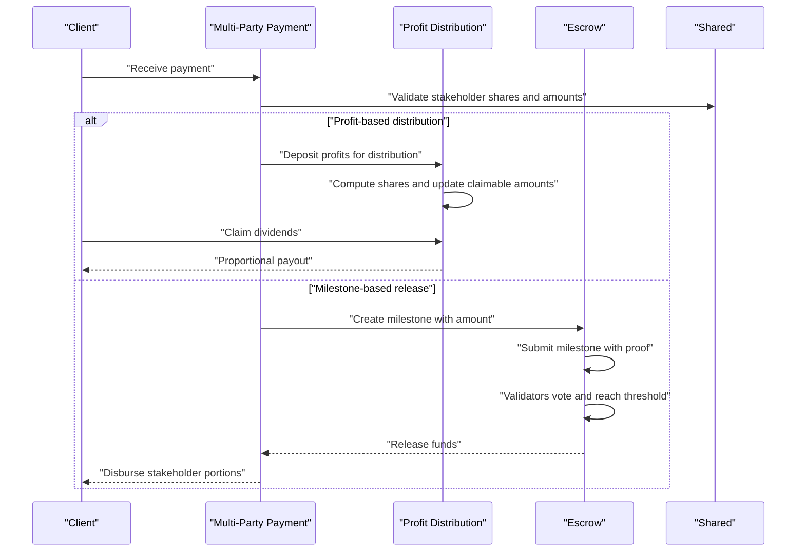
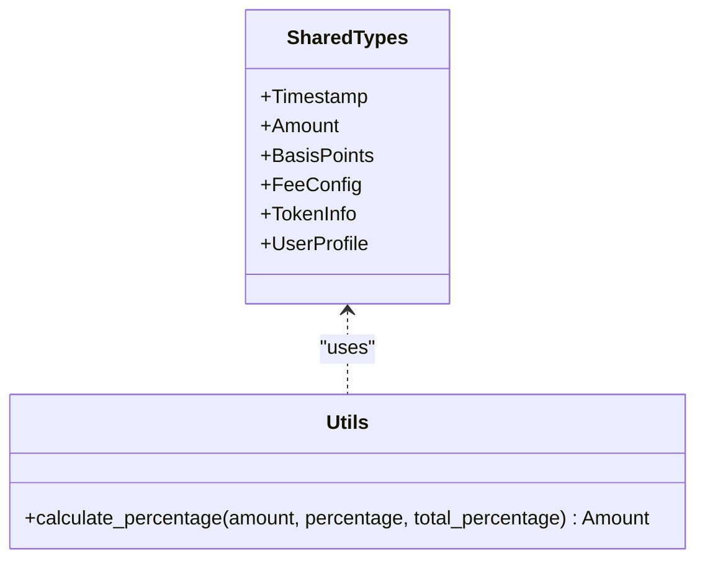
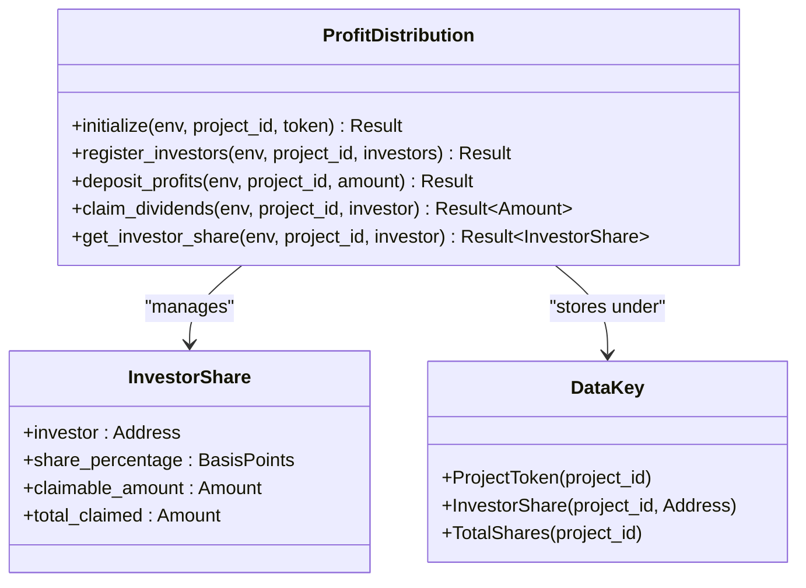
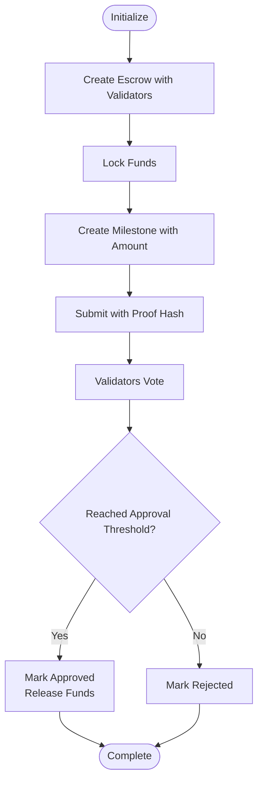
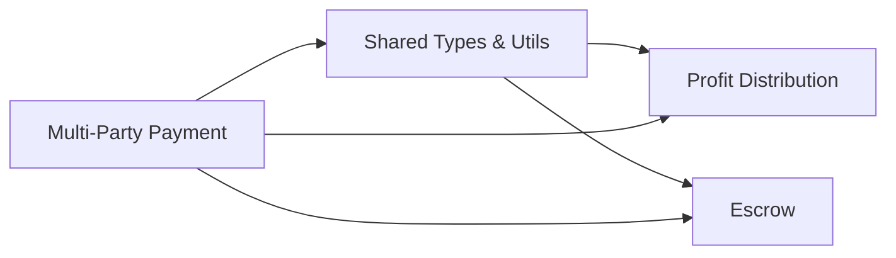

# Multi-Party Payment API

<cite>
**Referenced Files in This Document**
- [lib.rs](file://contracts/multi-party-payment/src/lib.rs)
- [lib.rs](file://contracts/shared/src/lib.rs)
- [types.rs](file://contracts/shared/src/types.rs)
- [constants.rs](file://contracts/shared/src/constants.rs)
- [lib.rs](file://contracts/profit-distribution/src/lib.rs)
- [types.rs](file://contracts/profit-distribution/src/types.rs)
- [storage.rs](file://contracts/profit-distribution/src/storage.rs)
- [events.rs](file://contracts/profit-distribution/src/events.rs)
- [errors.rs](file://contracts/profit-distribution/src/errors.rs)
- [lib.rs](file://contracts/escrow/src/lib.rs)
- [storage.rs](file://contracts/escrow/src/storage.rs)
- [validation.rs](file://contracts/escrow/src/validation.rs)
</cite>

## Table of Contents
1. [Introduction](#introduction)
2. [Project Structure](#project-structure)
3. [Core Components](#core-components)
4. [Architecture Overview](#architecture-overview)
5. [Detailed Component Analysis](#detailed-component-analysis)
6. [Dependency Analysis](#dependency-analysis)
7. [Performance Considerations](#performance-considerations)
8. [Troubleshooting Guide](#troubleshooting-guide)
9. [Conclusion](#conclusion)

## Introduction
This document provides comprehensive API documentation for the Multi-Party Payment contract and related components that enable stakeholder payment splitting, milestone-based disbursement, and optional vesting-like scheduling. It focuses on:
- Payment distribution across multiple stakeholders with share percentages
- Vesting-like schedule management via milestone approvals
- Stakeholder coordination and governance-aligned workflows
- Validation logic for authorization, payment amounts, and schedule compliance
- Error handling for payment failures, disputes, and timing conflicts

Where applicable, this document references the actual implementation files and highlights the intended APIs and data models.

## Project Structure
The Multi-Party Payment functionality is composed of:
- Shared primitives and utilities used across contracts
- Profit Distribution contract for investor/share-based distributions
- Escrow contract for milestone-based releases and governance-aligned approvals
- Multi-Party Payment contract module (placeholder for future implementation)

**Diagram sources**
- [lib.rs](file://contracts/multi-party-payment/src/lib.rs#L1-L9)
- [lib.rs](file://contracts/profit-distribution/src/lib.rs#L1-L78)
- [lib.rs](file://contracts/escrow/src/lib.rs#L1-L367)
- [lib.rs](file://contracts/shared/src/lib.rs#L1-L20)

**Section sources**
- [lib.rs](file://contracts/multi-party-payment/src/lib.rs#L1-L9)
- [lib.rs](file://contracts/shared/src/lib.rs#L1-L20)

## Core Components
- Shared Types and Utilities
  - Timestamp, Amount, BasisPoints
  - FeeConfig, TokenInfo, UserProfile
  - Utility: calculate_percentage for precise share computations
  - Constants: platform fees, funding goals, durations, thresholds

- Profit Distribution Contract
  - Registers investors and their share percentages
  - Accepts deposits for distribution
  - Supports proportional distribution and claiming

- Escrow Contract
  - Initializes escrow with validators
  - Creates milestones with amounts
  - Submits and votes on milestones with governance thresholds
  - Releases funds upon approval

- Multi-Party Payment Contract (placeholder)
  - Intended to orchestrate multi-stakeholder splits and optional vesting-like scheduling

**Section sources**
- [types.rs](file://contracts/shared/src/types.rs#L1-L41)
- [constants.rs](file://contracts/shared/src/constants.rs#L1-L40)
- [lib.rs](file://contracts/shared/src/lib.rs#L16-L20)
- [lib.rs](file://contracts/profit-distribution/src/lib.rs#L31-L78)
- [lib.rs](file://contracts/escrow/src/lib.rs#L19-L346)
- [lib.rs](file://contracts/multi-party-payment/src/lib.rs#L1-L9)

## Architecture Overview
The system integrates three primary flows:
- Profit Distribution: Distributes incoming funds proportionally to registered investors
- Escrow-based Milestone Releases: Governs milestone-based disbursements with validator approvals
- Multi-Party Payment Orchestration: Splits incoming payments among stakeholders and optionally schedules releases

**Diagram sources**
- [lib.rs](file://contracts/multi-party-payment/src/lib.rs#L1-L9)
- [lib.rs](file://contracts/profit-distribution/src/lib.rs#L31-L78)
- [lib.rs](file://contracts/escrow/src/lib.rs#L19-L346)
- [lib.rs](file://contracts/shared/src/lib.rs#L16-L20)

## Detailed Component Analysis

### Shared Types and Utilities
- Types
  - Timestamp, Amount, BasisPoints
  - FeeConfig, TokenInfo, UserProfile
- Utility
  - calculate_percentage: computes share amounts using i128 to avoid precision loss
- Constants
  - Platform fee limits, funding goals, minimum/maximum durations, voting thresholds, quorum, and reputation ranges

**Diagram sources**
- [types.rs](file://contracts/shared/src/types.rs#L1-L41)
- [lib.rs](file://contracts/shared/src/lib.rs#L16-L20)

**Section sources**
- [types.rs](file://contracts/shared/src/types.rs#L1-L41)
- [lib.rs](file://contracts/shared/src/lib.rs#L16-L20)
- [constants.rs](file://contracts/shared/src/constants.rs#L1-L40)

### Profit Distribution Contract
- Purpose: Manage investor shares, accept deposits, compute proportional distributions, and enable claims
- Key Data Model
  - InvestorShare: investor address, share percentage (basis points), claimable amount, total claimed
  - DataKey: project-scoped storage keys for token, investor shares, and total shares
- Core Methods
  - initialize: prepare contract for a project
  - register_investors: register stakeholders with share percentages
  - deposit_profits: record profits for distribution
  - claim_dividends: allow investor to claim their portion
  - get_investor_share: retrieve investor share details
- Events
  - ProfitDeposited: emitted on successful deposit
  - DividendClaimed: emitted on successful claim
- Errors
  - Initialization-related, share validation, insufficient balance, unauthorized, invalid amount

**Diagram sources**
- [lib.rs](file://contracts/profit-distribution/src/lib.rs#L31-L78)
- [types.rs](file://contracts/profit-distribution/src/types.rs#L1-L18)
- [storage.rs](file://contracts/profit-distribution/src/storage.rs#L1-L33)

**Section sources**
- [lib.rs](file://contracts/profit-distribution/src/lib.rs#L31-L78)
- [types.rs](file://contracts/profit-distribution/src/types.rs#L1-L18)
- [storage.rs](file://contracts/profit-distribution/src/storage.rs#L1-L33)
- [events.rs](file://contracts/profit-distribution/src/events.rs#L1-L21)
- [errors.rs](file://contracts/profit-distribution/src/errors.rs#L1-L16)

### Escrow Contract
- Purpose: Govern milestone-based releases with validator approvals and governance thresholds
- Key Data Model
  - EscrowInfo: project_id, creator, token, totals for deposits and releases, validators
  - Milestone: id, project_id, description, amount, status, proof hash, approval/rejection counts, timestamps
- Core Methods
  - initialize: create escrow with validators and token
  - deposit: lock funds into escrow
  - create_milestone: define milestone with amount and description
  - submit_milestone: submit milestone with proof hash
  - vote_milestone: validators approve or reject
  - get_escrow, get_milestone, get_total_milestone_amount, get_available_balance
- Validation and Governance
  - Validator checks, vote counting, threshold computation using MILESTONE_APPROVAL_THRESHOLD
- Events
  - ESCROW_INITIALIZED, FUNDS_LOCKED, MILESTONE_CREATED, MILESTONE_SUBMITTED, MILESTONE_APPROVED, MILESTONE_REJECTED, FUNDS_RELEASED

**Diagram sources**
- [lib.rs](file://contracts/escrow/src/lib.rs#L24-L346)
- [storage.rs](file://contracts/escrow/src/storage.rs#L1-L144)
- [validation.rs](file://contracts/escrow/src/validation.rs#L1-L13)

**Section sources**
- [lib.rs](file://contracts/escrow/src/lib.rs#L24-L346)
- [storage.rs](file://contracts/escrow/src/storage.rs#L1-L144)
- [validation.rs](file://contracts/escrow/src/validation.rs#L1-L13)

### Multi-Party Payment Contract (Placeholder)
- Purpose: To coordinate stakeholder payment splitting and optional vesting-like scheduling
- Intended Responsibilities
  - Receive incoming payments
  - Split amounts according to stakeholder share percentages
  - Optionally schedule disbursements aligned with milestones or vesting periods
  - Trigger disbursements upon milestone approval or schedule completion
  - Resolve disputes and enforce authorization and compliance rules
- Function Signatures (Intended)
  - initialize: set up stakeholders and schedule parameters
  - receive_payment: process incoming funds
  - split_and_schedule: allocate amounts per stakeholder and schedule releases
  - trigger_disbursement: release scheduled amounts
  - resolve_dispute: handle stakeholder disputes and governance decisions
  - get_stakeholder_allocation: retrieve stakeholder share and schedule details
  - validate_authorization: verify caller permissions
  - validate_schedule_compliance: check timing and milestone alignment

Note: The current implementation is a placeholder and requires development to realize the above APIs.

**Section sources**
- [lib.rs](file://contracts/multi-party-payment/src/lib.rs#L1-L9)

## Dependency Analysis
- Shared Dependencies
  - Shared types and utilities are used by Profit Distribution and Escrow contracts
  - Multi-Party Payment contract is intended to depend on both Profit Distribution and Escrow
- Coupling and Cohesion
  - Profit Distribution encapsulates investor share management
  - Escrow encapsulates milestone governance and fund release
  - Multi-Party Payment orchestrates both, leveraging shared types and constants

**Diagram sources**
- [lib.rs](file://contracts/shared/src/lib.rs#L1-L20)
- [lib.rs](file://contracts/profit-distribution/src/lib.rs#L1-L78)
- [lib.rs](file://contracts/escrow/src/lib.rs#L1-L367)
- [lib.rs](file://contracts/multi-party-payment/src/lib.rs#L1-L9)

**Section sources**
- [lib.rs](file://contracts/shared/src/lib.rs#L1-L20)
- [lib.rs](file://contracts/profit-distribution/src/lib.rs#L1-L78)
- [lib.rs](file://contracts/escrow/src/lib.rs#L1-L367)
- [lib.rs](file://contracts/multi-party-payment/src/lib.rs#L1-L9)

## Performance Considerations
- Precision and Overflow
  - Use i128 for monetary amounts and intermediate calculations to prevent overflow and precision loss
- Storage Efficiency
  - Minimize repeated reads/writes by batching operations (e.g., registering multiple investors in one transaction)
- Governance Thresholds
  - Threshold calculations should be efficient; precompute required approvals to reduce runtime overhead
- Event Emission
  - Emit events only after state updates to maintain consistency and enable off-chain indexing

[No sources needed since this section provides general guidance]

## Troubleshooting Guide
- Common Errors and Causes
  - Initialization/Uninitialized: Contract not initialized or missing prerequisites
  - Invalid Share Percentage: Shares do not sum to 100% or invalid values
  - Insufficient Balance: Attempt to distribute more than available
  - Nothing to Claim: No claimable amount for investor
  - Already Claimed: Duplicate claim attempt
  - Unauthorized: Caller lacks permission
  - Invalid Amount: Non-positive or malformed amounts
  - Escrow-specific: Insufficient balance, invalid milestone status, not a validator, already voted
- Recommendations
  - Validate inputs before invoking methods
  - Ensure stakeholders are properly registered and authorized
  - Monitor milestone statuses and validator participation
  - Use events to track state transitions for debugging

**Section sources**
- [errors.rs](file://contracts/profit-distribution/src/errors.rs#L1-L16)
- [lib.rs](file://contracts/escrow/src/lib.rs#L24-L346)

## Conclusion
The Multi-Party Payment system leverages shared primitives, Profit Distribution for proportional payouts, and Escrow for milestone-based releases with governance-aligned approvals. While the Multi-Party Payment contract is currently a placeholder, the documented APIs and data models provide a clear blueprint for implementing stakeholder payment splitting, optional vesting-like scheduling, and robust dispute resolution workflows.