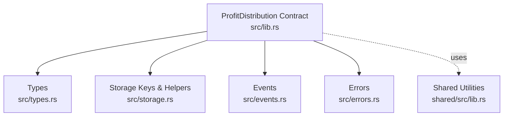
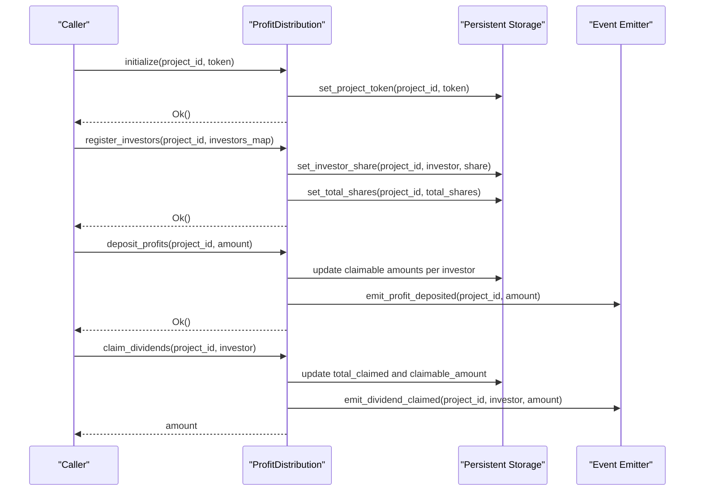
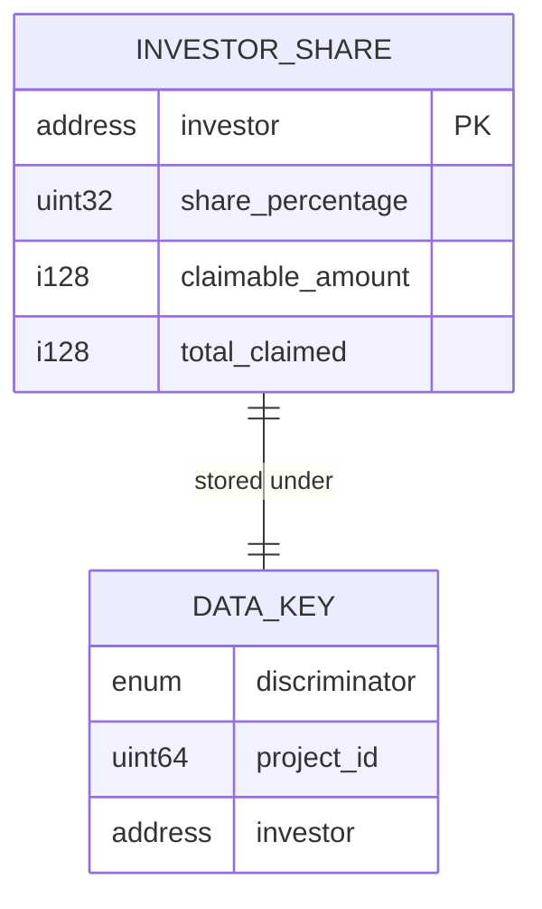
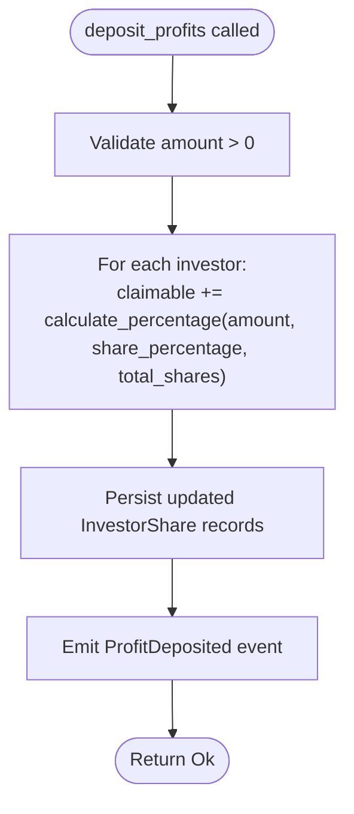
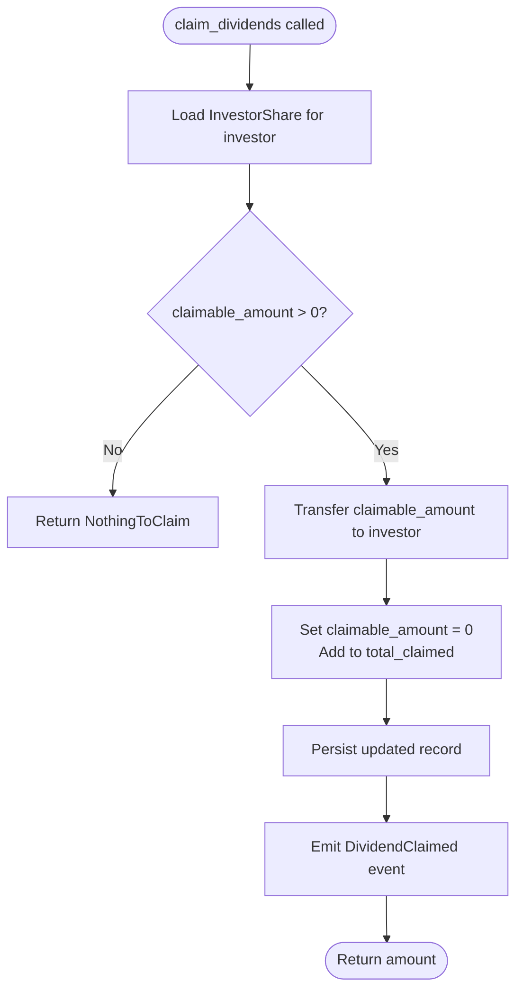
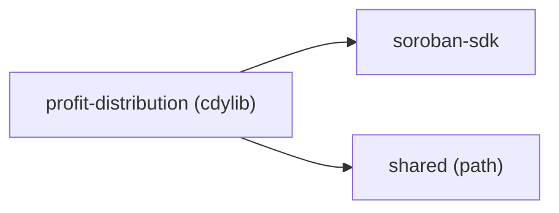

# Profit Distribution API

<cite>
**Referenced Files in This Document**
- [lib.rs](file://contracts/profit-distribution/src/lib.rs)
- [types.rs](file://contracts/profit-distribution/src/types.rs)
- [storage.rs](file://contracts/profit-distribution/src/storage.rs)
- [events.rs](file://contracts/profit-distribution/src/events.rs)
- [errors.rs](file://contracts/profit-distribution/src/errors.rs)
- [Cargo.toml](file://contracts/profit-distribution/Cargo.toml)
- [shared_lib.rs](file://contracts/shared/src/lib.rs)
- [README.md](file://README.md)
</cite>

## Table of Contents
1. [Introduction](#introduction)
2. [Project Structure](#project-structure)
3. [Core Components](#core-components)
4. [Architecture Overview](#architecture-overview)
5. [Detailed Component Analysis](#detailed-component-analysis)
6. [Dependency Analysis](#dependency-analysis)
7. [Performance Considerations](#performance-considerations)
8. [Troubleshooting Guide](#troubleshooting-guide)
9. [Conclusion](#conclusion)

## Introduction
This document provides comprehensive API documentation for the Profit Distribution contract, which automates investor payout systems for project-based funding on the Stellar network via Soroban. The contract manages investor share registration, multi-token support, profit deposits, proportional dividend distribution, and claim settlement with real-time tracking and event notifications.

The contract is designed to integrate with the broader NovaFund ecosystem, enabling trustless, transparent distribution of returns based on contributor shares and realized profits.

## Project Structure
The Profit Distribution module is organized into cohesive source files implementing the contract interface, data types, storage keys, events, and error handling. It also depends on shared utilities for percentage calculations.

**Diagram sources**
- [lib.rs](file://contracts/profit-distribution/src/lib.rs#L1-L78)
- [types.rs](file://contracts/profit-distribution/src/types.rs#L1-L18)
- [storage.rs](file://contracts/profit-distribution/src/storage.rs#L1-L33)
- [events.rs](file://contracts/profit-distribution/src/events.rs#L1-L21)
- [errors.rs](file://contracts/profit-distribution/src/errors.rs#L1-L16)
- [shared_lib.rs](file://contracts/shared/src/lib.rs#L1-L20)

**Section sources**
- [Cargo.toml](file://contracts/profit-distribution/Cargo.toml#L1-L16)
- [README.md](file://README.md#L71-L77)

## Core Components
This section outlines the primary API surface of the Profit Distribution contract, including initialization, investor registration, profit deposit, dividend claiming, and data retrieval.

- Contract name: Profit Distribution Contract
- Module: profit-distribution
- Crate type: cdylib (WASM export)

Key functions exposed by the contract:
- initialize(env, project_id, token): Initializes the distribution contract for a project and registers the supported token.
- register_investors(env, project_id, investors): Registers investors and their share percentages for a project.
- deposit_profits(env, project_id, amount): Deposits realized profits for distribution.
- claim_dividends(env, project_id, investor): Allows an investor to claim their proportional dividends.
- get_investor_share(env, project_id, investor): Retrieves an investor's share record.

Data structures:
- InvestorShare: investor Address, share_percentage (basis points), claimable_amount, total_claimed.
- DataKey: ProjectToken, InvestorShare, TotalShares.

Events:
- ProfitDeposited(project_id, amount)
- DividendClaimed(project_id, investor, amount)

Errors:
- AlreadyInitialized, NotInitialized, InvalidSharePercentage, TotalSharesNot100, InsufficientBalance, NothingToClaim, AlreadyClaimed, Unauthorized, InvalidAmount.

**Section sources**
- [lib.rs](file://contracts/profit-distribution/src/lib.rs#L26-L77)
- [types.rs](file://contracts/profit-distribution/src/types.rs#L3-L18)
- [events.rs](file://contracts/profit-distribution/src/events.rs#L3-L7)
- [errors.rs](file://contracts/profit-distribution/src/errors.rs#L3-L16)

## Architecture Overview
The Profit Distribution contract orchestrates investor payouts through a series of steps: initialization with a project and token, investor registration with share percentages, profit deposit, automatic proportional distribution, and claim settlement with event emission.

**Diagram sources**
- [lib.rs](file://contracts/profit-distribution/src/lib.rs#L37-L77)
- [storage.rs](file://contracts/profit-distribution/src/storage.rs#L8-L33)
- [events.rs](file://contracts/profit-distribution/src/events.rs#L9-L21)

## Detailed Component Analysis

### Data Model
The contract uses a compact, efficient data model optimized for Soroban storage and cross-contract interoperability.

- InvestorShare fields:
  - investor: Address of the investor.
  - share_percentage: Basis points (10000 = 100%).
  - claimable_amount: i128 amount available for immediate claim.
  - total_claimed: i128 cumulative claimed amount.

- DataKey variants:
  - ProjectToken(project_id): maps project to token Address.
  - InvestorShare(project_id, investor): maps investor to their share record.
  - TotalShares(project_id): tracks total registered shares for a project.

**Diagram sources**
- [types.rs](file://contracts/profit-distribution/src/types.rs#L5-L18)

**Section sources**
- [types.rs](file://contracts/profit-distribution/src/types.rs#L3-L18)
- [storage.rs](file://contracts/profit-distribution/src/storage.rs#L8-L33)

### Storage and Retrieval
The storage module provides typed helpers to persist and retrieve investor share records, total shares, and project token associations.

- set_project_token(env, project_id, token): Store the token address for a project.
- get_project_token(env, project_id): Retrieve the token address for a project.
- set_investor_share(env, project_id, investor, share): Persist an investor’s share record.
- get_investor_share(env, project_id, investor): Retrieve an investor’s share record.
- set_total_shares(env, project_id, total_shares): Persist total registered shares.
- get_total_shares(env, project_id): Retrieve total registered shares.

These functions operate on persistent storage and are used internally by contract methods to maintain state consistency.

**Section sources**
- [storage.rs](file://contracts/profit-distribution/src/storage.rs#L1-L33)

### Events and Notifications
The contract emits structured events for distribution and claim actions, enabling external clients to track state changes and notify users.

- ProfitDeposited(project_id, amount): Emitted after successful deposit_profits.
- DividendClaimed(project_id, investor, amount): Emitted after successful claim_dividends.

Event publishing is handled by dedicated emitter functions that publish typed event payloads.

**Section sources**
- [events.rs](file://contracts/profit-distribution/src/events.rs#L3-L21)

### Error Handling
The contract defines a comprehensive set of domain-specific errors to signal failure conditions during initialization, registration, deposit, and claiming.

Common errors:
- AlreadyInitialized, NotInitialized
- InvalidSharePercentage, TotalSharesNot100
- InsufficientBalance
- NothingToClaim, AlreadyClaimed
- Unauthorized
- InvalidAmount

These enums are defined with explicit discriminants and derive comparison traits for deterministic error handling.

**Section sources**
- [errors.rs](file://contracts/profit-distribution/src/errors.rs#L3-L16)

### Profit Calculation and Percentage Utilities
The shared module provides a safe percentage calculation utility that avoids precision loss by using i128 arithmetic.

- calculate_percentage(amount, percentage, total_percentage): Returns the proportional amount based on basis points.

This utility is intended to be used by the Profit Distribution contract to compute investor payouts from deposited profits.

**Section sources**
- [shared_lib.rs](file://contracts/shared/src/lib.rs#L16-L20)

### API Reference

#### Initialization
- Function: initialize(env, project_id, token)
- Purpose: Initialize distribution for a project and register the supported token.
- Effects: Stores project token mapping.
- Errors: Initialization-related errors may apply depending on internal checks.

**Section sources**
- [lib.rs](file://contracts/profit-distribution/src/lib.rs#L37-L40)

#### Investor Registration
- Function: register_investors(env, project_id, investors)
- Purpose: Register investors and their share percentages for a project.
- Input: Map<Address, u32> representing investor to share_percentage (basis points).
- Constraints: Total registered shares must equal 100% (10000 basis points).
- Effects: Persists each investor share and updates total shares.
- Errors: InvalidSharePercentage, TotalSharesNot100.

**Section sources**
- [lib.rs](file://contracts/profit-distribution/src/lib.rs#L43-L50)
- [storage.rs](file://contracts/profit-distribution/src/storage.rs#L16-L33)
- [errors.rs](file://contracts/profit-distribution/src/errors.rs#L9-L10)

#### Profit Deposit
- Function: deposit_profits(env, project_id, amount)
- Purpose: Deposit realized profits to be distributed among investors.
- Effects: Computes proportional claimable amounts per investor and persists updated records.
- Events: Emits ProfitDeposited(project_id, amount).
- Errors: InvalidAmount, InsufficientBalance.

**Section sources**
- [lib.rs](file://contracts/profit-distribution/src/lib.rs#L53-L56)
- [events.rs](file://contracts/profit-distribution/src/events.rs#L9-L14)
- [errors.rs](file://contracts/profit-distribution/src/errors.rs#L15-L11)

#### Dividend Claiming
- Function: claim_dividends(env, project_id, investor)
- Purpose: Allow an investor to claim their current claimable amount.
- Effects: Transfers claimable amount to investor and updates total_claimed and claimable_amount.
- Events: Emits DividendClaimed(project_id, investor, amount).
- Errors: NothingToClaim, AlreadyClaimed, Unauthorized.

**Section sources**
- [lib.rs](file://contracts/profit-distribution/src/lib.rs#L59-L62)
- [events.rs](file://contracts/profit-distribution/src/events.rs#L16-L21)
- [errors.rs](file://contracts/profit-distribution/src/errors.rs#L12-L14)

#### Investor Share Retrieval
- Function: get_investor_share(env, project_id, investor)
- Purpose: Retrieve an investor’s share record including claimable and total claimed amounts.
- Returns: InvestorShare struct.

**Section sources**
- [lib.rs](file://contracts/profit-distribution/src/lib.rs#L65-L77)
- [types.rs](file://contracts/profit-distribution/src/types.rs#L5-L10)

### Processing Logic

#### Share Transfer Mechanisms
- During deposit_profits, the contract computes each investor’s claimable_amount proportionally based on share_percentage and the total shares registered for the project.
- The shared calculate_percentage utility ensures accurate distribution without precision loss.

**Diagram sources**
- [lib.rs](file://contracts/profit-distribution/src/lib.rs#L53-L56)
- [shared_lib.rs](file://contracts/shared/src/lib.rs#L16-L20)
- [events.rs](file://contracts/profit-distribution/src/events.rs#L9-L14)

#### Claim Settlement Process
- claim_dividends retrieves the investor’s current claimable_amount, transfers it to the investor, and updates total_claimed while resetting claimable_amount.
- The process prevents double claims and enforces that only claimable balances can be withdrawn.

**Diagram sources**
- [lib.rs](file://contracts/profit-distribution/src/lib.rs#L59-L62)
- [events.rs](file://contracts/profit-distribution/src/events.rs#L16-L21)
- [errors.rs](file://contracts/profit-distribution/src/errors.rs#L12-L14)

## Dependency Analysis
The Profit Distribution contract integrates with shared utilities and Soroban SDK primitives. The dependency graph below reflects module-level relationships.

**Diagram sources**
- [Cargo.toml](file://contracts/profit-distribution/Cargo.toml#L7-L12)

**Section sources**
- [Cargo.toml](file://contracts/profit-distribution/Cargo.toml#L1-L16)

## Performance Considerations
- Storage efficiency: Persistent storage is used for all state. Keep investor counts reasonable to minimize storage reads/writes during deposit and claim operations.
- Arithmetic precision: Use i128-based calculations to prevent rounding errors in proportional distributions.
- Batch operations: Consider batching investor registrations to reduce transaction overhead.
- Event volume: Events are emitted for each significant action; monitor event indexing costs off-chain.

## Troubleshooting Guide
Common issues and resolutions:
- InvalidSharePercentage or TotalSharesNot100: Ensure the sum of share percentages equals 100% (10000 basis points) and no individual percentage exceeds 100%.
- InsufficientBalance: Verify that sufficient funds are available in the associated token account before calling deposit_profits.
- NothingToClaim: Investors can only claim when claimable_amount > 0; ensure profits were deposited and shares were registered.
- AlreadyClaimed: Claims reset claimable_amount to zero; subsequent claims without new deposits will return NothingToClaim.
- Unauthorized: Only authorized callers should invoke privileged functions; verify caller permissions.
- InvalidAmount: Deposit and claim amounts must be positive; negative or zero amounts are rejected.

**Section sources**
- [errors.rs](file://contracts/profit-distribution/src/errors.rs#L7-L16)

## Conclusion
The Profit Distribution contract provides a robust, transparent framework for automated investor payouts on Stellar via Soroban. By registering investor shares, accepting multi-token deposits, computing proportional distributions, and enabling claim settlements with event notifications, it supports scalable profit-sharing for project-based funding. Integrating with shared utilities and adhering to the outlined APIs and error semantics ensures predictable behavior and seamless front-end integration.