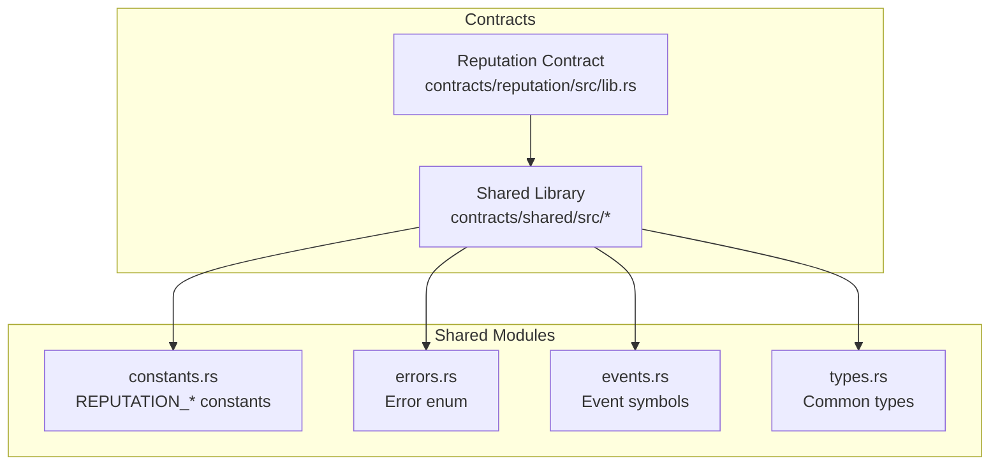
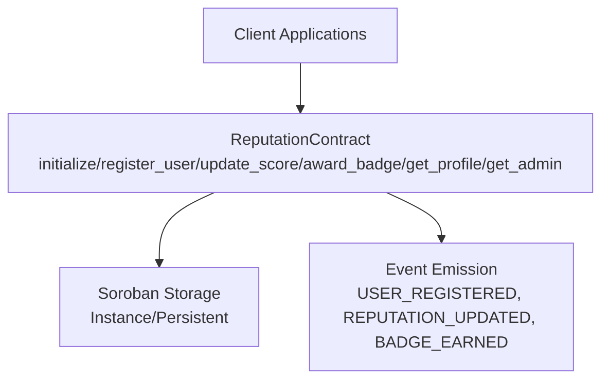
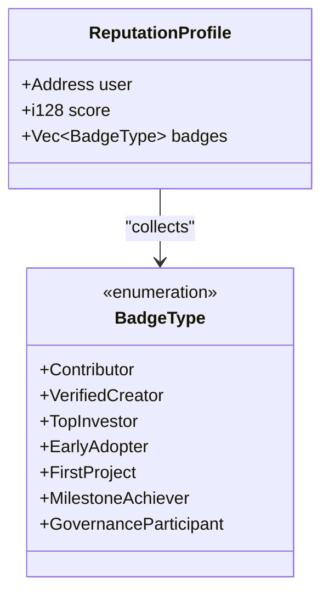
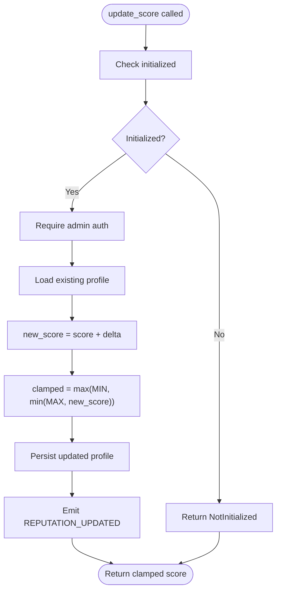
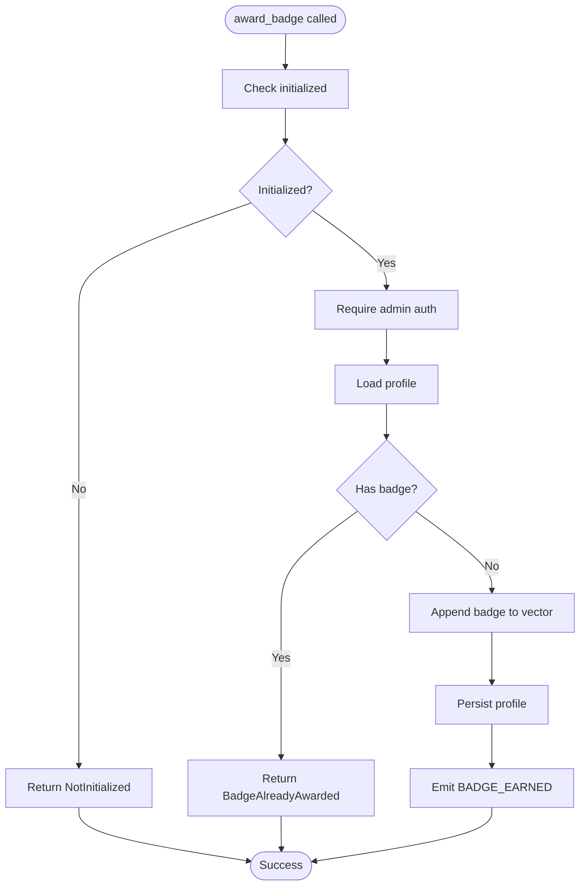
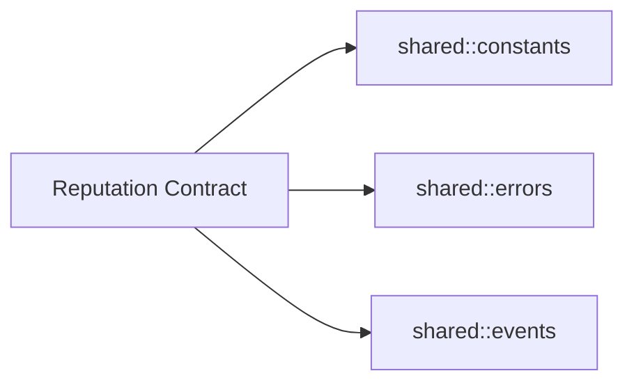

# Reputation API

<cite>
**Referenced Files in This Document**
- [lib.rs](file://contracts/reputation/src/lib.rs)
- [constants.rs](file://contracts/shared/src/constants.rs)
- [errors.rs](file://contracts/shared/src/errors.rs)
- [events.rs](file://contracts/shared/src/events.rs)
- [types.rs](file://contracts/shared/src/types.rs)
- [README.md](file://contracts/README.md)
</cite>

## Table of Contents
1. [Introduction](#introduction)
2. [Project Structure](#project-structure)
3. [Core Components](#core-components)
4. [Architecture Overview](#architecture-overview)
5. [Detailed Component Analysis](#detailed-component-analysis)
6. [Dependency Analysis](#dependency-analysis)
7. [Performance Considerations](#performance-considerations)
8. [Troubleshooting Guide](#troubleshooting-guide)
9. [Conclusion](#conclusion)

## Introduction
This document provides comprehensive API documentation for the Reputation contract, which implements a trust scoring and governance participation system. It manages reputation profiles for project creators and investors, supports badge allocation for achievements, and integrates with governance participation requirements. The contract enforces strict access control, clamps reputation scores within defined bounds, and emits on-chain events for transparency.

## Project Structure
The Reputation contract resides under the contracts/reputation module and relies on shared libraries for constants, error codes, and events. The contract exposes public functions for initialization, user registration, reputation updates, badge issuance, and profile retrieval.

**Diagram sources**
- [lib.rs](file://contracts/reputation/src/lib.rs#L1-L510)
- [constants.rs](file://contracts/shared/src/constants.rs#L1-L40)
- [errors.rs](file://contracts/shared/src/errors.rs#L1-L54)
- [events.rs](file://contracts/shared/src/events.rs#L1-L31)
- [types.rs](file://contracts/shared/src/types.rs#L1-L41)

**Section sources**
- [lib.rs](file://contracts/reputation/src/lib.rs#L1-L510)
- [README.md](file://contracts/README.md#L246-L262)

## Core Components
- ReputationProfile: Holds user address, reputation score, and badge collection.
- BadgeType: Enumerates achievement badges (Contributor, VerifiedCreator, TopInvestor, EarlyAdopter, FirstProject, MilestoneAchiever, GovernanceParticipant).
- DataKey: Storage keys for admin, user profiles, and initialization flag.
- Public APIs:
  - initialize: Sets admin and marks contract initialized.
  - register_user: Creates a new profile with default reputation.
  - update_score: Adjusts reputation score (admin-only).
  - award_badge: Grants a badge (admin-only).
  - get_profile: Retrieves a user's profile.
  - get_admin: Returns admin address.

**Section sources**
- [lib.rs](file://contracts/reputation/src/lib.rs#L8-L51)
- [lib.rs](file://contracts/reputation/src/lib.rs#L56-L252)
- [constants.rs](file://contracts/shared/src/constants.rs#L30-L39)

## Architecture Overview
The Reputation contract is a standalone Soroban contract with no cross-contract dependencies. It uses shared modules for constants, errors, and events. Access control is enforced via admin-only functions and per-call authorization checks.

**Diagram sources**
- [lib.rs](file://contracts/reputation/src/lib.rs#L56-L252)
- [events.rs](file://contracts/shared/src/events.rs#L27-L31)

## Detailed Component Analysis

### ReputationProfile and Badge Types
- ReputationProfile fields:
  - user: Address
  - score: i128 (bounded by REPUTATION_MIN and REPUTATION_MAX)
  - badges: Vec<BadgeType>
- BadgeType variants represent achievements aligned with platform activities.

**Diagram sources**
- [lib.rs](file://contracts/reputation/src/lib.rs#L41-L51)
- [lib.rs](file://contracts/reputation/src/lib.rs#L20-L39)

**Section sources**
- [lib.rs](file://contracts/reputation/src/lib.rs#L41-L51)
- [lib.rs](file://contracts/reputation/src/lib.rs#L20-L39)

### API Reference

- initialize(env, admin)
  - Purpose: Initialize the contract with an admin address.
  - Authorization: admin.require_auth().
  - Storage: Stores admin and sets Initialized flag.
  - Errors: AlreadyInitialized if already initialized.
  - Events: None.
  - Complexity: O(1).

- register_user(env, user)
  - Purpose: Create a new reputation profile with default score.
  - Authorization: user.require_auth().
  - Validation: Prevents duplicate registration.
  - Storage: Persists profile under Profile(user).
  - Events: Emits USER_REGISTERED.
  - Errors: NotInitialized, UserAlreadyRegistered.
  - Complexity: O(1).

- update_score(env, user, delta)
  - Purpose: Adjust a user's reputation score (admin-only).
  - Authorization: admin.require_auth().
  - Logic: Adds delta to current score, clamps to [REPUTATION_MIN, REPUTATION_MAX].
  - Storage: Updates persistent Profile(user).
  - Events: Emits REPUTATION_UPDATED with (user, new_score).
  - Errors: NotInitialized, UserNotRegistered.
  - Complexity: O(1).

- award_badge(env, user, badge)
  - Purpose: Grant a badge to a user (admin-only).
  - Authorization: admin.require_auth().
  - Validation: Prevents duplicate badge awards.
  - Storage: Appends badge to profile badges vector.
  - Events: Emits BADGE_EARNED with (user, badge as u32).
  - Errors: NotInitialized, UserNotRegistered, BadgeAlreadyAwarded.
  - Complexity: O(n) for duplicate check where n = badges length.

- get_profile(env, user)
  - Purpose: Retrieve a user's profile.
  - Authorization: None (no auth required).
  - Errors: NotInitialized, UserNotRegistered.
  - Complexity: O(1).

- get_admin(env)
  - Purpose: Retrieve admin address.
  - Errors: NotInitialized.
  - Complexity: O(1).

**Section sources**
- [lib.rs](file://contracts/reputation/src/lib.rs#L56-L252)
- [constants.rs](file://contracts/shared/src/constants.rs#L30-L39)

### Function Signatures and Behaviors

- initialize(env: Env, admin: Address) -> Result<(), Error>
- register_user(env: Env, user: Address) -> Result<ReputationProfile, Error>
- update_score(env: Env, user: Address, delta: i128) -> Result<i128, Error>
- award_badge(env: Env, user: Address, badge: BadgeType) -> Result<(), Error>
- get_profile(env: Env, user: Address) -> Result<ReputationProfile, Error>
- get_admin(env: &Env) -> Result<Address, Error>

Notes:
- All admin-only functions require admin authorization before execution.
- User-facing functions validate initialization and existence of profiles where applicable.
- Reputation scores are clamped to configured min/max bounds.

**Section sources**
- [lib.rs](file://contracts/reputation/src/lib.rs#L56-L252)

### Reputation Scoring and Trust Metrics

- Score Bounds:
  - REPUTATION_MIN: Lower bound for reputation.
  - REPUTATION_MAX: Upper bound for reputation.
  - REPUTATION_START: Initial score assigned on registration.
- Clamping Logic:
  - New score computed as old score plus delta.
  - Final score clamped to [REPUTATION_MIN, REPUTATION_MAX].

**Diagram sources**
- [lib.rs](file://contracts/reputation/src/lib.rs#L131-L157)
- [constants.rs](file://contracts/shared/src/constants.rs#L30-L33)

**Section sources**
- [lib.rs](file://contracts/reputation/src/lib.rs#L131-L157)
- [constants.rs](file://contracts/shared/src/constants.rs#L30-L33)

### Badge Allocation and Achievement Tracking

- Badge Awards:
  - Admin-only operation.
  - Prevents duplicate badges per user.
  - Appends badge to profile badges vector.
- Badge Types:
  - Contributor, VerifiedCreator, TopInvestor, EarlyAdopter, FirstProject, MilestoneAchiever, GovernanceParticipant.

**Diagram sources**
- [lib.rs](file://contracts/reputation/src/lib.rs#L168-L196)
- [lib.rs](file://contracts/reputation/src/lib.rs#L243-L251)

**Section sources**
- [lib.rs](file://contracts/reputation/src/lib.rs#L168-L196)
- [lib.rs](file://contracts/reputation/src/lib.rs#L243-L251)

### Governance Participation and Voting Power

- Governance Participation Badge:
  - GovernanceParticipant badge is defined for users who participate in governance.
- Voting Power Determination:
  - The current Reputation contract does not expose a dedicated function to compute voting power from reputation.
  - Integration points:
    - External governance contract can query user profiles via get_profile to derive voting weights.
    - The shared UserProfile type includes a reputation_score field for potential cross-contract usage.

Note: The governance contract implementation is currently a placeholder. Voting power computation and delegation logic are expected to be implemented there and may reference reputation data.

**Section sources**
- [lib.rs](file://contracts/reputation/src/lib.rs#L20-L39)
- [types.rs](file://contracts/shared/src/types.rs#L30-L41)
- [README.md](file://contracts/README.md#L263-L280)

### Reward Eligibility Calculations

- Achievement-Based Rewards:
  - Badge allocation serves as evidence of eligibility for platform rewards or privileges.
  - The contract itself does not define reward calculations; integrations with profit distribution or other contracts can use badge holdings as criteria.
- Governance Thresholds:
  - Governance participation badge can be used as a gating mechanism for voting rights.

[No sources needed since this section synthesizes integration concepts without analyzing specific code]

## Dependency Analysis
- Internal Dependencies:
  - Uses shared constants for score bounds and start value.
  - Uses shared error enum for consistent error codes.
  - Uses shared event symbols for emitting state changes.
- External Dependencies:
  - Soroban SDK for contract types, storage, and events.
- Coupling:
  - Low coupling; no inter-contract calls.
  - Cohesion: All reputation-related logic centralized in one contract.

**Diagram sources**
- [lib.rs](file://contracts/reputation/src/lib.rs#L3-L6)
- [constants.rs](file://contracts/shared/src/constants.rs#L1-L40)
- [errors.rs](file://contracts/shared/src/errors.rs#L1-L54)
- [events.rs](file://contracts/shared/src/events.rs#L1-L31)

**Section sources**
- [lib.rs](file://contracts/reputation/src/lib.rs#L3-L6)
- [constants.rs](file://contracts/shared/src/constants.rs#L1-L40)
- [errors.rs](file://contracts/shared/src/errors.rs#L1-L54)
- [events.rs](file://contracts/shared/src/events.rs#L1-L31)

## Performance Considerations
- Storage Operations:
  - Persistent writes occur on profile updates and badge awards; keep batch operations minimal.
- Badge Search:
  - Badge duplicate check iterates over existing badges; badge lists should remain short.
- Events:
  - Emission overhead is minimal; events enable efficient off-chain indexing.

[No sources needed since this section provides general guidance]

## Troubleshooting Guide

Common Errors and Causes:
- NotInitialized (code 1):
  - Occurs when calling functions before initialize or when admin queries fail.
- AlreadyInitialized (code 2):
  - Attempting to initialize twice.
- UserAlreadyRegistered (code 503):
  - Duplicate registration attempts.
- BadgeAlreadyAwarded (code 504):
  - Attempting to award the same badge twice to a user.
- UserNotRegistered (code 505):
  - Updating score or awarding badge for unregistered users.
- Unauthorized:
  - Non-admin attempting admin-only operations.

Validation and Access Control:
- Admin-only functions enforce admin.require_auth().
- User-facing functions enforce caller authorization where applicable.
- Initialization guard prevents operations on uninitialized contracts.

**Section sources**
- [errors.rs](file://contracts/shared/src/errors.rs#L40-L53)
- [lib.rs](file://contracts/reputation/src/lib.rs#L66-L82)
- [lib.rs](file://contracts/reputation/src/lib.rs#L92-L120)
- [lib.rs](file://contracts/reputation/src/lib.rs#L131-L157)
- [lib.rs](file://contracts/reputation/src/lib.rs#L168-L196)
- [lib.rs](file://contracts/reputation/src/lib.rs#L206-L211)

## Conclusion
The Reputation contract provides a robust foundation for trust scoring and achievement tracking on the platform. It enforces strict initialization and access control, maintains bounded reputation scores, and emits transparent events. While governance participation and reward calculations are not implemented here, the contract’s design enables seamless integration with the governance and profit distribution modules. Administrators can reliably manage trust hierarchies and ensure fair governance participation by leveraging badge allocations and profile queries.