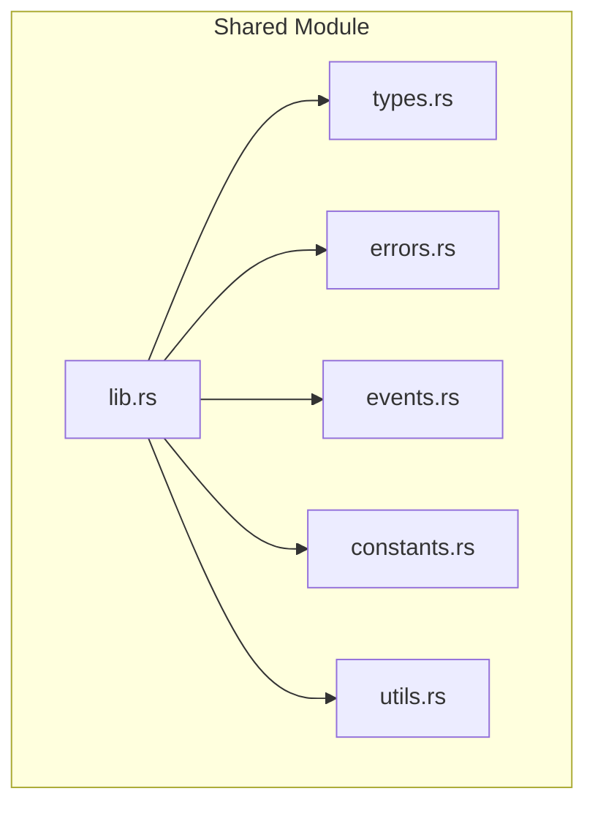
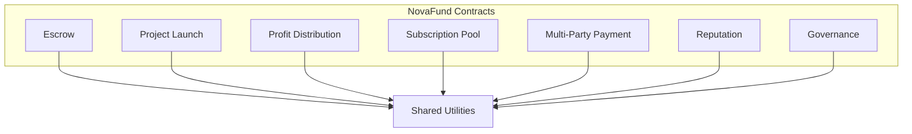
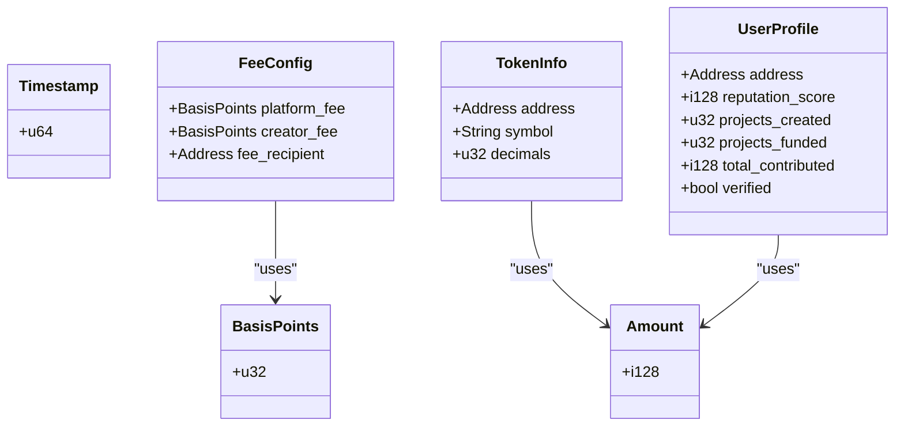
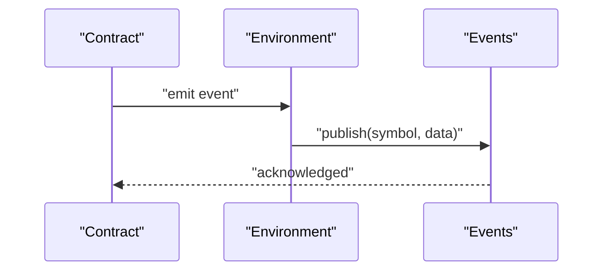
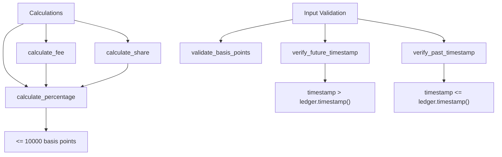
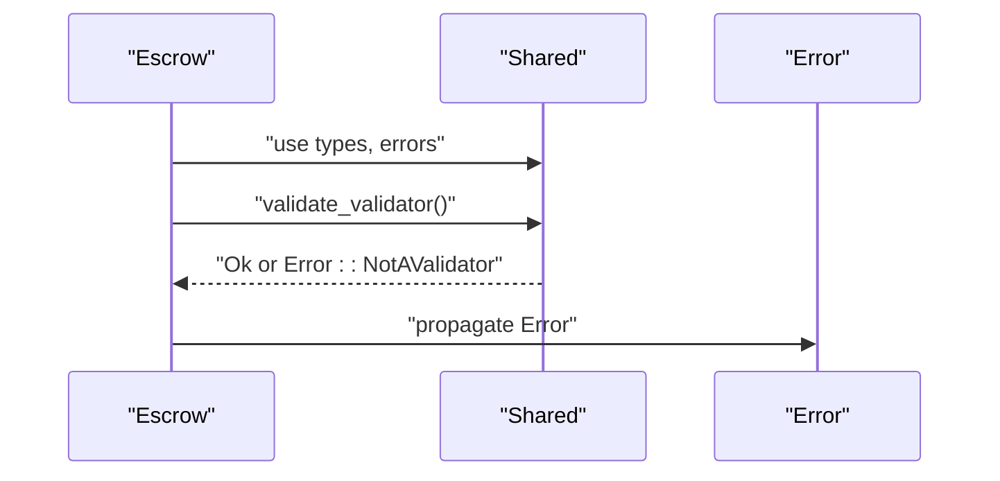
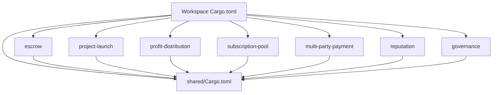

# Shared Utilities API

<cite>
**Referenced Files in This Document**
- [lib.rs](file://contracts/shared/src/lib.rs)
- [types.rs](file://contracts/shared/src/types.rs)
- [errors.rs](file://contracts/shared/src/errors.rs)
- [events.rs](file://contracts/shared/src/events.rs)
- [constants.rs](file://contracts/shared/src/constants.rs)
- [utils.rs](file://contracts/shared/src/utils.rs)
- [Cargo.toml](file://contracts/shared/Cargo.toml)
- [Cargo.toml](file://contracts/Cargo.toml)
- [validation.rs](file://contracts/escrow/src/validation.rs)
- [types.rs](file://contracts/profit-distribution/src/types.rs)
- [events.rs](file://contracts/profit-distribution/src/events.rs)
- [lib.rs](file://contracts/reputation/src/lib.rs)
</cite>

## Table of Contents
1. [Introduction](#introduction)
2. [Project Structure](#project-structure)
3. [Core Components](#core-components)
4. [Architecture Overview](#architecture-overview)
5. [Detailed Component Analysis](#detailed-component-analysis)
6. [Dependency Analysis](#dependency-analysis)
7. [Performance Considerations](#performance-considerations)
8. [Troubleshooting Guide](#troubleshooting-guide)
9. [Conclusion](#conclusion)

## Introduction
The Shared Utilities contract provides a centralized library of common types, errors, events, constants, and utility functions used across all NovaFund contracts. It ensures consistency, reduces duplication, and enforces standardized patterns for data representation, error handling, event emission, and validation logic. By centralizing these shared elements, the platform maintains a coherent developer experience and simplifies maintenance across the entire ecosystem.

## Project Structure
The Shared Utilities module is organized into focused submodules:
- types: Defines common data structures used throughout the platform
- errors: Enumerates standardized error codes grouped by domain
- events: Declares canonical event symbol constants
- constants: Provides platform-wide numeric limits and thresholds
- utils: Implements reusable validation and calculation helpers
- lib: Re-exports all public items for convenient consumption

**Diagram sources**
- [lib.rs](file://contracts/shared/src/lib.rs#L1-L20)
- [types.rs](file://contracts/shared/src/types.rs#L1-L41)
- [errors.rs](file://contracts/shared/src/errors.rs#L1-L54)
- [events.rs](file://contracts/shared/src/events.rs#L1-L31)
- [constants.rs](file://contracts/shared/src/constants.rs#L1-L40)
- [utils.rs](file://contracts/shared/src/utils.rs#L1-L59)

**Section sources**
- [lib.rs](file://contracts/shared/src/lib.rs#L1-L20)
- [Cargo.toml](file://contracts/shared/Cargo.toml#L1-L12)

## Core Components
This section documents the primary building blocks provided by the Shared Utilities module.

### Common Types
The types module defines foundational data structures used across contracts:
- Timestamp: A 64-bit unsigned integer representing a ledger timestamp
- Amount: A signed 128-bit integer for monetary values
- BasisPoints: An unsigned 32-bit integer representing percentages scaled by 100 (10000 = 100%)

Structures:
- FeeConfig: Encapsulates platform and creator fee rates along with the recipient address
- TokenInfo: Describes token metadata including address, symbol, and decimals
- UserProfile: Stores user profile metrics such as reputation, contribution counts, and verification status

Usage examples:
- FeeConfig is used by contracts implementing fee collection to define and validate fee structures
- TokenInfo standardizes token representation across payment and distribution flows
- UserProfile supports reputation and governance integrations

**Section sources**
- [types.rs](file://contracts/shared/src/types.rs#L1-L41)

### Error Enumeration
The errors module defines a unified set of error codes grouped by functional domain:
- General errors: Initialization, authorization, invalid input, and not found scenarios
- Project lifecycle errors: Activation, existence, goal reach, deadlines, and status validation
- Escrow-related errors: Balance validation, milestone approvals, validator checks, and voting
- Distribution errors: Fund availability, distribution validity, claimability, and failure handling
- Subscription errors: Active status, period validation, existing subscriptions, and withdrawal locks
- Reputation errors: Score thresholds, badge management, and registration states
- Governance errors: Proposal lifecycle, voting power, quorum, and execution states

Error propagation pattern:
Contracts return standardized errors from the shared module, enabling consistent client-side handling and debugging.

**Section sources**
- [errors.rs](file://contracts/shared/src/errors.rs#L1-L54)

### Event Specifications
The events module declares canonical event symbol constants for cross-contract communication:
- Project events: Creation, funding, completion, and failure
- Contribution events: Contribution and refund issuance
- Escrow events: Locking, release, and milestone completion
- Distribution events: Profit distribution and dividend claims
- Governance events: Proposal creation, voting, and execution
- Reputation events: User registration, reputation updates, and badge earning

Event publishing helpers:
While the shared module defines canonical symbols, individual contracts implement event publishing functions that wrap SDK event emission with structured payloads.

**Section sources**
- [events.rs](file://contracts/shared/src/events.rs#L1-L31)

### Constants
The constants module defines platform-wide limits and thresholds:
- Fee caps: Default and maximum platform fees
- Funding bounds: Minimum and maximum project funding goals
- Duration constraints: Minimum and maximum project lifecycles
- Contribution minimums: Minimum allowable contributions
- Approval thresholds: Milestone approval and governance quorum requirements
- Validator requirements: Minimum validators for escrow decisions
- Reputation ranges: Min, max, and starting scores
- Governance timing: Voting period duration

Validation implications:
These constants are used to validate inputs and enforce policy compliance across contracts, ensuring consistent behavior and preventing out-of-range configurations.

**Section sources**
- [constants.rs](file://contracts/shared/src/constants.rs#L1-L40)

### Utility Functions
The utils module provides reusable helpers for calculations and validations:
- Percentage calculation: Computes a portion of an amount using basis points scaling
- Fee calculation: Derives fee amounts from totals and rates
- Timestamp verification: Validates future/past timestamps against ledger time
- Proportional sharing: Calculates shares based on total amounts and percentages
- Basis points validation: Ensures rates do not exceed 100%

Example usage patterns:
- calculate_percentage is used to compute platform and creator fees
- validate_basis_points prevents invalid fee configurations
- verify_future_timestamp and verify_past_timestamp guard against temporal inconsistencies

**Section sources**
- [utils.rs](file://contracts/shared/src/utils.rs#L1-L59)

## Architecture Overview
The Shared Utilities module acts as a foundational dependency for all NovaFund contracts. Contracts import shared types, errors, events, constants, and utilities to maintain consistency and reduce duplication.

**Diagram sources**
- [Cargo.toml](file://contracts/Cargo.toml#L4-L13)
- [lib.rs](file://contracts/shared/src/lib.rs#L1-L20)

## Detailed Component Analysis

### Type System Analysis
The type definitions establish a consistent data model across contracts. They leverage Soroban SDK types and custom structures to represent real-world entities.

**Diagram sources**
- [types.rs](file://contracts/shared/src/types.rs#L1-L41)

**Section sources**
- [types.rs](file://contracts/shared/src/types.rs#L1-L41)

### Error Domain Organization
Errors are grouped by functional domains to simplify categorization and handling. Each group starts at a distinct base value to prevent collisions.

```mermaid
flowchart TD
Start(["Error Code"]) --> General["General (1-99)"]
Start --> Project["Project (100-199)"]
Start --> Escrow["Escrow (200-299)"]
Start --> Distribution["Distribution (300-399)"]
Start --> Subscription["Subscription (400-499)"]
Start --> Reputation["Reputation (500-599)"]
Start --> Governance["Governance (600-699)"]
General --> G1["Unauthorized"]
General --> G2["InvalidInput"]
General --> G3["NotFound"]
Project --> P1["ProjectNotActive"]
Project --> P2["ProjectAlreadyExists"]
Project --> P3["FundingGoalNotReached"]
Escrow --> E1["InsufficientEscrowBalance"]
Escrow --> E2["MilestoneNotApproved"]
Escrow --> E3["NotAValidator"]
Distribution --> D1["InsufficientFunds"]
Distribution --> D2["InvalidDistribution"]
Distribution --> D3["NoClaimableAmount"]
Subscription --> S1["SubscriptionNotActive"]
Subscription --> S2["InvalidSubscriptionPeriod"]
Subscription --> S3["WithdrawalLocked"]
Reputation --> R1["ReputationTooLow"]
Reputation --> R2["BadgeNotEarned"]
Reputation --> R3["UserAlreadyRegistered"]
Governance --> Gov1["ProposalNotActive"]
Governance --> Gov2["InsufficientVotingPower"]
Governance --> Gov3["QuorumNotReached"]
```

**Diagram sources**
- [errors.rs](file://contracts/shared/src/errors.rs#L1-L54)

**Section sources**
- [errors.rs](file://contracts/shared/src/errors.rs#L1-L54)

### Event Standardization
Event symbols provide a canonical vocabulary for cross-contract observability. Contracts publish structured events using these symbols.

**Diagram sources**
- [events.rs](file://contracts/shared/src/events.rs#L1-L31)

**Section sources**
- [events.rs](file://contracts/shared/src/events.rs#L1-L31)

### Validation and Calculation Utilities
The utility functions encapsulate common computations and checks, promoting reuse and consistency.

**Diagram sources**
- [utils.rs](file://contracts/shared/src/utils.rs#L1-L59)

**Section sources**
- [utils.rs](file://contracts/shared/src/utils.rs#L1-L59)

### Cross-Contract Communication Patterns
Contracts consume shared utilities to ensure interoperability and consistent behavior.

**Diagram sources**
- [validation.rs](file://contracts/escrow/src/validation.rs#L1-L13)
- [errors.rs](file://contracts/shared/src/errors.rs#L1-L54)

**Section sources**
- [validation.rs](file://contracts/escrow/src/validation.rs#L1-L13)

## Dependency Analysis
The Shared Utilities module is consumed by all NovaFund contracts within the workspace. The workspace Cargo.toml lists all members, including shared, while the shared crate depends only on the Soroban SDK.

**Diagram sources**
- [Cargo.toml](file://contracts/Cargo.toml#L4-L13)
- [Cargo.toml](file://contracts/shared/Cargo.toml#L1-L12)

**Section sources**
- [Cargo.toml](file://contracts/Cargo.toml#L1-L38)
- [Cargo.toml](file://contracts/shared/Cargo.toml#L1-L12)

## Performance Considerations
- Precision and overflow: Calculations use 128-bit integers for monetary values to prevent overflow during intermediate computations
- Basis points scaling: Percentages are represented in basis points (scaled by 10000) to avoid floating-point arithmetic
- Ledger timestamp comparisons: Timestamp validations rely on ledger-provided timestamps to ensure deterministic behavior
- Constant-driven validation: Centralized constants enable efficient pre-flight checks and reduce branching logic across contracts

## Troubleshooting Guide
Common issues and resolutions:
- Invalid basis points: Ensure rates do not exceed 10000 basis points; use the provided validation helper
- Timestamp mismatches: Verify that future timestamps are greater than the ledger timestamp and past timestamps are less than or equal to the ledger timestamp
- Fee calculation discrepancies: Confirm that fee rates align with platform defaults and maximums defined in constants
- Event symbol mismatches: Use canonical symbols from the shared events module to ensure proper indexing and client parsing

Integration tips:
- Import shared types and errors to maintain consistent data modeling and error handling
- Prefer shared utility functions for calculations to ensure uniform behavior
- Use shared constants for policy enforcement to avoid hard-coded values

**Section sources**
- [utils.rs](file://contracts/shared/src/utils.rs#L1-L59)
- [constants.rs](file://contracts/shared/src/constants.rs#L1-L40)
- [errors.rs](file://contracts/shared/src/errors.rs#L1-L54)

## Conclusion
The Shared Utilities contract establishes a robust foundation for the NovaFund ecosystem by providing standardized types, errors, events, constants, and utilities. Its adoption ensures consistency, simplifies development, and enables reliable cross-contract interactions. Following the guidelines for extension and backward compatibility will preserve these benefits as the platform evolves.