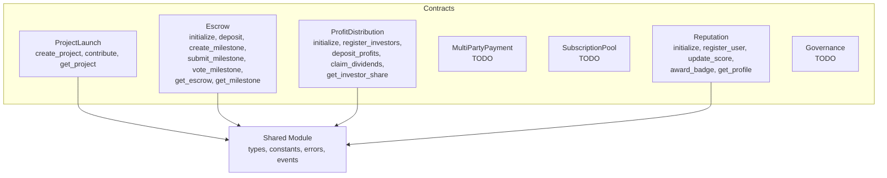
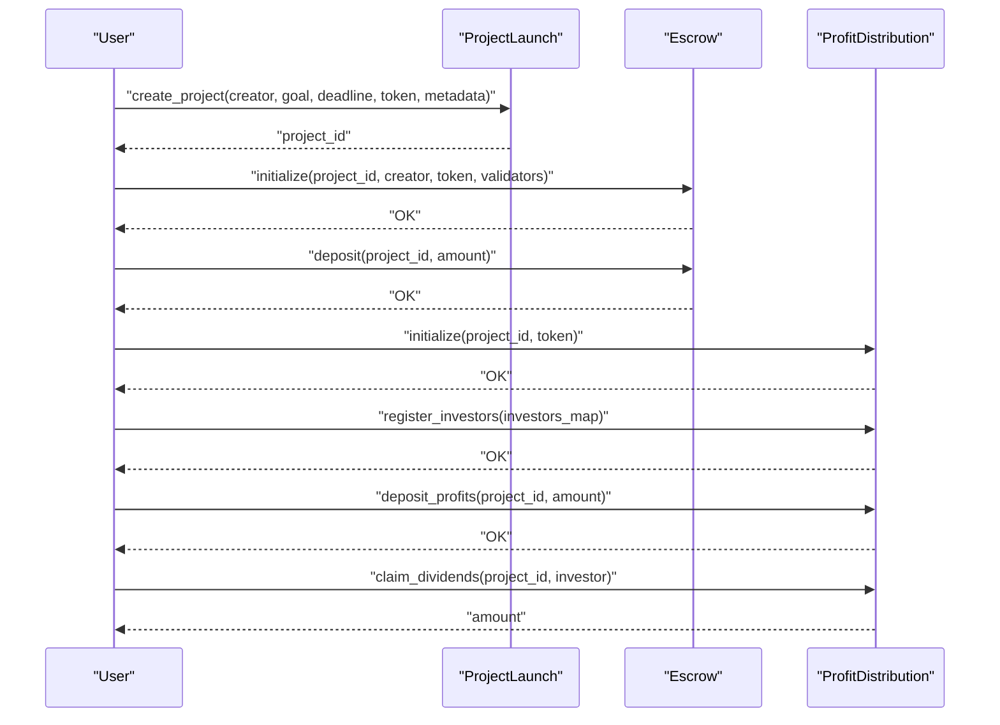
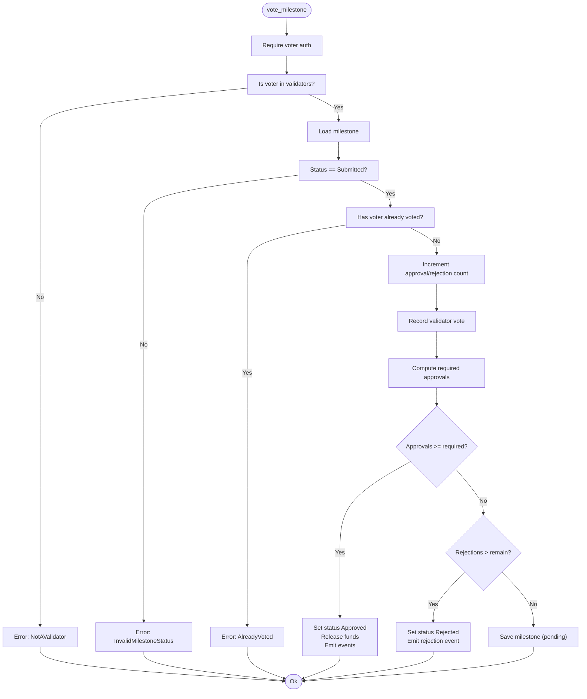
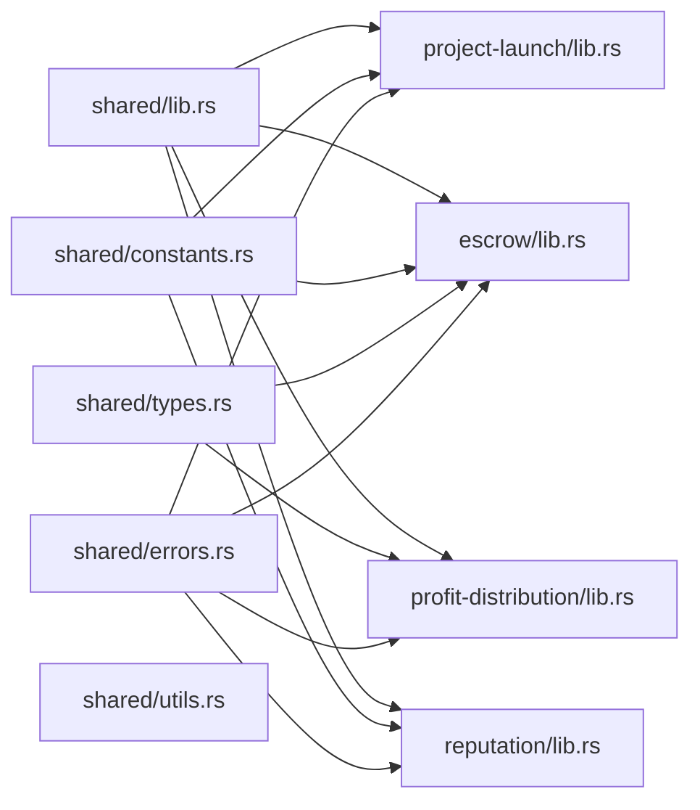

# Smart Contract APIs

<cite>
**Referenced Files in This Document**
- [lib.rs](file://contracts/project-launch/src/lib.rs)
- [lib.rs](file://contracts/escrow/src/lib.rs)
- [storage.rs](file://contracts/escrow/src/storage.rs)
- [validation.rs](file://contracts/escrow/src/validation.rs)
- [lib.rs](file://contracts/profit-distribution/src/lib.rs)
- [storage.rs](file://contracts/profit-distribution/src/storage.rs)
- [types.rs](file://contracts/profit-distribution/src/types.rs)
- [errors.rs](file://contracts/profit-distribution/src/errors.rs)
- [events.rs](file://contracts/profit-distribution/src/events.rs)
- [lib.rs](file://contracts/multi-party-payment/src/lib.rs)
- [lib.rs](file://contracts/subscription-pool/src/lib.rs)
- [lib.rs](file://contracts/governance/src/lib.rs)
- [lib.rs](file://contracts/reputation/src/lib.rs)
- [lib.rs](file://contracts/shared/src/lib.rs)
- [constants.rs](file://contracts/shared/src/constants.rs)
- [types.rs](file://contracts/shared/src/types.rs)
- [errors.rs](file://contracts/shared/src/errors.rs)
</cite>

## Table of Contents
1. [Introduction](#introduction)
2. [Project Structure](#project-structure)
3. [Core Components](#core-components)
4. [Architecture Overview](#architecture-overview)
5. [Detailed Component Analysis](#detailed-component-analysis)
6. [Dependency Analysis](#dependency-analysis)
7. [Performance Considerations](#performance-considerations)
8. [Troubleshooting Guide](#troubleshooting-guide)
9. [Conclusion](#conclusion)
10. [Appendices](#appendices)

## Introduction
This document provides comprehensive API documentation for NovaFund’s suite of smart contracts. It covers seven specialized contracts: ProjectLaunch, Escrow, ProfitDistribution, MultiPartyPayment, SubscriptionPool, Reputation, and Governance. For each contract, you will find:
- Function signatures and parameter specifications
- Return value descriptions
- Error codes and conditions
- Practical invocation patterns and examples
- Initialization procedures, state management, and cross-contract communication notes

Where functionality is not yet implemented, this document clearly indicates “TODO” and outlines intended behavior.

## Project Structure
NovaFund organizes contracts by domain under contracts/, with a shared module providing common types, constants, errors, and utilities. Each contract exposes a Soroban contract module with public functions and internal helpers.

**Diagram sources**
- [lib.rs](file://contracts/project-launch/src/lib.rs#L1-L363)
- [lib.rs](file://contracts/escrow/src/lib.rs#L1-L367)
- [lib.rs](file://contracts/profit-distribution/src/lib.rs#L1-L78)
- [lib.rs](file://contracts/multi-party-payment/src/lib.rs#L1-L9)
- [lib.rs](file://contracts/subscription-pool/src/lib.rs#L1-L9)
- [lib.rs](file://contracts/reputation/src/lib.rs#L1-L510)
- [lib.rs](file://contracts/governance/src/lib.rs#L1-L9)
- [lib.rs](file://contracts/shared/src/lib.rs#L1-L20)

**Section sources**
- [lib.rs](file://contracts/project-launch/src/lib.rs#L1-L363)
- [lib.rs](file://contracts/escrow/src/lib.rs#L1-L367)
- [lib.rs](file://contracts/profit-distribution/src/lib.rs#L1-L78)
- [lib.rs](file://contracts/multi-party-payment/src/lib.rs#L1-L9)
- [lib.rs](file://contracts/subscription-pool/src/lib.rs#L1-L9)
- [lib.rs](file://contracts/reputation/src/lib.rs#L1-L510)
- [lib.rs](file://contracts/governance/src/lib.rs#L1-L9)
- [lib.rs](file://contracts/shared/src/lib.rs#L1-L20)

## Core Components
- ProjectLaunch: Project lifecycle management, contribution collection, and project metadata storage.
- Escrow: Multi-signature milestone-based fund management with validator approval thresholds.
- ProfitDistribution: Investor share registry, profit deposit, and dividend claiming.
- MultiPartyPayment: Payment splitting across multiple stakeholders (planned).
- SubscriptionPool: Recurring investment pooling (planned).
- Reputation: Trust scoring, badge awards, and governance participation indicators.
- Governance: Proposal lifecycle and voting (planned).

**Section sources**
- [lib.rs](file://contracts/project-launch/src/lib.rs#L72-L248)
- [lib.rs](file://contracts/escrow/src/lib.rs#L22-L346)
- [lib.rs](file://contracts/profit-distribution/src/lib.rs#L34-L78)
- [lib.rs](file://contracts/multi-party-payment/src/lib.rs#L1-L9)
- [lib.rs](file://contracts/subscription-pool/src/lib.rs#L1-L9)
- [lib.rs](file://contracts/reputation/src/lib.rs#L56-L252)
- [lib.rs](file://contracts/governance/src/lib.rs#L1-L9)

## Architecture Overview
Contracts communicate primarily via:
- Shared types and constants for consistent data modeling and validation.
- Events emitted during state transitions for off-chain indexing and UI updates.
- Cross-contract calls through Soroban client bindings (not shown here) to coordinate workflows (e.g., ProjectLaunch interacting with Escrow and ProfitDistribution).

**Diagram sources**
- [lib.rs](file://contracts/project-launch/src/lib.rs#L87-L149)
- [lib.rs](file://contracts/escrow/src/lib.rs#L31-L70)
- [lib.rs](file://contracts/profit-distribution/src/lib.rs#L37-L56)

## Detailed Component Analysis

### ProjectLaunch API
Purpose: Create and manage funding projects, track contributions, and enforce deadlines and goals.

Key Types
- ProjectStatus: Active, Completed, Failed, Cancelled
- Project: creator, funding_goal, deadline, token, status, metadata_hash, total_raised, created_at
- Contribution: contributor, amount, timestamp
- DataKey: Admin, NextProjectId, Project

Public Functions
- initialize(env, admin) -> Result<(), Error>
  - Initializes the contract with an admin address.
  - Emits initialization event.
  - Errors: AlreadyInitialized
- create_project(env, creator, funding_goal, deadline, token, metadata_hash) -> Result<u64, ProjectLaunchError>
  - Validates funding goal and deadline range and future timestamp.
  - Assigns next project ID and persists project.
  - Emits PROJECT_CREATED event.
  - Errors: InvalidFundingGoal, InvalidDeadline, AlreadyInitialized
- contribute(env, project_id, contributor, amount) -> Result<(), ProjectLaunchError>
  - Validates minimum contribution and active status plus open deadline.
  - Updates raised amount and stores contribution record.
  - Emits CONTRIBUTION_MADE event.
  - Errors: ContributionTooLow, ProjectNotFound, ProjectNotActive, DeadlinePassed
- get_project(env, project_id) -> Result<Project, ProjectLaunchError>
  - Retrieves project by ID.
  - Errors: ProjectNotFound
- get_contributions(env, project_id) -> Result<Vec<Contribution>, ProjectLaunchError>
  - Retrieves all contributions for a project.
  - Errors: ProjectNotFound
- get_next_project_id(env) -> u64
  - Utility for testing and ID preallocation.
- is_initialized(env) -> bool
  - Checks initialization flag.
- get_admin(env) -> Option<Address>
  - Returns admin address if set.

Error Codes
- ProjectLaunchError: InvalidFundingGoal, InvalidDeadline, ProjectNotFound, ContributionTooLow, ProjectNotActive, DeadlinePassed
- Shared Error: AlreadyInitialized

Practical Examples
- Creating a project with a valid goal and deadline, then contributing the minimum amount, and finally retrieving project details and contribution history.
- Attempting to contribute below the minimum or after the deadline should fail with appropriate error codes.

**Section sources**
- [lib.rs](file://contracts/project-launch/src/lib.rs#L14-L248)
- [lib.rs](file://contracts/shared/src/errors.rs#L14-L20)
- [lib.rs](file://contracts/shared/src/constants.rs#L9-L22)

### Escrow API
Purpose: Manage locked funds and milestone-based releases with validator approvals.

Key Types
- EscrowInfo: project_id, creator, token, total_deposited, released_amount, validators
- Milestone: id, project_id, description, amount, status, proof_hash, approval_count, rejection_count, created_at
- MilestoneStatus: Pending, Submitted, Approved, Rejected
- Amount: i128
- Validators: Vec<Address>

Public Functions
- initialize(env, project_id, creator, token, validators) -> Result<(), Error>
  - Requires creator auth, validates minimum validators, checks uniqueness, initializes milestone counter.
  - Emits ESCROW_INITIALIZED.
  - Errors: InvalidInput, AlreadyInitialized
- deposit(env, project_id, amount) -> Result<(), Error>
  - Increases total_deposited safely.
  - Emits FUNDS_LOCKED.
  - Errors: InvalidInput
- create_milestone(env, project_id, description, amount) -> Result<(), Error>
  - Requires creator auth, validates amount, enforces total milestone allocation ≤ escrow balance.
  - Emits MILESTONE_CREATED.
  - Errors: InvalidInput, InsufficientEscrowBalance
- submit_milestone(env, project_id, milestone_id, proof_hash) -> Result<(), Error>
  - Requires creator auth, moves milestone to Submitted, resets votes, clears prior voter records.
  - Emits MILESTONE_SUBMITTED.
  - Errors: InvalidMilestoneStatus
- vote_milestone(env, project_id, milestone_id, voter, approve) -> Result<(), Error>
  - Requires voter auth, verifies validator membership, prevents double voting, tallies approvals vs. rejections.
  - On majority approval: sets status to Approved, releases funds, emits APPROVED and FUNDS_RELEASED.
  - On majority rejection: sets status to Rejected.
  - Errors: NotAValidator, AlreadyVoted, InvalidMilestoneStatus
- get_escrow(env, project_id) -> Result<EscrowInfo, Error>
- get_milestone(env, project_id, milestone_id) -> Result<Milestone, Error>
- get_total_milestone_amount(env, project_id) -> Result<Amount, Error>
- get_available_balance(env, project_id) -> Result<Amount, Error>

Internal Helpers
- release_milestone_funds(...): Safely increments released amount respecting total_deposited.

Storage and Validation
- Storage helpers: set/get escrow/milestone, counters, validator votes, total milestone amount computation.
- Validator validation helper.

Practical Examples
- Initialize an escrow with 3 validators, deposit funds, create a milestone, submit with proof, and have validators approve to release funds.
- Attempting to vote twice or vote when not a validator should fail.

**Diagram sources**
- [lib.rs](file://contracts/escrow/src/lib.rs#L220-L307)
- [storage.rs](file://contracts/escrow/src/storage.rs#L73-L125)
- [validation.rs](file://contracts/escrow/src/validation.rs#L5-L12)

**Section sources**
- [lib.rs](file://contracts/escrow/src/lib.rs#L22-L346)
- [storage.rs](file://contracts/escrow/src/storage.rs#L1-L144)
- [validation.rs](file://contracts/escrow/src/validation.rs#L1-L13)
- [lib.rs](file://contracts/shared/src/constants.rs#L24-L28)
- [lib.rs](file://contracts/shared/src/errors.rs#L21-L27)

### ProfitDistribution API
Purpose: Manage investor shares and distribute profits proportionally.

Public Functions
- initialize(env, project_id, token) -> Result<(), ContractError>
  - Planned: Initialize distribution for a project and token.
- register_investors(env, project_id, investors) -> Result<(), ContractError>
  - Planned: Register investors with share percentages; total must equal 100%.
- deposit_profits(env, project_id, amount) -> Result<(), ContractError>
  - Planned: Deposit profits; compute claimable amounts per investor.
- claim_dividends(env, project_id, investor) -> Result<i128, ContractError>
  - Planned: Allow investor to claim their portion; update claimed totals.
- get_investor_share(env, project_id, investor) -> Result<InvestorShare, ContractError>
  - Planned: Retrieve investor share details.

Types and Storage
- InvestorShare: investor, share_percentage (basis points), claimable_amount, total_claimed
- DataKey variants: ProjectToken, InvestorShare, TotalShares

Events
- ProfitDeposited(project_id, amount)
- DividendClaimed(project_id, investor, amount)

Errors
- ContractError: AlreadyInitialized, NotInitialized, InvalidSharePercentage, TotalSharesNot100, InsufficientBalance, NothingToClaim, AlreadyClaimed, Unauthorized, InvalidAmount

Notes
- Implementation is marked as TODO in the contract module; APIs are documented based on intended behavior.

**Section sources**
- [lib.rs](file://contracts/profit-distribution/src/lib.rs#L34-L78)
- [types.rs](file://contracts/profit-distribution/src/types.rs#L3-L18)
- [storage.rs](file://contracts/profit-distribution/src/storage.rs#L8-L33)
- [events.rs](file://contracts/profit-distribution/src/events.rs#L3-L21)
- [errors.rs](file://contracts/profit-distribution/src/errors.rs#L6-L16)

### MultiPartyPayment API
Purpose: Split payments among multiple stakeholders according to configured shares.

Status
- TODO: Contract module contains placeholder comments indicating planned functionality.

**Section sources**
- [lib.rs](file://contracts/multi-party-payment/src/lib.rs#L1-L9)

### SubscriptionPool API
Purpose: Manage recurring investment pools and withdrawals.

Status
- TODO: Contract module contains placeholder comments indicating planned functionality.

**Section sources**
- [lib.rs](file://contracts/subscription-pool/src/lib.rs#L1-L9)

### Reputation API
Purpose: Track user reputation scores and award badges.

Public Functions
- initialize(env, admin) -> Result<(), Error>
  - Sets admin and initialization flag.
  - Errors: AlreadyInitialized
- register_user(env, user) -> Result<ReputationProfile, Error>
  - Creates profile with default score; requires user auth.
  - Errors: NotInitialized, UserAlreadyRegistered
- update_score(env, user, delta) -> Result<i128, Error>
  - Admin-only; clamps to min/max bounds.
  - Errors: NotInitialized, UserNotRegistered
- award_badge(env, user, badge) -> Result<(), Error>
  - Admin-only; prevents duplicate badges.
  - Errors: NotInitialized, UserNotRegistered, BadgeAlreadyAwarded
- get_profile(env, user) -> Result<ReputationProfile, Error>
  - Errors: NotInitialized, UserNotRegistered
- get_admin(env) -> Result<Address, Error>

Types and Constants
- ReputationProfile: user, score, badges
- BadgeType: Contributor, VerifiedCreator, TopInvestor, EarlyAdopter, FirstProject, MilestoneAchiever, GovernanceParticipant
- Constants: REPUTATION_MIN, REPUTATION_MAX, REPUTATION_START

Practical Examples
- Initialize reputation contract, register a user, update score, award badges, and retrieve profile.

**Section sources**
- [lib.rs](file://contracts/reputation/src/lib.rs#L56-L252)
- [lib.rs](file://contracts/shared/src/constants.rs#L30-L33)
- [lib.rs](file://contracts/shared/src/errors.rs#L40-L47)

### Governance API
Purpose: Manage proposals and voting.

Status
- TODO: Contract module contains placeholder comments indicating planned functionality.

**Section sources**
- [lib.rs](file://contracts/governance/src/lib.rs#L1-L9)

## Dependency Analysis
Shared Dependencies
- shared/types: common types (FeeConfig, TokenInfo, UserProfile, Amount, Timestamp, BasisPoints)
- shared/constants: platform-wide constants (fees, durations, thresholds)
- shared/errors: unified error enums across contracts
- shared/events: event types and publishing helpers
- shared/utils: shared utilities (e.g., timestamp verification)

**Diagram sources**
- [lib.rs](file://contracts/shared/src/lib.rs#L1-L20)
- [constants.rs](file://contracts/shared/src/constants.rs#L1-L40)
- [types.rs](file://contracts/shared/src/types.rs#L1-L41)
- [errors.rs](file://contracts/shared/src/errors.rs#L1-L54)
- [lib.rs](file://contracts/project-launch/src/lib.rs#L7-L12)
- [lib.rs](file://contracts/escrow/src/lib.rs#L4-L9)
- [lib.rs](file://contracts/profit-distribution/src/lib.rs#L19-L24)
- [lib.rs](file://contracts/reputation/src/lib.rs#L3-L6)

**Section sources**
- [lib.rs](file://contracts/shared/src/lib.rs#L1-L20)
- [constants.rs](file://contracts/shared/src/constants.rs#L1-L40)
- [types.rs](file://contracts/shared/src/types.rs#L1-L41)
- [errors.rs](file://contracts/shared/src/errors.rs#L1-L54)

## Performance Considerations
- Escrow milestone iteration: get_total_milestone_amount iterates up to the milestone counter; keep milestone counts reasonable to avoid long loops.
- Storage reads/writes: Prefer batched operations where possible; minimize repeated persistent reads.
- Amount arithmetic: Use checked arithmetic to prevent overflow and return InvalidInput/InsufficientEscrowBalance consistently.
- Events: Emitting events is inexpensive; use them to notify off-chain systems without bloating transaction cost.

## Troubleshooting Guide
Common Errors and Causes
- ProjectLaunch
  - InvalidFundingGoal: Funding goal below MIN_FUNDING_GOAL.
  - InvalidDeadline: Duration outside MIN/MAX ranges or in the past.
  - ProjectNotActive: Contributing to inactive or cancelled projects.
  - DeadlinePassed: Contributing after project deadline.
- Escrow
  - NotAValidator: Non-validator attempting to vote.
  - AlreadyVoted: Duplicate vote from same validator.
  - InvalidMilestoneStatus: Submitting or voting on non-Pending/Submitted milestones.
  - InsufficientEscrowBalance: Total milestone allocations exceeding deposited funds.
- ProfitDistribution (planned)
  - TotalSharesNot100: Sum of investor shares does not equal 100%.
  - NothingToClaim: No claimable amount available.
- Reputation
  - NotInitialized/UserNotRegistered: Calling profile functions before initialization or without registration.
  - BadgeAlreadyAwarded: Attempting to award duplicate badges.
- Shared
  - InvalidInput: Negative or overflow-prone values.
  - AlreadyInitialized: Double initialization attempts.

**Section sources**
- [lib.rs](file://contracts/project-launch/src/lib.rs#L96-L111)
- [lib.rs](file://contracts/escrow/src/lib.rs#L226-L307)
- [errors.rs](file://contracts/profit-distribution/src/errors.rs#L9-L16)
- [lib.rs](file://contracts/reputation/src/lib.rs#L131-L157)
- [lib.rs](file://contracts/shared/src/errors.rs#L6-L54)

## Conclusion
NovaFund’s contracts form a cohesive ecosystem for project financing, milestone-based fund management, investor distribution, and trust scoring. While several contracts are placeholders, the shared module ensures consistent types, constants, and error handling. The documented APIs provide a clear path to implementation and integration, with well-defined initialization, state management, and cross-contract communication patterns.

## Appendices

### Initialization Procedures
- ProjectLaunch: initialize(admin) must be called once by admin; subsequent calls fail.
- Escrow: initialize(project_id, creator, token, validators) must be called by creator; validators must meet minimum threshold.
- ProfitDistribution: initialize(project_id, token) to prepare distribution.
- Reputation: initialize(admin) to enable user registration and scoring.

**Section sources**
- [lib.rs](file://contracts/project-launch/src/lib.rs#L74-L85)
- [lib.rs](file://contracts/escrow/src/lib.rs#L31-L70)
- [lib.rs](file://contracts/profit-distribution/src/lib.rs#L37-L40)
- [lib.rs](file://contracts/reputation/src/lib.rs#L66-L82)

### State Management Patterns
- Instance storage for admin and counters (ProjectLaunch).
- Persistent storage for Projects, Contributions, Escrows, Milestones, and InvestorShares.
- Event-driven state updates for transparency and off-chain indexing.

**Section sources**
- [lib.rs](file://contracts/project-launch/src/lib.rs#L39-L47)
- [storage.rs](file://contracts/escrow/src/storage.rs#L11-L71)
- [storage.rs](file://contracts/profit-distribution/src/storage.rs#L8-L33)

### Cross-Contract Communication Protocols
- ProjectLaunch → Escrow: After project creation, initialize escrow with validators and lock funds.
- ProjectLaunch → ProfitDistribution: Initialize distribution and register investors after project launch.
- Escrow ↔ ProfitDistribution: On milestone approval, consider triggering profit distribution workflows (designated via TODOs).

**Section sources**
- [lib.rs](file://contracts/project-launch/src/lib.rs#L87-L149)
- [lib.rs](file://contracts/escrow/src/lib.rs#L31-L70)
- [lib.rs](file://contracts/profit-distribution/src/lib.rs#L37-L56)