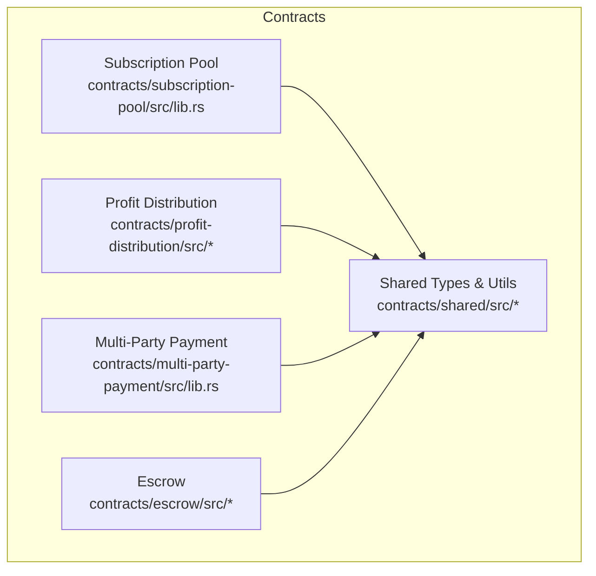
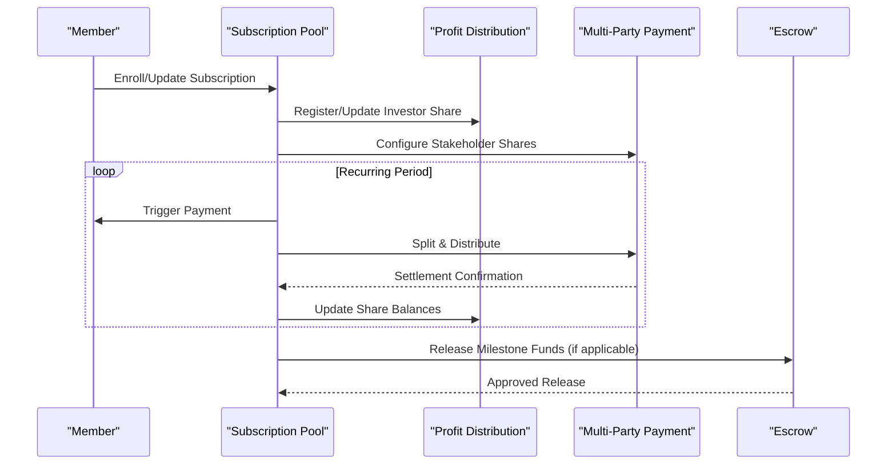
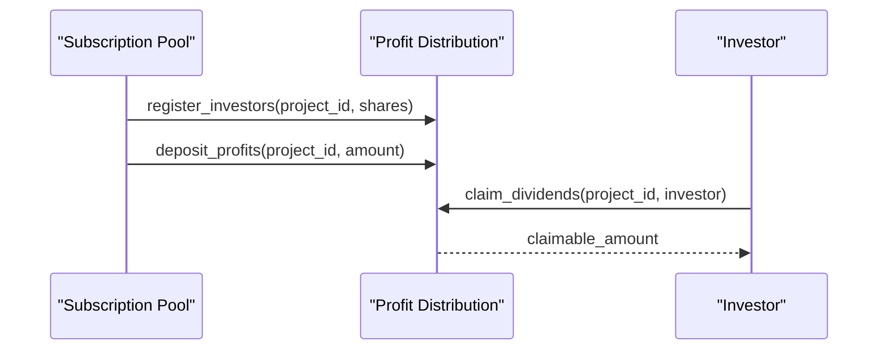
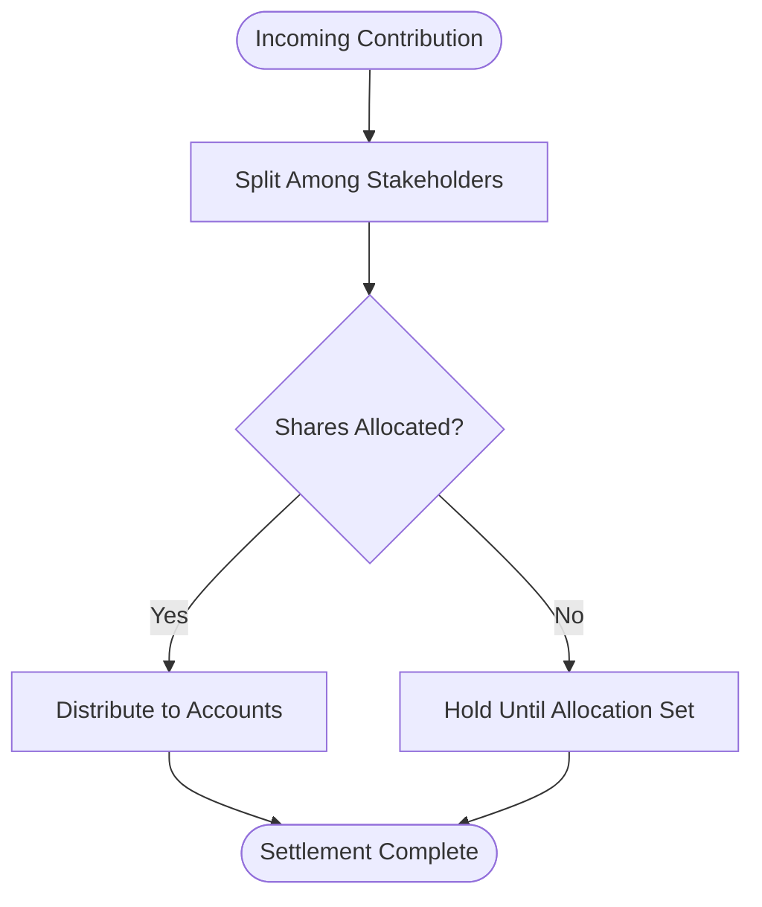
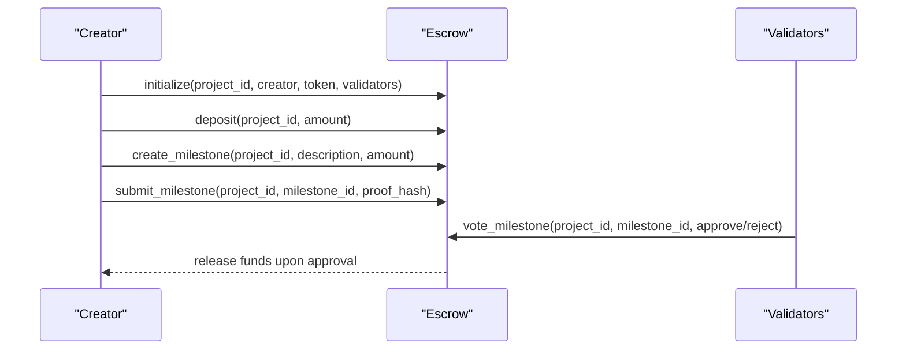
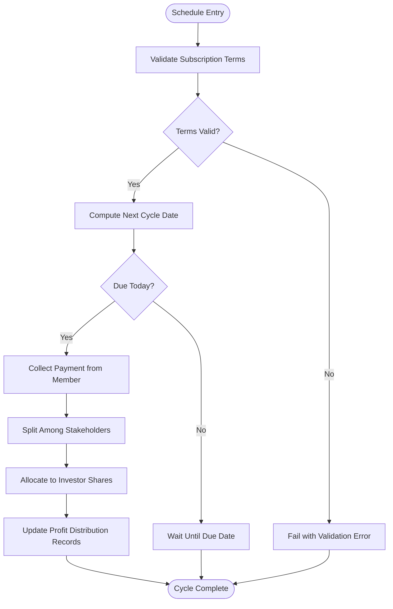
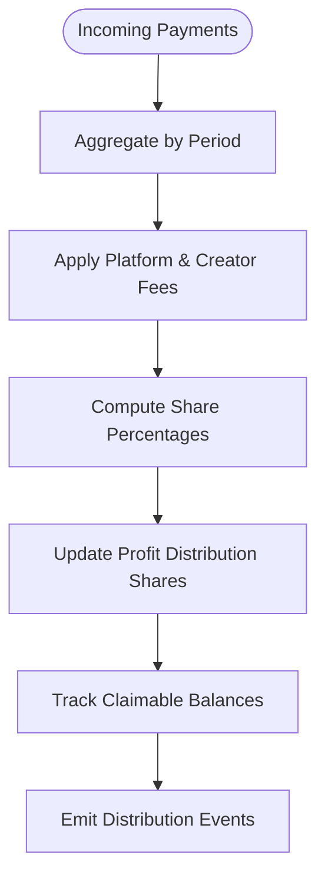
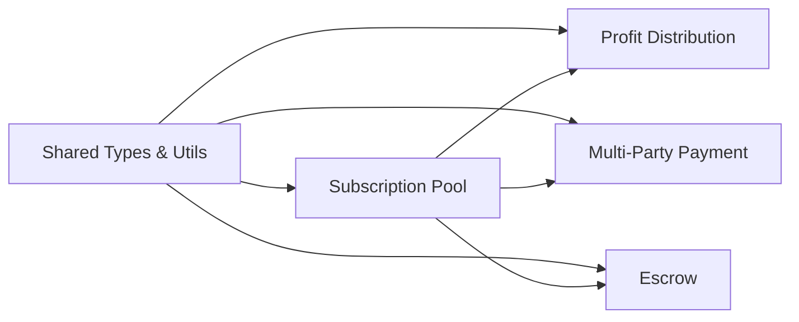

# Subscription Pool API

<cite>
**Referenced Files in This Document**
- [lib.rs](file://contracts/subscription-pool/src/lib.rs)
- [lib.rs](file://contracts/shared/src/lib.rs)
- [types.rs](file://contracts/shared/src/types.rs)
- [constants.rs](file://contracts/shared/src/constants.rs)
- [utils.rs](file://contracts/shared/src/utils.rs)
- [lib.rs](file://contracts/profit-distribution/src/lib.rs)
- [types.rs](file://contracts/profit-distribution/src/types.rs)
- [storage.rs](file://contracts/profit-distribution/src/storage.rs)
- [events.rs](file://contracts/profit-distribution/src/events.rs)
- [errors.rs](file://contracts/profit-distribution/src/errors.rs)
- [lib.rs](file://contracts/multi-party-payment/src/lib.rs)
- [lib.rs](file://contracts/escrow/src/lib.rs)
- [storage.rs](file://contracts/escrow/src/storage.rs)
- [validation.rs](file://contracts/escrow/src/validation.rs)
- [tests.rs](file://contracts/escrow/src/tests.rs)
</cite>

## Table of Contents
1. [Introduction](#introduction)
2. [Project Structure](#project-structure)
3. [Core Components](#core-components)
4. [Architecture Overview](#architecture-overview)
5. [Detailed Component Analysis](#detailed-component-analysis)
6. [Dependency Analysis](#dependency-analysis)
7. [Performance Considerations](#performance-considerations)
8. [Troubleshooting Guide](#troubleshooting-guide)
9. [Conclusion](#conclusion)

## Introduction
This document provides comprehensive API documentation for the Subscription Pool contract that powers recurring investment systems. It explains how pools are configured, how members enroll, how recurring payments are processed, and how withdrawals and payouts are calculated. It also covers integration points with supporting modules such as profit distribution and multi-party payment, along with validation logic, error handling, and operational safeguards.

The Subscription Pool is designed to automate regular investment contributions for ongoing projects, enabling predictable cash flows and streamlined portfolio management.

## Project Structure
The Subscription Pool lives under the contracts/subscription-pool module. Supporting shared types, constants, and utilities reside in contracts/shared. Profit distribution and multi-party payment modules provide complementary capabilities for investor share management and automated payment splitting. An escrow module offers milestone-based fund management and governance-aligned release mechanisms.

**Diagram sources**
- [lib.rs](file://contracts/subscription-pool/src/lib.rs#L1-L9)
- [lib.rs](file://contracts/shared/src/lib.rs#L1-L20)
- [lib.rs](file://contracts/profit-distribution/src/lib.rs#L1-L78)
- [lib.rs](file://contracts/multi-party-payment/src/lib.rs#L1-L9)
- [lib.rs](file://contracts/escrow/src/lib.rs#L1-L367)

**Section sources**
- [lib.rs](file://contracts/subscription-pool/src/lib.rs#L1-L9)
- [lib.rs](file://contracts/shared/src/lib.rs#L1-L20)

## Core Components
- Shared Types and Utilities
  - Common types: timestamps, amounts, basis points, fee configurations, token info, and user profiles.
  - Utility functions for percentage calculations, fee computation, timestamp verification, proportional share calculation, and basis points validation.
  - Constants for platform fees, funding goals, durations, minimum contributions, thresholds, and governance parameters.

- Profit Distribution
  - Registers investors with share percentages per project.
  - Accepts profit deposits and distributes them proportionally.
  - Supports dividend claiming and exposes investor share information.

- Multi-Party Payment
  - Provides infrastructure for multi-stakeholder setups with share percentages, automatic payment splitting, optional vesting, and party withdrawals.

- Escrow
  - Manages milestone-based fund locking and release with validator approvals.
  - Tracks total deposits, released amounts, and available balances.

**Section sources**
- [types.rs](file://contracts/shared/src/types.rs#L1-L41)
- [utils.rs](file://contracts/shared/src/utils.rs#L1-L59)
- [constants.rs](file://contracts/shared/src/constants.rs#L1-L40)
- [lib.rs](file://contracts/profit-distribution/src/lib.rs#L1-L78)
- [types.rs](file://contracts/profit-distribution/src/types.rs#L1-L18)
- [storage.rs](file://contracts/profit-distribution/src/storage.rs#L1-L33)
- [events.rs](file://contracts/profit-distribution/src/events.rs#L1-L21)
- [errors.rs](file://contracts/profit-distribution/src/errors.rs#L1-L16)
- [lib.rs](file://contracts/multi-party-payment/src/lib.rs#L1-L9)
- [lib.rs](file://contracts/escrow/src/lib.rs#L1-L367)

## Architecture Overview
The Subscription Pool orchestrates recurring contributions and integrates with:
- Profit Distribution for investor share management and dividend distribution.
- Multi-Party Payment for automated splits among stakeholders.
- Escrow for milestone-aligned fund releases and governance-backed approvals.

**Diagram sources**
- [lib.rs](file://contracts/subscription-pool/src/lib.rs#L1-L9)
- [lib.rs](file://contracts/profit-distribution/src/lib.rs#L1-L78)
- [lib.rs](file://contracts/multi-party-payment/src/lib.rs#L1-L9)
- [lib.rs](file://contracts/escrow/src/lib.rs#L1-L367)

## Detailed Component Analysis

### Subscription Pool API Surface
The Subscription Pool manages recurring investment pools, member enrollment, subscription lifecycle, and withdrawal/payout calculations. The following APIs define the contract’s capabilities:

- Pool Lifecycle
  - Create a new recurring investment pool with schedule parameters and stakeholder configuration.
  - Close or finalize a pool to enable final distributions and exits.

- Member Management
  - Enroll a new member with subscription terms and payment method.
  - Update subscription terms (e.g., frequency, amount).
  - Deactivate or cancel membership.

- Recurring Payment Processing
  - Schedule and execute recurring payments according to subscription terms.
  - Aggregate incoming payments and allocate to investor shares.
  - Apply platform and creator fees as per configuration.

- Payout and Withdrawal
  - Calculate proportional payouts based on investor shares.
  - Support partial and full withdrawals with eligibility checks.
  - Rebalance portfolio contributions as needed.

- Administrative Controls
  - Override payment failures for administrative purposes.
  - Pause/unpause subscriptions during maintenance windows.
  - Adjust fee rates and pool caps with governance alignment.

Note: The current Subscription Pool module indicates planned functionality. The following API definitions reflect the intended design derived from shared types and supporting modules.

**Section sources**
- [lib.rs](file://contracts/subscription-pool/src/lib.rs#L1-L9)
- [types.rs](file://contracts/shared/src/types.rs#L1-L41)
- [utils.rs](file://contracts/shared/src/utils.rs#L1-L59)
- [constants.rs](file://contracts/shared/src/constants.rs#L1-L40)

### Profit Distribution Integration
Profit Distribution supports investor share registration and proportional distribution aligned with Subscription Pool allocations.

- Initialization
  - initialize(env, project_id, token): Initializes distribution for a project.

- Investor Registration
  - register_investors(env, project_id, investors_map): Registers investors with share percentages.

- Profit Deposit and Distribution
  - deposit_profits(env, project_id, amount): Adds profits for distribution.
  - get_investor_share(env, project_id, investor): Retrieves investor share details.

- Dividend Claiming
  - claim_dividends(env, project_id, investor): Allows investor to claim dividends.

**Diagram sources**
- [lib.rs](file://contracts/profit-distribution/src/lib.rs#L36-L77)
- [types.rs](file://contracts/profit-distribution/src/types.rs#L1-L18)
- [storage.rs](file://contracts/profit-distribution/src/storage.rs#L1-L33)
- [events.rs](file://contracts/profit-distribution/src/events.rs#L1-L21)

**Section sources**
- [lib.rs](file://contracts/profit-distribution/src/lib.rs#L1-L78)
- [types.rs](file://contracts/profit-distribution/src/types.rs#L1-L18)
- [storage.rs](file://contracts/profit-distribution/src/storage.rs#L1-L33)
- [events.rs](file://contracts/profit-distribution/src/events.rs#L1-L21)
- [errors.rs](file://contracts/profit-distribution/src/errors.rs#L1-L16)

### Multi-Party Payment Integration
Multi-Party Payment enables automatic splitting of incoming contributions among stakeholders with configurable shares and optional vesting.

- Setup and Splitting
  - register_stakeholders and split_payments: Configure shares and distribute incoming funds.
  - Optional vesting schedules and party withdrawals.

**Diagram sources**
- [lib.rs](file://contracts/multi-party-payment/src/lib.rs#L1-L9)

**Section sources**
- [lib.rs](file://contracts/multi-party-payment/src/lib.rs#L1-L9)

### Escrow and Milestone Alignment
Escrow provides milestone-based fund management that aligns with Subscription Pool payouts. It tracks total deposits, released amounts, and available balances, and supports governance-backed approvals.

- Key Functions
  - initialize(project_id, creator, token, validators)
  - deposit(project_id, amount)
  - create_milestone(project_id, description, amount)
  - submit_milestone(project_id, milestone_id, proof_hash)
  - vote_milestone(project_id, milestone_id, voter, approve)
  - get_escrow(project_id)
  - get_milestone(project_id, milestone_id)
  - get_total_milestone_amount(project_id)
  - get_available_balance(project_id)

**Diagram sources**
- [lib.rs](file://contracts/escrow/src/lib.rs#L24-L346)
- [storage.rs](file://contracts/escrow/src/storage.rs#L1-L144)
- [validation.rs](file://contracts/escrow/src/validation.rs#L1-L13)

**Section sources**
- [lib.rs](file://contracts/escrow/src/lib.rs#L1-L367)
- [storage.rs](file://contracts/escrow/src/storage.rs#L1-L144)
- [validation.rs](file://contracts/escrow/src/validation.rs#L1-L13)
- [tests.rs](file://contracts/escrow/src/tests.rs#L1-L362)

### Subscription Scheduling Algorithms
Recurring payments are scheduled based on subscription terms. The algorithm below outlines a typical flow:

[No sources needed since this diagram shows conceptual workflow, not actual code structure]

### Payment Aggregation and Share Tracking
Payment aggregation consolidates incoming contributions and updates investor share records. The process ensures accurate proportional distribution and maintains claimable balances.

[No sources needed since this diagram shows conceptual workflow, not actual code structure]

### Member Eligibility and Validation
Eligibility checks ensure only qualified members participate. Typical validations include:
- Minimum contribution thresholds
- Verified user profiles
- Compliance with funding goal ranges
- Validator and governance thresholds

These checks leverage shared constants and utility functions for consistent enforcement.

**Section sources**
- [constants.rs](file://contracts/shared/src/constants.rs#L1-L40)
- [utils.rs](file://contracts/shared/src/utils.rs#L1-L59)

### Error Handling and Administrative Overrides
Administrative controls and error handling are essential for robust operations:
- Administrative overrides for failed payments under strict conditions
- Cancellation and pause mechanisms during maintenance
- Governance-aligned adjustments to fee rates and pool caps

Profit Distribution defines a comprehensive error set covering initialization, share allocation, insufficient balances, and unauthorized actions.

**Section sources**
- [errors.rs](file://contracts/profit-distribution/src/errors.rs#L1-L16)

## Dependency Analysis
The Subscription Pool depends on shared types and utilities for consistent data modeling and validation. It integrates with Profit Distribution for investor share management and Multi-Party Payment for automated splits. Escrow provides milestone-aligned fund release and governance-backed approvals.

**Diagram sources**
- [lib.rs](file://contracts/shared/src/lib.rs#L1-L20)
- [lib.rs](file://contracts/subscription-pool/src/lib.rs#L1-L9)
- [lib.rs](file://contracts/profit-distribution/src/lib.rs#L1-L78)
- [lib.rs](file://contracts/multi-party-payment/src/lib.rs#L1-L9)
- [lib.rs](file://contracts/escrow/src/lib.rs#L1-L367)

**Section sources**
- [lib.rs](file://contracts/shared/src/lib.rs#L1-L20)
- [lib.rs](file://contracts/subscription-pool/src/lib.rs#L1-L9)

## Performance Considerations
- Efficient storage keys and minimal ledger reads improve throughput for recurring cycles.
- Batch processing of payments and share updates reduces gas costs.
- Proportional calculations using basis points prevent precision loss and overflow.
- Event-driven distribution minimizes repeated computations.

[No sources needed since this section provides general guidance]

## Troubleshooting Guide
Common issues and resolutions:
- Initialization failures: Ensure minimum validator count and unique project IDs.
- Insufficient funds: Verify escrow availability and milestone allocations.
- Share misalignment: Confirm total shares equal 100% and investor entries are present.
- Unauthorized actions: Validate caller authorization and validator permissions.
- Payment failures: Use administrative overrides sparingly and log exceptions.

**Section sources**
- [errors.rs](file://contracts/profit-distribution/src/errors.rs#L1-L16)
- [lib.rs](file://contracts/escrow/src/lib.rs#L31-L70)
- [tests.rs](file://contracts/escrow/src/tests.rs#L54-L78)

## Conclusion
The Subscription Pool contract provides a robust foundation for automating recurring investments. By integrating with Profit Distribution, Multi-Party Payment, and Escrow, it ensures predictable cash flows, fair share allocation, and governance-aligned fund releases. Adhering to validation logic, error handling, and administrative controls guarantees reliability and transparency across the lifecycle of recurring investment pools.