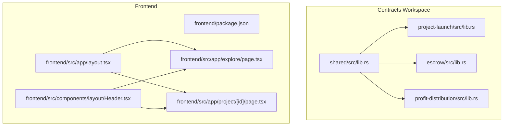
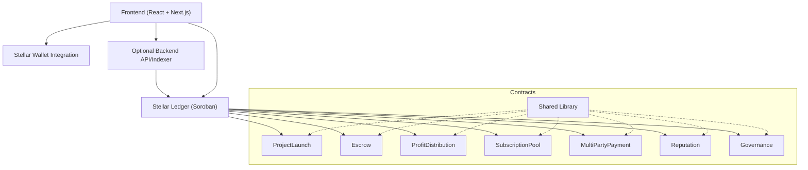
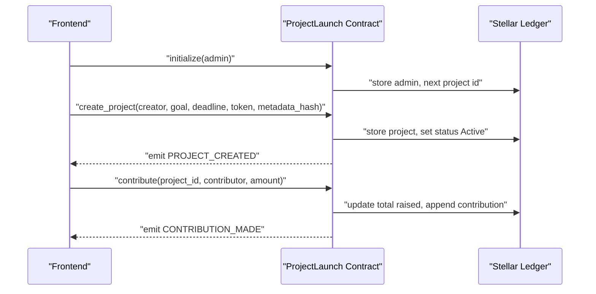
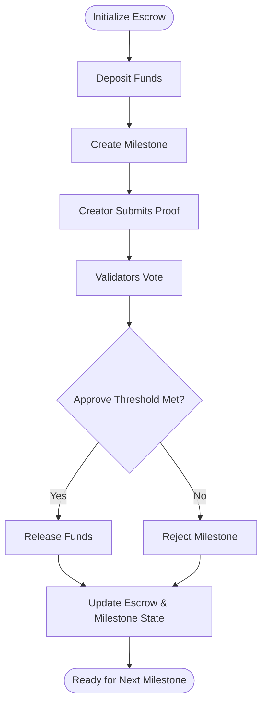
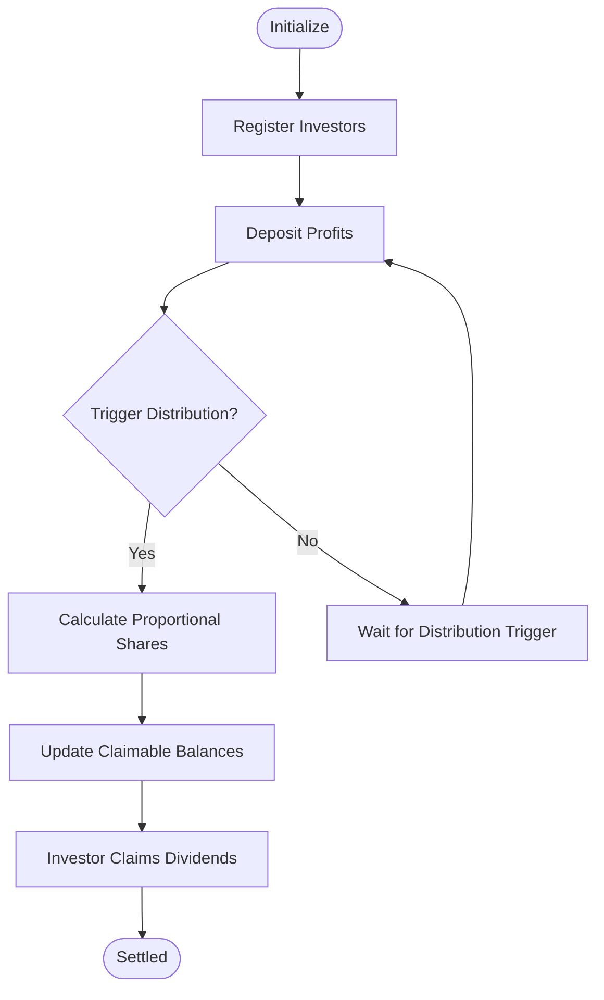
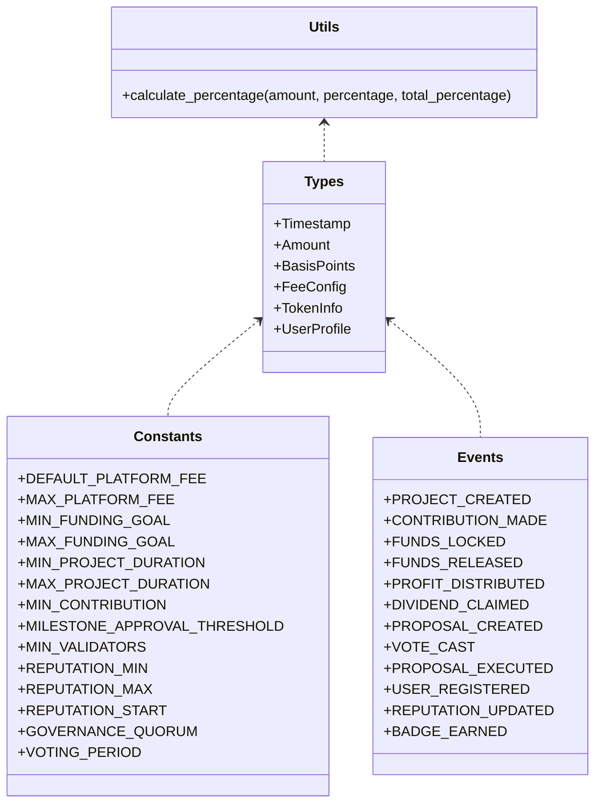
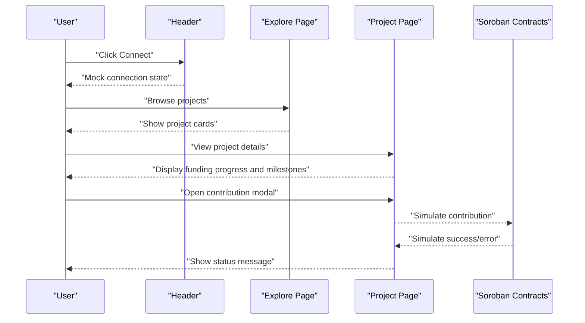
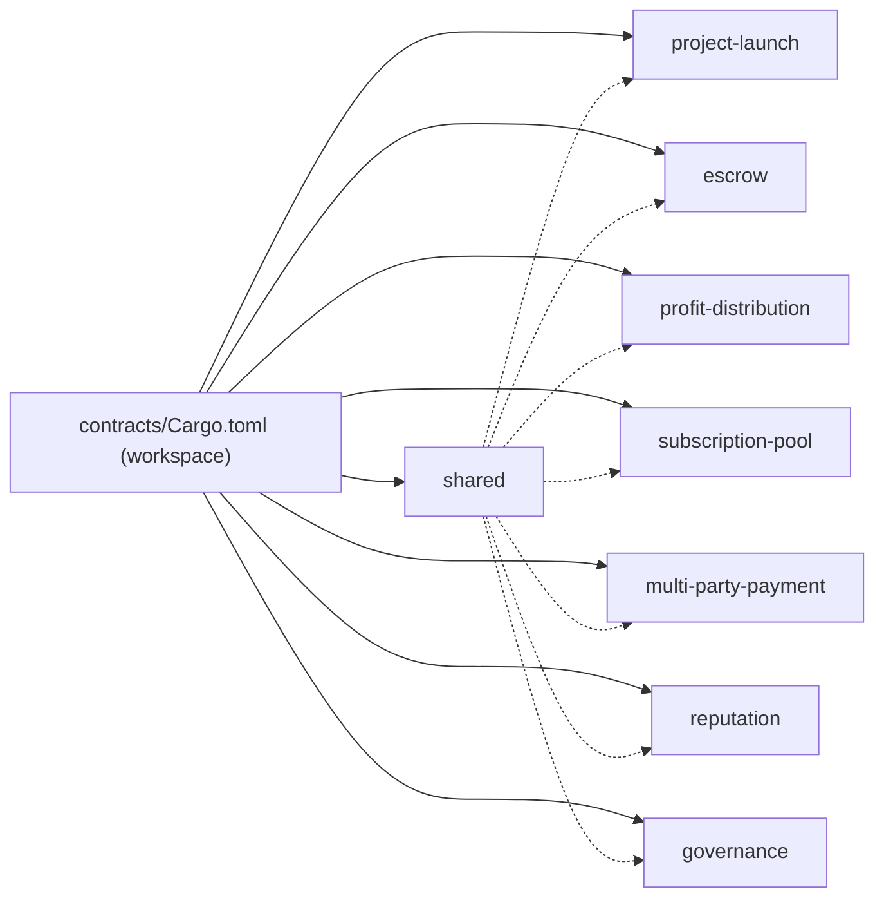

# Architecture Overview

<cite>
**Referenced Files in This Document**
- [README.md](file://README.md)
- [contracts/README.md](file://contracts/README.md)
- [contracts/Cargo.toml](file://contracts/Cargo.toml)
- [contracts/project-launch/src/lib.rs](file://contracts/project-launch/src/lib.rs)
- [contracts/escrow/src/lib.rs](file://contracts/escrow/src/lib.rs)
- [contracts/profit-distribution/src/lib.rs](file://contracts/profit-distribution/src/lib.rs)
- [contracts/shared/src/lib.rs](file://contracts/shared/src/lib.rs)
- [contracts/shared/src/types.rs](file://contracts/shared/src/types.rs)
- [contracts/shared/src/events.rs](file://contracts/shared/src/events.rs)
- [contracts/shared/src/constants.rs](file://contracts/shared/src/constants.rs)
- [frontend/package.json](file://frontend/package.json)
- [frontend/src/app/layout.tsx](file://frontend/src/app/layout.tsx)
- [frontend/src/app/explore/page.tsx](file://frontend/src/app/explore/page.tsx)
- [frontend/src/app/project/[id]/page.tsx](file://frontend/src/app/project/[id]/page.tsx)
- [frontend/src/components/layout/Header.tsx](file://frontend/src/components/layout/Header.tsx)
</cite>

## Table of Contents
1. [Introduction](#introduction)
2. [Project Structure](#project-structure)
3. [Core Components](#core-components)
4. [Architecture Overview](#architecture-overview)
5. [Detailed Component Analysis](#detailed-component-analysis)
6. [Dependency Analysis](#dependency-analysis)
7. [Performance Considerations](#performance-considerations)
8. [Troubleshooting Guide](#troubleshooting-guide)
9. [Conclusion](#conclusion)
10. [Appendices](#appendices)

## Introduction
NovaFund is a decentralized micro-investment platform built on the Stellar blockchain using Soroban smart contracts. It enables creators to launch funding campaigns, investors to contribute, and smart contracts to manage escrow, milestone-based fund releases, profit distributions, and governance. The frontend is a React application that integrates with Stellar wallets and displays project information, funding progress, and milestone timelines.

The system emphasizes:
- Modular contract architecture with shared libraries
- Event-driven frontend design for real-time updates
- Separation of concerns across contracts and frontend
- Scalable infrastructure with optional backend services

## Project Structure
The repository is organized into two primary areas:
- contracts/: Soroban smart contracts grouped by domain (project-launch, escrow, profit-distribution, subscription-pool, multi-party-payment, reputation, governance) plus a shared library
- frontend/: React application with Next.js, TypeScript, and Tailwind CSS

**Diagram sources**
- [contracts/Cargo.toml](file://contracts/Cargo.toml#L1-L13)
- [contracts/shared/src/lib.rs](file://contracts/shared/src/lib.rs#L1-L20)
- [contracts/project-launch/src/lib.rs](file://contracts/project-launch/src/lib.rs#L1-L363)
- [contracts/escrow/src/lib.rs](file://contracts/escrow/src/lib.rs#L1-L367)
- [contracts/profit-distribution/src/lib.rs](file://contracts/profit-distribution/src/lib.rs#L1-L78)
- [frontend/package.json](file://frontend/package.json#L1-L32)
- [frontend/src/app/layout.tsx](file://frontend/src/app/layout.tsx#L1-L29)
- [frontend/src/app/explore/page.tsx](file://frontend/src/app/explore/page.tsx#L1-L239)
- [frontend/src/app/project/[id]/page.tsx](file://frontend/src/app/project/[id]/page.tsx#L1-L384)
- [frontend/src/components/layout/Header.tsx](file://frontend/src/components/layout/Header.tsx#L1-L20)

**Section sources**
- [README.md](file://README.md#L260-L313)
- [contracts/README.md](file://contracts/README.md#L1-L334)
- [frontend/package.json](file://frontend/package.json#L1-L32)

## Core Components
- ProjectLaunch: Manages project creation, funding goals, deadlines, and contributions. Emits events for project creation and contributions.
- Escrow: Holds funds and releases them based on milestone approvals by validators.
- ProfitDistribution: Handles investor share registration, profit deposits, and dividend claims.
- Shared Library: Provides common types, errors, events, utilities, and constants used across contracts.
- Frontend: React application with Next.js routing, UI components, and mock interactions for wallet and project participation.

Key integration points:
- Contracts emit structured events consumed by the frontend to update UI in real time.
- Shared constants and types ensure consistent behavior across contracts.
- Frontend components render project details, funding progress, and milestone timelines.

**Section sources**
- [contracts/README.md](file://contracts/README.md#L107-L280)
- [contracts/shared/src/events.rs](file://contracts/shared/src/events.rs#L1-L31)
- [contracts/shared/src/constants.rs](file://contracts/shared/src/constants.rs#L1-L40)
- [frontend/src/app/explore/page.tsx](file://frontend/src/app/explore/page.tsx#L1-L239)
- [frontend/src/app/project/[id]/page.tsx](file://frontend/src/app/project/[id]/page.tsx#L1-L384)

## Architecture Overview
High-level system architecture:
- Frontend (React + TypeScript): Renders project listings, details, and funding modals; integrates with Stellar wallets.
- Stellar Network Layer (Soroban): Executes smart contracts for project lifecycle, escrow, profit distribution, and governance.
- Data & Storage Layer: Off-chain metadata stored on IPFS; on-chain state managed by contracts; optional backend for indexing and APIs.

**Diagram sources**
- [README.md](file://README.md#L101-L136)
- [contracts/Cargo.toml](file://contracts/Cargo.toml#L1-L13)
- [contracts/shared/src/lib.rs](file://contracts/shared/src/lib.rs#L1-L20)

## Detailed Component Analysis

### ProjectLaunch Contract
Responsibilities:
- Initialize with admin
- Create projects with funding goals, deadlines, and token support
- Track contributions and enforce minimum thresholds and deadlines
- Emit events for project creation and contributions

**Diagram sources**
- [contracts/project-launch/src/lib.rs](file://contracts/project-launch/src/lib.rs#L74-L248)
- [contracts/shared/src/events.rs](file://contracts/shared/src/events.rs#L3-L11)

**Section sources**
- [contracts/project-launch/src/lib.rs](file://contracts/project-launch/src/lib.rs#L74-L248)
- [contracts/shared/src/events.rs](file://contracts/shared/src/events.rs#L3-L11)

### Escrow Contract
Responsibilities:
- Initialize escrow with validators and token
- Deposit funds into escrow
- Create milestones with amounts and descriptions
- Handle milestone submissions and validator approvals/rejections
- Release funds upon approval and maintain availability tracking

**Diagram sources**
- [contracts/escrow/src/lib.rs](file://contracts/escrow/src/lib.rs#L24-L346)
- [contracts/shared/src/constants.rs](file://contracts/shared/src/constants.rs#L24-L28)

**Section sources**
- [contracts/escrow/src/lib.rs](file://contracts/escrow/src/lib.rs#L24-L346)
- [contracts/shared/src/constants.rs](file://contracts/shared/src/constants.rs#L24-L28)

### ProfitDistribution Contract
Responsibilities:
- Register investors with share percentages
- Deposit profits for distribution
- Distribute returns proportionally
- Allow manual dividend claims
- Track claimable and claimed amounts

**Diagram sources**
- [contracts/profit-distribution/src/lib.rs](file://contracts/profit-distribution/src/lib.rs#L35-L78)

**Section sources**
- [contracts/profit-distribution/src/lib.rs](file://contracts/profit-distribution/src/lib.rs#L35-L78)

### Shared Library
Responsibilities:
- Define common types (timestamps, amounts, basis points, fee config, token info, user profiles)
- Define common errors and events
- Provide constants for platform policies
- Offer utility functions (e.g., percentage calculations)

**Diagram sources**
- [contracts/shared/src/types.rs](file://contracts/shared/src/types.rs#L1-L41)
- [contracts/shared/src/constants.rs](file://contracts/shared/src/constants.rs#L1-L40)
- [contracts/shared/src/events.rs](file://contracts/shared/src/events.rs#L1-L31)
- [contracts/shared/src/lib.rs](file://contracts/shared/src/lib.rs#L16-L20)

**Section sources**
- [contracts/shared/src/lib.rs](file://contracts/shared/src/lib.rs#L1-L20)
- [contracts/shared/src/types.rs](file://contracts/shared/src/types.rs#L1-L41)
- [contracts/shared/src/events.rs](file://contracts/shared/src/events.rs#L1-L31)
- [contracts/shared/src/constants.rs](file://contracts/shared/src/constants.rs#L1-L40)

### Frontend Components and Integration Patterns
- Layout and Navigation: Root layout composes header and footer; header includes a connect button.
- Explore Page: Renders a grid of projects with search and sorting; uses mock data for demonstration.
- Project Page: Displays funding progress, milestone timeline, and contribution modal; simulates contribution flow.
- Wallet Integration: Header includes a connect button; in a real deployment, this would integrate with Freighter or XUMM.

**Diagram sources**
- [frontend/src/components/layout/Header.tsx](file://frontend/src/components/layout/Header.tsx#L1-L20)
- [frontend/src/app/explore/page.tsx](file://frontend/src/app/explore/page.tsx#L110-L134)
- [frontend/src/app/project/[id]/page.tsx](file://frontend/src/app/project/[id]/page.tsx#L140-L166)

**Section sources**
- [frontend/src/app/layout.tsx](file://frontend/src/app/layout.tsx#L1-L29)
- [frontend/src/components/layout/Header.tsx](file://frontend/src/components/layout/Header.tsx#L1-L20)
- [frontend/src/app/explore/page.tsx](file://frontend/src/app/explore/page.tsx#L1-L239)
- [frontend/src/app/project/[id]/page.tsx](file://frontend/src/app/project/[id]/page.tsx#L1-L384)

## Dependency Analysis
Workspace composition and relationships:
- Workspace members include all seven contracts plus the shared library.
- Contracts depend on shared types, errors, events, and constants.
- Frontend depends on Next.js, React, and UI libraries; wallet integration is conceptual.

**Diagram sources**
- [contracts/Cargo.toml](file://contracts/Cargo.toml#L1-L13)

**Section sources**
- [contracts/Cargo.toml](file://contracts/Cargo.toml#L1-L13)

## Performance Considerations
- WASM Optimization: Release profile configured for size optimization and LTO.
- Storage Efficiency: Contracts minimize persistent writes and use efficient data structures.
- Event-Driven Updates: Frontend reacts to on-chain events to reduce polling overhead.
- Gas Optimization: Shared constants define thresholds and limits to constrain transaction costs.

[No sources needed since this section provides general guidance]

## Troubleshooting Guide
Common issues and resolutions:
- Contract Initialization Failures: Ensure admin-only functions are called by authorized addresses and that contracts are not re-initialized.
- Invalid Inputs: Validate funding goals, deadlines, and contribution amounts against shared constants.
- Escrow Disputes: Confirm validator thresholds and voting procedures meet required approval percentages.
- Frontend Mock Interactions: Replace mock handlers with real wallet and contract invocation flows.

**Section sources**
- [contracts/project-launch/src/lib.rs](file://contracts/project-launch/src/lib.rs#L74-L85)
- [contracts/shared/src/constants.rs](file://contracts/shared/src/constants.rs#L9-L22)
- [contracts/escrow/src/lib.rs](file://contracts/escrow/src/lib.rs#L220-L307)

## Conclusion
NovaFund’s architecture leverages a modular contract design with a shared library, event-driven frontend, and clear separation of concerns. The system integrates seamlessly with the Stellar network, enabling trustless project funding, escrow management, and profit distribution. The frontend provides an intuitive interface for discovering projects, tracking funding progress, and participating in milestone-based releases.

[No sources needed since this section summarizes without analyzing specific files]

## Appendices

### Technology Stack and Compatibility
- Smart Contracts: Rust 1.75+, Soroban SDK 21.0.0, WASM target
- Frontend: Next.js 14.1.0, React 18+, TypeScript 5.0+, Tailwind CSS
- Wallet Integration: Freighter, XUMM (conceptual)
- Optional Backend: REST/GraphQL API, PostgreSQL, IPFS

**Section sources**
- [README.md](file://README.md#L169-L198)
- [frontend/package.json](file://frontend/package.json#L11-L29)
- [contracts/Cargo.toml](file://contracts/Cargo.toml#L21-L38)