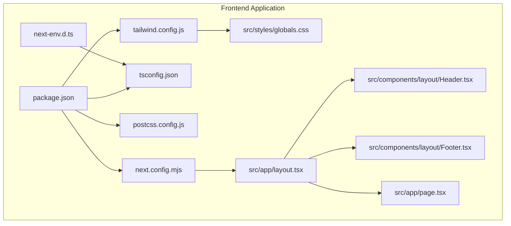
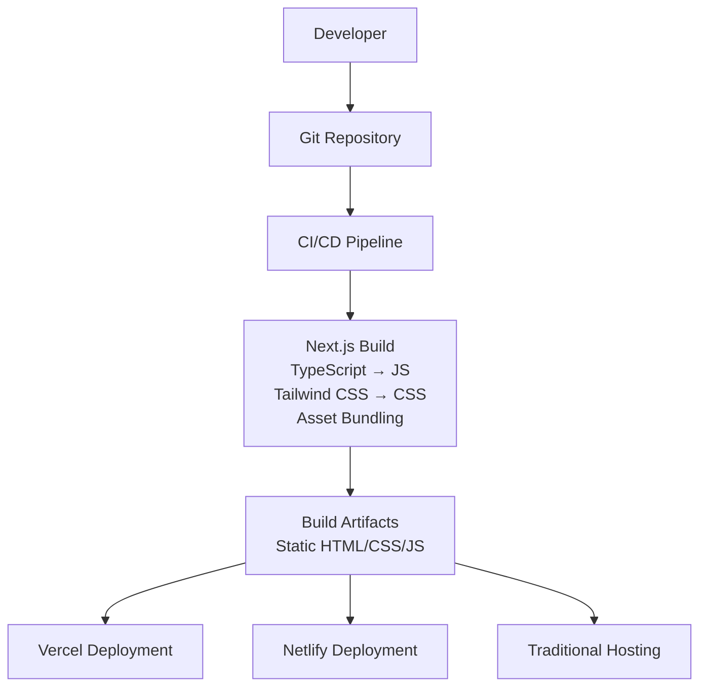
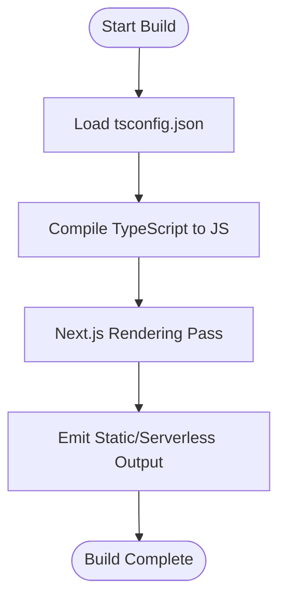
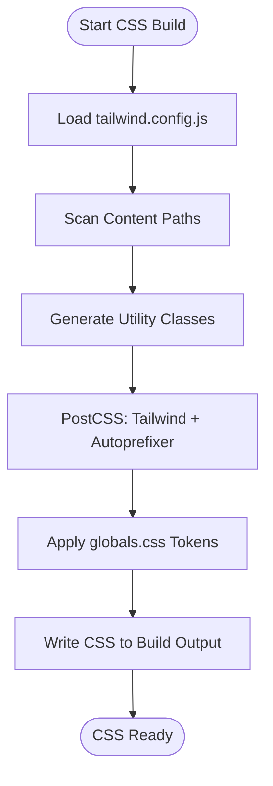
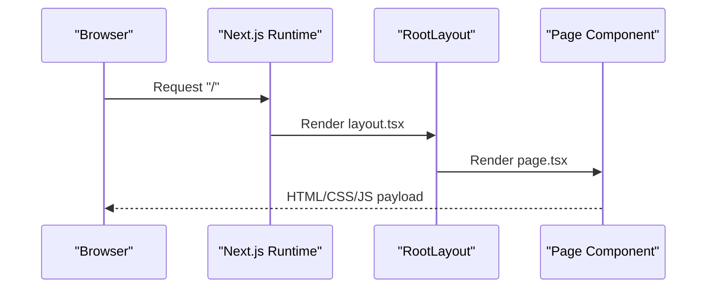
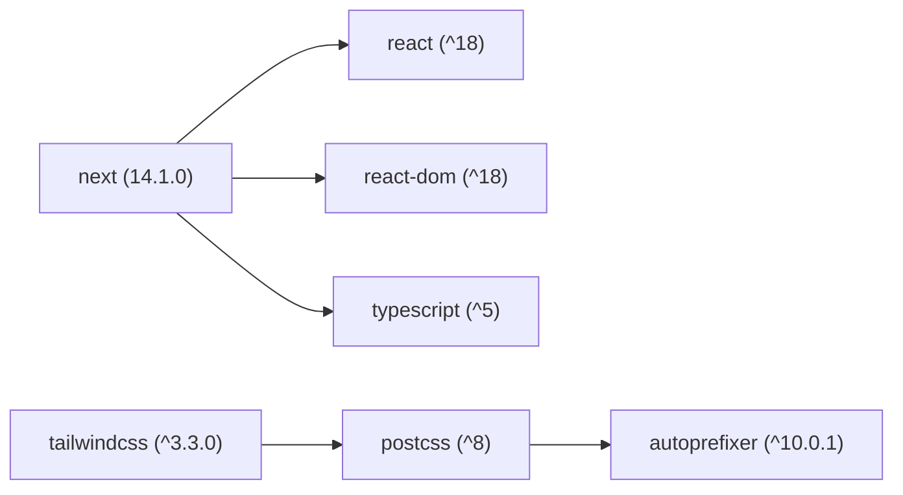

# Frontend Deployment

<cite>
**Referenced Files in This Document**
- [package.json](file://frontend/package.json)
- [next.config.mjs](file://frontend/next.config.mjs)
- [tsconfig.json](file://frontend/tsconfig.json)
- [postcss.config.js](file://frontend/postcss.config.js)
- [tailwind.config.js](file://frontend/tailwind.config.js)
- [globals.css](file://frontend/src/styles/globals.css)
- [layout.tsx](file://frontend/src/app/layout.tsx)
- [page.tsx](file://frontend/src/app/page.tsx)
- [Header.tsx](file://frontend/src/components/layout/Header.tsx)
- [Footer.tsx](file://frontend/src/components/layout/Footer.tsx)
- [next-env.d.ts](file://frontend/next-env.d.ts)
- [README.md](file://README.md)
</cite>

## Table of Contents
1. [Introduction](#introduction)
2. [Project Structure](#project-structure)
3. [Core Components](#core-components)
4. [Architecture Overview](#architecture-overview)
5. [Detailed Component Analysis](#detailed-component-analysis)
6. [Dependency Analysis](#dependency-analysis)
7. [Performance Considerations](#performance-considerations)
8. [Troubleshooting Guide](#troubleshooting-guide)
9. [Rollout and Release Management](#rollout-and-release-management)
10. [Security Considerations](#security-considerations)
11. [Conclusion](#conclusion)
12. [Appendices](#appendices)

## Introduction
This document provides a comprehensive guide to deploying the NovaFund React/Next.js frontend across multiple platforms. It covers the build pipeline (TypeScript compilation, Tailwind CSS optimization, and asset bundling), deployment strategies for Vercel, Netlify, and traditional hosts, environment configuration, CI/CD automation, performance optimization, troubleshooting, release management, and security hardening.

## Project Structure
The frontend is a Next.js application under the frontend directory. Key configuration files define the build and runtime behavior, while the app directory implements routing and layout. Tailwind CSS is configured for utility-first styling, and TypeScript enforces type safety during development and build.

**Diagram sources**
- [package.json](file://frontend/package.json#L1-L32)
- [next.config.mjs](file://frontend/next.config.mjs#L1-L7)
- [tsconfig.json](file://frontend/tsconfig.json#L1-L28)
- [postcss.config.js](file://frontend/postcss.config.js#L1-L7)
- [tailwind.config.js](file://frontend/tailwind.config.js#L1-L48)
- [globals.css](file://frontend/src/styles/globals.css#L1-L24)
- [layout.tsx](file://frontend/src/app/layout.tsx#L1-L29)
- [page.tsx](file://frontend/src/app/page.tsx#L1-L16)
- [Header.tsx](file://frontend/src/components/layout/Header.tsx#L1-L20)
- [Footer.tsx](file://frontend/src/components/layout/Footer.tsx#L1-L15)
- [next-env.d.ts](file://frontend/next-env.d.ts#L1-L6)

**Section sources**
- [package.json](file://frontend/package.json#L1-L32)
- [next.config.mjs](file://frontend/next.config.mjs#L1-L7)
- [tsconfig.json](file://frontend/tsconfig.json#L1-L28)
- [postcss.config.js](file://frontend/postcss.config.js#L1-L7)
- [tailwind.config.js](file://frontend/tailwind.config.js#L1-L48)
- [globals.css](file://frontend/src/styles/globals.css#L1-L24)
- [layout.tsx](file://frontend/src/app/layout.tsx#L1-L29)
- [page.tsx](file://frontend/src/app/page.tsx#L1-L16)
- [Header.tsx](file://frontend/src/components/layout/Header.tsx#L1-L20)
- [Footer.tsx](file://frontend/src/components/layout/Footer.tsx#L1-L15)
- [next-env.d.ts](file://frontend/next-env.d.ts#L1-L6)

## Core Components
- Build scripts and toolchain:
  - Scripts for development, production build, production start, and linting are defined in the package manifest.
  - TypeScript configuration enables strict mode, preserves JSX, and configures module resolution for bundler environments.
  - PostCSS and Tailwind CSS are configured for CSS processing and utility generation.
- Runtime configuration:
  - Next.js configuration enables React Strict Mode.
  - Global CSS integrates Tailwind directives and theme tokens.
  - App layout defines metadata, font loading, and page composition.

**Section sources**
- [package.json](file://frontend/package.json#L5-L10)
- [tsconfig.json](file://frontend/tsconfig.json#L2-L24)
- [postcss.config.js](file://frontend/postcss.config.js#L1-L7)
- [tailwind.config.js](file://frontend/tailwind.config.js#L1-L48)
- [next.config.mjs](file://frontend/next.config.mjs#L2-L4)
- [globals.css](file://frontend/src/styles/globals.css#L1-L24)
- [layout.tsx](file://frontend/src/app/layout.tsx#L9-L28)

## Architecture Overview
The deployment architecture centers on Next.js’s static export and serverless capabilities. The build pipeline compiles TypeScript, processes CSS with Tailwind and PostCSS, bundles assets, and generates optimized output. Deployment targets include Vercel (serverless), Netlify (static site), and traditional hosts (static file serving).

[No sources needed since this diagram shows conceptual workflow, not actual code structure]

## Detailed Component Analysis

### Build Pipeline: TypeScript Compilation
- Strict type checking and preserved JSX are enabled for correctness and compatibility with Next.js rendering modes.
- Module resolution uses the bundler setting to align with Next’s compilation model.
- Path aliases simplify imports within the codebase.

**Diagram sources**
- [tsconfig.json](file://frontend/tsconfig.json#L2-L24)

**Section sources**
- [tsconfig.json](file://frontend/tsconfig.json#L2-L24)

### CSS Pipeline: Tailwind and PostCSS
- Tailwind scans the configured content paths and generates utility classes.
- PostCSS applies Tailwind and Autoprefixer to produce vendor-prefixed CSS.
- Global CSS integrates Tailwind directives and CSS variables for theme tokens.

**Diagram sources**
- [tailwind.config.js](file://frontend/tailwind.config.js#L1-L48)
- [postcss.config.js](file://frontend/postcss.config.js#L1-L7)
- [globals.css](file://frontend/src/styles/globals.css#L1-L24)

**Section sources**
- [tailwind.config.js](file://frontend/tailwind.config.js#L3-L6)
- [postcss.config.js](file://frontend/postcss.config.js#L1-L7)
- [globals.css](file://frontend/src/styles/globals.css#L1-L24)

### Asset Bundling and Routing
- Next.js routes are defined under the app directory; the root route is implemented in the page component.
- The layout composes header, footer, and page content, applying global styles and metadata.

**Diagram sources**
- [layout.tsx](file://frontend/src/app/layout.tsx#L14-L28)
- [page.tsx](file://frontend/src/app/page.tsx#L1-L16)

**Section sources**
- [layout.tsx](file://frontend/src/app/layout.tsx#L1-L29)
- [page.tsx](file://frontend/src/app/page.tsx#L1-L16)
- [Header.tsx](file://frontend/src/components/layout/Header.tsx#L1-L20)
- [Footer.tsx](file://frontend/src/components/layout/Footer.tsx#L1-L15)

### Environment Configuration
- Environment variables are managed via a repository template and consumed by the build and runtime.
- Next.js supports environment variables prefixed appropriately for client/server contexts.

Practical guidance:
- Define environment variables in your deployment platform’s settings.
- Reference variables in your build scripts and runtime code as needed.

**Section sources**
- [README.md](file://README.md#L260-L313)

### CI/CD Automation
- GitHub Actions workflows exist for continuous integration and deployment automation.
- Configure secrets and environment-specific variables in your repository settings.

Practical guidance:
- Extend the existing workflow to run the Next.js build script and deploy artifacts to your chosen platform.

**Section sources**
- [README.md](file://README.md#L304-L307)

## Dependency Analysis
The frontend depends on Next.js, React, Tailwind CSS, and related tooling. The build system relies on PostCSS and TypeScript. The app layout composes reusable UI components.

**Diagram sources**
- [package.json](file://frontend/package.json#L11-L30)

**Section sources**
- [package.json](file://frontend/package.json#L11-L30)

## Performance Considerations
- Code splitting: Next.js automatically splits routes and pages; keep components modular to leverage automatic code splitting.
- Image optimization: Use Next.js’s built-in image optimization features for responsive images and modern formats.
- CDN configuration: Deploy to platforms with integrated CDNs (e.g., Vercel) to maximize global caching and delivery speed.
- Bundle size: Minimize third-party dependencies, remove unused CSS, and avoid heavy polyfills.

[No sources needed since this section provides general guidance]

## Troubleshooting Guide
Common build and deployment issues:
- TypeScript errors: Review strict mode and JSX preservation settings; fix type mismatches flagged by the compiler.
- Tailwind CSS not applied: Verify content paths in the Tailwind configuration and ensure global CSS is imported.
- Next.js runtime warnings: Enable Strict Mode selectively if encountering issues; confirm environment variable availability.
- Asset path issues: Confirm static asset placement and base path configuration if hosting under a subpath.

**Section sources**
- [tsconfig.json](file://frontend/tsconfig.json#L7-L14)
- [tailwind.config.js](file://frontend/tailwind.config.js#L3-L6)
- [next.config.mjs](file://frontend/next.config.mjs#L3-L3)
- [globals.css](file://frontend/src/styles/globals.css#L1-L3)

## Rollout and Release Management
- Rollback procedures: Maintain multiple deployment slots or tags; switch domain traffic to the previous working version if needed.
- A/B testing: Use feature flags or split deployments to compare variants; monitor metrics and user feedback.
- Progressive rollout: Gradually increase traffic to new deployments; monitor error rates and performance before full promotion.

[No sources needed since this section provides general guidance]

## Security Considerations
- SSL/TLS: Use platform-managed certificates or configure custom domains with TLS termination.
- Content Security Policy (CSP): Define CSP headers to restrict resource loading and mitigate XSS risks.
- Environment variables: Never commit secrets; use encrypted secrets management in CI/CD and platform dashboards.
- Dependencies: Audit packages regularly and keep dependencies updated to address vulnerabilities.

[No sources needed since this section provides general guidance]

## Conclusion
The NovaFund Next.js frontend is structured for efficient builds and flexible deployments. By leveraging Next.js’s built-in optimizations, Tailwind CSS for styling, and robust CI/CD workflows, teams can achieve fast, secure, and scalable frontends across Vercel, Netlify, and traditional hosting providers.

[No sources needed since this section summarizes without analyzing specific files]

## Appendices

### Appendix A: Build and Start Commands
- Development: Start the Next.js dev server.
- Production build: Compile the application for production.
- Production start: Serve the compiled application.
- Lint: Run linter checks.

**Section sources**
- [package.json](file://frontend/package.json#L5-L10)

### Appendix B: Next.js Configuration Highlights
- React Strict Mode enabled for extra checks in development.
- Additional Next.js configuration can be extended in the configuration file.

**Section sources**
- [next.config.mjs](file://frontend/next.config.mjs#L2-L4)

### Appendix C: TypeScript Configuration Highlights
- Strict mode enabled for type safety.
- JSX preserved for Next.js rendering.
- Module resolution aligned with bundler environment.

**Section sources**
- [tsconfig.json](file://frontend/tsconfig.json#L7-L14)
- [tsconfig.json](file://frontend/tsconfig.json#L11-L11)
- [tsconfig.json](file://frontend/tsconfig.json#L14-L14)

### Appendix D: Tailwind and CSS Setup
- Content scanning paths include the project source tree.
- Theme tokens defined via CSS variables for dark mode support.
- PostCSS pipeline applies Tailwind and Autoprefixer.

**Section sources**
- [tailwind.config.js](file://frontend/tailwind.config.js#L3-L6)
- [globals.css](file://frontend/src/styles/globals.css#L6-L22)
- [postcss.config.js](file://frontend/postcss.config.js#L1-L7)