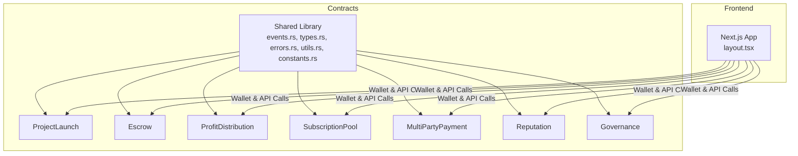
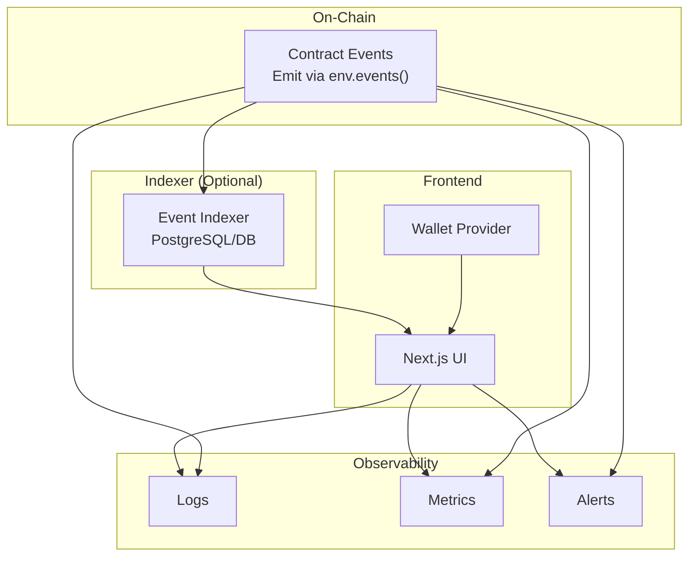
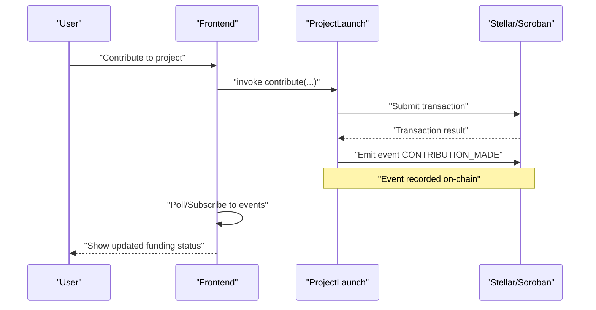
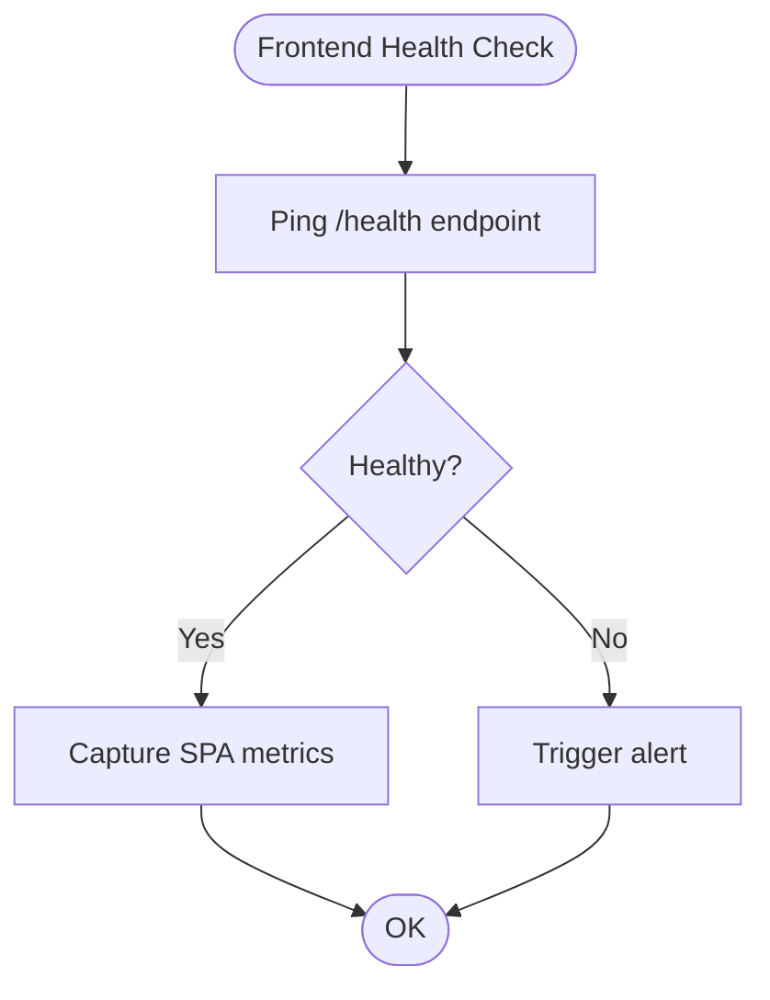
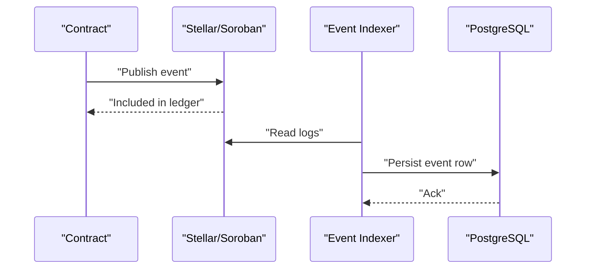
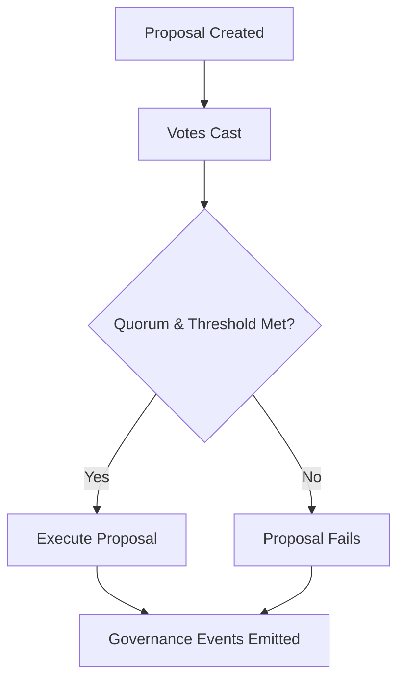
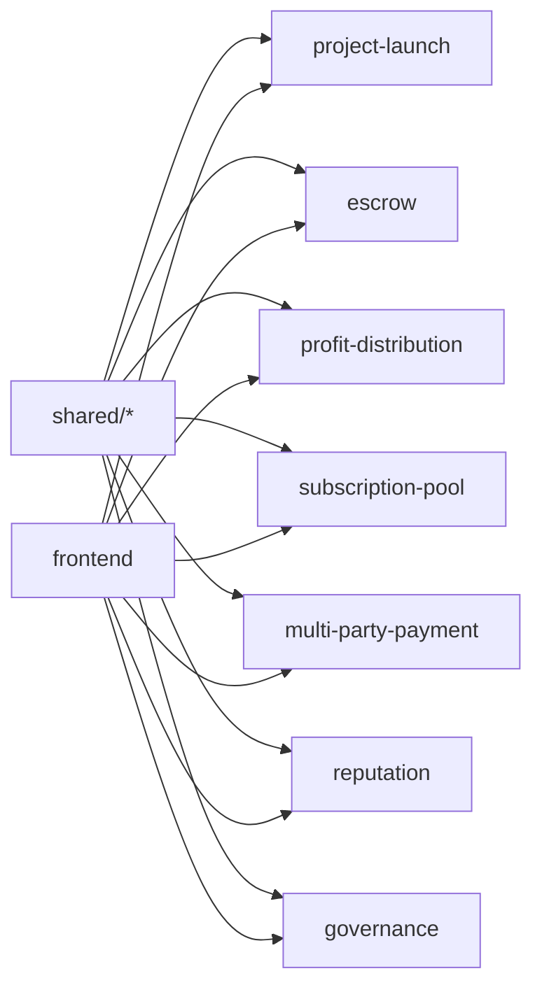

# Monitoring and Maintenance

<cite>
**Referenced Files in This Document**
- [README.md](file://README.md)
- [contracts/README.md](file://contracts/README.md)
- [contracts/SETUP.md](file://contracts/SETUP.md)
- [contracts/shared/src/events.rs](file://contracts/shared/src/events.rs)
- [contracts/shared/src/lib.rs](file://contracts/shared/src/lib.rs)
- [contracts/profit-distribution/src/events.rs](file://contracts/profit-distribution/src/events.rs)
- [contracts/project-launch/src/lib.rs](file://contracts/project-launch/src/lib.rs)
- [frontend/package.json](file://frontend/package.json)
- [frontend/src/app/layout.tsx](file://frontend/src/app/layout.tsx)
</cite>

## Table of Contents
1. [Introduction](#introduction)
2. [Project Structure](#project-structure)
3. [Core Components](#core-components)
4. [Architecture Overview](#architecture-overview)
5. [Detailed Component Analysis](#detailed-component-analysis)
6. [Dependency Analysis](#dependency-analysis)
7. [Performance Considerations](#performance-considerations)
8. [Troubleshooting Guide](#troubleshooting-guide)
9. [Conclusion](#conclusion)
10. [Appendices](#appendices)

## Introduction
This document provides a comprehensive guide to monitoring and maintenance for the NovaFund platform with a focus on operational excellence. It covers monitoring strategies for smart contracts and the frontend application, including blockchain event tracking, transaction monitoring, and health checks. It also documents alerting systems, performance metrics collection, logging strategies, practical examples of monitoring dashboards and automated alerts, incident response procedures, maintenance procedures for contract upgrades and frontend updates, infrastructure scaling, troubleshooting guidance, backup and disaster recovery, security monitoring, compliance, and best practices for operational handoffs and team coordination.

## Project Structure
NovaFund consists of:
- Smart contracts organized by domain (project-launch, escrow, profit-distribution, subscription-pool, multi-party-payment, reputation, governance) plus a shared library for common types, errors, events, and utilities.
- A React-based frontend built with Next.js and TypeScript.
- Optional backend services for API, indexing, and database storage (as indicated in the project structure and README).

**Diagram sources**
- [contracts/shared/src/events.rs](file://contracts/shared/src/events.rs#L1-L31)
- [contracts/shared/src/lib.rs](file://contracts/shared/src/lib.rs#L1-L20)
- [contracts/project-launch/src/lib.rs](file://contracts/project-launch/src/lib.rs#L1-L363)
- [frontend/src/app/layout.tsx](file://frontend/src/app/layout.tsx#L1-L29)

**Section sources**
- [README.md](file://README.md#L260-L313)
- [contracts/README.md](file://contracts/README.md#L1-L334)
- [frontend/src/app/layout.tsx](file://frontend/src/app/layout.tsx#L1-L29)

## Core Components
- Smart contracts: Core funding, escrow/milestones, profit distribution, subscription pools, multi-party payments, reputation, and governance.
- Shared library: Centralizes event definitions, common types, errors, utilities, and constants used across contracts.
- Frontend: Next.js application with wallet integration and UI components.

Operational monitoring focuses on:
- Contract event emission and indexing for visibility into funding, contributions, milestone completions, profit distributions, and governance actions.
- Transaction monitoring for gas usage, latency, and failures.
- Health checks for frontend availability and wallet provider connectivity.
- Logging and alerting for anomalies and SLA breaches.

**Section sources**
- [contracts/README.md](file://contracts/README.md#L105-L280)
- [contracts/shared/src/events.rs](file://contracts/shared/src/events.rs#L1-L31)
- [contracts/shared/src/lib.rs](file://contracts/shared/src/lib.rs#L1-L20)
- [README.md](file://README.md#L169-L198)

## Architecture Overview
The monitoring architecture integrates on-chain event tracking, optional backend indexing, and frontend health monitoring.

**Diagram sources**
- [contracts/project-launch/src/lib.rs](file://contracts/project-launch/src/lib.rs#L142-L146)
- [contracts/profit-distribution/src/events.rs](file://contracts/profit-distribution/src/events.rs#L9-L21)
- [contracts/shared/src/events.rs](file://contracts/shared/src/events.rs#L1-L31)
- [README.md](file://README.md#L185-L189)

## Detailed Component Analysis

### Smart Contract Monitoring
- Event-driven monitoring: Contracts emit structured events for key lifecycle actions. These should be indexed and surfaced to dashboards.
- Transaction monitoring: Track invocation counts, gas consumption, and failure rates per function.
- Health checks: Verify contract initialization, admin controls, and state consistency.
- Alerting: Notify on high failure rates, unusual spikes in contributions, or governance proposal anomalies.

**Diagram sources**
- [contracts/project-launch/src/lib.rs](file://contracts/project-launch/src/lib.rs#L151-L212)
- [contracts/shared/src/events.rs](file://contracts/shared/src/events.rs#L9-L11)

**Section sources**
- [contracts/project-launch/src/lib.rs](file://contracts/project-launch/src/lib.rs#L142-L212)
- [contracts/shared/src/events.rs](file://contracts/shared/src/events.rs#L1-L31)

### Frontend Application Monitoring
- Availability: Health endpoints for Next.js app and static asset serving.
- Performance: Lighthouse-like metrics for Largest Contentful Paint, First Input Delay, and server response times.
- Error tracking: Capture unhandled exceptions and wallet connection errors.
- UX monitoring: Track conversion funnels (project views, contribute clicks, wallet connect attempts).

**Diagram sources**
- [frontend/package.json](file://frontend/package.json#L5-L9)
- [frontend/src/app/layout.tsx](file://frontend/src/app/layout.tsx#L1-L29)

**Section sources**
- [frontend/package.json](file://frontend/package.json#L5-L9)
- [frontend/src/app/layout.tsx](file://frontend/src/app/layout.tsx#L1-L29)

### Event Tracking and Indexing
- Contract events: Use the shared event constants and contract-specific event publishers to emit standardized events.
- Indexing strategy: Optionally index events in PostgreSQL for fast queries and dashboard rendering.
- Backfilling: Periodically backfill missing events during re-indexing or network gaps.

**Diagram sources**
- [contracts/shared/src/events.rs](file://contracts/shared/src/events.rs#L1-L31)
- [contracts/profit-distribution/src/events.rs](file://contracts/profit-distribution/src/events.rs#L1-L21)
- [README.md](file://README.md#L185-L189)

**Section sources**
- [contracts/shared/src/events.rs](file://contracts/shared/src/events.rs#L1-L31)
- [contracts/profit-distribution/src/events.rs](file://contracts/profit-distribution/src/events.rs#L1-L21)
- [README.md](file://README.md#L185-L189)

### Governance and Security Monitoring
- Governance events: Track proposal creation, voting, and execution to detect potential manipulation or spam.
- Access control: Monitor admin-only function invocations and delegation changes.
- Security: Watch for repeated reversion patterns, unexpected state changes, and unusual transaction volumes.

**Diagram sources**
- [contracts/shared/src/events.rs](file://contracts/shared/src/events.rs#L22-L25)
- [contracts/README.md](file://contracts/README.md#L263-L280)

**Section sources**
- [contracts/shared/src/events.rs](file://contracts/shared/src/events.rs#L22-L25)
- [contracts/README.md](file://contracts/README.md#L263-L280)

## Dependency Analysis
- Contracts depend on the shared library for types, errors, events, and utilities.
- Frontend depends on wallet providers and interacts with contracts via Soroban SDK or wrappers.
- Optional backend services rely on the indexer to present normalized data to the frontend.

**Diagram sources**
- [contracts/shared/src/lib.rs](file://contracts/shared/src/lib.rs#L1-L20)
- [contracts/README.md](file://contracts/README.md#L105-L280)
- [README.md](file://README.md#L260-L313)

**Section sources**
- [contracts/shared/src/lib.rs](file://contracts/shared/src/lib.rs#L1-L20)
- [contracts/README.md](file://contracts/README.md#L105-L280)
- [README.md](file://README.md#L260-L313)

## Performance Considerations
- Contract performance:
  - Minimize storage reads/writes per transaction.
  - Use efficient data structures and avoid unnecessary loops.
  - Prefer batch operations where possible.
- Frontend performance:
  - Optimize bundle sizes and lazy-load routes/components.
  - Use caching strategies for static assets and API responses.
  - Monitor Core Web Vitals and server response times.
- Observability overhead:
  - Keep logs structured and sampled to reduce cost.
  - Use asynchronous metrics collection to avoid blocking requests.

[No sources needed since this section provides general guidance]

## Troubleshooting Guide
Common operational issues and resolutions:
- Contract initialization failures:
  - Verify admin-only functions are invoked by authorized accounts.
  - Confirm initialization is called once and only once.
- Event indexing gaps:
  - Re-run indexer with proper cursor/ledger bounds.
  - Validate event topics and filters.
- Frontend wallet connection problems:
  - Check wallet provider availability and CORS policies.
  - Validate network configuration (testnet/mainnet).
- Transaction failures:
  - Inspect error enums and revert reasons.
  - Increase fee buffers and retry with backoff.
- Governance anomalies:
  - Review proposal lifecycle events and voting patterns.
  - Audit delegation and quorum thresholds.

**Section sources**
- [contracts/project-launch/src/lib.rs](file://contracts/project-launch/src/lib.rs#L74-L85)
- [contracts/README.md](file://contracts/README.md#L91-L104)
- [README.md](file://README.md#L425-L454)

## Conclusion
Operational excellence at NovaFund hinges on robust monitoring of smart contracts and the frontend, combined with strong alerting, logging, and incident response procedures. By leveraging standardized contract events, optional indexing, and comprehensive health checks, teams can maintain reliability, performance, and security across the platform lifecycle.

[No sources needed since this section summarizes without analyzing specific files]

## Appendices

### Monitoring Dashboards (Examples)
- Contract activity dashboard:
  - Real-time charts for funding events, milestone completions, profit distributions, and governance actions.
  - Filters by contract, date range, and user address.
- Transaction health dashboard:
  - Latency, gas usage, and failure rate trends per function.
  - Anomaly detection alerts for spikes.
- Frontend performance dashboard:
  - SPA metrics, server response times, and error rates.
  - User funnel analytics (project views, contributes, wallet connects).

[No sources needed since this section provides conceptual guidance]

### Automated Alerts
- Threshold-based alerts:
  - High failure rate on contribute() or milestone submission.
  - Unusually low participation in funding campaigns.
- Behavioral alerts:
  - Rapid succession of governance proposals.
  - Sudden increase in multi-party payment distributions.
- Notification channels:
  - Slack, PagerDuty, or email for severity tiers.

[No sources needed since this section provides conceptual guidance]

### Incident Response Procedures
- Immediate containment:
  - Freeze admin functions if compromised.
  - Roll back problematic upgrades if necessary.
- Investigation:
  - Correlate on-chain events with logs and metrics.
  - Identify affected users and contracts.
- Communication:
  - Notify users via platform announcements.
  - Coordinate with wallet providers if needed.
- Post-mortem:
  - Document root causes, remediation steps, and preventive measures.

[No sources needed since this section provides conceptual guidance]

### Maintenance Procedures
- Contract upgrades:
  - Use upgradeable proxy pattern if applicable; otherwise, deploy new contracts and migrate state.
  - Announce planned downtime and migration steps.
- Frontend updates:
  - Feature flags for gradual rollouts.
  - Canary deployments and rollback plans.
- Infrastructure scaling:
  - Horizontal pod autoscaling for backend services.
  - CDN caching for static assets.
  - Database read replicas for heavy read workloads.

[No sources needed since this section provides general guidance]

### Backup and Disaster Recovery
- Contract state:
  - Maintain ledger snapshots and keep a registry of contract IDs and deployment artifacts.
- Frontend:
  - Immutable builds deployed to CDN with version pinning.
- Database:
  - Regular backups, replication, and point-in-time recovery.
- DR drills:
  - Simulate network partitions, wallet provider outages, and indexer downtime.

[No sources needed since this section provides general guidance]

### Security Monitoring and Compliance
- Security monitoring:
  - Watch for reentrancy attempts, integer overflows, and unauthorized admin actions.
  - Monitor for suspicious wallet signatures and large transfers.
- Compliance:
  - Retain logs and events for audit periods.
  - Implement data minimization and retention policies.
  - Ensure wallet provider compliance with regional regulations.

[No sources needed since this section provides general guidance]

### Best Practices for Operational Handoff and Team Coordination
- Runbooks:
  - Document deployment, rollback, and incident playbooks with step-by-step instructions.
- Onboarding:
  - Provide access to monitoring dashboards, alert channels, and CI/CD permissions.
- Handoff materials:
  - Architecture diagrams, deployment scripts, and contact matrices.
- Coordination:
  - Daily standups, weekly retrospectives, and cross-team syncs for frontend/backend/infrastructure.

[No sources needed since this section provides general guidance]