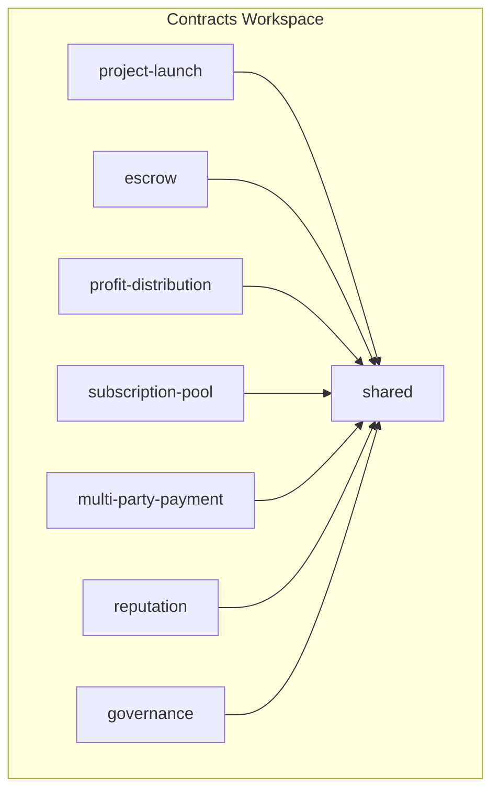
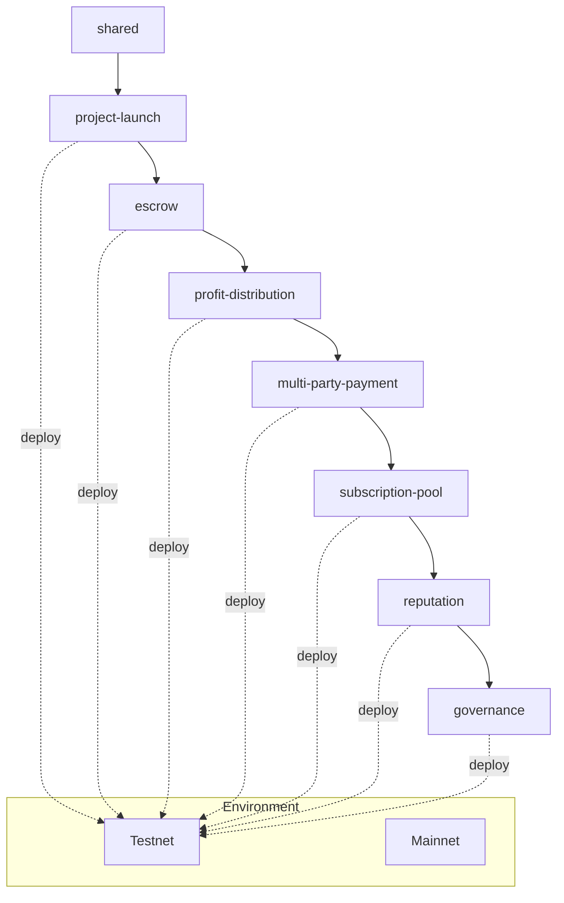
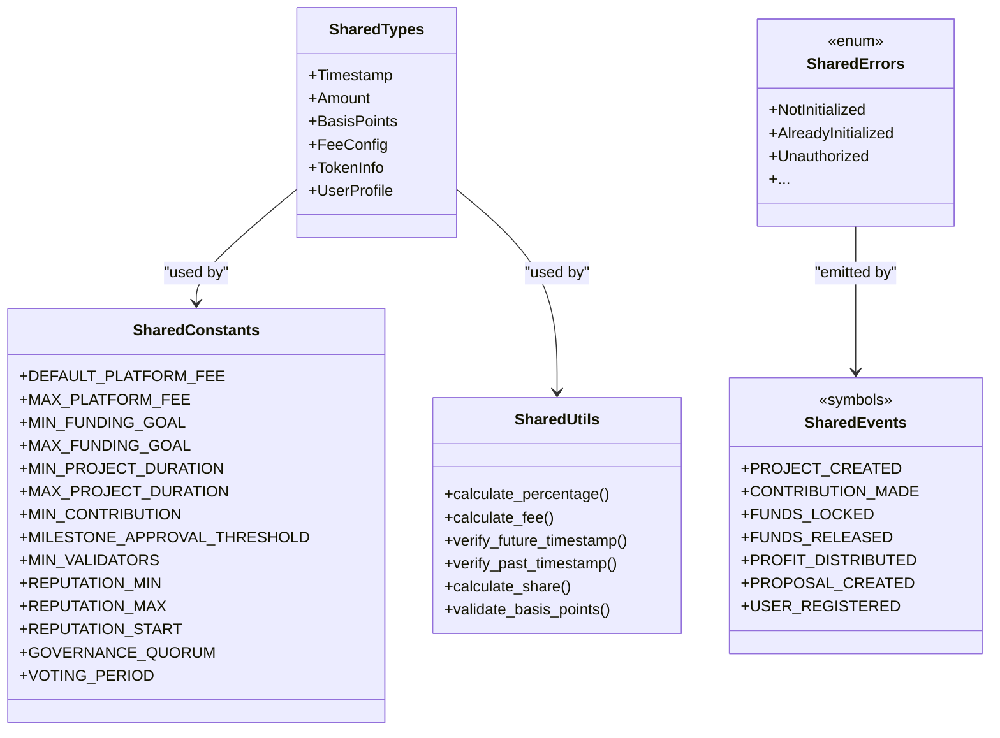
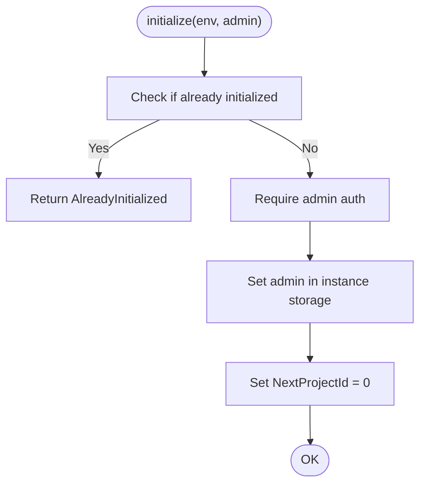
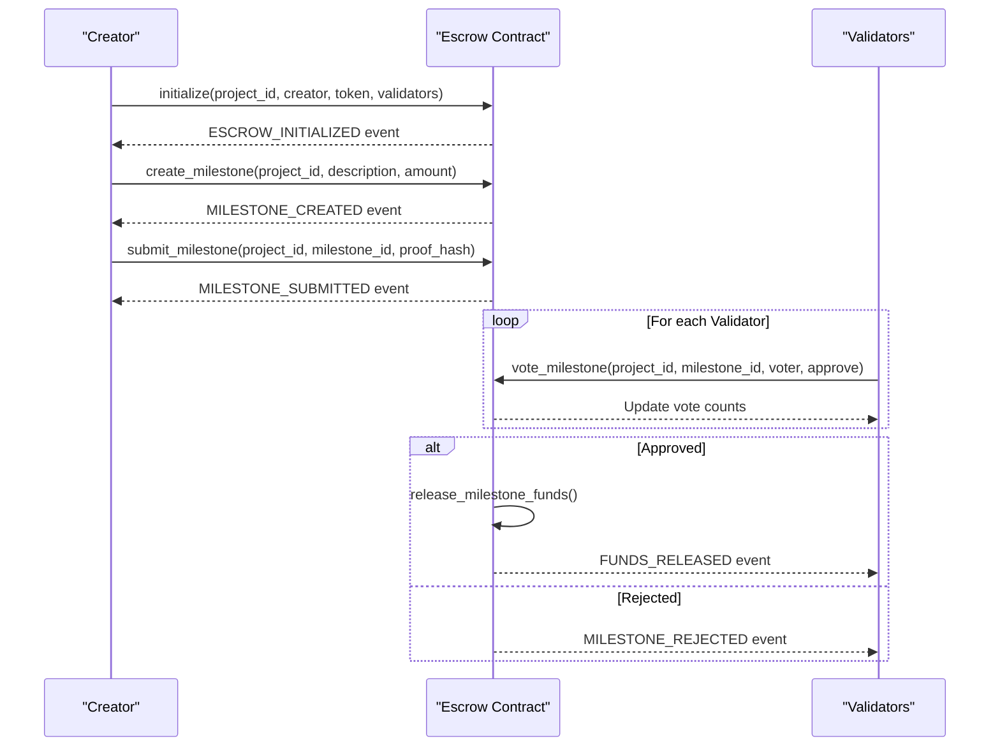
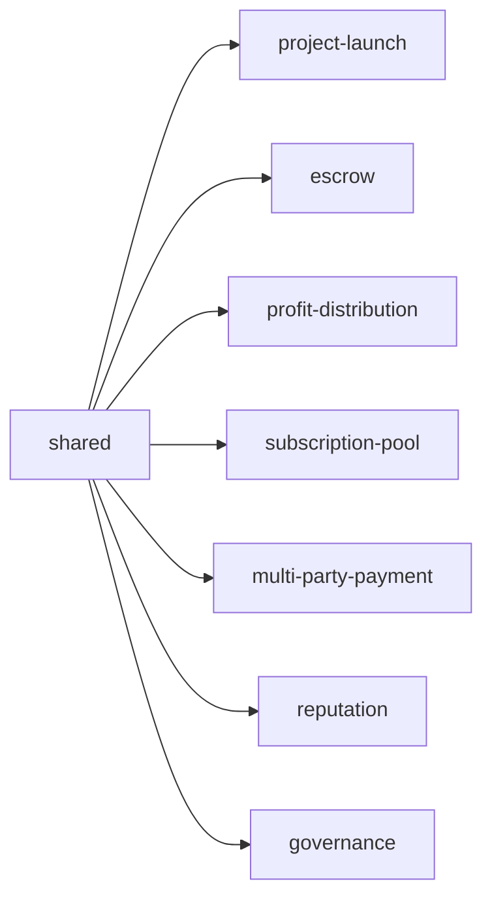

# Smart Contract Deployment

<cite>
**Referenced Files in This Document**
- [README.md](file://README.md)
- [contracts/README.md](file://contracts/README.md)
- [contracts/SETUP.md](file://contracts/SETUP.md)
- [contracts/Cargo.toml](file://contracts/Cargo.toml)
- [contracts/shared/src/lib.rs](file://contracts/shared/src/lib.rs)
- [contracts/shared/src/constants.rs](file://contracts/shared/src/constants.rs)
- [contracts/shared/src/utils.rs](file://contracts/shared/src/utils.rs)
- [contracts/shared/src/errors.rs](file://contracts/shared/src/errors.rs)
- [contracts/shared/src/events.rs](file://contracts/shared/src/events.rs)
- [contracts/project-launch/src/lib.rs](file://contracts/project-launch/src/lib.rs)
- [contracts/escrow/src/lib.rs](file://contracts/escrow/src/lib.rs)
- [contracts/profit-distribution/src/lib.rs](file://contracts/profit-distribution/src/lib.rs)
- [contracts/governance/src/lib.rs](file://contracts/governance/src/lib.rs)
</cite>

## Table of Contents
1. [Introduction](#introduction)
2. [Project Structure](#project-structure)
3. [Core Components](#core-components)
4. [Architecture Overview](#architecture-overview)
5. [Detailed Component Analysis](#detailed-component-analysis)
6. [Dependency Analysis](#dependency-analysis)
7. [Performance Considerations](#performance-considerations)
8. [Troubleshooting Guide](#troubleshooting-guide)
9. [Security Considerations](#security-considerations)
10. [Upgrade and Rollback Strategies](#upgrade-and-rollback-strategies)
11. [Monitoring and Maintenance](#monitoring-and-maintenance)
12. [Conclusion](#conclusion)

## Introduction
This document provides a complete guide to deploying NovaFund’s seven smart contracts on Soroban across testnet and mainnet. It covers environment setup, compilation, sequential deployment order due to inter-contract dependencies, initialization parameters, upgrade strategies using Soroban administrative functions, and rollback procedures. It also includes security considerations, troubleshooting guidance, monitoring requirements, and maintenance practices tailored for production-grade deployments.

## Project Structure
NovaFund organizes its contracts in a Rust workspace with a shared library providing common types, constants, utilities, errors, and events. The contracts are grouped into:
- project-launch
- escrow
- profit-distribution
- subscription-pool
- multi-party-payment
- reputation
- governance
- shared

**Diagram sources**
- [contracts/Cargo.toml](file://contracts/Cargo.toml#L4-L13)
- [contracts/shared/src/lib.rs](file://contracts/shared/src/lib.rs#L3-L13)

**Section sources**
- [contracts/Cargo.toml](file://contracts/Cargo.toml#L1-L38)
- [contracts/README.md](file://contracts/README.md#L1-L334)

## Core Components
- Shared library: Provides common types, constants, utilities, error enums, and event symbols used across contracts.
- ProjectLaunch: Manages project creation, funding goals, deadlines, and contributions.
- Escrow: Holds funds and releases them based on milestone approvals.
- ProfitDistribution: Handles investor share registration and profit distribution.
- SubscriptionPool: Manages recurring contributions and pool rebalancing.
- MultiPartyPayment: Splits payments among multiple stakeholders.
- Reputation: Tracks creator and investor reputation.
- Governance: Enables platform-wide proposals and voting.

**Section sources**
- [contracts/shared/src/lib.rs](file://contracts/shared/src/lib.rs#L1-L20)
- [contracts/shared/src/constants.rs](file://contracts/shared/src/constants.rs#L1-L40)
- [contracts/shared/src/utils.rs](file://contracts/shared/src/utils.rs#L1-L59)
- [contracts/shared/src/errors.rs](file://contracts/shared/src/errors.rs#L1-L54)
- [contracts/shared/src/events.rs](file://contracts/shared/src/events.rs#L1-L31)
- [contracts/project-launch/src/lib.rs](file://contracts/project-launch/src/lib.rs#L1-L363)
- [contracts/escrow/src/lib.rs](file://contracts/escrow/src/lib.rs#L1-L367)
- [contracts/profit-distribution/src/lib.rs](file://contracts/profit-distribution/src/lib.rs#L1-L78)
- [contracts/governance/src/lib.rs](file://contracts/governance/src/lib.rs#L1-L9)

## Architecture Overview
The deployment lifecycle follows a strict order due to cross-contract dependencies. The recommended sequence is:
1) shared
2) project-launch
3) escrow
4) profit-distribution
5) multi-party-payment
6) subscription-pool
7) reputation
8) governance

This order ensures that shared types and constants are available before contracts compile, and that contracts requiring shared utilities can be built and tested in dependency order.

**Diagram sources**
- [contracts/Cargo.toml](file://contracts/Cargo.toml#L4-L13)
- [contracts/README.md](file://contracts/README.md#L135-L147)

**Section sources**
- [contracts/README.md](file://contracts/README.md#L135-L147)
- [contracts/SETUP.md](file://contracts/SETUP.md#L135-L147)

## Detailed Component Analysis

### Shared Library
- Purpose: Centralize common types, constants, utilities, error enums, and event symbols.
- Key elements:
  - Types: Timestamp, Amount, BasisPoints, FeeConfig, TokenInfo, UserProfile.
  - Constants: Platform fees, funding goals, durations, minimum contributions, thresholds, quorum, voting periods.
  - Utilities: Percentage calculations, fee computation, timestamp validation, share calculations, basis point validation.
  - Errors: Unified error enums covering general, project, escrow, distribution, subscription, reputation, and governance domains.
  - Events: Standardized event symbols for cross-contract observability.

**Diagram sources**
- [contracts/shared/src/types.rs](file://contracts/shared/src/types.rs#L1-L41)
- [contracts/shared/src/constants.rs](file://contracts/shared/src/constants.rs#L1-L40)
- [contracts/shared/src/utils.rs](file://contracts/shared/src/utils.rs#L1-L59)
- [contracts/shared/src/errors.rs](file://contracts/shared/src/errors.rs#L1-L54)
- [contracts/shared/src/events.rs](file://contracts/shared/src/events.rs#L1-L31)

**Section sources**
- [contracts/shared/src/lib.rs](file://contracts/shared/src/lib.rs#L1-L20)
- [contracts/shared/src/constants.rs](file://contracts/shared/src/constants.rs#L1-L40)
- [contracts/shared/src/utils.rs](file://contracts/shared/src/utils.rs#L1-L59)
- [contracts/shared/src/errors.rs](file://contracts/shared/src/errors.rs#L1-L54)
- [contracts/shared/src/events.rs](file://contracts/shared/src/events.rs#L1-L31)

### ProjectLaunch Contract
- Purpose: Create funding projects, enforce funding goals and deadlines, track contributions, and emit events.
- Initialization: Requires admin address and sets the next project ID to zero.
- Key validations: Funding goal bounds, deadline range and future timestamp, minimum contribution amount.
- Storage model: Instance storage for admin and next project ID; persistent storage for contribution records keyed by project.

**Diagram sources**
- [contracts/project-launch/src/lib.rs](file://contracts/project-launch/src/lib.rs#L74-L85)

**Section sources**
- [contracts/project-launch/src/lib.rs](file://contracts/project-launch/src/lib.rs#L74-L85)
- [contracts/project-launch/src/lib.rs](file://contracts/project-launch/src/lib.rs#L95-L149)
- [contracts/project-launch/src/lib.rs](file://contracts/project-launch/src/lib.rs#L151-L212)

### Escrow Contract
- Purpose: Securely hold funds and release them upon milestone approval by validators.
- Initialization: Validates minimum validators, checks uniqueness, stores EscrowInfo, initializes milestone counter.
- Milestone lifecycle: Create, submit with proof, validator votes, approval/rejection thresholds, and fund release.
- Storage model: EscrowInfo per project, milestone counter, individual milestones, and validator vote tracking.

**Diagram sources**
- [contracts/escrow/src/lib.rs](file://contracts/escrow/src/lib.rs#L31-L70)
- [contracts/escrow/src/lib.rs](file://contracts/escrow/src/lib.rs#L111-L167)
- [contracts/escrow/src/lib.rs](file://contracts/escrow/src/lib.rs#L175-L211)
- [contracts/escrow/src/lib.rs](file://contracts/escrow/src/lib.rs#L220-L307)

**Section sources**
- [contracts/escrow/src/lib.rs](file://contracts/escrow/src/lib.rs#L31-L70)
- [contracts/escrow/src/lib.rs](file://contracts/escrow/src/lib.rs#L111-L167)
- [contracts/escrow/src/lib.rs](file://contracts/escrow/src/lib.rs#L175-L211)
- [contracts/escrow/src/lib.rs](file://contracts/escrow/src/lib.rs#L220-L307)

### ProfitDistribution Contract
- Purpose: Register investors with share percentages, accept profit deposits, and enable dividend claiming.
- Current state: Placeholder implementation with TODO comments indicating missing logic.
- Expected behavior: Maintain investor share records, compute claimable amounts, and emit distribution and claim events.

**Section sources**
- [contracts/profit-distribution/src/lib.rs](file://contracts/profit-distribution/src/lib.rs#L1-L78)

### Governance Contract
- Purpose: Enable proposal creation, voting with delegation, quorum validation, and proposal execution.
- Current state: Placeholder implementation with TODO comments indicating missing logic.
- Expected behavior: Track active proposals, tally votes, delegate voting power, and execute approved changes.

**Section sources**
- [contracts/governance/src/lib.rs](file://contracts/governance/src/lib.rs#L1-L9)

## Dependency Analysis
- Internal dependencies: All contracts depend on the shared library for types, constants, utilities, errors, and events.
- Compilation dependencies: The Rust workspace enforces member ordering; shared must build before others.
- Runtime dependencies: ProjectLaunch creates projects; Escrow holds funds; ProfitDistribution distributes returns; Governance governs upgrades and policy changes.

**Diagram sources**
- [contracts/Cargo.toml](file://contracts/Cargo.toml#L4-L13)
- [contracts/shared/src/lib.rs](file://contracts/shared/src/lib.rs#L3-L13)

**Section sources**
- [contracts/Cargo.toml](file://contracts/Cargo.toml#L1-L38)
- [contracts/shared/src/lib.rs](file://contracts/shared/src/lib.rs#L1-L20)

## Performance Considerations
- WASM optimization: Use release profile with LTO and optimized symbol stripping.
- Gas efficiency: Minimize storage reads/writes, prefer compact data structures, and batch operations where possible.
- Build pipeline: Compile with wasm32-unknown-unknown target and optimize WASM artifacts.

Practical guidance:
- Build with release profile and LTO enabled.
- Use shared utilities for percentage and fee calculations to reduce duplicated logic.
- Keep event emission selective to reduce ledger footprint.

**Section sources**
- [contracts/Cargo.toml](file://contracts/Cargo.toml#L25-L38)
- [contracts/shared/src/utils.rs](file://contracts/shared/src/utils.rs#L5-L13)

## Troubleshooting Guide
Common deployment and initialization issues:
- Network configuration: Ensure testnet/mainnet networks are configured with correct RPC URL and passphrase.
- Account funding: Generate and fund a deployer account before deployment.
- Initialization failures: Verify admin-only functions are called by authorized addresses and parameters meet constraints.
- Parameter validation: Funding goal, deadline, and contribution amounts must satisfy minimums and ranges.
- Storage collisions: Ensure unique project IDs and milestone counters are managed correctly.

Operational tips:
- Use Soroban CLI to deploy and invoke contracts with explicit network flags.
- Validate contract IDs and admin addresses before invoking initialization.
- Confirm event emissions for debugging and monitoring.

**Section sources**
- [README.md](file://README.md#L427-L454)
- [contracts/README.md](file://contracts/README.md#L70-L104)
- [contracts/project-launch/src/lib.rs](file://contracts/project-launch/src/lib.rs#L95-L111)
- [contracts/project-launch/src/lib.rs](file://contracts/project-launch/src/lib.rs#L158-L178)

## Security Considerations
Production-grade security practices:
- Access control: Admin-only functions require authorization; restrict sensitive operations to designated admin addresses.
- Multisig/multi-party: Use validator lists in Escrow with threshold approvals to prevent single points of failure.
- Emergency controls: Implement pause/stop mechanisms where feasible; coordinate with governance for emergency shutdown procedures.
- Auditing: Maintain immutable logs via standardized events; keep audit trails for all state-changing operations.
- Input validation: Enforce strict parameter validation and boundary checks across all contracts.

**Section sources**
- [contracts/project-launch/src/lib.rs](file://contracts/project-launch/src/lib.rs#L74-L85)
- [contracts/escrow/src/lib.rs](file://contracts/escrow/src/lib.rs#L37-L48)
- [contracts/shared/src/errors.rs](file://contracts/shared/src/errors.rs#L1-L54)

## Upgrade and Rollback Strategies
Upgrade strategy using Soroban administrative functions:
- Deploy new WASM binaries for contracts requiring updates.
- Use administrative functions to set new contract IDs and migrate state where necessary.
- Execute governance proposals to switch to upgraded contracts and update references.

Rollback procedures:
- Maintain backward-compatible changes where possible.
- Keep previous WASM artifacts and contract IDs for rollback.
- Coordinate governance to revert to prior versions if critical issues arise.

Note: The governance contract is currently a placeholder and will implement proposal execution for upgrades and rollbacks.

**Section sources**
- [README.md](file://README.md#L425-L454)
- [contracts/governance/src/lib.rs](file://contracts/governance/src/lib.rs#L1-L9)

## Monitoring and Maintenance
Monitoring requirements:
- Event tracking: Subscribe to standardized events (project creation, contributions, fund locks/releases, profit distributions, governance actions).
- Health checks: Periodic verification of contract initialization, admin ownership, and operational parameters.
- Metrics: Track transaction volumes, gas usage, and error rates.

Maintenance procedures:
- Regular audits of shared constants and utilities.
- Incremental feature releases with governance approval.
- Backups of contract configurations and deployment artifacts.

**Section sources**
- [contracts/shared/src/events.rs](file://contracts/shared/src/events.rs#L1-L31)
- [contracts/shared/src/constants.rs](file://contracts/shared/src/constants.rs#L1-L40)

## Conclusion
NovaFund’s deployment lifecycle hinges on a well-defined order and robust initialization of shared utilities followed by individual contracts. By adhering to the recommended deployment sequence, validating parameters, leveraging governance for upgrades, and implementing strong security and monitoring practices, teams can achieve reliable and maintainable smart contract operations on Soroban across testnet and mainnet.