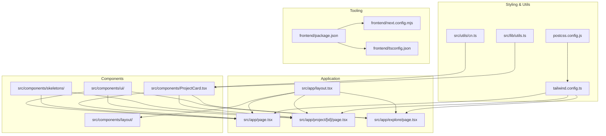
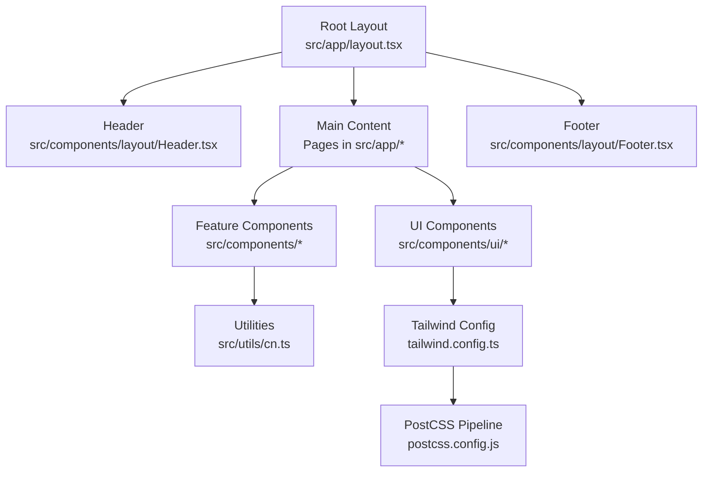
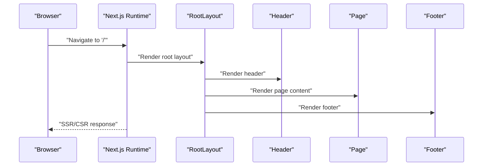
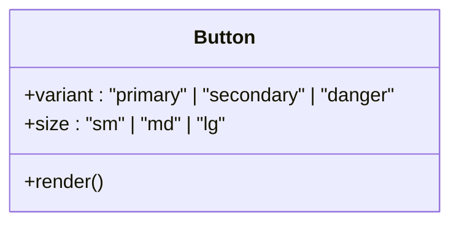
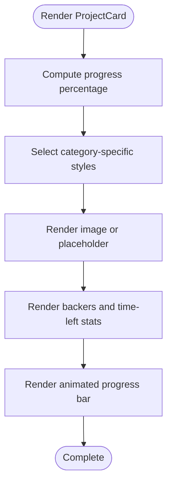
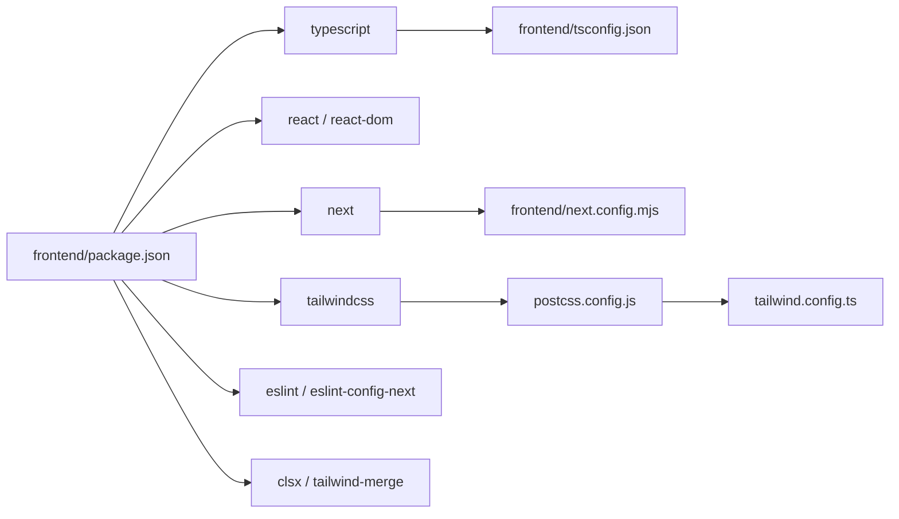

# Frontend Development

<cite>
**Referenced Files in This Document**
- [package.json](file://frontend/package.json)
- [tsconfig.json](file://frontend/tsconfig.json)
- [next.config.mjs](file://frontend/next.config.mjs)
- [tailwind.config.ts](file://frontend/tailwind.config.ts)
- [postcss.config.js](file://frontend/postcss.config.js)
- [layout.tsx](file://frontend/src/app/layout.tsx)
- [page.tsx](file://frontend/src/app/page.tsx)
- [Header.tsx](file://frontend/src/components/layout/Header.tsx)
- [Footer.tsx](file://frontend/src/components/layout/Footer.tsx)
- [Button.tsx](file://frontend/src/components/ui/Button.tsx)
- [index.ts](file://frontend/src/components/ui/index.ts)
- [cn.ts](file://frontend/src/utils/cn.ts)
- [lib/utils.ts](file://frontend/src/lib/utils.ts)
- [ProjectCard.tsx](file://frontend/src/components/ProjectCard.tsx)
- [SkeletonBase.tsx](file://frontend/src/components/skeletons/SkeletonBase.tsx)
</cite>

## Table of Contents
1. [Introduction](#introduction)
2. [Project Structure](#project-structure)
3. [Core Components](#core-components)
4. [Architecture Overview](#architecture-overview)
5. [Detailed Component Analysis](#detailed-component-analysis)
6. [Dependency Analysis](#dependency-analysis)
7. [Performance Considerations](#performance-considerations)
8. [Troubleshooting Guide](#troubleshooting-guide)
9. [Conclusion](#conclusion)
10. [Appendices](#appendices)

## Introduction
This document explains how to develop the NovaFund frontend using Next.js with TypeScript and Tailwind CSS. It covers environment setup, framework configuration, component architecture, routing patterns, styling, state management approaches, responsive design, build and optimization, code quality tools, and best practices for blockchain-enabled applications. It also provides practical guidance for creating React components, integrating wallet connections, handling asynchronous operations, and preparing for deployment.

## Project Structure
The frontend is organized under the frontend directory with the following high-level structure:
- Application pages and layouts under src/app
- Shared UI components under src/components
- Global styles and utilities under src/styles and src/utils
- Build and tooling configuration files at the repository root

**Diagram sources**
- [layout.tsx](file://frontend/src/app/layout.tsx#L1-L29)
- [page.tsx](file://frontend/src/app/page.tsx#L1-L16)
- [Header.tsx](file://frontend/src/components/layout/Header.tsx#L1-L20)
- [Footer.tsx](file://frontend/src/components/layout/Footer.tsx#L1-L15)
- [Button.tsx](file://frontend/src/components/ui/Button.tsx#L1-L39)
- [index.ts](file://frontend/src/components/ui/index.ts#L1-L5)
- [ProjectCard.tsx](file://frontend/src/components/ProjectCard.tsx#L1-L117)
- [SkeletonBase.tsx](file://frontend/src/components/skeletons/SkeletonBase.tsx#L1-L12)
- [tailwind.config.ts](file://frontend/tailwind.config.ts#L1-L43)
- [postcss.config.js](file://frontend/postcss.config.js#L1-L7)
- [cn.ts](file://frontend/src/utils/cn.ts#L1-L7)
- [lib/utils.ts](file://frontend/src/lib/utils.ts#L1-L7)
- [package.json](file://frontend/package.json#L1-L32)
- [tsconfig.json](file://frontend/tsconfig.json#L1-L28)
- [next.config.mjs](file://frontend/next.config.mjs#L1-L7)

**Section sources**
- [layout.tsx](file://frontend/src/app/layout.tsx#L1-L29)
- [page.tsx](file://frontend/src/app/page.tsx#L1-L16)
- [package.json](file://frontend/package.json#L1-L32)
- [tsconfig.json](file://frontend/tsconfig.json#L1-L28)
- [next.config.mjs](file://frontend/next.config.mjs#L1-L7)
- [tailwind.config.ts](file://frontend/tailwind.config.ts#L1-L43)
- [postcss.config.js](file://frontend/postcss.config.js#L1-L7)

## Core Components
- Root layout defines global metadata, fonts, and the page scaffold with header and footer.
- Pages define route segments and render content inside the layout.
- UI components provide reusable building blocks with consistent styling and behavior.
- Utilities unify Tailwind class merging and composition.

Key implementation references:
- Root layout and metadata: [layout.tsx](file://frontend/src/app/layout.tsx#L1-L29)
- Home page rendering: [page.tsx](file://frontend/src/app/page.tsx#L1-L16)
- Reusable button component: [Button.tsx](file://frontend/src/components/ui/Button.tsx#L1-L39)
- UI barrel export: [index.ts](file://frontend/src/components/ui/index.ts#L1-L5)
- Utility class merging: [cn.ts](file://frontend/src/utils/cn.ts#L1-L7), [lib/utils.ts](file://frontend/src/lib/utils.ts#L1-L7)

**Section sources**
- [layout.tsx](file://frontend/src/app/layout.tsx#L1-L29)
- [page.tsx](file://frontend/src/app/page.tsx#L1-L16)
- [Button.tsx](file://frontend/src/components/ui/Button.tsx#L1-L39)
- [index.ts](file://frontend/src/components/ui/index.ts#L1-L5)
- [cn.ts](file://frontend/src/utils/cn.ts#L1-L7)
- [lib/utils.ts](file://frontend/src/lib/utils.ts#L1-L7)

## Architecture Overview
The frontend follows Next.js App Router conventions with a root layout wrapping pages. Components are organized by feature and shared via a UI module. Styling leverages Tailwind CSS with a centralized configuration and PostCSS pipeline.

**Diagram sources**
- [layout.tsx](file://frontend/src/app/layout.tsx#L1-L29)
- [Header.tsx](file://frontend/src/components/layout/Header.tsx#L1-L20)
- [Footer.tsx](file://frontend/src/components/layout/Footer.tsx#L1-L15)
- [Button.tsx](file://frontend/src/components/ui/Button.tsx#L1-L39)
- [cn.ts](file://frontend/src/utils/cn.ts#L1-L7)
- [tailwind.config.ts](file://frontend/tailwind.config.ts#L1-L43)
- [postcss.config.js](file://frontend/postcss.config.js#L1-L7)

## Detailed Component Analysis

### Layout and Routing
- Root layout sets HTML metadata, font, and the page scaffold with header, main content area, and footer.
- Pages are route segments under src/app; the home page demonstrates basic content rendering.
- The layout composes shared header and footer and centers content with responsive padding.

References:
- Root layout and metadata: [layout.tsx](file://frontend/src/app/layout.tsx#L1-L29)
- Home page: [page.tsx](file://frontend/src/app/page.tsx#L1-L16)

**Diagram sources**
- [layout.tsx](file://frontend/src/app/layout.tsx#L1-L29)
- [Header.tsx](file://frontend/src/components/layout/Header.tsx#L1-L20)
- [page.tsx](file://frontend/src/app/page.tsx#L1-L16)
- [Footer.tsx](file://frontend/src/components/layout/Footer.tsx#L1-L15)

**Section sources**
- [layout.tsx](file://frontend/src/app/layout.tsx#L1-L29)
- [page.tsx](file://frontend/src/app/page.tsx#L1-L16)

### UI Component: Button
- Provides variant and size props with Tailwind-based styling and focus/ring behavior.
- Demonstrates prop-driven styling and consistent accessibility attributes.

References:
- Button component: [Button.tsx](file://frontend/src/components/ui/Button.tsx#L1-L39)
- Barrel export: [index.ts](file://frontend/src/components/ui/index.ts#L1-L5)

**Diagram sources**
- [Button.tsx](file://frontend/src/components/ui/Button.tsx#L1-L39)

**Section sources**
- [Button.tsx](file://frontend/src/components/ui/Button.tsx#L1-L39)
- [index.ts](file://frontend/src/components/ui/index.ts#L1-L5)

### Feature Component: ProjectCard
- Renders project details with category badges, progress visualization, and stats.
- Uses motion animations for interactive feedback and responsive image handling.
- Leverages utility class merging for robust conditional classes.

References:
- Project card component: [ProjectCard.tsx](file://frontend/src/components/ProjectCard.tsx#L1-L117)
- Utility class merging: [lib/utils.ts](file://frontend/src/lib/utils.ts#L1-L7)

**Diagram sources**
- [ProjectCard.tsx](file://frontend/src/components/ProjectCard.tsx#L1-L117)
- [lib/utils.ts](file://frontend/src/lib/utils.ts#L1-L7)

**Section sources**
- [ProjectCard.tsx](file://frontend/src/components/ProjectCard.tsx#L1-L117)
- [lib/utils.ts](file://frontend/src/lib/utils.ts#L1-L7)

### Skeleton Loading Pattern
- SkeletonBase provides a reusable skeleton container with pulse animation.
- Useful for optimistic UI and improved perceived performance during data fetches.

References:
- Skeleton base: [SkeletonBase.tsx](file://frontend/src/components/skeletons/SkeletonBase.tsx#L1-L12)
- Utility class merging: [cn.ts](file://frontend/src/utils/cn.ts#L1-L7)

**Section sources**
- [SkeletonBase.tsx](file://frontend/src/components/skeletons/SkeletonBase.tsx#L1-L12)
- [cn.ts](file://frontend/src/utils/cn.ts#L1-L7)

## Dependency Analysis
The frontend uses Next.js 14, React 18, TypeScript 5, Tailwind CSS, and related tooling. Dependencies and devDependencies are declared in package.json. TypeScript configuration enables strict mode, preserve JSX, bundler module resolution, and path aliases. Next.js configuration enforces strict mode.

**Diagram sources**
- [package.json](file://frontend/package.json#L1-L32)
- [tsconfig.json](file://frontend/tsconfig.json#L1-L28)
- [next.config.mjs](file://frontend/next.config.mjs#L1-L7)
- [tailwind.config.ts](file://frontend/tailwind.config.ts#L1-L43)
- [postcss.config.js](file://frontend/postcss.config.js#L1-L7)

**Section sources**
- [package.json](file://frontend/package.json#L1-L32)
- [tsconfig.json](file://frontend/tsconfig.json#L1-L28)
- [next.config.mjs](file://frontend/next.config.mjs#L1-L7)
- [tailwind.config.ts](file://frontend/tailwind.config.ts#L1-L43)
- [postcss.config.js](file://frontend/postcss.config.js#L1-L7)

## Performance Considerations
- Prefer client components only when necessary (e.g., animations or client-side interactivity). Keep server-rendered pages for static content.
- Use skeleton loaders for data-heavy views to improve perceived performance.
- Optimize images and leverage lazy loading; avoid heavy client-side libraries unless essential.
- Minimize re-renders by keeping props stable and using memoization where appropriate.
- Tailwind utilities should be scoped to reduce CSS bundle size; keep content globs precise.
- Enable Next.js optimizations via production builds and analyze bundle size with built-in tools.

[No sources needed since this section provides general guidance]

## Troubleshooting Guide
- TypeScript errors: Verify tsconfig compiler options and plugin configuration. Ensure path aliases match configured paths.
- Tailwind not applying styles: Confirm content globs include component and app directories; rebuild after changes.
- PostCSS pipeline issues: Ensure Tailwind and Autoprefixer are present in postcss.config.js.
- Next.js runtime warnings: Review strict mode and module resolution settings in next.config.mjs and tsconfig.json.
- Class merging conflicts: Use the provided cn utility to merge Tailwind classes safely.

**Section sources**
- [tsconfig.json](file://frontend/tsconfig.json#L1-L28)
- [tailwind.config.ts](file://frontend/tailwind.config.ts#L1-L43)
- [postcss.config.js](file://frontend/postcss.config.js#L1-L7)
- [next.config.mjs](file://frontend/next.config.mjs#L1-L7)
- [cn.ts](file://frontend/src/utils/cn.ts#L1-L7)
- [lib/utils.ts](file://frontend/src/lib/utils.ts#L1-L7)

## Conclusion
The NovaFund frontend is structured around Next.js App Router, TypeScript, and Tailwind CSS. Components are modular and reusable, with a clear separation of concerns. By following the patterns outlined here—component composition, utility-driven styling, skeleton loading, and strict tooling—you can build a scalable, maintainable, and performant blockchain-enabled dApp interface.

[No sources needed since this section summarizes without analyzing specific files]

## Appendices

### Development Environment Setup
- Node.js: Use a current LTS version compatible with Next.js 14.
- Package manager: Install dependencies with your preferred package manager.
- Scripts: Use the provided scripts for local development, building, starting, and linting.

References:
- Scripts and dependencies: [package.json](file://frontend/package.json#L1-L32)

**Section sources**
- [package.json](file://frontend/package.json#L1-L32)

### Next.js Configuration
- Strict mode enabled for robust development checks.
- TypeScript integration configured for modern DX with path aliases.

References:
- Next.js config: [next.config.mjs](file://frontend/next.config.mjs#L1-L7)
- TypeScript config: [tsconfig.json](file://frontend/tsconfig.json#L1-L28)

**Section sources**
- [next.config.mjs](file://frontend/next.config.mjs#L1-L7)
- [tsconfig.json](file://frontend/tsconfig.json#L1-L28)

### Styling System with Tailwind CSS
- Centralized Tailwind configuration extending color tokens and enabling plugins.
- PostCSS pipeline with Tailwind and Autoprefixer.
- Utility functions for safe class merging.

References:
- Tailwind config: [tailwind.config.ts](file://frontend/tailwind.config.ts#L1-L43)
- PostCSS config: [postcss.config.js](file://frontend/postcss.config.js#L1-L7)
- Class merging utilities: [cn.ts](file://frontend/src/utils/cn.ts#L1-L7), [lib/utils.ts](file://frontend/src/lib/utils.ts#L1-L7)

**Section sources**
- [tailwind.config.ts](file://frontend/tailwind.config.ts#L1-L43)
- [postcss.config.js](file://frontend/postcss.config.js#L1-L7)
- [cn.ts](file://frontend/src/utils/cn.ts#L1-L7)
- [lib/utils.ts](file://frontend/src/lib/utils.ts#L1-L7)

### Building and Optimizing
- Production build: Generates optimized static assets and server code.
- Linting: Run linter to enforce code quality and Next.js best practices.

References:
- Scripts: [package.json](file://frontend/package.json#L1-L32)

**Section sources**
- [package.json](file://frontend/package.json#L1-L32)

### Wallet Integration Patterns
- Mock connection pattern: Use a button component to simulate wallet connect actions.
- State management: Manage connection state in a dedicated context or store; update UI accordingly.
- Asynchronous operations: Handle provider requests with proper error handling and loading states.

References:
- Header with mock connect: [Header.tsx](file://frontend/src/components/layout/Header.tsx#L1-L20)
- Button component: [Button.tsx](file://frontend/src/components/ui/Button.tsx#L1-L39)

**Section sources**
- [Header.tsx](file://frontend/src/components/layout/Header.tsx#L1-L20)
- [Button.tsx](file://frontend/src/components/ui/Button.tsx#L1-L39)

### Testing React Components
- Unit tests: Test component rendering and prop-driven behavior.
- Snapshot tests: Capture UI structure changes.
- Interaction tests: Simulate user actions and verify state updates.

[No sources needed since this section provides general guidance]

### Managing Blockchain State in the Frontend
- Use a state management solution (context, Zustand, Redux) to centralize chain interactions.
- Normalize data from smart contracts and cache it to reduce redundant queries.
- Implement optimistic updates with rollback on failure.

[No sources needed since this section provides general guidance]