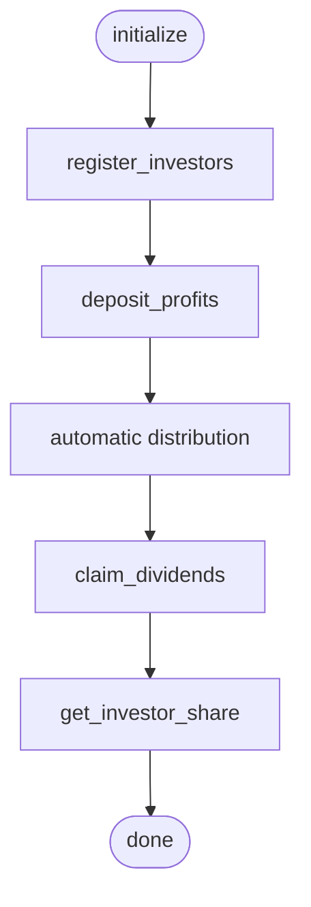

# Smart Contract Development

<cite>
**Referenced Files in This Document**
- [README.md](file://README.md)
- [contracts/README.md](file://contracts/README.md)
- [contracts/SETUP.md](file://contracts/SETUP.md)
- [contracts/Cargo.toml](file://contracts/Cargo.toml)
- [contracts/shared/Cargo.toml](file://contracts/shared/Cargo.toml)
- [contracts/shared/src/lib.rs](file://contracts/shared/src/lib.rs)
- [contracts/shared/src/types.rs](file://contracts/shared/src/types.rs)
- [contracts/shared/src/errors.rs](file://contracts/shared/src/errors.rs)
- [contracts/shared/src/events.rs](file://contracts/shared/src/events.rs)
- [contracts/shared/src/constants.rs](file://contracts/shared/src/constants.rs)
- [contracts/project-launch/src/lib.rs](file://contracts/project-launch/src/lib.rs)
- [contracts/escrow/src/lib.rs](file://contracts/escrow/src/lib.rs)
- [contracts/profit-distribution/src/lib.rs](file://contracts/profit-distribution/src/lib.rs)
- [contracts/profit-distribution/src/storage.rs](file://contracts/profit-distribution/src/storage.rs)
- [contracts/profit-distribution/src/events.rs](file://contracts/profit-distribution/src/events.rs)
</cite>

## Table of Contents
1. [Introduction](#introduction)
2. [Project Structure](#project-structure)
3. [Core Components](#core-components)
4. [Architecture Overview](#architecture-overview)
5. [Detailed Component Analysis](#detailed-component-analysis)
6. [Dependency Analysis](#dependency-analysis)
7. [Performance Considerations](#performance-considerations)
8. [Troubleshooting Guide](#troubleshooting-guide)
9. [Conclusion](#conclusion)
10. [Appendices](#appendices)

## Introduction
This document provides a comprehensive guide to developing smart contracts for NovaFund using Rust and the Soroban SDK on the Stellar blockchain. It covers environment setup, workspace configuration, contract architecture patterns, development workflow, testing strategies, compilation to WebAssembly, deployment, and best practices for secure and efficient smart contracts.

## Project Structure
NovaFund organizes its smart contracts as a Rust workspace with multiple member crates and a shared library. The contracts are grouped by domain (project launch, escrow, profit distribution, subscription pool, multi-party payment, reputation, governance), and a shared library provides common types, errors, events, constants, and utilities.

**Diagram sources**
- [contracts/Cargo.toml](file://contracts/Cargo.toml#L1-L38)
- [contracts/shared/src/lib.rs](file://contracts/shared/src/lib.rs#L1-L20)
- [contracts/project-launch/src/lib.rs](file://contracts/project-launch/src/lib.rs#L1-L363)
- [contracts/escrow/src/lib.rs](file://contracts/escrow/src/lib.rs#L1-L367)
- [contracts/profit-distribution/src/lib.rs](file://contracts/profit-distribution/src/lib.rs#L1-L78)

**Section sources**
- [README.md](file://README.md#L260-L313)
- [contracts/README.md](file://contracts/README.md#L1-L334)
- [contracts/Cargo.toml](file://contracts/Cargo.toml#L1-L38)

## Core Components
- Workspace configuration defines a unified edition, Rust version, and shared dependencies for all contracts.
- Shared library exposes common types, errors, events, constants, and utilities used across contracts.
- Individual contracts implement domain-specific logic and leverage shared modules for consistency.

Key capabilities:
- Unified build and test commands via the workspace.
- Consistent error handling and event emission across contracts.
- Centralized constants for platform policies and thresholds.

**Section sources**
- [contracts/Cargo.toml](file://contracts/Cargo.toml#L15-L38)
- [contracts/shared/src/lib.rs](file://contracts/shared/src/lib.rs#L1-L20)
- [contracts/shared/src/types.rs](file://contracts/shared/src/types.rs#L1-L41)
- [contracts/shared/src/errors.rs](file://contracts/shared/src/errors.rs#L1-L54)
- [contracts/shared/src/events.rs](file://contracts/shared/src/events.rs#L1-L31)
- [contracts/shared/src/constants.rs](file://contracts/shared/src/constants.rs#L1-L40)

## Architecture Overview
NovaFund’s smart contracts form a modular ecosystem. Contracts communicate through shared types and events, and state is managed using Soroban storage keys. The project launch contract coordinates funding, escrow manages milestone-based releases, and profit distribution automates payouts.

**Diagram sources**
- [contracts/shared/src/lib.rs](file://contracts/shared/src/lib.rs#L1-L20)
- [contracts/project-launch/src/lib.rs](file://contracts/project-launch/src/lib.rs#L1-L363)
- [contracts/escrow/src/lib.rs](file://contracts/escrow/src/lib.rs#L1-L367)
- [contracts/profit-distribution/src/lib.rs](file://contracts/profit-distribution/src/lib.rs#L1-L78)

## Detailed Component Analysis

### Project Launch Contract
The project launch contract manages project creation, funding goals, deadlines, and contributions. It demonstrates:
- Contract initialization with admin-only access control.
- Validation of funding goals and deadlines using shared constants.
- Persistent storage of project metadata and contribution history.
- Event emission for project creation and contributions.

**Diagram sources**
- [contracts/project-launch/src/lib.rs](file://contracts/project-launch/src/lib.rs#L74-L248)
- [contracts/shared/src/constants.rs](file://contracts/shared/src/constants.rs#L9-L22)
- [contracts/shared/src/events.rs](file://contracts/shared/src/events.rs#L3-L11)

Implementation highlights:
- Data keys define instance and persistent storage namespaces.
- Validation logic ensures minimum funding goal, valid durations, and future timestamps.
- Contribution records are appended to persistent collections.
- Events carry structured payloads for downstream consumers.

**Section sources**
- [contracts/project-launch/src/lib.rs](file://contracts/project-launch/src/lib.rs#L1-L363)
- [contracts/shared/src/constants.rs](file://contracts/shared/src/constants.rs#L9-L22)
- [contracts/shared/src/events.rs](file://contracts/shared/src/events.rs#L3-L11)

### Escrow Contract
The escrow contract holds funds and releases them based on milestone approvals. It showcases:
- Initialization with validators and minimum validator thresholds.
- Milestone creation with amount validation against total deposits.
- Validator voting with approval thresholds and majority checks.
- Fund release accounting and event emission.

**Diagram sources**
- [contracts/escrow/src/lib.rs](file://contracts/escrow/src/lib.rs#L31-L307)
- [contracts/shared/src/constants.rs](file://contracts/shared/src/constants.rs#L24-L28)
- [contracts/shared/src/events.rs](file://contracts/shared/src/events.rs#L13-L16)

Implementation highlights:
- Threshold-based approval uses basis points for precision.
- Validator uniqueness and voting state are enforced.
- Fund release prevents double-spending and validates totals.

**Section sources**
- [contracts/escrow/src/lib.rs](file://contracts/escrow/src/lib.rs#L1-L367)
- [contracts/shared/src/constants.rs](file://contracts/shared/src/constants.rs#L24-L28)
- [contracts/shared/src/events.rs](file://contracts/shared/src/events.rs#L13-L16)

### Profit Distribution Contract
The profit distribution contract is a work-in-progress placeholder that outlines the intended architecture:
- Registration of investors with share percentages.
- Profit deposits and proportional distribution.
- Dividend claiming and claimable amount tracking.

**Diagram sources**
- [contracts/profit-distribution/src/lib.rs](file://contracts/profit-distribution/src/lib.rs#L35-L77)
- [contracts/profit-distribution/src/storage.rs](file://contracts/profit-distribution/src/storage.rs#L1-L33)
- [contracts/profit-distribution/src/events.rs](file://contracts/profit-distribution/src/events.rs#L1-L21)

Implementation highlights:
- Storage functions encapsulate key-value operations for shares and totals.
- Event emission supports deposit and claim notifications.
- Contract metadata provides discoverability.

**Section sources**
- [contracts/profit-distribution/src/lib.rs](file://contracts/profit-distribution/src/lib.rs#L1-L78)
- [contracts/profit-distribution/src/storage.rs](file://contracts/profit-distribution/src/storage.rs#L1-L33)
- [contracts/profit-distribution/src/events.rs](file://contracts/profit-distribution/src/events.rs#L1-L21)

### Shared Library
The shared library centralizes common elements across contracts:
- Types define canonical structures for projects, escrow info, milestones, and user profiles.
- Errors enumerate domain-specific failure modes with unique codes.
- Events define standardized event symbols for cross-contract observability.
- Constants encode platform policies such as fee tiers, minimums, and thresholds.
- Utilities provide helper functions (e.g., timestamp verification).

**Diagram sources**
- [contracts/shared/src/lib.rs](file://contracts/shared/src/lib.rs#L1-L20)
- [contracts/shared/src/types.rs](file://contracts/shared/src/types.rs#L1-L41)
- [contracts/shared/src/errors.rs](file://contracts/shared/src/errors.rs#L1-L54)
- [contracts/shared/src/events.rs](file://contracts/shared/src/events.rs#L1-L31)
- [contracts/shared/src/constants.rs](file://contracts/shared/src/constants.rs#L1-L40)
- [contracts/shared/src/lib.rs](file://contracts/shared/src/lib.rs#L16-L20)

**Section sources**
- [contracts/shared/src/lib.rs](file://contracts/shared/src/lib.rs#L1-L20)
- [contracts/shared/src/types.rs](file://contracts/shared/src/types.rs#L1-L41)
- [contracts/shared/src/errors.rs](file://contracts/shared/src/errors.rs#L1-L54)
- [contracts/shared/src/events.rs](file://contracts/shared/src/events.rs#L1-L31)
- [contracts/shared/src/constants.rs](file://contracts/shared/src/constants.rs#L1-L40)

## Dependency Analysis
The workspace enforces a single source of truth for SDK versions and Rust toolchain settings. Contracts depend on the shared library for types, errors, events, and constants. The shared library itself depends on the Soroban SDK.

**Diagram sources**
- [contracts/Cargo.toml](file://contracts/Cargo.toml#L21-L24)
- [contracts/shared/Cargo.toml](file://contracts/shared/Cargo.toml#L7-L8)
- [contracts/shared/src/lib.rs](file://contracts/shared/src/lib.rs#L1-L20)

**Section sources**
- [contracts/Cargo.toml](file://contracts/Cargo.toml#L1-L38)
- [contracts/shared/Cargo.toml](file://contracts/shared/Cargo.toml#L1-L12)

## Performance Considerations
- WASM optimization: Build with release profile and enable LTO for smaller binaries and improved runtime performance.
- Storage efficiency: Minimize reads/writes by batching operations and using compact data structures.
- Gas optimization: Prefer constant-time operations, avoid loops over large datasets, and reduce event payload sizes.
- Compilation profile: Use the release profile with aggressive optimizations and symbol stripping.

Practical tips:
- Build with the release profile and optimize WASM artifacts using the Soroban CLI.
- Keep state access patterns predictable to reduce storage footprint.
- Validate inputs early to prevent unnecessary computation.

**Section sources**
- [contracts/Cargo.toml](file://contracts/Cargo.toml#L25-L34)
- [contracts/README.md](file://contracts/README.md#L58-L66)

## Troubleshooting Guide
Common issues and resolutions:
- Initialization failures: Ensure admin-only initialization and proper authentication during setup.
- Validation errors: Confirm inputs meet shared constants (minimum funding goal, contribution amounts, deadlines).
- Storage access: Verify keys and namespaces match the contract’s data schema.
- Event consumption: Subscribe to standardized event symbols for reliable off-chain indexing.

Security and correctness:
- Access control: Use require_auth for privileged functions.
- Arithmetic safety: Enforce checked arithmetic and boundary checks.
- Idempotency: Design state transitions to tolerate re-submissions where appropriate.

**Section sources**
- [contracts/project-launch/src/lib.rs](file://contracts/project-launch/src/lib.rs#L74-L85)
- [contracts/shared/src/constants.rs](file://contracts/shared/src/constants.rs#L9-L22)
- [contracts/shared/src/errors.rs](file://contracts/shared/src/errors.rs#L1-L54)

## Conclusion
NovaFund’s smart contracts demonstrate a scalable, modular architecture built on Rust and Soroban. The workspace and shared library promote consistency and maintainability, while individual contracts encapsulate domain logic with robust validation and event emission. By following the development workflow, leveraging shared components, and adhering to performance and security best practices, teams can deliver secure and efficient on-chain systems on Stellar.

## Appendices

### Development Environment Setup
- Install Rust and add the WebAssembly target.
- Install the Soroban CLI.
- Verify the setup with cargo check.
- Build contracts to WASM using the release profile.

**Section sources**
- [contracts/SETUP.md](file://contracts/SETUP.md#L37-L56)
- [contracts/README.md](file://contracts/README.md#L21-L34)

### Workspace Configuration
- Workspace-level edition, Rust version, and license.
- Shared SDK dependencies and release profile settings.
- Member crates for contracts and shared library.

**Section sources**
- [contracts/Cargo.toml](file://contracts/Cargo.toml#L1-L38)
- [contracts/shared/Cargo.toml](file://contracts/shared/Cargo.toml#L1-L12)

### Testing Strategy
- Unit tests within each contract module.
- Integration tests for cross-contract interactions.
- Snapshot testing for state validation (as demonstrated in the project launch contract tests).
- Use of mock utilities and test clients for deterministic environments.

**Section sources**
- [contracts/project-launch/src/lib.rs](file://contracts/project-launch/src/lib.rs#L250-L362)
- [contracts/README.md](file://contracts/README.md#L291-L302)

### Compilation and Deployment
- Build to WebAssembly with the release profile.
- Optimize WASM artifacts using the Soroban CLI.
- Deploy to testnet or mainnet with the Soroban CLI.
- Initialize contracts with required parameters after deployment.

**Section sources**
- [contracts/README.md](file://contracts/README.md#L36-L103)
- [README.md](file://README.md#L201-L257)

### Best Practices
- Centralize shared logic in the shared library.
- Use structured errors and events for observability.
- Enforce input validation and access control.
- Favor immutable state designs and explicit state transitions.
- Keep contracts small and focused on single responsibilities.

**Section sources**
- [contracts/shared/src/errors.rs](file://contracts/shared/src/errors.rs#L1-L54)
- [contracts/shared/src/events.rs](file://contracts/shared/src/events.rs#L1-L31)
- [README.md](file://README.md#L312-L319)