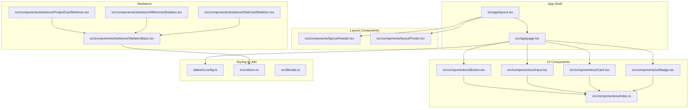
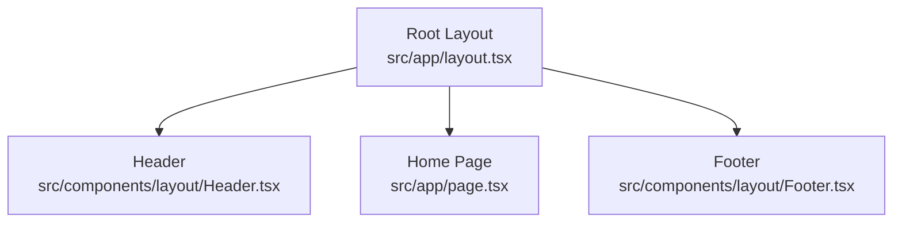
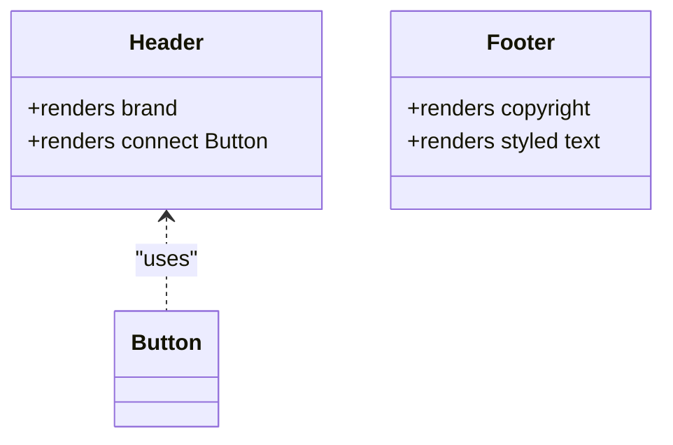
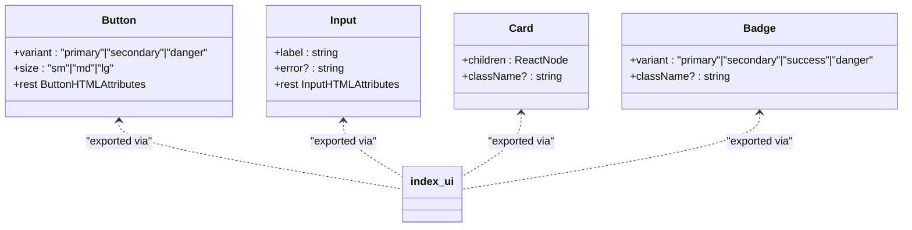
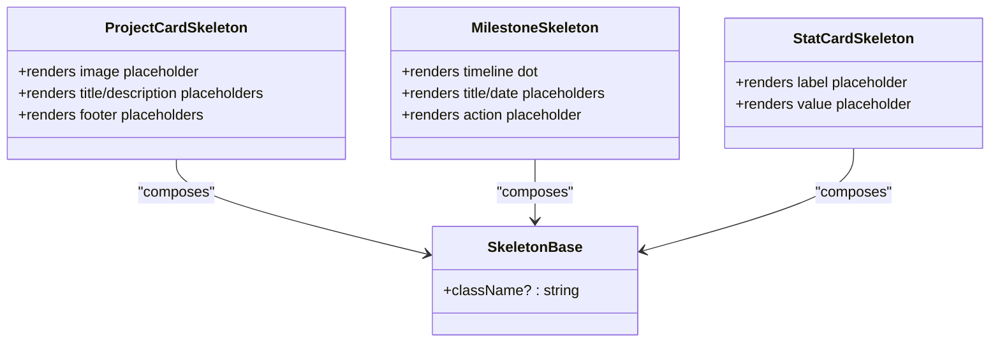
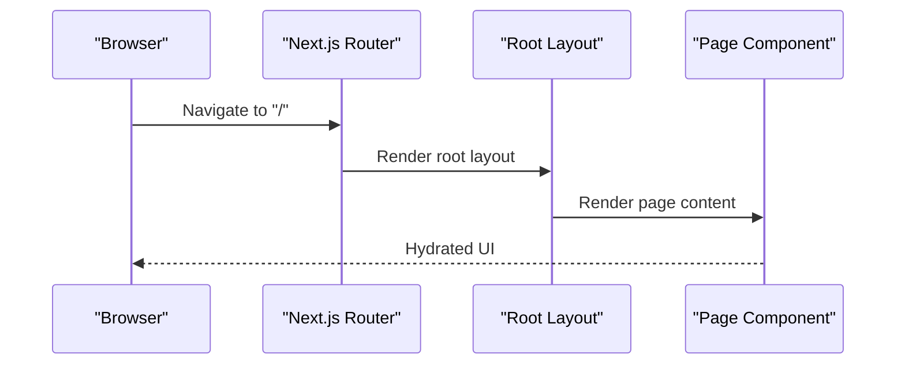
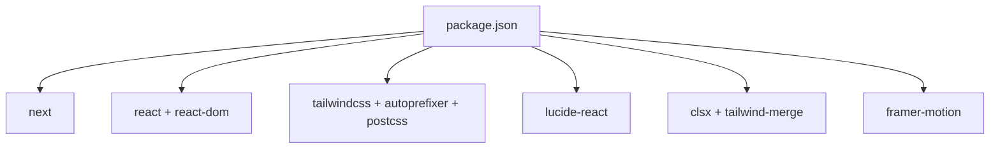

# Frontend Application

<cite>
**Referenced Files in This Document**
- [package.json](file://frontend/package.json)
- [tailwind.config.ts](file://frontend/tailwind.config.ts)
- [src/app/layout.tsx](file://frontend/src/app/layout.tsx)
- [src/app/page.tsx](file://frontend/src/app/page.tsx)
- [src/components/layout/Header.tsx](file://frontend/src/components/layout/Header.tsx)
- [src/components/layout/Footer.tsx](file://frontend/src/components/layout/Footer.tsx)
- [src/components/ui/Button.tsx](file://frontend/src/components/ui/Button.tsx)
- [src/components/ui/Card.tsx](file://frontend/src/components/ui/Card.tsx)
- [src/components/ui/Input.tsx](file://frontend/src/components/ui/Input.tsx)
- [src/components/ui/Badge.tsx](file://frontend/src/components/ui/Badge.tsx)
- [src/components/ui/index.ts](file://frontend/src/components/ui/index.ts)
- [src/components/skeletons/SkeletonBase.tsx](file://frontend/src/components/skeletons/SkeletonBase.tsx)
- [src/components/skeletons/ProjectCardSkeleton.tsx](file://frontend/src/components/skeletons/ProjectCardSkeleton.tsx)
- [src/components/skeletons/MilestoneSkeleton.tsx](file://frontend/src/components/skeletons/MilestoneSkeleton.tsx)
- [src/components/skeletons/StatCardSkeleton.tsx](file://frontend/src/components/skeletons/StatCardSkeleton.tsx)
- [src/utils/cn.ts](file://frontend/src/utils/cn.ts)
- [src/lib/utils.ts](file://frontend/src/lib/utils.ts)
</cite>

## Table of Contents
1. [Introduction](#introduction)
2. [Project Structure](#project-structure)
3. [Core Components](#core-components)
4. [Architecture Overview](#architecture-overview)
5. [Detailed Component Analysis](#detailed-component-analysis)
6. [Dependency Analysis](#dependency-analysis)
7. [Performance Considerations](#performance-considerations)
8. [Troubleshooting Guide](#troubleshooting-guide)
9. [Conclusion](#conclusion)
10. [Appendices](#appendices)

## Introduction
This document explains the frontend application built with Next.js App Router, React, and TypeScript. It covers the application architecture, component hierarchy, state management strategy, UI component system, styling with Tailwind CSS, responsive design, and patterns for integrating wallets (Freighter and XUMM), authentication flows, and transaction signing. Practical examples demonstrate component usage, routing patterns, and navigation structure. Guidance is included for handling loading states, empty states, and real-time updates from blockchain events.

## Project Structure
The frontend follows Next.js App Router conventions with a clear separation of pages, components, styles, and utilities:
- App shell and routing live under src/app
- Shared UI components under src/components
- Global styles and Tailwind configuration under src/styles and tailwind.config.ts
- Utility helpers under src/utils and src/lib

**Diagram sources**
- [src/app/layout.tsx](file://frontend/src/app/layout.tsx#L1-L29)
- [src/app/page.tsx](file://frontend/src/app/page.tsx#L1-L16)
- [src/components/layout/Header.tsx](file://frontend/src/components/layout/Header.tsx#L1-L20)
- [src/components/layout/Footer.tsx](file://frontend/src/components/layout/Footer.tsx#L1-L15)
- [src/components/ui/Button.tsx](file://frontend/src/components/ui/Button.tsx#L1-L39)
- [src/components/ui/Input.tsx](file://frontend/src/components/ui/Input.tsx#L1-L31)
- [src/components/ui/Card.tsx](file://frontend/src/components/ui/Card.tsx#L1-L19)
- [src/components/ui/Badge.tsx](file://frontend/src/components/ui/Badge.tsx#L1-L31)
- [src/components/ui/index.ts](file://frontend/src/components/ui/index.ts#L1-L5)
- [src/components/skeletons/SkeletonBase.tsx](file://frontend/src/components/skeletons/SkeletonBase.tsx#L1-L12)
- [src/components/skeletons/ProjectCardSkeleton.tsx](file://frontend/src/components/skeletons/ProjectCardSkeleton.tsx#L1-L28)
- [src/components/skeletons/MilestoneSkeleton.tsx](file://frontend/src/components/skeletons/MilestoneSkeleton.tsx#L1-L23)
- [src/components/skeletons/StatCardSkeleton.tsx](file://frontend/src/components/skeletons/StatCardSkeleton.tsx#L1-L11)
- [tailwind.config.ts](file://frontend/tailwind.config.ts#L1-L43)
- [src/utils/cn.ts](file://frontend/src/utils/cn.ts)
- [src/lib/utils.ts](file://frontend/src/lib/utils.ts)

**Section sources**
- [src/app/layout.tsx](file://frontend/src/app/layout.tsx#L1-L29)
- [src/app/page.tsx](file://frontend/src/app/page.tsx#L1-L16)
- [tailwind.config.ts](file://frontend/tailwind.config.ts#L1-L43)

## Core Components
- Layout shell: Root layout composes global metadata, fonts, and wraps children with a header, main content area, and footer.
- Page composition: The home page demonstrates a minimal layout with a header and content section.
- UI primitives: Button, Input, Card, and Badge provide consistent styling and behavior across the app.
- Skeleton loaders: Reusable skeleton components support loading states for cards, milestones, and stats.

Key implementation patterns:
- Props-driven variants and sizes for buttons and badges
- Controlled error display for inputs
- Composition via index barrel exports for UI modules
- Tailwind-based theming with CSS variable-based color tokens

**Section sources**
- [src/app/layout.tsx](file://frontend/src/app/layout.tsx#L1-L29)
- [src/app/page.tsx](file://frontend/src/app/page.tsx#L1-L16)
- [src/components/ui/Button.tsx](file://frontend/src/components/ui/Button.tsx#L1-L39)
- [src/components/ui/Input.tsx](file://frontend/src/components/ui/Input.tsx#L1-L31)
- [src/components/ui/Card.tsx](file://frontend/src/components/ui/Card.tsx#L1-L19)
- [src/components/ui/Badge.tsx](file://frontend/src/components/ui/Badge.tsx#L1-L31)
- [src/components/ui/index.ts](file://frontend/src/components/ui/index.ts#L1-L5)
- [src/components/skeletons/SkeletonBase.tsx](file://frontend/src/components/skeletons/SkeletonBase.tsx#L1-L12)
- [src/components/skeletons/ProjectCardSkeleton.tsx](file://frontend/src/components/skeletons/ProjectCardSkeleton.tsx#L1-L28)
- [src/components/skeletons/MilestoneSkeleton.tsx](file://frontend/src/components/skeletons/MilestoneSkeleton.tsx#L1-L23)
- [src/components/skeletons/StatCardSkeleton.tsx](file://frontend/src/components/skeletons/StatCardSkeleton.tsx#L1-L11)

## Architecture Overview
The application uses Next.js App Router with a root layout that injects a global header and footer around page content. Pages are organized under src/app, enabling route segments such as explore and dynamic routes like project/[id]. UI components are modular and reusable, with a central index barrel for clean imports.

**Diagram sources**
- [src/app/layout.tsx](file://frontend/src/app/layout.tsx#L1-L29)
- [src/components/layout/Header.tsx](file://frontend/src/components/layout/Header.tsx#L1-L20)
- [src/components/layout/Footer.tsx](file://frontend/src/components/layout/Footer.tsx#L1-L15)
- [src/app/page.tsx](file://frontend/src/app/page.tsx#L1-L16)

## Detailed Component Analysis

### Layout Components
- Header: Provides branding and a connect-like button using the shared Button primitive.
- Footer: Displays copyright and styled text with responsive flex behavior.

**Diagram sources**
- [src/components/layout/Header.tsx](file://frontend/src/components/layout/Header.tsx#L1-L20)
- [src/components/ui/Button.tsx](file://frontend/src/components/ui/Button.tsx#L1-L39)

**Section sources**
- [src/components/layout/Header.tsx](file://frontend/src/components/layout/Header.tsx#L1-L20)
- [src/components/layout/Footer.tsx](file://frontend/src/components/layout/Footer.tsx#L1-L15)

### UI Primitive Components
- Button: Accepts variant and size props to apply consistent styles and focus rings.
- Input: Renders a labeled input with optional error styling and accessibility attributes.
- Card: Wraps content in a dark-themed container with padding and rounded corners.
- Badge: Provides semantic variants for status indicators.

**Diagram sources**
- [src/components/ui/Button.tsx](file://frontend/src/components/ui/Button.tsx#L1-L39)
- [src/components/ui/Input.tsx](file://frontend/src/components/ui/Input.tsx#L1-L31)
- [src/components/ui/Card.tsx](file://frontend/src/components/ui/Card.tsx#L1-L19)
- [src/components/ui/Badge.tsx](file://frontend/src/components/ui/Badge.tsx#L1-L31)
- [src/components/ui/index.ts](file://frontend/src/components/ui/index.ts#L1-L5)

**Section sources**
- [src/components/ui/Button.tsx](file://frontend/src/components/ui/Button.tsx#L1-L39)
- [src/components/ui/Input.tsx](file://frontend/src/components/ui/Input.tsx#L1-L31)
- [src/components/ui/Card.tsx](file://frontend/src/components/ui/Card.tsx#L1-L19)
- [src/components/ui/Badge.tsx](file://frontend/src/components/ui/Badge.tsx#L1-L31)
- [src/components/ui/index.ts](file://frontend/src/components/ui/index.ts#L1-L5)

### Skeleton Components
Reusable skeleton loaders use a shared base component and utility class merging to animate placeholders during async data loads.

**Diagram sources**
- [src/components/skeletons/SkeletonBase.tsx](file://frontend/src/components/skeletons/SkeletonBase.tsx#L1-L12)
- [src/components/skeletons/ProjectCardSkeleton.tsx](file://frontend/src/components/skeletons/ProjectCardSkeleton.tsx#L1-L28)
- [src/components/skeletons/MilestoneSkeleton.tsx](file://frontend/src/components/skeletons/MilestoneSkeleton.tsx#L1-L23)
- [src/components/skeletons/StatCardSkeleton.tsx](file://frontend/src/components/skeletons/StatCardSkeleton.tsx#L1-L11)

**Section sources**
- [src/components/skeletons/SkeletonBase.tsx](file://frontend/src/components/skeletons/SkeletonBase.tsx#L1-L12)
- [src/components/skeletons/ProjectCardSkeleton.tsx](file://frontend/src/components/skeletons/ProjectCardSkeleton.tsx#L1-L28)
- [src/components/skeletons/MilestoneSkeleton.tsx](file://frontend/src/components/skeletons/MilestoneSkeleton.tsx#L1-L23)
- [src/components/skeletons/StatCardSkeleton.tsx](file://frontend/src/components/skeletons/StatCardSkeleton.tsx#L1-L11)

### Routing and Navigation Patterns
- Root layout composes the global shell and exposes a main content area for page components.
- Example pages:
  - Explore page with loading UI
  - Project detail page with loading UI
  - Home page demonstrating a simple layout

**Diagram sources**
- [src/app/layout.tsx](file://frontend/src/app/layout.tsx#L1-L29)
- [src/app/page.tsx](file://frontend/src/app/page.tsx#L1-L16)

**Section sources**
- [src/app/layout.tsx](file://frontend/src/app/layout.tsx#L1-L29)
- [src/app/page.tsx](file://frontend/src/app/page.tsx#L1-L16)

## Dependency Analysis
External dependencies include Next.js, React, Tailwind CSS toolchain, and UI icons. The project leverages Tailwind’s content scanning to include app, components, and pages directories.

**Diagram sources**
- [package.json](file://frontend/package.json#L1-L32)

**Section sources**
- [package.json](file://frontend/package.json#L1-L32)

## Performance Considerations
- Prefer skeleton loaders for async content to reduce perceived load time.
- Use Tailwind utilities for minimal CSS overhead; avoid excessive custom styles.
- Keep component props simple and consistent to improve render predictability.
- Defer heavy computations to server-side rendering or background tasks when possible.

## Troubleshooting Guide
Common issues and resolutions:
- Missing Tailwind classes: Verify Tailwind content globs include the relevant directories and rebuild the project.
- Responsive layout inconsistencies: Confirm responsive variants are applied and media queries align with device breakpoints.
- Skeleton animation not visible: Ensure the animation utility is present and Tailwind is configured to scan the components directory.
- Button/input focus rings: Validate focus ring utilities are enabled and color tokens are defined in the theme.

**Section sources**
- [tailwind.config.ts](file://frontend/tailwind.config.ts#L1-L43)
- [src/components/skeletons/SkeletonBase.tsx](file://frontend/src/components/skeletons/SkeletonBase.tsx#L1-L12)
- [src/components/ui/Button.tsx](file://frontend/src/components/ui/Button.tsx#L1-L39)
- [src/components/ui/Input.tsx](file://frontend/src/components/ui/Input.tsx#L1-L31)

## Conclusion
The frontend establishes a solid foundation with Next.js App Router, a modular UI component library, and a Tailwind-based design system. The skeleton loaders and layout components enable scalable, accessible UI patterns. While current pages and components are minimal, the architecture supports adding wallet integrations, authentication flows, and blockchain event handling with clear extension points.

## Appendices

### Wallet Integration Patterns (Conceptual)
- Provider abstraction: Define a unified interface for Freighter and XUMM to standardize connection and signing.
- Authentication flow: Connect wallet -> fetch account info -> persist session state -> redirect to protected routes.
- Transaction signing: Prepare operation(s) -> request signature via provider -> handle success/failure -> update UI state.
- Real-time updates: Subscribe to network events and refresh UI accordingly.

[No sources needed since this section provides conceptual guidance]

### State Management Strategy (Conceptual)
- Local component state for UI toggles and forms
- Context for shared data like wallet state and user preferences
- Server actions and revalidation for data mutations
- Skeletons and loading states to communicate async transitions

[No sources needed since this section provides conceptual guidance]