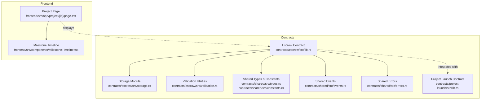
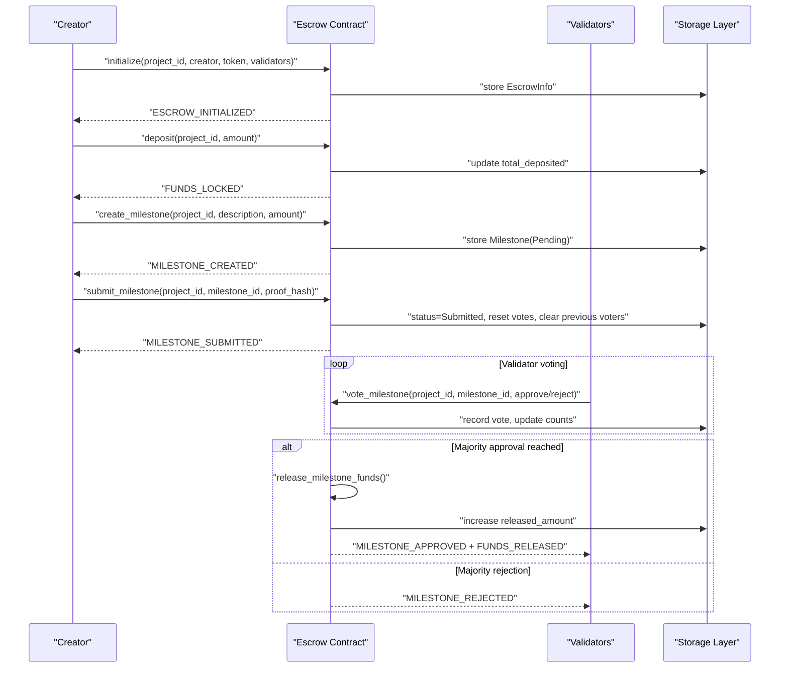
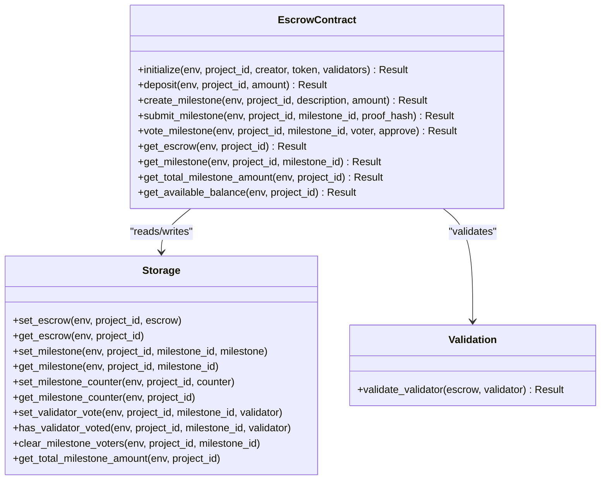
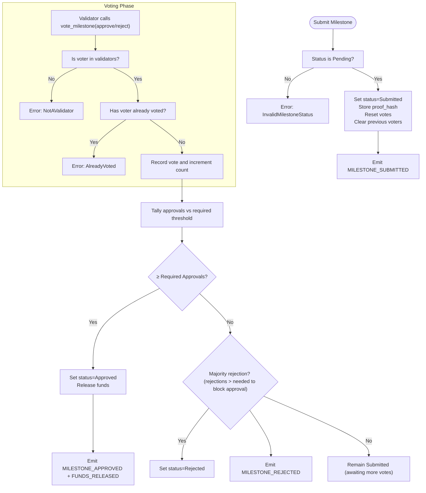
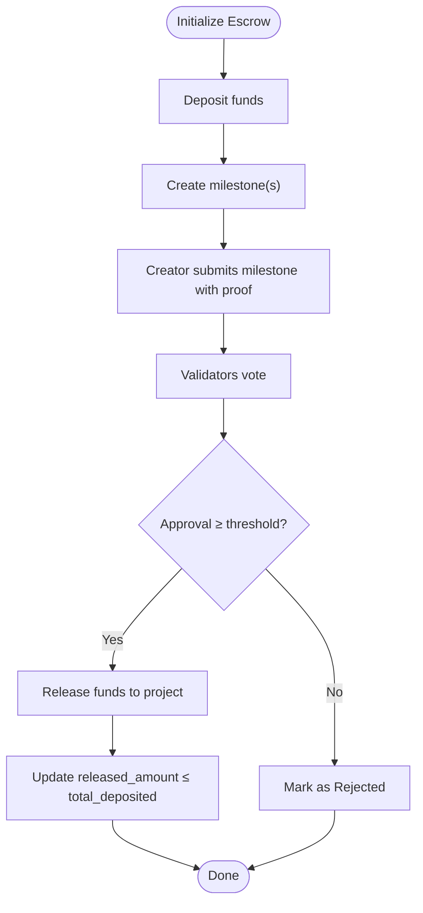
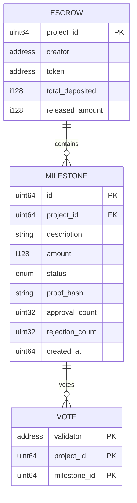
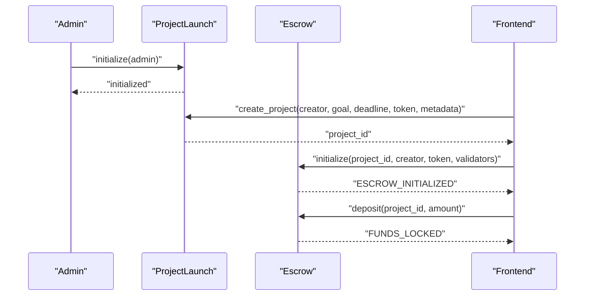
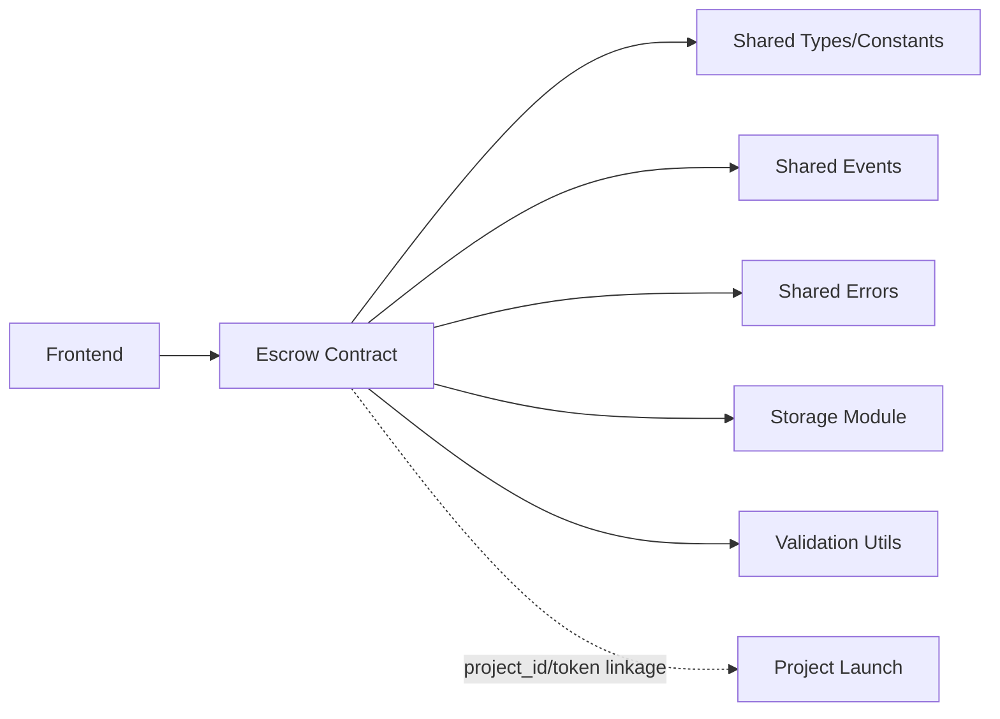

# Escrow & Milestone Management

<cite>
**Referenced Files in This Document**
- [lib.rs](file://contracts/escrow/src/lib.rs)
- [storage.rs](file://contracts/escrow/src/storage.rs)
- [validation.rs](file://contracts/escrow/src/validation.rs)
- [tests.rs](file://contracts/escrow/src/tests.rs)
- [IMPLEMENTATION.md](file://contracts/escrow/IMPLEMENTATION.md)
- [constants.rs](file://contracts/shared/src/constants.rs)
- [events.rs](file://contracts/shared/src/events.rs)
- [errors.rs](file://contracts/shared/src/errors.rs)
- [types.rs](file://contracts/shared/src/types.rs)
- [lib.rs (project-launch)](file://contracts/project-launch/src/lib.rs)
- [page.tsx](file://frontend/src/app/project/[id]/page.tsx)
- [MilestoneTimeline.tsx](file://frontend/src/components/MilestoneTimeline.tsx)
</cite>

## Table of Contents
1. [Introduction](#introduction)
2. [Project Structure](#project-structure)
3. [Core Components](#core-components)
4. [Architecture Overview](#architecture-overview)
5. [Detailed Component Analysis](#detailed-component-analysis)
6. [Dependency Analysis](#dependency-analysis)
7. [Performance Considerations](#performance-considerations)
8. [Troubleshooting Guide](#troubleshooting-guide)
9. [Conclusion](#conclusion)
10. [Appendices](#appendices)

## Introduction
This document explains the Escrow & Milestone Management feature that safeguards funds and releases them conditionally upon achievement of project milestones. It covers the escrow contract’s role, milestone validation and proof submission, automated release triggers, storage architecture, and integration with the project launch contracts. Practical examples illustrate how creators submit milestone proofs, how validators verify progress, and how funds are automatically released or remain protected.

Security guarantees include validator-majority approval, immutable on-chain state, transparent event logs, and strict invariants preventing double release and over-allocation.

## Project Structure
The escrow feature is implemented as a standalone contract package with supporting shared types, constants, events, and errors. The frontend demonstrates milestone visualization and user-facing workflows.

**Diagram sources**
- [lib.rs](file://contracts/escrow/src/lib.rs#L1-L367)
- [storage.rs](file://contracts/escrow/src/storage.rs#L1-L144)
- [validation.rs](file://contracts/escrow/src/validation.rs#L1-L13)
- [types.rs](file://contracts/shared/src/types.rs#L1-L41)
- [constants.rs](file://contracts/shared/src/constants.rs#L1-L40)
- [events.rs](file://contracts/shared/src/events.rs#L1-L31)
- [errors.rs](file://contracts/shared/src/errors.rs#L1-L54)
- [lib.rs (project-launch)](file://contracts/project-launch/src/lib.rs#L1-L363)
- [page.tsx](file://frontend/src/app/project/[id]/page.tsx#L1-L384)
- [MilestoneTimeline.tsx](file://frontend/src/components/MilestoneTimeline.tsx#L1-L115)

**Section sources**
- [lib.rs](file://contracts/escrow/src/lib.rs#L1-L367)
- [IMPLEMENTATION.md](file://contracts/escrow/IMPLEMENTATION.md#L1-L419)

## Core Components
- Escrow contract: Initializes escrow, accepts deposits, creates milestones, accepts milestone proofs, and executes validator-approved releases.
- Storage module: Provides persistent storage for escrow info, milestones, counters, and validator votes.
- Validation utilities: Enforce validator whitelist checks.
- Shared types/constants/events/errors: Define data structures, thresholds, and error semantics used across contracts.
- Project launch contract: Manages project lifecycle and integrates with escrow via project IDs and token addresses.

Key capabilities:
- Secure fund holding with on-chain accounting
- Milestone-based releases gated by majority validator approval
- Transparent lifecycle events for all state transitions
- Immutable invariants preventing double release and over-allocation

**Section sources**
- [lib.rs](file://contracts/escrow/src/lib.rs#L22-L346)
- [storage.rs](file://contracts/escrow/src/storage.rs#L11-L144)
- [validation.rs](file://contracts/escrow/src/validation.rs#L5-L12)
- [IMPLEMENTATION.md](file://contracts/escrow/IMPLEMENTATION.md#L15-L78)
- [constants.rs](file://contracts/shared/src/constants.rs#L24-L28)
- [events.rs](file://contracts/shared/src/events.rs#L13-L16)
- [errors.rs](file://contracts/shared/src/errors.rs#L21-L26)

## Architecture Overview
The escrow contract orchestrates milestone-based fund releases. Creators propose milestones, validators vote, and approved milestones trigger automatic fund releases. The system emits events for transparency and maintains strict invariants.

**Diagram sources**
- [lib.rs](file://contracts/escrow/src/lib.rs#L31-L346)
- [storage.rs](file://contracts/escrow/src/storage.rs#L11-L107)
- [events.rs](file://contracts/shared/src/events.rs#L13-L16)

**Section sources**
- [lib.rs](file://contracts/escrow/src/lib.rs#L22-L346)
- [IMPLEMENTATION.md](file://contracts/escrow/IMPLEMENTATION.md#L80-L232)

## Detailed Component Analysis

### Escrow Contract API and Lifecycle
The contract exposes functions to initialize escrow, accept deposits, create milestones, submit proofs, and vote on milestones. It enforces authorization, validates inputs, and emits lifecycle events.

**Diagram sources**
- [lib.rs](file://contracts/escrow/src/lib.rs#L22-L346)
- [storage.rs](file://contracts/escrow/src/storage.rs#L11-L144)
- [validation.rs](file://contracts/escrow/src/validation.rs#L5-L12)

**Section sources**
- [lib.rs](file://contracts/escrow/src/lib.rs#L22-L346)
- [IMPLEMENTATION.md](file://contracts/escrow/IMPLEMENTATION.md#L80-L303)

### Milestone Validation and Proof Submission
- Milestone statuses: Pending → Submitted → Approved/Rejected
- Proof submission: Creator sets a proof hash and transitions status to Submitted
- Validator voting: Each validator may vote once per milestone; majority approval triggers release

**Diagram sources**
- [lib.rs](file://contracts/escrow/src/lib.rs#L169-L307)
- [storage.rs](file://contracts/escrow/src/storage.rs#L73-L107)
- [constants.rs](file://contracts/shared/src/constants.rs#L24-L28)
- [events.rs](file://contracts/shared/src/events.rs#L13-L16)

**Section sources**
- [lib.rs](file://contracts/escrow/src/lib.rs#L169-L307)
- [IMPLEMENTATION.md](file://contracts/escrow/IMPLEMENTATION.md#L167-L232)

### Automated Release Triggers and Refund Protection
- Release occurs only on majority approval; the helper function ensures monotonic increases and prevents over-release.
- Refund protection: The system does not implement refunds; funds are released upon approval and remain unreleased otherwise.

**Diagram sources**
- [lib.rs](file://contracts/escrow/src/lib.rs#L348-L366)
- [IMPLEMENTATION.md](file://contracts/escrow/IMPLEMENTATION.md#L351-L358)

**Section sources**
- [lib.rs](file://contracts/escrow/src/lib.rs#L348-L366)
- [IMPLEMENTATION.md](file://contracts/escrow/IMPLEMENTATION.md#L351-L358)

### Storage Architecture for Milestone Records
- Composite keys prevent collisions across projects and milestones.
- Separate counters track milestone IDs per project.
- Validator vote records prevent double voting.

**Diagram sources**
- [storage.rs](file://contracts/escrow/src/storage.rs#L5-L144)
- [IMPLEMENTATION.md](file://contracts/escrow/IMPLEMENTATION.md#L335-L345)

**Section sources**
- [storage.rs](file://contracts/escrow/src/storage.rs#L11-L144)
- [IMPLEMENTATION.md](file://contracts/escrow/IMPLEMENTATION.md#L335-L345)

### Integration with Project Launch Contracts
- Project launch manages project creation, funding goals, deadlines, and contributions.
- Escrow uses the project ID to namespace its storage and associates token addresses for accounting.
- Together, they form a complete funding lifecycle: project creation, funding, and milestone-based disbursement.

**Diagram sources**
- [lib.rs (project-launch)](file://contracts/project-launch/src/lib.rs#L74-L149)
- [lib.rs](file://contracts/escrow/src/lib.rs#L22-L103)
- [page.tsx](file://frontend/src/app/project/[id]/page.tsx#L1-L384)

**Section sources**
- [lib.rs (project-launch)](file://contracts/project-launch/src/lib.rs#L74-L149)
- [lib.rs](file://contracts/escrow/src/lib.rs#L22-L103)

### Practical Examples

- Creator submits milestone proof:
  - Creator calls submit milestone with a proof hash; status transitions to Submitted and votes are reset.
  - See [submit_milestone](file://contracts/escrow/src/lib.rs#L169-L211).

- Validators verify progress and vote:
  - Validators call vote milestone; each validator may vote once; majority approval triggers release.
  - See [vote_milestone](file://contracts/escrow/src/lib.rs#L213-L307).

- Automated release:
  - On approval, released amount increments and funds are emitted as released.
  - See [release_milestone_funds](file://contracts/escrow/src/lib.rs#L348-L366).

- Refund protection:
  - No refund mechanism exists; unapproved milestones remain locked.
  - See [MilestoneStatus](file://contracts/escrow/IMPLEMENTATION.md#L67-L78).

**Section sources**
- [lib.rs](file://contracts/escrow/src/lib.rs#L169-L307)
- [IMPLEMENTATION.md](file://contracts/escrow/IMPLEMENTATION.md#L67-L78)

## Dependency Analysis
- Internal dependencies:
  - Escrow contract depends on shared types, constants, events, and errors.
  - Storage module encapsulates persistence and composite key management.
  - Validation module centralizes validator checks.
- External integration:
  - Project launch contract provides project lifecycle context and token addresses.
  - Frontend consumes events and displays milestone states.

**Diagram sources**
- [lib.rs](file://contracts/escrow/src/lib.rs#L3-L17)
- [storage.rs](file://contracts/escrow/src/storage.rs#L1-L3)
- [validation.rs](file://contracts/escrow/src/validation.rs#L1-L3)
- [constants.rs](file://contracts/shared/src/constants.rs#L1-L40)
- [events.rs](file://contracts/shared/src/events.rs#L1-L31)
- [errors.rs](file://contracts/shared/src/errors.rs#L1-L54)
- [lib.rs (project-launch)](file://contracts/project-launch/src/lib.rs#L1-L12)
- [page.tsx](file://frontend/src/app/project/[id]/page.tsx#L1-L384)

**Section sources**
- [lib.rs](file://contracts/escrow/src/lib.rs#L3-L17)
- [storage.rs](file://contracts/escrow/src/storage.rs#L1-L3)
- [validation.rs](file://contracts/escrow/src/validation.rs#L1-L3)
- [constants.rs](file://contracts/shared/src/constants.rs#L1-L40)
- [events.rs](file://contracts/shared/src/events.rs#L1-L31)
- [errors.rs](file://contracts/shared/src/errors.rs#L1-L54)
- [lib.rs (project-launch)](file://contracts/project-launch/src/lib.rs#L1-L12)

## Performance Considerations
- Storage efficiency: Composite keys minimize collisions and enable targeted reads/writes.
- Safe arithmetic: Checked addition/subtraction prevents overflow and ensures deterministic state.
- Voting scale: Validator vote records use compact composite keys; clearing votes on resubmission is bounded by validator count.
- Event-driven UI: Frontend renders milestone timelines from stored state and emitted events.

[No sources needed since this section provides general guidance]

## Troubleshooting Guide
Common issues and resolutions:
- Not initialized: Ensure initialize is called before deposit/create_milestone.
- Already initialized: Escrow exists for the given project ID; avoid duplicate initialization.
- Unauthorized: Only the creator can create milestones; only validators can vote.
- Invalid input: Amounts must be positive; milestone amounts must not exceed total deposited.
- Not found: Accessing non-existent milestones or escrows returns not found.
- Invalid milestone status: Submitting when not pending or voting when not submitted fails.
- Not a validator: Caller must be on the validators list.
- Already voted: Validators may vote only once per milestone.
- Insufficient escrow balance: Attempting to release more than deposited is prevented.

**Section sources**
- [errors.rs](file://contracts/shared/src/errors.rs#L21-L26)
- [lib.rs](file://contracts/escrow/src/lib.rs#L37-L48)
- [lib.rs](file://contracts/escrow/src/lib.rs#L85-L94)
- [lib.rs](file://contracts/escrow/src/lib.rs#L121-L134)
- [lib.rs](file://contracts/escrow/src/lib.rs#L188-L191)
- [lib.rs](file://contracts/escrow/src/lib.rs#L232-L235)
- [lib.rs](file://contracts/escrow/src/lib.rs#L245-L248)
- [lib.rs](file://contracts/escrow/src/lib.rs#L360-L362)

## Conclusion
The Escrow & Milestone Management feature provides a robust, transparent framework for secure fund holding and milestone-based releases. Through validator-majority approval, immutable storage, and comprehensive event logging, it ensures accountability and protects contributors’ capital. Integrations with the project launch contracts and the frontend demonstrate a cohesive funding lifecycle from project creation to milestone disbursement.

[No sources needed since this section summarizes without analyzing specific files]

## Appendices

### Security Guarantees and Transparency
- Validator-majority approval: Threshold defined by constants.
- Immutable state: Strict invariants enforced by storage and helper functions.
- Transparent events: All lifecycle transitions emit standardized events.
- Whitelisted validators: Only designated addresses may vote.

**Section sources**
- [constants.rs](file://contracts/shared/src/constants.rs#L24-L28)
- [lib.rs](file://contracts/escrow/src/lib.rs#L348-L366)
- [events.rs](file://contracts/shared/src/events.rs#L13-L16)
- [IMPLEMENTATION.md](file://contracts/escrow/IMPLEMENTATION.md#L351-L358)

### Frontend Milestone Visualization
The frontend displays milestone status, progress, and release details, reflecting the on-chain state and events.

**Section sources**
- [page.tsx](file://frontend/src/app/project/[id]/page.tsx#L9-L65)
- [MilestoneTimeline.tsx](file://frontend/src/components/MilestoneTimeline.tsx#L18-L45)