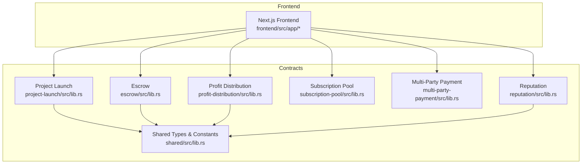
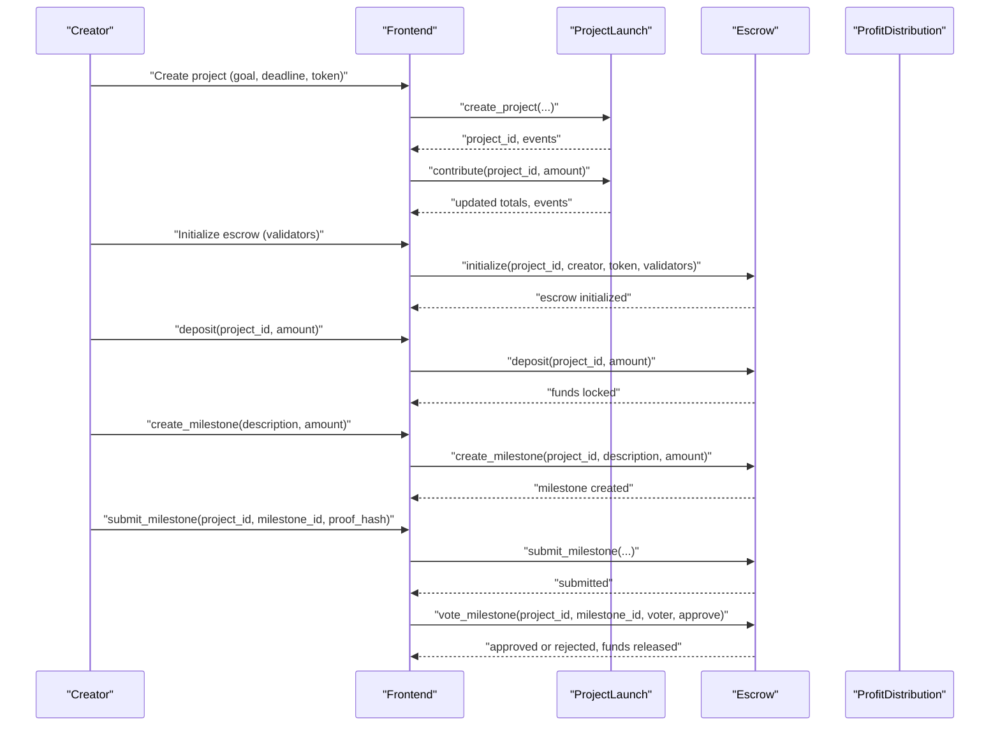
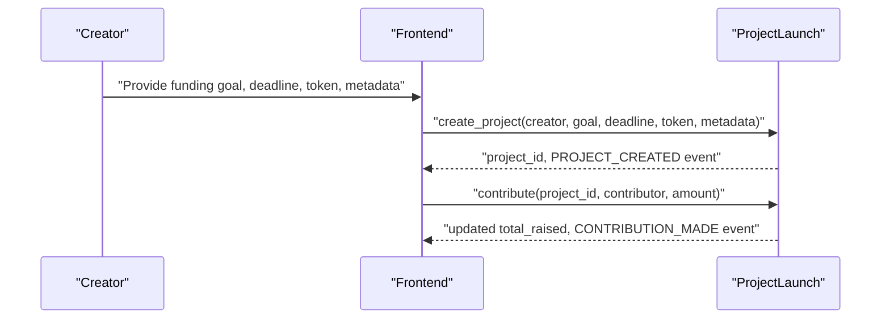
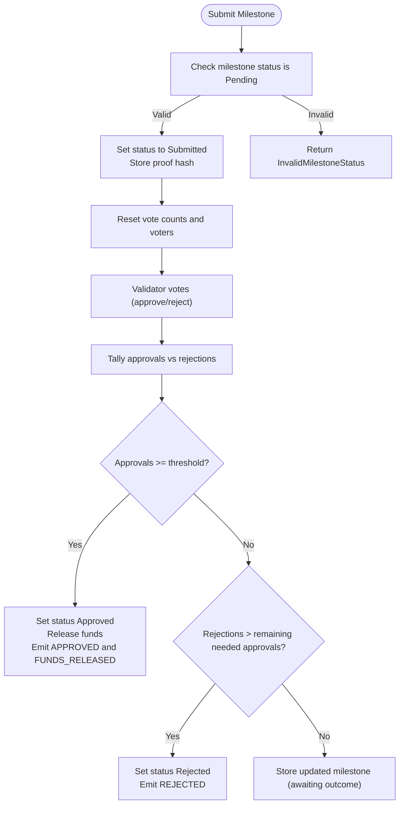
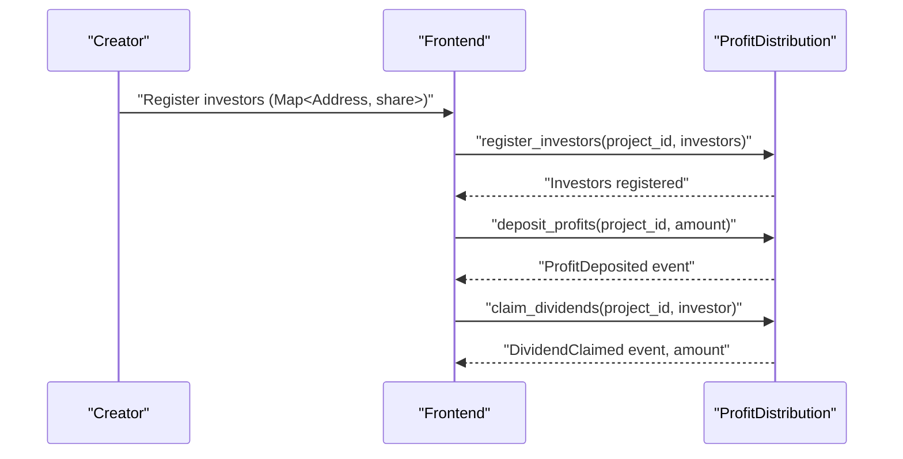
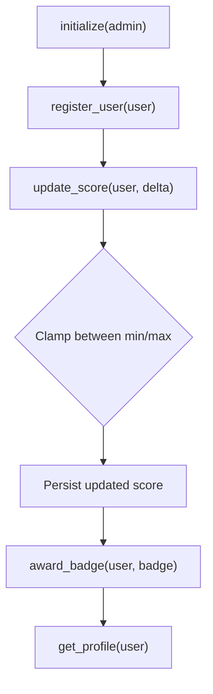
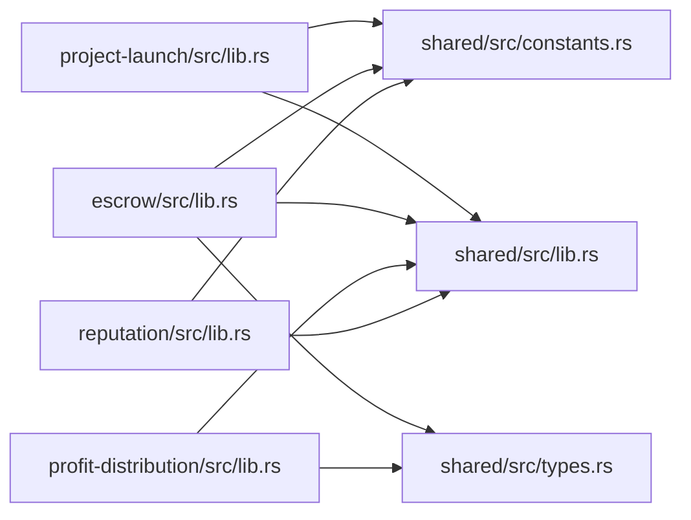

# Key Features

<cite>
**Referenced Files in This Document**
- [README.md](file://README.md)
- [contracts/Cargo.toml](file://contracts/Cargo.toml)
- [contracts/SETUP.md](file://contracts/SETUP.md)
- [contracts/project-launch/src/lib.rs](file://contracts/project-launch/src/lib.rs)
- [contracts/escrow/src/lib.rs](file://contracts/escrow/src/lib.rs)
- [contracts/escrow/src/storage.rs](file://contracts/escrow/src/storage.rs)
- [contracts/escrow/src/validation.rs](file://contracts/escrow/src/validation.rs)
- [contracts/profit-distribution/src/lib.rs](file://contracts/profit-distribution/src/lib.rs)
- [contracts/profit-distribution/src/storage.rs](file://contracts/profit-distribution/src/storage.rs)
- [contracts/profit-distribution/src/types.rs](file://contracts/profit-distribution/src/types.rs)
- [contracts/profit-distribution/src/events.rs](file://contracts/profit-distribution/src/events.rs)
- [contracts/profit-distribution/src/errors.rs](file://contracts/profit-distribution/src/errors.rs)
- [contracts/subscription-pool/src/lib.rs](file://contracts/subscription-pool/src/lib.rs)
- [contracts/multi-party-payment/src/lib.rs](file://contracts/multi-party-payment/src/lib.rs)
- [contracts/reputation/src/lib.rs](file://contracts/reputation/src/lib.rs)
- [contracts/shared/src/lib.rs](file://contracts/shared/src/lib.rs)
- [contracts/shared/src/constants.rs](file://contracts/shared/src/constants.rs)
- [contracts/shared/src/types.rs](file://contracts/shared/src/types.rs)
</cite>

## Table of Contents
1. [Introduction](#introduction)
2. [Project Structure](#project-structure)
3. [Core Components](#core-components)
4. [Architecture Overview](#architecture-overview)
5. [Detailed Component Analysis](#detailed-component-analysis)
6. [Dependency Analysis](#dependency-analysis)
7. [Performance Considerations](#performance-considerations)
8. [Troubleshooting Guide](#troubleshooting-guide)
9. [Conclusion](#conclusion)

## Introduction
This document presents the key features of the NovaFund platform as implemented in the smart contracts. It focuses on how creators launch projects, how investors contribute, and how trustless escrow, milestone management, automated profit distribution, subscription pooling, multi-party payment splitting, and the reputation system collectively form a comprehensive funding ecosystem. Each feature’s purpose, underlying smart contract functionality, user benefits, and technical implementation details are explained with practical examples and code-mapped diagrams.

## Project Structure
NovaFund organizes functionality into modular smart contracts under the contracts directory, each responsible for a distinct aspect of the funding lifecycle. Shared modules define common types, constants, and utilities used across contracts. The frontend integrates with these contracts to present a user interface for exploring projects, contributing, and managing milestones.

**Diagram sources**
- [contracts/project-launch/src/lib.rs](file://contracts/project-launch/src/lib.rs#L1-L363)
- [contracts/escrow/src/lib.rs](file://contracts/escrow/src/lib.rs#L1-L367)
- [contracts/profit-distribution/src/lib.rs](file://contracts/profit-distribution/src/lib.rs#L1-L78)
- [contracts/subscription-pool/src/lib.rs](file://contracts/subscription-pool/src/lib.rs#L1-L9)
- [contracts/multi-party-payment/src/lib.rs](file://contracts/multi-party-payment/src/lib.rs#L1-L9)
- [contracts/reputation/src/lib.rs](file://contracts/reputation/src/lib.rs#L1-L510)
- [contracts/shared/src/lib.rs](file://contracts/shared/src/lib.rs#L1-L20)

**Section sources**
- [README.md](file://README.md)
- [contracts/Cargo.toml](file://contracts/Cargo.toml)
- [contracts/SETUP.md](file://contracts/SETUP.md)

## Core Components
- Project Launch: Enables creators to define funding goals, deadlines, and metadata, and allows investors to contribute within the configured constraints.
- Trustless Escrow and Milestone Management: Provides a validator-governed system to lock funds, propose milestones with proof hashes, and release funds upon majority approval.
- Automated Profit Distribution: Supports registering investor shares, depositing profits, and enabling proportional dividend claims per share.
- Subscription Pool: Intended to manage recurring investment pools and withdrawals with portfolio calculations.
- Multi-Party Payment Splitting: Intended to split incoming payments among multiple stakeholders according to configured shares.
- Reputation System: Tracks user scores and badges to incentivize participation and maintain community quality.

**Section sources**
- [contracts/project-launch/src/lib.rs](file://contracts/project-launch/src/lib.rs#L1-L363)
- [contracts/escrow/src/lib.rs](file://contracts/escrow/src/lib.rs#L1-L367)
- [contracts/profit-distribution/src/lib.rs](file://contracts/profit-distribution/src/lib.rs#L1-L78)
- [contracts/subscription-pool/src/lib.rs](file://contracts/subscription-pool/src/lib.rs#L1-L9)
- [contracts/multi-party-payment/src/lib.rs](file://contracts/multi-party-payment/src/lib.rs#L1-L9)
- [contracts/reputation/src/lib.rs](file://contracts/reputation/src/lib.rs#L1-L510)

## Architecture Overview
The NovaFund architecture connects front-end interactions to contract functions. Creators use Project Launch to create campaigns; investors contribute via Project Launch; funds are moved into Escrow for milestone-based releases; Profit Distribution handles post-successful-funding profit sharing; Subscription Pool and Multi-Party Payment are placeholders for recurring and stakeholder splits; Reputation tracks community metrics.

**Diagram sources**
- [contracts/project-launch/src/lib.rs](file://contracts/project-launch/src/lib.rs#L87-L212)
- [contracts/escrow/src/lib.rs](file://contracts/escrow/src/lib.rs#L24-L307)

## Detailed Component Analysis

### Project Launch Contracts
Project Launch enables creators to set up funding campaigns and accepts contributions from investors. It enforces minimum funding goals, project durations, and contribution thresholds. Contributions are tracked per project and emitted as events.

Key capabilities:
- Campaign creation with validation of funding goal, deadline range, and metadata hash.
- Contribution acceptance with checks for active status, deadline, and minimum contribution.
- Persistent storage of contributions and project state.
- Event emission for project creation and contributions.

Practical example:
- Creator sets up a campaign with a funding goal and deadline; investors contribute until the deadline passes or the goal is reached.

**Diagram sources**
- [contracts/project-launch/src/lib.rs](file://contracts/project-launch/src/lib.rs#L87-L212)

**Section sources**
- [contracts/project-launch/src/lib.rs](file://contracts/project-launch/src/lib.rs#L14-L248)
- [contracts/shared/src/constants.rs](file://contracts/shared/src/constants.rs#L9-L22)

### Trustless Escrow and Milestone Management
Escrow manages funds in a trustless manner with validator approval required for milestone releases. It supports initializing an escrow, locking funds, creating milestones, submitting proofs, and approving or rejecting milestones based on thresholds.

Key capabilities:
- Initialize escrow with validators and token.
- Deposit funds and track total and released amounts.
- Create milestones with amounts constrained by total deposits.
- Submit milestones with proof hashes and reset voting state on resubmission.
- Validator voting with majority thresholds determining approval or rejection.
- Automatic fund release upon approval and event emission.

**Diagram sources**
- [contracts/escrow/src/lib.rs](file://contracts/escrow/src/lib.rs#L169-L307)
- [contracts/escrow/src/storage.rs](file://contracts/escrow/src/storage.rs#L73-L107)

**Section sources**
- [contracts/escrow/src/lib.rs](file://contracts/escrow/src/lib.rs#L24-L346)
- [contracts/escrow/src/storage.rs](file://contracts/escrow/src/storage.rs#L1-L144)
- [contracts/escrow/src/validation.rs](file://contracts/escrow/src/validation.rs#L1-L13)
- [contracts/shared/src/constants.rs](file://contracts/shared/src/constants.rs#L24-L28)

### Automated Profit Distribution
Profit Distribution is designed to register investor shares, accept profit deposits, and enable proportional dividend claims. It maintains investor share records and emits events for deposits and claims.

Key capabilities:
- Initialize distribution for a project and token.
- Register investors with share percentages and validate totals.
- Deposit profits and compute claimable amounts proportionally.
- Allow investors to claim dividends and track total claimed.

**Diagram sources**
- [contracts/profit-distribution/src/lib.rs](file://contracts/profit-distribution/src/lib.rs#L36-L78)
- [contracts/profit-distribution/src/storage.rs](file://contracts/profit-distribution/src/storage.rs#L8-L33)
- [contracts/profit-distribution/src/types.rs](file://contracts/profit-distribution/src/types.rs#L3-L18)
- [contracts/profit-distribution/src/events.rs](file://contracts/profit-distribution/src/events.rs#L9-L21)

**Section sources**
- [contracts/profit-distribution/src/lib.rs](file://contracts/profit-distribution/src/lib.rs#L1-L78)
- [contracts/profit-distribution/src/storage.rs](file://contracts/profit-distribution/src/storage.rs#L1-L33)
- [contracts/profit-distribution/src/types.rs](file://contracts/profit-distribution/src/types.rs#L1-L18)
- [contracts/profit-distribution/src/events.rs](file://contracts/profit-distribution/src/events.rs#L1-L21)
- [contracts/profit-distribution/src/errors.rs](file://contracts/profit-distribution/src/errors.rs#L1-L16)

### Subscription Pool
Subscription Pool is currently a placeholder contract indicating future functionality for recurring investment pools, subscriber deposits, portfolio rebalancing, and payout calculations.

User benefits (future):
- Automated recurring investments aligned to weekly/monthly/quarterly cadences.
- Simplified withdrawal and payout computation.

Implementation status:
- Placeholder contract with TODO comments.

**Section sources**
- [contracts/subscription-pool/src/lib.rs](file://contracts/subscription-pool/src/lib.rs#L1-L9)

### Multi-Party Payment Splitting
Multi-Party Payment is currently a placeholder contract indicating future functionality for setting up multiple stakeholders, receiving and splitting payments automatically, and optional vesting schedules.

User benefits (future):
- Configure share percentages among parties.
- Automatic payment splitting upon receipt.
- Optional vesting controls for staged payouts.

Implementation status:
- Placeholder contract with TODO comments.

**Section sources**
- [contracts/multi-party-payment/src/lib.rs](file://contracts/multi-party-payment/src/lib.rs#L1-L9)

### Reputation System
The Reputation contract manages user profiles, scores, and badges. It supports initialization, user registration, score updates (admin-only), badge awards (admin-only), and profile queries.

Key capabilities:
- Initialize with admin-only control.
- Register users with default starting score.
- Update scores with min/max clamping.
- Award badges with duplicate prevention.
- Query profiles and enforce initialization checks.

**Diagram sources**
- [contracts/reputation/src/lib.rs](file://contracts/reputation/src/lib.rs#L66-L251)

**Section sources**
- [contracts/reputation/src/lib.rs](file://contracts/reputation/src/lib.rs#L1-L252)
- [contracts/shared/src/constants.rs](file://contracts/shared/src/constants.rs#L30-L36)

## Dependency Analysis
Contracts depend on shared modules for types, constants, and utilities. Project Launch uses shared constants for validation; Escrow uses shared types and constants for milestone thresholds and validator requirements; Profit Distribution uses shared types for investor shares and emits events; Reputation uses shared constants for score ranges.

**Diagram sources**
- [contracts/shared/src/lib.rs](file://contracts/shared/src/lib.rs#L1-L20)
- [contracts/shared/src/constants.rs](file://contracts/shared/src/constants.rs#L1-L40)
- [contracts/shared/src/types.rs](file://contracts/shared/src/types.rs#L1-L41)
- [contracts/project-launch/src/lib.rs](file://contracts/project-launch/src/lib.rs#L7-L12)
- [contracts/escrow/src/lib.rs](file://contracts/escrow/src/lib.rs#L4-L9)
- [contracts/profit-distribution/src/lib.rs](file://contracts/profit-distribution/src/lib.rs#L19-L24)
- [contracts/reputation/src/lib.rs](file://contracts/reputation/src/lib.rs#L3-L6)

**Section sources**
- [contracts/shared/src/lib.rs](file://contracts/shared/src/lib.rs#L1-L20)
- [contracts/shared/src/constants.rs](file://contracts/shared/src/constants.rs#L1-L40)
- [contracts/shared/src/types.rs](file://contracts/shared/src/types.rs#L1-L41)

## Performance Considerations
- Storage access patterns: Escrow and Profit Distribution rely on persistent storage with indexed keys; ensure minimal reads/writes per transaction.
- Integer overflow safety: Contracts use checked arithmetic for balances and vote tallies; leverage saturating math where appropriate to prevent panics.
- Event-driven UI updates: Frontend can subscribe to emitted events to reduce polling and improve responsiveness.
- Gas efficiency: Batch operations where feasible and avoid unnecessary storage writes.

## Troubleshooting Guide
Common issues and resolutions:
- Project Launch
  - Invalid funding goal or deadline: Ensure funding goal meets minimum thresholds and deadline duration falls within allowed bounds.
  - Contribution too low: Verify contribution meets the minimum contribution amount.
  - Project not active or deadline passed: Contributions are only accepted while the project is active and before the deadline.
- Escrow
  - Not a validator: Only registered validators can vote; ensure the voter address is part of the validator set.
  - Invalid milestone status: Submit requires the milestone to be pending; resubmissions reset votes and status.
  - Insufficient escrow balance: Total milestone amounts cannot exceed total deposited funds.
- Profit Distribution
  - Share totals not equal to 100%: Ensure registered shares sum to the total share value.
  - Nothing to claim: Profits must be deposited before investors can claim.
  - Unauthorized operations: Certain actions require admin or authorized addresses.
- Reputation
  - Not initialized: Initialize the contract before registering users or updating scores.
  - User not registered: Register users before attempting updates or badge awards.
  - Badge already awarded: Prevents duplicate badge issuance.

**Section sources**
- [contracts/project-launch/src/lib.rs](file://contracts/project-launch/src/lib.rs#L96-L111)
- [contracts/escrow/src/lib.rs](file://contracts/escrow/src/lib.rs#L232-L248)
- [contracts/escrow/src/lib.rs](file://contracts/escrow/src/lib.rs#L121-L134)
- [contracts/profit-distribution/src/errors.rs](file://contracts/profit-distribution/src/errors.rs#L6-L16)
- [contracts/reputation/src/lib.rs](file://contracts/reputation/src/lib.rs#L131-L156)
- [contracts/reputation/src/lib.rs](file://contracts/reputation/src/lib.rs#L168-L195)

## Conclusion
NovaFund’s smart contracts establish a robust, trustless framework for project funding, milestone governance, and profit sharing. Project Launch provides the foundation for campaigns and contributions; Escrow ensures transparent, validator-governed fund release; Profit Distribution automates investor payouts; Subscription Pool and Multi-Party Payment are future-ready modules for recurring and stakeholder splits; the Reputation system encourages healthy participation. Together, these components create a cohesive ecosystem where creators, investors, validators, and stakeholders can engage confidently and efficiently.