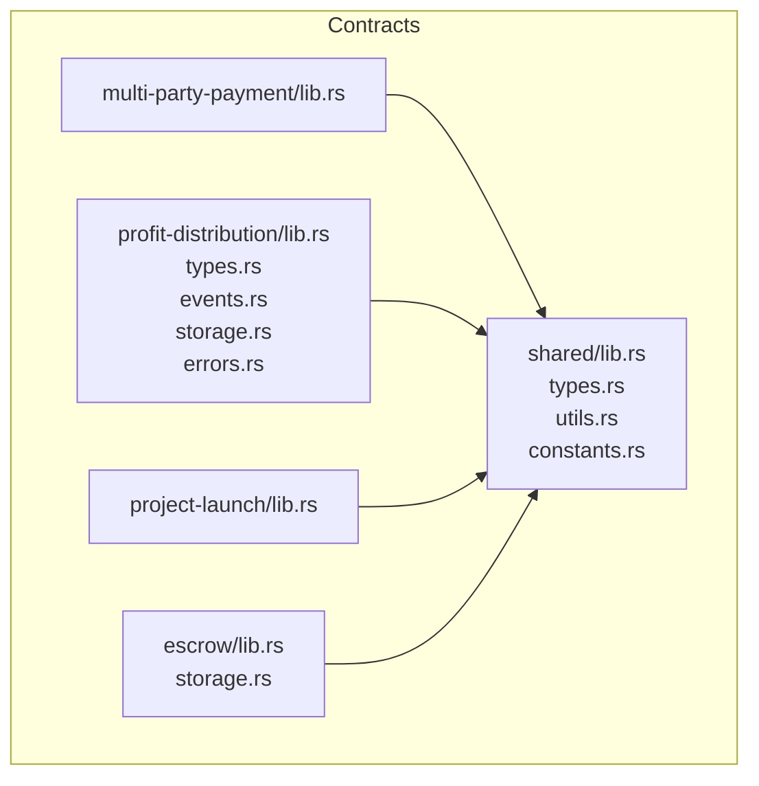
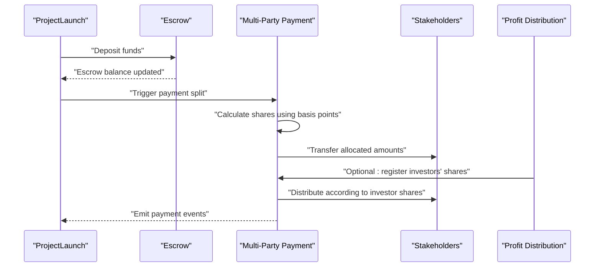
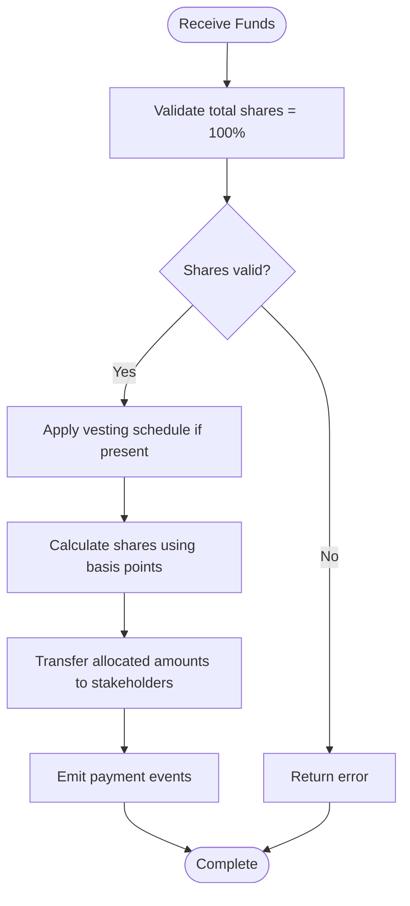
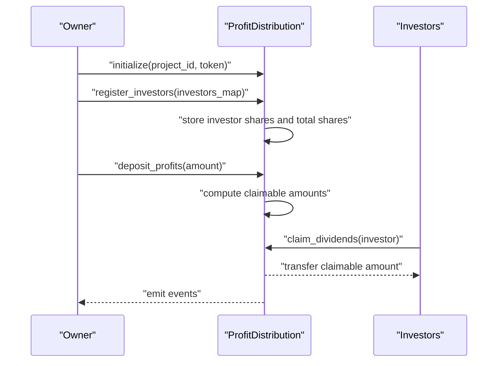
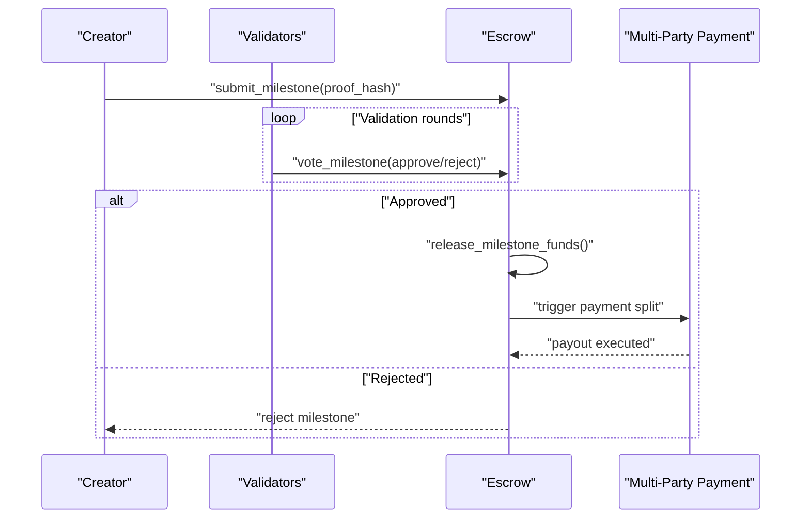
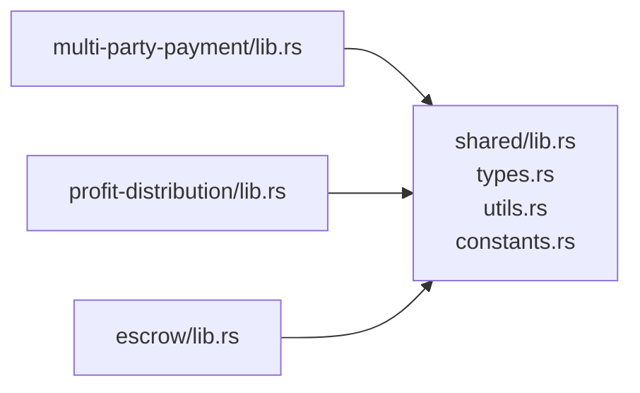

# Multi-Party Payment System

<cite>
**Referenced Files in This Document**
- [lib.rs](file://contracts/multi-party-payment/src/lib.rs)
- [lib.rs](file://contracts/shared/src/lib.rs)
- [types.rs](file://contracts/shared/src/types.rs)
- [constants.rs](file://contracts/shared/src/constants.rs)
- [utils.rs](file://contracts/shared/src/utils.rs)
- [lib.rs](file://contracts/profit-distribution/src/lib.rs)
- [types.rs](file://contracts/profit-distribution/src/types.rs)
- [events.rs](file://contracts/profit-distribution/src/events.rs)
- [storage.rs](file://contracts/profit-distribution/src/storage.rs)
- [errors.rs](file://contracts/profit-distribution/src/errors.rs)
- [lib.rs](file://contracts/project-launch/src/lib.rs)
- [lib.rs](file://contracts/escrow/src/lib.rs)
- [storage.rs](file://contracts/escrow/src/storage.rs)
- [README.md](file://README.md)
- [README.md](file://contracts/README.md)
- [SETUP.md](file://contracts/SETUP.md)
</cite>

## Table of Contents
1. [Introduction](#introduction)
2. [Project Structure](#project-structure)
3. [Core Components](#core-components)
4. [Architecture Overview](#architecture-overview)
5. [Detailed Component Analysis](#detailed-component-analysis)
6. [Dependency Analysis](#dependency-analysis)
7. [Performance Considerations](#performance-considerations)
8. [Troubleshooting Guide](#troubleshooting-guide)
9. [Conclusion](#conclusion)
10. [Appendices](#appendices)

## Introduction
This document explains the Multi-Party Payment System feature designed to automate stakeholder payment splitting and management across creators, developers, advisors, and other parties. It covers how the multi-party payment contract allocates incoming funds according to predefined share distributions, optional vesting schedules for team members, dispute resolution mechanisms, and payment triggering conditions. It also documents the stakeholder onboarding process, share allocation configuration, and automated payment execution. Practical examples illustrate how project teams configure payment splits, set up vesting schedules, and resolve disputes via built-in arbitration.

The system emphasizes fairness and transparency by enforcing deterministic calculations, immutable share configurations, and verifiable events for all payouts.

## Project Structure
The Multi-Party Payment System integrates with shared utilities, the project launch mechanism, and the escrow system. The multi-party payment contract is planned to live under contracts/multi-party-payment and leverage shared types and utilities for consistent data modeling and calculations.

**Diagram sources**
- [lib.rs](file://contracts/multi-party-payment/src/lib.rs#L1-L9)
- [lib.rs](file://contracts/shared/src/lib.rs#L1-L20)
- [types.rs](file://contracts/shared/src/types.rs#L1-L41)
- [utils.rs](file://contracts/shared/src/utils.rs#L1-L59)
- [constants.rs](file://contracts/shared/src/constants.rs#L1-L40)
- [lib.rs](file://contracts/profit-distribution/src/lib.rs#L1-L78)
- [types.rs](file://contracts/profit-distribution/src/types.rs#L1-L18)
- [events.rs](file://contracts/profit-distribution/src/events.rs#L1-L21)
- [storage.rs](file://contracts/profit-distribution/src/storage.rs#L1-L33)
- [errors.rs](file://contracts/profit-distribution/src/errors.rs#L1-L16)
- [lib.rs](file://contracts/project-launch/src/lib.rs#L1-L363)
- [lib.rs](file://contracts/escrow/src/lib.rs#L142-L307)
- [storage.rs](file://contracts/escrow/src/storage.rs#L1-L125)

**Section sources**
- [lib.rs](file://contracts/multi-party-payment/src/lib.rs#L1-L9)
- [lib.rs](file://contracts/shared/src/lib.rs#L1-L20)
- [README.md](file://README.md#L85-L91)
- [README.md](file://contracts/README.md#L229-L231)
- [SETUP.md](file://contracts/SETUP.md#L135-L153)

## Core Components
- Shared Types and Utilities: Provide common types (timestamps, amounts, basis points), fee configuration, token info, and utility functions for percentage calculations and validations.
- Profit Distribution Contract: Demonstrates investor share management, profit deposits, and dividend claiming. It serves as a reference model for stakeholder share management and automated distribution.
- Project Launch Contract: Establishes the project lifecycle and funding mechanics that can trigger multi-party payments when funding goals are met.
- Escrow Contract: Manages milestone-based fund releases and voting, which can act as a payment triggering condition for multi-party payouts aligned with deliverables.
- Multi-Party Payment Contract (Planned): Will implement stakeholder onboarding, share allocation configuration, automated payment execution, optional vesting schedules, and dispute resolution.

Key capabilities enabled by shared components:
- Deterministic share calculations using basis points.
- Immutable share registries and validated totals.
- Event-driven transparency for all distribution actions.

**Section sources**
- [types.rs](file://contracts/shared/src/types.rs#L1-L41)
- [utils.rs](file://contracts/shared/src/utils.rs#L1-L59)
- [constants.rs](file://contracts/shared/src/constants.rs#L1-L40)
- [lib.rs](file://contracts/profit-distribution/src/lib.rs#L1-L78)
- [types.rs](file://contracts/profit-distribution/src/types.rs#L1-L18)
- [events.rs](file://contracts/profit-distribution/src/events.rs#L1-L21)
- [storage.rs](file://contracts/profit-distribution/src/storage.rs#L1-L33)
- [errors.rs](file://contracts/profit-distribution/src/errors.rs#L1-L16)
- [lib.rs](file://contracts/project-launch/src/lib.rs#L1-L363)
- [lib.rs](file://contracts/escrow/src/lib.rs#L142-L307)
- [storage.rs](file://contracts/escrow/src/storage.rs#L1-L125)

## Architecture Overview
The Multi-Party Payment System architecture centers around a multi-stakeholder contract that:
- Receives incoming funds (via project funding or profit distributions).
- Applies predefined share distributions to stakeholders.
- Optionally enforces vesting schedules for team members.
- Triggers payments based on milestone approvals or other conditions.
- Resolves disputes through built-in arbitration.

**Diagram sources**
- [lib.rs](file://contracts/project-launch/src/lib.rs#L1-L363)
- [lib.rs](file://contracts/escrow/src/lib.rs#L142-L307)
- [lib.rs](file://contracts/multi-party-payment/src/lib.rs#L1-L9)
- [lib.rs](file://contracts/profit-distribution/src/lib.rs#L1-L78)

## Detailed Component Analysis

### Multi-Party Payment Contract (Planned)
The multi-party payment contract will orchestrate stakeholder payments with the following responsibilities:
- Onboard stakeholders with roles (creators, developers, advisors, others) and define share percentages in basis points.
- Receive incoming funds and allocate them automatically according to share distributions.
- Enforce optional vesting schedules for team members (time-locked releases).
- Integrate with milestone approvals or governance decisions to trigger payments.
- Provide dispute resolution via built-in arbitration when stakeholder claims conflict.

Implementation outline:
- Initialization: Configure project context, token, and initial stakeholder registry.
- Share Allocation: Validate total shares equal 100% (10000 basis points), store stakeholder addresses and percentages.
- Payment Execution: Calculate shares using shared utilities, transfer tokens, and emit events.
- Vesting: Track vesting schedules per stakeholder, compute releasable amounts based on elapsed time.
- Disputes: Allow stakeholders to submit claims and arbitrate via governance or validator consensus.

**Diagram sources**
- [utils.rs](file://contracts/shared/src/utils.rs#L1-L59)
- [types.rs](file://contracts/shared/src/types.rs#L1-L41)
- [lib.rs](file://contracts/multi-party-payment/src/lib.rs#L1-L9)

**Section sources**
- [lib.rs](file://contracts/multi-party-payment/src/lib.rs#L1-L9)
- [utils.rs](file://contracts/shared/src/utils.rs#L1-L59)
- [types.rs](file://contracts/shared/src/types.rs#L1-L41)

### Profit Distribution Contract (Reference Model)
The profit distribution contract demonstrates share management and automated distribution, serving as a reference for multi-party payment share handling:
- Register investors with share percentages and track claimable amounts.
- Deposit profits and distribute them proportionally.
- Emit events for deposits and claims.
- Enforce errors for invalid shares and insufficient balances.

**Diagram sources**
- [lib.rs](file://contracts/profit-distribution/src/lib.rs#L1-L78)
- [types.rs](file://contracts/profit-distribution/src/types.rs#L1-L18)
- [events.rs](file://contracts/profit-distribution/src/events.rs#L1-L21)
- [storage.rs](file://contracts/profit-distribution/src/storage.rs#L1-L33)
- [errors.rs](file://contracts/profit-distribution/src/errors.rs#L1-L16)

**Section sources**
- [lib.rs](file://contracts/profit-distribution/src/lib.rs#L1-L78)
- [types.rs](file://contracts/profit-distribution/src/types.rs#L1-L18)
- [events.rs](file://contracts/profit-distribution/src/events.rs#L1-L21)
- [storage.rs](file://contracts/profit-distribution/src/storage.rs#L1-L33)
- [errors.rs](file://contracts/profit-distribution/src/errors.rs#L1-L16)

### Escrow and Milestone-Based Payment Triggers
Escrow manages milestone submissions and approvals, which can serve as triggers for multi-party payments:
- Creators submit milestone proofs; validators approve or reject.
- Upon approval, funds are released according to milestone amounts.
- This approval mechanism can be extended to trigger multi-party splits aligned with deliverables.

**Diagram sources**
- [lib.rs](file://contracts/escrow/src/lib.rs#L142-L307)
- [storage.rs](file://contracts/escrow/src/storage.rs#L1-L125)
- [lib.rs](file://contracts/multi-party-payment/src/lib.rs#L1-L9)

**Section sources**
- [lib.rs](file://contracts/escrow/src/lib.rs#L142-L307)
- [storage.rs](file://contracts/escrow/src/storage.rs#L1-L125)

### Shared Types, Constants, and Utilities
Shared components provide:
- Common types for timestamps, amounts, and basis points.
- Fee configuration and token information structures.
- Utility functions for percentage calculations and validations.
- Constants for governance thresholds and limits.

These enable consistent, transparent, and auditable calculations across contracts.

**Section sources**
- [types.rs](file://contracts/shared/src/types.rs#L1-L41)
- [constants.rs](file://contracts/shared/src/constants.rs#L1-L40)
- [utils.rs](file://contracts/shared/src/utils.rs#L1-L59)
- [lib.rs](file://contracts/shared/src/lib.rs#L1-L20)

## Dependency Analysis
The multi-party payment system depends on shared types and utilities for consistent data modeling and calculations. Profit distribution and escrow contracts demonstrate complementary mechanisms that inform multi-stakeholder payment design.

**Diagram sources**
- [lib.rs](file://contracts/shared/src/lib.rs#L1-L20)
- [types.rs](file://contracts/shared/src/types.rs#L1-L41)
- [utils.rs](file://contracts/shared/src/utils.rs#L1-L59)
- [constants.rs](file://contracts/shared/src/constants.rs#L1-L40)
- [lib.rs](file://contracts/multi-party-payment/src/lib.rs#L1-L9)
- [lib.rs](file://contracts/profit-distribution/src/lib.rs#L1-L78)
- [lib.rs](file://contracts/escrow/src/lib.rs#L142-L307)

**Section sources**
- [lib.rs](file://contracts/shared/src/lib.rs#L1-L20)
- [lib.rs](file://contracts/multi-party-payment/src/lib.rs#L1-L9)
- [lib.rs](file://contracts/profit-distribution/src/lib.rs#L1-L78)
- [lib.rs](file://contracts/escrow/src/lib.rs#L142-L307)

## Performance Considerations
- Percentage calculations use i128 arithmetic to prevent precision loss and overflow.
- Basis points normalize share percentages to 10,000 units for exact computations.
- Event emission ensures off-chain indexing and auditability without bloating on-chain state.
- Vesting schedules should be computed incrementally to minimize gas costs during frequent transfers.

[No sources needed since this section provides general guidance]

## Troubleshooting Guide
Common issues and resolutions:
- Invalid share percentages: Ensure total shares equal 100% (10,000 basis points) and each share is ≤ 100%.
- Insufficient balance: Verify the contract holds sufficient funds before attempting distributions.
- Unauthorized operations: Confirm proper authorization for stakeholder onboarding and payment triggers.
- Disputes: Use built-in arbitration to resolve conflicting claims; maintain logs of submitted proofs and votes.

**Section sources**
- [errors.rs](file://contracts/profit-distribution/src/errors.rs#L1-L16)
- [lib.rs](file://contracts/escrow/src/lib.rs#L142-L307)
- [storage.rs](file://contracts/escrow/src/storage.rs#L1-L125)

## Conclusion
The Multi-Party Payment System automates fair and transparent stakeholder payouts by leveraging shared types, deterministic share calculations, and event-driven execution. Integrations with project funding, milestone approvals, and investor share management provide robust mechanisms for onboarding stakeholders, configuring share allocations, enforcing vesting schedules, and resolving disputes. These features collectively enhance trust, reduce administrative overhead, and ensure equitable distribution across all participants.

[No sources needed since this section summarizes without analyzing specific files]

## Appendices

### Practical Examples

- Setting Up Payment Splits
  - Define stakeholders and their share percentages in basis points.
  - Validate that total shares equal 100%.
  - Register stakeholders and initialize the multi-party payment contract.
  - Trigger payments when funding goals are met or milestones are approved.

- Configuring Vesting Schedules for Team Members
  - Specify vesting start date, cliff period, and monthly release amounts.
  - Compute releasable amounts based on elapsed time and enforce lock-ups until vesting conditions are satisfied.

- Resolving Disputes Through Built-in Arbitration
  - Stakeholders submit claims with supporting evidence.
  - Validators or governance mechanisms review and decide outcomes.
  - Approved claims trigger automated payouts; rejected claims remain unresolved until further action.

[No sources needed since this section provides general guidance]