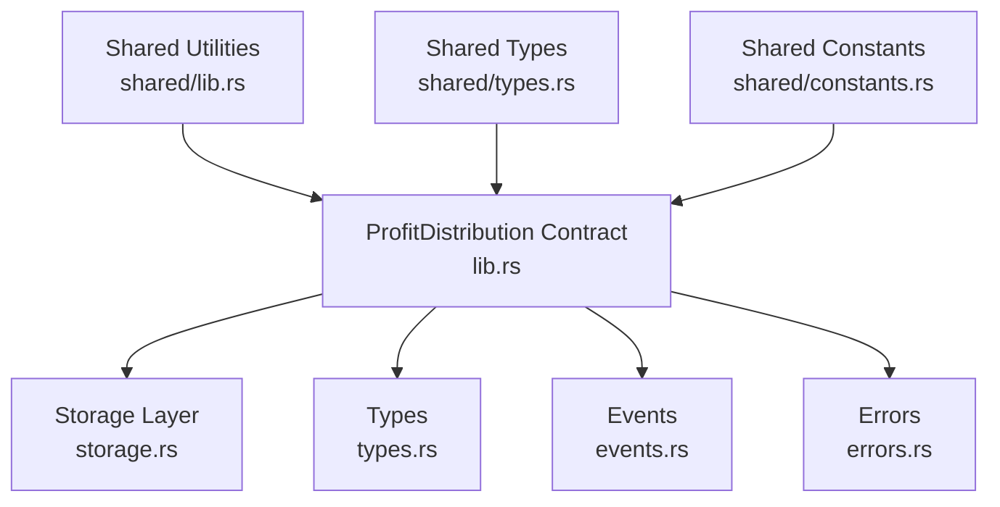
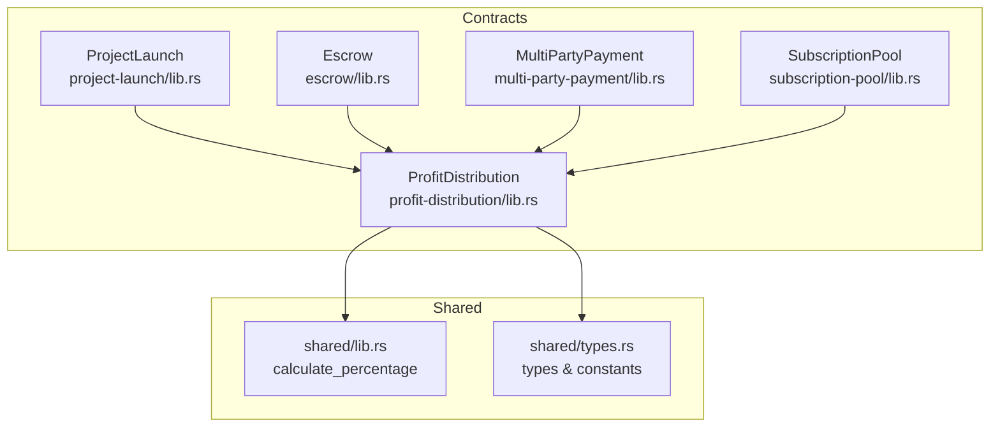
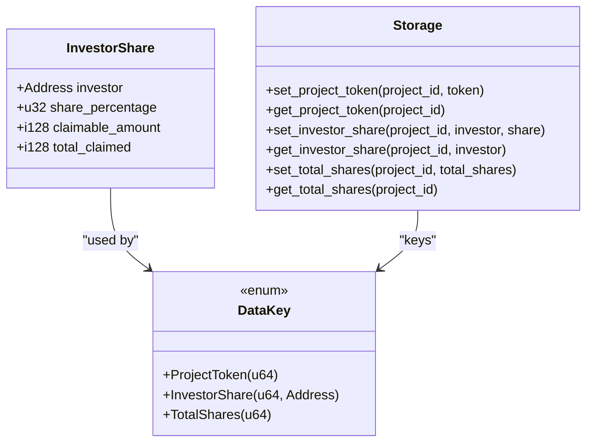
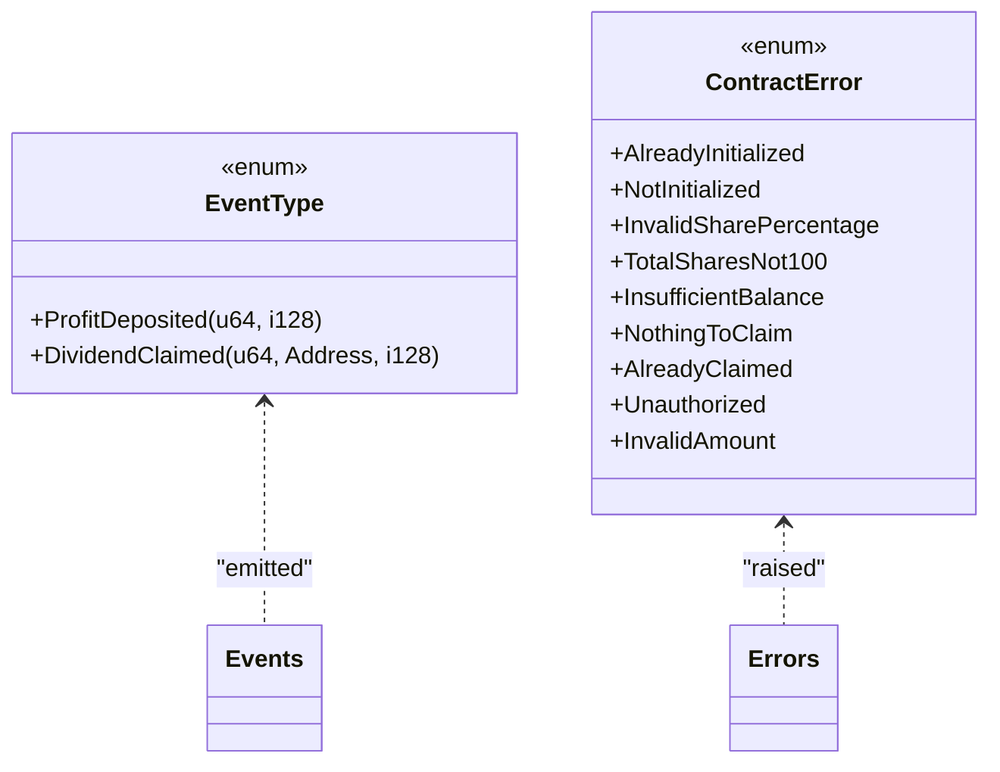
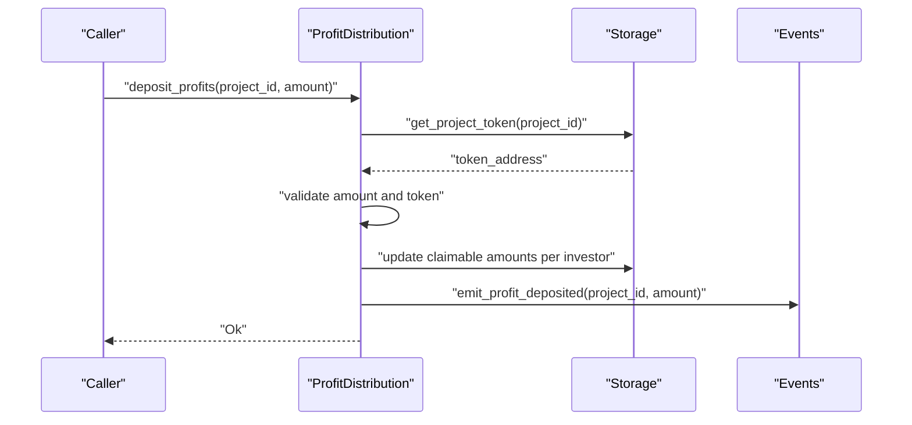
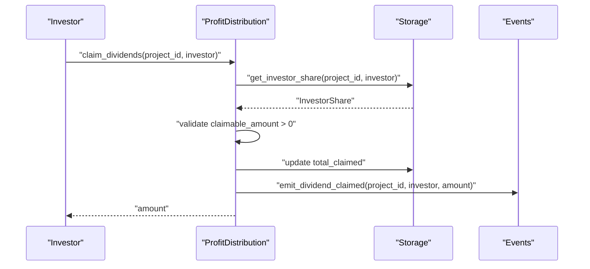
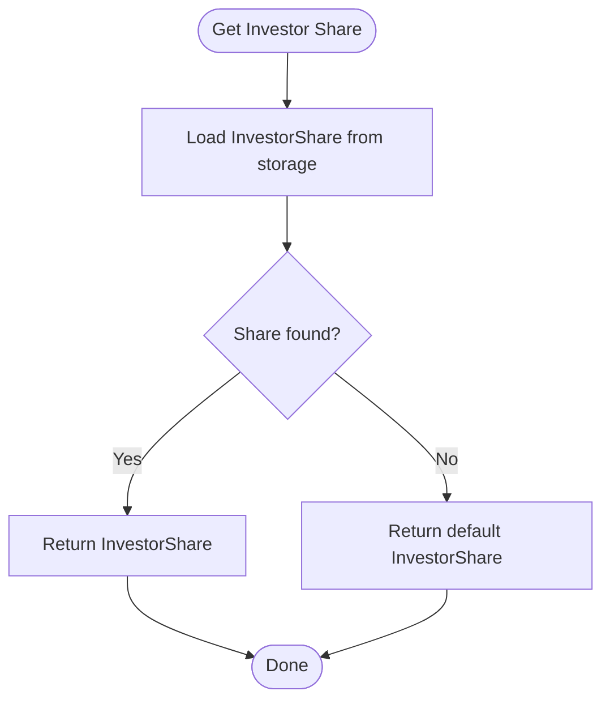
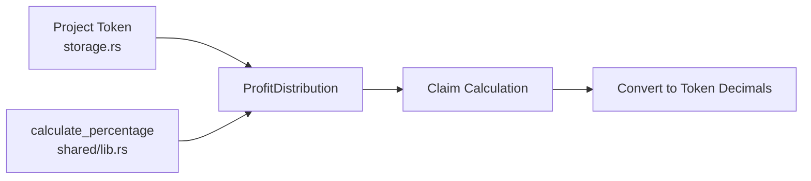
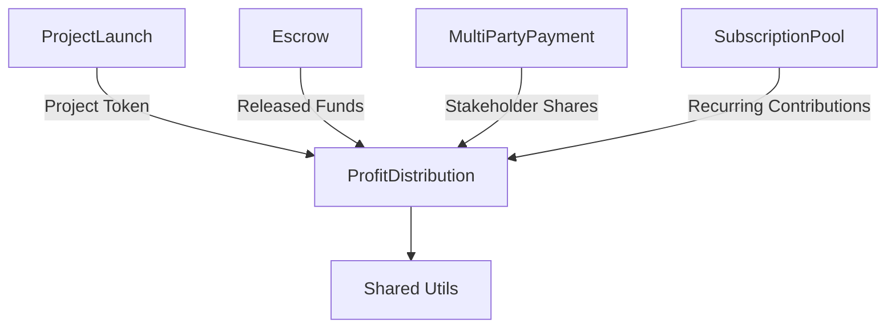
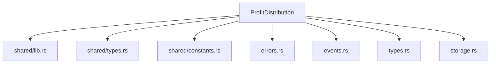

# Profit Distribution System

<cite>
**Referenced Files in This Document**
- [lib.rs](file://contracts/profit-distribution/src/lib.rs)
- [storage.rs](file://contracts/profit-distribution/src/storage.rs)
- [types.rs](file://contracts/profit-distribution/src/types.rs)
- [events.rs](file://contracts/profit-distribution/src/events.rs)
- [errors.rs](file://contracts/profit-distribution/src/errors.rs)
- [lib.rs](file://contracts/shared/src/lib.rs)
- [types.rs](file://contracts/shared/src/types.rs)
- [constants.rs](file://contracts/shared/src/constants.rs)
- [README.md](file://contracts/README.md)
- [SETUP.md](file://contracts/SETUP.md)
</cite>

## Table of Contents
1. [Introduction](#introduction)
2. [Project Structure](#project-structure)
3. [Core Components](#core-components)
4. [Architecture Overview](#architecture-overview)
5. [Detailed Component Analysis](#detailed-component-analysis)
6. [Dependency Analysis](#dependency-analysis)
7. [Performance Considerations](#performance-considerations)
8. [Troubleshooting Guide](#troubleshooting-guide)
9. [Conclusion](#conclusion)
10. [Appendices](#appendices)

## Introduction
The Profit Distribution System automates proportional investor payouts derived from project revenues. It registers investor shares, accumulates distributable profits, computes proportional distributions, and enables investors to claim dividends. The system supports multi-token distribution via configurable project tokens and emits events for transparency. This document explains the contract’s architecture, data model, integration points with investment contracts, and operational workflows to maintain investor engagement across a project lifecycle.

## Project Structure
The Profit Distribution contract resides under contracts/profit-distribution and exposes a clean separation of concerns:
- Public interface: functions for initialization, investor registration, profit deposits, dividend claiming, and share queries
- Storage layer: persistent key-value access for project token, investor shares, and total shares
- Types and events: strongly typed data structures and emitted events
- Errors: centralized error enumeration for robust failure signaling

**Diagram sources**
- [lib.rs](file://contracts/profit-distribution/src/lib.rs#L1-L78)
- [storage.rs](file://contracts/profit-distribution/src/storage.rs#L1-L33)
- [types.rs](file://contracts/profit-distribution/src/types.rs#L1-L18)
- [events.rs](file://contracts/profit-distribution/src/events.rs#L1-L21)
- [errors.rs](file://contracts/profit-distribution/src/errors.rs#L1-L16)
- [lib.rs](file://contracts/shared/src/lib.rs#L1-L20)
- [types.rs](file://contracts/shared/src/types.rs#L1-L41)
- [constants.rs](file://contracts/shared/src/constants.rs#L1-L40)

**Section sources**
- [lib.rs](file://contracts/profit-distribution/src/lib.rs#L1-L78)
- [storage.rs](file://contracts/profit-distribution/src/storage.rs#L1-L33)
- [types.rs](file://contracts/profit-distribution/src/types.rs#L1-L18)
- [events.rs](file://contracts/profit-distribution/src/events.rs#L1-L21)
- [errors.rs](file://contracts/profit-distribution/src/errors.rs#L1-L16)
- [lib.rs](file://contracts/shared/src/lib.rs#L1-L20)
- [types.rs](file://contracts/shared/src/types.rs#L1-L41)
- [constants.rs](file://contracts/shared/src/constants.rs#L1-L40)

## Core Components
- Contract interface: initialize, register_investors, deposit_profits, claim_dividends, get_investor_share
- Data model: InvestorShare with investor address, share_percentage (basis points), claimable_amount, total_claimed
- Storage keys: ProjectToken, InvestorShare, TotalShares
- Events: ProfitDeposited, DividendClaimed
- Errors: Initialization-related, share validation, insufficient balance, claim conditions, unauthorized, invalid amount
- Shared utilities: percentage calculation helper

Implementation placeholders indicate that the core logic is pending. The types and storage abstractions are ready to support the automated distribution workflow.

**Section sources**
- [lib.rs](file://contracts/profit-distribution/src/lib.rs#L36-L77)
- [types.rs](file://contracts/profit-distribution/src/types.rs#L5-L10)
- [storage.rs](file://contracts/profit-distribution/src/storage.rs#L8-L33)
- [events.rs](file://contracts/profit-distribution/src/events.rs#L4-L7)
- [errors.rs](file://contracts/profit-distribution/src/errors.rs#L6-L16)
- [lib.rs](file://contracts/shared/src/lib.rs#L16-L20)

## Architecture Overview
The Profit Distribution contract integrates with the broader NovaFund ecosystem:
- Project token association: each project maintains a token address for distribution
- Investor share registry: tracks investor participation via basis-point percentages
- Profit accumulation: deposits increase claimable amounts proportionally
- Dividend claiming: investors claim based on realized claimable amounts
- Event-driven transparency: emits deposit and claim events for external monitoring

**Diagram sources**
- [lib.rs](file://contracts/profit-distribution/src/lib.rs#L1-L78)
- [lib.rs](file://contracts/shared/src/lib.rs#L1-L20)
- [types.rs](file://contracts/shared/src/types.rs#L1-L41)
- [README.md](file://contracts/README.md#L107-L245)

## Detailed Component Analysis

### Data Model and Storage
The contract defines a compact data model for investor shares and persistent storage keys:
- InvestorShare: investor address, share_percentage (basis points), claimable_amount, total_claimed
- DataKey variants: ProjectToken, InvestorShare, TotalShares
- Storage helpers: set/get project token, set/get investor share, set/get total shares

**Diagram sources**
- [types.rs](file://contracts/profit-distribution/src/types.rs#L5-L18)
- [storage.rs](file://contracts/profit-distribution/src/storage.rs#L8-L33)

**Section sources**
- [types.rs](file://contracts/profit-distribution/src/types.rs#L5-L10)
- [storage.rs](file://contracts/profit-distribution/src/storage.rs#L8-L33)

### Events and Error Handling
Events enable external systems to track profit deposits and dividend claims. Errors provide deterministic failure semantics for invalid operations.

**Diagram sources**
- [events.rs](file://contracts/profit-distribution/src/events.rs#L4-L7)
- [errors.rs](file://contracts/profit-distribution/src/errors.rs#L6-L16)

**Section sources**
- [events.rs](file://contracts/profit-distribution/src/events.rs#L9-L21)
- [errors.rs](file://contracts/profit-distribution/src/errors.rs#L6-L16)

### Profit Deposit and Proportional Distribution Workflow
This sequence illustrates how profits are accumulated and distributed proportionally to investors.

**Diagram sources**
- [lib.rs](file://contracts/profit-distribution/src/lib.rs#L52-L56)
- [storage.rs](file://contracts/profit-distribution/src/storage.rs#L8-L14)
- [events.rs](file://contracts/profit-distribution/src/events.rs#L9-L14)

**Section sources**
- [lib.rs](file://contracts/profit-distribution/src/lib.rs#L52-L56)
- [storage.rs](file://contracts/profit-distribution/src/storage.rs#L8-L14)
- [events.rs](file://contracts/profit-distribution/src/events.rs#L9-L14)

### Dividend Claiming Procedure
Investors claim dividends by invoking the claim function, which transfers claimable amounts to the investor and updates cumulative claimed totals.

**Diagram sources**
- [lib.rs](file://contracts/profit-distribution/src/lib.rs#L58-L62)
- [storage.rs](file://contracts/profit-distribution/src/storage.rs#L23-L25)
- [events.rs](file://contracts/profit-distribution/src/events.rs#L16-L21)

**Section sources**
- [lib.rs](file://contracts/profit-distribution/src/lib.rs#L58-L62)
- [storage.rs](file://contracts/profit-distribution/src/storage.rs#L23-L25)
- [events.rs](file://contracts/profit-distribution/src/events.rs#L16-L21)

### Investor Share Management and Real-Time Tracking
Real-time tracking is achieved through persistent storage of investor shares and total shares. The contract exposes a getter to retrieve investor share details, enabling frontends and off-chain services to monitor claimable balances.

**Diagram sources**
- [lib.rs](file://contracts/profit-distribution/src/lib.rs#L64-L77)
- [storage.rs](file://contracts/profit-distribution/src/storage.rs#L23-L25)

**Section sources**
- [lib.rs](file://contracts/profit-distribution/src/lib.rs#L64-L77)
- [storage.rs](file://contracts/profit-distribution/src/storage.rs#L23-L25)

### Multi-Token Distribution Capabilities
The contract associates a project token per project and uses shared utilities for precise percentage calculations. This design allows distributing profits denominated in different tokens while maintaining proportional fairness.

**Diagram sources**
- [storage.rs](file://contracts/profit-distribution/src/storage.rs#L8-L14)
- [lib.rs](file://contracts/shared/src/lib.rs#L16-L20)

**Section sources**
- [storage.rs](file://contracts/profit-distribution/src/storage.rs#L8-L14)
- [lib.rs](file://contracts/shared/src/lib.rs#L16-L20)

### Integration with Investment Contracts and Revenue Processing
The Profit Distribution contract complements the Project Launch and Escrow contracts:
- Project Launch: creates projects and manages funding; revenue can later feed into profit distribution
- Escrow: holds funds and releases upon milestone approvals; released funds can be considered distributable profits
- Multi-Party Payment and Subscription Pool: support stakeholder splits and recurring contributions that can influence distribution dynamics

**Diagram sources**
- [README.md](file://contracts/README.md#L107-L245)
- [SETUP.md](file://contracts/SETUP.md#L135-L147)

**Section sources**
- [README.md](file://contracts/README.md#L195-L211)
- [SETUP.md](file://contracts/SETUP.md#L135-L147)

## Dependency Analysis
The Profit Distribution contract depends on shared types and utilities for consistent percentage computation and common data structures. The error and event enums centralize cross-contract communication signals.

**Diagram sources**
- [lib.rs](file://contracts/profit-distribution/src/lib.rs#L11-L24)
- [lib.rs](file://contracts/shared/src/lib.rs#L1-L20)
- [types.rs](file://contracts/shared/src/types.rs#L1-L41)
- [constants.rs](file://contracts/shared/src/constants.rs#L1-L40)
- [errors.rs](file://contracts/profit-distribution/src/errors.rs#L1-L16)
- [events.rs](file://contracts/profit-distribution/src/events.rs#L1-L21)
- [types.rs](file://contracts/profit-distribution/src/types.rs#L1-L18)
- [storage.rs](file://contracts/profit-distribution/src/storage.rs#L1-L33)

**Section sources**
- [lib.rs](file://contracts/profit-distribution/src/lib.rs#L11-L24)
- [lib.rs](file://contracts/shared/src/lib.rs#L1-L20)
- [types.rs](file://contracts/shared/src/types.rs#L1-L41)
- [constants.rs](file://contracts/shared/src/constants.rs#L1-L40)
- [errors.rs](file://contracts/profit-distribution/src/errors.rs#L1-L16)
- [events.rs](file://contracts/profit-distribution/src/events.rs#L1-L21)
- [types.rs](file://contracts/profit-distribution/src/types.rs#L1-L18)
- [storage.rs](file://contracts/profit-distribution/src/storage.rs#L1-L33)

## Performance Considerations
- Storage operations: minimize repeated reads/writes by batching investor updates during profit deposits
- Percentage calculations: use shared helpers to avoid precision loss and ensure consistent rounding
- Event emission: emit only essential events to reduce ledger footprint
- Data locality: keep investor share updates close to profit deposit logic to reduce cross-call overhead

## Troubleshooting Guide
Common issues and resolutions:
- NotInitialized: Ensure the contract is initialized before registering investors or accepting profits
- TotalSharesNot100: Verify that registered investor percentages sum to 100% (10000 basis points)
- InsufficientBalance: Confirm that sufficient funds exist for distribution before claiming
- NothingToClaim: Investors can only claim when claimable_amount > 0
- AlreadyClaimed: Prevent duplicate claims by checking cumulative claimed totals
- Unauthorized: Validate caller permissions for administrative functions
- InvalidAmount: Reject zero or negative profit amounts

**Section sources**
- [errors.rs](file://contracts/profit-distribution/src/errors.rs#L6-L16)

## Conclusion
The Profit Distribution System establishes a robust framework for automated, proportional investor payouts. With investor share management, multi-token support, and event-driven transparency, it enhances investor engagement across a project lifecycle. As implementation progresses, integrating with Project Launch, Escrow, and other contracts will create a cohesive revenue processing pipeline that rewards contributors fairly and consistently.

## Appendices

### Practical Examples

- Investor receives returns:
  - Scenario: An investor with a 25% share receives a profit deposit of 1000 units
  - Outcome: Claimable amount increases by 250 units; investor can claim the realized amount
  - Reference: [deposit_profits](file://contracts/profit-distribution/src/lib.rs#L52-L56), [InvestorShare](file://contracts/profit-distribution/src/types.rs#L5-L10)

- Distribution schedules:
  - Concept: Repeated profit deposits trigger proportional updates; claims settle immediately upon invocation
  - Reference: [claim_dividends](file://contracts/profit-distribution/src/lib.rs#L58-L62), [ProfitDeposited event](file://contracts/profit-distribution/src/events.rs#L9-L14)

- Multi-token payouts:
  - Concept: Project token determines denomination; shared percentage calculation ensures fair distribution
  - Reference: [ProjectToken storage](file://contracts/profit-distribution/src/storage.rs#L8-L14), [calculate_percentage](file://contracts/shared/src/lib.rs#L16-L20)