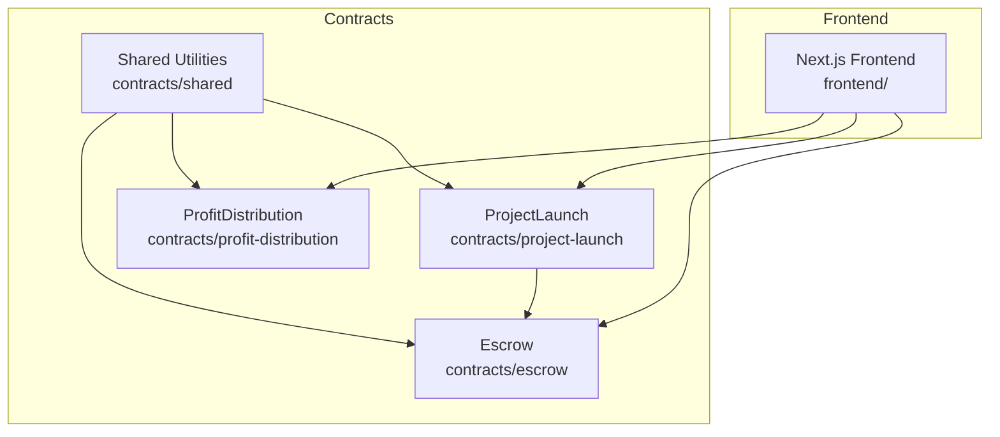
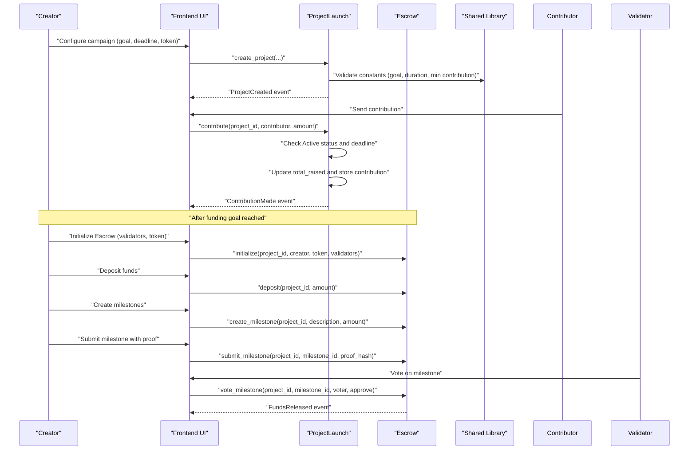
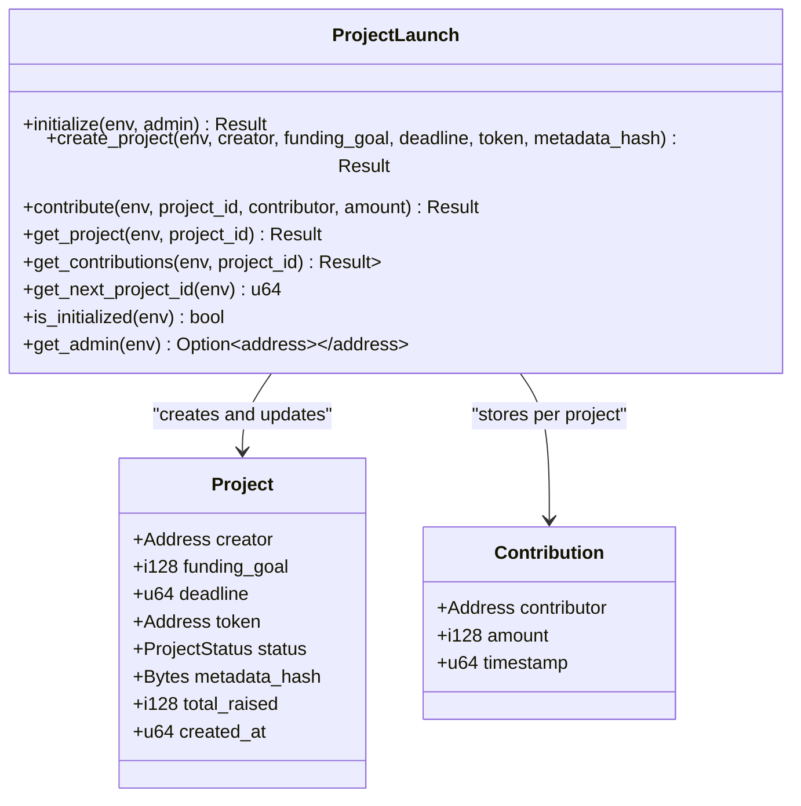
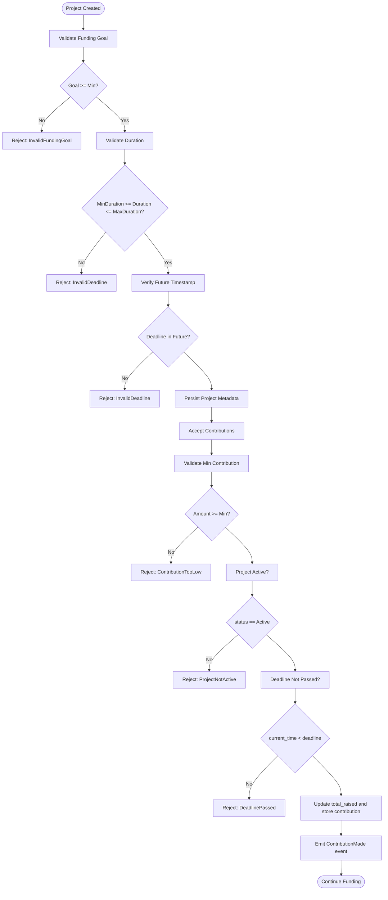
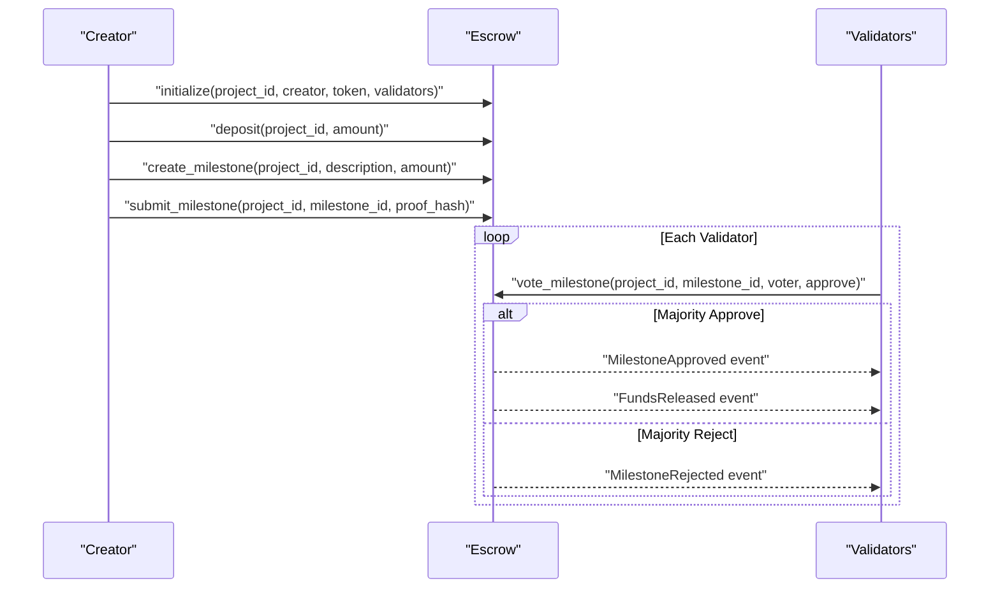
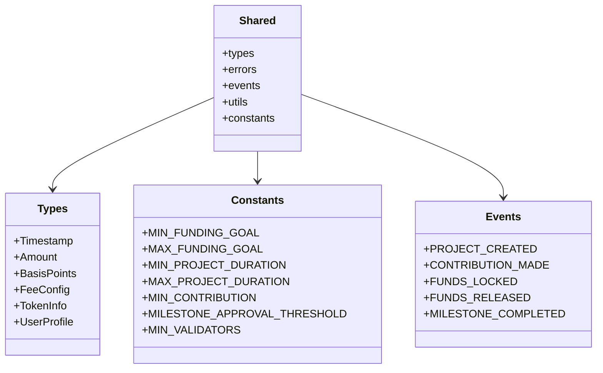
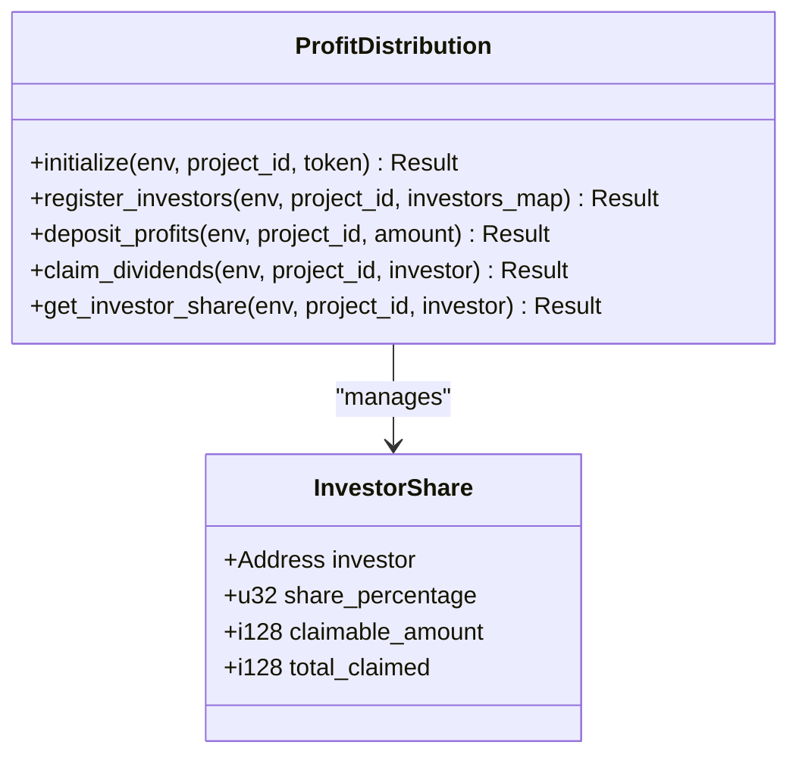
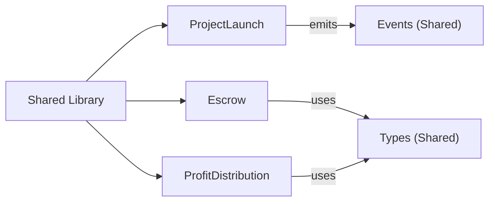

# Project Launch Contracts

<cite>
**Referenced Files in This Document**
- [lib.rs](file://contracts/project-launch/src/lib.rs)
- [Cargo.toml](file://contracts/project-launch/Cargo.toml)
- [lib.rs](file://contracts/escrow/src/lib.rs)
- [storage.rs](file://contracts/escrow/src/storage.rs)
- [validation.rs](file://contracts/escrow/src/validation.rs)
- [lib.rs](file://contracts/shared/src/lib.rs)
- [constants.rs](file://contracts/shared/src/constants.rs)
- [events.rs](file://contracts/shared/src/events.rs)
- [utils.rs](file://contracts/shared/src/utils.rs)
- [lib.rs](file://contracts/profit-distribution/src/lib.rs)
- [types.rs](file://contracts/profit-distribution/src/types.rs)
- [storage.rs](file://contracts/profit-distribution/src/storage.rs)
- [README.md](file://contracts/README.md)
- [SETUP.md](file://contracts/SETUP.md)
</cite>

## Table of Contents
1. [Introduction](#introduction)
2. [Project Structure](#project-structure)
3. [Core Components](#core-components)
4. [Architecture Overview](#architecture-overview)
5. [Detailed Component Analysis](#detailed-component-analysis)
6. [Dependency Analysis](#dependency-analysis)
7. [Performance Considerations](#performance-considerations)
8. [Troubleshooting Guide](#troubleshooting-guide)
9. [Conclusion](#conclusion)
10. [Appendices](#appendices)

## Introduction
This document explains the Project Launch Contracts feature and its core funding mechanism within the NovaFund ecosystem. It focuses on how project contracts are deployed and managed, including funding goals, deadline enforcement, and contribution processing. It documents the contract lifecycle from creation to completion, detailing the ProjectLaunch contract’s role in defining project parameters, accepting contributions, and coordinating with the escrow system. Practical examples show how creators set up funding campaigns, configure token acceptance, and manage project timelines. The document also explains the smart contract architecture, state management, and integration patterns with the broader NovaFund ecosystem.

## Project Structure
The NovaFund contracts workspace is organized into modular crates, each implementing a distinct aspect of the crowdfunding and fund management system. The Project Launch contract manages project creation and funding, while the Escrow contract manages milestone-based fund releases. Shared libraries define common types, constants, events, and utilities used across contracts.

**Diagram sources**
- [lib.rs](file://contracts/project-launch/src/lib.rs#L1-L363)
- [lib.rs](file://contracts/escrow/src/lib.rs#L1-L367)
- [lib.rs](file://contracts/profit-distribution/src/lib.rs#L1-L78)
- [lib.rs](file://contracts/shared/src/lib.rs#L1-L20)

**Section sources**
- [README.md](file://contracts/README.md#L1-L334)
- [SETUP.md](file://contracts/SETUP.md#L1-L153)

## Core Components
- ProjectLaunch contract: Manages project creation, validates funding goals and deadlines, accepts contributions, tracks contribution history, and emits events for project creation and contributions.
- Escrow contract: Holds funds securely and releases them based on milestone completion and validator approvals.
- Shared library: Provides common types, constants, events, and utilities used by multiple contracts.
- ProfitDistribution contract: Defines the investor share model and distribution mechanics (placeholder in current codebase).

Key responsibilities:
- ProjectLaunch: Enforce minimum funding goal, minimum/maximum project duration, minimum contribution amount, and deadline checks. Persist project metadata and contribution records.
- Escrow: Initialize escrow with validators, lock funds, create milestones, accept proofs, collect validator votes, and release funds upon approval.
- Shared: Centralize constants (e.g., minimum funding goal, durations, contribution thresholds), event symbols, and helper functions (e.g., timestamp verification).

**Section sources**
- [lib.rs](file://contracts/project-launch/src/lib.rs#L72-L248)
- [lib.rs](file://contracts/escrow/src/lib.rs#L22-L346)
- [lib.rs](file://contracts/shared/src/lib.rs#L1-L20)
- [constants.rs](file://contracts/shared/src/constants.rs#L1-L40)
- [events.rs](file://contracts/shared/src/events.rs#L1-L31)

## Architecture Overview
The Project Launch Contracts feature integrates tightly with the broader NovaFund ecosystem:
- ProjectLaunch defines the project and collects contributions.
- Escrow holds funds and governs milestone-based releases.
- Shared utilities unify types, constants, and events.
- ProfitDistribution supports investor payouts (future integration).

**Diagram sources**
- [lib.rs](file://contracts/project-launch/src/lib.rs#L87-L212)
- [lib.rs](file://contracts/escrow/src/lib.rs#L31-L346)
- [events.rs](file://contracts/shared/src/events.rs#L1-L31)

## Detailed Component Analysis

### ProjectLaunch Contract
The ProjectLaunch contract orchestrates project creation and funding:
- Initialization: Sets admin address and initializes next project ID.
- Project creation: Validates funding goal, deadline range, and future timestamp; persists project metadata; emits a project creation event.
- Contributions: Validates minimum contribution amount, active status, and unexpired deadline; updates raised total and stores contribution records; emits contribution events.
- Queries: Retrieves project details and contribution history.

**Diagram sources**
- [lib.rs](file://contracts/project-launch/src/lib.rs#L57-L248)
- [lib.rs](file://contracts/project-launch/src/lib.rs#L25-L56)

**Section sources**
- [lib.rs](file://contracts/project-launch/src/lib.rs#L72-L248)

#### Funding Lifecycle Flow

**Diagram sources**
- [lib.rs](file://contracts/project-launch/src/lib.rs#L87-L212)
- [utils.rs](file://contracts/shared/src/utils.rs#L15-L23)
- [constants.rs](file://contracts/shared/src/constants.rs#L9-L22)

### Escrow Contract
The Escrow contract manages secure fund holding and milestone-based releases:
- Initialization: Creates an escrow with validators, token, and milestone counter.
- Deposit: Locks funds into the escrow.
- Milestone Creation: Defines milestones with amounts constrained by available escrow balance.
- Submission and Voting: Creator submits proofs; validators approve or reject; thresholds determine approval.
- Release: Upon approval, funds are released and reflected in the escrow balance.

**Diagram sources**
- [lib.rs](file://contracts/escrow/src/lib.rs#L31-L346)
- [storage.rs](file://contracts/escrow/src/storage.rs#L11-L144)
- [validation.rs](file://contracts/escrow/src/validation.rs#L5-L12)

**Section sources**
- [lib.rs](file://contracts/escrow/src/lib.rs#L22-L346)
- [storage.rs](file://contracts/escrow/src/storage.rs#L1-L144)
- [validation.rs](file://contracts/escrow/src/validation.rs#L1-L13)

### Shared Library
The shared library centralizes:
- Types: Timestamp, Amount, BasisPoints, FeeConfig, TokenInfo, UserProfile.
- Constants: Minimum funding goal, maximum goal, minimum/maximum durations, minimum contribution, milestone approval threshold, minimum validators.
- Events: Symbols for project, contribution, escrow, distribution, governance, and reputation events.
- Utilities: Percentage calculations, fee computation, timestamp verification, share calculations, and basis point validation.

**Diagram sources**
- [lib.rs](file://contracts/shared/src/lib.rs#L1-L20)
- [constants.rs](file://contracts/shared/src/constants.rs#L1-L40)
- [events.rs](file://contracts/shared/src/events.rs#L1-L31)

**Section sources**
- [lib.rs](file://contracts/shared/src/lib.rs#L1-L20)
- [constants.rs](file://contracts/shared/src/constants.rs#L1-L40)
- [events.rs](file://contracts/shared/src/events.rs#L1-L31)
- [utils.rs](file://contracts/shared/src/utils.rs#L1-L59)

### Profit Distribution Contract
The ProfitDistribution contract defines the investor share model and distribution mechanics. While currently a placeholder, it establishes:
- Investor share structure with share percentage, claimable amount, and total claimed.
- Storage keys for project token, investor shares, and total shares.
- Functions for initializing distributions, registering investors, depositing profits, and claiming dividends.

**Diagram sources**
- [lib.rs](file://contracts/profit-distribution/src/lib.rs#L31-L78)
- [types.rs](file://contracts/profit-distribution/src/types.rs#L3-L18)
- [storage.rs](file://contracts/profit-distribution/src/storage.rs#L8-L33)

**Section sources**
- [lib.rs](file://contracts/profit-distribution/src/lib.rs#L1-L78)
- [types.rs](file://contracts/profit-distribution/src/types.rs#L1-L18)
- [storage.rs](file://contracts/profit-distribution/src/storage.rs#L1-L33)

## Dependency Analysis
ProjectLaunch depends on shared constants and utilities for validation and emits shared events. Escrow depends on shared types and constants for milestone and validator logic. ProfitDistribution relies on shared types for investor modeling.

**Diagram sources**
- [Cargo.toml](file://contracts/project-launch/Cargo.toml#L7-L9)
- [lib.rs](file://contracts/project-launch/src/lib.rs#L7-L12)
- [lib.rs](file://contracts/escrow/src/lib.rs#L4-L9)
- [lib.rs](file://contracts/profit-distribution/src/lib.rs#L19-L24)

**Section sources**
- [Cargo.toml](file://contracts/project-launch/Cargo.toml#L1-L26)
- [lib.rs](file://contracts/project-launch/src/lib.rs#L1-L12)
- [lib.rs](file://contracts/escrow/src/lib.rs#L1-L10)
- [lib.rs](file://contracts/profit-distribution/src/lib.rs#L1-L24)

## Performance Considerations
- Efficient storage operations: ProjectLaunch stores contribution history persistently per project, minimizing redundant reads. Escrow uses compact storage keys for milestones and validators.
- Checked arithmetic: Shared utilities enforce checked addition/subtraction to prevent overflow during balance updates.
- Gas optimization: Contracts are compiled with release profiles and LTO enabled to reduce WASM size and execution cost.
- Event-driven architecture: Emits lightweight events for project creation and contributions, enabling efficient off-chain indexing.

[No sources needed since this section provides general guidance]

## Troubleshooting Guide
Common issues and resolutions:
- Invalid funding goal: Ensure the funding goal meets the minimum threshold defined in shared constants.
- Invalid deadline: Verify the deadline is in the future and within the allowed duration range.
- Contribution too low: Ensure contributions meet the minimum contribution amount.
- Project not active: Confirm the project status remains Active and the deadline has not passed.
- Project not found: Verify the project ID exists in storage before querying or contributing.
- Escrow initialization failures: Ensure the validator count meets the minimum requirement and the escrow does not already exist.

**Section sources**
- [lib.rs](file://contracts/project-launch/src/lib.rs#L63-L70)
- [constants.rs](file://contracts/shared/src/constants.rs#L9-L22)
- [utils.rs](file://contracts/shared/src/utils.rs#L15-L23)
- [lib.rs](file://contracts/escrow/src/lib.rs#L40-L48)

## Conclusion
The Project Launch Contracts feature provides a robust foundation for decentralized crowdfunding within the NovaFund ecosystem. ProjectLaunch enforces strict validation rules, tracks contributions, and emits events for transparency. Escrow secures funds and automates milestone-based releases via validator consensus. Shared utilities unify types, constants, and events across contracts. ProfitDistribution lays the groundwork for investor payouts. Together, these components enable creators to set up campaigns, configure token acceptance, manage timelines, and integrate seamlessly with the broader NovaFund platform.

[No sources needed since this section summarizes without analyzing specific files]

## Appendices

### Practical Examples
- Initialize ProjectLaunch and set admin:
  - Invoke the initialize function with the admin address.
- Create a funding project:
  - Provide creator, funding goal, deadline, token, and metadata hash.
- Contribute to a project:
  - Send contributions after verifying the project is active and the deadline has not passed.
- Initialize Escrow:
  - Supply project_id, creator, token, and a list of validators meeting the minimum requirement.
- Deposit funds:
  - Lock funds into the escrow for milestone-based releases.
- Create and vote on milestones:
  - Define milestones, submit proofs, and collect validator approvals to release funds.

**Section sources**
- [README.md](file://contracts/README.md#L107-L177)
- [lib.rs](file://contracts/project-launch/src/lib.rs#L75-L85)
- [lib.rs](file://contracts/project-launch/src/lib.rs#L87-L149)
- [lib.rs](file://contracts/project-launch/src/lib.rs#L151-L212)
- [lib.rs](file://contracts/escrow/src/lib.rs#L31-L70)
- [lib.rs](file://contracts/escrow/src/lib.rs#L77-L103)
- [lib.rs](file://contracts/escrow/src/lib.rs#L111-L167)
- [lib.rs](file://contracts/escrow/src/lib.rs#L220-L307)