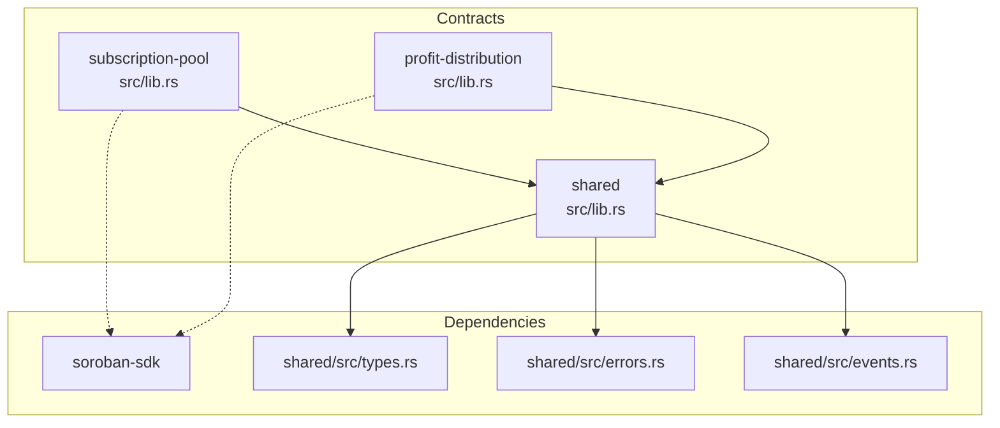
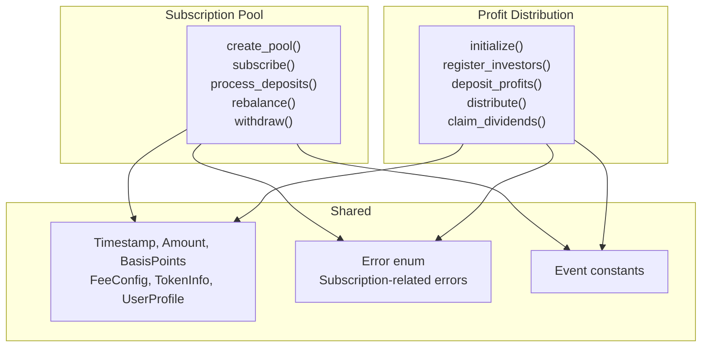
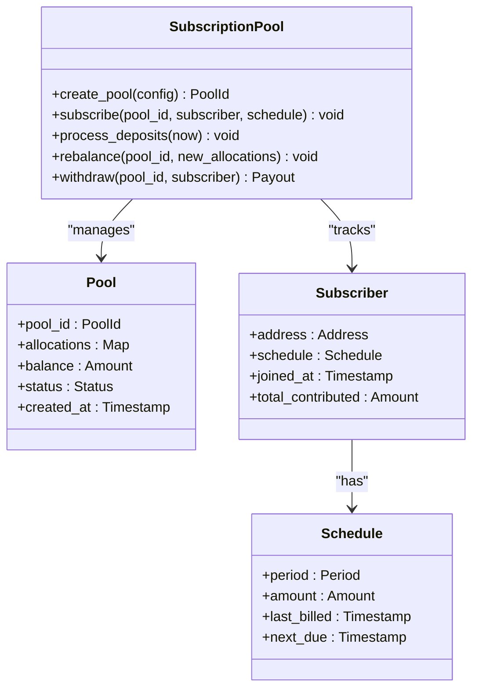
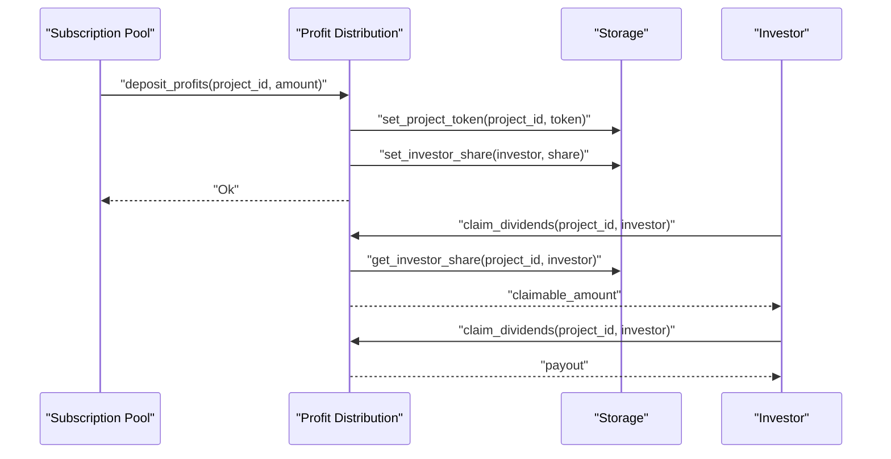
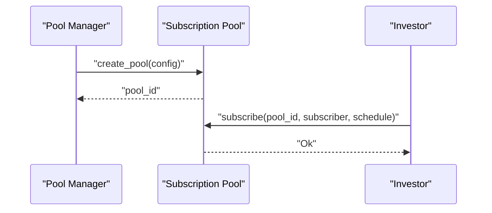
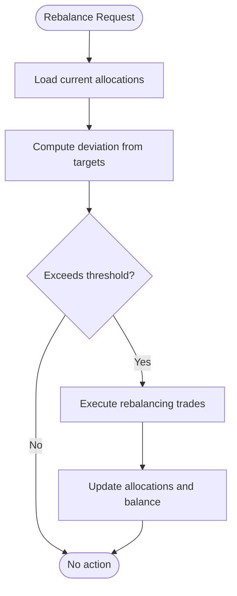
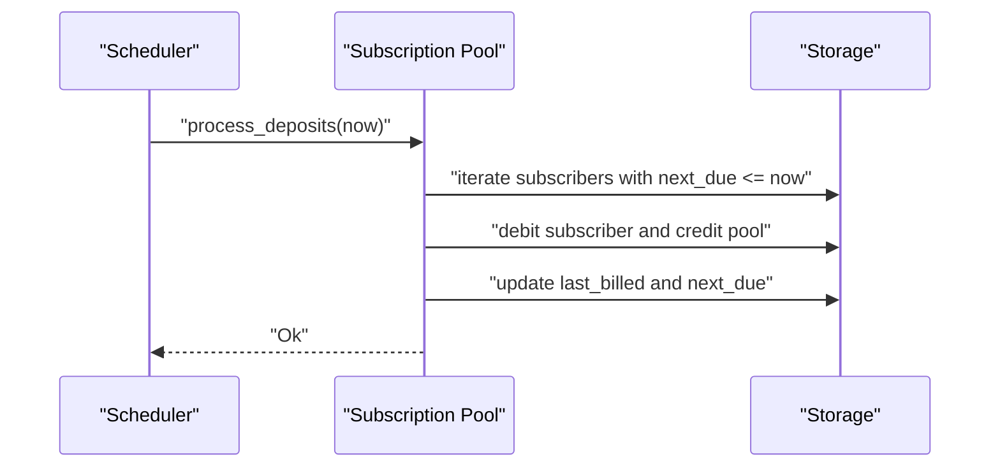
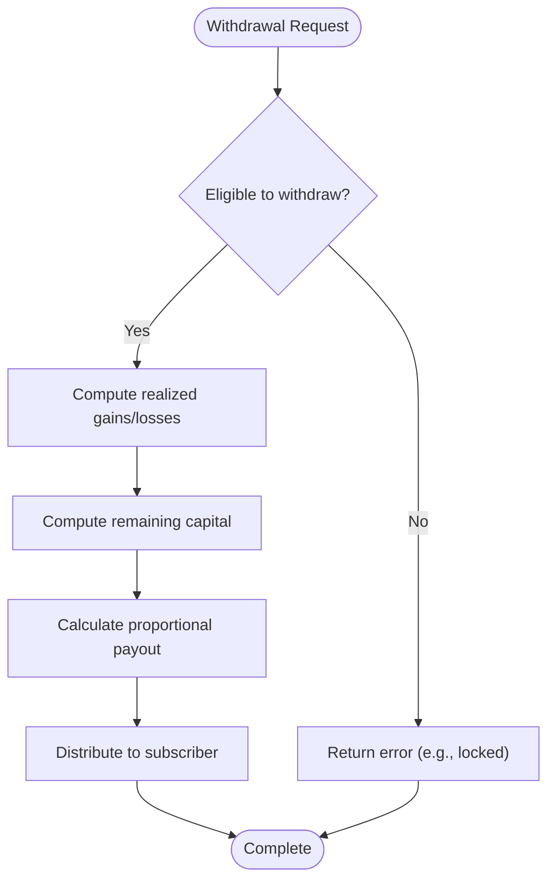
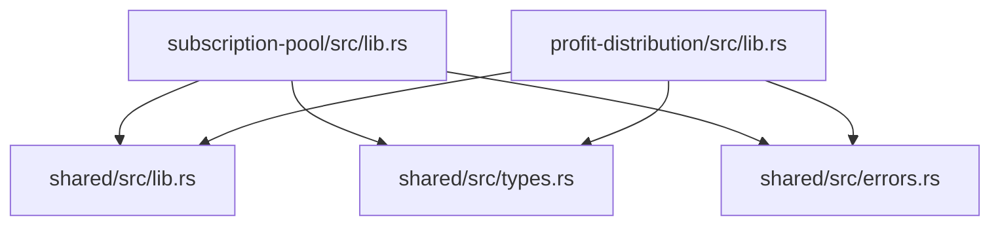

# Subscription & Pooling System

<cite>
**Referenced Files in This Document**
- [contracts/README.md](file://contracts/README.md)
- [contracts/SETUP.md](file://contracts/SETUP.md)
- [contracts/subscription-pool/src/lib.rs](file://contracts/subscription-pool/src/lib.rs)
- [contracts/subscription-pool/Cargo.toml](file://contracts/subscription-pool/Cargo.toml)
- [contracts/shared/src/lib.rs](file://contracts/shared/src/lib.rs)
- [contracts/shared/src/types.rs](file://contracts/shared/src/types.rs)
- [contracts/shared/src/errors.rs](file://contracts/shared/src/errors.rs)
- [contracts/profit-distribution/src/lib.rs](file://contracts/profit-distribution/src/lib.rs)
- [contracts/profit-distribution/src/types.rs](file://contracts/profit-distribution/src/types.rs)
- [contracts/profit-distribution/src/storage.rs](file://contracts/profit-distribution/src/storage.rs)
- [contracts/profit-distribution/src/events.rs](file://contracts/profit-distribution/src/events.rs)
</cite>

## Table of Contents
1. [Introduction](#introduction)
2. [Project Structure](#project-structure)
3. [Core Components](#core-components)
4. [Architecture Overview](#architecture-overview)
5. [Detailed Component Analysis](#detailed-component-analysis)
6. [Dependency Analysis](#dependency-analysis)
7. [Performance Considerations](#performance-considerations)
8. [Troubleshooting Guide](#troubleshooting-guide)
9. [Conclusion](#conclusion)
10. [Appendices](#appendices)

## Introduction
The Subscription & Pooling System enables recurring investment management and portfolio pooling on the Stellar network via Soroban smart contracts. It supports automated monthly or quarterly contributions, dynamic rebalancing, and flexible withdrawal calculations. The system is designed to integrate with investment contracts to process recurring contributions and allocate proceeds across pool members. This document explains how subscription pools work, how to configure them, how members join and withdraw, and how automated payouts are calculated.

## Project Structure
The Subscription & Pooling System is implemented as a standalone contract module with a shared library providing common types, errors, and utilities. The contract depends on the shared library and exposes core functions for pool lifecycle management.



**Diagram sources**
- [contracts/subscription-pool/src/lib.rs](file://contracts/subscription-pool/src/lib.rs#L1-L9)
- [contracts/subscription-pool/Cargo.toml](file://contracts/subscription-pool/Cargo.toml#L7-L16)
- [contracts/shared/src/lib.rs](file://contracts/shared/src/lib.rs#L1-L20)
- [contracts/profit-distribution/src/lib.rs](file://contracts/profit-distribution/src/lib.rs#L11-L25)

**Section sources**
- [contracts/README.md](file://contracts/README.md#L105-L228)
- [contracts/SETUP.md](file://contracts/SETUP.md#L1-L153)
- [contracts/subscription-pool/Cargo.toml](file://contracts/subscription-pool/Cargo.toml#L1-L16)

## Core Components
- Subscription Pool Contract: Manages recurring investment pools, subscriber schedules, deposit processing, portfolio rebalancing, and withdrawals with payout calculations.
- Shared Library: Provides common types (timestamps, amounts, basis points), error enums, event constants, and helper utilities.
- Profit Distribution Contract: Handles investor share registration, profit deposits, proportional distributions, and dividend claims. It complements the subscription pool by enabling pooled returns distribution.

Key capabilities:
- Pool creation and configuration
- Subscriber enrollment with recurring schedules (weekly/monthly/quarterly)
- Automated deposit collection and allocation
- Dynamic rebalancing of portfolio weights
- Flexible withdrawal calculations and payouts
- Integration with profit distribution for pooled returns

**Section sources**
- [contracts/README.md](file://contracts/README.md#L212-L228)
- [contracts/shared/src/types.rs](file://contracts/shared/src/types.rs#L1-L41)
- [contracts/shared/src/errors.rs](file://contracts/shared/src/errors.rs#L34-L46)
- [contracts/profit-distribution/src/lib.rs](file://contracts/profit-distribution/src/lib.rs#L3-L78)

## Architecture Overview
The Subscription & Pooling System follows a modular architecture:
- The subscription pool manages pool state, subscriber schedules, and automated processing.
- The profit distribution contract manages investor shares and distributes returns proportionally.
- The shared library centralizes common types, errors, and events used across contracts.



**Diagram sources**
- [contracts/README.md](file://contracts/README.md#L212-L228)
- [contracts/shared/src/types.rs](file://contracts/shared/src/types.rs#L1-L41)
- [contracts/shared/src/errors.rs](file://contracts/shared/src/errors.rs#L34-L46)
- [contracts/profit-distribution/src/lib.rs](file://contracts/profit-distribution/src/lib.rs#L31-L78)

## Detailed Component Analysis

### Subscription Pool Contract
The subscription pool contract orchestrates recurring contributions and pool operations. It defines the lifecycle of a pool and the interactions between subscribers and the pool.



**Diagram sources**
- [contracts/README.md](file://contracts/README.md#L212-L228)
- [contracts/shared/src/types.rs](file://contracts/shared/src/types.rs#L1-L41)

Implementation outline (placeholder):
- Pool creation initializes allocations and status.
- Subscribers enroll with a schedule (weekly/monthly/quarterly) and amount.
- Automated deposit processing checks due dates and collects contributions.
- Rebalancing updates portfolio targets and tracks deviations.
- Withdrawal calculates payouts based on realized gains/losses and remaining capital.

**Section sources**
- [contracts/subscription-pool/src/lib.rs](file://contracts/subscription-pool/src/lib.rs#L1-L9)
- [contracts/README.md](file://contracts/README.md#L212-L228)

### Profit Distribution Contract
The profit distribution contract complements the subscription pool by managing investor shares and distributing returns proportionally. It stores investor share records and emits events for deposits and claims.



**Diagram sources**
- [contracts/profit-distribution/src/lib.rs](file://contracts/profit-distribution/src/lib.rs#L36-L78)
- [contracts/profit-distribution/src/storage.rs](file://contracts/profit-distribution/src/storage.rs#L8-L33)
- [contracts/profit-distribution/src/types.rs](file://contracts/profit-distribution/src/types.rs#L3-L18)
- [contracts/profit-distribution/src/events.rs](file://contracts/profit-distribution/src/events.rs#L9-L21)

**Section sources**
- [contracts/profit-distribution/src/lib.rs](file://contracts/profit-distribution/src/lib.rs#L3-L78)
- [contracts/profit-distribution/src/storage.rs](file://contracts/profit-distribution/src/storage.rs#L1-L33)
- [contracts/profit-distribution/src/types.rs](file://contracts/profit-distribution/src/types.rs#L1-L18)
- [contracts/profit-distribution/src/events.rs](file://contracts/profit-distribution/src/events.rs#L1-L21)

### Shared Types, Errors, and Utilities
Common types define timestamps, amounts, and basis points. Errors include subscription-specific categories such as inactive subscriptions, invalid periods, existing subscriptions, and withdrawal locks. Utilities provide helper calculations.

```mermaid
classDiagram
class Types {
+Timestamp : u64
+Amount : i128
+BasisPoints : u32
+FeeConfig { platform_fee, creator_fee, fee_recipient }
+TokenInfo { address, symbol, decimals }
+UserProfile { address, reputation_score, ... }
}
class Errors {
+SubscriptionNotActive
+InvalidSubscriptionPeriod
+SubscriptionExists
+WithdrawalLocked
}
class Utils {
+calculate_percentage(amount, percentage, total_percentage) i128
}
Utils --> Types : "uses"
Errors --> Types : "relates to"
```

**Diagram sources**
- [contracts/shared/src/types.rs](file://contracts/shared/src/types.rs#L1-L41)
- [contracts/shared/src/errors.rs](file://contracts/shared/src/errors.rs#L34-L46)
- [contracts/shared/src/lib.rs](file://contracts/shared/src/lib.rs#L16-L20)

**Section sources**
- [contracts/shared/src/types.rs](file://contracts/shared/src/types.rs#L1-L41)
- [contracts/shared/src/errors.rs](file://contracts/shared/src/errors.rs#L34-L46)
- [contracts/shared/src/lib.rs](file://contracts/shared/src/lib.rs#L16-L20)

### Practical Workflows

#### Investor sets up a subscription plan
- Pool manager creates a pool with initial allocations and status.
- Investor subscribes with a schedule (weekly/monthly/quarterly) and amount.
- The subscription pool records the subscriber and due dates.



**Diagram sources**
- [contracts/README.md](file://contracts/README.md#L212-L228)
- [contracts/subscription-pool/src/lib.rs](file://contracts/subscription-pool/src/lib.rs#L3-L8)

#### Pool manager configures allocation strategies
- Pool manager updates allocations to rebalance the portfolio toward target weights.
- Deviations from targets trigger rebalancing actions.



**Diagram sources**
- [contracts/README.md](file://contracts/README.md#L212-L228)
- [contracts/shared/src/types.rs](file://contracts/shared/src/types.rs#L1-L41)

#### Automated collection and allocation
- At scheduled intervals, the pool processes deposits for all subscribers due now.
- Collected funds are allocated according to pool allocations.



**Diagram sources**
- [contracts/README.md](file://contracts/README.md#L212-L228)
- [contracts/shared/src/types.rs](file://contracts/shared/src/types.rs#L1-L41)

#### Withdrawal and payout calculation
- On withdrawal, the pool calculates realized gains/losses and remaining capital.
- Payout is computed based on proportional share and distribution rules.



**Diagram sources**
- [contracts/shared/src/errors.rs](file://contracts/shared/src/errors.rs#L34-L46)
- [contracts/shared/src/types.rs](file://contracts/shared/src/types.rs#L1-L41)

## Dependency Analysis
The subscription pool contract depends on the shared library for common types, errors, and utilities. The profit distribution contract also depends on the shared library and provides complementary functionality for investor share management and return distribution.



**Diagram sources**
- [contracts/subscription-pool/Cargo.toml](file://contracts/subscription-pool/Cargo.toml#L7-L16)
- [contracts/shared/src/lib.rs](file://contracts/shared/src/lib.rs#L1-L20)
- [contracts/profit-distribution/src/lib.rs](file://contracts/profit-distribution/src/lib.rs#L11-L25)

**Section sources**
- [contracts/subscription-pool/Cargo.toml](file://contracts/subscription-pool/Cargo.toml#L7-L16)
- [contracts/shared/src/lib.rs](file://contracts/shared/src/lib.rs#L1-L20)
- [contracts/profit-distribution/src/lib.rs](file://contracts/profit-distribution/src/lib.rs#L11-L25)

## Performance Considerations
- Minimize storage reads/writes during deposit processing by batching subscriber updates.
- Use efficient data structures for subscriber lists and due-date indexing.
- Offload heavy computations to off-chain systems while keeping critical state on-chain.
- Optimize WASM compilation and consider contract optimization steps for gas efficiency.

## Troubleshooting Guide
Common subscription-related errors and resolutions:
- SubscriptionNotActive: Ensure the pool is active before processing deposits or withdrawals.
- InvalidSubscriptionPeriod: Validate schedule periods (weekly/monthly/quarterly) and amounts.
- SubscriptionExists: Prevent duplicate subscriptions by checking existing records before enrolling.
- WithdrawalLocked: Respect lock-up periods and withdrawal restrictions before allowing exits.

Operational tips:
- Monitor subscriber due dates and reconcile missed payments.
- Validate allocation targets and thresholds for rebalancing.
- Keep track of realized gains/losses for accurate payout calculations.

**Section sources**
- [contracts/shared/src/errors.rs](file://contracts/shared/src/errors.rs#L34-L46)

## Conclusion
The Subscription & Pooling System provides a robust framework for recurring investment management and portfolio pooling on Stellar. By combining automated subscription processing with dynamic rebalancing and flexible withdrawal calculations, it enables scalable, transparent, and efficient pooled investing. Integration with the profit distribution contract further enhances value capture and return distribution for investors.

## Appendices

### API Reference Summary
- Subscription Pool
  - create_pool(config): Initializes a new pool with allocations and status.
  - subscribe(pool_id, subscriber, schedule): Enrolls a subscriber with a recurring schedule.
  - process_deposits(now): Collects scheduled contributions.
  - rebalance(pool_id, new_allocations): Updates portfolio allocations.
  - withdraw(pool_id, subscriber): Calculates and executes payouts.

- Profit Distribution
  - initialize(project_id, token): Initializes distribution for a project.
  - register_investors(project_id, investors): Registers investor shares.
  - deposit_profits(project_id, amount): Adds profits for distribution.
  - claim_dividends(project_id, investor): Allows investor to claim dividends.

**Section sources**
- [contracts/README.md](file://contracts/README.md#L212-L228)
- [contracts/profit-distribution/src/lib.rs](file://contracts/profit-distribution/src/lib.rs#L36-L78)