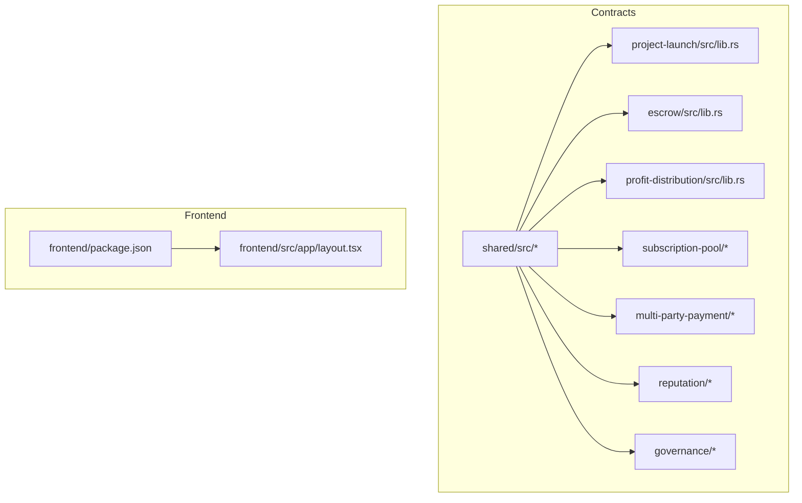
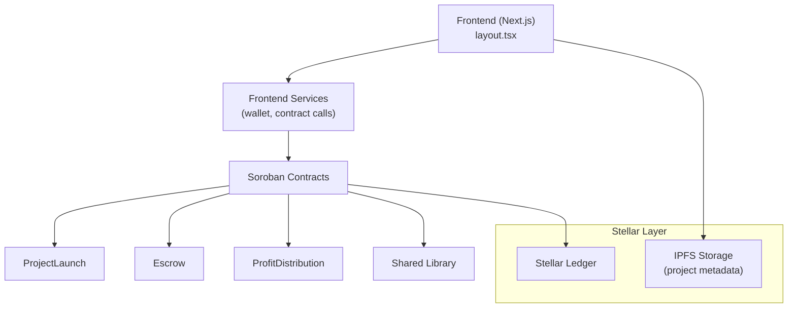
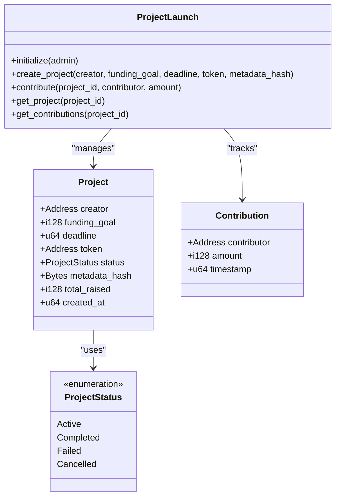
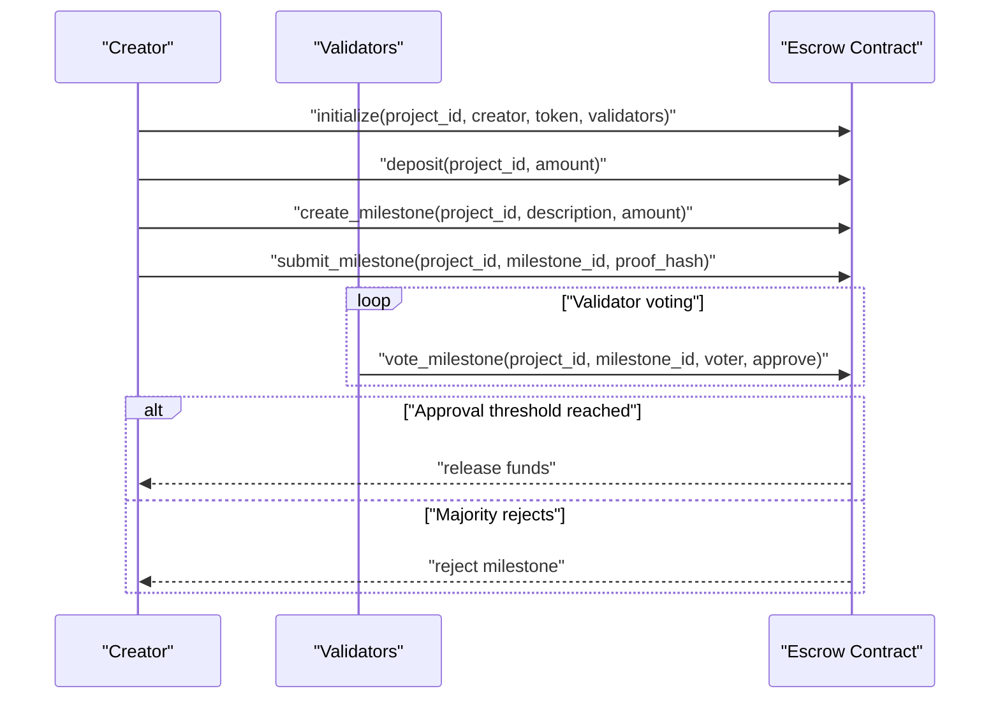
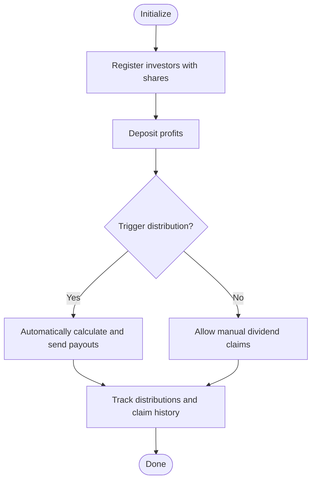
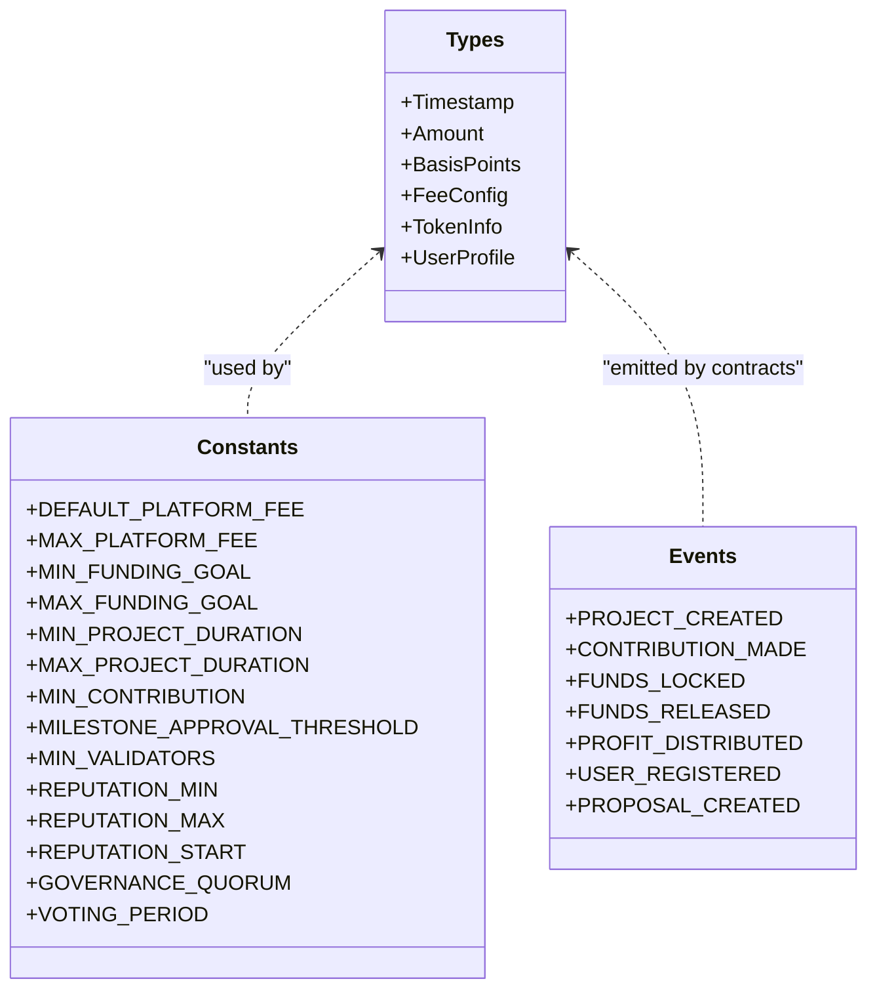
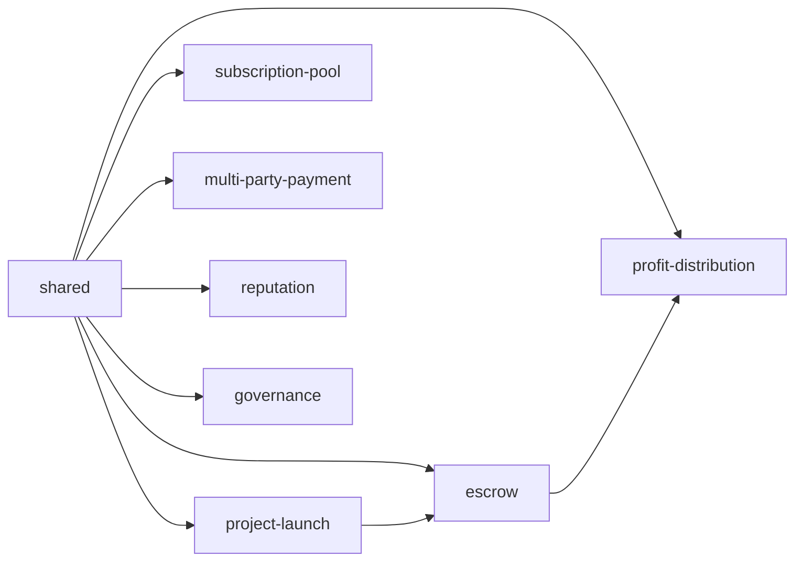

# Project Overview

<cite>
**Referenced Files in This Document**
- [README.md](file://README.md)
- [contracts/README.md](file://contracts/README.md)
- [contracts/SETUP.md](file://contracts/SETUP.md)
- [contracts/Cargo.toml](file://contracts/Cargo.toml)
- [contracts/shared/src/lib.rs](file://contracts/shared/src/lib.rs)
- [contracts/shared/src/types.rs](file://contracts/shared/src/types.rs)
- [contracts/shared/src/constants.rs](file://contracts/shared/src/constants.rs)
- [contracts/shared/src/events.rs](file://contracts/shared/src/events.rs)
- [contracts/project-launch/src/lib.rs](file://contracts/project-launch/src/lib.rs)
- [contracts/escrow/src/lib.rs](file://contracts/escrow/src/lib.rs)
- [contracts/escrow/src/storage.rs](file://contracts/escrow/src/storage.rs)
- [contracts/escrow/src/validation.rs](file://contracts/escrow/src/validation.rs)
- [contracts/profit-distribution/src/lib.rs](file://contracts/profit-distribution/src/lib.rs)
- [frontend/package.json](file://frontend/package.json)
- [frontend/src/app/layout.tsx](file://frontend/src/app/layout.tsx)
</cite>

## Table of Contents
1. [Introduction](#introduction)
2. [Project Structure](#project-structure)
3. [Core Components](#core-components)
4. [Architecture Overview](#architecture-overview)
5. [Detailed Component Analysis](#detailed-component-analysis)
6. [Dependency Analysis](#dependency-analysis)
7. [Performance Considerations](#performance-considerations)
8. [Troubleshooting Guide](#troubleshooting-guide)
9. [Conclusion](#conclusion)

## Introduction
NovaFund is a decentralized micro-investment platform built on the Stellar blockchain using Soroban smart contracts. Its mission is to democratize investment opportunities through community-driven funding, enabling anyone to propose projects, raise funds, and participate in profit-sharing with trustless automation. The platform emphasizes transparency, global accessibility, and low-cost operations by leveraging Stellar’s fast and inexpensive transactions.

Key value propositions:
- Trustless escrow: Funds are held securely in smart contracts until milestones are met.
- Automated distribution: Returns and dividends are distributed automatically based on contribution shares.
- Reputation system: On-chain reputation tokens incentivize trustworthy behavior and unlock benefits.
- Community governance: Platform decisions are made collectively through a transparent voting mechanism.
- Global access: No barriers to participation—anyone with internet access can contribute or create projects.

Differentiators:
- Modular smart contract architecture that separates concerns (project launch, escrow/milestones, profit distribution, multi-party payments, subscriptions, reputation, governance).
- Consistent terminology across code and docs: trustless escrow, automated distribution, and reputation system.
- Practical workflows: project funding, milestone-based payments, and profit sharing are first-class use cases.

Beginner-friendly overview:
- Blockchain crowdfunding basics: Instead of relying on intermediaries, contributors lock funds in a smart contract. Creators deliver milestones, validators approve progress, and funds are released automatically. Profits are distributed proportionally to investors without manual administration.

Developer-focused architecture:
- Rust-based Soroban contracts compiled to WASM and deployed on Stellar Testnet or Mainnet.
- Shared libraries define common types, constants, events, and utilities used across contracts.
- Frontend built with Next.js, TypeScript, and Tailwind CSS, integrating with Stellar wallets and interacting with contracts via Soroban SDK.

Practical examples:
- Project funding: Creator launches a project with a funding goal and deadline; investors contribute via the ProjectLaunch contract; funds are moved to the Escrow contract upon activation.
- Milestone-based payments: Creator submits milestone proofs; validators vote; upon approval, the Escrow contract releases funds to the creator.
- Profit sharing: After a project completes, the ProfitDistribution contract registers investor shares and distributes returns automatically or on demand.

**Section sources**
- [README.md](file://README.md#L39-L51)
- [README.md](file://README.md#L54-L98)
- [README.md](file://README.md#L101-L136)

## Project Structure
The repository is organized into two primary areas:
- contracts/: Soroban smart contracts grouped by domain (project-launch, escrow, profit-distribution, subscription-pool, multi-party-payment, reputation, governance) plus a shared library for common types, constants, and events.
- frontend/: React-based web application using Next.js, TypeScript, and Tailwind CSS.

**Diagram sources**
- [contracts/Cargo.toml](file://contracts/Cargo.toml#L4-L13)
- [contracts/shared/src/lib.rs](file://contracts/shared/src/lib.rs#L1-L14)
- [frontend/package.json](file://frontend/package.json#L1-L32)
- [frontend/src/app/layout.tsx](file://frontend/src/app/layout.tsx#L1-L29)

**Section sources**
- [README.md](file://README.md#L260-L313)
- [contracts/README.md](file://contracts/README.md#L1-L334)
- [contracts/Cargo.toml](file://contracts/Cargo.toml#L1-L38)
- [frontend/package.json](file://frontend/package.json#L1-L32)

## Core Components
This section highlights the platform’s core building blocks and their roles in enabling trustless crowdfunding and automated financial flows.

- ProjectLaunch contract
  - Purpose: Create and manage project funding campaigns, track contributions, and enforce deadlines and minimum goals.
  - Key capabilities: Initialize with admin, create projects with funding goals and deadlines, accept contributions, and emit events for transparency.
  - Data model: Project struct, Contribution tracking, and ProjectStatus enumeration.
  - Example interactions: Initialize, create_project, contribute, get_project, get_contributions.

- Escrow contract
  - Purpose: Securely hold funds and release them based on milestone approvals by validators.
  - Key capabilities: Initialize escrow with validators, deposit funds, create milestones, submit proofs, validator voting, and fund release.
  - Data model: EscrowInfo, Milestone, MilestoneStatus, and validator tracking.
  - Example interactions: initialize, deposit, create_milestone, submit_milestone, vote_milestone, get_escrow, get_milestone.

- ProfitDistribution contract
  - Purpose: Register investors and their share percentages, accept profit deposits, and enable automated or on-demand dividend distribution.
  - Current state: Placeholder implementation indicating planned investor registry, profit deposit, distribution triggers, and claim mechanics.

- Shared library
  - Purpose: Provide common types, constants, events, and utilities used across contracts.
  - Types: Timestamp, Amount, BasisPoints, FeeConfig, TokenInfo, UserProfile.
  - Constants: Funding goals, durations, minimum contributions, milestone thresholds, reputation ranges, governance quorum, voting periods.
  - Events: Standardized event symbols for lifecycle and operational actions.

- Frontend
  - Purpose: Provide user interface for browsing projects, viewing details, connecting wallets, and interacting with contracts.
  - Tech stack: Next.js, TypeScript, Tailwind CSS, and wallet integrations.

**Section sources**
- [contracts/README.md](file://contracts/README.md#L107-L177)
- [contracts/project-launch/src/lib.rs](file://contracts/project-launch/src/lib.rs#L14-L248)
- [contracts/README.md](file://contracts/README.md#L178-L194)
- [contracts/escrow/src/lib.rs](file://contracts/escrow/src/lib.rs#L24-L346)
- [contracts/README.md](file://contracts/README.md#L195-L211)
- [contracts/profit-distribution/src/lib.rs](file://contracts/profit-distribution/src/lib.rs#L1-L78)
- [contracts/shared/src/lib.rs](file://contracts/shared/src/lib.rs#L1-L14)
- [contracts/shared/src/types.rs](file://contracts/shared/src/types.rs#L1-L41)
- [contracts/shared/src/constants.rs](file://contracts/shared/src/constants.rs#L1-L40)
- [contracts/shared/src/events.rs](file://contracts/shared/src/events.rs#L1-L31)
- [frontend/package.json](file://frontend/package.json#L1-L32)

## Architecture Overview
NovaFund’s architecture layers the frontend, Stellar network, and smart contracts while maintaining clear separation of concerns.

**Diagram sources**
- [frontend/src/app/layout.tsx](file://frontend/src/app/layout.tsx#L1-L29)
- [contracts/Cargo.toml](file://contracts/Cargo.toml#L4-L13)
- [contracts/shared/src/lib.rs](file://contracts/shared/src/lib.rs#L1-L14)

**Section sources**
- [README.md](file://README.md#L101-L136)
- [README.md](file://README.md#L140-L167)

## Detailed Component Analysis

### ProjectLaunch Contract Analysis
The ProjectLaunch contract orchestrates project creation and funding. It validates funding goals, deadlines, and contributions, stores immutable records, and emits events for transparency.

**Diagram sources**
- [contracts/project-launch/src/lib.rs](file://contracts/project-launch/src/lib.rs#L25-L248)

**Section sources**
- [contracts/project-launch/src/lib.rs](file://contracts/project-launch/src/lib.rs#L74-L248)
- [contracts/shared/src/constants.rs](file://contracts/shared/src/constants.rs#L9-L22)

### Escrow Contract Analysis
The Escrow contract manages trustless fund holding and milestone-based releases. It enforces validator thresholds, tracks milestone submissions and votes, and releases funds upon approval.

**Diagram sources**
- [contracts/escrow/src/lib.rs](file://contracts/escrow/src/lib.rs#L31-L307)
- [contracts/escrow/src/storage.rs](file://contracts/escrow/src/storage.rs#L11-L142)
- [contracts/shared/src/constants.rs](file://contracts/shared/src/constants.rs#L24-L28)

**Section sources**
- [contracts/escrow/src/lib.rs](file://contracts/escrow/src/lib.rs#L24-L346)
- [contracts/escrow/src/storage.rs](file://contracts/escrow/src/storage.rs#L11-L142)
- [contracts/escrow/src/validation.rs](file://contracts/escrow/src/validation.rs#L5-L12)

### ProfitDistribution Contract Analysis
The ProfitDistribution contract is designed to register investor shares, accept profit deposits, and enable automated or on-demand dividend distribution. While currently a placeholder, it follows the shared architecture pattern.

**Diagram sources**
- [contracts/profit-distribution/src/lib.rs](file://contracts/profit-distribution/src/lib.rs#L36-L77)

**Section sources**
- [contracts/profit-distribution/src/lib.rs](file://contracts/profit-distribution/src/lib.rs#L1-L78)

### Shared Library and Data Model
The shared library centralizes common types, constants, and events used across contracts, ensuring consistency and reducing duplication.

**Diagram sources**
- [contracts/shared/src/types.rs](file://contracts/shared/src/types.rs#L1-L41)
- [contracts/shared/src/constants.rs](file://contracts/shared/src/constants.rs#L1-L40)
- [contracts/shared/src/events.rs](file://contracts/shared/src/events.rs#L1-L31)

**Section sources**
- [contracts/shared/src/lib.rs](file://contracts/shared/src/lib.rs#L1-L14)
- [contracts/shared/src/types.rs](file://contracts/shared/src/types.rs#L1-L41)
- [contracts/shared/src/constants.rs](file://contracts/shared/src/constants.rs#L1-L40)
- [contracts/shared/src/events.rs](file://contracts/shared/src/events.rs#L1-L31)

## Dependency Analysis
The contracts form a cohesive ecosystem with explicit dependencies on the shared library and on each other for end-to-end workflows.

**Diagram sources**
- [contracts/Cargo.toml](file://contracts/Cargo.toml#L4-L13)
- [contracts/shared/src/lib.rs](file://contracts/shared/src/lib.rs#L1-L14)

**Section sources**
- [contracts/Cargo.toml](file://contracts/Cargo.toml#L1-L38)
- [contracts/shared/src/lib.rs](file://contracts/shared/src/lib.rs#L1-L14)

## Performance Considerations
- Gas optimization: Contracts are compiled with release profiles optimized for size and speed, and WASM binaries are optimized using the Soroban CLI.
- Efficient storage: Persistent storage keys are scoped and minimal to reduce footprint and cost.
- Arithmetic safety: Checked arithmetic prevents overflow and ensures deterministic behavior.
- Event-driven UI updates: Standardized events enable efficient frontend indexing and reactive updates.

[No sources needed since this section provides general guidance]

## Troubleshooting Guide
Common issues and resolutions:
- Initialization failures: Ensure admin-only initialization is called once and with proper authorization.
- Invalid inputs: Validate funding goals, deadlines, and contribution amounts against constants and helper checks.
- Escrow validation errors: Confirm validator lists meet minimum thresholds and that milestone amounts do not exceed total deposits.
- Contract not found: Verify storage keys and that contracts are deployed and initialized before invoking functions.

**Section sources**
- [contracts/project-launch/src/lib.rs](file://contracts/project-launch/src/lib.rs#L75-L85)
- [contracts/shared/src/constants.rs](file://contracts/shared/src/constants.rs#L9-L22)
- [contracts/escrow/src/lib.rs](file://contracts/escrow/src/lib.rs#L37-L48)
- [contracts/escrow/src/validation.rs](file://contracts/escrow/src/validation.rs#L5-L12)

## Conclusion
NovaFund delivers a modular, transparent, and scalable crowdfunding platform on Stellar. By combining trustless escrow, milestone-based payments, automated distribution, and a reputation system, it lowers barriers to participation and automates financial workflows. The shared library and layered architecture ensure maintainability and interoperability across contracts, while the frontend provides an accessible gateway for users to engage with the ecosystem.

[No sources needed since this section summarizes without analyzing specific files]