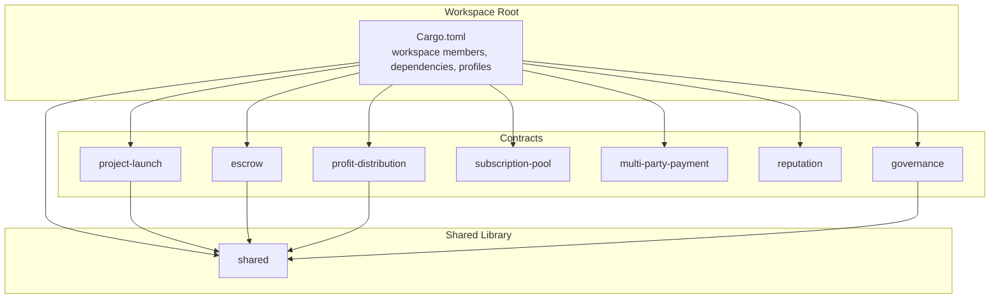
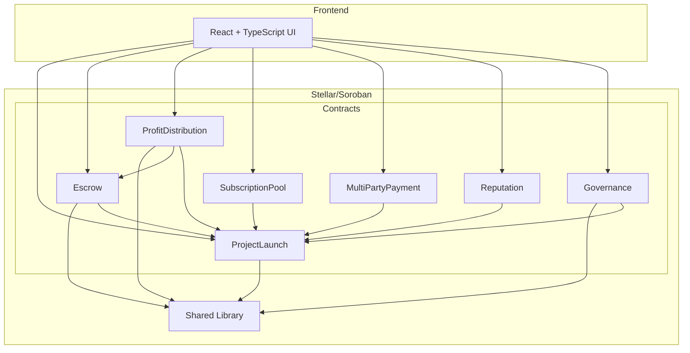
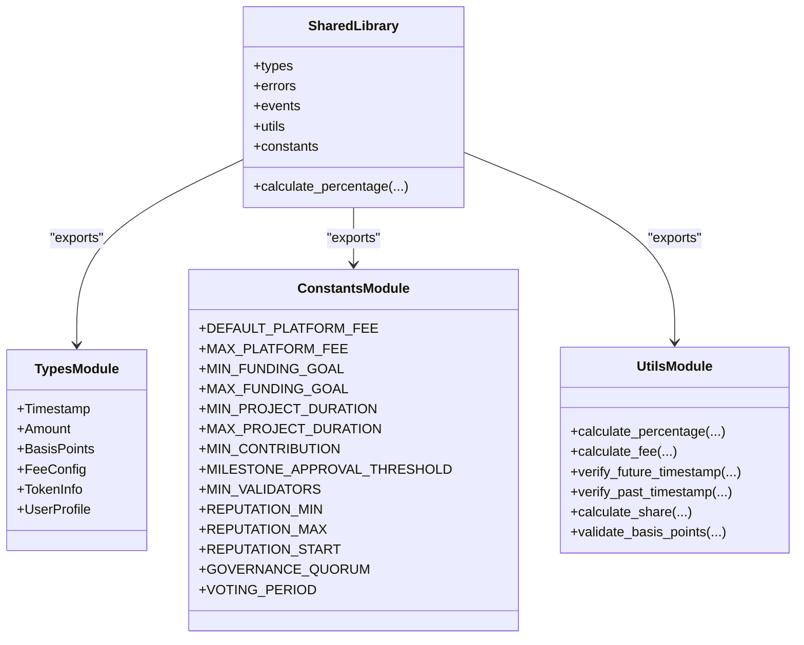
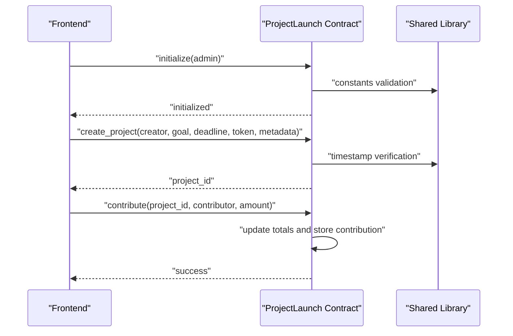
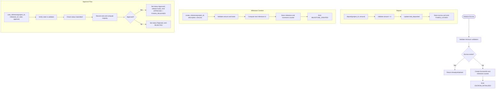
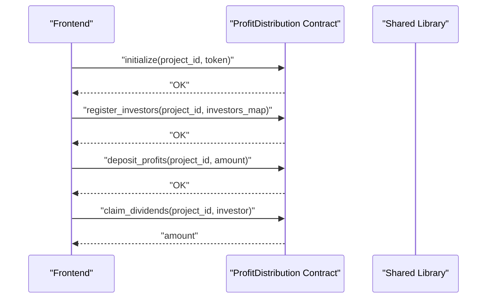
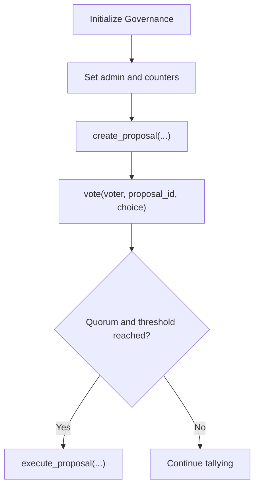
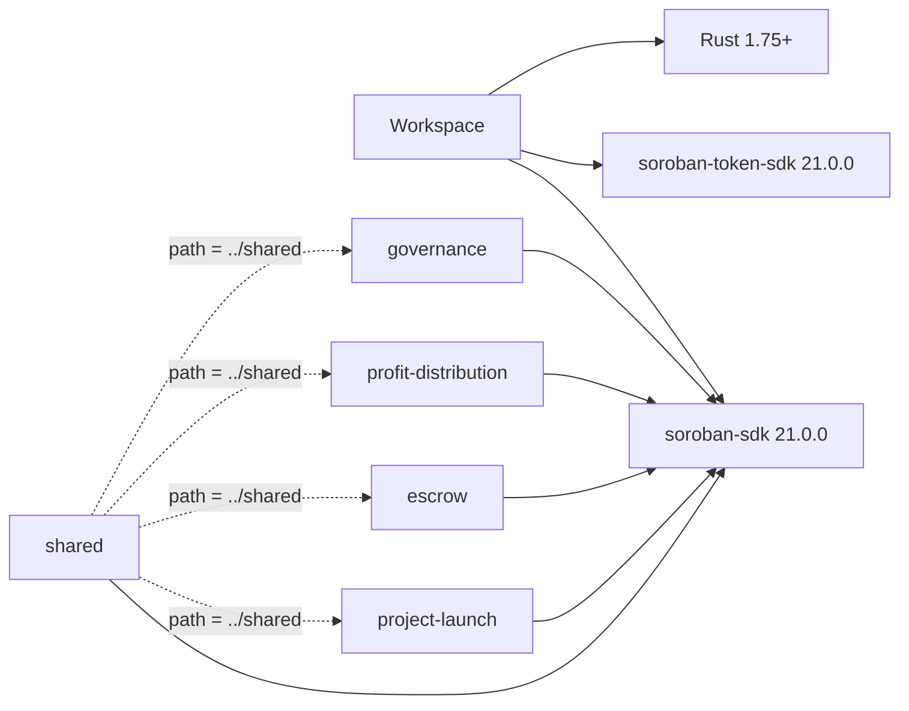

# Contract Architecture

<cite>
**Referenced Files in This Document**
- [Cargo.toml](file://contracts/Cargo.toml)
- [README.md](file://contracts/README.md)
- [SETUP.md](file://contracts/SETUP.md)
- [shared/Cargo.toml](file://contracts/shared/Cargo.toml)
- [shared/lib.rs](file://contracts/shared/src/lib.rs)
- [shared/types.rs](file://contracts/shared/src/types.rs)
- [shared/constants.rs](file://contracts/shared/src/constants.rs)
- [shared/utils.rs](file://contracts/shared/src/utils.rs)
- [escrow/Cargo.toml](file://contracts/escrow/Cargo.toml)
- [escrow/lib.rs](file://contracts/escrow/src/lib.rs)
- [profit-distribution/lib.rs](file://contracts/profit-distribution/src/lib.rs)
- [project-launch/lib.rs](file://contracts/project-launch/src/lib.rs)
- [README.md](file://README.md)
</cite>

## Table of Contents
1. [Introduction](#introduction)
2. [Project Structure](#project-structure)
3. [Core Components](#core-components)
4. [Architecture Overview](#architecture-overview)
5. [Detailed Component Analysis](#detailed-component-analysis)
6. [Dependency Analysis](#dependency-analysis)
7. [Performance Considerations](#performance-considerations)
8. [Troubleshooting Guide](#troubleshooting-guide)
9. [Conclusion](#conclusion)

## Introduction
This document explains the smart contract architecture for the NovaFund platform, focusing on the Cargo workspace configuration, modular design with shared utilities, and the development workflow. It covers the seven workspace member contracts, the shared library, Soroban SDK 21.0.0 dependencies, Rust 1.75+ requirements, and release profiles optimized for WebAssembly deployment. It also outlines conceptual overviews for beginners and technical details for advanced developers, including WASM compilation, contract ID management, and inter-contract communication patterns.

## Project Structure
The contracts workspace is organized as a Cargo workspace with eight members:
- Seven domain contracts: project-launch, escrow, profit-distribution, subscription-pool, multi-party-payment, reputation, governance
- One shared library: shared

The root workspace defines common package metadata and global dependencies. Each member contract specifies its own package metadata and links to the shared library. The shared library consolidates common types, constants, errors, events, and utilities used across contracts.

**Diagram sources**
- [Cargo.toml](file://contracts/Cargo.toml#L1-L38)
- [shared/Cargo.toml](file://contracts/shared/Cargo.toml#L1-L12)
- [escrow/Cargo.toml](file://contracts/escrow/Cargo.toml#L1-L16)
- [profit-distribution/lib.rs](file://contracts/profit-distribution/src/lib.rs#L1-L78)
- [project-launch/lib.rs](file://contracts/project-launch/src/lib.rs#L1-L363)

**Section sources**
- [Cargo.toml](file://contracts/Cargo.toml#L1-L38)
- [README.md](file://contracts/README.md#L1-L334)

## Core Components
- Workspace configuration: Defines resolver, members, common package metadata (version, edition, rust-version), and global dependencies (soroban-sdk, soroban-token-sdk).
- Release profiles: Two primary profiles are defined:
  - release: optimized for production with LTO, z-level optimization, symbol stripping, abort panic strategy, and single-codegen unit.
  - release-with-logs: inherits release settings and enables debug assertions for logging during testing.
- Shared library: Provides common types, constants, errors, events, and utilities. It is a rlib crate consumed by all contracts.

Key characteristics:
- Rust requirement: 1.75+ enforced at workspace level.
- SDK version: 21.0.0 for both soroban-sdk and soroban-token-sdk.
- Crate types:
  - shared: rlib
  - contracts: cdylib for WASM export

**Section sources**
- [Cargo.toml](file://contracts/Cargo.toml#L15-L38)
- [shared/Cargo.toml](file://contracts/shared/Cargo.toml#L1-L12)
- [shared/lib.rs](file://contracts/shared/src/lib.rs#L1-L20)

## Architecture Overview
The contracts are designed around a modular, composable architecture:
- Domain contracts encapsulate specific business logic (project funding, escrow/milestones, profit distribution, subscriptions, multi-party payments, reputation, governance).
- The shared library centralizes cross-cutting concerns to reduce duplication and ensure consistency.
- Contracts communicate via on-chain invocations and shared state keys, emitting events for off-chain indexing.

**Diagram sources**
- [project-launch/lib.rs](file://contracts/project-launch/src/lib.rs#L1-L363)
- [escrow/lib.rs](file://contracts/escrow/src/lib.rs#L1-L367)
- [profit-distribution/lib.rs](file://contracts/profit-distribution/src/lib.rs#L1-L78)
- [shared/lib.rs](file://contracts/shared/src/lib.rs#L1-L20)

## Detailed Component Analysis

### Shared Library
The shared library provides foundational elements reused across contracts:
- Types: common aliases and structured types used in multiple contracts.
- Constants: platform-wide limits and thresholds.
- Utilities: helper functions for calculations and validations.
- Exports: re-exports enable concise imports in consumers.

**Diagram sources**
- [shared/lib.rs](file://contracts/shared/src/lib.rs#L1-L20)
- [shared/types.rs](file://contracts/shared/src/types.rs#L1-L41)
- [shared/constants.rs](file://contracts/shared/src/constants.rs#L1-L40)
- [shared/utils.rs](file://contracts/shared/src/utils.rs#L1-L59)

**Section sources**
- [shared/lib.rs](file://contracts/shared/src/lib.rs#L1-L20)
- [shared/types.rs](file://contracts/shared/src/types.rs#L1-L41)
- [shared/constants.rs](file://contracts/shared/src/constants.rs#L1-L40)
- [shared/utils.rs](file://contracts/shared/src/utils.rs#L1-L59)

### Project Launch Contract
The project-launch contract manages project lifecycle, funding goals, deadlines, and contributions. It emits events for project creation and contributions and stores persistent contribution records.

**Diagram sources**
- [project-launch/lib.rs](file://contracts/project-launch/src/lib.rs#L72-L248)
- [shared/constants.rs](file://contracts/shared/src/constants.rs#L1-L40)
- [shared/utils.rs](file://contracts/shared/src/utils.rs#L15-L23)

**Section sources**
- [project-launch/lib.rs](file://contracts/project-launch/src/lib.rs#L1-L363)

### Escrow Contract
The escrow contract holds funds and releases them based on milestone approvals by validators. It tracks escrow info, milestone definitions, and validator votes, emitting events for lifecycle actions.

**Diagram sources**
- [escrow/lib.rs](file://contracts/escrow/src/lib.rs#L22-L307)
- [shared/constants.rs](file://contracts/shared/src/constants.rs#L24-L28)

**Section sources**
- [escrow/lib.rs](file://contracts/escrow/src/lib.rs#L1-L367)

### Profit Distribution Contract
The profit-distribution contract is a placeholder for investor share registration, profit deposits, and dividend claiming. It demonstrates the shared types and event emission patterns.

**Diagram sources**
- [profit-distribution/lib.rs](file://contracts/profit-distribution/src/lib.rs#L31-L78)
- [shared/types.rs](file://contracts/shared/src/types.rs#L21-L40)

**Section sources**
- [profit-distribution/lib.rs](file://contracts/profit-distribution/src/lib.rs#L1-L78)

### Governance Contract
The governance contract provides a foundation for proposals, voting, and delegation. It leverages shared types and constants for consistent behavior across contracts.

**Diagram sources**
- [project-launch/lib.rs](file://contracts/project-launch/src/lib.rs#L1-L363)
- [shared/constants.rs](file://contracts/shared/src/constants.rs#L35-L39)

**Section sources**
- [project-launch/lib.rs](file://contracts/project-launch/src/lib.rs#L1-L363)

## Dependency Analysis
The workspace enforces consistent dependency management:
- Workspace-level dependencies: soroban-sdk 21.0.0, soroban-token-sdk 21.0.0.
- Workspace-level toolchain: Rust 1.75+.
- Crate types:
  - shared: rlib
  - contracts: cdylib for WASM export
- Dev dependencies: contracts include testutils feature for testing.

**Diagram sources**
- [Cargo.toml](file://contracts/Cargo.toml#L21-L23)
- [shared/Cargo.toml](file://contracts/shared/Cargo.toml#L7-L8)
- [escrow/Cargo.toml](file://contracts/escrow/Cargo.toml#L7-L9)

**Section sources**
- [Cargo.toml](file://contracts/Cargo.toml#L21-L23)
- [shared/Cargo.toml](file://contracts/shared/Cargo.toml#L7-L11)
- [escrow/Cargo.toml](file://contracts/escrow/Cargo.toml#L7-L12)

## Performance Considerations
Production builds are optimized for size and performance:
- opt-level = "z": aggressive size optimization.
- overflow-checks = true: safety without runtime cost in release.
- debug = 0: minimal debug info.
- strip = "symbols": reduces WASM binary size.
- debug-assertions = false: disables debug assertions in release.
- panic = "abort": smaller panic handling.
- codegen-units = 1: enables whole-program optimization.
- lto = true: link-time optimization across crates.

For development with logs, use the release-with-logs profile which inherits release settings and enables debug assertions.

**Section sources**
- [Cargo.toml](file://contracts/Cargo.toml#L25-L38)

## Troubleshooting Guide
Common issues and resolutions:
- Build failures due to missing WASM target:
  - Ensure wasm32-unknown-unknown target is installed.
- Version mismatches:
  - Confirm Rust 1.75+ and matching SDK versions across workspace.
- WASM size and gas concerns:
  - Use release profile with LTO and symbol stripping.
  - Consider soroban-cli optimize step for further size reduction.
- Testing and debugging:
  - Use testutils feature for contracts during development.
  - Enable release-with-logs for targeted diagnostics.

**Section sources**
- [README.md](file://contracts/README.md#L21-L66)
- [SETUP.md](file://contracts/SETUP.md#L37-L126)

## Conclusion
The NovaFund smart contract architecture leverages a Cargo workspace with seven domain contracts and a shared library to achieve modularity, consistency, and maintainability. The workspace enforces Soroban SDK 21.0.0 and Rust 1.75+, while release profiles are tuned for efficient WebAssembly deployment. Contracts use shared types, constants, and utilities, and inter-contract communication follows on-chain invocation patterns with standardized events. This design supports scalable development, clear separation of concerns, and robust production deployments on Stellar’s Soroban.