# Escrow Contract

<cite>
**Referenced Files in This Document**
- [lib.rs](file://contracts/escrow/src/lib.rs)
- [storage.rs](file://contracts/escrow/src/storage.rs)
- [validation.rs](file://contracts/escrow/src/validation.rs)
- [tests.rs](file://contracts/escrow/src/tests.rs)
- [IMPLEMENTATION.md](file://contracts/escrow/IMPLEMENTATION.md)
- [constants.rs](file://contracts/shared/src/constants.rs)
- [events.rs](file://contracts/shared/src/events.rs)
- [errors.rs](file://contracts/shared/src/errors.rs)
- [types.rs](file://contracts/shared/src/types.rs)
- [lib.rs (ProjectLaunch)](file://contracts/project-launch/src/lib.rs)
- [lib.rs (ProfitDistribution)](file://contracts/profit-distribution/src/lib.rs)
- [storage.rs (ProfitDistribution)](file://contracts/profit-distribution/src/storage.rs)
- [types.rs (ProfitDistribution)](file://contracts/profit-distribution/src/types.rs)
- [events.rs (ProfitDistribution)](file://contracts/profit-distribution/src/events.rs)
</cite>

## Table of Contents
1. [Introduction](#introduction)
2. [Project Structure](#project-structure)
3. [Core Components](#core-components)
4. [Architecture Overview](#architecture-overview)
5. [Detailed Component Analysis](#detailed-component-analysis)
6. [Dependency Analysis](#dependency-analysis)
7. [Performance Considerations](#performance-considerations)
8. [Troubleshooting Guide](#troubleshooting-guide)
9. [Conclusion](#conclusion)
10. [Appendices](#appendices)

## Introduction
The Escrow contract is a trustless, on-chain mechanism for secure fund holding and milestone-based releases. It ensures contributors’ funds remain locked until project milestones are completed and approved by a predefined set of validators. The contract enforces strict validation, transparent lifecycle tracking, and immutable event emissions for all actions. It integrates with ProjectLaunch for funding initiation and lays groundwork for future integration with ProfitDistribution for automated investor payouts.

## Project Structure
The Escrow contract is organized into focused modules:
- Core contract implementation and public functions
- Storage abstraction for persistent data
- Validation helpers for access control and eligibility checks
- Comprehensive unit tests validating workflows and edge cases
- Implementation guide detailing data models, events, and constants

**Diagram sources**
- [lib.rs](file://contracts/escrow/src/lib.rs#L1-L367)
- [storage.rs](file://contracts/escrow/src/storage.rs#L1-L144)
- [validation.rs](file://contracts/escrow/src/validation.rs#L1-L13)
- [tests.rs](file://contracts/escrow/src/tests.rs#L1-L362)
- [IMPLEMENTATION.md](file://contracts/escrow/IMPLEMENTATION.md#L1-L419)
- [constants.rs](file://contracts/shared/src/constants.rs#L1-L40)
- [events.rs](file://contracts/shared/src/events.rs#L1-L31)
- [errors.rs](file://contracts/shared/src/errors.rs#L1-L54)
- [types.rs](file://contracts/shared/src/types.rs#L1-L41)
- [lib.rs (ProjectLaunch)](file://contracts/project-launch/src/lib.rs#L1-L363)
- [lib.rs (ProfitDistribution)](file://contracts/profit-distribution/src/lib.rs#L1-L78)

**Section sources**
- [lib.rs](file://contracts/escrow/src/lib.rs#L1-L367)
- [storage.rs](file://contracts/escrow/src/storage.rs#L1-L144)
- [validation.rs](file://contracts/escrow/src/validation.rs#L1-L13)
- [tests.rs](file://contracts/escrow/src/tests.rs#L1-L362)
- [IMPLEMENTATION.md](file://contracts/escrow/IMPLEMENTATION.md#L1-L419)
- [constants.rs](file://contracts/shared/src/constants.rs#L1-L40)
- [events.rs](file://contracts/shared/src/events.rs#L1-L31)
- [errors.rs](file://contracts/shared/src/errors.rs#L1-L54)
- [types.rs](file://contracts/shared/src/types.rs#L1-L41)
- [lib.rs (ProjectLaunch)](file://contracts/project-launch/src/lib.rs#L1-L363)
- [lib.rs (ProfitDistribution)](file://contracts/profit-distribution/src/lib.rs#L1-L78)

## Core Components
- Public API surface: initialization, deposits, milestone lifecycle, queries, and helper getters
- Storage layer: composite keys for escrows, milestones, counters, and validator votes
- Validation helpers: validator eligibility checks
- Shared constants and types: thresholds, error enums, and common types
- Events: standardized event symbols for lifecycle actions
- Tests: comprehensive coverage of workflows, invariants, and error paths

Key responsibilities:
- Trustless fund accounting: track total_deposited and released_amount
- Milestone lifecycle: Pending → Submitted → Approved/Rejected
- Validator voting: enforce majority thresholds and single-vote-per-validator rules
- Double-release prevention: monotonic released_amount and bounds checking
- Transparent audit trail: emitted events for all state changes

**Section sources**
- [lib.rs](file://contracts/escrow/src/lib.rs#L22-L346)
- [storage.rs](file://contracts/escrow/src/storage.rs#L11-L142)
- [validation.rs](file://contracts/escrow/src/validation.rs#L5-L12)
- [IMPLEMENTATION.md](file://contracts/escrow/IMPLEMENTATION.md#L15-L78)
- [constants.rs](file://contracts/shared/src/constants.rs#L24-L28)
- [events.rs](file://contracts/shared/src/events.rs#L13-L16)
- [errors.rs](file://contracts/shared/src/errors.rs#L21-L26)
- [tests.rs](file://contracts/escrow/src/tests.rs#L35-L361)

## Architecture Overview
The Escrow contract orchestrates trustless fund management through a clear separation of concerns:
- Initialization sets up the escrow with a creator, token, and validator set
- Funding occurs off-chain; the contract maintains accounting
- Milestones are created by the creator and submitted with proof
- Validators vote; majority approval triggers release and updates accounting
- Queries expose current state and balances

**Diagram sources**
- [lib.rs](file://contracts/escrow/src/lib.rs#L31-L307)
- [storage.rs](file://contracts/escrow/src/storage.rs#L11-L125)
- [IMPLEMENTATION.md](file://contracts/escrow/IMPLEMENTATION.md#L80-L232)
- [events.rs](file://contracts/shared/src/events.rs#L13-L16)

## Detailed Component Analysis

### Data Model and Storage
The contract defines core data structures and uses composite storage keys to prevent collisions and enable efficient iteration.

```mermaid
erDiagram
ESCROW_INFO {
uint64 project_id PK
address creator
address token
i128 total_deposited
i128 released_amount
address[] validators
}
MILESTONE {
uint64 id PK
uint64 project_id FK
string description
i128 amount
enum status
string proof_hash
uint32 approval_count
uint32 rejection_count
uint64 created_at
}
STORAGE_KEYS {
string prefix
uint64 project_id
uint64 milestone_id
address validator
}
ESCROW_INFO ||--o{ MILESTONE : "contains"
```

- Composite keys:
  - Escrow: ("escrow", project_id)
  - Milestone: ("milestone", project_id, milestone_id)
  - Milestone counter: ("m_counter", project_id)
  - Validator vote: ("v_vote", project_id, milestone_id, validator)

- Invariants enforced by storage operations:
  - Monotonic released_amount updates
  - Vote records keyed by validator to prevent double voting
  - Counter-based milestone indexing for deterministic ordering

**Diagram sources**
- [storage.rs](file://contracts/escrow/src/storage.rs#L5-L125)
- [IMPLEMENTATION.md](file://contracts/escrow/IMPLEMENTATION.md#L15-L78)

**Section sources**
- [storage.rs](file://contracts/escrow/src/storage.rs#L11-L142)
- [IMPLEMENTATION.md](file://contracts/escrow/IMPLEMENTATION.md#L335-L345)

### Public API and Processing Logic
The contract exposes a concise set of functions with explicit validations and event emissions.

- Initialization
  - Validates minimum validators and uniqueness of project_id
  - Stores EscrowInfo and initializes milestone counter
  - Emits ESCROW_INITIALIZED

- Deposit
  - Validates positive amount and updates total_deposited
  - Emits FUNDS_LOCKED

- Create Milestone
  - Creator authorization, positive amount, and budget checks
  - Enforces sum-of-milestones ≤ total_deposited
  - Emits MILESTONE_CREATED

- Submit Milestone
  - Creator authorization, Pending status check
  - Transitions to Submitted, resets votes, clears prior voter records
  - Emits MILESTONE_SUBMITTED

- Vote Milestone
  - Validator eligibility check, Submitted status, single-vote rule
  - Computes majority based on MILESTONE_APPROVAL_THRESHOLD
  - On approval: releases funds, updates accounting, emits MILESTONE_APPROVED and FUNDS_RELEASED
  - On rejection: marks Rejected
  - Emits MILESTONE_REJECTED otherwise

- Queries
  - get_escrow, get_milestone, get_total_milestone_amount, get_available_balance

**Diagram sources**
- [lib.rs](file://contracts/escrow/src/lib.rs#L220-L307)
- [storage.rs](file://contracts/escrow/src/storage.rs#L85-L107)
- [validation.rs](file://contracts/escrow/src/validation.rs#L5-L12)
- [IMPLEMENTATION.md](file://contracts/escrow/IMPLEMENTATION.md#L217-L231)

**Section sources**
- [lib.rs](file://contracts/escrow/src/lib.rs#L31-L346)
- [IMPLEMENTATION.md](file://contracts/escrow/IMPLEMENTATION.md#L80-L303)

### Validation Functions and Access Control
- Creator authorization for initialization, deposit, milestone creation, and submission
- Validator eligibility check via whitelist and single-vote enforcement
- Safe arithmetic using checked operations to prevent overflow
- Threshold computation using MILESTONE_APPROVAL_THRESHOLD (60%)

Concrete examples from the codebase:
- Validator check: [validate_validator](file://contracts/escrow/src/validation.rs#L6-L12)
- Single-vote enforcement: [has_validator_voted](file://contracts/escrow/src/storage.rs#L85-L96)
- Majority threshold: [vote_milestone threshold](file://contracts/escrow/src/lib.rs#L267-L271)

**Section sources**
- [validation.rs](file://contracts/escrow/src/validation.rs#L5-L12)
- [storage.rs](file://contracts/escrow/src/storage.rs#L85-L107)
- [lib.rs](file://contracts/escrow/src/lib.rs#L267-L271)

### Storage Operations and Event Emissions
- Storage operations:
  - Escrow CRUD: [set_escrow](file://contracts/escrow/src/storage.rs#L11-L24), [get_escrow](file://contracts/escrow/src/storage.rs#L17-L24)
  - Milestone CRUD: [set_milestone](file://contracts/escrow/src/storage.rs#L34-L56), [get_milestone](file://contracts/escrow/src/storage.rs#L45-L56)
  - Counter and votes: [set_milestone_counter](file://contracts/escrow/src/storage.rs#L58-L62), [set_validator_vote](file://contracts/escrow/src/storage.rs#L73-L83), [clear_milestone_voters](file://contracts/escrow/src/storage.rs#L98-L107)
  - Aggregation: [get_total_milestone_amount](file://contracts/escrow/src/storage.rs#L127-L142)

- Event emissions:
  - Escrow lifecycle: [ESCROW_INITIALIZED](file://contracts/escrow/src/lib.rs#L66-L67), [FUNDS_LOCKED](file://contracts/escrow/src/lib.rs#L99-L100)
  - Milestone lifecycle: [MILESTONE_CREATED](file://contracts/escrow/src/lib.rs#L160-L164), [MILESTONE_SUBMITTED](file://contracts/escrow/src/lib.rs#L206-L208), [MILESTONE_APPROVED](file://contracts/escrow/src/lib.rs#L283-L287), [FUNDS_RELEASED](file://contracts/escrow/src/lib.rs#L289-L290), [MILESTONE_REJECTED](file://contracts/escrow/src/lib.rs#L296-L300)

**Section sources**
- [storage.rs](file://contracts/escrow/src/storage.rs#L11-L142)
- [lib.rs](file://contracts/escrow/src/lib.rs#L66-L300)
- [events.rs](file://contracts/shared/src/events.rs#L13-L16)

### Configuration Options and Constants
- Milestone approval threshold: 60% (6000 basis points)
- Minimum validators: 3
- Amount and timestamp types: i128 and u64 respectively
- Error categories: general, project, escrow, distribution, reputation, governance

Examples:
- Threshold constant: [MILESTONE_APPROVAL_THRESHOLD](file://contracts/shared/src/constants.rs#L24-L25)
- Min validators: [MIN_VALIDATORS](file://contracts/shared/src/constants.rs#L27-L28)
- Types: [Amount, Timestamp](file://contracts/shared/src/types.rs#L6-L10)
- Error enums: [Escrow-specific errors](file://contracts/shared/src/errors.rs#L21-L26)

**Section sources**
- [constants.rs](file://contracts/shared/src/constants.rs#L24-L28)
- [types.rs](file://contracts/shared/src/types.rs#L6-L10)
- [errors.rs](file://contracts/shared/src/errors.rs#L21-L26)

### Integration with ProjectLaunch and ProfitDistribution
- ProjectLaunch: Provides funding initiation and contribution tracking; Escrow consumes ProjectLaunch’s project lifecycle and token information for accounting.
- ProfitDistribution: Future integration path for distributing project profits to investors; Escrow’s released funds can feed into ProfitDistribution’s investor share calculations.

**Diagram sources**
- [lib.rs (ProjectLaunch)](file://contracts/project-launch/src/lib.rs#L87-L149)
- [lib.rs (ProfitDistribution)](file://contracts/profit-distribution/src/lib.rs#L36-L56)
- [lib.rs](file://contracts/escrow/src/lib.rs#L31-L103)

**Section sources**
- [lib.rs (ProjectLaunch)](file://contracts/project-launch/src/lib.rs#L87-L149)
- [lib.rs (ProfitDistribution)](file://contracts/profit-distribution/src/lib.rs#L36-L56)
- [storage.rs (ProfitDistribution)](file://contracts/profit-distribution/src/storage.rs#L8-L33)
- [types.rs (ProfitDistribution)](file://contracts/profit-distribution/src/types.rs#L3-L18)
- [events.rs (ProfitDistribution)](file://contracts/profit-distribution/src/events.rs#L3-L21)

## Dependency Analysis
The Escrow contract depends on shared modules for constants, types, errors, and events. It interacts with ProjectLaunch for funding context and ProfitDistribution for future payout automation.

**Diagram sources**
- [lib.rs](file://contracts/escrow/src/lib.rs#L1-L18)
- [storage.rs](file://contracts/escrow/src/storage.rs#L1-L3)
- [validation.rs](file://contracts/escrow/src/validation.rs#L1-L3)
- [constants.rs](file://contracts/shared/src/constants.rs#L1-L40)
- [events.rs](file://contracts/shared/src/events.rs#L1-L31)
- [errors.rs](file://contracts/shared/src/errors.rs#L1-L54)
- [types.rs](file://contracts/shared/src/types.rs#L1-L41)

**Section sources**
- [lib.rs](file://contracts/escrow/src/lib.rs#L1-L18)
- [storage.rs](file://contracts/escrow/src/storage.rs#L1-L3)
- [validation.rs](file://contracts/escrow/src/validation.rs#L1-L3)
- [constants.rs](file://contracts/shared/src/constants.rs#L1-L40)
- [events.rs](file://contracts/shared/src/events.rs#L1-L31)
- [errors.rs](file://contracts/shared/src/errors.rs#L1-L54)
- [types.rs](file://contracts/shared/src/types.rs#L1-L41)

## Performance Considerations
- Storage keys are composite and short; lookups are O(1) with persistent storage
- get_total_milestone_amount iterates milestones up to counter; keep milestone counts reasonable
- Safe arithmetic prevents overflow; consider batch operations off-chain to reduce on-chain calls
- Validator vote records use minimal footprint; clearing votes on resubmission is efficient

[No sources needed since this section provides general guidance]

## Troubleshooting Guide
Common issues and resolutions:
- Invalid milestone status
  - Symptom: vote_milestone fails with invalid status
  - Cause: milestone not in Submitted state
  - Resolution: ensure submit_milestone was called and status transitioned
  - Evidence: [submit_milestone status checks](file://contracts/escrow/src/lib.rs#L188-L191), [vote_milestone status checks](file://contracts/escrow/src/lib.rs#L240-L243)

- Not a validator
  - Symptom: vote_milestone returns NotAValidator
  - Cause: caller not in validators list
  - Resolution: verify validator whitelist during initialization
  - Evidence: [validate_validator](file://contracts/escrow/src/validation.rs#L6-L12), [vote_milestone validator check](file://contracts/escrow/src/lib.rs#L232-L235)

- Already voted
  - Symptom: vote_milestone returns AlreadyVoted
  - Cause: same validator attempting duplicate vote
  - Resolution: enforce single-vote rule per milestone
  - Evidence: [has_validator_voted](file://contracts/escrow/src/storage.rs#L85-L96)

- Insufficient escrow balance
  - Symptom: create_milestone or release returns InsufficientEscrowBalance
  - Cause: milestone amount exceeds available funds
  - Resolution: adjust milestone amounts or increase deposits
  - Evidence: [create_milestone budget check](file://contracts/escrow/src/lib.rs#L126-L134), [release_milestone_funds bounds](file://contracts/escrow/src/lib.rs#L354-L362)

- Double-release prevention
  - Mechanism: monotonic released_amount with bounds
  - Evidence: [release_milestone_funds](file://contracts/escrow/src/lib.rs#L348-L366), [released_amount updates](file://contracts/escrow/src/lib.rs#L277-L278)

**Section sources**
- [lib.rs](file://contracts/escrow/src/lib.rs#L188-L191)
- [lib.rs](file://contracts/escrow/src/lib.rs#L232-L235)
- [validation.rs](file://contracts/escrow/src/validation.rs#L6-L12)
- [storage.rs](file://contracts/escrow/src/storage.rs#L85-L96)
- [lib.rs](file://contracts/escrow/src/lib.rs#L126-L134)
- [lib.rs](file://contracts/escrow/src/lib.rs#L348-L366)
- [lib.rs](file://contracts/escrow/src/lib.rs#L277-L278)

## Conclusion
The Escrow contract provides a robust, trustless framework for milestone-based fund releases. Its design emphasizes transparency, safety, and composability:
- Strict validation and invariants prevent misuse and over-releases
- Clear event emissions enable external monitoring and integrations
- Modular storage and shared constants simplify maintenance and upgrades
- Integration points with ProjectLaunch and ProfitDistribution support a complete financial workflow

[No sources needed since this section summarizes without analyzing specific files]

## Appendices

### Example Workflows
- Initialize escrow with validators and token
- Deposit funds (accounting-only)
- Create milestones with budget checks
- Submit with proof and validator voting
- Approve or reject based on majority threshold
- Track available balance and released amounts

Evidence:
- [initialize](file://contracts/escrow/src/lib.rs#L31-L70)
- [deposit](file://contracts/escrow/src/lib.rs#L77-L103)
- [create_milestone](file://contracts/escrow/src/lib.rs#L111-L167)
- [submit_milestone](file://contracts/escrow/src/lib.rs#L175-L211)
- [vote_milestone](file://contracts/escrow/src/lib.rs#L220-L307)
- [get_available_balance](file://contracts/escrow/src/lib.rs#L338-L345)

**Section sources**
- [lib.rs](file://contracts/escrow/src/lib.rs#L31-L345)
- [IMPLEMENTATION.md](file://contracts/escrow/IMPLEMENTATION.md#L360-L384)