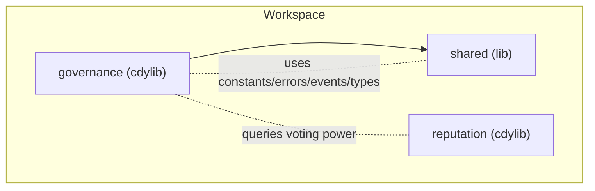
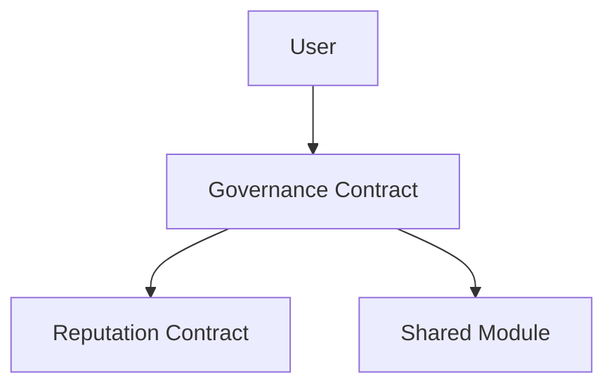
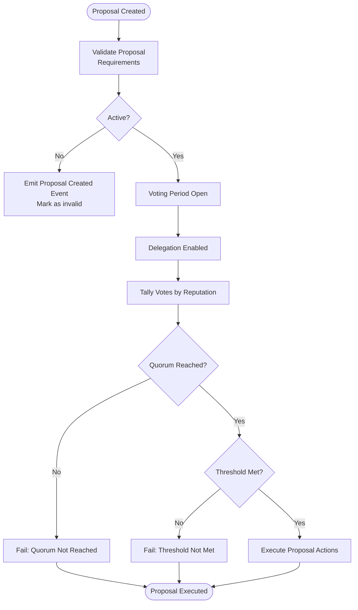
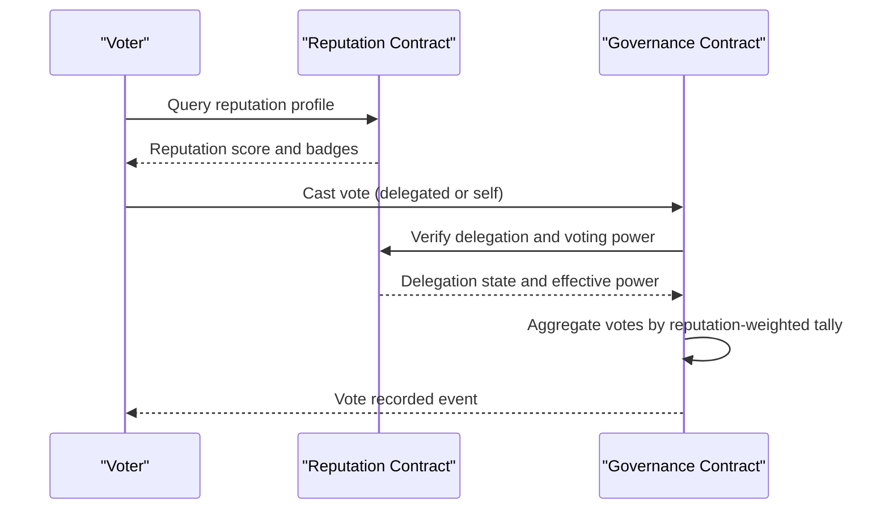
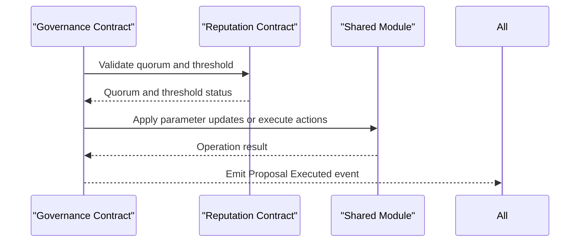
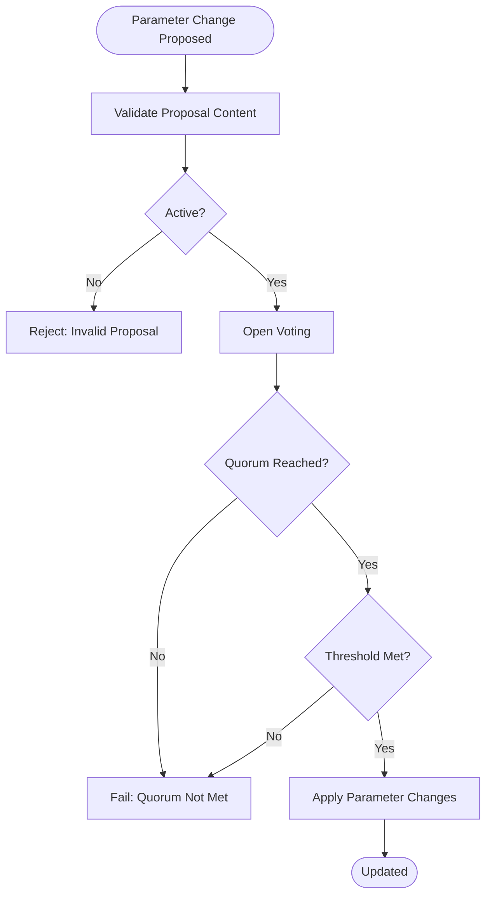
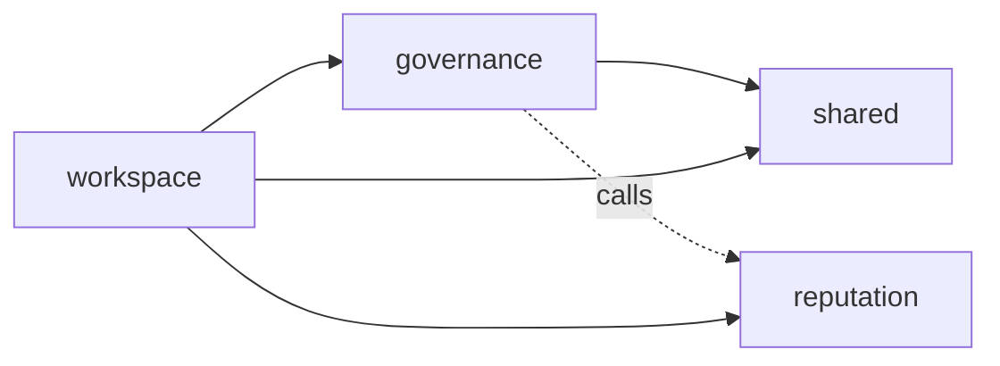

# Governance Contract

<cite>
**Referenced Files in This Document**
- [lib.rs](file://contracts/governance/src/lib.rs)
- [Cargo.toml](file://contracts/governance/Cargo.toml)
- [Cargo.toml](file://contracts/Cargo.toml)
- [lib.rs](file://contracts/reputation/src/lib.rs)
- [constants.rs](file://contracts/shared/src/constants.rs)
- [errors.rs](file://contracts/shared/src/errors.rs)
- [events.rs](file://contracts/shared/src/events.rs)
- [types.rs](file://contracts/shared/src/types.rs)
</cite>

## Table of Contents
1. [Introduction](#introduction)
2. [Project Structure](#project-structure)
3. [Core Components](#core-components)
4. [Architecture Overview](#architecture-overview)
5. [Detailed Component Analysis](#detailed-component-analysis)
6. [Dependency Analysis](#dependency-analysis)
7. [Performance Considerations](#performance-considerations)
8. [Troubleshooting Guide](#troubleshooting-guide)
9. [Conclusion](#conclusion)

## Introduction
This document describes the Governance contract that manages platform decision-making mechanisms and proposal execution systems. It explains proposal creation and validation, voting mechanics, quorum enforcement, decision execution workflows, and parameter update procedures. It also documents the storage architecture for proposals, voter participation, and executed decisions, and outlines configuration options such as voting thresholds, quorum, and voting periods. Finally, it details the relationship with the Reputation contract for determining voting rights and how Governance interacts with other contracts for parameter updates.

Note: The Governance contract library currently contains a placeholder implementation indicating future development. The remainder of this document therefore focuses on the configuration and integration points that will be used by the eventual implementation, and provides a blueprint for building the Governance contract on top of the existing shared modules and contracts.

## Project Structure
The Governance contract is part of a workspace containing multiple related contracts. The Governance crate depends on the shared module for constants, errors, events, and types. The Reputation contract provides voting power via reputation scores. The shared module centralizes cross-contract constants and error codes.

**Diagram sources**
- [Cargo.toml](file://contracts/governance/Cargo.toml#L1-L16)
- [Cargo.toml](file://contracts/Cargo.toml#L1-L38)
- [lib.rs](file://contracts/governance/src/lib.rs#L1-L9)
- [lib.rs](file://contracts/reputation/src/lib.rs#L1-L510)

**Section sources**
- [Cargo.toml](file://contracts/governance/Cargo.toml#L1-L16)
- [Cargo.toml](file://contracts/Cargo.toml#L1-L38)

## Core Components
- Governance contract (placeholder): Intended to manage proposal lifecycle, voting, quorum, and execution.
- Shared module: Provides constants (quorum, voting period, thresholds), error enums, event symbols, and common types.
- Reputation contract: Supplies voting power derived from reputation scores and badges.

Key configuration options (from shared constants):
- Quorum: 20%
- Voting period: 7 days
- Milestone approval threshold: 60%
- Minimum validators: 3
- Reputation bounds: min 0, max 10000, start 100

Events emitted by Governance (from shared events):
- Proposal created
- Vote cast
- Proposal executed

Errors used by Governance (from shared errors):
- Proposal not active
- Insufficient voting power
- Proposal already executed
- Quorum not reached

**Section sources**
- [lib.rs](file://contracts/governance/src/lib.rs#L1-L9)
- [constants.rs](file://contracts/shared/src/constants.rs#L1-L40)
- [errors.rs](file://contracts/shared/src/errors.rs#L48-L53)
- [events.rs](file://contracts/shared/src/events.rs#L22-L26)
- [lib.rs](file://contracts/reputation/src/lib.rs#L42-L51)

## Architecture Overview
The Governance contract will integrate with the Reputation contract to derive voting power and with the shared module for configuration and error handling. It will emit Governance-specific events and use shared error codes to signal outcomes.

**Diagram sources**
- [lib.rs](file://contracts/governance/src/lib.rs#L1-L9)
- [lib.rs](file://contracts/reputation/src/lib.rs#L1-L510)
- [constants.rs](file://contracts/shared/src/constants.rs#L1-L40)
- [errors.rs](file://contracts/shared/src/errors.rs#L48-L53)
- [events.rs](file://contracts/shared/src/events.rs#L22-L26)

## Detailed Component Analysis

### Proposal Lifecycle and Execution Workflows
The Governance contract will orchestrate the following lifecycle:
- Proposal creation and validation
- Voting window with delegation support
- Quorum and threshold checks
- Execution triggers and state transitions

[No sources needed since this diagram shows conceptual workflow, not actual code structure]

### Voting System Mechanics and Delegation
Voting power will be determined by the Reputation contract. Delegation allows voters to transfer their voting weight to another address during the voting period. The tally will aggregate votes by delegated reputation weights.

[No sources needed since this diagram shows conceptual workflow, not actual code structure]

### Decision Execution Triggers
Execution occurs after quorum and threshold checks. The Governance contract will trigger actions such as updating platform parameters, allocating funds, or modifying protocol rules. Events will be emitted upon successful execution.

[No sources needed since this diagram shows conceptual workflow, not actual code structure]

### Storage Architecture
Proposals, votes, and execution records will be stored persistently. The Governance contract will maintain:
- Proposal metadata (creator, content, creation timestamp, status)
- Vote records per voter (including delegation)
- Execution logs and outcomes

Storage keys will be organized under a namespace to prevent collisions. The contract will use the Soroban storage model with instance and persistent buckets.

[No sources needed since this section provides conceptual storage architecture]

### Parameter Update Procedures
Parameters such as quorum, voting period, and thresholds will be updated via Governance proposals. The process ensures that changes require sufficient support and are executed atomically.

[No sources needed since this diagram shows conceptual workflow, not actual code structure]

## Dependency Analysis
The Governance contract depends on the shared module for constants, errors, events, and types. It integrates with the Reputation contract to compute voting power. The workspace configuration ties all crates together.

**Diagram sources**
- [Cargo.toml](file://contracts/governance/Cargo.toml#L1-L16)
- [Cargo.toml](file://contracts/Cargo.toml#L1-L38)
- [lib.rs](file://contracts/governance/src/lib.rs#L1-L9)
- [lib.rs](file://contracts/reputation/src/lib.rs#L1-L510)

**Section sources**
- [Cargo.toml](file://contracts/governance/Cargo.toml#L1-L16)
- [Cargo.toml](file://contracts/Cargo.toml#L1-L38)

## Performance Considerations
- Minimize storage reads/writes by batching vote tallies and caching reputation queries.
- Use efficient data structures for vote aggregation and limit the number of delegated entries.
- Keep proposal metadata concise to reduce ledger footprint.
- Employ off-chain indexing for proposal and vote history to reduce on-chain lookups.

[No sources needed since this section provides general guidance]

## Troubleshooting Guide
Common issues and mitigations:
- Proposal spamming: Enforce proposal requirements and cooldowns before allowing new proposals from the same creator.
- Voting manipulation: Implement delegation verification and detect duplicate or conflicting votes.
- Execution failures: Validate preconditions before execution and revert state on failure; emit clear error events.

Relevant error codes for Governance:
- Proposal not active
- Insufficient voting power
- Proposal already executed
- Quorum not reached

**Section sources**
- [errors.rs](file://contracts/shared/src/errors.rs#L48-L53)

## Conclusion
The Governance contract will serve as the decision-making engine for the platform, leveraging Reputation-derived voting power and shared configuration constants. By enforcing quorum and threshold rules, emitting transparent events, and integrating with other contracts, it enables decentralized, accountable governance. The current placeholder indicates that the implementation is pending, but the shared module and Reputation contract provide the foundational pieces needed to build a robust governance system.