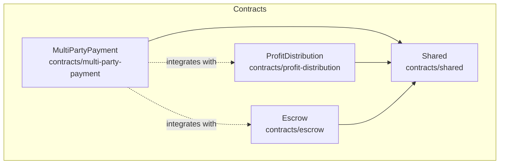
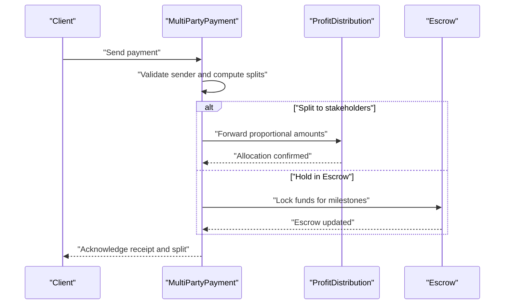
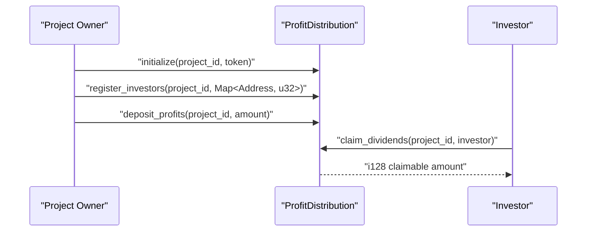
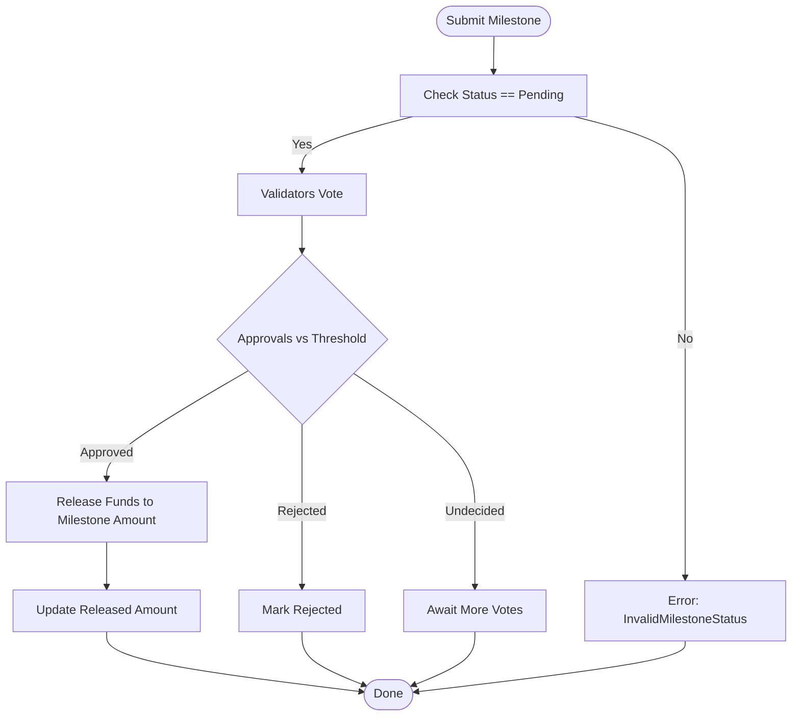
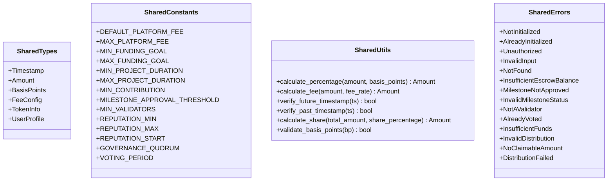
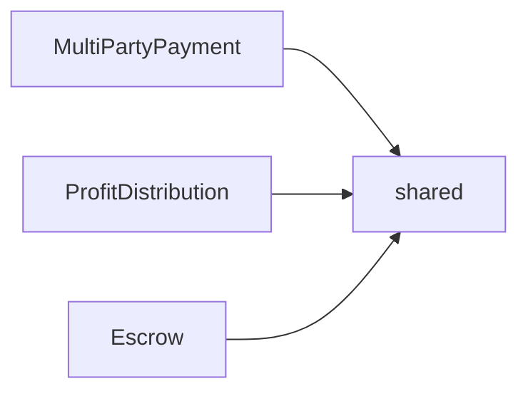

# Multi-Party Payment Contract

<cite>
**Referenced Files in This Document**
- [lib.rs](file://contracts/multi-party-payment/src/lib.rs)
- [Cargo.toml](file://contracts/multi-party-payment/Cargo.toml)
- [lib.rs](file://contracts/profit-distribution/src/lib.rs)
- [storage.rs](file://contracts/profit-distribution/src/storage.rs)
- [types.rs](file://contracts/profit-distribution/src/types.rs)
- [events.rs](file://contracts/profit-distribution/src/events.rs)
- [errors.rs](file://contracts/profit-distribution/src/errors.rs)
- [Cargo.toml](file://contracts/profit-distribution/Cargo.toml)
- [lib.rs](file://contracts/escrow/src/lib.rs)
- [storage.rs](file://contracts/escrow/src/storage.rs)
- [validation.rs](file://contracts/escrow/src/validation.rs)
- [tests.rs](file://contracts/escrow/src/tests.rs)
- [Cargo.toml](file://contracts/escrow/Cargo.toml)
- [lib.rs](file://contracts/shared/src/lib.rs)
- [types.rs](file://contracts/shared/src/types.rs)
- [constants.rs](file://contracts/shared/src/constants.rs)
- [errors.rs](file://contracts/shared/src/errors.rs)
- [utils.rs](file://contracts/shared/src/utils.rs)
</cite>

## Table of Contents
1. [Introduction](#introduction)
2. [Project Structure](#project-structure)
3. [Core Components](#core-components)
4. [Architecture Overview](#architecture-overview)
5. [Detailed Component Analysis](#detailed-component-analysis)
6. [Dependency Analysis](#dependency-analysis)
7. [Performance Considerations](#performance-considerations)
8. [Troubleshooting Guide](#troubleshooting-guide)
9. [Conclusion](#conclusion)
10. [Appendices](#appendices)

## Introduction
This document explains the MultiPartyPayment contract’s role in managing multi-stakeholder payment splitting and optional vesting schedules. It also documents how it integrates with the ProfitDistribution contract for automated payouts and the Escrow contract for fund management. The guide covers stakeholder identification, payment splitting algorithms, scheduling mechanisms, vesting period calculations, storage architecture, configuration options, and dispute resolution. Examples are provided via concrete code snippet paths to help implementers build robust payment distribution systems.

## Project Structure
The NovaFund ecosystem organizes payment-related logic across three smart contracts:
- MultiPartyPayment: intended to handle multi-stakeholder payment splitting and optional vesting.
- ProfitDistribution: registers stakeholders, holds shares, and distributes profits proportionally.
- Escrow: manages milestone-based fund locking, approvals, and releases.

Shared modules define common types, constants, utilities, and error enums used across contracts.

**Diagram sources**
- [Cargo.toml](file://contracts/multi-party-payment/Cargo.toml#L1-L16)
- [Cargo.toml](file://contracts/profit-distribution/Cargo.toml#L1-L16)
- [Cargo.toml](file://contracts/escrow/Cargo.toml#L1-L16)
- [lib.rs](file://contracts/shared/src/lib.rs#L1-L20)

**Section sources**
- [Cargo.toml](file://contracts/multi-party-payment/Cargo.toml#L1-L16)
- [Cargo.toml](file://contracts/profit-distribution/Cargo.toml#L1-L16)
- [Cargo.toml](file://contracts/escrow/Cargo.toml#L1-L16)
- [lib.rs](file://contracts/shared/src/lib.rs#L1-L20)

## Core Components
- MultiPartyPayment (planned): intended to manage stakeholder shares, receive incoming payments, split them according to configured ratios, enable withdrawals, and optionally enforce vesting schedules.
- ProfitDistribution: registers investors/stakeholders with share percentages, accepts profit deposits, computes proportional distributions, and supports claiming dividends.
- Escrow: initializes escrow accounts, locks funds, creates milestones, collects validator votes, and releases funds upon approval thresholds.

Key shared elements:
- Types: Amount, Timestamp, BasisPoints, and contract-specific structs.
- Constants: Thresholds, limits, and fee configurations.
- Utilities: Percentage calculation helpers and validation routines.
- Errors: Unified error enums for cross-contract consistency.

**Section sources**
- [lib.rs](file://contracts/multi-party-payment/src/lib.rs#L1-L9)
- [lib.rs](file://contracts/profit-distribution/src/lib.rs#L1-L78)
- [lib.rs](file://contracts/escrow/src/lib.rs#L1-L367)
- [types.rs](file://contracts/shared/src/types.rs#L1-L41)
- [constants.rs](file://contracts/shared/src/constants.rs#L1-L40)
- [utils.rs](file://contracts/shared/src/utils.rs#L1-L59)
- [errors.rs](file://contracts/shared/src/errors.rs#L1-L54)

## Architecture Overview
The MultiPartyPayment contract coordinates with ProfitDistribution and Escrow to deliver a complete payment lifecycle:
- Stakeholder setup and share registration are modeled after ProfitDistribution’s investor share model.
- Payments received by MultiPartyPayment are split and forwarded to stakeholders or held in Escrow depending on configuration.
- Optional vesting schedules can be enforced by tracking release periods and calculating available amounts per stakeholder.
- Disputes around milestone deliverables are resolved via Escrow’s validator voting system.

**Diagram sources**
- [lib.rs](file://contracts/multi-party-payment/src/lib.rs#L1-L9)
- [lib.rs](file://contracts/profit-distribution/src/lib.rs#L1-L78)
- [lib.rs](file://contracts/escrow/src/lib.rs#L1-L367)

## Detailed Component Analysis

### MultiPartyPayment Contract (Planned Implementation)
Scope and responsibilities:
- Stakeholder identification: maintain a registry of stakeholders with share percentages.
- Payment splitting: allocate incoming payments proportionally to stakeholders.
- Optional vesting: track vesting schedules and compute releasable amounts over time.
- Withdrawal mechanism: allow stakeholders to claim their share.
- Integration hooks: coordinate with ProfitDistribution for investor-style distribution and with Escrow for milestone-based fund management.

Storage architecture (conceptual):
- Stakeholder registry keyed by project and stakeholder address.
- Share percentages and cumulative claims.
- Vesting schedules per stakeholder with start/end timestamps and release tranches.

Processing logic (conceptual):
- On payment receipt, validate inputs and compute shares.
- Apply vesting rules to determine immediate vs. future-releasable amounts.
- Update storage and emit events for transparency.

Configuration options (conceptual):
- Split ratio per stakeholder (basis points).
- Vesting delay and cliff periods.
- Approval thresholds for disputes (leveraging Escrow constants).

Common issues and resolutions (conceptual):
- Unequal shares: ensure total shares equal 10,000 basis points.
- Payment delays: reconcile with Escrow milestone approvals.
- Disputes: escalate to Escrow validator voting.

**Section sources**
- [lib.rs](file://contracts/multi-party-payment/src/lib.rs#L1-L9)

### ProfitDistribution Contract
Purpose:
- Registers stakeholders with share percentages.
- Accepts profit deposits and distributes them proportionally.
- Enables investors to claim dividends.

Key APIs and behaviors:
- Initialization: prepares a project for profit distribution.
- Register investors: sets up share percentages per investor.
- Deposit profits: records funds available for distribution.
- Claim dividends: calculates and transfers claimable amounts.
- Get investor share: retrieves current share and claim status.

Storage model:
- Project token address.
- Per-investor share record (share percentage, claimable amount, total claimed).
- Total registered shares.

Events:
- ProfitDeposited emits when funds are accepted.
- DividendClaimed emits when an investor claims.

Errors:
- Initialization and share validation constraints.
- Insufficient balance and claim-related errors.

**Diagram sources**
- [lib.rs](file://contracts/profit-distribution/src/lib.rs#L35-L77)
- [storage.rs](file://contracts/profit-distribution/src/storage.rs#L8-L33)
- [types.rs](file://contracts/profit-distribution/src/types.rs#L3-L18)
- [events.rs](file://contracts/profit-distribution/src/events.rs#L3-L21)
- [errors.rs](file://contracts/profit-distribution/src/errors.rs#L3-L16)

**Section sources**
- [lib.rs](file://contracts/profit-distribution/src/lib.rs#L1-L78)
- [storage.rs](file://contracts/profit-distribution/src/storage.rs#L1-L33)
- [types.rs](file://contracts/profit-distribution/src/types.rs#L1-L18)
- [events.rs](file://contracts/profit-distribution/src/events.rs#L1-L21)
- [errors.rs](file://contracts/profit-distribution/src/errors.rs#L1-L16)

### Escrow Contract
Purpose:
- Manage milestone-based fund locking and release.
- Enforce validator voting thresholds for approvals.

Key APIs and behaviors:
- Initialize: create an escrow with validators and token.
- Deposit: lock funds into the escrow.
- Create milestone: define deliverables and requested amounts.
- Submit milestone: attach proof hash and reset votes.
- Vote milestone: validators approve or reject with thresholds.
- Release funds: update released totals upon approval.
- Query balances: available balance computation.

Storage model:
- EscrowInfo: project metadata, creator, token, totals.
- Milestone entries with status, approvals, and proof hashes.
- Validator vote tracking and counters.

Constants and thresholds:
- MILESTONE_APPROVAL_THRESHOLD and MIN_VALIDATORS govern approvals.

**Diagram sources**
- [lib.rs](file://contracts/escrow/src/lib.rs#L220-L307)
- [storage.rs](file://contracts/escrow/src/storage.rs#L127-L142)
- [constants.rs](file://contracts/shared/src/constants.rs#L24-L28)

**Section sources**
- [lib.rs](file://contracts/escrow/src/lib.rs#L1-L367)
- [storage.rs](file://contracts/escrow/src/storage.rs#L1-L144)
- [validation.rs](file://contracts/escrow/src/validation.rs)
- [tests.rs](file://contracts/escrow/src/tests.rs)
- [constants.rs](file://contracts/shared/src/constants.rs#L1-L40)

### Shared Types, Constants, Utilities, and Errors
- Types: Amount, Timestamp, BasisPoints, and shared structs.
- Constants: Platform fees, thresholds, minimums, and durations.
- Utilities: Percentage and fee calculators, timestamp checks, share computations.
- Errors: Unified enums for general, project, escrow, distribution, and other domain errors.

**Diagram sources**
- [types.rs](file://contracts/shared/src/types.rs#L1-L41)
- [constants.rs](file://contracts/shared/src/constants.rs#L1-L40)
- [utils.rs](file://contracts/shared/src/utils.rs#L1-L59)
- [errors.rs](file://contracts/shared/src/errors.rs#L1-L54)

**Section sources**
- [types.rs](file://contracts/shared/src/types.rs#L1-L41)
- [constants.rs](file://contracts/shared/src/constants.rs#L1-L40)
- [utils.rs](file://contracts/shared/src/utils.rs#L1-L59)
- [errors.rs](file://contracts/shared/src/errors.rs#L1-L54)

## Dependency Analysis
- MultiPartyPayment depends on shared types and utilities for consistent calculations and error handling.
- ProfitDistribution depends on shared types for investor share modeling and on shared errors for consistent failure modes.
- Escrow depends on shared types for milestone and escrow data structures and on shared constants for thresholds.

**Diagram sources**
- [Cargo.toml](file://contracts/multi-party-payment/Cargo.toml#L7-L9)
- [Cargo.toml](file://contracts/profit-distribution/Cargo.toml#L7-L9)
- [Cargo.toml](file://contracts/escrow/Cargo.toml#L7-L9)

**Section sources**
- [Cargo.toml](file://contracts/multi-party-payment/Cargo.toml#L1-L16)
- [Cargo.toml](file://contracts/profit-distribution/Cargo.toml#L1-L16)
- [Cargo.toml](file://contracts/escrow/Cargo.toml#L1-L16)

## Performance Considerations
- Percentage calculations: Use i128 arithmetic to prevent overflow and precision loss during proportional splits.
- Storage reads/writes: Batch updates and minimize repeated reads by caching frequently accessed values (e.g., total shares).
- Threshold checks: Validate inputs early to fail fast and reduce unnecessary computations.
- Event emission: Keep events lightweight and deterministic to support off-chain indexing.

[No sources needed since this section provides general guidance]

## Troubleshooting Guide
Common issues and resolutions:
- Unequal stakeholder shares: Ensure total shares equal 10,000 basis points; otherwise, distribution logic may fail.
- Payment delays: Verify milestone statuses and validator thresholds; Escrow requires majority approval to release funds.
- Dispute resolution: Escrow’s validator voting determines approval or rejection; confirm validators’ eligibility and voting outcomes.
- Insufficient funds: Confirm available balance in Escrow and ProfitDistribution before attempting distributions.

**Section sources**
- [errors.rs](file://contracts/shared/src/errors.rs#L21-L32)
- [lib.rs](file://contracts/escrow/src/lib.rs#L266-L307)
- [errors.rs](file://contracts/profit-distribution/src/errors.rs#L9-L16)

## Conclusion
The MultiPartyPayment contract is designed to orchestrate multi-stakeholder payment splitting and optional vesting, integrating with ProfitDistribution for proportional payouts and with Escrow for milestone-based fund management. By leveraging shared types, constants, utilities, and error enums, the system ensures consistent, transparent, and secure payment flows. Implementers should focus on stakeholder share validation, proportional allocation, vesting schedule enforcement, and dispute resolution via Escrow’s validator framework.

[No sources needed since this section summarizes without analyzing specific files]

## Appendices

### Configuration Options Reference
- Payment splitting ratios: basis points per stakeholder; total must equal 10,000.
- Vesting terms: start timestamp, cliff delay, and release tranches.
- Approval workflows: milestone approval threshold and minimum validators.

**Section sources**
- [constants.rs](file://contracts/shared/src/constants.rs#L24-L28)
- [utils.rs](file://contracts/shared/src/utils.rs#L6-L28)

### Example Code Snippet Paths
- MultiPartyPayment placeholder: [lib.rs](file://contracts/multi-party-payment/src/lib.rs#L1-L9)
- ProfitDistribution initialize/register/deposit/claim: [lib.rs](file://contracts/profit-distribution/src/lib.rs#L35-L77)
- ProfitDistribution storage keys and getters/setters: [storage.rs](file://contracts/profit-distribution/src/storage.rs#L8-L33)
- ProfitDistribution investor share model: [types.rs](file://contracts/profit-distribution/src/types.rs#L5-L10)
- ProfitDistribution events: [events.rs](file://contracts/profit-distribution/src/events.rs#L3-L21)
- ProfitDistribution errors: [errors.rs](file://contracts/profit-distribution/src/errors.rs#L6-L16)
- Escrow initialize/deposit/create_milestone/vote_milestone: [lib.rs](file://contracts/escrow/src/lib.rs#L31-L307)
- Escrow storage helpers: [storage.rs](file://contracts/escrow/src/storage.rs#L12-L142)
- Shared percentage and fee utilities: [utils.rs](file://contracts/shared/src/utils.rs#L6-L28)
- Shared constants for thresholds: [constants.rs](file://contracts/shared/src/constants.rs#L24-L28)