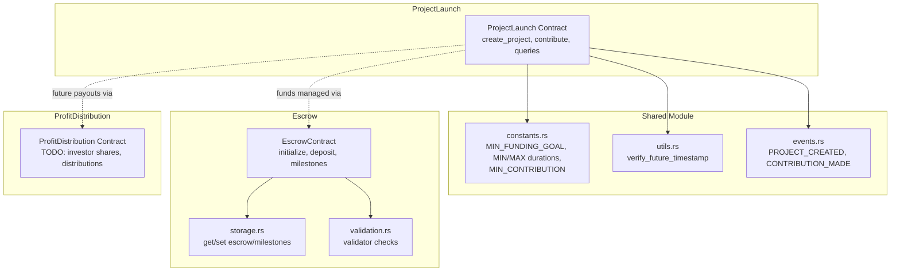
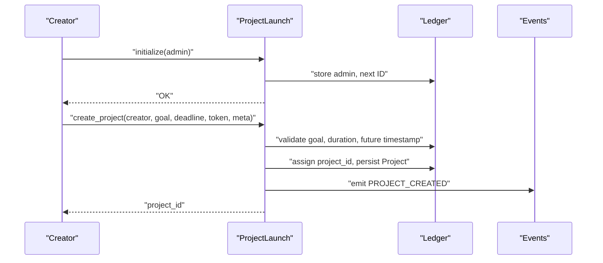
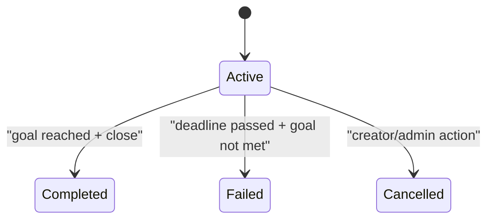
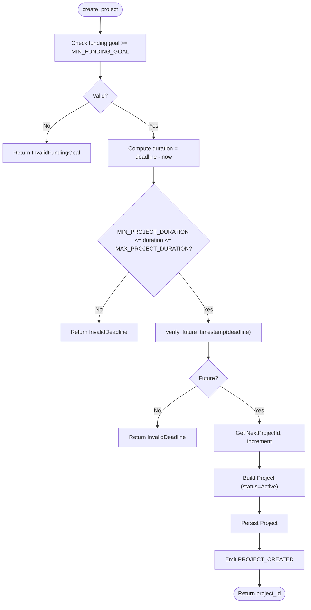
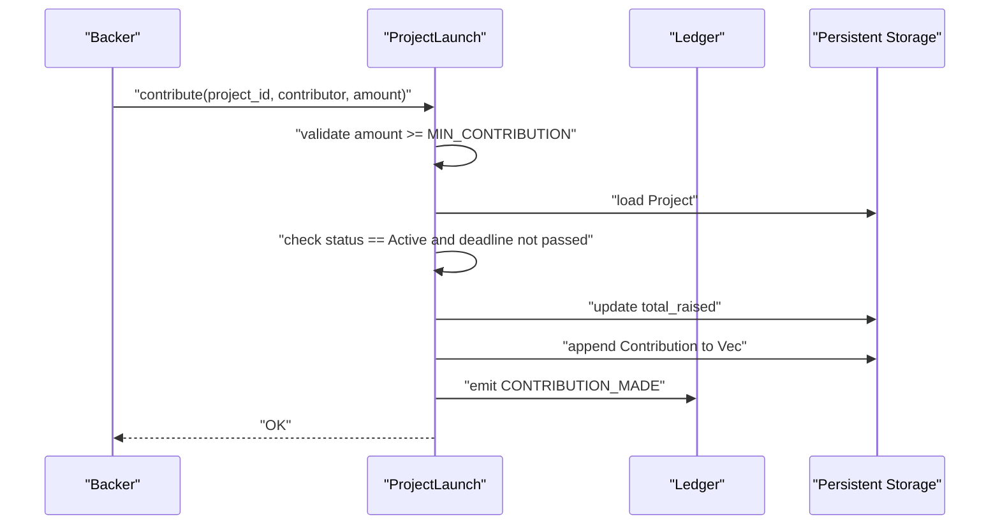
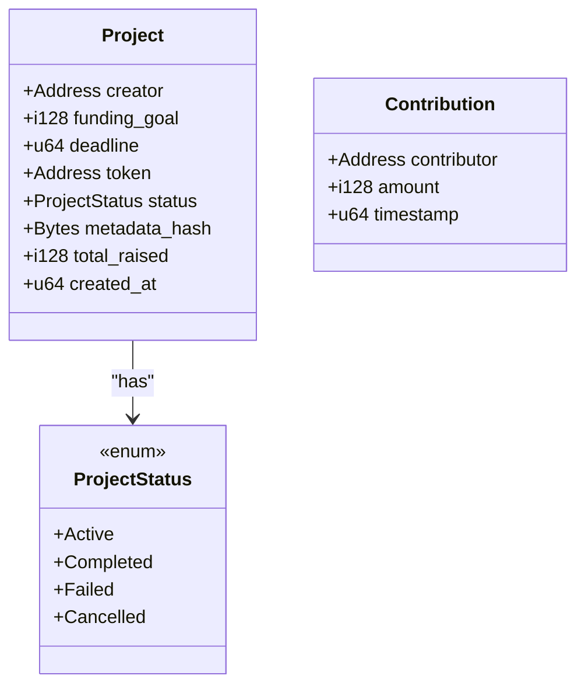
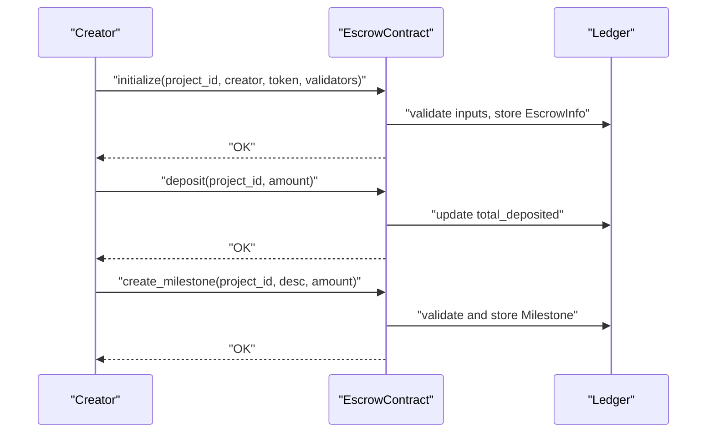
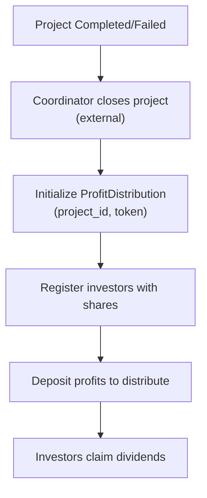
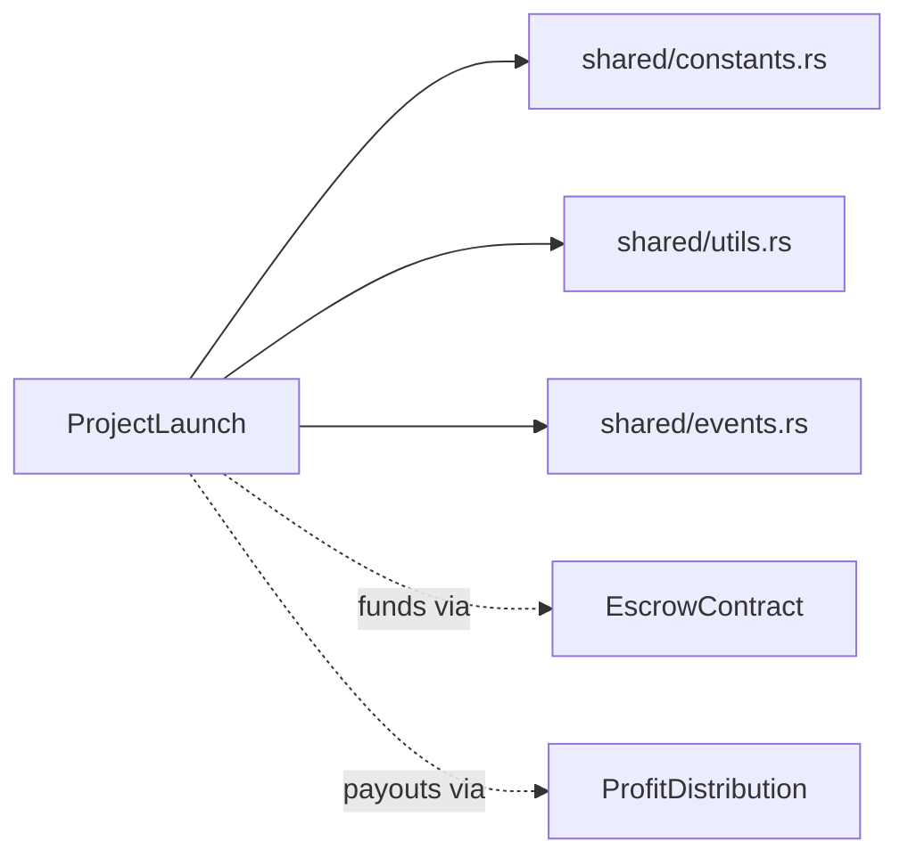

# Project Launch Contract

<cite>
**Referenced Files in This Document**
- [lib.rs](file://contracts/project-launch/src/lib.rs)
- [constants.rs](file://contracts/shared/src/constants.rs)
- [utils.rs](file://contracts/shared/src/utils.rs)
- [events.rs](file://contracts/shared/src/events.rs)
- [Cargo.toml](file://contracts/project-launch/Cargo.toml)
- [lib.rs](file://contracts/escrow/src/lib.rs)
- [storage.rs](file://contracts/escrow/src/storage.rs)
- [validation.rs](file://contracts/escrow/src/validation.rs)
- [lib.rs](file://contracts/profit-distribution/src/lib.rs)
- [errors.rs](file://contracts/shared/src/errors.rs)
</cite>

## Table of Contents
1. [Introduction](#introduction)
2. [Project Structure](#project-structure)
3. [Core Components](#core-components)
4. [Architecture Overview](#architecture-overview)
5. [Detailed Component Analysis](#detailed-component-analysis)
6. [Dependency Analysis](#dependency-analysis)
7. [Performance Considerations](#performance-considerations)
8. [Troubleshooting Guide](#troubleshooting-guide)
9. [Conclusion](#conclusion)

## Introduction
ProjectLaunch is the core funding mechanism for NovaFund. It enables creators to launch funding projects with configurable goals and deadlines, manages contributions from backers, tracks contributor history, validates funding goal and deadline constraints, emits lifecycle events, and enforces deadline-based participation windows. While ProjectLaunch itself does not automatically close projects or distribute funds, it integrates with the Escrow contract for fund custody and the ProfitDistribution contract for investor payouts. This document explains the contract’s roles, state model, validations, and integration points, and provides practical guidance for building similar funding systems.

## Project Structure
ProjectLaunch is implemented as a Soroban contract library with tight integration to the shared module for constants, types, utilities, and events. It depends on the shared module for cross-contract constants and utilities, and interacts with the Escrow contract for fund management and the ProfitDistribution contract for profit distribution.

**Diagram sources**
- [lib.rs](file://contracts/project-launch/src/lib.rs#L1-L363)
- [constants.rs](file://contracts/shared/src/constants.rs#L1-L40)
- [utils.rs](file://contracts/shared/src/utils.rs#L1-L59)
- [events.rs](file://contracts/shared/src/events.rs#L1-L31)
- [lib.rs](file://contracts/escrow/src/lib.rs#L1-L367)
- [storage.rs](file://contracts/escrow/src/storage.rs#L1-L144)
- [validation.rs](file://contracts/escrow/src/validation.rs#L1-L13)
- [lib.rs](file://contracts/profit-distribution/src/lib.rs#L1-L78)

**Section sources**
- [Cargo.toml](file://contracts/project-launch/Cargo.toml#L1-L26)
- [lib.rs](file://contracts/project-launch/src/lib.rs#L1-L363)
- [constants.rs](file://contracts/shared/src/constants.rs#L1-L40)
- [utils.rs](file://contracts/shared/src/utils.rs#L1-L59)
- [events.rs](file://contracts/shared/src/events.rs#L1-L31)

## Core Components
- Project lifecycle and state model
  - Statuses: Active, Completed, Failed, Cancelled.
  - Projects are created Active and remain so until closed by external logic.
- Funding campaign management
  - Funding goal and deadline enforced at creation time.
  - Contributions validated against minimum contribution and project activity/deadline.
- Contributor tracking
  - Persistent per-project list of contributions with contributor, amount, and timestamp.
- Event emission
  - Emits project creation and contribution events for off-chain indexing and UI updates.
- Configuration options
  - Funding goal bounds, minimum/maximum campaign duration, and minimum contribution amount are governed by shared constants.

**Section sources**
- [lib.rs](file://contracts/project-launch/src/lib.rs#L14-L56)
- [constants.rs](file://contracts/shared/src/constants.rs#L9-L22)
- [events.rs](file://contracts/shared/src/events.rs#L4-L11)

## Architecture Overview
ProjectLaunch orchestrates the funding lifecycle:
- Initialization sets the admin and next project ID.
- Project creation validates funding goal and deadline, assigns an ID, and stores the project.
- Contributions update raised totals and append contribution records.
- Queries expose project details and contribution lists.
- Integration points:
  - Escrow contract holds funds and manages milestone releases.
  - ProfitDistribution contract handles investor share and dividend mechanics (planned).

**Diagram sources**
- [lib.rs](file://contracts/project-launch/src/lib.rs#L74-L149)
- [constants.rs](file://contracts/shared/src/constants.rs#L9-L22)
- [utils.rs](file://contracts/shared/src/utils.rs#L15-L18)
- [events.rs](file://contracts/shared/src/events.rs#L4-L5)

## Detailed Component Analysis

### Project Lifecycle States
ProjectLaunch defines a simple four-state lifecycle:
- Active: Accepting contributions.
- Completed: Typically set by external logic after reaching goal and closing.
- Failed: Typically set by external logic when goal not reached.
- Cancelled: Typically set by creator/admin.

These statuses are modeled as an enum and stored with each project. External contracts (e.g., a coordinator) manage transitions and may trigger Escrow actions accordingly.

**Diagram sources**
- [lib.rs](file://contracts/project-launch/src/lib.rs#L18-L23)

**Section sources**
- [lib.rs](file://contracts/project-launch/src/lib.rs#L18-L23)

### Project Creation Workflow
Project creation validates inputs and initializes a new project:
- Funding goal must meet minimum threshold.
- Duration must be within configured min/max bounds.
- Deadline must be in the future.
- Assigns a monotonically increasing project ID and persists the project.
- Emits a project creation event.

**Diagram sources**
- [lib.rs](file://contracts/project-launch/src/lib.rs#L87-L149)
- [constants.rs](file://contracts/shared/src/constants.rs#L15-L19)
- [utils.rs](file://contracts/shared/src/utils.rs#L15-L18)
- [events.rs](file://contracts/shared/src/events.rs#L4-L5)

**Section sources**
- [lib.rs](file://contracts/project-launch/src/lib.rs#L87-L149)
- [constants.rs](file://contracts/shared/src/constants.rs#L9-L22)
- [utils.rs](file://contracts/shared/src/utils.rs#L15-L18)
- [events.rs](file://contracts/shared/src/events.rs#L4-L5)

### Contribution Processing
Contributions are processed with strict validation:
- Amount must meet minimum contribution threshold.
- Project must exist and be Active.
- Deadline must not have passed.
- Updates total raised and appends a contribution record.
- Emits a contribution event.

**Diagram sources**
- [lib.rs](file://contracts/project-launch/src/lib.rs#L151-L212)
- [constants.rs](file://contracts/shared/src/constants.rs#L21-L22)
- [events.rs](file://contracts/shared/src/events.rs#L9-L11)

**Section sources**
- [lib.rs](file://contracts/project-launch/src/lib.rs#L151-L212)
- [constants.rs](file://contracts/shared/src/constants.rs#L21-L22)
- [events.rs](file://contracts/shared/src/events.rs#L9-L11)

### Data Model and Keys
ProjectLaunch uses a compact data model with two primary structures:
- Project: creator, funding goal, deadline, token, status, metadata hash, total raised, created timestamp.
- Contribution: contributor, amount, timestamp.

Storage keys:
- Instance storage keys for admin and next project ID.
- Persistent storage keyed by project ID for contributions.

**Diagram sources**
- [lib.rs](file://contracts/project-launch/src/lib.rs#L25-L56)

**Section sources**
- [lib.rs](file://contracts/project-launch/src/lib.rs#L25-L56)

### Integration with Escrow
ProjectLaunch does not directly hold funds. Instead, it integrates with the Escrow contract for fund custody and milestone-based releases:
- Escrow initialization ties a project to an escrow with validators.
- Funds are deposited into the escrow and released upon milestone approval.
- Validators approve or reject milestones based on thresholds.

**Diagram sources**
- [lib.rs](file://contracts/escrow/src/lib.rs#L31-L103)
- [lib.rs](file://contracts/escrow/src/lib.rs#L111-L167)
- [storage.rs](file://contracts/escrow/src/storage.rs#L11-L32)

**Section sources**
- [lib.rs](file://contracts/escrow/src/lib.rs#L31-L103)
- [lib.rs](file://contracts/escrow/src/lib.rs#L111-L167)
- [storage.rs](file://contracts/escrow/src/storage.rs#L11-L32)

### Integration with ProfitDistribution
ProfitDistribution is currently a placeholder contract. Planned functionality includes:
- Registering investors and their share percentages.
- Depositing profits for distribution.
- Automatic proportional distribution.
- Dividend claiming.

ProjectLaunch can coordinate with ProfitDistribution by invoking it after a project reaches its goal and is closed, passing investor share data and distributing proceeds according to registered allocations.

**Diagram sources**
- [lib.rs](file://contracts/profit-distribution/src/lib.rs#L36-L77)

**Section sources**
- [lib.rs](file://contracts/profit-distribution/src/lib.rs#L36-L77)

## Dependency Analysis
ProjectLaunch depends on the shared module for constants, utilities, and events. The Escrow contract provides fund management and milestone governance. ProfitDistribution is designed as a future extension for investor payouts.

**Diagram sources**
- [Cargo.toml](file://contracts/project-launch/Cargo.toml#L7-L9)
- [lib.rs](file://contracts/project-launch/src/lib.rs#L1-L12)
- [constants.rs](file://contracts/shared/src/constants.rs#L1-L40)
- [utils.rs](file://contracts/shared/src/utils.rs#L1-L59)
- [events.rs](file://contracts/shared/src/events.rs#L1-L31)
- [lib.rs](file://contracts/escrow/src/lib.rs#L1-L367)
- [lib.rs](file://contracts/profit-distribution/src/lib.rs#L1-L78)

**Section sources**
- [Cargo.toml](file://contracts/project-launch/Cargo.toml#L7-L9)
- [lib.rs](file://contracts/project-launch/src/lib.rs#L1-L12)

## Performance Considerations
- Storage patterns
  - Project data is stored in instance storage; contributions are stored as persistent vectors keyed by project ID. This keeps project metadata compact while allowing scalable contribution histories.
- Gas efficiency
  - Validation checks occur early to fail fast and reduce unnecessary ledger writes.
  - Persistent vector appends are amortized; consider batching contributions off-chain if needed.
- Event emission
  - Events are emitted for indexing and UI updates; keep payload minimal to reduce costs.

[No sources needed since this section provides general guidance]

## Troubleshooting Guide
Common issues and resolutions:
- Invalid funding goal
  - Symptom: Project creation fails with invalid funding goal.
  - Cause: Goal below minimum threshold.
  - Resolution: Ensure goal meets the minimum configured value.
  - Section sources
    - [lib.rs](file://contracts/project-launch/src/lib.rs#L96-L99)
    - [constants.rs](file://contracts/shared/src/constants.rs#L9-L10)
- Invalid deadline
  - Symptom: Project creation fails with invalid deadline.
  - Causes: Duration outside min/max range or deadline in the past.
  - Resolution: Set deadline within allowed bounds and in the future.
  - Section sources
    - [lib.rs](file://contracts/project-launch/src/lib.rs#L101-L111)
    - [constants.rs](file://contracts/shared/src/constants.rs#L15-L19)
    - [utils.rs](file://contracts/shared/src/utils.rs#L15-L18)
- Contribution too low
  - Symptom: Contribution rejected.
  - Cause: Amount below minimum contribution.
  - Resolution: Increase contribution to meet minimum.
  - Section sources
    - [lib.rs](file://contracts/project-launch/src/lib.rs#L158-L161)
    - [constants.rs](file://contracts/shared/src/constants.rs#L21-L22)
- Project not active or deadline passed
  - Symptom: Contribution fails after deadline or on inactive project.
  - Cause: Project status changed or deadline exceeded.
  - Resolution: Ensure contributions occur while project is Active and before deadline.
  - Section sources
    - [lib.rs](file://contracts/project-launch/src/lib.rs#L170-L178)
- Project not found
  - Symptom: Queries or contributions fail with not found.
  - Cause: Invalid project ID or missing storage.
  - Resolution: Verify project ID and existence.
  - Section sources
    - [lib.rs](file://contracts/project-launch/src/lib.rs#L164-L168)
    - [lib.rs](file://contracts/project-launch/src/lib.rs#L214-L229)

## Conclusion
ProjectLaunch provides a robust foundation for project-based crowdfunding on Soroban. It enforces funding goals and deadlines, tracks contributors, and emits lifecycle events. By integrating with the Escrow contract for fund custody and milestone governance, and with the planned ProfitDistribution contract for investor payouts, it supports a complete funding ecosystem. Developers can rely on its clear state model, strict validations, and modular design to build secure and transparent funding mechanisms.