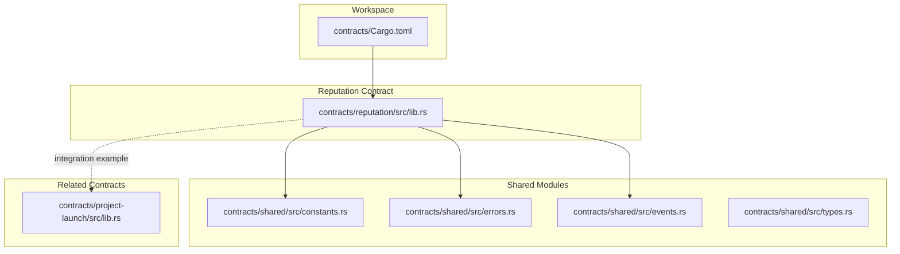
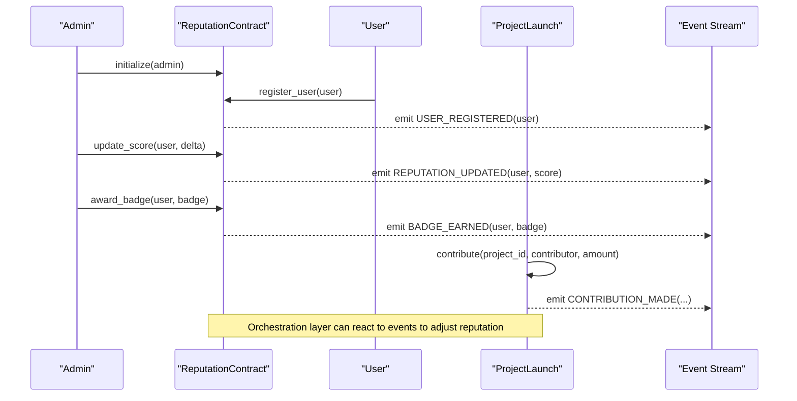
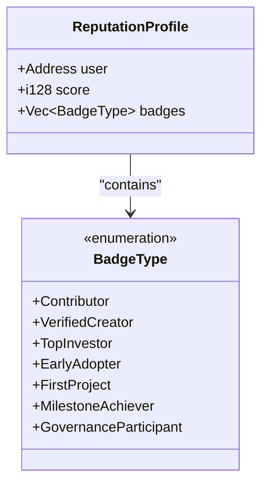
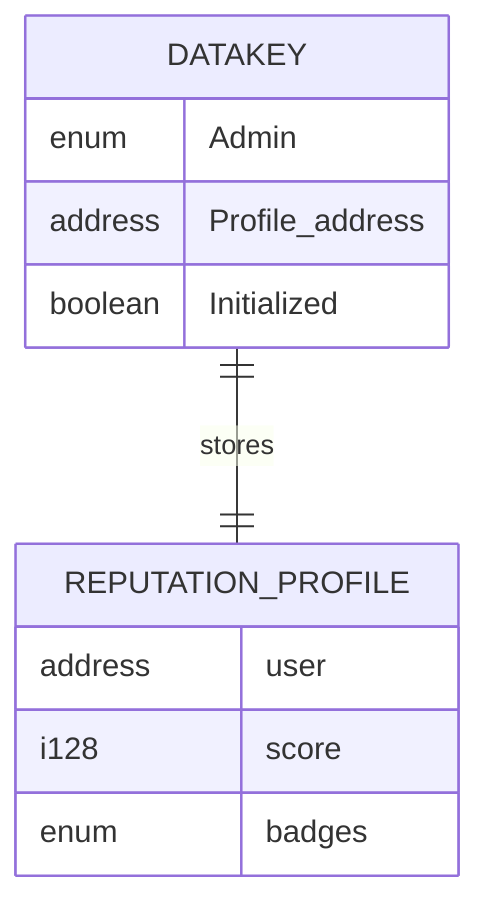
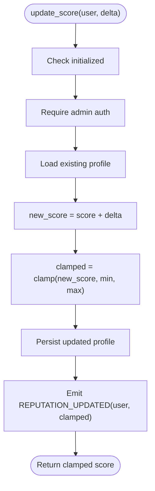
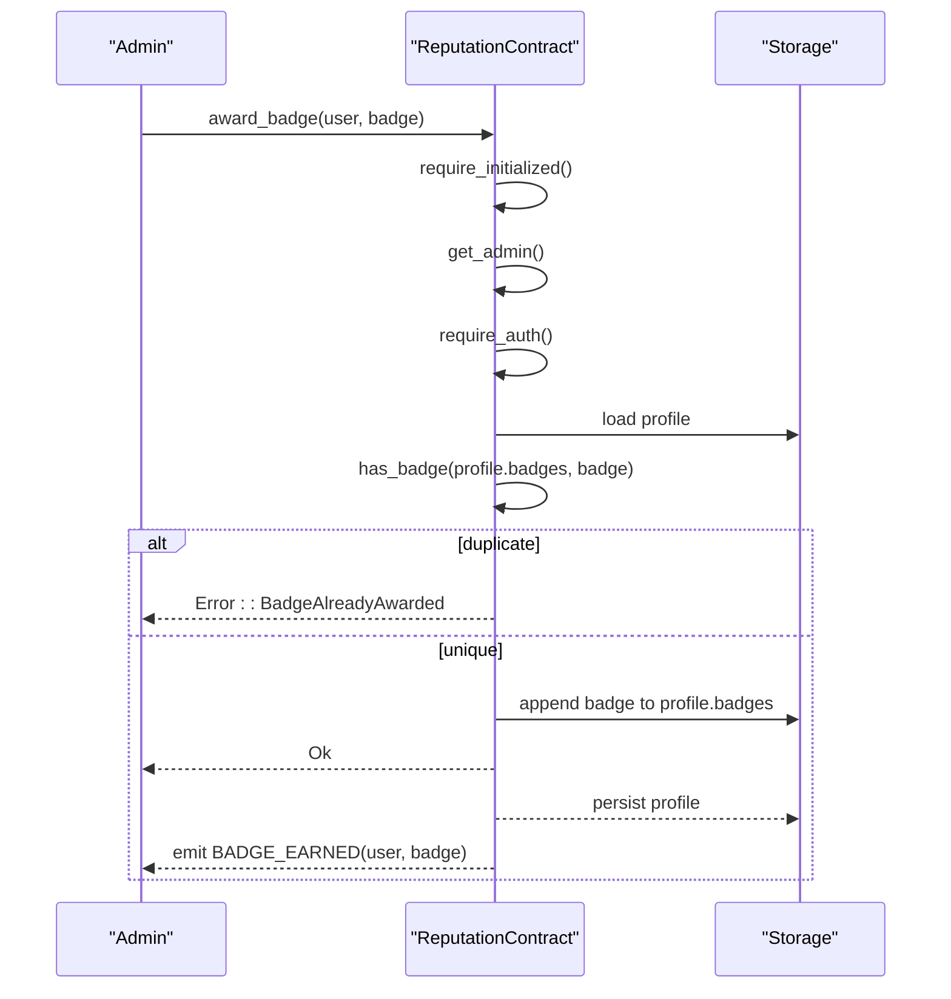
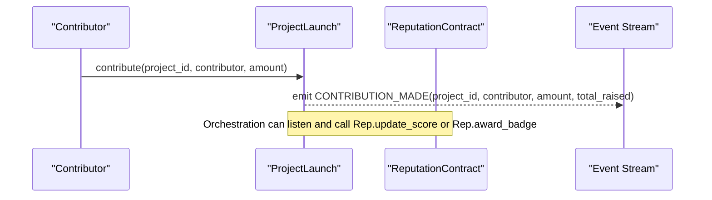
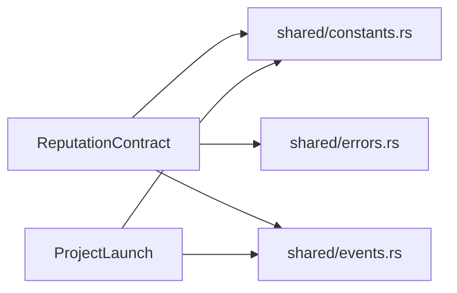

# Reputation Contract

<cite>
**Referenced Files in This Document**
- [lib.rs](file://contracts/reputation/src/lib.rs)
- [constants.rs](file://contracts/shared/src/constants.rs)
- [errors.rs](file://contracts/shared/src/errors.rs)
- [events.rs](file://contracts/shared/src/events.rs)
- [types.rs](file://contracts/shared/src/types.rs)
- [lib.rs](file://contracts/project-launch/src/lib.rs)
- [Cargo.toml](file://contracts/Cargo.toml)
- [README.md](file://README.md)
</cite>

## Table of Contents
1. [Introduction](#introduction)
2. [Project Structure](#project-structure)
3. [Core Components](#core-components)
4. [Architecture Overview](#architecture-overview)
5. [Detailed Component Analysis](#detailed-component-analysis)
6. [Dependency Analysis](#dependency-analysis)
7. [Performance Considerations](#performance-considerations)
8. [Troubleshooting Guide](#troubleshooting-guide)
9. [Conclusion](#conclusion)
10. [Appendices](#appendices)

## Introduction
The Reputation contract manages a trust scoring system and community governance participation for the NovaFund platform. It tracks user reputation scores, awards badges for notable achievements, and emits events for downstream consumers. The contract integrates with shared constants, errors, and events to provide a consistent interface across the ecosystem.

Key capabilities:
- User registration with a default reputation score
- Admin-controlled reputation score adjustments with clamping
- Badge issuance for achievements
- Profile retrieval and administrative oversight
- Event emission for user registration, reputation updates, and badge awards

## Project Structure
The reputation system is implemented as a standalone contract within the NovaFund workspace. It relies on shared modules for constants, errors, and events.

**Diagram sources**
- [Cargo.toml](file://contracts/Cargo.toml#L1-L38)
- [lib.rs](file://contracts/reputation/src/lib.rs#L1-L510)
- [constants.rs](file://contracts/shared/src/constants.rs#L1-L40)
- [errors.rs](file://contracts/shared/src/errors.rs#L1-L54)
- [events.rs](file://contracts/shared/src/events.rs#L1-L31)
- [types.rs](file://contracts/shared/src/types.rs#L1-L41)
- [lib.rs](file://contracts/project-launch/src/lib.rs#L1-L363)

**Section sources**
- [Cargo.toml](file://contracts/Cargo.toml#L1-L38)
- [README.md](file://README.md#L140-L166)

## Core Components
- ReputationProfile: Stores user address, reputation score, and badges.
- BadgeType: Enumerates achievement categories (contributor, verified creator, top investor, early adopter, first project, milestone achiever, governance participant).
- DataKey: Defines storage keys for admin, user profiles, and initialization flag.
- Public functions:
  - initialize: Sets admin and marks contract initialized.
  - register_user: Creates a new profile with default score and requires user auth.
  - update_score: Adjusts score (admin-only) with clamping to configured bounds.
  - award_badge: Grants a badge (admin-only) with duplicate prevention.
  - get_profile: Retrieves a user’s profile.
  - get_admin: Returns the admin address.

**Section sources**
- [lib.rs](file://contracts/reputation/src/lib.rs#L8-L510)
- [constants.rs](file://contracts/shared/src/constants.rs#L30-L39)

## Architecture Overview
The Reputation contract operates independently but integrates with other contracts through events and shared constants. The project launch contract emits contribution events that can trigger reputation updates in a higher-level orchestration layer.

**Diagram sources**
- [lib.rs](file://contracts/reputation/src/lib.rs#L56-L251)
- [events.rs](file://contracts/shared/src/events.rs#L27-L31)
- [lib.rs](file://contracts/project-launch/src/lib.rs#L151-L212)

## Detailed Component Analysis

### ReputationProfile and Badge Types
- ReputationProfile encapsulates user identity, reputation score, and earned badges.
- BadgeType enumerates achievement categories aligned with platform activities:
  - Contributor: Contributions to projects
  - VerifiedCreator: Verified creators
  - TopInvestor: Top investors by volume
  - EarlyAdopter: Early platform adoption
  - FirstProject: Completing first project
  - MilestoneAchiever: Successful milestone completion
  - GovernanceParticipant: Governance participation

**Diagram sources**
- [lib.rs](file://contracts/reputation/src/lib.rs#L41-L51)
- [lib.rs](file://contracts/reputation/src/lib.rs#L20-L39)

**Section sources**
- [lib.rs](file://contracts/reputation/src/lib.rs#L41-L51)
- [lib.rs](file://contracts/reputation/src/lib.rs#L20-L39)

### Storage Keys and Data Model
- DataKey defines persistent storage keys:
  - Admin: stores admin address
  - Profile(Address): stores user profiles keyed by address
  - Initialized: boolean flag indicating contract readiness

**Diagram sources**
- [lib.rs](file://contracts/reputation/src/lib.rs#L8-L18)
- [lib.rs](file://contracts/reputation/src/lib.rs#L41-L51)

**Section sources**
- [lib.rs](file://contracts/reputation/src/lib.rs#L8-L18)
- [lib.rs](file://contracts/reputation/src/lib.rs#L41-L51)

### Reputation Calculation and Adjustment
- Score updates are admin-controlled and clamped to configured bounds.
- Clamping ensures scores remain within [REPUTATION_MIN, REPUTATION_MAX].
- Duplicate badge prevention prevents re-awarding the same badge.

**Diagram sources**
- [lib.rs](file://contracts/reputation/src/lib.rs#L121-L157)
- [constants.rs](file://contracts/shared/src/constants.rs#L30-L39)

**Section sources**
- [lib.rs](file://contracts/reputation/src/lib.rs#L121-L157)
- [constants.rs](file://contracts/shared/src/constants.rs#L30-L39)

### Badge Issuance Workflow
- Admin-only operation to award badges.
- Prevents duplicate badges by checking existing list.
- Emits BADGE_EARNED event with badge type identifier.

**Diagram sources**
- [lib.rs](file://contracts/reputation/src/lib.rs#L159-L196)
- [errors.rs](file://contracts/shared/src/errors.rs#L40-L46)

**Section sources**
- [lib.rs](file://contracts/reputation/src/lib.rs#L159-L196)
- [errors.rs](file://contracts/shared/src/errors.rs#L40-L46)

### Integration with Project Launch
- The project launch contract emits CONTRIBUTION_MADE events during contributions.
- The reputation system can be integrated by an orchestration layer to adjust scores or award badges based on these events.

**Diagram sources**
- [lib.rs](file://contracts/project-launch/src/lib.rs#L151-L212)
- [events.rs](file://contracts/shared/src/events.rs#L9-L11)

**Section sources**
- [lib.rs](file://contracts/project-launch/src/lib.rs#L151-L212)
- [events.rs](file://contracts/shared/src/events.rs#L9-L11)

## Dependency Analysis
- Reputation contract depends on shared constants for score bounds and start value.
- Uses shared errors for consistent error codes across contracts.
- Emits shared events for interoperability with frontend and off-chain services.
- Project launch contract emits contribution events that can drive reputation actions.

**Diagram sources**
- [lib.rs](file://contracts/reputation/src/lib.rs#L1-L6)
- [constants.rs](file://contracts/shared/src/constants.rs#L1-L40)
- [errors.rs](file://contracts/shared/src/errors.rs#L1-L54)
- [events.rs](file://contracts/shared/src/events.rs#L1-L31)
- [lib.rs](file://contracts/project-launch/src/lib.rs#L1-L12)

**Section sources**
- [lib.rs](file://contracts/reputation/src/lib.rs#L1-L6)
- [constants.rs](file://contracts/shared/src/constants.rs#L1-L40)
- [errors.rs](file://contracts/shared/src/errors.rs#L1-L54)
- [events.rs](file://contracts/shared/src/events.rs#L1-L31)
- [lib.rs](file://contracts/project-launch/src/lib.rs#L1-L12)

## Performance Considerations
- Storage reads/writes are O(1) for profile lookups and updates.
- Badge list operations are linear in badge count; keep badge counts reasonable.
- Clamping and arithmetic operations are constant-time.
- Event emission adds minimal overhead and enables efficient off-chain indexing.

[No sources needed since this section provides general guidance]

## Troubleshooting Guide
Common issues and resolutions:
- NotInitialized: Ensure initialize has been called by admin before any operations.
- AlreadyInitialized: Attempting to initialize twice will fail; check initialization state.
- Unauthorized: Admin-only functions require admin authorization; verify caller.
- UserAlreadyRegistered: Users can only register once; check existing profiles.
- BadgeAlreadyAwarded: Duplicate badge prevention; verify badge list before awarding.
- UserNotRegistered: Attempting to update score or award badges for unregistered users fails; register first.
- InvalidReputationScore: Scores are clamped; verify delta values and bounds.

**Section sources**
- [errors.rs](file://contracts/shared/src/errors.rs#L40-L53)
- [lib.rs](file://contracts/reputation/src/lib.rs#L66-L82)
- [lib.rs](file://contracts/reputation/src/lib.rs#L92-L120)
- [lib.rs](file://contracts/reputation/src/lib.rs#L131-L157)
- [lib.rs](file://contracts/reputation/src/lib.rs#L168-L196)
- [lib.rs](file://contracts/reputation/src/lib.rs#L206-L211)

## Conclusion
The Reputation contract provides a robust foundation for trust scoring and achievement recognition in the NovaFund ecosystem. Its admin-controlled design ensures governance oversight, while clamping and duplicate checks prevent manipulation. Integration with shared modules and events enables seamless coordination with other contracts and frontend services.

[No sources needed since this section summarizes without analyzing specific files]

## Appendices

### Configuration Options
- Reputation score ranges:
  - REPUTATION_MIN: Lower bound for scores
  - REPUTATION_MAX: Upper bound for scores
  - REPUTATION_START: Default score for new users
- Governance-related constants:
  - GOVERNANCE_QUORUM: Quorum threshold for proposals
  - VOTING_PERIOD: Duration of voting periods
  - MILESTONE_APPROVAL_THRESHOLD: Threshold for milestone approvals

**Section sources**
- [constants.rs](file://contracts/shared/src/constants.rs#L30-L39)

### Governance Participation and Voting Rights
- The governance contract is planned to handle proposal creation, voting, and execution.
- Voting power can be derived from reputation scores in an orchestration layer.
- Quorum and voting period constants are defined in shared constants.

**Section sources**
- [README.md](file://README.md#L140-L166)
- [constants.rs](file://contracts/shared/src/constants.rs#L24-L39)

### Creator Trust Metrics and Investor Reliability Scoring
- Creator trust metrics can leverage verified creator badges and project outcomes.
- Investor reliability can be inferred from contribution history and governance participation badges.
- These metrics inform premium access and reduced fees in higher-level orchestration logic.

**Section sources**
- [lib.rs](file://contracts/reputation/src/lib.rs#L24-L39)
- [types.rs](file://contracts/shared/src/types.rs#L30-L41)