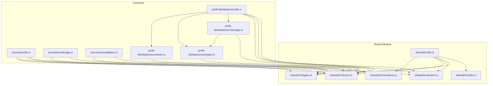
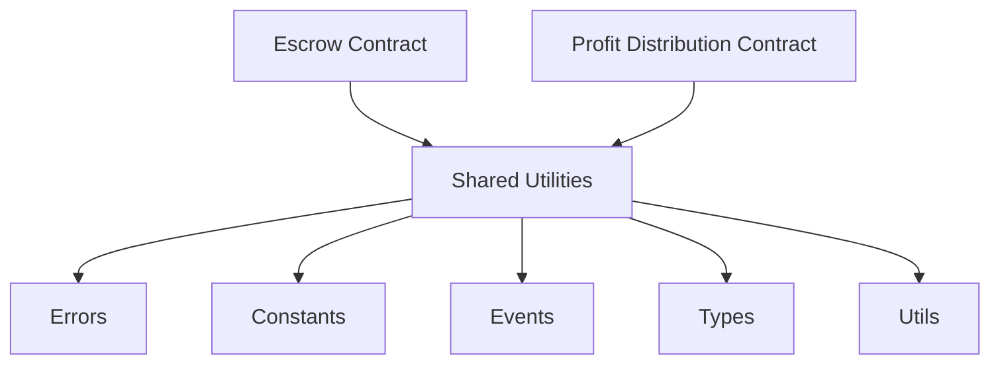

# Shared Utilities

<cite>
**Referenced Files in This Document**
- [lib.rs](file://contracts/shared/src/lib.rs)
- [constants.rs](file://contracts/shared/src/constants.rs)
- [errors.rs](file://contracts/shared/src/errors.rs)
- [events.rs](file://contracts/shared/src/events.rs)
- [types.rs](file://contracts/shared/src/types.rs)
- [utils.rs](file://contracts/shared/src/utils.rs)
- [escrow/lib.rs](file://contracts/escrow/src/lib.rs)
- [escrow/storage.rs](file://contracts/escrow/src/storage.rs)
- [escrow/validation.rs](file://contracts/escrow/src/validation.rs)
- [profit-distribution/lib.rs](file://contracts/profit-distribution/src/lib.rs)
- [profit-distribution/events.rs](file://contracts/profit-distribution/src/events.rs)
- [profit-distribution/types.rs](file://contracts/profit-distribution/src/types.rs)
- [profit-distribution/storage.rs](file://contracts/profit-distribution/src/storage.rs)
</cite>

## Table of Contents
1. [Introduction](#introduction)
2. [Project Structure](#project-structure)
3. [Core Components](#core-components)
4. [Architecture Overview](#architecture-overview)
5. [Detailed Component Analysis](#detailed-component-analysis)
6. [Dependency Analysis](#dependency-analysis)
7. [Performance Considerations](#performance-considerations)
8. [Troubleshooting Guide](#troubleshooting-guide)
9. [Conclusion](#conclusion)

## Introduction
This document explains the shared utilities library that provides common functionality across all NovaFund contracts. It covers shared constants, standardized error definitions, event specifications, common data types, and utility functions. The focus is on how these shared modules enable consistent behavior, predictable error handling, interoperable event emissions, and reusable helpers across contracts. Practical examples demonstrate how contracts import and use shared components, highlighting modularity and maintainability benefits.

## Project Structure
The shared utilities live under the shared contract module and export a unified public API. Contracts import the shared module to reuse types, errors, events, constants, and utilities consistently.

**Diagram sources**
- [lib.rs](file://contracts/shared/src/lib.rs#L1-L20)
- [constants.rs](file://contracts/shared/src/constants.rs#L1-L40)
- [errors.rs](file://contracts/shared/src/errors.rs#L1-L54)
- [events.rs](file://contracts/shared/src/events.rs#L1-L31)
- [types.rs](file://contracts/shared/src/types.rs#L1-L41)
- [utils.rs](file://contracts/shared/src/utils.rs#L1-L59)
- [escrow/lib.rs](file://contracts/escrow/src/lib.rs#L1-L367)
- [escrow/storage.rs](file://contracts/escrow/src/storage.rs#L1-L144)
- [escrow/validation.rs](file://contracts/escrow/src/validation.rs#L1-L13)
- [profit-distribution/lib.rs](file://contracts/profit-distribution/src/lib.rs#L1-L78)
- [profit-distribution/events.rs](file://contracts/profit-distribution/src/events.rs#L1-L21)
- [profit-distribution/types.rs](file://contracts/profit-distribution/src/types.rs#L1-L18)
- [profit-distribution/storage.rs](file://contracts/profit-distribution/src/storage.rs#L1-L33)

**Section sources**
- [lib.rs](file://contracts/shared/src/lib.rs#L1-L20)

## Core Components
- Shared constants define platform-wide limits and thresholds (e.g., platform fee range, funding goals, voting thresholds, durations).
- Shared error definitions provide a unified error space across contracts with categorized codes for general, project, escrow, distribution, subscription, reputation, and governance domains.
- Shared event specifications define canonical event symbols for cross-contract observability and indexing.
- Shared types define common data structures (timestamps, amounts, basis points, fee configuration, token info, user profiles) used across contracts.
- Shared utilities provide reusable helpers for percentage calculations, fee computations, timestamp validations, proportional share calculations, and basis points validation.

Practical usage examples:
- Escrow contract imports shared types, errors, events, and constants to enforce minimum validator counts and milestone approval thresholds, and emits standardized events.
- Profit Distribution contract imports shared types and events to publish domain-specific events while leveraging shared data structures.

**Section sources**
- [constants.rs](file://contracts/shared/src/constants.rs#L1-L40)
- [errors.rs](file://contracts/shared/src/errors.rs#L1-L54)
- [events.rs](file://contracts/shared/src/events.rs#L1-L31)
- [types.rs](file://contracts/shared/src/types.rs#L1-L41)
- [utils.rs](file://contracts/shared/src/utils.rs#L1-L59)
- [escrow/lib.rs](file://contracts/escrow/src/lib.rs#L1-L367)
- [profit-distribution/lib.rs](file://contracts/profit-distribution/src/lib.rs#L1-L78)

## Architecture Overview
The shared utilities act as a contract-agnostic foundation enabling:
- Consistent error semantics across contracts via a single error enum with categorized codes.
- Interoperable event schemas through shared event symbols.
- Uniform data modeling with shared types.
- Cross-contract communication standards by aligning on constants and utility functions.

**Diagram sources**
- [lib.rs](file://contracts/shared/src/lib.rs#L1-L20)
- [errors.rs](file://contracts/shared/src/errors.rs#L1-L54)
- [constants.rs](file://contracts/shared/src/constants.rs#L1-L40)
- [events.rs](file://contracts/shared/src/events.rs#L1-L31)
- [types.rs](file://contracts/shared/src/types.rs#L1-L41)
- [utils.rs](file://contracts/shared/src/utils.rs#L1-L59)
- [escrow/lib.rs](file://contracts/escrow/src/lib.rs#L1-L367)
- [profit-distribution/lib.rs](file://contracts/profit-distribution/src/lib.rs#L1-L78)

## Detailed Component Analysis

### Shared Constants
Purpose:
- Define platform-wide numeric constraints and thresholds used by multiple contracts (e.g., platform fee limits, funding goals, voting thresholds, validator minimums, durations).

Implementation highlights:
- Numeric constants use appropriate integer types for amounts, percentages (basis points), and timestamps.
- Thresholds are expressed in basis points to avoid floating-point arithmetic and ensure deterministic comparisons.

Usage examples:
- Escrow contract enforces a minimum validator count using a shared constant.
- Various contracts rely on funding goal boundaries and time windows defined here.

**Section sources**
- [constants.rs](file://contracts/shared/src/constants.rs#L1-L40)
- [escrow/lib.rs](file://contracts/escrow/src/lib.rs#L41-L43)

### Shared Error Definitions
Purpose:
- Provide a unified error space across contracts with categorized codes for general, project, escrow, distribution, subscription, reputation, and governance domains.

Implementation highlights:
- Uses a contract error macro to define a compact, ordered enumeration with explicit discriminants.
- Categories group related errors to simplify debugging and client-side handling.

Usage examples:
- Escrow contract returns shared error variants for invalid inputs, insufficient balances, and milestone status issues.
- Profit Distribution contract defines its own contract error enum locally; however, shared errors remain available for cross-contract calls.

**Section sources**
- [errors.rs](file://contracts/shared/src/errors.rs#L1-L54)
- [escrow/lib.rs](file://contracts/escrow/src/lib.rs#L42-L48)
- [profit-distribution/lib.rs](file://contracts/profit-distribution/src/lib.rs#L7-L16)

### Shared Event Specifications
Purpose:
- Define canonical event symbols for cross-contract observability and indexing, ensuring consistent event signatures across modules.

Implementation highlights:
- Symbols are short, stable identifiers representing major lifecycle events (creation, funding, completion, failure, contributions, refunds, milestone actions, distributions, governance actions, and reputation updates).

Usage examples:
- Escrow contract emits standardized events for lock/release/milestone actions.
- Profit Distribution contract publishes domain-specific events with shared event symbols for interoperability.

**Section sources**
- [events.rs](file://contracts/shared/src/events.rs#L1-L31)
- [escrow/lib.rs](file://contracts/escrow/src/lib.rs#L67-L100)
- [profit-distribution/events.rs](file://contracts/profit-distribution/src/events.rs#L9-L20)

### Shared Types
Purpose:
- Provide common data structures used across contracts to ensure consistent serialization, storage keys, and inter-contract messaging.

Implementation highlights:
- Defines timestamp, amount, and basis points aliases for clarity and consistency.
- Structs include fee configuration, token information, and user profile with contract type annotations for SDK compatibility.

Usage examples:
- Escrow contract uses shared types for milestone and escrow information.
- Profit Distribution contract uses shared types for investor share modeling and storage keys.

**Section sources**
- [types.rs](file://contracts/shared/src/types.rs#L1-L41)
- [escrow/storage.rs](file://contracts/escrow/src/storage.rs#L1-L144)
- [profit-distribution/types.rs](file://contracts/profit-distribution/src/types.rs#L1-L18)
- [profit-distribution/storage.rs](file://contracts/profit-distribution/src/storage.rs#L1-L33)

### Shared Utilities
Purpose:
- Offer reusable helpers for percentage calculations, fee computations, timestamp validations, proportional share calculations, and basis points validation.

Implementation highlights:
- Percentage calculation uses basis points and preserves precision.
- Timestamp helpers compare against ledger timestamps for future/past checks.
- Validation helpers encapsulate common constraints (e.g., basis points ≤ 10000).

Usage examples:
- Contracts compute fees and shares using shared percentage helpers.
- Utility functions validate inputs before state mutations.

**Section sources**
- [utils.rs](file://contracts/shared/src/utils.rs#L1-L59)

### Shared Module Entry Point
Purpose:
- Re-export all shared modules and expose a top-level helper for percentage calculations.

Implementation highlights:
- Public re-exports allow consumers to import from the shared module directly.
- A helper function demonstrates shared percentage computation.

**Section sources**
- [lib.rs](file://contracts/shared/src/lib.rs#L1-L20)

## Dependency Analysis
Contracts depend on shared modules for consistent behavior and interoperability. The dependency graph shows how contracts import shared types, errors, events, constants, and utilities.

```mermaid
graph TB
SHARED["shared/src/lib.rs"]
ERR["shared/src/errors.rs"]
CONST["shared/src/constants.rs"]
EVT["shared/src/events.rs"]
TYP["shared/src/types.rs"]
UTL["shared/src/utils.rs"]
ESCROW_LIB["escrow/src/lib.rs"]
ESCROW_STORAGE["escrow/src/storage.rs"]
ESCROW_VAL["escrow/src/validation.rs"]
PD_LIB["profit-distribution/src/lib.rs"]
PD_EVENTS["profit-distribution/src/events.rs"]
PD_TYPES["profit-distribution/src/types.rs"]
PD_STORAGE["profit-distribution/src/storage.rs"]
ESCROW_LIB --> SHARED
ESCROW_STORAGE --> SHARED
ESCROW_VAL --> SHARED
PD_LIB --> SHARED
PD_EVENTS --> SHARED
PD_TYPES --> SHARED
PD_STORAGE --> SHARED
```

**Diagram sources**
- [lib.rs](file://contracts/shared/src/lib.rs#L1-L20)
- [escrow/lib.rs](file://contracts/escrow/src/lib.rs#L1-L367)
- [escrow/storage.rs](file://contracts/escrow/src/storage.rs#L1-L144)
- [escrow/validation.rs](file://contracts/escrow/src/validation.rs#L1-L13)
- [profit-distribution/lib.rs](file://contracts/profit-distribution/src/lib.rs#L1-L78)
- [profit-distribution/events.rs](file://contracts/profit-distribution/src/events.rs#L1-L21)
- [profit-distribution/types.rs](file://contracts/profit-distribution/src/types.rs#L1-L18)
- [profit-distribution/storage.rs](file://contracts/profit-distribution/src/storage.rs#L1-L33)

**Section sources**
- [lib.rs](file://contracts/shared/src/lib.rs#L1-L20)
- [escrow/lib.rs](file://contracts/escrow/src/lib.rs#L1-L367)
- [profit-distribution/lib.rs](file://contracts/profit-distribution/src/lib.rs#L1-L78)

## Performance Considerations
- Basis points arithmetic avoids floating-point operations, reducing precision loss and improving determinism.
- Ledger timestamp checks are O(1) comparisons against current ledger metadata.
- Storage keys are constructed with minimal allocations; persistent storage operations are efficient for small, structured data.
- Percentage and fee calculations are constant-time operations suitable for frequent use in transaction paths.

## Troubleshooting Guide
Common issues and resolutions:
- Invalid input errors: Ensure inputs meet shared constraints (e.g., basis points ≤ 10000, amounts > 0).
- Unauthorized access: Verify authentication requirements before mutating state.
- Insufficient balances: Validate escrow and distribution balances prior to releasing funds or distributing profits.
- Not found errors: Confirm storage keys exist before reading state.
- Timestamp validation failures: Ensure timestamps are in the future or past as required.

**Section sources**
- [errors.rs](file://contracts/shared/src/errors.rs#L1-L54)
- [utils.rs](file://contracts/shared/src/utils.rs#L15-L23)
- [escrow/lib.rs](file://contracts/escrow/src/lib.rs#L85-L94)
- [escrow/storage.rs](file://contracts/escrow/src/storage.rs#L18-L24)

## Conclusion
The shared utilities library centralizes NovaFund’s cross-contract standards. By unifying constants, errors, events, types, and utilities, it ensures consistent behavior, simplifies maintenance, and enables reliable interoperability across contracts. Contracts benefit from reduced duplication, predictable error handling, and standardized event schemas, fostering a modular ecosystem that scales with confidence.