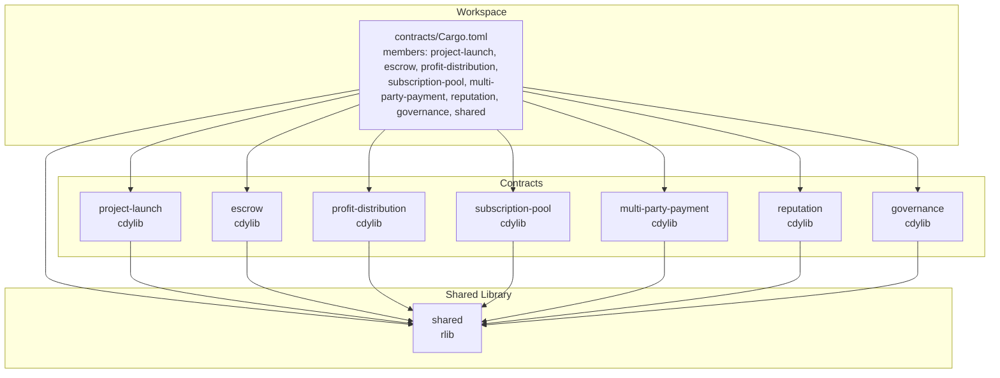
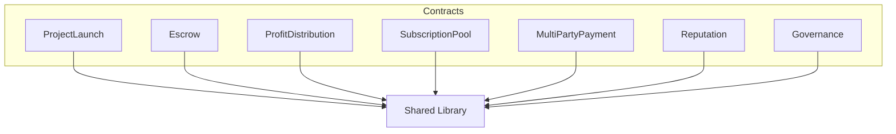
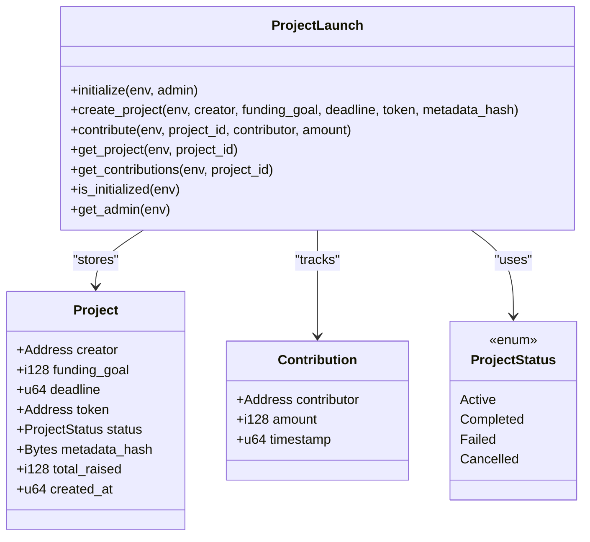
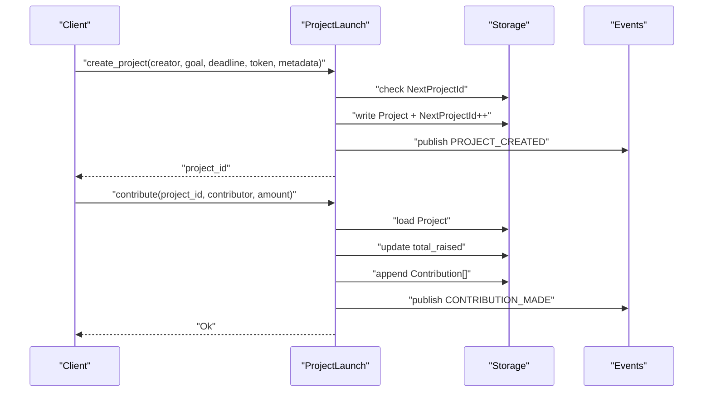
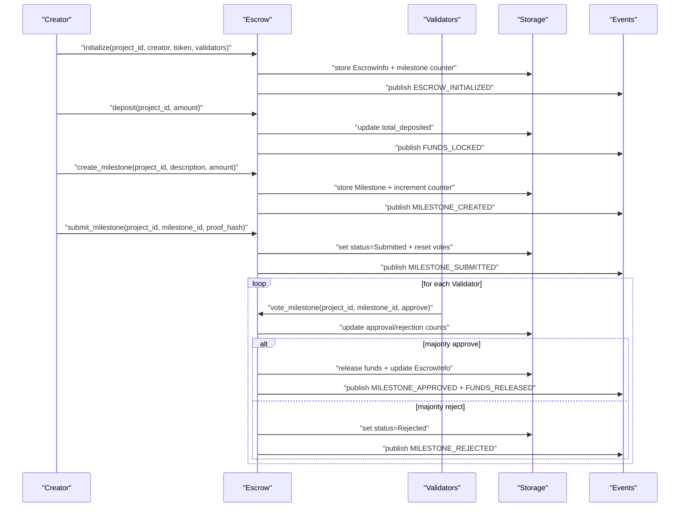
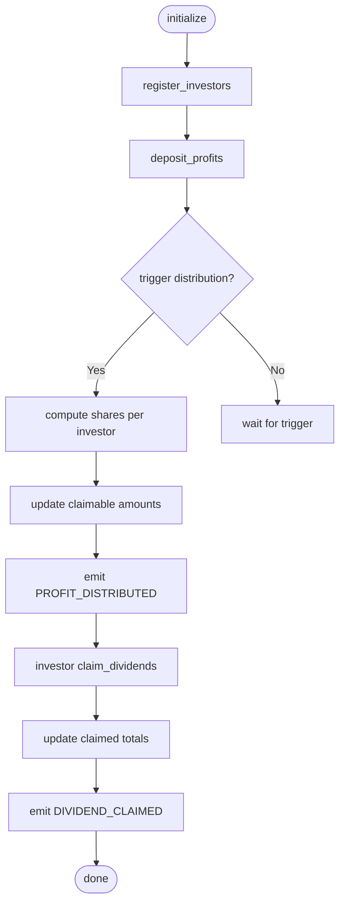
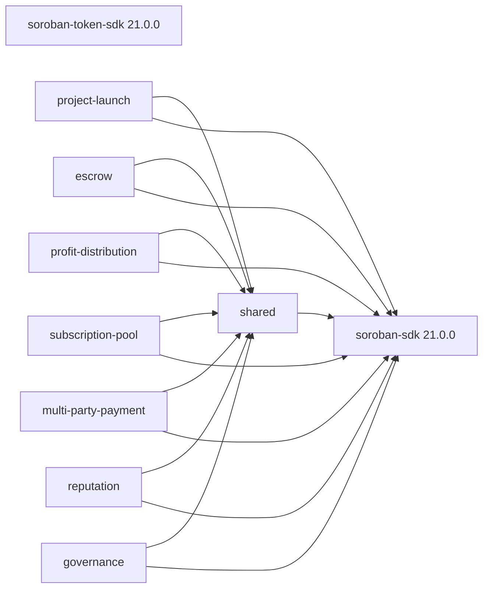

# Smart Contracts

<cite>
**Referenced Files in This Document**
- [contracts/Cargo.toml](file://contracts/Cargo.toml)
- [contracts/README.md](file://contracts/README.md)
- [contracts/SETUP.md](file://contracts/SETUP.md)
- [contracts/shared/Cargo.toml](file://contracts/shared/Cargo.toml)
- [contracts/shared/src/lib.rs](file://contracts/shared/src/lib.rs)
- [contracts/shared/src/types.rs](file://contracts/shared/src/types.rs)
- [contracts/shared/src/errors.rs](file://contracts/shared/src/errors.rs)
- [contracts/shared/src/events.rs](file://contracts/shared/src/events.rs)
- [contracts/shared/src/constants.rs](file://contracts/shared/src/constants.rs)
- [contracts/project-launch/src/lib.rs](file://contracts/project-launch/src/lib.rs)
- [contracts/escrow/src/lib.rs](file://contracts/escrow/src/lib.rs)
- [contracts/profit-distribution/src/lib.rs](file://contracts/profit-distribution/src/lib.rs)
</cite>

## Table of Contents
1. [Introduction](#introduction)
2. [Project Structure](#project-structure)
3. [Core Components](#core-components)
4. [Architecture Overview](#architecture-overview)
5. [Detailed Component Analysis](#detailed-component-analysis)
6. [Dependency Analysis](#dependency-analysis)
7. [Performance Considerations](#performance-considerations)
8. [Troubleshooting Guide](#troubleshooting-guide)
9. [Conclusion](#conclusion)
10. [Appendices](#appendices)

## Introduction
This document explains NovaFund’s smart contracts system built on Soroban for the Stellar network. It covers the workspace configuration, modular contract architecture, and development workflow. The seven specialized contracts implement core platform functionality:
- ProjectLaunch: funding campaigns and contribution tracking
- Escrow: milestone-based fund holding and release
- ProfitDistribution: automated investor payouts
- SubscriptionPool: recurring investment pools
- MultiPartyPayment: stakeholder payment splitting
- Reputation: trust scoring and badges
- Governance: voting and decision-making

It also documents the shared library used across contracts, including common types, errors, events, constants, and utilities. Both conceptual overviews and technical details are included to serve beginners and experienced developers.

## Project Structure
The contracts workspace is organized as a Rust workspace with member packages for each contract and a shared library. Each contract compiles to WebAssembly via cdylib crates and depends on the shared library for common types and utilities.

**Diagram sources**
- [contracts/Cargo.toml](file://contracts/Cargo.toml#L1-L13)
- [contracts/project-launch/Cargo.toml](file://contracts/project-launch/Cargo.toml#L1-L16)
- [contracts/escrow/Cargo.toml](file://contracts/escrow/Cargo.toml#L1-L16)
- [contracts/profit-distribution/Cargo.toml](file://contracts/profit-distribution/Cargo.toml#L1-L16)
- [contracts/shared/Cargo.toml](file://contracts/shared/Cargo.toml#L1-L12)

**Section sources**
- [contracts/Cargo.toml](file://contracts/Cargo.toml#L1-L38)
- [contracts/README.md](file://contracts/README.md#L1-L334)
- [contracts/SETUP.md](file://contracts/SETUP.md#L1-L153)

## Core Components
This section outlines each contract’s responsibilities and how they integrate with the shared library.

- ProjectLaunch
  - Purpose: project creation, funding goals, deadlines, and contribution tracking
  - Key functions: initialize, create_project, contribute, get_project, get_contributions
  - Storage: instance storage for admin and next project ID; persistent storage for contributions
  - Events: emits project creation and contribution events
  - Constraints: minimum funding goal, minimum/maximum durations, minimum contribution amount

- Escrow
  - Purpose: secure fund holding with milestone-based approvals and releases
  - Key functions: initialize, deposit, create_milestone, submit_milestone, vote_milestone, get_escrow, get_milestone
  - Storage: stores escrow info and per-milestone state
  - Events: emits lock, release, milestone lifecycle events
  - Constants: milestone approval threshold and minimum validators

- ProfitDistribution
  - Purpose: register investors, accept profits, and enable dividend distribution/claims
  - Key functions: initialize, register_investors, deposit_profits, claim_dividends, get_investor_share
  - Status: placeholder implementation with TODO markers indicating planned features

- SubscriptionPool
  - Purpose: recurring investment pools with subscriptions, deposits, rebalancing, and withdrawals
  - Status: placeholder implementation with TODO markers indicating planned features

- MultiPartyPayment
  - Purpose: split payments among multiple stakeholders according to defined shares
  - Status: placeholder implementation with TODO markers indicating planned features

- Reputation
  - Purpose: track and manage on-chain reputation scores and badges
  - Status: placeholder implementation with TODO markers indicating planned features

- Governance
  - Purpose: submit proposals, delegate votes, tally votes, and execute approved changes
  - Status: placeholder implementation with TODO markers indicating planned features

- Shared Library
  - Types: common timestamps, amounts, basis points, FeeConfig, TokenInfo, UserProfile
  - Errors: unified error enums grouped by domain (general, project, escrow, distribution, subscription, reputation, governance)
  - Events: event symbol constants for cross-contract observability
  - Constants: platform defaults, limits, thresholds, and governance parameters
  - Utilities: helper functions (e.g., percentage calculations)

**Section sources**
- [contracts/README.md](file://contracts/README.md#L105-L334)
- [contracts/shared/src/lib.rs](file://contracts/shared/src/lib.rs#L1-L20)
- [contracts/shared/src/types.rs](file://contracts/shared/src/types.rs#L1-L41)
- [contracts/shared/src/errors.rs](file://contracts/shared/src/errors.rs#L1-L54)
- [contracts/shared/src/events.rs](file://contracts/shared/src/events.rs#L1-L31)
- [contracts/shared/src/constants.rs](file://contracts/shared/src/constants.rs#L1-L40)
- [contracts/project-launch/src/lib.rs](file://contracts/project-launch/src/lib.rs#L1-L363)
- [contracts/escrow/src/lib.rs](file://contracts/escrow/src/lib.rs#L1-L367)
- [contracts/profit-distribution/src/lib.rs](file://contracts/profit-distribution/src/lib.rs#L1-L78)

## Architecture Overview
The contracts follow a modular architecture:
- Each contract is a cdylib crate compiled to WASM
- Contracts depend on the shared rlib for types, errors, events, constants, and utilities
- Contracts emit structured events for cross-contract observability and off-chain indexing
- Storage keys are organized under typed enums to prevent collisions and improve maintainability

**Diagram sources**
- [contracts/Cargo.toml](file://contracts/Cargo.toml#L4-L12)
- [contracts/shared/Cargo.toml](file://contracts/shared/Cargo.toml#L1-L12)
- [contracts/project-launch/Cargo.toml](file://contracts/project-launch/Cargo.toml#L9)
- [contracts/escrow/Cargo.toml](file://contracts/escrow/Cargo.toml#L9)
- [contracts/profit-distribution/Cargo.toml](file://contracts/profit-distribution/Cargo.toml#L9)

## Detailed Component Analysis

### ProjectLaunch Contract
ProjectLaunch manages funding campaigns with strict validation and immutable contribution records.

**Diagram sources**
- [contracts/project-launch/src/lib.rs](file://contracts/project-launch/src/lib.rs#L14-L56)

**Diagram sources**
- [contracts/project-launch/src/lib.rs](file://contracts/project-launch/src/lib.rs#L87-L229)
- [contracts/shared/src/events.rs](file://contracts/shared/src/events.rs#L3-L11)

**Section sources**
- [contracts/project-launch/src/lib.rs](file://contracts/project-launch/src/lib.rs#L1-L363)
- [contracts/shared/src/constants.rs](file://contracts/shared/src/constants.rs#L9-L22)
- [contracts/shared/src/events.rs](file://contracts/shared/src/events.rs#L3-L11)

### Escrow Contract
Escrow holds funds and releases them based on milestone approvals by validators.

**Diagram sources**
- [contracts/escrow/src/lib.rs](file://contracts/escrow/src/lib.rs#L24-L345)
- [contracts/shared/src/constants.rs](file://contracts/shared/src/constants.rs#L24-L28)
- [contracts/shared/src/events.rs](file://contracts/shared/src/events.rs#L13-L16)

**Section sources**
- [contracts/escrow/src/lib.rs](file://contracts/escrow/src/lib.rs#L1-L367)
- [contracts/shared/src/constants.rs](file://contracts/shared/src/constants.rs#L24-L28)
- [contracts/shared/src/events.rs](file://contracts/shared/src/events.rs#L13-L16)

### ProfitDistribution Contract
ProfitDistribution is a placeholder for investor share registration, profit deposits, and dividend claims.

**Diagram sources**
- [contracts/profit-distribution/src/lib.rs](file://contracts/profit-distribution/src/lib.rs#L35-L77)
- [contracts/shared/src/events.rs](file://contracts/shared/src/events.rs#L18-L20)

**Section sources**
- [contracts/profit-distribution/src/lib.rs](file://contracts/profit-distribution/src/lib.rs#L1-L78)
- [contracts/shared/src/events.rs](file://contracts/shared/src/events.rs#L18-L20)

### Conceptual Overview
Beginners can think of smart contracts as immutable programs that live on the blockchain and manage digital assets and rules. NovaFund’s contracts implement a financial stack:
- ProjectLaunch sets up campaigns and collects contributions
- Escrow ensures funds are released only when milestones are approved
- ProfitDistribution automates investor payouts
- SubscriptionPool enables recurring investments
- MultiPartyPayment splits payments among stakeholders
- Reputation tracks trust signals
- Governance lets the community decide protocol changes

These contracts communicate via on-chain events and shared types, enabling composability and transparency.

[No sources needed since this section doesn't analyze specific files]

## Dependency Analysis
Contracts depend on the shared library for consistent types, errors, events, constants, and utilities. The workspace defines a common SDK version and release profile for all members.

**Diagram sources**
- [contracts/Cargo.toml](file://contracts/Cargo.toml#L21-L23)
- [contracts/shared/Cargo.toml](file://contracts/shared/Cargo.toml#L7-L8)
- [contracts/project-launch/Cargo.toml](file://contracts/project-launch/Cargo.toml#L7-L9)
- [contracts/escrow/Cargo.toml](file://contracts/escrow/Cargo.toml#L7-L9)
- [contracts/profit-distribution/Cargo.toml](file://contracts/profit-distribution/Cargo.toml#L7-L9)

**Section sources**
- [contracts/Cargo.toml](file://contracts/Cargo.toml#L1-L38)
- [contracts/shared/Cargo.toml](file://contracts/shared/Cargo.toml#L1-L12)
- [contracts/project-launch/Cargo.toml](file://contracts/project-launch/Cargo.toml#L1-L26)
- [contracts/escrow/Cargo.toml](file://contracts/escrow/Cargo.toml#L1-L16)
- [contracts/profit-distribution/Cargo.toml](file://contracts/profit-distribution/Cargo.toml#L1-L16)

## Performance Considerations
- WASM optimization: release profiles enable LTO, z optimization level, and symbol stripping to minimize contract sizes
- Storage efficiency: use instance vs persistent storage appropriately; keep hot data in instance storage
- Gas optimization: minimize ledger reads/writes; batch operations where possible
- Event emission: emit compact, structured logs for off-chain indexing without bloating transaction size
- Integer safety: checked arithmetic prevents overflow-related bugs and reverts costly runtime panics

**Section sources**
- [contracts/Cargo.toml](file://contracts/Cargo.toml#L25-L37)
- [contracts/README.md](file://contracts/README.md#L304-L310)

## Troubleshooting Guide
Common issues and resolutions:
- Initialization errors
  - AlreadyInitialized: Ensure the contract is not initialized twice
  - Unauthorized: Verify the caller’s authentication for admin-only functions
- Input validation failures
  - InvalidInput: Check parameter bounds and types
  - InvalidDeadline: Ensure deadlines fall within allowed min/max durations
  - ContributionTooLow: Ensure contributions meet the minimum threshold
- Cross-contract state queries
  - NotFound: Confirm storage keys and project IDs are correct
  - InsufficientEscrowBalance: Verify milestone amounts do not exceed total deposited
- Governance and reputation
  - QuorumNotReached: Ensure sufficient voting participation
  - InsufficientVotingPower: Verify delegation and balances

**Section sources**
- [contracts/shared/src/errors.rs](file://contracts/shared/src/errors.rs#L1-L54)
- [contracts/project-launch/src/lib.rs](file://contracts/project-launch/src/lib.rs#L96-L111)
- [contracts/escrow/src/lib.rs](file://contracts/escrow/src/lib.rs#L40-L48)

## Conclusion
NovaFund’s smart contracts provide a modular, composable foundation for decentralized crowdfunding on Stellar. The workspace and shared library promote consistency and maintainability. While several contracts are placeholders for future implementation, the existing ProjectLaunch and Escrow demonstrate robust patterns for validation, storage, and event-driven workflows. Developers can extend the system by implementing the remaining contracts while leveraging shared types, errors, and constants.

[No sources needed since this section summarizes without analyzing specific files]

## Appendices

### Development Workflow
- Install prerequisites: Rust, wasm32-unknown-unknown target, Soroban CLI
- Build contracts: cargo build --target wasm32-unknown-unknown --release
- Test contracts: cargo test --all or cargo test in a specific contract directory
- Optimize WASM: use soroban contract optimize
- Deploy to testnet: configure network, generate/fund a deployer key, and deploy WASM
- Initialize contracts: invoke initialize with required parameters (e.g., admin address)

**Section sources**
- [contracts/README.md](file://contracts/README.md#L21-L103)
- [contracts/SETUP.md](file://contracts/SETUP.md#L37-L126)

### Contract Responsibilities Summary
- ProjectLaunch: campaign lifecycle, contribution tracking, deadlines
- Escrow: milestone approvals, validator voting, fund releases
- ProfitDistribution: investor shares, profit deposits, dividend claims
- SubscriptionPool: recurring subscriptions, pool management
- MultiPartyPayment: stakeholder splits, share updates
- Reputation: score management, badge issuance
- Governance: proposals, voting, execution

**Section sources**
- [contracts/README.md](file://contracts/README.md#L7-L19)