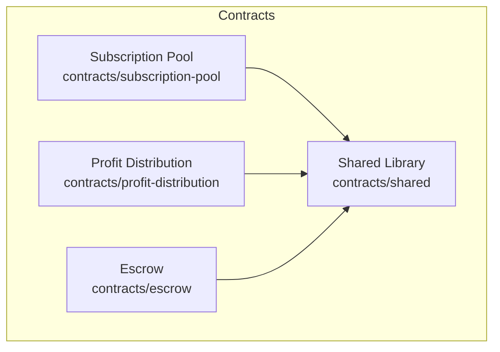
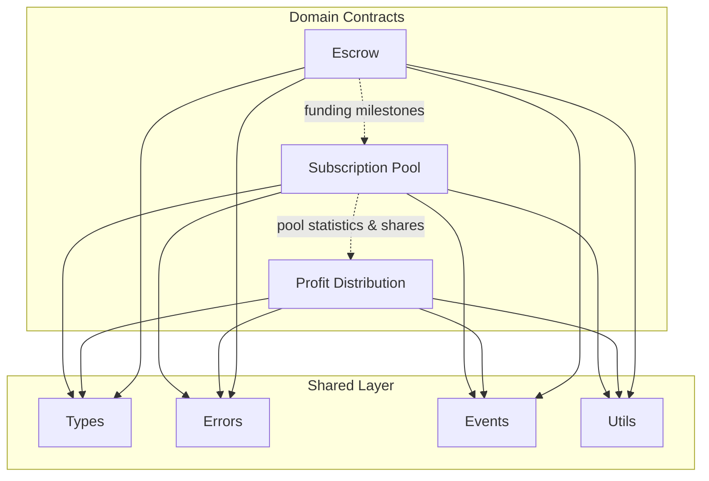
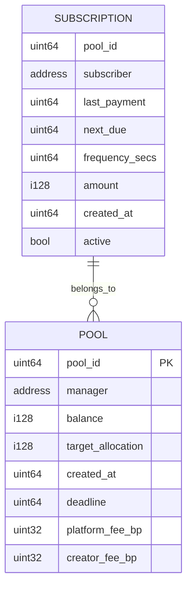
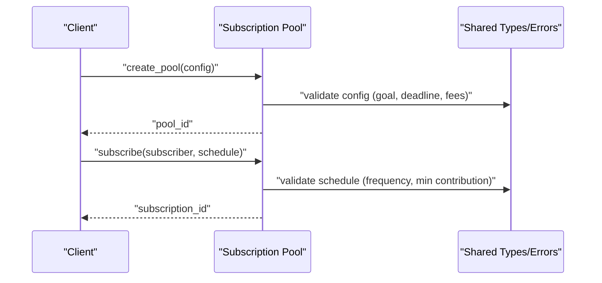
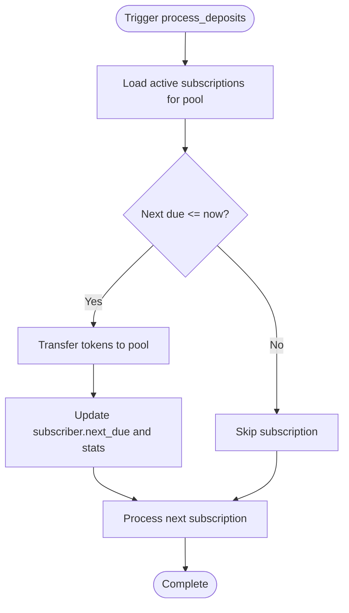
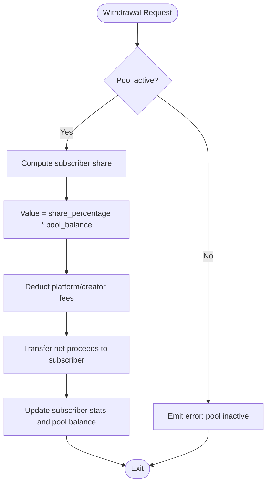
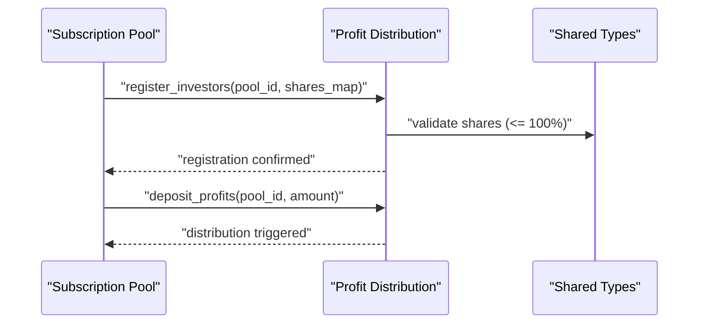
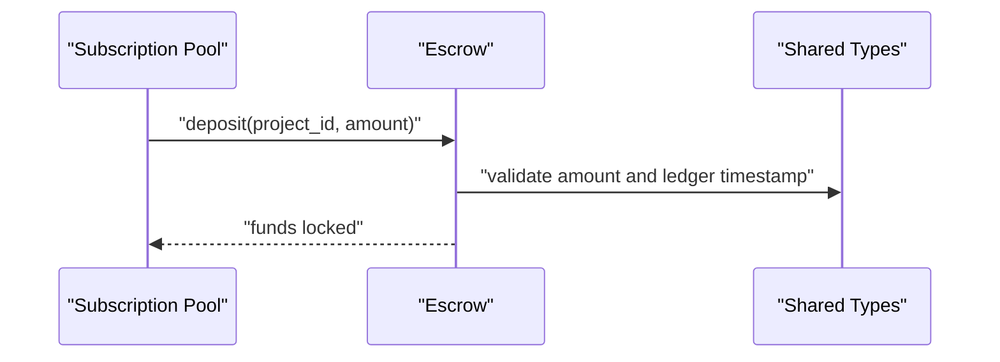
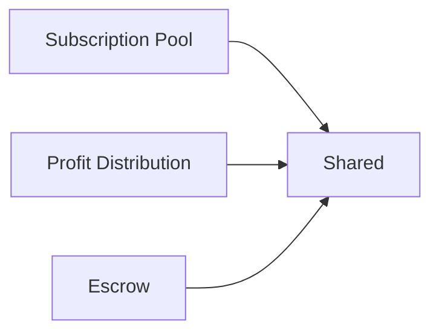

# Subscription Pool Contract

<cite>
**Referenced Files in This Document**
- [lib.rs](file://contracts/subscription-pool/src/lib.rs)
- [Cargo.toml](file://contracts/subscription-pool/Cargo.toml)
- [lib.rs](file://contracts/shared/src/lib.rs)
- [types.rs](file://contracts/shared/src/types.rs)
- [constants.rs](file://contracts/shared/src/constants.rs)
- [errors.rs](file://contracts/shared/src/errors.rs)
- [events.rs](file://contracts/shared/src/events.rs)
- [utils.rs](file://contracts/shared/src/utils.rs)
- [lib.rs](file://contracts/profit-distribution/src/lib.rs)
- [storage.rs](file://contracts/profit-distribution/src/storage.rs)
- [types.rs](file://contracts/profit-distribution/src/types.rs)
- [lib.rs](file://contracts/escrow/src/lib.rs)
- [storage.rs](file://contracts/escrow/src/storage.rs)
- [README.md](file://README.md)
- [README.md](file://contracts/README.md)
</cite>

## Table of Contents
1. [Introduction](#introduction)
2. [Project Structure](#project-structure)
3. [Core Components](#core-components)
4. [Architecture Overview](#architecture-overview)
5. [Detailed Component Analysis](#detailed-component-analysis)
6. [Dependency Analysis](#dependency-analysis)
7. [Performance Considerations](#performance-considerations)
8. [Troubleshooting Guide](#troubleshooting-guide)
9. [Conclusion](#conclusion)
10. [Appendices](#appendices)

## Introduction
The Subscription Pool contract is designed to manage recurring investment systems and pool-based funding mechanisms. It enables:
- Creating recurring investment pools
- Managing subscriber deposits on weekly, monthly, or quarterly schedules
- Portfolio rebalancing
- Withdrawal with payout calculation

This document explains the implementation roadmap, storage architecture, configuration options, and integration points with other contracts such as the Profit Distribution and Escrow contracts. It also covers common operational scenarios like failed payments, subscription cancellations, and pool dissolution.

## Project Structure
The Subscription Pool lives under contracts/subscription-pool and integrates with shared primitives and other contracts.

**Diagram sources**
- [Cargo.toml](file://contracts/subscription-pool/Cargo.toml#L7-L15)
- [lib.rs](file://contracts/shared/src/lib.rs#L1-L200)
- [lib.rs](file://contracts/profit-distribution/src/lib.rs#L1-L78)
- [lib.rs](file://contracts/escrow/src/lib.rs#L60-L103)

**Section sources**
- [Cargo.toml](file://contracts/subscription-pool/Cargo.toml#L1-L16)
- [README.md](file://README.md#L101-L136)
- [README.md](file://contracts/README.md#L212-L228)

## Core Components
- Subscription Pool contract: Manages recurring subscriptions, deposit processing, portfolio rebalancing, and withdrawals.
- Shared library: Provides common types, constants, errors, events, and utilities used across contracts.
- Profit Distribution contract: Handles investor share registration and profit distribution, which complements pool payouts.
- Escrow contract: Manages milestone-based fund locking and releases, relevant for milestone-linked funding.

Key capabilities:
- Recurring investment tracking via subscription schedules
- Pool configuration management (funding goals, durations, fee structures)
- Deposit processing workflows aligned with payment frequencies
- Withdrawal calculation algorithms for proportional exits
- Storage architecture for subscribers, schedules, and pool statistics

**Section sources**
- [lib.rs](file://contracts/subscription-pool/src/lib.rs#L1-L9)
- [lib.rs](file://contracts/shared/src/lib.rs#L1-L200)
- [lib.rs](file://contracts/profit-distribution/src/lib.rs#L1-L78)
- [lib.rs](file://contracts/escrow/src/lib.rs#L60-L103)

## Architecture Overview
The Subscription Pool interacts with shared types and errors, emits domain-specific events, and coordinates with Profit Distribution and Escrow contracts.

**Diagram sources**
- [lib.rs](file://contracts/subscription-pool/src/lib.rs#L1-L9)
- [types.rs](file://contracts/shared/src/types.rs#L1-L41)
- [errors.rs](file://contracts/shared/src/errors.rs#L1-L54)
- [events.rs](file://contracts/shared/src/events.rs#L1-L31)
- [utils.rs](file://contracts/shared/src/utils.rs#L1-L58)
- [lib.rs](file://contracts/profit-distribution/src/lib.rs#L1-L78)
- [lib.rs](file://contracts/escrow/src/lib.rs#L60-L103)

## Detailed Component Analysis

### Storage Architecture
The Subscription Pool will maintain persistent state keyed by pool identifiers and subscriber addresses. The shared library defines common types and constants that inform storage keys and validation.

- Subscriber records: keyed by pool ID and subscriber address, storing schedule and contribution metadata.
- Pool-level state: keyed by pool ID, storing balances, allocation targets, and statistics.
- Configuration: funding goal, duration, fee rates, and payment frequency parameters.
- Events: emitted for subscription lifecycle events and withdrawals.

[No sources needed since this diagram shows conceptual storage architecture]

**Section sources**
- [types.rs](file://contracts/shared/src/types.rs#L1-L41)
- [constants.rs](file://contracts/shared/src/constants.rs#L1-L40)
- [events.rs](file://contracts/shared/src/events.rs#L1-L31)

### Configuration Options
Configuration parameters define how pools operate and how fees are applied:
- Funding goal and deadline: define pool lifecycle and exit conditions.
- Platform and creator fees: expressed in basis points, validated against maximums.
- Minimum contribution thresholds: ensure economically viable transactions.
- Payment frequencies: weekly, monthly, quarterly, or custom cadence.

These values are enforced via shared validation utilities and constants.

**Section sources**
- [constants.rs](file://contracts/shared/src/constants.rs#L3-L22)
- [utils.rs](file://contracts/shared/src/utils.rs#L30-L33)
- [errors.rs](file://contracts/shared/src/errors.rs#L34-L38)

### Subscription Creation Workflow
This sequence outlines creating a subscription pool and enrolling subscribers.

**Diagram sources**
- [lib.rs](file://contracts/subscription-pool/src/lib.rs#L1-L9)
- [types.rs](file://contracts/shared/src/types.rs#L12-L28)
- [constants.rs](file://contracts/shared/src/constants.rs#L9-L22)
- [errors.rs](file://contracts/shared/src/errors.rs#L34-L38)

### Deposit Processing Workflow
Scheduled deposits are collected and recorded, with failure modes handled gracefully.

[No sources needed since this diagram shows conceptual workflow]

### Withdrawal Calculation Algorithm
Withdrawals compute proportional payouts based on pool value and subscriber share.

[No sources needed since this diagram shows conceptual workflow]

### Integration with Profit Distribution
- Investor share registration: The Profit Distribution contract maintains investor shares and claimable amounts.
- Pool-to-distribution alignment: Subscription Pool statistics can feed distribution calculations, ensuring proportional payouts align with investor stakes.

**Diagram sources**
- [lib.rs](file://contracts/profit-distribution/src/lib.rs#L42-L56)
- [storage.rs](file://contracts/profit-distribution/src/storage.rs#L16-L25)
- [types.rs](file://contracts/profit-distribution/src/types.rs#L3-L10)

### Integration with Escrow
- Milestone-linked funding: Escrow manages milestone submissions and releases, complementing pool-based recurring contributions.
- Coordinated lifecycle: Pools can align with milestone completion to trigger distributions or releases.

**Diagram sources**
- [lib.rs](file://contracts/escrow/src/lib.rs#L72-L103)
- [storage.rs](file://contracts/escrow/src/storage.rs#L12-L24)

## Dependency Analysis
The Subscription Pool depends on the shared library for types, constants, errors, and utilities. It does not declare external dependencies beyond the SDK and shared.

**Diagram sources**
- [Cargo.toml](file://contracts/subscription-pool/Cargo.toml#L7-L15)
- [lib.rs](file://contracts/shared/src/lib.rs#L1-L200)

**Section sources**
- [Cargo.toml](file://contracts/subscription-pool/Cargo.toml#L1-L16)

## Performance Considerations
- Batch processing: Group subscription cycles to minimize ledger writes.
- Lazy updates: Defer stat recomputations until necessary.
- Efficient lookups: Use indexed keys for pool and subscriber queries.
- Gas optimization: Validate inputs early to avoid unnecessary computations.

[No sources needed since this section provides general guidance]

## Troubleshooting Guide
Common issues and resolutions:
- Subscription not active: Ensure the pool is within its lifecycle window and not dissolved.
- Invalid subscription period: Verify frequency aligns with supported intervals and ledger timestamps are valid.
- Subscription exists: Prevent duplicate enrollments by checking existing records before creating new subscriptions.
- Withdrawal locked: Confirm lock periods and pool status before allowing exits.

Related error codes:
- Subscription-related errors: Not active, invalid period, exists, withdrawal locked.

**Section sources**
- [errors.rs](file://contracts/shared/src/errors.rs#L34-L38)

## Conclusion
The Subscription Pool contract establishes a robust foundation for recurring investment systems. By leveraging shared types and errors, integrating with Profit Distribution for investor payouts, and coordinating with Escrow for milestone-based funding, it supports scalable pool-based funding. The outlined workflows, storage architecture, and configuration options provide a blueprint for implementing reliable recurring revenue systems.

[No sources needed since this section summarizes without analyzing specific files]

## Appendices

### Example Function Paths
- Create pool: [lib.rs](file://contracts/subscription-pool/src/lib.rs#L1-L9)
- Subscribe: [lib.rs](file://contracts/subscription-pool/src/lib.rs#L1-L9)
- Process deposits: [lib.rs](file://contracts/subscription-pool/src/lib.rs#L1-L9)
- Rebalance: [lib.rs](file://contracts/subscription-pool/src/lib.rs#L1-L9)
- Withdraw: [lib.rs](file://contracts/subscription-pool/src/lib.rs#L1-L9)

**Section sources**
- [lib.rs](file://contracts/subscription-pool/src/lib.rs#L1-L9)