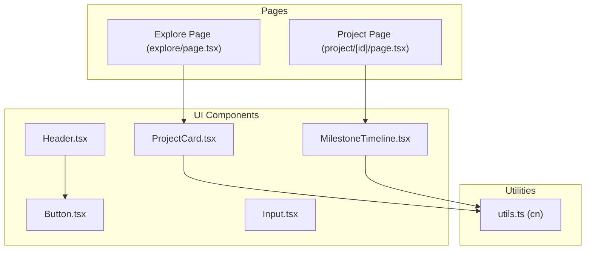
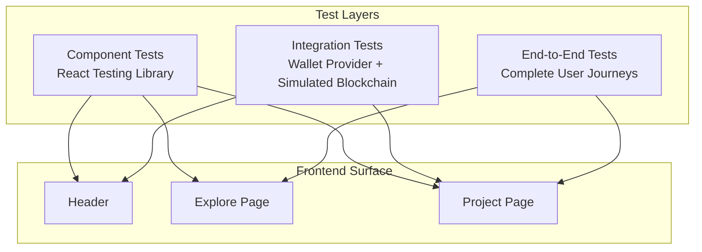
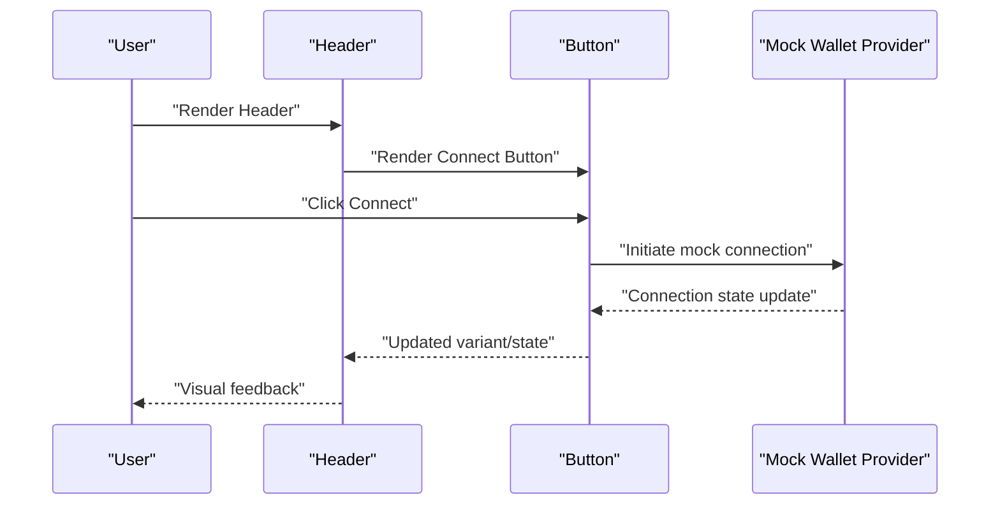
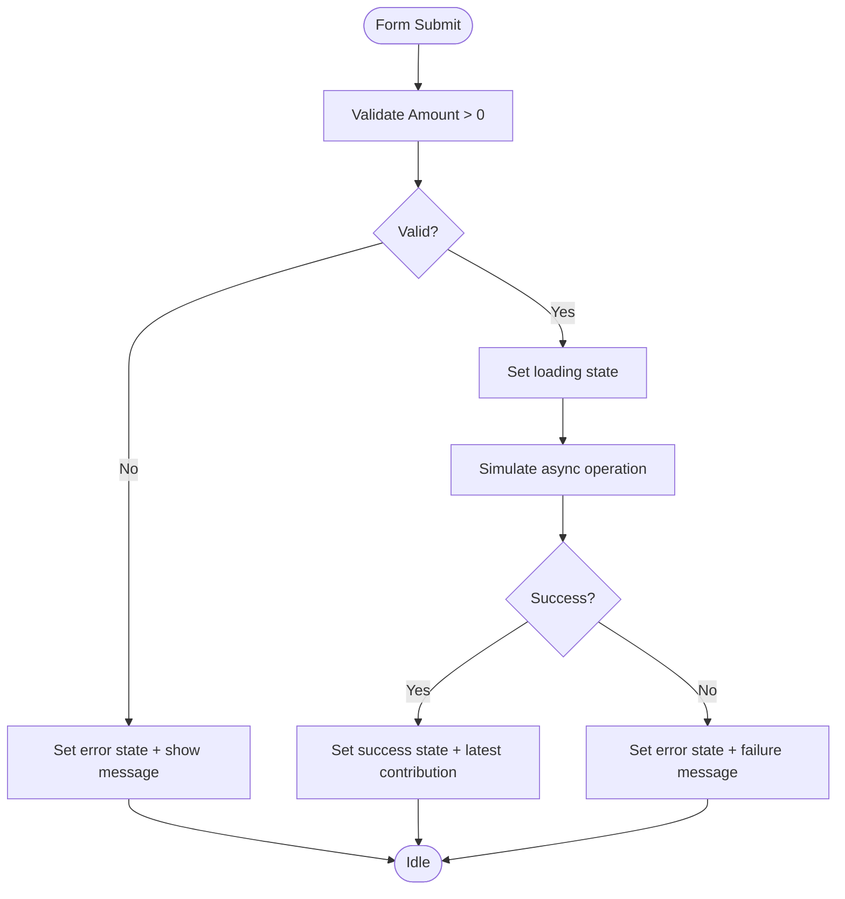
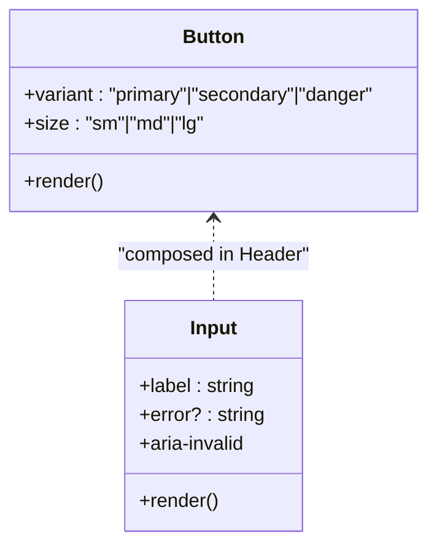
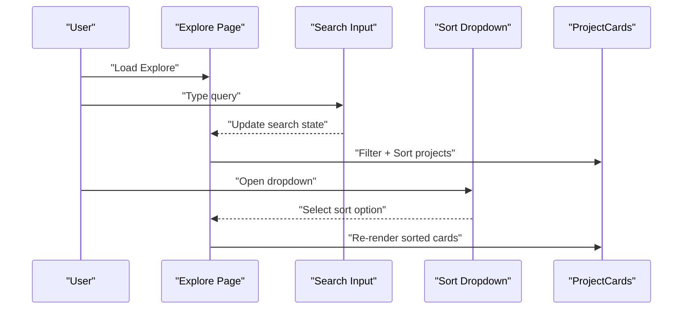
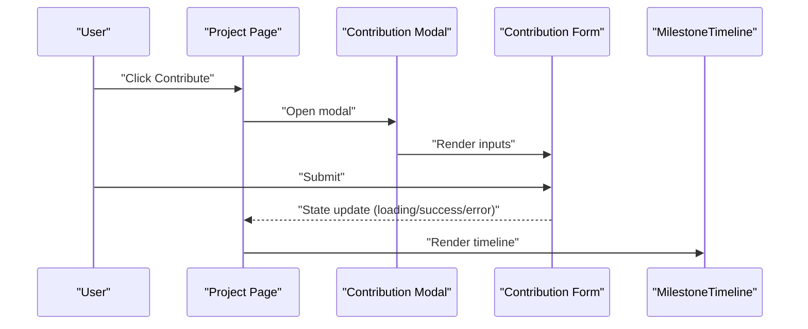
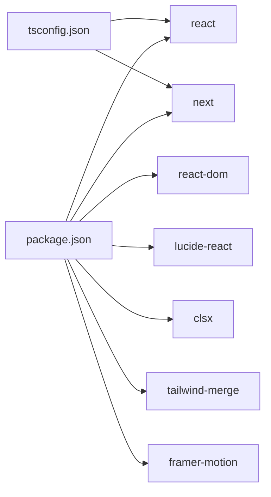

# Frontend Testing

<cite>
**Referenced Files in This Document**
- [package.json](file://frontend/package.json)
- [tsconfig.json](file://frontend/tsconfig.json)
- [Header.tsx](file://frontend/src/components/layout/Header.tsx)
- [Button.tsx](file://frontend/src/components/ui/Button.tsx)
- [Input.tsx](file://frontend/src/components/ui/Input.tsx)
- [Explore Page](file://frontend/src/app/explore/page.tsx)
- [Project Page](file://frontend/src/app/project/[id]/page.tsx)
- [ProjectCard.tsx](file://frontend/src/components/ProjectCard.tsx)
- [MilestoneTimeline.tsx](file://frontend/src/components/MilestoneTimeline.tsx)
- [utils.ts](file://frontend/src/lib/utils.ts)
- [README.md](file://README.md)
</cite>

## Table of Contents
1. [Introduction](#introduction)
2. [Project Structure](#project-structure)
3. [Core Components](#core-components)
4. [Architecture Overview](#architecture-overview)
5. [Detailed Component Analysis](#detailed-component-analysis)
6. [Dependency Analysis](#dependency-analysis)
7. [Performance Considerations](#performance-considerations)
8. [Troubleshooting Guide](#troubleshooting-guide)
9. [Conclusion](#conclusion)
10. [Appendices](#appendices)

## Introduction
This document provides comprehensive frontend testing strategies for the NovaFund React/Next.js application. It focuses on component testing with React Testing Library, integration testing for wallet provider connections and transaction flows, and end-to-end testing for complete user journeys such as project discovery, contribution simulation, and dashboard interactions. Guidance is included for mocking wallet providers, simulating blockchain interactions, handling wallet state management, network connectivity, and error scenarios. Recommendations are also provided for test configuration, continuous integration setup, and cross-browser and wallet-provider reliability.

## Project Structure
The frontend is a Next.js application written in TypeScript. Key areas for testing include:
- UI components under components/ui and components/layout
- Feature pages under app/explore and app/project/[id]
- Shared utilities under lib/utils
- Tailwind-based styling and class composition utilities

**Diagram sources**
- [Button.tsx](file://frontend/src/components/ui/Button.tsx#L1-L39)
- [Input.tsx](file://frontend/src/components/ui/Input.tsx#L1-L31)
- [Header.tsx](file://frontend/src/components/layout/Header.tsx#L1-L20)
- [ProjectCard.tsx](file://frontend/src/components/ProjectCard.tsx#L1-L117)
- [MilestoneTimeline.tsx](file://frontend/src/components/MilestoneTimeline.tsx#L1-L115)
- [Explore Page](file://frontend/src/app/explore/page.tsx#L1-L239)
- [Project Page](file://frontend/src/app/project/[id]/page.tsx#L1-L384)
- [utils.ts](file://frontend/src/lib/utils.ts#L1-L7)

**Section sources**
- [package.json](file://frontend/package.json#L1-L32)
- [tsconfig.json](file://frontend/tsconfig.json#L1-L27)

## Core Components
This section outlines the primary components to test and their roles in user workflows:
- Header with a connect button for wallet integration
- Explore page with search, sorting, and project cards
- Project page with contribution modal, milestone timeline, and stats
- UI primitives: Button and Input
- Utility for class composition

Key testing targets:
- Wallet connect button behavior and accessibility
- Form validation and submission in the contribution modal
- Interactive elements: sort dropdown, search input, project cards
- Real-time state updates via modal status messages and latest contribution display
- Timeline rendering and milestone status indicators

**Section sources**
- [Header.tsx](file://frontend/src/components/layout/Header.tsx#L1-L20)
- [Button.tsx](file://frontend/src/components/ui/Button.tsx#L1-L39)
- [Input.tsx](file://frontend/src/components/ui/Input.tsx#L1-L31)
- [Explore Page](file://frontend/src/app/explore/page.tsx#L110-L239)
- [Project Page](file://frontend/src/app/project/[id]/page.tsx#L102-L384)
- [ProjectCard.tsx](file://frontend/src/components/ProjectCard.tsx#L25-L117)
- [MilestoneTimeline.tsx](file://frontend/src/components/MilestoneTimeline.tsx#L57-L115)
- [utils.ts](file://frontend/src/lib/utils.ts#L4-L6)

## Architecture Overview
The testing architecture centers on three layers:
- Component tests: isolated unit tests for UI components and small logic units
- Integration tests: simulate wallet provider connections and transaction flows
- End-to-end tests: complete user journeys across pages and interactions

[No sources needed since this diagram shows conceptual workflow, not actual code structure]

## Detailed Component Analysis

### Wallet Integration Components
Focus areas:
- Header connect button behavior and accessibility
- Mock wallet connection state and variant rendering
- Interaction patterns for connecting/disconnecting

Recommended testing patterns:
- Render the Header and assert the connect button exists and is accessible
- Simulate click events and verify expected aria attributes and state changes
- Test variant and size props for visual and behavioral differences

**Diagram sources**
- [Header.tsx](file://frontend/src/components/layout/Header.tsx#L4-L16)
- [Button.tsx](file://frontend/src/components/ui/Button.tsx#L8-L35)

**Section sources**
- [Header.tsx](file://frontend/src/components/layout/Header.tsx#L1-L20)
- [Button.tsx](file://frontend/src/components/ui/Button.tsx#L1-L39)

### Form Validation and Interactive Elements
Focus areas:
- Contribution form validation and submission lifecycle
- Modal open/close transitions and status messaging
- Sorting dropdown and search filtering in Explore page

Testing patterns:
- Validate empty/invalid inputs trigger error states
- Simulate form submission and assert loading, success, and error transitions
- Test modal visibility and status message color/text per state
- Verify Explore page search and sort interactions update results

**Diagram sources**
- [Project Page](file://frontend/src/app/project/[id]/page.tsx#L140-L166)

**Section sources**
- [Project Page](file://frontend/src/app/project/[id]/page.tsx#L102-L384)
- [Explore Page](file://frontend/src/app/explore/page.tsx#L110-L239)

### UI Primitives: Button and Input
Focus areas:
- Variant and size prop combinations
- Input error styling and accessibility attributes
- Rendering and interaction behavior

Testing patterns:
- Render Button with different variants and sizes and assert class combinations
- Render Input with error prop and assert error styling and aria-invalid
- Test click and change handlers through fireEvent

**Diagram sources**
- [Button.tsx](file://frontend/src/components/ui/Button.tsx#L3-L35)
- [Input.tsx](file://frontend/src/components/ui/Input.tsx#L3-L26)
- [Header.tsx](file://frontend/src/components/layout/Header.tsx#L2-L12)

**Section sources**
- [Button.tsx](file://frontend/src/components/ui/Button.tsx#L1-L39)
- [Input.tsx](file://frontend/src/components/ui/Input.tsx#L1-L31)
- [Header.tsx](file://frontend/src/components/layout/Header.tsx#L1-L20)

### Explore Page: Search, Sort, and Cards
Focus areas:
- Search input filtering
- Sort dropdown selection and animation
- ProjectCard rendering and progress bars

Testing patterns:
- Enter search text and assert filtered results length
- Toggle sort dropdown and select options, verifying sort order
- Assert ProjectCard renders category badges and progress visuals

**Diagram sources**
- [Explore Page](file://frontend/src/app/explore/page.tsx#L110-L239)
- [ProjectCard.tsx](file://frontend/src/components/ProjectCard.tsx#L25-L117)

**Section sources**
- [Explore Page](file://frontend/src/app/explore/page.tsx#L1-L239)
- [ProjectCard.tsx](file://frontend/src/components/ProjectCard.tsx#L1-L117)

### Project Page: Contribution Modal and Timeline
Focus areas:
- Modal open/close and form inside
- MilestoneTimeline rendering and status indicators
- Stats and progress visuals

Testing patterns:
- Open modal and assert form elements are visible
- Submit with invalid amount and assert error state
- Submit with valid amount and assert success state and latest contribution
- Assert MilestoneTimeline renders statuses and progress bars

**Diagram sources**
- [Project Page](file://frontend/src/app/project/[id]/page.tsx#L102-L384)
- [MilestoneTimeline.tsx](file://frontend/src/components/MilestoneTimeline.tsx#L57-L115)

**Section sources**
- [Project Page](file://frontend/src/app/project/[id]/page.tsx#L1-L384)
- [MilestoneTimeline.tsx](file://frontend/src/components/MilestoneTimeline.tsx#L1-L115)

## Dependency Analysis
Testing dependencies and external integrations:
- React and Next.js runtime
- UI libraries (lucide-react, clsx, tailwind-merge)
- Animation library (framer-motion)
- TypeScript configuration for module resolution and JSX handling

**Diagram sources**
- [package.json](file://frontend/package.json#L11-L19)
- [tsconfig.json](file://frontend/tsconfig.json#L2-L23)

**Section sources**
- [package.json](file://frontend/package.json#L1-L32)
- [tsconfig.json](file://frontend/tsconfig.json#L1-L27)

## Performance Considerations
- Prefer lightweight render assertions over deep snapshots for UI components
- Use minimal DOM queries and rely on getByRole for accessibility-first selectors
- Avoid unnecessary re-renders by testing pure UI components and isolated logic
- For animations, use waitFor or screen.findBy* helpers to assert transitions reliably

[No sources needed since this section provides general guidance]

## Troubleshooting Guide
Common testing challenges for decentralized applications:
- Wallet state management
  - Mock wallet provider state and events in integration tests
  - Simulate connection success/failure and account changes
- Network connectivity testing
  - Stub asynchronous operations with deterministic outcomes
  - Test fallback UIs and error messaging for network failures
- Error handling scenarios
  - Validate error states for invalid form inputs and failed transactions
  - Assert status messages and visual indicators for success/error states

Practical tips:
- Use React Testing Library’s screen and within helpers for scoped queries
- For class composition, assert final computed classes via data-testid or role
- For animations, wait for motion to finish before asserting final state

**Section sources**
- [Project Page](file://frontend/src/app/project/[id]/page.tsx#L140-L166)
- [Explore Page](file://frontend/src/app/explore/page.tsx#L110-L239)

## Conclusion
The NovaFund frontend offers rich opportunities for testing across UI components, user interactions, and simulated blockchain flows. By combining React Testing Library for component-level checks, integration tests for wallet and transaction logic, and end-to-end tests for complete workflows, teams can ensure robustness and reliability. Focus on accessibility-first selectors, deterministic state transitions, and comprehensive error handling to maintain quality across browsers and wallet providers.

[No sources needed since this section summarizes without analyzing specific files]

## Appendices

### Test Configuration and CI Setup
- Testing framework and utilities
  - The project uses Vitest and React Testing Library for testing, as indicated in the repository documentation.
- Scripts and tooling
  - The frontend package defines standard Next.js scripts; CI should run tests alongside linting and builds.
- Recommendations
  - Configure Vitest with React Testing Library matchers and setup files
  - Add coverage collection and enforce thresholds
  - Run tests in CI with matrix jobs across browsers and wallet providers

**Section sources**
- [README.md](file://README.md#L192-L259)
- [package.json](file://frontend/package.json#L5-L10)

### Practical Examples and Patterns
- Mock wallet provider
  - Wrap tests with a provider that exposes mock connect/disconnect and state
  - Simulate approval guards and transaction outcomes
- Simulate blockchain interactions
  - Replace async operations with deterministic timers or resolved promises
  - Assert UI reflects loading, success, and error states
- Cross-browser and wallet-provider reliability
  - Use headless browser runs in CI
  - Test with multiple wallet providers by swapping mock provider implementations

[No sources needed since this section provides general guidance]