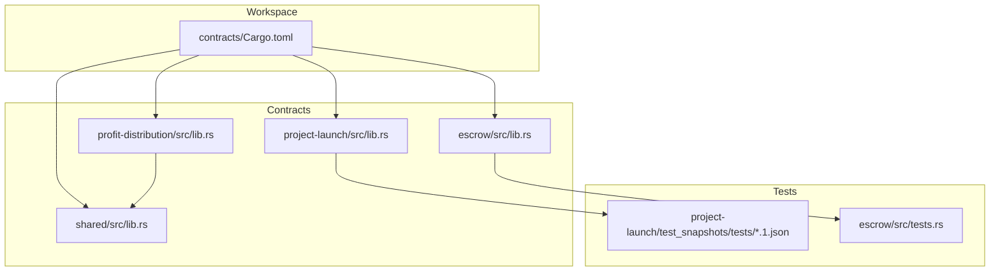
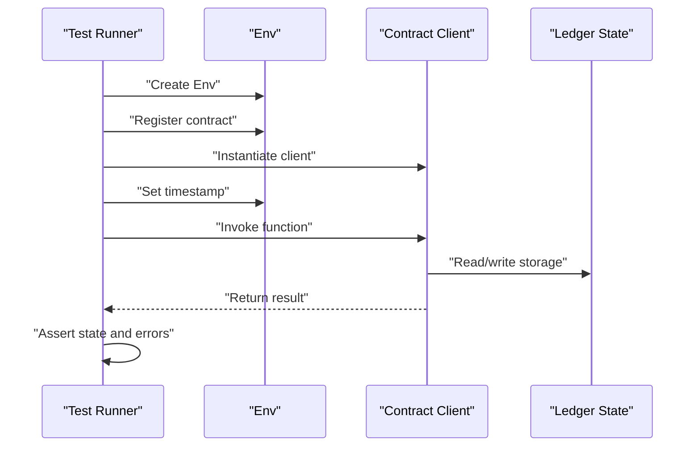
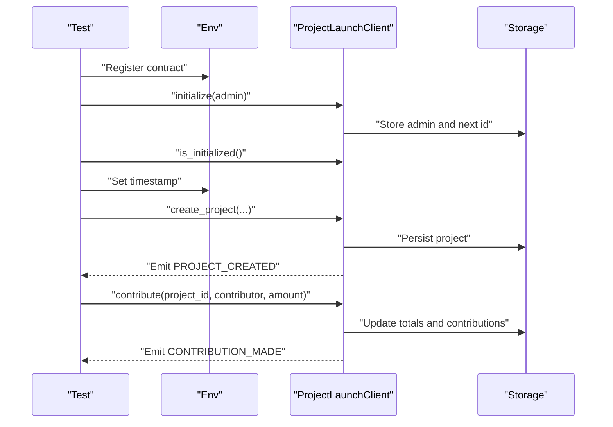
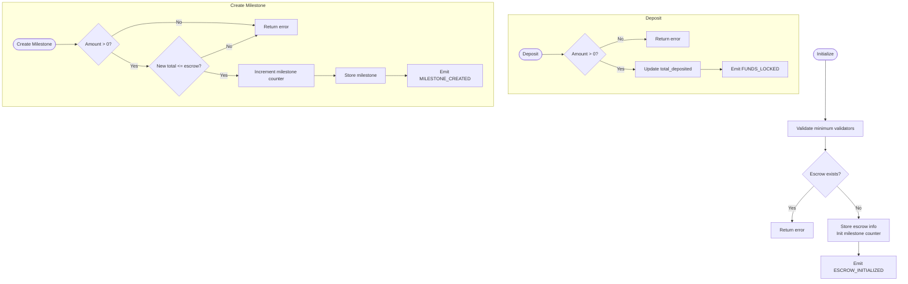
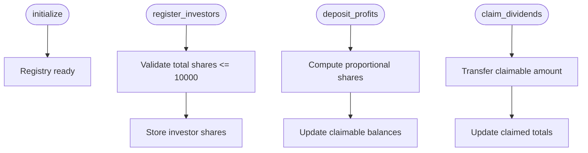
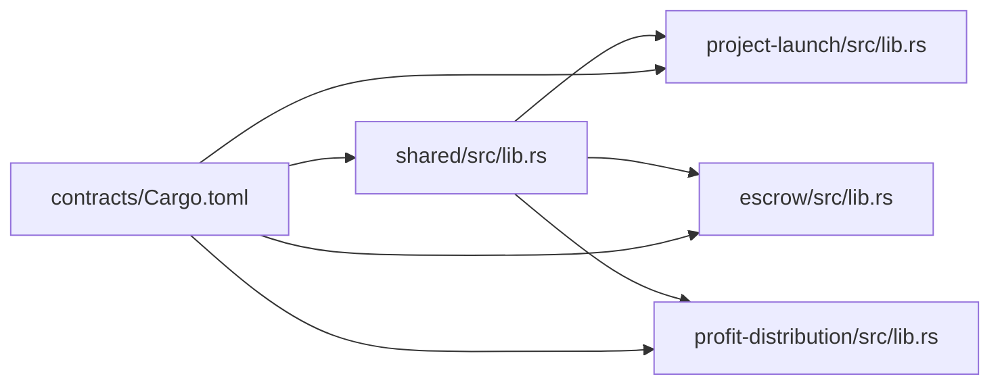

# Smart Contract Testing

<cite>
**Referenced Files in This Document**
- [Cargo.toml](file://contracts/Cargo.toml)
- [README.md](file://README.md)
- [lib.rs (ProjectLaunch)](file://contracts/project-launch/src/lib.rs)
- [tests.rs (ProjectLaunch Snapshots)](file://contracts/project-launch/test_snapshots/tests/test_create_project.1.json)
- [tests.rs (ProjectLaunch Snapshots)](file://contracts/project-launch/test_snapshots/tests/test_contribute.1.json)
- [tests.rs (ProjectLaunch Snapshots)](file://contracts/project-launch/test_snapshots/tests/test_initialize.1.json)
- [tests.rs (Escrow)](file://contracts/escrow/src/tests.rs)
- [lib.rs (Escrow)](file://contracts/escrow/src/lib.rs)
- [lib.rs (ProfitDistribution)](file://contracts/profit-distribution/src/lib.rs)
- [lib.rs (Shared)](file://contracts/shared/src/lib.rs)
- [utils.rs (Shared)](file://contracts/shared/src/utils.rs)
- [constants.rs (Shared)](file://contracts/shared/src/constants.rs)
</cite>

## Table of Contents
1. [Introduction](#introduction)
2. [Project Structure](#project-structure)
3. [Core Components](#core-components)
4. [Architecture Overview](#architecture-overview)
5. [Detailed Component Analysis](#detailed-component-analysis)
6. [Dependency Analysis](#dependency-analysis)
7. [Performance Considerations](#performance-considerations)
8. [Troubleshooting Guide](#troubleshooting-guide)
9. [Conclusion](#conclusion)
10. [Appendices](#appendices)

## Introduction
This document describes the smart contract testing methodology for the NovaFund ecosystem on Soroban. It focuses on unit testing patterns using Rust’s built-in test framework, integration testing approaches for contract interactions, and snapshot testing for state validation. Practical examples are drawn from the ProjectLaunch, Escrow, and ProfitDistribution contracts, along with shared utilities. Guidance is also provided for testing challenges specific to blockchain environments such as transaction simulation, gas cost testing, and deterministic execution.

## Project Structure
The NovaFund workspace is organized as a Rust workspace with seven smart contracts plus a shared library. Unit tests live alongside contract implementations, while snapshot tests for ProjectLaunch are stored under a dedicated test snapshots directory.

**Diagram sources**
- [Cargo.toml](file://contracts/Cargo.toml#L1-L38)
- [lib.rs (ProjectLaunch)](file://contracts/project-launch/src/lib.rs#L1-L363)
- [tests.rs (Escrow)](file://contracts/escrow/src/tests.rs#L1-L362)
- [lib.rs (Escrow)](file://contracts/escrow/src/lib.rs#L1-L200)
- [lib.rs (ProfitDistribution)](file://contracts/profit-distribution/src/lib.rs#L1-L78)
- [lib.rs (Shared)](file://contracts/shared/src/lib.rs#L1-L20)

**Section sources**
- [Cargo.toml](file://contracts/Cargo.toml#L1-L38)
- [README.md](file://README.md#L260-L313)

## Core Components
- ProjectLaunch: Manages project creation, contributions, and emits events. Unit tests demonstrate initialization, project creation, and contribution flows with assertions on state and error conditions.
- Escrow: Handles escrow initialization, deposits, milestone creation, and submission. Tests validate state transitions, error handling, and storage isolation.
- ProfitDistribution: Defines the interface for investor share registration, profit deposits, and dividend claims. Tests are pending; see implementation notes below.
- Shared: Provides shared types, constants, utilities, and events used across contracts. Utilities include percentage calculations and timestamp validations.

Key testing patterns observed:
- Deterministic ledger timestamps via Env ledger manipulation.
- Client wrappers generated by the SDK for invoking contract functions.
- Assertions on state reads, error variants, and emitted events.
- Snapshot-based state validation for complex scenarios.

**Section sources**
- [lib.rs (ProjectLaunch)](file://contracts/project-launch/src/lib.rs#L250-L363)
- [tests.rs (Escrow)](file://contracts/escrow/src/tests.rs#L1-L362)
- [lib.rs (ProfitDistribution)](file://contracts/profit-distribution/src/lib.rs#L1-L78)
- [lib.rs (Shared)](file://contracts/shared/src/lib.rs#L1-L20)

## Architecture Overview
The testing architecture leverages Soroban’s Env to simulate ledger state, contract invocation, and event emission. Tests register contracts, construct clients, and drive state changes deterministically. Snapshot tests capture ledger entries and diagnostic events for regression validation.

**Diagram sources**
- [lib.rs (ProjectLaunch)](file://contracts/project-launch/src/lib.rs#L250-L363)
- [tests.rs (Escrow)](file://contracts/escrow/src/tests.rs#L1-L362)

## Detailed Component Analysis

### ProjectLaunch Unit Tests
ProjectLaunch demonstrates robust unit testing patterns:
- Initialization: Verifies admin-only initialization, state persistence, and subsequent checks for initialization status.
- Project creation: Validates funding goals, deadlines, and emits a project-created event. Includes negative paths for invalid inputs.
- Contributions: Ensures minimum contribution thresholds, active project checks, and deadline enforcement. Emits contribution-made events and persists contribution records.

Snapshot testing for ProjectLaunch captures ledger entries and diagnostic events for three scenarios:
- Initialization attempts and failures due to authorization.
- Successful initialization and state transitions.
- Project creation and contribution flows.

**Diagram sources**
- [lib.rs (ProjectLaunch)](file://contracts/project-launch/src/lib.rs#L75-L247)
- [tests.rs (ProjectLaunch Snapshots)](file://contracts/project-launch/test_snapshots/tests/test_initialize.1.json#L1-L296)
- [tests.rs (ProjectLaunch Snapshots)](file://contracts/project-launch/test_snapshots/tests/test_create_project.1.json#L1-L248)
- [tests.rs (ProjectLaunch Snapshots)](file://contracts/project-launch/test_snapshots/tests/test_contribute.1.json#L1-L248)

Practical examples from the codebase:
- Initialization and admin verification: [tests.rs (ProjectLaunch)](file://contracts/project-launch/src/lib.rs#L255-L268)
- Project creation with validation and event emission: [tests.rs (ProjectLaunch)](file://contracts/project-launch/src/lib.rs#L270-L319)
- Contribution validation and deadline enforcement: [tests.rs (ProjectLaunch)](file://contracts/project-launch/src/lib.rs#L321-L361)

Snapshot files:
- Initialization diagnostics and failures: [test_initialize.1.json](file://contracts/project-launch/test_snapshots/tests/test_initialize.1.json#L1-L296)
- Project creation flow: [test_create_project.1.json](file://contracts/project-launch/test_snapshots/tests/test_create_project.1.json#L1-L248)
- Contribution flow: [test_contribute.1.json](file://contracts/project-launch/test_snapshots/tests/test_contribute.1.json#L1-L248)

**Section sources**
- [lib.rs (ProjectLaunch)](file://contracts/project-launch/src/lib.rs#L250-L363)
- [tests.rs (ProjectLaunch Snapshots)](file://contracts/project-launch/test_snapshots/tests/test_initialize.1.json#L1-L296)
- [tests.rs (ProjectLaunch Snapshots)](file://contracts/project-launch/test_snapshots/tests/test_create_project.1.json#L1-L248)
- [tests.rs (ProjectLaunch Snapshots)](file://contracts/project-launch/test_snapshots/tests/test_contribute.1.json#L1-L248)

### Escrow Contract Tests
Escrow tests illustrate stateful interactions and milestone lifecycle management:
- Initialization: Validates minimum validator count, prevents duplicate initialization, and stores escrow metadata.
- Deposits: Ensures positive amounts and cumulative updates to total_deposited.
- Milestone creation: Enforces amount limits against escrow balance and increments milestone counters.
- Submission and state transitions: Moves milestones from Pending to Submitted and records proof hashes.
- Isolation and error handling: Confirms missing escrow/milestone errors and validates status transitions.

**Diagram sources**
- [lib.rs (Escrow)](file://contracts/escrow/src/lib.rs#L31-L167)
- [tests.rs (Escrow)](file://contracts/escrow/src/tests.rs#L35-L362)

Practical examples from the codebase:
- Initialization and duplicate prevention: [tests.rs (Escrow)](file://contracts/escrow/src/tests.rs#L35-L78)
- Deposit validation and cumulative updates: [tests.rs (Escrow)](file://contracts/escrow/src/tests.rs#L80-L112)
- Milestone creation and balance checks: [tests.rs (Escrow)](file://contracts/escrow/src/tests.rs#L114-L152)
- Multiple milestones and total computation: [tests.rs (Escrow)](file://contracts/escrow/src/tests.rs#L154-L180)
- Submission and status transitions: [tests.rs (Escrow)](file://contracts/escrow/src/tests.rs#L182-L306)

**Section sources**
- [lib.rs (Escrow)](file://contracts/escrow/src/lib.rs#L1-L200)
- [tests.rs (Escrow)](file://contracts/escrow/src/tests.rs#L1-L362)

### ProfitDistribution Contract
ProfitDistribution currently contains stubs for initialization, investor registration, profit deposits, dividend claims, and share queries. No unit tests are present yet. The shared library provides utilities for percentage calculations and basis-point validation that can be reused in tests.

Implementation guidance:
- Initialize: Set up per-project investor registry and token reference.
- Register investors: Validate share percentages and total shares (<= 10000 basis points).
- Deposit profits: Record incoming funds and compute proportional shares.
- Claim dividends: Transfer claimable amount and update totals.
- Events: Emit deposit and claim events for auditability.

**Diagram sources**
- [lib.rs (ProfitDistribution)](file://contracts/profit-distribution/src/lib.rs#L31-L78)
- [lib.rs (Shared)](file://contracts/shared/src/lib.rs#L16-L20)
- [utils.rs (Shared)](file://contracts/shared/src/utils.rs#L5-L28)

**Section sources**
- [lib.rs (ProfitDistribution)](file://contracts/profit-distribution/src/lib.rs#L1-L78)
- [lib.rs (Shared)](file://contracts/shared/src/lib.rs#L1-L20)
- [utils.rs (Shared)](file://contracts/shared/src/utils.rs#L1-L59)

### Shared Utilities and Constants
Shared components provide:
- Percentage and fee calculations using basis points.
- Timestamp validation helpers for future/past checks.
- Constants for funding goals, durations, minimum contributions, and governance thresholds.

These utilities are commonly used in tests to validate inputs and derive computed values deterministically.

**Section sources**
- [utils.rs (Shared)](file://contracts/shared/src/utils.rs#L1-L59)
- [constants.rs (Shared)](file://contracts/shared/src/constants.rs#L1-L40)

## Dependency Analysis
The contracts depend on shared modules for types, errors, events, and constants. The workspace configuration aggregates all members for unified building and testing.

**Diagram sources**
- [Cargo.toml](file://contracts/Cargo.toml#L1-L38)
- [lib.rs (ProjectLaunch)](file://contracts/project-launch/src/lib.rs#L7-L12)
- [lib.rs (Escrow)](file://contracts/escrow/src/lib.rs#L4-L9)
- [lib.rs (ProfitDistribution)](file://contracts/profit-distribution/src/lib.rs#L19-L24)

**Section sources**
- [Cargo.toml](file://contracts/Cargo.toml#L1-L38)
- [lib.rs (ProjectLaunch)](file://contracts/project-launch/src/lib.rs#L1-L12)
- [lib.rs (Escrow)](file://contracts/escrow/src/lib.rs#L1-L9)
- [lib.rs (ProfitDistribution)](file://contracts/profit-distribution/src/lib.rs#L1-L24)

## Performance Considerations
- Prefer deterministic Env setups to avoid flaky tests and reduce runtime variance.
- Use minimal storage writes in tests to keep execution fast; batch operations when appropriate.
- Validate boundary conditions (minimum/maximum values) to surface performance-sensitive paths early.
- Snapshot tests can act as regression guards for expensive state transitions.

[No sources needed since this section provides general guidance]

## Troubleshooting Guide
Common testing pitfalls and remedies:
- Authorization failures: Ensure require_auth() paths are exercised with proper signers. Review diagnostic events in snapshots for “invalid_action” errors.
- Timestamp-dependent logic: Always set Env ledger timestamps explicitly before invoking deadline-sensitive functions.
- Storage key collisions: Verify unique identifiers (e.g., project_id) and use isolated clients per scenario.
- Event emission: Confirm event topics and payload shapes match expectations; use snapshot diagnostics to inspect emitted events.

**Section sources**
- [tests.rs (ProjectLaunch Snapshots)](file://contracts/project-launch/test_snapshots/tests/test_initialize.1.json#L74-L296)
- [tests.rs (ProjectLaunch Snapshots)](file://contracts/project-launch/test_snapshots/tests/test_create_project.1.json#L74-L248)
- [tests.rs (ProjectLaunch Snapshots)](file://contracts/project-launch/test_snapshots/tests/test_contribute.1.json#L74-L248)

## Conclusion
NovaFund’s testing strategy combines unit tests with deterministic Env manipulation, robust assertions, and snapshot-based state validation. ProjectLaunch and Escrow showcase strong patterns for initialization, state transitions, and error handling. ProfitDistribution remains under construction but benefits from shared utilities and a clear interface. By adhering to the outlined practices—deterministic execution, comprehensive assertions, and snapshot regression guards—teams can maintain high confidence across all seven contracts.

[No sources needed since this section summarizes without analyzing specific files]

## Appendices

### Best Practices Checklist
- Use Env ledger manipulation to control time-sensitive logic.
- Assert both success paths and explicit error variants.
- Validate event emissions and payloads.
- Keep tests isolated; avoid cross-test state sharing.
- Capture snapshots for complex flows to prevent regressions.
- Reuse shared utilities for percentage and timestamp validation.

[No sources needed since this section provides general guidance]