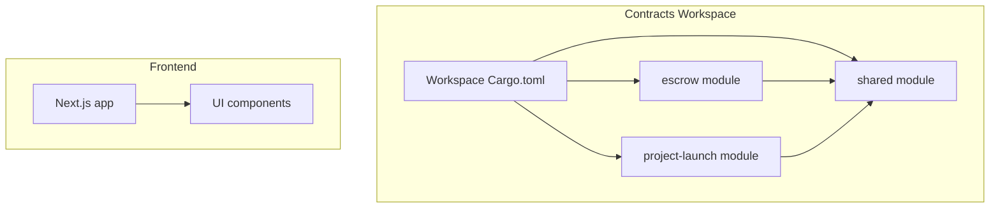
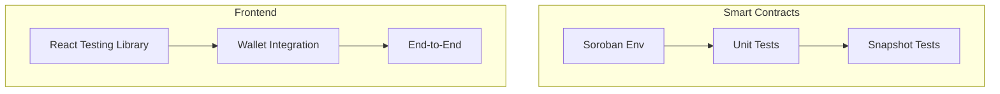
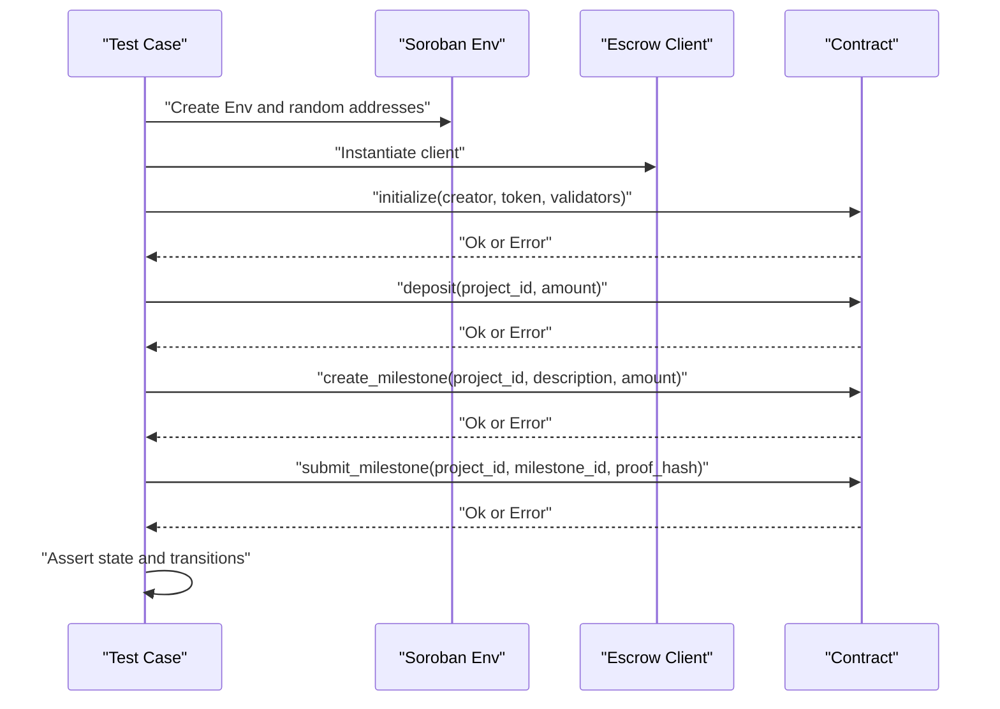
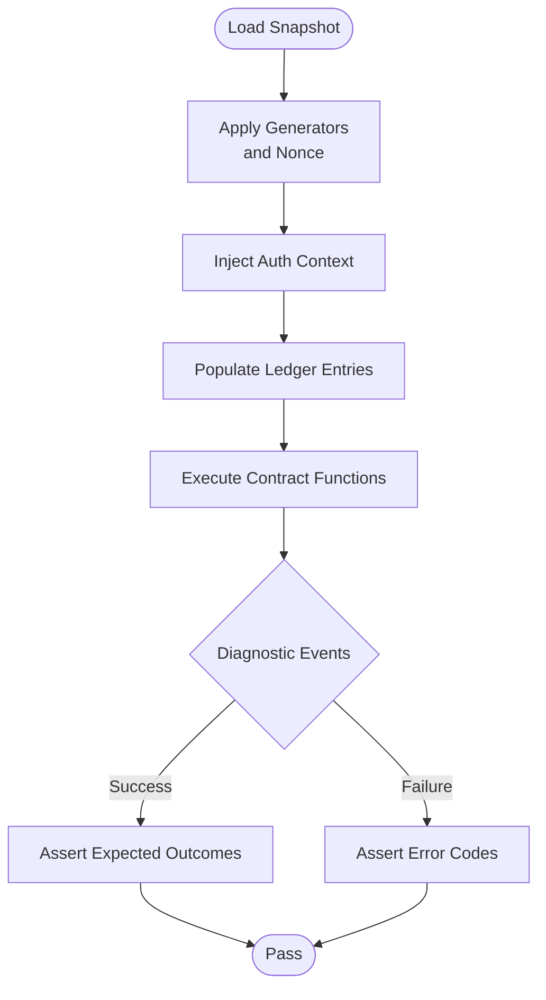
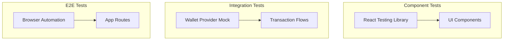
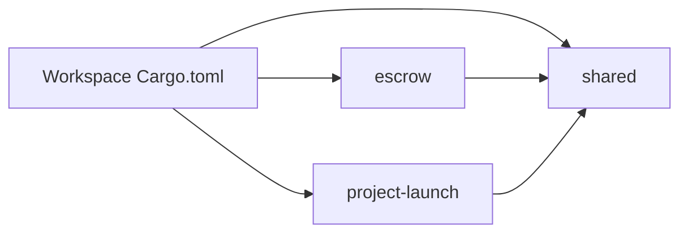

# Testing Strategy

<cite>
**Referenced Files in This Document**
- [Cargo.toml](file://contracts/Cargo.toml)
- [escrow tests.rs](file://contracts/escrow/src/tests.rs)
- [project-launch lib.rs](file://contracts/project-launch/src/lib.rs)
- [test_contribute.1.json](file://contracts/project-launch/test_snapshots/tests/test_contribute.1.json)
- [test_create_project.1.json](file://contracts/project-launch/test_snapshots/tests/test_create_project.1.json)
- [test_initialize.1.json](file://contracts/project-launch/test_snapshots/tests/test_initialize.1.json)
- [shared lib.rs](file://contracts/shared/src/lib.rs)
- [shared errors.rs](file://contracts/shared/src/errors.rs)
- [shared types.rs](file://contracts/shared/src/types.rs)
- [layout.tsx](file://frontend/src/app/layout.tsx)
- [package.json](file://frontend/package.json)
- [ui index.ts](file://frontend/src/components/ui/index.ts)
- [Card.tsx](file://frontend/src/components/ui/Card.tsx)
</cite>

## Table of Contents
1. [Introduction](#introduction)
2. [Project Structure](#project-structure)
3. [Core Components](#core-components)
4. [Architecture Overview](#architecture-overview)
5. [Detailed Component Analysis](#detailed-component-analysis)
6. [Dependency Analysis](#dependency-analysis)
7. [Performance Considerations](#performance-considerations)
8. [Troubleshooting Guide](#troubleshooting-guide)
9. [Conclusion](#conclusion)
10. [Appendices](#appendices)

## Introduction
This document defines a comprehensive multi-layered testing strategy for NovaFund. It covers:
- Smart contract unit testing with the Rust test framework and Soroban SDK
- Integration testing for contract interactions and state snapshots
- Frontend component testing, wallet integration testing, and end-to-end workflows
- Practical examples, mocking techniques for blockchain interactions, and reusable test utilities
- Performance testing considerations, coverage targets, and continuous testing integration guidance

## Project Structure
The repository is organized into two primary areas:
- Smart contracts workspace under contracts/, with multiple modules (escrow, project-launch, profit-distribution, reputation, governance, shared)
- Next.js frontend under frontend/

Key characteristics:
- Contracts use a workspace Cargo.toml with a shared SDK dependency and release profiles
- Contract tests live alongside source code (e.g., escrow/src/tests.rs)
- Snapshot-based integration tests exist for project-launch under test_snapshots/tests/*.json
- Frontend uses Next.js with TypeScript and Tailwind CSS; no explicit test runner is configured in package.json scripts

**Diagram sources**
- [Cargo.toml](file://contracts/Cargo.toml#L1-L38)
- [escrow tests.rs](file://contracts/escrow/src/tests.rs#L1-L362)
- [project-launch lib.rs](file://contracts/project-launch/src/lib.rs#L276-L319)
- [shared lib.rs](file://contracts/shared/src/lib.rs#L1-L20)
- [layout.tsx](file://frontend/src/app/layout.tsx#L1-L29)
- [ui index.ts](file://frontend/src/components/ui/index.ts#L1-L5)

**Section sources**
- [Cargo.toml](file://contracts/Cargo.toml#L1-L38)
- [escrow tests.rs](file://contracts/escrow/src/tests.rs#L1-L362)
- [project-launch lib.rs](file://contracts/project-launch/src/lib.rs#L276-L319)
- [shared lib.rs](file://contracts/shared/src/lib.rs#L1-L20)
- [layout.tsx](file://frontend/src/app/layout.tsx#L1-L29)
- [package.json](file://frontend/package.json#L1-L32)
- [ui index.ts](file://frontend/src/components/ui/index.ts#L1-L5)

## Core Components
This section outlines the testing capabilities and patterns present in the repository and how to extend them.

- Smart contract unit tests
  - Implemented with the Rust test harness and Soroban SDK’s Env and testutils
  - Example patterns include initializing contracts, invoking functions, asserting state, and validating error conditions
  - Representative examples:
    - Contract initialization and state assertions
    - Deposit and milestone lifecycle validations
    - Error handling for invalid inputs and unauthorized actions
  - Reference: [escrow tests.rs](file://contracts/escrow/src/tests.rs#L35-L112), [escrow tests.rs](file://contracts/escrow/src/tests.rs#L182-L232)

- Snapshot-based integration tests
  - JSON artifacts capture ledger state, generator seeds, auth contexts, and diagnostic events for deterministic replay
  - Used to validate end-to-end flows such as initialization, project creation, and contribution
  - References:
    - [test_initialize.1.json](file://contracts/project-launch/test_snapshots/tests/test_initialize.1.json#L1-L296)
    - [test_create_project.1.json](file://contracts/project-launch/test_snapshots/tests/test_create_project.1.json#L1-L248)
    - [test_contribute.1.json](file://contracts/project-launch/test_snapshots/tests/test_contribute.1.json#L1-L248)

- Shared contract utilities
  - Centralized types, errors, and helpers enable consistent testing across modules
  - Examples:
    - Common types for amounts, timestamps, and fee configurations
    - Enumerated error codes for deterministic assertions
  - References: [shared types.rs](file://contracts/shared/src/types.rs#L1-L41), [shared errors.rs](file://contracts/shared/src/errors.rs#L1-L54), [shared lib.rs](file://contracts/shared/src/lib.rs#L16-L20)

- Frontend structure and UI components
  - Next.js app shell and UI primitives (Button, Input, Card, Badge) ready for component testing
  - References: [layout.tsx](file://frontend/src/app/layout.tsx#L1-L29), [ui index.ts](file://frontend/src/components/ui/index.ts#L1-L5), [Card.tsx](file://frontend/src/components/ui/Card.tsx#L1-L18)

**Section sources**
- [escrow tests.rs](file://contracts/escrow/src/tests.rs#L35-L112)
- [escrow tests.rs](file://contracts/escrow/src/tests.rs#L182-L232)
- [test_initialize.1.json](file://contracts/project-launch/test_snapshots/tests/test_initialize.1.json#L1-L296)
- [test_create_project.1.json](file://contracts/project-launch/test_snapshots/tests/test_create_project.1.json#L1-L248)
- [test_contribute.1.json](file://contracts/project-launch/test_snapshots/tests/test_contribute.1.json#L1-L248)
- [shared types.rs](file://contracts/shared/src/types.rs#L1-L41)
- [shared errors.rs](file://contracts/shared/src/errors.rs#L1-L54)
- [shared lib.rs](file://contracts/shared/src/lib.rs#L16-L20)
- [layout.tsx](file://frontend/src/app/layout.tsx#L1-L29)
- [ui index.ts](file://frontend/src/components/ui/index.ts#L1-L5)
- [Card.tsx](file://frontend/src/components/ui/Card.tsx#L1-L18)

## Architecture Overview
The testing architecture spans three layers:
- Unit tests for smart contracts using Soroban SDK Env
- Snapshot-driven integration tests for contract workflows
- Frontend tests for components, wallet interactions, and end-to-end flows

[No sources needed since this diagram shows conceptual workflow, not actual code structure]

## Detailed Component Analysis

### Smart Contract Unit Testing (Escrow)
Patterns demonstrated:
- Environment setup and client instantiation
- Initialization and state verification
- Function invocation with valid and invalid inputs
- Error assertion and boundary checks
- State mutation validations (e.g., deposits, milestone creation, status transitions)

Representative examples:
- Initialize escrow and verify initial state
- Deposit funds and validate totals
- Create milestones and enforce amount limits
- Submit milestones and enforce status transitions
- Negative scenarios: insufficient validators, invalid amounts, not found errors

**Diagram sources**
- [escrow tests.rs](file://contracts/escrow/src/tests.rs#L35-L112)
- [escrow tests.rs](file://contracts/escrow/src/tests.rs#L182-L232)

**Section sources**
- [escrow tests.rs](file://contracts/escrow/src/tests.rs#L35-L112)
- [escrow tests.rs](file://contracts/escrow/src/tests.rs#L182-L232)

### Snapshot-Based Integration Testing (Project Launch)
Snapshot tests capture:
- Ledger state and entries
- Generator seeds and nonce
- Authorization contexts
- Diagnostic events emitted during contract execution

Usage:
- Replay recorded snapshots to validate deterministic outcomes
- Validate error paths and permission failures
- Cross-check event topics and error codes

**Diagram sources**
- [test_initialize.1.json](file://contracts/project-launch/test_snapshots/tests/test_initialize.1.json#L1-L296)
- [test_create_project.1.json](file://contracts/project-launch/test_snapshots/tests/test_create_project.1.json#L1-L248)
- [test_contribute.1.json](file://contracts/project-launch/test_snapshots/tests/test_contribute.1.json#L1-L248)

**Section sources**
- [test_initialize.1.json](file://contracts/project-launch/test_snapshots/tests/test_initialize.1.json#L1-L296)
- [test_create_project.1.json](file://contracts/project-launch/test_snapshots/tests/test_create_project.1.json#L1-L248)
- [test_contribute.1.json](file://contracts/project-launch/test_snapshots/tests/test_contribute.1.json#L1-L248)

### Frontend Testing Strategy
Current state:
- Next.js app shell and UI primitives are present
- No test runner is configured in frontend/package.json scripts

Recommended approach:
- Component testing with React Testing Library
  - Test UI components in isolation (e.g., Button, Input, Card)
  - Mock wallet/provider dependencies to simulate user interactions
  - Validate rendering, props, and basic behavior
- Wallet integration testing
  - Mock provider APIs and signers
  - Test transaction flows (approve, send, confirm) and error handling
- End-to-end testing
  - Use a browser automation tool to navigate pages and trigger actions
  - Mock backend endpoints and blockchain interactions for determinism

[No sources needed since this diagram shows conceptual workflow, not actual code structure]

**Section sources**
- [layout.tsx](file://frontend/src/app/layout.tsx#L1-L29)
- [ui index.ts](file://frontend/src/components/ui/index.ts#L1-L5)
- [Card.tsx](file://frontend/src/components/ui/Card.tsx#L1-L18)
- [package.json](file://frontend/package.json#L1-L32)

## Dependency Analysis
Contract-level dependencies and testing implications:
- Workspace Cargo.toml defines shared SDK dependencies and release profiles
- Shared module centralizes types and errors for cross-contract testing consistency
- Contract tests depend on Env and testutils to simulate ledger and invocations

**Diagram sources**
- [Cargo.toml](file://contracts/Cargo.toml#L1-L38)
- [shared lib.rs](file://contracts/shared/src/lib.rs#L1-L20)

**Section sources**
- [Cargo.toml](file://contracts/Cargo.toml#L1-L38)
- [shared lib.rs](file://contracts/shared/src/lib.rs#L1-L20)

## Performance Considerations
- Smart contracts
  - Use minimal Env setups and deterministic generators in snapshot tests
  - Prefer targeted unit tests for hot paths; reserve snapshot tests for complex workflows
  - Validate gas and ledger footprint by measuring execution time in CI
- Frontend
  - Run component tests in watch mode during development
  - Use lightweight mocks to avoid heavy network calls in unit tests
  - Profile bundle sizes and hydration performance in CI

[No sources needed since this section provides general guidance]

## Troubleshooting Guide
Common issues and resolutions:
- Unauthorized function calls in snapshots
  - Validate auth context injection and account permissions
  - Confirm contract ownership and role checks
  - References: [test_contribute.1.json](file://contracts/project-launch/test_snapshots/tests/test_contribute.1.json#L113-L127), [test_create_project.1.json](file://contracts/project-launch/test_snapshots/tests/test_create_project.1.json#L113-L127), [test_initialize.1.json](file://contracts/project-launch/test_snapshots/tests/test_initialize.1.json#L159-L176)
- Contract initialization failures
  - Ensure minimum thresholds (validators, funding goals) are met
  - Verify ledger timestamps and deadlines
  - References: [project-launch lib.rs](file://contracts/project-launch/src/lib.rs#L286-L319)
- Assertion mismatches in unit tests
  - Confirm Env state and storage keys
  - Validate error codes against shared error enums
  - References: [shared errors.rs](file://contracts/shared/src/errors.rs#L1-L54)

**Section sources**
- [test_contribute.1.json](file://contracts/project-launch/test_snapshots/tests/test_contribute.1.json#L113-L127)
- [test_create_project.1.json](file://contracts/project-launch/test_snapshots/tests/test_create_project.1.json#L113-L127)
- [test_initialize.1.json](file://contracts/project-launch/test_snapshots/tests/test_initialize.1.json#L159-L176)
- [project-launch lib.rs](file://contracts/project-launch/src/lib.rs#L286-L319)
- [shared errors.rs](file://contracts/shared/src/errors.rs#L1-L54)

## Conclusion
NovaFund’s testing foundation combines robust unit tests for smart contracts, deterministic snapshot-based integration tests, and a clear path for frontend component and end-to-end testing. By leveraging shared types and errors, deterministic Env setups, and snapshot replay, teams can maintain high confidence as the codebase evolves. Extending the strategy with CI-friendly coverage reporting, performance baselines, and comprehensive frontend test suites will further strengthen quality assurance.

[No sources needed since this section summarizes without analyzing specific files]

## Appendices

### Practical Examples and Patterns
- Smart contract unit tests
  - Initialize and assert state: [escrow tests.rs](file://contracts/escrow/src/tests.rs#L35-L51)
  - Deposit and milestone creation: [escrow tests.rs](file://contracts/escrow/src/tests.rs#L80-L135)
  - Status transitions and error handling: [escrow tests.rs](file://contracts/escrow/src/tests.rs#L182-L232)
- Snapshot tests
  - Initialization and diagnostics: [test_initialize.1.json](file://contracts/project-launch/test_snapshots/tests/test_initialize.1.json#L75-L122)
  - Project creation and error propagation: [test_create_project.1.json](file://contracts/project-launch/test_snapshots/tests/test_create_project.1.json#L75-L122)
  - Contribution flow and authorization failures: [test_contribute.1.json](file://contracts/project-launch/test_snapshots/tests/test_contribute.1.json#L74-L132)
- Frontend components
  - UI exports and primitives: [ui index.ts](file://frontend/src/components/ui/index.ts#L1-L5), [Card.tsx](file://frontend/src/components/ui/Card.tsx#L1-L18)
  - App shell and routing: [layout.tsx](file://frontend/src/app/layout.tsx#L1-L29)

**Section sources**
- [escrow tests.rs](file://contracts/escrow/src/tests.rs#L35-L51)
- [escrow tests.rs](file://contracts/escrow/src/tests.rs#L80-L135)
- [escrow tests.rs](file://contracts/escrow/src/tests.rs#L182-L232)
- [test_initialize.1.json](file://contracts/project-launch/test_snapshots/tests/test_initialize.1.json#L75-L122)
- [test_create_project.1.json](file://contracts/project-launch/test_snapshots/tests/test_create_project.1.json#L75-L122)
- [test_contribute.1.json](file://contracts/project-launch/test_snapshots/tests/test_contribute.1.json#L74-L132)
- [ui index.ts](file://frontend/src/components/ui/index.ts#L1-L5)
- [Card.tsx](file://frontend/src/components/ui/Card.tsx#L1-L18)
- [layout.tsx](file://frontend/src/app/layout.tsx#L1-L29)