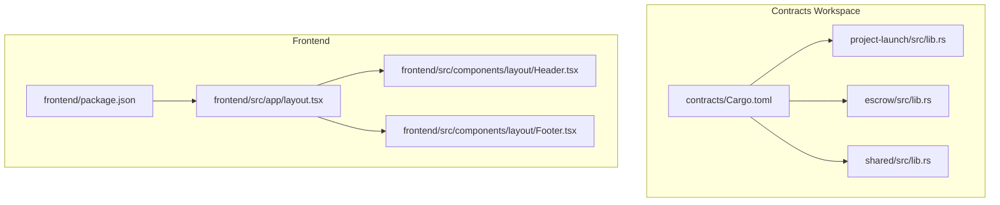
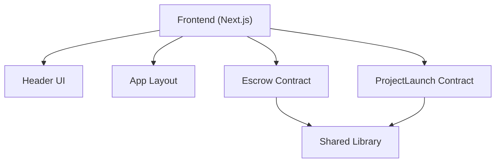
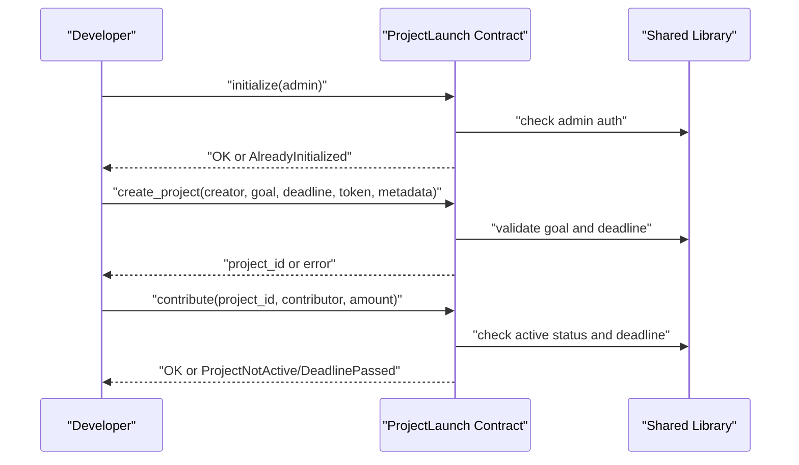
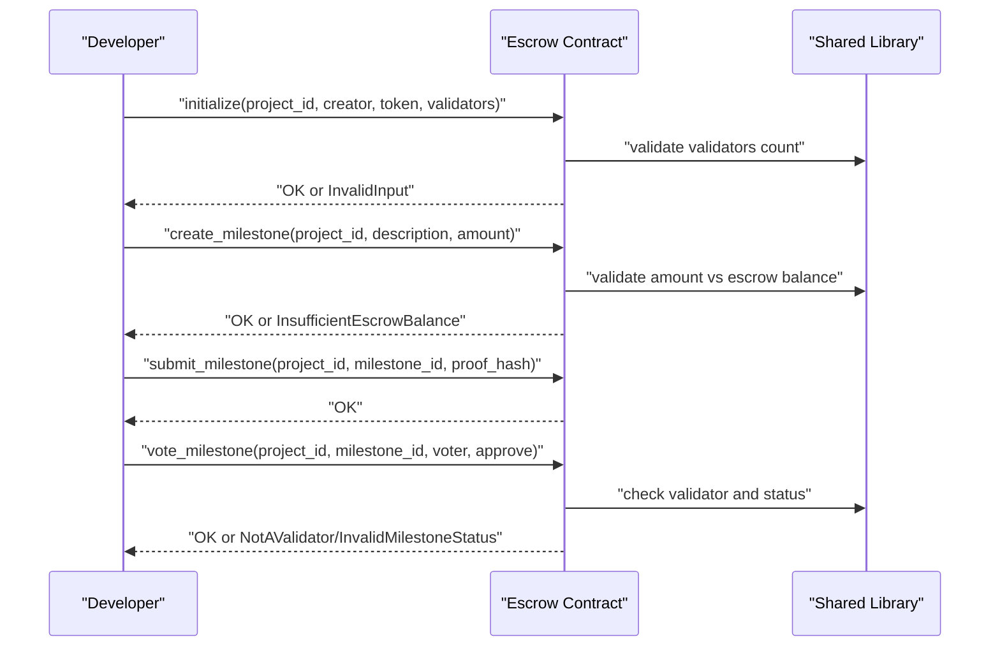
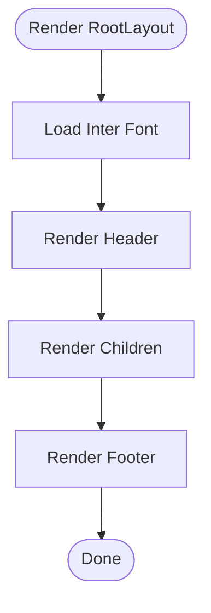
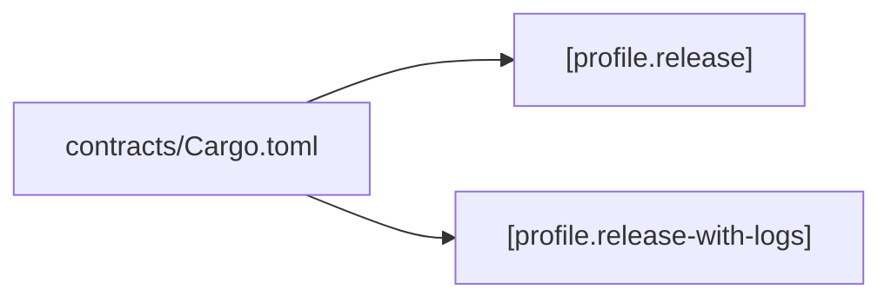

# Troubleshooting and FAQ

<cite>
**Referenced Files in This Document**
- [README.md](file://README.md)
- [SETUP.md](file://contracts/SETUP.md)
- [contracts/Cargo.toml](file://contracts/Cargo.toml)
- [frontend/package.json](file://frontend/package.json)
- [contracts/shared/src/lib.rs](file://contracts/shared/src/lib.rs)
- [contracts/project-launch/src/lib.rs](file://contracts/project-launch/src/lib.rs)
- [contracts/escrow/src/lib.rs](file://contracts/escrow/src/lib.rs)
- [frontend/src/app/layout.tsx](file://frontend/src/app/layout.tsx)
- [frontend/src/components/layout/Header.tsx](file://frontend/src/components/layout/Header.tsx)
- [frontend/src/components/layout/Footer.tsx](file://frontend/src/components/layout/Footer.tsx)
</cite>

## Table of Contents
1. [Introduction](#introduction)
2. [Project Structure](#project-structure)
3. [Core Components](#core-components)
4. [Architecture Overview](#architecture-overview)
5. [Detailed Component Analysis](#detailed-component-analysis)
6. [Dependency Analysis](#dependency-analysis)
7. [Performance Considerations](#performance-considerations)
8. [Troubleshooting Guide](#troubleshooting-guide)
9. [Conclusion](#conclusion)
10. [Appendices](#appendices)

## Introduction
This document provides a comprehensive troubleshooting and FAQ guide for developing and operating NovaFund across smart contracts, frontend, and integration points. It covers:
- Development environment issues (Rust, Node.js, Soroban CLI)
- Contract deployment and initialization failures
- Frontend build and runtime issues
- Wallet integration pitfalls
- Performance optimization for gas, memory, and network latency
- Debugging techniques for blockchain interactions, state synchronization, and event handling
- Frequently asked questions and diagnostic/logging/monitoring guidance

## Project Structure
NovaFund is organized into:
- contracts/: Soroban smart contracts (workspace with multiple packages)
- frontend/: Next.js React application
- Shared libraries and contract-specific modules under contracts/

**Diagram sources**
- [contracts/Cargo.toml](file://contracts/Cargo.toml#L1-L38)
- [contracts/project-launch/src/lib.rs](file://contracts/project-launch/src/lib.rs#L1-L363)
- [contracts/escrow/src/lib.rs](file://contracts/escrow/src/lib.rs#L1-L367)
- [contracts/shared/src/lib.rs](file://contracts/shared/src/lib.rs#L1-L20)
- [frontend/package.json](file://frontend/package.json#L1-L32)
- [frontend/src/app/layout.tsx](file://frontend/src/app/layout.tsx#L1-L29)
- [frontend/src/components/layout/Header.tsx](file://frontend/src/components/layout/Header.tsx#L1-L20)
- [frontend/src/components/layout/Footer.tsx](file://frontend/src/components/layout/Footer.tsx#L1-L15)

**Section sources**
- [README.md](file://README.md#L260-L313)
- [contracts/Cargo.toml](file://contracts/Cargo.toml#L1-L38)
- [frontend/package.json](file://frontend/package.json#L1-L32)

## Core Components
- Contracts workspace configured with a release profile optimized for WASM size and LTO.
- Shared library exposes common types, errors, events, utilities, and constants used across contracts.
- ProjectLaunch contract manages project lifecycle, contributions, and emits events.
- Escrow contract manages milestone-based fund locking and release with validator approvals.
- Frontend uses Next.js with a basic layout and UI primitives.

Key implementation references:
- Shared library exports and helpers: [contracts/shared/src/lib.rs](file://contracts/shared/src/lib.rs#L1-L20)
- ProjectLaunch contract functions and validations: [contracts/project-launch/src/lib.rs](file://contracts/project-launch/src/lib.rs#L72-L248)
- Escrow contract initialization, milestone creation, and voting: [contracts/escrow/src/lib.rs](file://contracts/escrow/src/lib.rs#L22-L307)

**Section sources**
- [contracts/Cargo.toml](file://contracts/Cargo.toml#L25-L37)
- [contracts/shared/src/lib.rs](file://contracts/shared/src/lib.rs#L1-L20)
- [contracts/project-launch/src/lib.rs](file://contracts/project-launch/src/lib.rs#L72-L248)
- [contracts/escrow/src/lib.rs](file://contracts/escrow/src/lib.rs#L22-L307)

## Architecture Overview
High-level interactions between frontend, contracts, and the Stellar network.

**Diagram sources**
- [frontend/src/components/layout/Header.tsx](file://frontend/src/components/layout/Header.tsx#L1-L20)
- [frontend/src/app/layout.tsx](file://frontend/src/app/layout.tsx#L1-L29)
- [contracts/escrow/src/lib.rs](file://contracts/escrow/src/lib.rs#L1-L367)
- [contracts/project-launch/src/lib.rs](file://contracts/project-launch/src/lib.rs#L1-L363)
- [contracts/shared/src/lib.rs](file://contracts/shared/src/lib.rs#L1-L20)

## Detailed Component Analysis

### ProjectLaunch Contract: Lifecycle and Contribution Flow
Common issues and resolutions:
- Initialization must be called once and only once; subsequent calls should fail.
- Creating projects requires meeting minimum funding goals and valid deadlines.
- Contributions must be made while the project is active and before the deadline.
- Exceeding maximum contribution sizes or invalid project IDs will cause errors.

**Diagram sources**
- [contracts/project-launch/src/lib.rs](file://contracts/project-launch/src/lib.rs#L74-L212)
- [contracts/shared/src/lib.rs](file://contracts/shared/src/lib.rs#L1-L20)

**Section sources**
- [contracts/project-launch/src/lib.rs](file://contracts/project-launch/src/lib.rs#L72-L248)

### Escrow Contract: Milestone Approval and Fund Release
Common issues and resolutions:
- Initializing an escrow requires a minimum number of validators and uniqueness checks.
- Creating milestones validates amounts against the escrow balance and increments counters.
- Validator votes must be cast by authorized validators and reach the threshold to approve or reject.
- Releasing funds updates the escrow’s released amount safely.

**Diagram sources**
- [contracts/escrow/src/lib.rs](file://contracts/escrow/src/lib.rs#L31-L307)
- [contracts/shared/src/lib.rs](file://contracts/shared/src/lib.rs#L1-L20)

**Section sources**
- [contracts/escrow/src/lib.rs](file://contracts/escrow/src/lib.rs#L22-L346)

### Frontend Layout and Navigation
Common issues and resolutions:
- Layout renders header and footer consistently; ensure fonts and styles load properly.
- Buttons and navigation rely on UI primitives; verify Tailwind and Next.js builds succeed.

**Diagram sources**
- [frontend/src/app/layout.tsx](file://frontend/src/app/layout.tsx#L14-L28)
- [frontend/src/components/layout/Header.tsx](file://frontend/src/components/layout/Header.tsx#L4-L16)
- [frontend/src/components/layout/Footer.tsx](file://frontend/src/components/layout/Footer.tsx#L3-L11)

**Section sources**
- [frontend/src/app/layout.tsx](file://frontend/src/app/layout.tsx#L1-L29)
- [frontend/src/components/layout/Header.tsx](file://frontend/src/components/layout/Header.tsx#L1-L20)
- [frontend/src/components/layout/Footer.tsx](file://frontend/src/components/layout/Footer.tsx#L1-L15)

## Dependency Analysis
- Contracts workspace uses a unified release profile enabling LTO and optimized WASM size.
- Frontend depends on Next.js, React, and Tailwind; TypeScript and ESLint are configured.

**Diagram sources**
- [contracts/Cargo.toml](file://contracts/Cargo.toml#L25-L37)

**Section sources**
- [contracts/Cargo.toml](file://contracts/Cargo.toml#L1-L38)
- [frontend/package.json](file://frontend/package.json#L1-L32)

## Performance Considerations
Smart contracts (gas and memory):
- Prefer minimal storage reads/writes and efficient data structures.
- Use checked arithmetic to prevent overflow panics and reduce revert cost.
- Keep WASM size small; enable LTO and release profiles during build.
- Emit only necessary events; avoid excessive logs in production builds.

Frontend (build and runtime):
- Use Next.js static generation and server-side rendering where appropriate.
- Minimize payload sizes; lazy-load heavy components.
- Optimize images and fonts; leverage Tailwind utilities efficiently.
- Monitor bundle size and remove unused dependencies.

[No sources needed since this section provides general guidance]

## Troubleshooting Guide

### Development Environment Issues

- Rust version mismatch
  - Symptom: Build fails with toolchain errors.
  - Resolution: Ensure Rust 1.75+ is installed and the wasm32-unknown-unknown target is added.
  - References:
    - [SETUP.md](file://contracts/SETUP.md#L25-L48)
    - [contracts/Cargo.toml](file://contracts/Cargo.toml#L18-L18)

- Node.js version mismatch
  - Symptom: npm/yarn/pnpm fails or scripts do not run.
  - Resolution: Use Node.js v18+ as documented.
  - References:
    - [README.md](file://README.md#L207-L211)
    - [frontend/package.json](file://frontend/package.json#L1-L32)

- Soroban CLI installation/configuration errors
  - Symptom: Commands not found or network configuration fails.
  - Resolution: Install the CLI with the recommended features and configure networks as shown.
  - References:
    - [README.md](file://README.md#L209-L209)
    - [SETUP.md](file://contracts/SETUP.md#L39-L48)
    - [contracts/README.md](file://contracts/README.md#L74-L89)

- WASM build failures
  - Symptom: cargo build fails for wasm target.
  - Resolution: Verify the wasm32-unknown-unknown target is installed and use the release profile.
  - References:
    - [SETUP.md](file://contracts/SETUP.md#L43-L44)
    - [SETUP.md](file://contracts/SETUP.md#L82-L87)
    - [contracts/Cargo.toml](file://contracts/Cargo.toml#L25-L33)

### Contract Deployment and Initialization Failures

- Contract not initialized
  - Symptom: Functions return not initialized or admin checks fail.
  - Resolution: Call initialize with a valid admin address once.
  - References:
    - [contracts/project-launch/src/lib.rs](file://contracts/project-launch/src/lib.rs#L74-L85)
    - [contracts/escrow/src/lib.rs](file://contracts/escrow/src/lib.rs#L31-L70)

- Invalid input or insufficient balance during milestone creation
  - Symptom: Error indicating insufficient escrow balance or invalid input.
  - Resolution: Ensure milestone amounts do not exceed the escrow total and inputs are positive.
  - References:
    - [contracts/escrow/src/lib.rs](file://contracts/escrow/src/lib.rs#L126-L134)
    - [contracts/escrow/src/lib.rs](file://contracts/escrow/src/lib.rs#L85-L94)

- Validator-related errors
  - Symptom: NotAValidator or AlreadyVoted errors.
  - Resolution: Confirm the voter is in the validator list and has not voted yet.
  - References:
    - [contracts/escrow/src/lib.rs](file://contracts/escrow/src/lib.rs#L232-L248)

- Project creation/validation errors
  - Symptom: Invalid funding goal or invalid deadline.
  - Resolution: Ensure funding goal meets minimums and deadline is within allowed range.
  - References:
    - [contracts/project-launch/src/lib.rs](file://contracts/project-launch/src/lib.rs#L96-L111)

### Frontend Build and Runtime Errors

- Next.js dev/build failures
  - Symptom: Build errors or dev server not starting.
  - Resolution: Install dependencies, verify TypeScript and ESLint configurations, and run dev/build commands.
  - References:
    - [frontend/package.json](file://frontend/package.json#L5-L10)
    - [README.md](file://README.md#L364-L378)

- Layout and UI rendering issues
  - Symptom: Missing fonts, broken navigation, or missing footer.
  - Resolution: Ensure fonts are loaded and components render within the layout.
  - References:
    - [frontend/src/app/layout.tsx](file://frontend/src/app/layout.tsx#L14-L28)
    - [frontend/src/components/layout/Header.tsx](file://frontend/src/components/layout/Header.tsx#L4-L16)
    - [frontend/src/components/layout/Footer.tsx](file://frontend/src/components/layout/Footer.tsx#L3-L11)

### Wallet Integration Issues

- Wallet connection mock behavior
  - Symptom: Connect button present but no real wallet integration.
  - Resolution: Replace mock connect with a real wallet provider (e.g., Freighter/XUMM) and implement proper auth flows.
  - References:
    - [frontend/src/components/layout/Header.tsx](file://frontend/src/components/layout/Header.tsx#L10-L12)

### Performance Optimization Guidance

- Gas optimization (smart contracts)
  - Prefer minimal storage operations and efficient data structures.
  - Use checked arithmetic and avoid unnecessary reverts.
  - Reference:
    - [contracts/Cargo.toml](file://contracts/Cargo.toml#L25-L33)

- Memory management (WASM)
  - Keep allocations small; reuse buffers where possible.
  - Reference:
    - [contracts/Cargo.toml](file://contracts/Cargo.toml#L25-L33)

- Network latency reduction (frontend)
  - Use server-side rendering, static generation, and CDN delivery.
  - Minimize payload sizes and leverage caching.
  - References:
    - [frontend/package.json](file://frontend/package.json#L1-L32)

### Debugging Techniques

- Blockchain interactions
  - Use Soroban CLI to invoke and inspect contracts; verify ledger timestamps and balances.
  - References:
    - [contracts/README.md](file://contracts/README.md#L96-L103)
    - [contracts/escrow/src/lib.rs](file://contracts/escrow/src/lib.rs#L313-L345)

- State synchronization issues
  - Ensure storage keys are consistent and state transitions are atomic.
  - References:
    - [contracts/project-launch/src/lib.rs](file://contracts/project-launch/src/lib.rs#L180-L203)
    - [contracts/escrow/src/lib.rs](file://contracts/escrow/src/lib.rs#L354-L365)

- Event handling problems
  - Verify event publishing and consumption; confirm event topics match expectations.
  - References:
    - [contracts/project-launch/src/lib.rs](file://contracts/project-launch/src/lib.rs#L143-L146)
    - [contracts/escrow/src/lib.rs](file://contracts/escrow/src/lib.rs#L66-L68)

### Frequently Asked Questions

- What Node.js and Rust versions are supported?
  - Supported versions are documented in the project README and frontend package configuration.
  - References:
    - [README.md](file://README.md#L207-L211)
    - [frontend/package.json](file://frontend/package.json#L21-L29)

- How do I optimize WASM size and gas usage?
  - Use the release profile with LTO and enable optimizations as shown in the contracts workspace configuration.
  - References:
    - [contracts/Cargo.toml](file://contracts/Cargo.toml#L25-L33)

- How do I deploy contracts to testnet?
  - Configure the testnet network, generate/fund a deployer account, and deploy using the CLI.
  - References:
    - [contracts/README.md](file://contracts/README.md#L74-L89)

- How do I initialize contracts after deployment?
  - Invoke the initialize function with required parameters as shown in the documentation.
  - References:
    - [contracts/README.md](file://contracts/README.md#L96-L103)

- How do I verify my development environment is ready?
  - Run cargo check and ensure the wasm target is installed.
  - References:
    - [SETUP.md](file://contracts/SETUP.md#L50-L55)
    - [SETUP.md](file://contracts/SETUP.md#L43-L44)

### Diagnostic Tools, Logging, and Monitoring

- Contract diagnostics
  - Use cargo check, cargo clippy, and cargo test to catch issues early.
  - References:
    - [SETUP.md](file://contracts/SETUP.md#L112-L122)
    - [contracts/README.md](file://contracts/README.md#L49-L56)

- Frontend diagnostics
  - Run linting, type checking, and build previews to catch issues.
  - References:
    - [frontend/package.json](file://frontend/package.json#L9-L9)
    - [README.md](file://README.md#L382-L391)
    - [README.md](file://README.md#L375-L377)

- Monitoring and observability
  - Integrate RPC monitoring and event indexing for on-chain activity.
  - References:
    - [README.md](file://README.md#L185-L190)

## Conclusion
By following the troubleshooting procedures, performance guidance, and diagnostic strategies outlined above, you can resolve most development and operational issues in NovaFund. Ensure your environment is correctly configured, contracts are initialized and deployed according to the documented flows, and the frontend is built and tested rigorously. For persistent issues, leverage the referenced commands and configurations to isolate and fix problems efficiently.

## Appendices

### Quick Reference: Common Commands
- Build contracts: [SETUP.md](file://contracts/SETUP.md#L82-L87)
- Test contracts: [SETUP.md](file://contracts/SETUP.md#L95-L98)
- Deploy to testnet: [contracts/README.md](file://contracts/README.md#L84-L89)
- Initialize contracts: [contracts/README.md](file://contracts/README.md#L96-L103)
- Frontend dev/build: [README.md](file://README.md#L364-L378)
- Lint/type/format: [README.md](file://README.md#L382-L391)